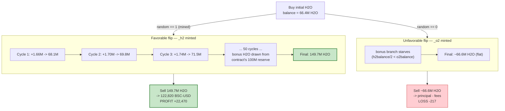
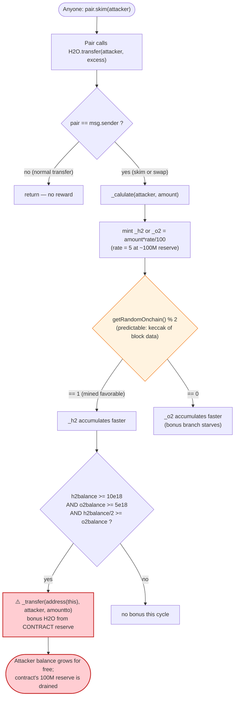

# H2O Token Exploit — `skim()`-Triggered Self-Minting Reward Drain

> **Reproduction:** the PoC compiles & runs in an isolated Foundry project at
> [this project folder](.) (the umbrella DeFiHackLabs repo does not whole-compile,
> so this PoC was extracted into a standalone project).
> Full verbose trace: [output.txt](output.txt).
> Verified vulnerable source: [Token.sol](sources/Token_e9c4D4/Token.sol).

---

## Key info

| | |
|---|---|
| **Loss** | **22,470.89 USD** (≈22,470 BSC-USD), drained from the H2O contract's own reserve via the H2O/BSC-USD PancakeSwap V2 pair |
| **Vulnerable contract** | `H2O` (`Token`) — [`0xe9c4D4f095C7943a9ef5EC01AfD1385D011855A1`](https://bscscan.com/address/0xe9c4D4f095C7943a9ef5EC01AfD1385D011855A1#code) |
| **Victim / pool** | H2O/BSC-USD PancakeSwap V2 pair — `0x42717781D93197247907F82482AE1d35D7BC101B` (and the H2O contract's own 100M-token reserve) |
| **Flash-loan source** | PancakeSwap V3 BSC-USD/USDC pool — `0x4f31Fa980a675570939B737Ebdde0471a4Be40Eb` |
| **Attacker EOA** | [`0x8842dd26fd301c74afc4df12e9cdabd9db107d1e`](https://bscscan.com/address/0x8842dd26fd301c74afc4df12e9cdabd9db107d1e) |
| **Attacker contract** | [`0x03ca8b574dd4250576f7bccc5707e6214e8c6e0d`](https://bscscan.com/address/0x03ca8b574dd4250576f7bccc5707e6214e8c6e0d) |
| **Attack tx (profit)** | [`0x994abe7906a4a955c103071221e5eaa734a30dccdcdaac63496ece2b698a0fc3`](https://bscscan.com/tx/0x994abe7906a4a955c103071221e5eaa734a30dccdcdaac63496ece2b698a0fc3) |
| **Chain / block / date** | BSC / 47,454,899 / March 2025 |
| **Compiler** | Solidity v0.8.29, optimizer **200 runs** |
| **Bug class** | Fee-on-transfer reward logic triggered on AMM `skim()` → unbounded self-minting / reserve drain (plus weak on-chain randomness) |

> **Naming note:** the PoC labels token `0x55d398326f99059fF775485246999027B3197955` "BUSD". On BSC that address is actually **Binance-Peg BSC-USD (USDT)**. The numbers are 18-decimals stablecoin either way; this report uses "BSC-USD".

---

## TL;DR

`H2O` is a "reflection"-style token. On every `transfer` **where the sender is the AMM pair**, it runs
a hidden reward routine `_calulate()` ([Token.sol:509-562](sources/Token_e9c4D4/Token.sol#L509-L562))
that (a) mints side-tokens `_h2`/`_o2` to the recipient and (b), once the recipient has accumulated
enough of both, **transfers bonus H2O out of the H2O contract's own 100,000,000-token reserve to that
recipient** ([:547](sources/Token_e9c4D4/Token.sol#L547) / [:558](sources/Token_e9c4D4/Token.sol#L558)).

PancakeSwap's `pair.skim(to)` calls `H2O.transfer(to, excess)` **with `msg.sender == pair`**
([PancakePair.sol:483-488](sources/PancakePair_427177/PancakePair.sol#L483-L488)). So the attacker can
trigger `_calulate()` at will, on themselves, for free:

1. Flash-borrow 100,000 BSC-USD and buy ~66.4M H2O from the V2 pair.
2. Repeat 50 times: `H2O.transfer(pair, balance)` then `pair.skim(attacker)`. Each `skim` re-sends the
   same H2O back to the attacker **and fires `_calulate(attacker, amount)`**, which mints reward tokens
   and dispenses bonus H2O from the contract reserve. The attacker's H2O balance climbs from
   **66.4M → 149.7M** (+125%).
3. Swap the inflated 149.7M H2O back to BSC-USD, repay the flash loan, keep the difference.

The reward branch only dispenses bonus H2O when the side-token `_h2` accumulates faster than `_o2`,
which depends on a coin-flip `getRandomOnchain() % 2`
([:528](sources/Token_e9c4D4/Token.sol#L528)). That "random" is just
`keccak256(block.timestamp, msg.sender, blockhash(block-1))` — **fully predictable**, so the attacker
mined an entry timestamp landing on the favorable side (the live attacker's tx 2 & 3 reverted on the
wrong flip before tx 4 succeeded). Net profit on the successful run: **+22,470.89 BSC-USD**.

---

## Background — what H2O does

`H2O` ([source](sources/Token_e9c4D4/Token.sol)) is an 18-decimal ERC20 with `_totalSupply = 200,000,000`,
split at deploy 50/50 between the owner and the contract itself
([Token.sol:414-415](sources/Token_e9c4D4/Token.sol#L414-L415)) — i.e. **the contract holds 100,000,000 H2O**.
It hard-codes its own PancakeSwap V2 pair against BSC-USD ([:417-418](sources/Token_e9c4D4/Token.sol#L417-L418))
and references two satellite tokens `_h2`/`_o2` that it can `mint`/`burn`
([:407-408](sources/Token_e9c4D4/Token.sol#L407-L408)).

The "DeFi-ish" feature bolted on is a per-buy reward: when a user **buys H2O from the pair**, the token
mints them "water-cycle" side tokens (`H2`/`O2`) and, once they hold enough of both, the contract
"condenses" them back into bonus H2O drawn from its own reserve. The intended trigger is a normal pair
→ buyer transfer. The fatal detail is that the trigger condition is simply `pair == msg.sender`, and
`skim()` satisfies it just as well as a swap does.

On-chain facts at the fork block (read from the trace):

| Parameter | Value |
|---|---|
| `_totalSupply` | 200,000,000 H2O |
| **H2O held by the H2O contract itself** (`balanceOf(this)`) | **≈100,000,000 H2O** ← the prize |
| V2 pair reserves (token0 = BSC-USD, token1 = H2O) | ≈150,361 BSC-USD / ≈33.3M H2O |
| reward rate band at `balanceOf(this)` ≈100M | `rate = 5` (caps at `<=100M`, see [:524-525](sources/Token_e9c4D4/Token.sol#L524-L525)) |

---

## The vulnerable code

### 1. `transfer` runs `_calulate` whenever the pair is the sender

```solidity
function transfer(address to, uint256 amount) public virtual override returns (bool) {
    address owner = msg.sender;
    _spendAllowance(owner, to, 0);
    _transfer(owner, to, amount);
    if(pair == msg.sender){      // ⚠️ pair is the sender during skim() AND during swap()
        _calulate(to,amount);    // ⚠️ reward routine fired for the recipient
    }
    return true;
}
```
[Token.sol:476-484](sources/Token_e9c4D4/Token.sol#L476-L484)

### 2. `_calulate` mints side-tokens and dispenses bonus H2O from the contract reserve

```solidity
function _calulate(address to,uint256 amount ) internal {
    uint256 h2obalance = balanceOf(address(this));   // ≈100M → rate = 5
    uint256 rate = 0;
    if(h2obalance<=20_000_000*10**18){ rate = 1; }
    else if(h2obalance<=40_000_000*10**18){ rate = 2; }
    else if(h2obalance<=60_000_000*10**18){ rate = 3; }
    else if(h2obalance<=80_000_000*10**18){ rate = 4; }
    else if(h2obalance<=100_000_000*10**18){ rate = 5; }

    uint256 random = getRandomOnchain()%2;            // ⚠️ predictable coin flip
    if(random == 1){      IBEP20(_h2).mint(to,amount*rate/100); }   // mint H2 reward
    else if(random == 0){ IBEP20(_o2).mint(to,amount*rate/100); }   // mint O2 reward

    uint256 h2balance = IBEP20(_h2).balanceOf(to);
    uint256 o2balance = IBEP20(_o2).balanceOf(to);

    if(h2balance>=10*10**18 && o2balance>=5*10**18){     // both side-tokens present
        if(h2balance/2>=o2balance){
            IBEP20(_o2).burn(to,o2balance);
            IBEP20(_h2).burn(to,o2balance*2);
            uint256 amountto = o2balance;
            if(amountto>=h2obalance){ amountto = h2obalance; }
            _transfer(address(this),to, amountto);       // ⚠️ bonus H2O from CONTRACT reserve
        } else if(h2balance/2<o2balance){
            IBEP20(_o2).burn(to,h2balance/2);
            IBEP20(_h2).burn(to,h2balance);
            uint256 amountto = h2balance/2;
            if(amountto>=h2obalance){ amountto = h2obalance; }
            _transfer(address(this),to, amountto);       // ⚠️ bonus H2O from CONTRACT reserve
        }
    }
}
```
[Token.sol:509-562](sources/Token_e9c4D4/Token.sol#L509-L562)

### 3. The "randomness" is a pure function of public block data

```solidity
function getRandomOnchain() public view returns(uint256){
    bytes32 randomBytes = keccak256(abi.encodePacked(block.timestamp, msg.sender, blockhash(block.number-1)));
    return uint256(randomBytes);
}
```
[Token.sol:564-569](sources/Token_e9c4D4/Token.sol#L564-L569)

### 4. `skim()` is the free trigger

```solidity
function skim(address to) external lock {
    address _token0 = token0;
    address _token1 = token1;
    _safeTransfer(_token0, to, IERC20(_token0).balanceOf(address(this)).sub(reserve0));
    _safeTransfer(_token1, to, IERC20(_token1).balanceOf(address(this)).sub(reserve1)); // → H2O.transfer(to, excess), msg.sender == pair
}
```
[PancakePair.sol:483-488](sources/PancakePair_427177/PancakePair.sol#L483-L488)

---

## Root cause — why it was possible

The protocol conflates **"H2O left the pair toward a user"** with **"a user bought H2O"** and pays a
reward on the former. But "H2O leaving the pair" is something *anyone* can cause without buying anything:

> `pair.skim(attacker)` makes the pair call `H2O.transfer(attacker, excess)` with `msg.sender == pair`.
> The token sees `pair == msg.sender`, concludes "this is a buy", and runs `_calulate`, minting reward
> tokens and ultimately **transferring real H2O out of the contract's own 100M reserve to the attacker.**

The composite of design errors:

1. **Reward keyed only on `pair == msg.sender`.** Any pair-initiated transfer — `swap`, `skim`, even
   `sync`-adjacent flows — counts as a rewarded "buy". `skim()` is permissionless and free, so the
   attacker manufactures unlimited rewarded transfers without ever paying for H2O.
2. **The reward is a real asset transfer from the contract reserve, not a paper rebase.** `_calulate`
   moves up to `amountto` H2O from `balanceOf(this)` to the recipient on every favorable call
   ([:547](sources/Token_e9c4D4/Token.sol#L547)/[:558](sources/Token_e9c4D4/Token.sol#L558)). With the
   contract pre-funded with 100M H2O, there is a large pool to drain.
3. **Reward sizing scales with the transferred amount and the (large) reserve.** `rate = 5` while the
   reserve is ≈100M, and the side-token mint is `amount*rate/100`. Because the attacker transfers their
   *entire* (growing) balance each cycle, the reward compounds: each cycle's larger balance produces a
   larger reward, which produces a larger balance.
4. **The "anti-bot" coin flip is fake randomness.** `getRandomOnchain` is a deterministic hash of
   `block.timestamp`, `msg.sender`, and the previous blockhash — all known/grindable. The attacker
   only had to choose an entry timestamp where `random == 1` (so `_h2` is minted and the
   `h2balance/2 >= o2balance` bonus branch keeps firing). Two of the live attempts (tx 2 & tx 3)
   reverted on the wrong flip; tx 4 hit the favorable one.

Note also the bespoke `_transfer` access guard ([:572-605](sources/Token_e9c4D4/Token.sol#L572-L605)):
when `address(this).balance >= 1` it requires the sender be the contract, the pair, the routers, or a
magic `sha256(from) == max` address. This restricts *who can move H2O* but does nothing to stop the
*reward routine itself* from handing out the contract's reserve — and the attacker only ever sends H2O
through the pair (skim) and the router, both whitelisted.

---

## Preconditions

- The H2O contract holds a large H2O reserve (`balanceOf(this)` ≈100M) for `_calulate` to dispense
  bonus H2O from. (Funded at deploy with `_totalSupply/2`.)
- An H2O/BSC-USD PancakeSwap V2 pair with enough liquidity to (a) buy the initial H2O and (b) sell the
  inflated H2O back into stablecoin.
- Working capital in BSC-USD to seed the buy — fully recovered intra-transaction, hence
  **flash-loanable** (the live attacker flash-borrowed 100,000 BSC-USD from a Pancake V3 pool; the PoC
  also `deal`s 300 BSC-USD of seed working capital).
- An entry `block.timestamp` for which `keccak256(timestamp, pair, blockhash) % 2 == 1`. The PoC mines
  this with `_setRandomIn(1)` ([H2O_exp.sol:50-66](test/H2O_exp.sol#L50-L66)); on the wrong flip the
  reward branch starves and the run is unprofitable (the PoC also demonstrates the losing `random==0`
  run, which nets −217 BSC-USD).

---

## Attack walkthrough (with on-chain numbers from the trace)

All figures are taken directly from the verbose trace
([output.txt](output.txt)) for the **profitable run** (`_setRandomIn(1)`, second `attack()`).
The pair's `token0 = BSC-USD`, `token1 = H2O`.

| # | Step | Attacker H2O balance | Notes |
|---|------|---------------------:|-------|
| 0 | Flash-borrow **100,000 BSC-USD** from Pancake V3 pool `0x4f31…40Eb` (fee0 = **50** BSC-USD) | 0 | callback entered with ≈100,082 BSC-USD on hand |
| 1 | `swapExactTokensForTokensSupportingFeeOnTransferTokens(100,082 BSC-USD → H2O)` via Pancake V2 | **66,439,209** | buys H2O from the pair (post-swap Sync: 150,311 BSC-USD / 33.4M H2O) |
| 2 | Cycle ×1: `H2O.transfer(pair, bal)` + `pair.skim(self)` | **68,100,189** | skim re-sends H2O **and** fires `_calulate`; +1.66M bonus H2O from reserve |
| 3 | Cycle ×2 | **69,802,694** | +1.70M |
| 4 | Cycle ×3 | **71,547,761** | +1.74M |
| … | … cycles 4–50 (compounding) … | … | each favorable cycle dispenses bonus H2O from the contract's 100M reserve |
| 5 | After 50 cycles | **149,719,651** | balance grew +125% from step 1 with zero additional capital |
| 6 | `swapExactTokensForTokensSupportingFeeOnTransferTokens(149,719,651 H2O → BSC-USD)` | 0 | pulls **122,820.89 BSC-USD** out of the V2 pair |
| 7 | Repay flash loan: transfer **100,050 BSC-USD** to the V3 pool | — | principal + 50 fee |
| 8 | **Final attacker BSC-USD** | — | **22,770.89** held; minus 300 seed ⇒ **profit +22,470.89 BSC-USD** |

For contrast, the **losing run** (`_setRandomIn(0)`, first `attack()`): the 50 transfer+skim cycles
left the H2O balance essentially flat at **66,561,537** (the `_o2`-mint branch never satisfies the
`h2balance/2 >= o2balance` bonus condition), so the H2O→BSC-USD swap only returned the principal minus
fees and slippage: **−217.32 BSC-USD**.

### Per-cycle mechanics (why the balance grows)

Each cycle is `H2O.transfer(pair, bal)` then `pair.skim(self)`:

1. `transfer(pair, bal)` raises the pair's H2O balance `bal` above `reserve1` (the pair is the *recipient*,
   so `pair != msg.sender`, no reward fires).
2. `skim(self)` makes the pair send the excess `bal` back via `H2O.transfer(self, bal)`. Now
   `msg.sender == pair`, so `_calulate(self, bal)` runs:
   - mints `_h2 = bal * 5 / 100` to the attacker (favorable `random==1` branch),
   - with `_h2`/`_o2` now both above threshold and `h2balance/2 >= o2balance`, burns side-tokens and
     **`_transfer(address(this), self, amountto)`** — bonus H2O paid from the contract's reserve.

The attacker walks away with `bal` (returned by skim) **plus** `amountto` (bonus from the reserve), so
the balance ratchets up ≈1.7M H2O per cycle (≈+2.5% of balance), compounding over 50 cycles to +125%.

### Profit accounting (BSC-USD)

| Direction | Amount |
|---|---:|
| Borrowed (flash) | 100,000.00 |
| Seed working capital (PoC `deal`) | 300.00 |
| Received — sell 149.7M H2O → BSC-USD | 122,820.89 |
| Repaid — flash principal + fee | 100,050.00 |
| **Final attacker balance** | **22,770.89** |
| **Net profit (− seed)** | **+22,470.89** |

This matches the PoC console output `Profit: 22470891449589918819435` (≈22,470.89e18) and the reported
loss of **~$22,470**.

---

## Diagrams

### Sequence of the attack (profitable run)

```mermaid
sequenceDiagram
    autonumber
    actor A as "Attacker contract"
    participant V3 as "Pancake V3 pool (flash)"
    participant R as "Pancake V2 Router"
    participant P as "H2O/BSC-USD V2 Pair"
    participant H as "H2O Token"

    Note over H: Contract holds ~100,000,000 H2O reserve

    A->>V3: flash(100,000 BSC-USD)
    V3-->>A: 100,000 BSC-USD (fee 50)

    rect rgb(227,242,253)
    Note over A,H: Step 1 — buy initial H2O
    A->>R: swap 100,082 BSC-USD -> H2O
    R->>P: swap()
    P-->>A: 66,439,209 H2O
    end

    rect rgb(255,235,238)
    Note over A,H: Steps 2-5 — 50x transfer+skim (compounding)
    loop 50 times
        A->>H: transfer(pair, bal)
        Note over H: pair is recipient, no reward
        A->>P: skim(attacker)
        P->>H: transfer(attacker, bal)  [msg.sender == pair]
        H->>H: _calulate(attacker, bal)
        H->>H: mint _h2 = bal*5/100; burn side-tokens
        H-->>A: bonus H2O from contract reserve
    end
    Note over A: H2O balance 66.4M -> 149.7M
    end

    rect rgb(232,245,233)
    Note over A,H: Step 6 — cash out
    A->>R: swap 149,719,651 H2O -> BSC-USD
    R->>P: swap()
    P-->>A: 122,820.89 BSC-USD
    end

    A->>V3: repay 100,050 BSC-USD
    Note over A: Net +22,470.89 BSC-USD
```

### Attacker H2O balance evolution (favorable vs unfavorable flip)



### The flaw inside `transfer` / `_calulate`



---

## Remediation

1. **Do not key rewards on `pair == msg.sender`.** A pair-initiated transfer is not a "buy" — `skim()`
   and `sync()`-adjacent flows trigger it too. If a buy reward is required, detect actual swaps another
   way (e.g. reward only inside `_transfer` paths where the *recipient* is a non-contract user and the
   *amount* corresponds to a router-mediated swap), and never let a permissionless function like `skim`
   manufacture a rewarded transfer.
2. **Never dispense the contract's reserve as an automatic, amount-scaled reward.** `_calulate`'s
   `_transfer(address(this), to, amountto)` is an un-capped giveaway of a 100M-token reserve gated only
   by easily-farmable side-token balances. Cap total rewards, cap per-account rewards, and require the
   reward to be backed by actual fees collected, not a pre-funded reserve.
3. **Remove the fake randomness.** `keccak256(block.timestamp, msg.sender, blockhash)` is fully
   predictable and grindable. If randomness is genuinely needed, use a VRF (e.g. Chainlink VRF); but
   here the right fix is to remove the random branch entirely — it is security theater that the attacker
   simply timestamp-mined around.
4. **Make reward logic idempotent / rate-limited per transfer source.** The exploit works because the
   attacker can fire `_calulate` an unbounded number of times in one transaction by looping skim. Track
   and limit rewarded volume per block/per address, or require a cooldown.
5. **Cash flow review.** Any feature that moves protocol-owned tokens to a user *as a side effect of an
   external, permissionless call* is a red flag; such transfers should be pull-based and bounded.

---

## How to reproduce

The PoC was extracted into a standalone Foundry project (the umbrella DeFiHackLabs repo has several
unrelated PoCs that fail to compile under a single `forge test` build):

```bash
_shared/run_poc.sh 2025-03-H2O_exp -vvvvv
```

- RPC: a **BSC archive** endpoint is required (fork block 47,454,898). `foundry.toml` uses
  `https://bsc-mainnet.public.blastapi.io`, which serves historical state at that block; the default
  public OnFinality endpoint rate-limits (HTTP 429) on the archive reads this trace performs.
- Result: `[PASS] testPoC()`. The PoC runs the attack twice — first with the **unfavorable** coin flip
  (`Profit: -217…`, a loss) and then with the **favorable**, timestamp-mined flip (`Profit: 22470…`).

Expected tail:

```
Ran 1 test for test/H2O_exp.sol:H2O_exp
[PASS] testPoC() (gas: 7538220)
  Profit: -217319080863289134858
  Profit: 22470891449589918819435
Suite result: ok. 1 passed; 0 failed; 0 skipped
```

---

*Reference: DeFiHackLabs — `src/test/2025-03/H2O_exp.sol`. PoC author: [rotcivegaf](https://twitter.com/rotcivegaf). Loss ≈ $22,470 (H2O, BSC).*
