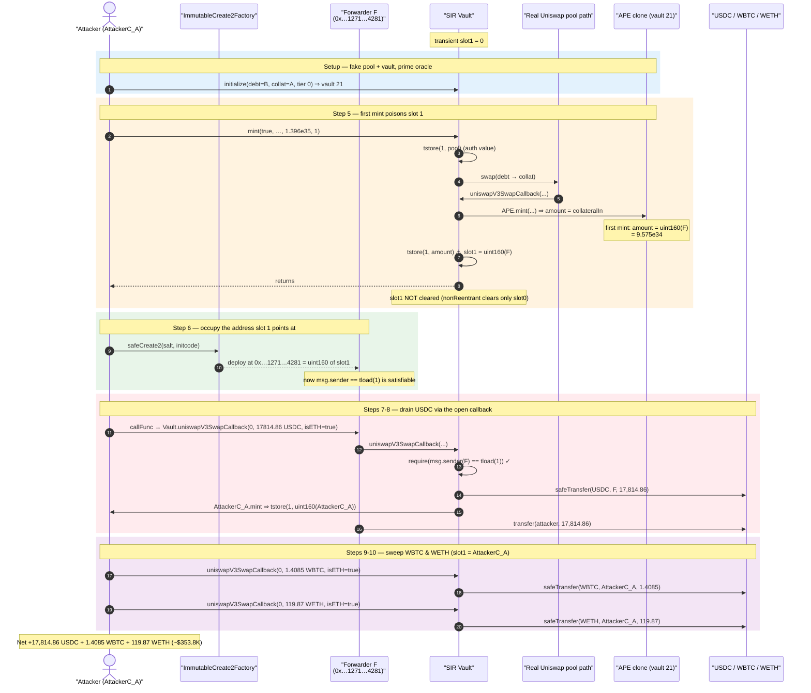
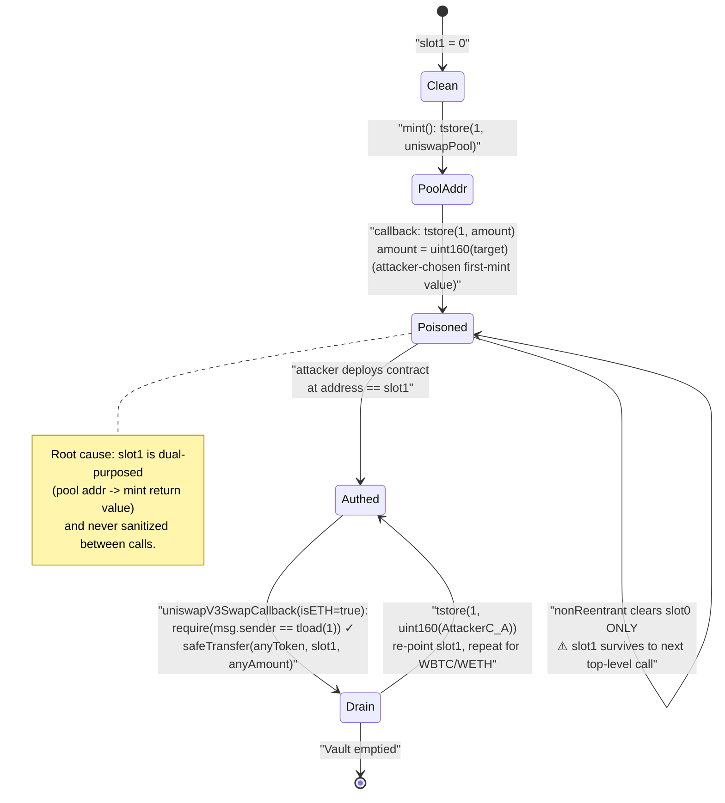
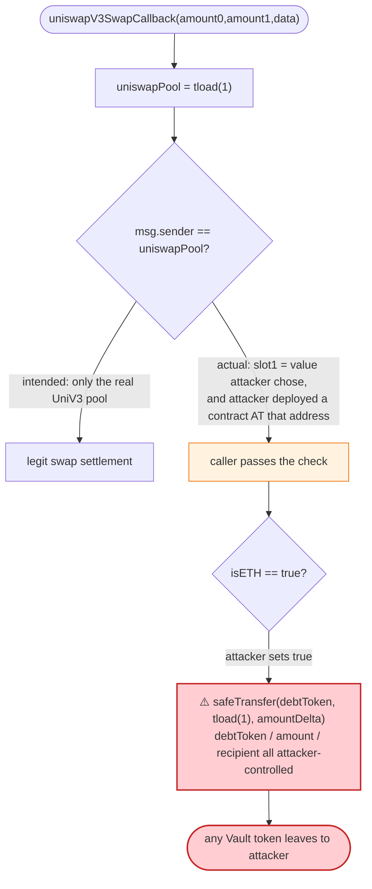

# SIR (Leverage) Exploit — Dirty Transient-Storage Slot Turns `uniswapV3SwapCallback` Into an Open Drain

> **Reproduction:** the PoC compiles & runs in an isolated Foundry project at
> [this project folder](.) (the umbrella DeFiHackLabs repo contains many
> unrelated PoCs that do not whole-compile, so this one was extracted).
> Full verbose trace: [output.txt](output.txt).
> Verified vulnerable source: [sources/Vault_B91AE2/src_Vault.sol](sources/Vault_B91AE2/src_Vault.sol).

---

## Key info

| | |
|---|---|
| **Loss** | ~$353.8K — **17,814.86 USDC + 1.4085 WBTC + 119.87 WETH** drained from the SIR `Vault` singleton |
| **Vulnerable contract** | `Vault` (SIR) — [`0xB91AE2c8365FD45030abA84a4666C4dB074E53E7`](https://etherscan.io/address/0xb91ae2c8365fd45030aba84a4666c4db074e53e7#code) |
| **Victim** | SIR protocol — all collateral held in the `Vault` singleton (USDC / WBTC / WETH balances) |
| **Attacker EOA** | [`0x27defcfa6498f957918f407ed8a58eba2884768c`](https://etherscan.io/address/0x27defcfa6498f957918f407ed8a58eba2884768c) |
| **Attack contract (main)** | [`0xea55fffae1937e47eba2d854ab7bd29a9cc29170`](https://etherscan.io/address/0xea55fffae1937e47eba2d854ab7bd29a9cc29170) |
| **Attack contract (CREATE2 forwarder)** | [`0x00000000001271551295307acc16ba1e7e0d4281`](https://etherscan.io/address/0x00000000001271551295307acc16ba1e7e0d4281) |
| **Attack tx** | [`0xa05f047ddfdad9126624c4496b5d4a59f961ee7c091e7b4e38cee86f1335736f`](https://etherscan.io/tx/0xa05f047ddfdad9126624c4496b5d4a59f961ee7c091e7b4e38cee86f1335736f) |
| **Chain / block / date** | Ethereum mainnet / fork at **22,157,899** / **March 30, 2025** |
| **Compiler** | Vault: Solidity **v0.8.28**, optimizer 20,000 runs (PoC built with 0.8.34) |
| **Bug class** | Broken access control via reusable / attacker-controllable **transient storage** slot (`tstore`/`tload`); missing slot clearing in the reentrancy guard |
| **PoC author** | [rotcivegaf](https://twitter.com/rotcivegaf) |

---

## TL;DR

SIR's `Vault` uses **EVM transient storage** (EIP-1153, `tstore`/`tload`) as scratch space during a
leveraged mint:

- **Slot 0** is the reentrancy lock (set/cleared by the `nonReentrant` modifier).
- **Slot 1** is overloaded. During `mint(...)` with a debt token it stores the Uniswap V3 pool
  address ([Vault.sol:217-219](sources/Vault_B91AE2/src_Vault.sol#L217-L219)); the callback then
  **overwrites slot 1 with the freshly-minted APE/TEA amount** so `mint()` can read its return value
  out of transient storage ([Vault.sol:299-301](sources/Vault_B91AE2/src_Vault.sol#L299-L301)).

The fatal combination:

1. `uniswapV3SwapCallback`'s **only** authorization check is
   `require(msg.sender == tload(1))` ([Vault.sol:256-262](sources/Vault_B91AE2/src_Vault.sol#L256-L262)).
2. The `nonReentrant` modifier **only clears slot 0**, never slot 1
   ([Vault.sol:124-146](sources/Vault_B91AE2/src_Vault.sol#L124-L146)). So whatever value slot 1
   holds when `mint()` finishes **persists for the rest of the transaction**.
3. On the **first** mint of a freshly-created vault, the minted APE amount is
   `amount = collateralIn + reserveApes` and `reserveApes == 0`, i.e. **amount = collateralIn**,
   which the attacker fully controls ([APE.sol:223-225](sources/Vault_B91AE2/src_APE.sol#L223-L225)).

The attacker therefore **chooses the value of slot 1**. They size their deposit so the mint returns
exactly `uint160(deploymentAddress)`, then use `ImmutableCreate2Factory` to deploy a tiny forwarder
contract at that very address. Now `msg.sender == tload(1)` holds for the forwarder, so it may call
`uniswapV3SwapCallback` directly. That callback's `isETH=true` branch does
`TransferHelper.safeTransfer(debtToken, tload(1), debtTokenToSwap)`
([Vault.sol:283-286](sources/Vault_B91AE2/src_Vault.sol#L283-L286)) — an **arbitrary transfer of any
token the Vault holds, to any address slot 1 points at, in any amount the attacker passes as
`amountDelta`.** The Vault is simply emptied.

After the first drain, the attacker re-points slot 1 at their main contract (the fake APE returns
`uint160(address(this))`), so the main contract can keep calling `uniswapV3SwapCallback` to sweep the
remaining WBTC and WETH. Net theft: **17,814.86 USDC + 1.4085 WBTC + 119.87 WETH ≈ $353.8K.**

---

## Background — what SIR / `Vault` does

SIR ("Synthetics Implemented Right") is a leverage protocol. A single **`Vault` singleton** holds all
collateral for every vault and mints two synthetic tokens: **APE** (leveraged long) and **TEA** (the
LP / stable side). Each `(debtToken, collateralToken, leverageTier)` triple is one vault.

A user can mint by depositing the **collateral token** directly, or by depositing the **debt token**,
in which case the Vault performs a Uniswap V3 swap (debt → collateral) on the user's behalf. To do the
swap, `Vault.mint(...)` calls `IUniswapV3Pool.swap(...)`, and Uniswap calls back into
`Vault.uniswapV3SwapCallback(...)` to collect the input token.

Because Uniswap V3's callback is a *push* model (the pool blindly calls back whoever initiated the
swap), every integrator must authenticate the callback: confirm `msg.sender` really is the pool it
asked to swap with. SIR does this by stashing the pool address in **transient storage slot 1** before
the swap and checking it in the callback.

The Vault is built around EIP-1153 transient storage:

| Slot | Intended purpose | Set by | Cleared by |
|---|---|---|---|
| `0` | reentrancy lock | `nonReentrant` modifier | `nonReentrant` modifier (`tstore(0,0)`) |
| `1` | (a) Uniswap pool addr during swap, then (b) mint return value | `mint()` / `uniswapV3SwapCallback()` | **never cleared** |

That asymmetry — slot 0 is cleaned up, slot 1 is not — is the whole vulnerability.

---

## The vulnerable code

### 1. The reentrancy guard clears only slot 0

```solidity
modifier nonReentrant() {
    {
        uint256 locked;
        assembly { locked := tload(0) }
        if (locked != 0) revert Locked();
        locked = 1;
        assembly { tstore(0, locked) }
    }
    _;
    // Unlock
    assembly { tstore(0, 0) }   // ⚠️ slot 0 cleared; slot 1 left untouched
}
```
[Vault.sol:124-146](sources/Vault_B91AE2/src_Vault.sol#L124-L146)

### 2. `mint()` writes the pool into slot 1, then reads its result back out of slot 1

```solidity
// Minter deposited debt token and requires a Uniswap V3 swap
assembly { tstore(1, uniswapPool) }              // slot 1 := pool (for callback auth)
...
(int256 amount0, int256 amount1) = IUniswapV3Pool(uniswapPool).swap(...);   // → calls back
...
assembly { amount := tload(1) }                  // slot 1 now holds the minted amount
```
[Vault.sol:216-246](sources/Vault_B91AE2/src_Vault.sol#L216-L246)

### 3. The callback authenticates with slot 1, and (its `isETH` branch) transfers an arbitrary token

```solidity
function uniswapV3SwapCallback(int256 amount0Delta, int256 amount1Delta, bytes calldata data) external {
    address uniswapPool;
    assembly { uniswapPool := tload(1) }
    require(msg.sender == uniswapPool);          // ⚠️ ONLY guard — slot 1 is attacker-set

    ( address minter, address ape, SirStructs.VaultParameters memory vaultParams,
      , , bool zeroForOne, bool isETH ) = abi.decode(data, (...));

    (uint256 collateralToDeposit, uint256 debtTokenToSwap) = zeroForOne
        ? (uint256(-amount1Delta), uint256(amount0Delta))
        : (uint256(-amount0Delta), uint256(amount1Delta));

    if (isETH) {
        // ⚠️ sends `debtTokenToSwap` of `debtToken` to `uniswapPool` (== tload(1))
        TransferHelper.safeTransfer(vaultParams.debtToken, uniswapPool, debtTokenToSwap);
    }
    ...
    uint256 amount = _mint(minter, ape, vaultParams, uint144(collateralToDeposit), vaultState, reserves);
    ...
    assembly { tstore(1, amount) }               // ⚠️ slot 1 := minted amount (attacker-chosen)
}
```
[Vault.sol:256-301](sources/Vault_B91AE2/src_Vault.sol#L256-L301)

### 4. First APE mint returns `collateralIn` verbatim — the attacker controls slot 1's value

```solidity
amount = supplyAPE == 0                          // first mint ever for this vault
    ? fees.collateralInOrWithdrawn + reserves.reserveApes   // reserveApes == 0 ⇒ amount = collateralIn
    : FullMath.mulDiv(supplyAPE, fees.collateralInOrWithdrawn, reserves.reserveApes);
```
[APE.sol:223-225](sources/Vault_B91AE2/src_APE.sol#L223-L225)

Because the attacker creates the vault, makes the *first* mint, and controls the collateral amount fed
into the mint, they control `amount` — and therefore the value left in transient slot 1.

---

## Root cause — why it was possible

The `uniswapV3SwapCallback` authentication assumes slot 1 can only ever contain a **legitimate Uniswap
pool address that the Vault itself just wrote**. Two design facts break that assumption:

1. **Slot 1 is dual-purposed and never sanitized.** The same slot that stores the trusted pool
   address is later overwritten with the mint return value, and the `nonReentrant` modifier — the one
   place that *does* clean transient state — only clears slot 0. So after any debt-token `mint()`,
   slot 1 is a stale, **caller-influenced** value that survives into subsequent top-level calls within
   the same transaction.

2. **The stale value is attacker-chosen *and* an address can be summoned to match it.** On a brand-new
   vault the first APE mint returns `collateralIn` directly ([APE.sol:223-225](sources/Vault_B91AE2/src_APE.sol#L223-L225)),
   so the attacker computes the collateral amount that makes `amount == uint160(target)` for a target
   address they can occupy. Ethereum's `ImmutableCreate2Factory` (deterministic CREATE2) lets them
   pre-mine a salt that deploys a contract at *exactly* that 160-bit value. Now
   `msg.sender == tload(1)` is trivially satisfiable.

3. **The callback's `isETH` branch is an unguarded `safeTransfer` of an arbitrary token.** Once the
   caller is "authenticated," `uniswapV3SwapCallback(0, X, data)` with `isETH=true` simply executes
   `safeTransfer(debtToken, tload(1), X)` where `debtToken`, `X`, and the recipient (`tload(1)`) are
   all attacker-supplied. There is no check tying `debtToken`/amount to any real pending swap. This is
   a fully general "transfer any Vault token to me" primitive.

In short: **transient storage was treated as if it were private, swap-scoped scratch space, but it is
neither cleared between top-level calls nor protected from carrying an attacker-controlled value into a
trust-bearing check.**

---

## Preconditions

- The attacker can create a fresh vault with **fully attacker-controlled tokens** as the
  debt/collateral pair (here two dummy ERC20s, `AttackerC_A` and `AttackerC_B`), plus a fake Uniswap V3
  pool they initialize and price-manipulate, so the SIR oracle accepts it.
- A debt-token `mint(true, ...)` (mint APE by swapping debt → collateral) so that `mint()` follows the
  `tstore(1, pool)` / `tstore(1, amount)` path. The deposit is sized so the **first** APE mint returns
  exactly `uint160(deploymentAddress)`.
- Access to `ImmutableCreate2Factory` (`0x0000000000FFe8B47B3e2130213B802212439497`) to deterministically
  deploy a 754-byte forwarder at the pre-computed address (salt `0x…d739dcf6ae98b123e5650020`).
- No price risk, no flash loan needed: the attacker only deposits worthless self-issued tokens. The
  drained USDC/WBTC/WETH is pure profit from the Vault's real collateral balances.

---

## Attack walkthrough (with on-chain numbers from the trace)

All figures are from [output.txt](output.txt) and [test/LeverageSIR_exp.sol](test/LeverageSIR_exp.sol).
`AttackerC_A` = `0x959951c51b3e4B4eaa55a13D1d761e14Ad0A1d6a` (main attack contract, also acts as the
"APE" and as a dummy ERC20). `AttackerC_B` = a second dummy ERC20. The forwarder deployed at
`0x00000000001271551295307acc16ba1e7e0d4281` is referred to as **F**.

| # | Step | Call | Effect on transient slot 1 / Vault |
|---|------|------|-----------------------------------|
| 0 | Deploy `AttackerC_A` & `AttackerC_B`; loop until `addr(A) < addr(B)` so the fake pool's `token0/token1` ordering is correct. | — | — |
| 1 | Create + initialize a fake Uniswap V3 pool `(AttackerC_B / AttackerC_A, fee 100)` at `sqrtPriceX96 = 2^96`. | `createAndInitializePoolIfNecessary` | Fake pool now priced 1:1. |
| 2 | Mint a huge LP position into the fake pool (`amount = 1.088e32` each side). | `NonfungiblePositionManager.mint` | Pool seeded with liquidity. |
| 3 | Swap `1.148e35` `AttackerC_A` → `AttackerC_B` to skew the fake pool's tick (so SIR's TWAP oracle reads the attacker's chosen price). | `SwapRouter.exactInputSingle` | Oracle primed. |
| 4 | Create the SIR vault `(debt=AttackerC_B, collateral=AttackerC_A, tier 0)` → vault **21**. | `Vault.initialize` | Real APE clone `0x3753c7d8…` deployed for vault 21. |
| 5 | **`mint(true, …, 1.396e35, 1)`** — mint APE by depositing `AttackerC_B`. Vault swaps `B→A` on the *real* SIR pool path; the real APE clone first-mints `amount = collateralIn = 95759995883742311247042417521410689`. | `Vault.mint` → `…swap` → `Vault.uniswapV3SwapCallback` → `tstore(1, amount)` | **slot 1 := 95759995883742311247042417521410689 = `uint160(0x…1271551295307acc16ba1e7e0d4281)`** |
| 6 | `safeCreate2(salt, initcode)` deploys forwarder **F** at exactly `0x00000000001271551295307acc16ba1e7e0d4281`. | `ImmutableCreate2Factory.safeCreate2` | `tload(1) == address(F)` now holds. |
| 7 | **F** is told (via `callFunc`) to call `Vault.uniswapV3SwapCallback(0, 17814862676, data)` with `data.debtToken = USDC`, `isETH = true`. Guard `msg.sender(F) == tload(1)` passes ⇒ `safeTransfer(USDC, F, 17,814.86 USDC)`. The inner fake `APE.mint` returns `uint160(AttackerC_A)`, so **slot 1 := AttackerC_A**. | `F → Vault.uniswapV3SwapCallback` | **17,814.86 USDC** leaves Vault → F; slot 1 re-pointed at `AttackerC_A`. |
| 8 | **F** forwards `USDC.transfer(attacker, 17,814.86)`. | `F → USDC.transfer` | USDC → attacker EOA. |
| 9 | `AttackerC_A` calls `Vault.uniswapV3SwapCallback(0, 140852920, data)` directly with `debtToken = WBTC`, `isETH = true`. Guard `msg.sender(A) == tload(1)(A)` passes ⇒ `safeTransfer(WBTC, A, 1.4085 WBTC)`. | `A → Vault.uniswapV3SwapCallback` | **1.4085 WBTC** → `AttackerC_A`, then forwarded to attacker. |
| 10 | Same again with `debtToken = WETH`, `amount = 119871037891574186422`. | `A → Vault.uniswapV3SwapCallback` | **119.87 WETH** → `AttackerC_A`, then forwarded to attacker. |

The `tload`/`tstore` transitions observed in the trace:

| Moment | slot 1 value | source |
|---|---|---|
| after step 5 `mint()` | `95759995883742311247042417521410689` (== `uint160(F)`) | fake/real APE first-mint return, `tstore(1, amount)` |
| after step 7 USDC callback | `uint160(AttackerC_A)` (`854058762035126636160903891170217432559485853034`) | `AttackerC_A.mint` returns `uint160(this)`, `tstore(1, amount)` |
| steps 9-10 | unchanged (`AttackerC_A`) | callbacks called by `AttackerC_A` itself |

### Profit / loss accounting

| Token | Amount drained from Vault | Human value |
|---|---:|---|
| USDC (6 dec) | `17,814,862,676` | **17,814.86 USDC** |
| WBTC (8 dec) | `140,852,920` | **1.4085 WBTC** |
| WETH (18 dec) | `119,871,037,891,574,186,422` | **119.87 WETH** |
| **Total** | — | **≈ $353.8K** |

The attacker spent **nothing** of value — only self-issued worthless ERC20s (`AttackerC_A`/`B`) and gas.
Final balances confirmed in the trace: attacker EOA `0x9dF0C6b0…` holds `17,814,862,676` USDC,
`140,852,920` WBTC, `119,871,037,891,574,186,422` WETH.

---

## Diagrams

### Sequence of the attack



### Transient-storage slot 1 state machine (the bug)



### Why the "authentication" is meaningless



---

## Why each magic number

- **`amount1 = 108823205127466839754387550950703`** (fake-pool LP) and
  **`amountIn = 114814730000000000000000000000000000`** (fake-pool skew swap): chosen so SIR's oracle
  reads a price/tick that makes the subsequent real `mint(true, …, 139650998347915452795864661928406629, 1)`
  produce a first-APE-mint `amount` equal to **`95759995883742311247042417521410689`**.
- **`95759995883742311247042417521410689`** == `uint160(0x00000000001271551295307acc16ba1e7e0d4281)`.
  This is the address the attacker pre-mined a CREATE2 salt for.
- **salt `0x0000…d739dcf6ae98b123e5650020`**: the input to `ImmutableCreate2Factory.safeCreate2` that,
  with the 754-byte forwarder init-code, deterministically yields the deployment address
  `0x…1271551295307acc16ba1e7e0d4281`. The address has many leading zero bytes precisely so it can be a
  realistic `uint160` target the mint can output.
- **`amountDelta` per drain** (`17814862676`, `140852920`, `119871037891574186422`): each is simply
  `IERC20(token).balanceOf(vault)` at attack time — the full Vault balance of that token. The callback
  copies it straight into `safeTransfer(token, recipient, amount)`.
- **trailing `bytes32(uint256(1))` in `data3`/`data4`**: sets `isETH = true`, selecting the
  `safeTransfer(debtToken, uniswapPool, debtTokenToSwap)` branch — the exfiltration path.

---

## Remediation

1. **Clear slot 1 in the reentrancy guard (or use a dedicated, always-cleared slot).** The
   `nonReentrant` modifier must `tstore(1, 0)` on exit, the same way it clears slot 0. Stale transient
   state must never survive a top-level call boundary. Better: do not reuse one slot for both a
   trust-bearing address and an arbitrary return value.
2. **Do not store the callback's authorization material where it can be overwritten by user-influenced
   data.** Keep the expected-pool address in a slot that is written immediately before the swap and
   cleared immediately after, and never reuse it to ferry the mint return value. Return `amount`
   normally (it already returns from `_mint`) instead of round-tripping through transient storage.
3. **Authenticate the callback against a value the attacker cannot forge an address for.** Beyond a raw
   `msg.sender == storedPool`, recompute the canonical Uniswap pool address from the
   `(token0, token1, fee)` of the pending swap (`PoolAddress.computeAddress`) and require equality —
   the attacker cannot make a self-deployed contract live at the canonical pool address.
4. **Never let a callback perform a generic `safeTransfer` of a fully caller-specified `(token,
   recipient, amount)`.** Bind the transfer to the *actual* pending swap: the token, amount, and
   recipient must be derived from the swap the Vault itself just initiated and stored, not decoded from
   `data`. Reject callbacks that arrive when no swap is in flight.
5. **Gate the first-mint amount formula.** `amount = collateralIn + reserveApes` on an empty vault lets
   an attacker pick the exact return value; combined with deterministic CREATE2 this becomes an
   address-forging oracle. Adding share-scaling / a minimum liquidity lock (mint-to-dead-address) on
   the first mint removes the "amount == uint160(target)" controllability.

---

## How to reproduce

The PoC was extracted into a standalone Foundry project (the umbrella DeFiHackLabs repo has many
unrelated PoCs that fail to compile under a whole-project `forge build`):

```bash
_shared/run_poc.sh 2025-03-LeverageSIR_exp -vvvvv
```

- **EVM version** must support transient storage: `foundry.toml` pins `evm_version = 'cancun'`
  (the PoC relies on `tstore`/`tload`).
- **RPC**: a mainnet **archive** endpoint is required (fork block 22,157,899). `foundry.toml` uses an
  Infura archive endpoint.
- Result: `[PASS] testPoC()`.

Expected tail:

```
  Profit: 17814862676 USDC
  Profit: 140852920 WBTC
  Profit: 119871037891574186422 WETH

Suite result: ok. 1 passed; 0 failed; 0 skipped
Ran 1 test suite: 1 tests passed, 0 failed, 0 skipped (1 total tests)
```

(`17,814.86 USDC` / `1.4085 WBTC` / `119.87 WETH` ≈ **$353.8K**.)

---

*Reference: SIR exploit, Ethereum mainnet, 2025-03-30. PoC by [rotcivegaf](https://twitter.com/rotcivegaf).
Attack tx `0xa05f047ddfdad9126624c4496b5d4a59f961ee7c091e7b4e38cee86f1335736f`.*
