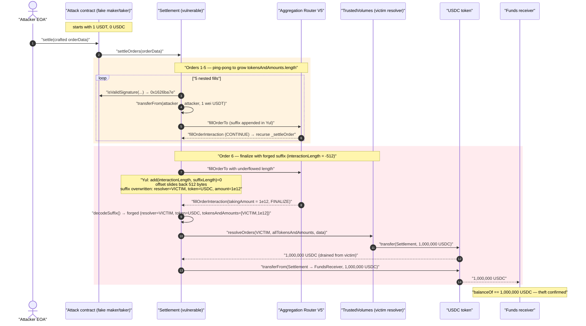
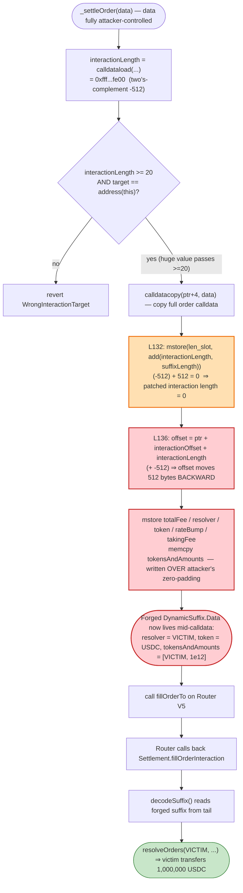
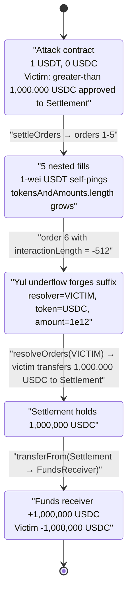

# 1inch Fusion V1 `Settlement` Exploit — Yul Calldata-Length Underflow Hijacks the Resolver Dynamic Suffix

> **Vulnerability classes:** vuln/arithmetic/overflow · vuln/input-validation/missing

> **Reproduction:** the PoC compiles & runs in an isolated Foundry project at
> [this project folder](.) (the umbrella DeFiHackLabs repo contains many unrelated PoCs that do not
> compile together, so this one was extracted).
> Full verbose trace: [output.txt](output.txt).
> Verified vulnerable source: [contracts_Settlement.sol](sources/Settlement_a88800/contracts_Settlement.sol).

---

## Key info

| | |
|---|---|
| **Loss** | ~$4.5M across affected resolvers (this PoC reproduces **1,000,000 USDC** drained from a single victim resolver) |
| **Vulnerable contract** | 1inch Fusion V1 `Settlement` — [`0xA88800CD213dA5Ae406ce248380802BD53b47647`](https://etherscan.io/address/0xa88800cd213da5ae406ce248380802bd53b47647#code) |
| **Victim** | `TrustedVolumes` resolver — [`0xB02F39e382c90160Eb816DE5e0E428ac771d77B5`](https://etherscan.io/address/0xB02F39e382c90160Eb816DE5e0E428ac771d77B5) (a whitelisted Fusion resolver that had approved USDC to the Settlement) |
| **Attacker EOA / deployer** | [`0xA7264a43A57Ca17012148c46AdBc15a5F951766e`](https://etherscan.io/address/0xA7264a43A57Ca17012148c46AdBc15a5F951766e) |
| **Attacker contract** | [`0x019BfC71D43c3492926D4A9a6C781F36706970C9`](https://etherscan.io/address/0x019BfC71D43c3492926D4A9a6C781F36706970C9) (acts as a fake maker/taker, implements `isValidSignature`) |
| **Funds receiver** | [`0xBbb587E59251D219a7a05Ce989ec1969C01522C0`](https://etherscan.io/address/0xBbb587E59251D219a7a05Ce989ec1969C01522C0) |
| **Attack tx** | [`0x62734ce80311e64630a009dd101a967ea0a9c012fabbfce8eac90f0f4ca090d6`](https://etherscan.io/tx/0x62734ce80311e64630a009dd101a967ea0a9c012fabbfce8eac90f0f4ca090d6) |
| **Aggregation Router V5** | `0x1111111254EEB25477B68fb85Ed929f73A960582` (the `_limitOrderProtocol` the Settlement calls) |
| **Chain / block / date** | Ethereum mainnet / fork at **21,982,110** / March 2025 |
| **Compiler** | Settlement: Solidity **0.8.17**; PoC: `^0.8.15` (run on EVM `cancun`) |
| **Bug class** | Hand-rolled Yul calldata manipulation — unchecked `add(interactionLength, suffixLength)` underflow/wraparound that lets an attacker control the `tokensAndAmounts` dynamic suffix and redirect a whitelisted resolver's funds |

---

## TL;DR

1inch Fusion's `Settlement` contract fills Fusion orders by calling the Aggregation Router V5's
`fillOrderTo`, and **appends a "dynamic suffix"** (`totalFee`, `resolver`, `token`, `rateBump`,
`takingFee`, and a `tokensAndAmounts` byte array) to the end of the calldata so that, when the
router calls back into `Settlement.fillOrderInteraction`, the Settlement knows which tokens/amounts
to settle with the resolver.

That suffix is assembled in **hand-written Yul** inside `_settleOrder`
([contracts_Settlement.sol:98-153](sources/Settlement_a88800/contracts_Settlement.sol#L98-L153)).
The attacker-controlled order calldata supplies the `interactions` field. The Settlement reads the
attacker's claimed `interactionLength` and then computes, **without any bounds check**:

```solidity
mstore(add(add(ptr, interactionLengthOffset), 4), add(interactionLength, suffixLength)) // L132
let offset := add(add(ptr, interactionOffset), interactionLength)                       // L136
```

By supplying `interactionLength = 0xfff…fe00` (two's-complement **−512**) the attacker makes:

- **`add(interactionLength, suffixLength)` overflow to 0** — patching the interaction length field to
  zero (cleaning the real interaction bytes), and
- **`offset` move *backwards*** in the copied calldata buffer by 512 bytes — so the suffix fields
  (`totalFee`, `resolver`, `token`, `rateBump`, `takingFee`, `tokensAndAmounts`) get written **in the
  middle of the calldata over a region the attacker pre-filled with zero padding**, rather than at the
  true tail.

The attacker uses this to plant a **forged `DynamicSuffix.Data`** whose `resolver` is the victim
`TrustedVolumes`, whose `token` is USDC, and whose `tokensAndAmounts` array names the victim and a
1,000,000-USDC amount. When the finalizing interaction runs
([contracts_Settlement.sol:75-79](sources/Settlement_a88800/contracts_Settlement.sol#L75-L79)),
`Settlement` calls `IResolver(victim).resolveOrders(victim, allTokensAndAmounts, data)` with this
forged data. The victim resolver dutifully `transfer`s **1,000,000 USDC** to the Settlement, which
then forwards it to the attacker's `FUNDS_RECEIVER`.

The attacker only needed **1 USDT** of seed capital. Net theft in this PoC run: **1,000,000 USDC**.

---

## Background — what the protocol does

1inch **Fusion** is an intent-based swap system. A user signs a *Fusion order* (a gasless intent),
and competitive market makers called **resolvers** fill it on-chain. The on-chain settlement is split
across two contracts:

- **`AggregationRouterV5`** (`0x1111…0582`) — the 1inch Limit Order Protocol engine. It validates
  orders/signatures and executes `fillOrderTo`, calling back into a taker-supplied interaction.
- **`Settlement`** (`0xA888…7647`, the contract audited here) — a thin wrapper a resolver calls via
  `settleOrders`. It crafts the `fillOrderTo` calldata, and after the router pulls maker assets it gets
  called back at `fillOrderInteraction`, where it pays the taker side and recursively settles the next
  order in a chain.

Resolvers are **whitelisted** and pre-approve their inventory (e.g. USDC) to the Settlement so it can
move funds on their behalf during settlement. That standing approval is exactly what the attack abuses.

### The dynamic suffix mechanism

`Settlement` needs to pass extra data (fee, resolver, token, and the running `tokensAndAmounts`
ledger) through the router and back into its own `fillOrderInteraction` callback. Since `fillOrderTo`
has no parameter for this, `Settlement` **appends the data to the end of the interaction calldata** and
recovers it by reading backwards from the calldata tail
([DynamicSuffix.decodeSuffix](sources/Settlement_a88800/contracts_libraries_DynamicSuffix.sol#L27-L36)):

```solidity
// layout of dynamic suffix:
// 0x00..0x19: totalFee   0x20..0x39: resolver   0x40..0x59: token
// 0x60..0x79: rateBump   0x80..0x99: takingFee  0xa0..   : tokensAndAmounts bytes + length
let lengthOffset := sub(add(cd.offset, cd.length), 0x20)
tokensAndAmounts.length := calldataload(lengthOffset)
tokensAndAmounts.offset := sub(lengthOffset, tokensAndAmounts.length)
suffix := sub(tokensAndAmounts.offset, _STATIC_DATA_SIZE)   // _STATIC_DATA_SIZE = 0xa0
```

Decoding the suffix is purely **offset arithmetic from the tail of the calldata** — there is no
authenticated boundary between "real interaction" and "appended suffix". Whoever controls where the
suffix lands controls `resolver`, `token`, and `tokensAndAmounts`.

---

## The vulnerable code

### 1. The hand-rolled suffix-append in `_settleOrder`

[contracts_Settlement.sol:98-153](sources/Settlement_a88800/contracts_Settlement.sol#L98-L153):

```solidity
function _settleOrder(bytes calldata data, address resolver, uint256 totalFee, bytes memory tokensAndAmounts) private {
    OrderLib.Order calldata order;
    assembly { order := add(data.offset, calldataload(data.offset)) }
    if (!order.checkResolver(resolver)) revert ResolverIsNotWhitelisted();   // L103
    ...
    uint256 suffixLength = DynamicSuffix._STATIC_DATA_SIZE + tokensAndAmounts.length + 0x20; // L108
    ...
    assembly {
        let interactionLengthOffset := calldataload(add(data.offset, 0x40))
        let interactionOffset := add(interactionLengthOffset, 0x20)
        let interactionLength := calldataload(add(data.offset, interactionLengthOffset)) // L118  ← ATTACKER CONTROLLED

        { // interaction target must equal address(this)
            let target := shr(96, calldataload(add(data.offset, interactionOffset)))
            if or(lt(interactionLength, 20), iszero(eq(target, address()))) {            // L122
                mstore(0, _WRONG_INTERACTION_TARGET_SELECTOR)
                revert(0, 4)
            }
        }

        // Copy calldata and patch interaction.length
        let ptr := mload(0x40)
        mstore(ptr, _FILL_ORDER_TO_SELECTOR)
        calldatacopy(add(ptr, 4), data.offset, data.length)
        mstore(add(add(ptr, interactionLengthOffset), 4), add(interactionLength, suffixLength)) // L132 ⚠️ UNCHECKED ADD

        {  // Append suffix fields
            let offset := add(add(ptr, interactionOffset), interactionLength)   // L136 ⚠️ UNCHECKED ADD → moves backwards
            mstore(add(offset, 0x04), totalFee)
            mstore(add(offset, 0x24), resolver)
            mstore(add(offset, 0x44), calldataload(add(order, 0x40)))  // takerAsset
            mstore(add(offset, 0x64), rateBump)
            mstore(add(offset, 0x84), takingFeeData)
            let tokensAndAmountsLength := mload(tokensAndAmounts)
            memcpy(add(offset, 0xa4), add(tokensAndAmounts, 0x20), tokensAndAmountsLength)
            mstore(add(offset, add(0xa4, tokensAndAmountsLength)), tokensAndAmountsLength)
        }

        // Call fillOrderTo
        if iszero(call(gas(), limitOrderProtocol, 0, ptr, add(add(4, suffixLength), data.length), ptr, 0)) { ... } // L148
    }
}
```

`interactionLength` at **L118** is read directly from the attacker's `data` calldata. The only check on
it (**L122**) is `interactionLength >= 20` (and the interaction target equals `address(this)`). A huge
value like `0xfff…fe00` trivially satisfies `>= 20`. Then:

- **L132:** `add(interactionLength, suffixLength)` is **not checked for overflow**. With
  `interactionLength = -512` and `suffixLength = 512`, the sum wraps to **0**, so the patched interaction
  length becomes 0 (the genuine interaction bytes are blanked).
- **L136:** `offset = ptr + interactionOffset + interactionLength`. Adding the *negative*
  `interactionLength` makes `offset` point **512 bytes earlier** than where the suffix should go. The
  five `mstore`s + `memcpy` therefore write the suffix fields **into the middle of the copied calldata**,
  on top of a 512-byte zero-padding region the attacker placed there on purpose.

### 2. The finalize path trusts the (now-forged) suffix

[contracts_Settlement.sol:55-93](sources/Settlement_a88800/contracts_Settlement.sol#L55-L93):

```solidity
function fillOrderInteraction(address taker, uint256, uint256 takingAmount, bytes calldata interactiveData)
    external onlyThis(taker) onlyLimitOrderProtocol returns (uint256 result)
{
    (DynamicSuffix.Data calldata suffix, bytes calldata tokensAndAmounts, bytes calldata interaction)
        = interactiveData.decodeSuffix();                       // ← reads forged suffix from tail
    IERC20 token = IERC20(suffix.token.get());
    result = takingAmount * (_BASE_POINTS + suffix.rateBump) / _BASE_POINTS;
    ...
    bytes memory allTokensAndAmounts = new bytes(tokensAndAmounts.length + 0x40);
    assembly { /* copies attacker tokensAndAmounts + (token, result+fee) */ }

    if (interactiveData[0] == _FINALIZE_INTERACTION) {
        _chargeFee(suffix.resolver.get(), suffix.totalFee);
        address target = address(bytes20(interaction));
        bytes calldata data = interaction[20:];
        IResolver(target).resolveOrders(suffix.resolver.get(), allTokensAndAmounts, data); // L79 ⚠️
    } else {
        _settleOrder(interaction, suffix.resolver.get(), suffix.totalFee, allTokensAndAmounts);
    }
    ...
}
```

At **L79** the Settlement calls `resolveOrders` on the resolver named in the forged suffix, handing it
the attacker-chosen `allTokensAndAmounts`. `TrustedVolumes` (the victim) responds by transferring the
named USDC amount to the Settlement.

### 3. Resolver whitelist is no obstacle

`checkResolver` ([OrderSuffix.sol:54-84](sources/Settlement_a88800/contracts_libraries_OrderSuffix.sol#L54-L84))
parses a resolver/time-limit suffix from the order's `interactions`. The attacker's orders carry **no
real suffix**, so the parsed `publicLimit` reads as `0` and the very first check
`valid := gt(timestamp(), publicLimit)` (**L68**) is `true` — i.e. the order is treated as past its
"public" auction window and **anyone** passes the whitelist. Combined with the attacker contract's
`isValidSignature` always returning the magic value `0x1626ba7e`, every fake order validates.

---

## Root cause — why it was possible

The Fusion settlement passes trusted state (which resolver, which token, how much) to itself
**out-of-band, by appending it to calldata and recovering it via tail-relative offset arithmetic**. The
boundary between "data the caller controls" (the order's interaction bytes) and "data the contract
appends" (the dynamic suffix) is defined **only** by an attacker-supplied length, manipulated in
hand-written Yul with **no overflow protection**:

1. **Signed-style arithmetic on an unchecked length.** `interactionLength` is an arbitrary 256-bit value
   from calldata. `add(interactionLength, suffixLength)` (L132) and `add(..., interactionLength)` (L136)
   are evaluated in raw EVM `add` semantics. A value near `2^256` behaves as a small negative number,
   simultaneously (a) zeroing the patched length and (b) sliding the suffix-write pointer backwards.
   Solidity 0.8's checked arithmetic does **not** apply inside `assembly` blocks.
2. **The only guard is `interactionLength >= 20`.** There is no upper bound, no check that
   `interactionLength <= data.length`, and no check that the computed `offset` stays within the freshly
   copied buffer. Any value `>= 20` is accepted (L122).
3. **The dynamic suffix is unauthenticated.** `decodeSuffix` blindly trusts the last word as a length and
   walks backwards. Whoever controls where the suffix lands controls `resolver`, `token`, and
   `tokensAndAmounts` — and thus *whose* approved funds get moved and *where they go*.
4. **Resolvers grant standing approvals.** Whitelisted resolvers (the victim) pre-approve USDC to the
   Settlement. The forged suffix turns that approval into an attacker-directed withdrawal.

In short: a memory-corruption-style primitive (calldata length underflow) is exposed through a
contract that converts attacker-controlled bytes into "trusted" settlement parameters.

> The attacker also uses a "ping-pong" chain of nested settlements (orders 1→6, each interaction
> recursing into `_settleOrder` again) purely to **grow `tokensAndAmounts.length`** step by step so that
> `suffixLength` lands at exactly the value that makes the final `interactionLength` underflow line up
> with the pre-planted padding. The first five fills move **1 wei of USDT** back and forth (attacker →
> attacker); only the sixth, finalizing order carries the malicious 1,000,000-USDC suffix.

---

## Preconditions

- A **whitelisted resolver with a standing token approval** to the Settlement (the victim
  `TrustedVolumes` had approved USDC). This is the value being stolen.
- The attacker controls a contract that (a) returns `0x1626ba7e` from `isValidSignature` so its fake
  orders "validate", and (b) is set as `maker` so it can be the (irrelevant) source of the 1-wei USDT
  pings. In the live attack the attacker also had to be `tx.origin` for `isValidSignature` to pass.
- Trivial seed capital: the attacker contract held **1 USDT** (`1e6` units = 1.0 USDT, i.e. `1000000`)
  and **0 USDC** at the fork block. (Confirmed in the trace: `Attacker Contract USDT Balance: 1000000`.)
- No timing/oracle/flash-loan dependency — the attack is a single self-contained transaction; the only
  "tuning" is the precise byte layout of the crafted orders.

---

## Attack walkthrough (with on-chain numbers from the trace)

All figures are taken directly from [output.txt](output.txt). USDC/USDT have 6 decimals, so
`1e12` units = **1,000,000.00 USDC** and `1e6` units = **1.00 USDT**.

The attacker EOA calls `attackContract.settle(orderData)` ([output.txt L1597](output.txt)). The attack
contract relays the crafted `orderData` to `Settlement.settleOrders`
([output.txt L1598](output.txt)), kicking off a recursive chain of six fills. Orders 1–5 are pure
plumbing; order 6 is the theft.

| # | Step (trace) | What happens | USDT moved | USDC moved |
|---|--------------|--------------|-----------:|-----------:|
| 0 | `setUp` balance log | Attacker contract starts with 1 USDT, 0 USDC | — | — |
| 1 | `settleOrders` → fill order #1 | `isValidSignature` → `0x1626ba7e`; `transferFrom(attacker→attacker, 1)` USDT ping; recurse | 1 (self) | — |
| 2 | nested `fillOrderInteraction` → fill #2 | another 1-wei USDT self-ping; `tokensAndAmounts` grows; recurse | 1 (self) | — |
| 3 | fill #3 | 1-wei USDT self-ping; recurse | 1 (self) | — |
| 4 | fill #4 | 1-wei USDT self-ping; recurse | 1 (self) | — |
| 5 | fill #5 | 1-wei USDT self-ping; recurse | 1 (self) | — |
| 6 | fill #6 — **finalize** ([output.txt L1658](output.txt)) | `takingAmount = 1e12`; forged suffix → `resolveOrders` on **victim `0xB02F…77B5`** | — | **1,000,000** |
| 6a | `TrustedVolumes.resolveOrders(...)` ([L1659](output.txt)) | Victim transfers **1,000,000 USDC** to Settlement: `Transfer(from: 0xB02F…77B5, to: Settlement, 1e12)` ([L1662](output.txt)) | — | 1,000,000 (out of victim) |
| 6b | `approve(router, 1e12)` ([L1681](output.txt)) | Settlement approves router for the stolen amount | — | — |
| 6c | `transferFrom(Settlement → FUNDS_RECEIVER, 1e12)` ([L1689](output.txt)) | **1,000,000 USDC sent to attacker's receiver** `0xBbb5…22c0` | — | 1,000,000 (to attacker) |
| 7 | final assertion ([L1804](output.txt)) | `USDC.balanceOf(FUNDS_RECEIVER) == 1000000000000` → **`Stolen 1000000000000 USDC`** | — | — |

The decisive lines in the trace:

```
[72211] Settlement::fillOrderInteraction(Settlement, 1, 1000000000000 [1e12], <…>)
  [40814] 0xB02F39e382c90160Eb816DE5e0E428ac771d77B5::resolveOrders(0xB02F…77B5, <…>)
    FiatTokenV2_2::transfer(Settlement, 1000000000000 [1e12])
      emit Transfer(from: 0xB02F…77B5, to: Settlement, value: 1000000000000 [1e12])  ← victim drained
  FiatTokenV2_2::transferFrom(Settlement, 0xBbb587E59251D219a7a05Ce989ec1969C01522C0, 1000000000000)
      emit Transfer(from: Settlement, to: 0xBbb5…22c0, value: 1000000000000)          ← attacker paid
...
FiatTokenV2_2::balanceOf(0xBbb587E59251D219a7a05Ce989ec1969C01522C0) → 1000000000000 [1e12]
console::log("Stolen %d USDC", 1000000000000 [1e12])
```

### Profit / loss accounting

| Party | Asset | Before | After | Delta |
|---|---|---:|---:|---:|
| Attacker contract | USDC | 0 | 0 | 0 |
| Attacker contract | USDT | 1.00 | 1.00 | 0 (the 1-wei pings net to self) |
| **Funds receiver** `0xBbb5…22c0` | USDC | 0 | **1,000,000.00** | **+1,000,000.00 USDC** |
| **Victim** `TrustedVolumes` | USDC | ≥ 1,000,000.00 | −1,000,000.00 | **−1,000,000.00 USDC** |

The PoC reproduces a single victim drain of **1,000,000 USDC**. The full incident (~**$4.5M**) was the
attacker repeating this against the standing approvals of multiple whitelisted Fusion resolvers.

---

## Diagrams

### Sequence of the attack



### Calldata / memory corruption inside `_settleOrder`



### Fund-flow state evolution



---

## Why each crafted constant

- **`FAKE_SIGNATURE_LENGTH_OFFSET = 0x240` / `FAKE_INTERACTION_LENGTH_OFFSET = 0x460`** — the attacker
  encodes the order as `abi.encode(order, sig, interaction, …)` but lies about the dynamic-type offsets
  so the router/Settlement read the signature and interaction lengths from attacker-chosen locations.
  Their difference, `0x460 − 0x240 = 0x220 = 544`, is the size of the `zeroBytes` padding planted where
  the forged suffix will be written.
- **`FAKE_INTERACTION_LENGTH = 0xfff…fe00`** — this is **−512** in two's complement. It is the linchpin:
  `add(interactionLength, suffixLength)` underflows to 0 at L132 and `offset` slides back 512 bytes at
  L136. (`suffixLength` reaches exactly 512 = `0xa0` static + grown `tokensAndAmounts` + `0x20`, which is
  why the 1–5 ping-pong fills exist: to grow `tokensAndAmounts.length` until the math lines up.)
- **`dynamicSuffix = abi.encode(0, VICTIM, USDC, 0, 0, USDC, AMOUNT_TO_STEAL, 0x40)`** — the forged
  `DynamicSuffix.Data` + `tokensAndAmounts`: `resolver = VICTIM`, `token = USDC`, and a
  `tokensAndAmounts` entry of `(USDC, 1,000,000)` so `resolveOrders` pulls exactly that from the victim.
- **`_FINALIZE_INTERACTION = 0x01`** prefix on `finalOrderInteraction`** — selects the
  `resolveOrders` branch (L75-79) instead of recursing, executing the actual drain.
- **`AMOUNT_TO_STEAL = 0xE8D4A51000 = 1,000,000,000,000` units = 1,000,000 USDC** — the per-victim drain
  reproduced here.

---

## Remediation

1. **Do not hand-roll calldata length arithmetic.** Every `add` involving an attacker-controlled length
   inside Yul must be range-checked. Specifically, before L132/L136, assert
   `interactionLength <= data.length` (and that `interactionOffset + interactionLength + suffixLength`
   stays within the freshly copied buffer). Reject any `interactionLength` whose high bits are set.
2. **Authenticate the dynamic-suffix boundary.** Tail-relative `decodeSuffix` trusts the last word as a
   length and the bytes before it as trusted state. Either encode the suffix as a first-class, ABI-typed
   parameter (so the decoder enforces bounds), or store a checked length and verify the suffix region is
   exactly what `_settleOrder` wrote — never overlapping the user-supplied interaction.
3. **Bound-check the write region.** After computing `offset`, require
   `offset >= ptr + interactionOffset` and `offset + suffixLength <= ptr + 4 + data.length + suffixLength`
   so the suffix can only ever be appended at the true tail, never written over copied calldata.
4. **Tie the resolver in the suffix to the authenticated caller.** `fillOrderInteraction` should derive
   the resolver/token from validated order state, not from bytes recovered out of the calldata tail, so
   a forged suffix cannot name an arbitrary victim resolver.
5. **Minimize standing approvals.** Resolvers should approve the exact amount per settlement (or use
   transient/permit-style allowances) rather than blanket approvals the Settlement can redirect.

The official 1inch post-mortem and Decurity write-up reach the same root cause:
- Decurity post-mortem: https://blog.decurity.io/yul-calldata-corruption-1inch-postmortem-a7ea7a53bfd9
- Original disclosure thread: https://x.com/DecurityHQ/status/1898069385199153610

---

## How to reproduce

The PoC was extracted into a standalone Foundry project (the umbrella DeFiHackLabs repo has many
unrelated PoCs that fail to compile under a whole-project `forge build`):

```bash
_shared/run_poc.sh 2025-03-OneInchFusionV1SettlementHack.sol_exp -vvvvv
```

- RPC: an **Ethereum mainnet archive** endpoint is required (fork block **21,982,110**). `foundry.toml`
  uses an Infura archive endpoint; most public/pruned RPCs fail with `header not found` /
  `missing trie node` at this depth.
- Local imports were copied into the project so paths resolve: [basetest.sol](basetest.sol) and
  [tokenhelper.sol](tokenhelper.sol) (siblings of the PoC in `src/test/`), plus the shared
  [interface.sol](interface.sol) at the project root.
- Result: `[PASS] testExploit()` and `Stolen 1000000000000 USDC` (= 1,000,000 USDC).

Expected tail:

```
Ran 1 test for test/OneInchFusionV1SettlementHack.sol_exp.sol:ONEINCH
[PASS] testExploit() (gas: 524456)
  Attacker Contract USDC Balance:  0
  Attacker Contract USDT Balance:  1000000
  Stolen 1000000000000 USDC

Suite result: ok. 1 passed; 0 failed; 0 skipped
```

---

*References: Decurity post-mortem (Yul calldata corruption, 1inch Fusion V1, ~$4.5M); SlowMist Hacked.
Vulnerable source verified on Etherscan at `0xA88800CD213dA5Ae406ce248380802BD53b47647`.*
