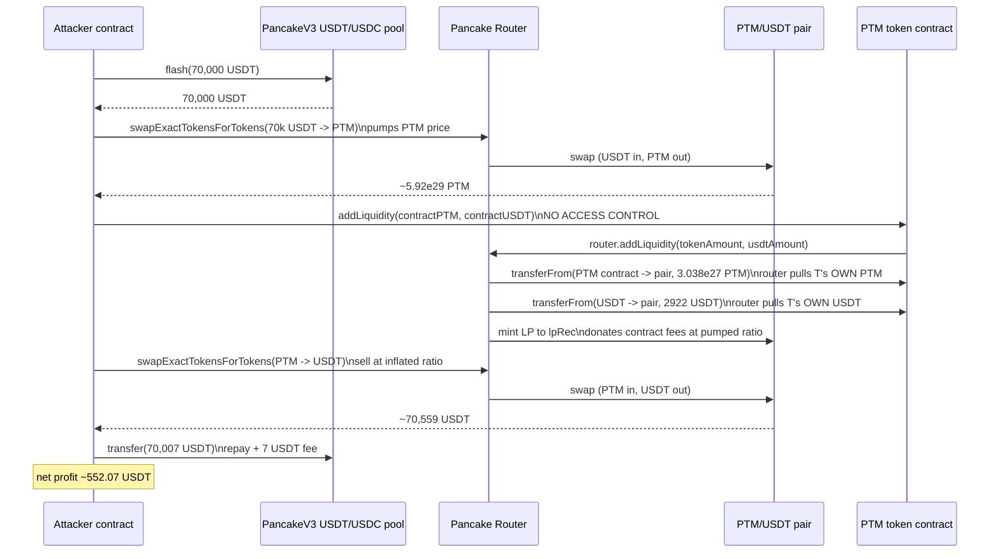
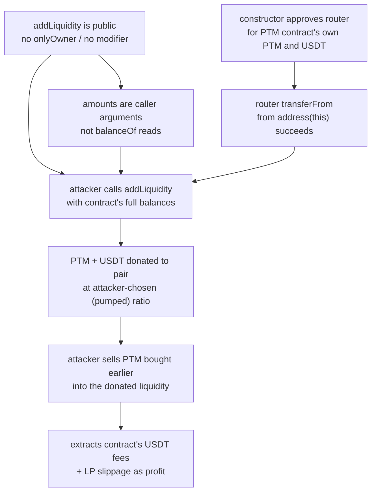

# PTM (Phoenix To Moon) token — public `addLiquidity()` lets anyone spend the token contract's own PTM/USDT into the LP

> **Vulnerability classes:** vuln/access-control/missing-auth · vuln/access-control/missing-modifier · vuln/logic/incorrect-state-transition
> **Reproduction:** the PoC compiles & runs in an isolated Foundry project at [this project folder](.). Full verbose trace: [output.txt](output.txt). Vulnerable contract source is verified on BscScan and fetched to [sources/PTM_2e1377/PTM.sol](sources/PTM_2e1377/PTM.sol).
---
## Key info
| | |
|---|---|
| **Loss** | 552.63 USDT (≈ $553) net profit to the attacker [output.txt:1564-1565] |
| **Vulnerable contract** | PTM (Phoenix To Moon) — [`0x2E13771622b967e9aFBf0Dc6C7736C6b7544b0b7`](https://bscscan.com/address/0x2e13771622b967e9afbf0dc6c7736c6b7544b0b7) |
| **Attacker EOA** | [`0x52e38D496F8D712394D5ED55E4d4Cdd21f1957De`](https://bscscan.com/address/0x52e38d496f8d712394d5ed55e4d4cdd21f1957de) |
| **Attack contract** | [`0x9774d7bBf21f1c50881dF62518c3160ab3a5A989`](https://bscscan.com/address/0x9774d7bbf21f1c50881df62518c3160ab3a5a989) |
| **Attack tx** | [`0x1bb9c2a30564ed685580f17890d5fa153edb3e86cc39fe6804cfb6dbfa0cae92`](https://bscscan.com/tx/0x1bb9c2a30564ed685580f17890d5fa153edb3e86cc39fe6804cfb6dbfa0cae92) |
| **Chain / block / date** | BNB Chain (BSC) / 47,224,908 / 2025-03-06 |
| **Compiler** | Solidity, verified on BscScan (`sources/PTM_2e1377/PTM.sol`) |
| **Bug class** | The PTM token's `addLiquidity(uint256,uint256)` is `public` with no access control, and the contract pre-approves the Pancake Router for both its own PTM and its USDT — so any caller can force the token contract to lock its accumulated fee balances into the PTM/USDT pair at attacker-chosen ratios. |

## TL;DR

PTM ("Phoenix To Moon") is a BSC reflection/dividend token whose fee machinery siphons part of every transfer into the token contract itself (`address(this)`): a 0.5% liquidity fee in PTM and, after auto-swapping, USDT. To recycle those fees the contract exposes a `swapAndLiquify` internal routine and, as its tail call, a **public** `addLiquidity(uint256 tokenAmount, uint256 usdtAmount)` function — `public`, no `onlyOwner`, no modifier, no caller check (sources/PTM_2e1377/PTM.sol:1236). In the same constructor the contract grants the Pancake Router infinite allowance over both its own PTM balance (line 994) and its USDT balance (line 1169).

That combination makes `addLiquidity` a one-shot primitive: the caller passes the *amounts*, the router pulls those amounts straight out of the token contract's own holdings and locks them into the PTM/USDT pair. Whoever calls it controls how much of the contract's PTM and USDT gets donated to the LP — at whatever ratio the caller wants, with slippage params hard-coded to `0`.

The attacker weaponizes this with a single flash loan. They borrow 70,000 USDT from the Pancake V3 USDT/USDC pool, use it to buy PTM on the open market (pumping the PTM price and leaving the token contract flush with USDT from the buy-side fees), then immediately call `ptm.addLiquidity(contractPtmBalance, contractUsdtBalance)`. That call forces the token contract to dump its entire accumulated PTM + USDT into the now-overvalued pair. The attacker then sells the PTM they bought — at the inflated, attacker-seeded ratio — back into USDT, repays the 70,000 USDT plus the 7 USDT flash fee, and keeps the rest: 578.62 USDT against a starting balance of 26.54 USDT, a net **552.07 USDT** profit [output.txt:1564-1565]. The amount is small, but the flaw is total — the same call could have been repeated or scaled against any PTM/USDT liquidity the token contract held.

## Background — what PTM does

PTM is a deflationary dividend token built from the common "tax-on-transfer" template (SafeMath + OpenZeppelin-flavoured `Ownable` + an auto-liquidity + dividend-distributor stack). It has a PancakeSwap V2 pair against USDT and applies a per-transfer tax split three ways:

- **30/1000 (3%)** "distributefee" routed to a `DividendDistributor` (paid in BTCB) — sources/PTM_2e1377/PTM.sol:965, 1002-1039.
- **5/1000 (0.5%)** `liquidityFee`, taken from the sender and parked on the token contract itself (`address(this)`) — lines 966, 1172-1179.
- **24/1000 (2.4%)** `burnFee`, sent to `0xdead` — line 967, 1344-1345.

The `liquidityFee` PTM sits on `address(this)` until `shouldSwapAndLiquify` trips (contract balance ≥ `numTokensSellToAddToLiquidity`, line 1152), at which point `_transfer` calls the internal `swapAndLiquify` (line 1384). `swapAndLiquify` (lines 1197-1217) halves the accrued PTM, swaps half for USDT via the router (sending the proceeds back to `address(this)` through the distributor at lines 1232-1233), then calls `addLiquidity(otherHalf, newBalance)` to seed both halves into the PTM/USDT pair as protocol-owned liquidity (minted to `lpRec`, line 1153).

Two constructor lines make all of this router-driven: `allowance[address(this)][address(uniswapV2Router)] = type(uint256).max` (line 994) for the PTM token itself, and `IERC20(USDT).approve(address(uniswapV2Router), type(uint256).max)` (line 1169) for USDT. The token contract permanently authorises Pancake Router to move both its own PTM and any USDT it happens to hold.

## The vulnerable code

### `addLiquidity` is public and unguarded

```solidity
function addLiquidity(uint256 tokenAmount, uint256 usdtAmount) public {
    // add the liquidity

    uniswapV2Router.addLiquidity(
        address(this),
        address(USDT),
        tokenAmount,
        usdtAmount,
        0, // slippage is unavoidable
        0, // slippage is unavoidable
        lpRec,
        block.timestamp
    );
}
```
*(sources/PTM_2e1377/PTM.sol:1236-1249)*

Note three things: (1) there is no `onlyOwner`, no `isSwap` modifier, no caller check at all; (2) `tokenAmount` and `usdtAmount` are **caller-supplied** — the function never reads the contract's actual balances, it trusts whatever the caller passes; (3) `address(this)` is the token itself, so `uniswapV2Router.addLiquidity` will `transferFrom(PTM, pair, tokenAmount)` and `transferFrom(USDT-... )` directly out of the token contract's own wallets.

Compare with the intended caller, `swapAndLiquify`, which is `internal ... isSwap` (line 1197) and computes both amounts internally before invoking this same function. The `public` visibility on `addLiquidity` exposes the exact same primitive to anyone.

### The router can spend the contract's tokens (constructor approvals)

```solidity
// in DividendFee constructor (line 994) — PTM approves the router for its OWN token:
allowance[address(this)][address(uniswapV2Router)] = type(uint256).max;

// in LiquidityFeeUSDT constructor (line 1169) — and for USDT it holds:
IERC20(USDT).approve(address(uniswapV2Router), type(uint256).max);
```
*(sources/PTM_2e1377/PTM.sol:994, 1169)*

Without these approvals `addLiquidity` would revert on the router's `transferFrom`. With them, the router happily moves the contract's tokens on any caller's behalf.

### Where the contract's PTM and USDT come from (fuel for the drain)

```solidity
// liquidityFee accrues PTM on address(this) on every taxed transfer (line 1177):
super._transfer(sender, address(this), liquidityAmount);

// swapAndLiquify swaps half to USDT and routes it back to address(this) (lines 1232-1233):
uint256 amount = IERC20(USDT).balanceOf(address(distributor));
distributor.transferUSDT(address(this), amount);
```
*(sources/PTM_2e1377/PTM.sol:1177, 1232-1233)*

By the attack block, `address(this)` had accumulated roughly 3.048e27 PTM and 2,922 USDT from prior fee activity — exactly the balances the attacker read and passed back in (`ptm.balanceOf(PTM_TOKEN)` / `usdt.balanceOf(PTM_TOKEN)` in the PoC, test/PTM_exp.sol).

## Root cause — why it was possible

1. **`addLiquidity` is `public` with no access control.** It should have been `internal` (matched to its only legitimate caller `swapAndLiquify`) or guarded with `onlyOwner`/`isSwap`. As written, any EOA or contract can invoke it. (sources/PTM_2e1377/PTM.sol:1236)
2. **The amounts are caller-controlled.** `tokenAmount`/`usdtAmount` are function arguments, not `balanceOf[address(this)]` / `IERC20(USDT).balanceOf(address(this))` reads. The attacker therefore picks exactly how much of the contract's PTM and USDT gets shoved into the pair — including "all of it, at the post-pump ratio."
3. **The contract pre-approves the router for both its own PTM and USDT, unconditionally and infinitely.** Those approvals are the precondition that turns the visibility bug into a spend primitive; the router's `transferFrom(address(this), pair, ...)` succeeds against the contract's own balances. (lines 994, 1169)
4. **Slippage is hard-coded to zero.** `amountAMin`/`amountBMin` are both `0`, so the router never reverts regardless of how adversarial the ratio is. Even if the function had been owner-only, this would let an owner (or, given bug #1, anyone) seed LP at a garbage ratio; here it removes the last guardrail on the public path.
5. **No re-entrancy / state coupling with the price.** Nothing in `addLiquidity` or the surrounding tax logic checks that the spot price has not just moved, so the attacker can pump-and-donate-and-dump in one transaction.

## Preconditions

- **Permissionless.** No privileged role, no allowance from the attacker, no token balance required of the attacker beyond gas. The only "capital" needed is borrowed via flash loan.
- **Flash-loan-funded.** The attacker needs a lump of USDT to push the PTM price before the donation; the Pancake V3 USDT/USDC pool supplies 70,000 USDT for a 7 USDT fee [output.txt:2307].
- **Contract must hold accumulated fee balances.** At the fork block the PTM contract held 3.048e27 PTM and 2,922 USDT of accrued fees [output.txt:1810-1813]. These are the funds the attack donates to the LP. The attack works whenever `address(this)` has non-trivial fee accrual; the contract is drained fresh on every cycle.

## Attack walkthrough (with on-chain numbers from the trace)

| # | Step | Amount / result | Source |
|---|------|-----------------|--------|
| 0 | Attacker starting USDT balance | 26.542 USDT | output.txt:1564 |
| 1 | Flash-borrow USDT from Pancake V3 USDT/USDC pool | +70,000 USDT (flash fee = 7 USDT) | output.txt:1605, 2307 |
| 2 | `router.swapExactTokensForTokens(70,000 USDT → PTM)` | receives 592,055,202,092,627,726,503,347,010,957 PTM (≈5.92e29); reserves move to (8.293e28 PTM, 79,781 USDT) | output.txt:1801, 1800 |
| 3 | Read contract's accrued fees | PTM held by PTM contract = 3.0478e27; USDT held = 2,922.57 | output.txt:1810-1813 |
| 4 | `ptm.addLiquidity(3.0478e27, 2922.57)` — **the bug** | Router `transferFrom(PTM contract → pair, 3.038e27 PTM)` + USDT side; Mint 3.038e27 PTM / 2,922.57 USDT to the pair; pair reserves become (8.597e28 PTM, 82,703 USDT) | output.txt:1816, 2006-2007 |
| 5 | `router.swapExactTokensForTokens(5.571e29 PTM → USDT)` (sell everything bought in step 2) | receives 70,559.07 USDT; pair reserves move to (6.107e29 PTM, 11,667 USDT) | output.txt:2286-2287 |
| 6 | Repay flash loan + fee: `usdt.transfer(pool, 70,007)` | −70,007 USDT | output.txt:2294, 2307 |
| 7 | Attacker ending USDT balance | 578.616 USDT | output.txt:1565 |
| — | **Net profit** | **552.073 USDT** (578.616 − 26.542) | output.txt:1564-1565 |

Profit-and-loss accounting: gross USDT from the final sell (70,559.07) minus flash repayment (70,007) = 552.07 USDT, matching the before/after delta exactly. Mechanically the profit comes from step 4: the attacker forces the token contract to *buy* PTM at the post-pump price (donating 2,922 USDT of the contract's own money alongside 3.04e27 PTM into an already-inflated pair), which locks in a price the attacker then sells against in step 5. The contract's 2,922 USDT of accrued fees, plus the slippage extracted from the LP, is the entire source of the gain.

## Diagrams

### Attack sequence



### Why the donation is extractable



## Remediation

1. **Make `addLiquidity` non-public.** Change `function addLiquidity(...) public` to `internal` (it has exactly one legitimate caller, the `internal swapAndLiquify`), or gate it with `onlyOwner`. This alone closes the exploit.
   ```solidity
   function addLiquidity(uint256 tokenAmount, uint256 usdtAmount) internal {
   ```
2. **Derive amounts from actual balances, not caller arguments.** If the function must remain callable, read `balanceOf[address(this)]` and `IERC20(USDT).balanceOf(address(this))` inside it and ignore (or bound) the caller's numbers.
3. **Scope the router approvals.** Approve the router only for the exact amounts needed per `swapAndLiquify` call, then revoke — do not leave `type(uint256).max` standing allowances against the contract's own token and USDT.
4. **Add real slippage parameters.** Replace the hard-coded `0, 0` minimums with computed minimums so LP cannot be seeded at a manipulated ratio.
5. **Re-check every other `public`/`external` function in the contract.** The same template also exposes `swapTokensForTokens`-style helpers indirectly; audit the whole fee machinery for missing access control, not just this one function.

## How to reproduce

The PoC runs **fully offline** via the shared anvil harness driven by the committed [`anvil_state.json`](anvil_state.json) — no RPC needed. From the registry root run:

```bash
_shared/run_poc.sh 2025-03-PTM_exp -vvvvv
```

`<FOLDER>` is this PoC's folder name (`2025-03-PTM_exp`). The harness forks BNB Chain at block **47,224,908** from the committed state. The expected tail of `output.txt`:

```
[PASS] testExploit() (gas: 1921528)
  Attacker Before exploit USDT Balance: 26.542161622221038197
  Attacker After exploit USDT Balance: 578.615565299757920253
Suite result: ok. 1 passed; 0 failed; 0 skipped;
```

A `[PASS]` with the attacker USDT balance moving from **26.542 → 578.616** (net +552.073 USDT) confirms reproduction.

*Reference: defimon alerts — https://t.me/defimon_alerts/556 .*
