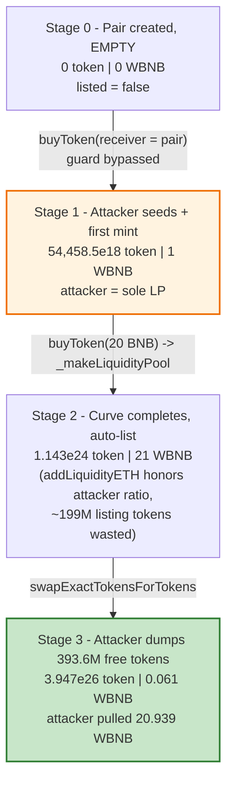
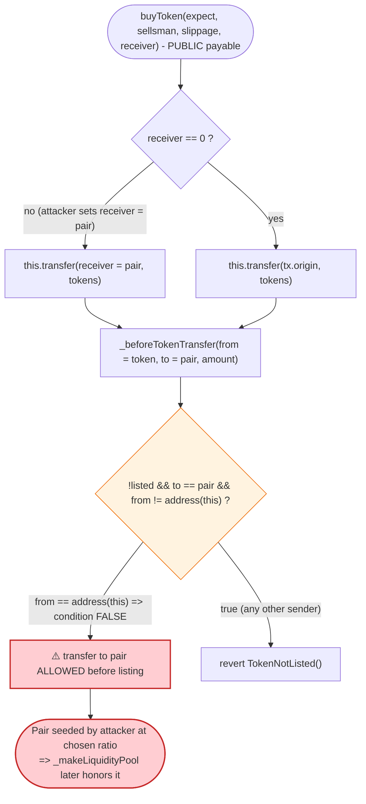

# Pump / TiPTAG Token Exploit — Permissionless Pre-Listing Liquidity Seeding Drains the Bonding-Curve Listing

> **Vulnerability classes:** vuln/access-control/missing-auth · vuln/logic/incorrect-state-transition

> **Reproduction:** the PoC compiles & runs in an isolated Foundry project at
> [this project folder](.) (the umbrella DeFiHackLabs repo does not whole-compile,
> so this PoC was extracted).
> Full verbose trace: [output.txt](output.txt).
> Verified vulnerable source: [contracts_Token.sol](sources/Token_09762e/contracts_Token.sol)
> · launchpad logic: [contracts_Pump.sol](sources/Pump_a77253/contracts_Pump.sol).

---

## Key info

| | |
|---|---|
| **Loss** | **~11.29 BNB (~$6.4K)** — net profit, drained across 4 Pump/TiPTAG tokens in one tx |
| **Vulnerable contract** | `Token` (Pump/TiPTAG launchpad token template) — e.g. TAGAIFUN [`0x09762e00Ce0DE8211F7002F70759447B1F2b1892`](https://bscscan.com/address/0x09762e00Ce0DE8211F7002F70759447B1F2b1892#code) |
| **Launchpad / manager** | `Pump` — [`0xa77253Ac630502A35A6FcD210A01f613D33ba7cD`](https://bscscan.com/address/0xa77253Ac630502A35A6FcD210A01f613D33ba7cD#code) |
| **Victim tokens / pools** | TAGAIFUN, GROK, PEPE, TEST — each its PancakeSwap-V2 token/WBNB pair |
| **Attacker EOA** | [`0x5d6e908c4cd6eda1c2a9010d1971c7d62bdb5cd3`](https://bscscan.com/address/0x5d6e908c4cd6eda1c2a9010d1971c7d62bdb5cd3) |
| **Attacker contract** | [`0x0e220c6c52d383869a5085ef074b6028254b3462`](https://bscscan.com/address/0x0e220c6c52d383869a5085ef074b6028254b3462) |
| **Attack tx** | [`0xdebaa13fb06134e63879ca6bcb08c5e0290bdbac3acf67914c0b1dcaf0bdc3dd`](https://bscscan.com/tx/0xdebaa13fb06134e63879ca6bcb08c5e0290bdbac3acf67914c0b1dcaf0bdc3dd) |
| **Chain / block / date** | BSC / 47,169,116 / **2025-03-04** |
| **Compiler** | Solidity v0.8.20, optimizer **1000 runs** |
| **Bug class** | Access-control / state-machine flaw — pre-listing AMM-pool seeding bypass enabling bonding-curve liquidity theft |

---

## TL;DR

The Pump (TiPTAG) launchpad mints tokens that live on a bonding curve until enough is sold, at which
point `buyToken()` auto-lists the token by dumping `liquidityAmount` (200M tokens) plus the collected
ETH into a freshly created PancakeSwap-V2 pair via `addLiquidityETH`
([contracts_Token.sol:218-234](sources/Token_09762e/contracts_Token.sol#L218-L234)).

The token's `_beforeTokenTransfer` guard tries to stop anyone seeding the pair before listing:

```solidity
if (!listed && to == pair && from != address(this)) revert TokenNotListed();
```

But it carves out `from == address(this)` — and `buyToken()` mints to its `receiver` via
`this.transfer(receiver, …)`, where `from` **is** the token contract. So the attacker calls
`buyToken{value: 0.001 ether}` with **`receiver = pair`**, legally pushing bonding-curve tokens
straight into the not-yet-listed pair. The attacker then deposits 1 WBNB and `mint()`s the pair as the
**first liquidity provider**, fixing the pool at a distorted ratio of his choosing.

When the attacker then completes the bonding curve with `buyToken{value: 20 ether}`, the launchpad's
`_makeLiquidityPool()` runs against the **already-seeded** pair: instead of adding the full 200M tokens
against ~20 WBNB, `addLiquidityETH` honors the attacker's distorted ratio (≈1.089M tokens : 20 WBNB),
silently sending the unmatched ~199M tokens to dust. The attacker, holding ~393M *free* curve tokens
from the same call, immediately dumps them into the now WBNB-heavy pool and pulls out **~20.9 WBNB —
more than the ~18.5 WBNB he spent** on that token. Repeating the recipe across 4 mid-curve tokens nets
**+11.29 BNB**, financed entirely by a 100-WBNB PancakeV3 flash loan.

---

## Background — what Pump / TiPTAG does

`Pump` ([contracts_Pump.sol](sources/Pump_a77253/contracts_Pump.sol)) is a pump.fun-style launchpad on
BSC. `createToken()` deploys a `Token` ([contracts_Token.sol](sources/Token_09762e/contracts_Token.sol))
with a fixed supply split:

| Allocation | Constant | Amount |
|---|---|---|
| Bonding-curve sale | `bondingCurveTotalAmount` | 650,000,000 |
| DEX liquidity | `liquidityAmount` | 200,000,000 |
| Social distribution | `socialDistributionAmount` | 150,000,000 |

([contracts_Token.sol:24-26](sources/Token_09762e/contracts_Token.sol#L24-L26))

Life cycle of a token:

1. **Bonding-curve phase.** Users call `buyToken()` / `sellToken()`. Price follows an exponential curve
   (`getBuyAmountByValue`, [contracts_Pump.sol:278-287](sources/Pump_a77253/contracts_Pump.sol#L278-L287)).
   `bondingCurveSupply` tracks tokens sold so far.
2. **Pair pre-created, but empty.** `initialize()` calls `factory.createPair(token, WETH)` up front
   ([contracts_Token.sol:78-79](sources/Token_09762e/contracts_Token.sol#L78-L79)), so the pair address
   exists with **zero reserves** during the whole curve phase.
3. **Auto-listing.** When a buy pushes `bondingCurveSupply` to `bondingCurveTotalAmount`, `buyToken()`
   takes its terminal branch ([:103-133](sources/Token_09762e/contracts_Token.sol#L103-L133)) and calls
   `_makeLiquidityPool()`, which `addLiquidityETH`'s the 200M `liquidityAmount` tokens + all collected
   ETH into the pair, sets `listed = true`, and burns the LP to the black hole.

The transfer guard is meant to keep the pair empty until step 3:

```solidity
function _beforeTokenTransfer(address from, address to, uint256 amount) internal override {
    if (!listed && to == pair && from != address(this)) revert TokenNotListed();
    return super._beforeTokenTransfer(from, to, amount);
}
```
([contracts_Token.sol:246-251](sources/Token_09762e/contracts_Token.sol#L246-L251))

The four victim tokens (TAGAIFUN, GROK, PEPE, TEST) were each **mid-curve** at the fork block — e.g.
TAGAIFUN had `bondingCurveSupply ≈ 256.3M` of 650M already sold. That partially-filled, not-yet-listed
state is exactly what the attack needs.

---

## The vulnerable code

### 1. `buyToken` lets the *caller pick the receiver* of freshly transferred tokens

```solidity
function buyToken(uint256 expectAmount, address sellsman, uint16 slippage, address receiver)
    public payable nonReentrant returns (uint256)
{
    sellsman = _checkBondingCurveState(sellsman);
    if (receiver == address(0)) receiver = tx.origin;
    ...
    this.transfer(receiver, tokenReceived);   // ← from == address(this); receiver is attacker-chosen
    bondingCurveSupply += tokenReceived;
    ...
}
```
([contracts_Token.sol:83-154](sources/Token_09762e/contracts_Token.sol#L83-L154); transfer at
[:149](sources/Token_09762e/contracts_Token.sol#L149) and terminal-branch transfer at
[:127](sources/Token_09762e/contracts_Token.sol#L127))

The token movement to `receiver` is a `this.transfer(...)`, i.e. an ERC20 transfer **from the token
contract itself**.

### 2. The pre-listing guard exempts `from == address(this)`

```solidity
function _beforeTokenTransfer(address from, address to, uint256 amount) internal override {
    if (!listed && to == pair && from != address(this)) revert TokenNotListed();   // ⚠️ hole
    return super._beforeTokenTransfer(from, to, amount);
}
```
([contracts_Token.sol:246-251](sources/Token_09762e/contracts_Token.sol#L246-L251))

Combine 1 + 2: calling `buyToken{value: …}(0, address(0), 0, pair)` makes the token contract transfer
tokens **to the pair** while `from == address(this)`, so the guard does **not** revert. The pair, which
the protocol intended to keep empty until listing, is now seeded — by an external attacker, at an
arbitrary price.

### 3. `_makeLiquidityPool` trusts the (now attacker-controlled) pair ratio

```solidity
function _makeLiquidityPool() private {
    _approve(address(this), IPump(manager).getUniswapV2Router(), liquidityAmount);
    IUniswapV2Router02 router = IUniswapV2Router02(IPump(manager).getUniswapV2Router());
    router.addLiquidityETH{value: address(this).balance}(
        address(this), liquidityAmount, 0, 0, BlackHole, block.timestamp + 300   // ⚠️ minAmounts = 0
    );
    listed = true;
    emit TokenListedToDex(pair);
}
```
([contracts_Token.sol:218-234](sources/Token_09762e/contracts_Token.sol#L218-L234))

`addLiquidityETH` adds liquidity at the **existing reserve ratio** of the pair. Because the attacker
already fixed that ratio (≈54,458 token : 1 WBNB for TAGAIFUN), the router only pulls ~1.089M tokens to
match the ~20 WBNB — the remaining ~199M of the 200M `liquidityAmount` are abandoned to dust. With
`amountTokenMin = amountETHMin = 0`, there is **no slippage protection** to detect the manipulated pool.

---

## Root cause — why it was possible

The protocol assumes the pair is empty until the bonding curve fills and `_makeLiquidityPool()` runs.
Three composing flaws break that assumption:

1. **Receiver injection in `buyToken`.** The buyer chooses an arbitrary `receiver`. Nothing prevents
   `receiver == pair`. Tokens are delivered via `this.transfer`, so `from == address(this)`.
2. **The transfer guard's `from == address(this)` exemption.** The guard exists *specifically* to keep
   the pair empty before listing, yet it whitelists the one path (`buyToken → this.transfer`) that an
   attacker can drive to the pair. The exemption was presumably added so that listing (`addLiquidityETH`
   pulls tokens *from* the contract) wouldn't revert — but it also blesses the attacker's seeding.
3. **`_makeLiquidityPool` blindly honors the pair's current ratio with zero `minAmount` checks.** Once
   the attacker has seeded the pair at a distorted ratio, the official listing liquidity is added on top
   of that distortion instead of establishing a fair price, and the abandoned-token loss is silent.

The net economic effect: the attacker buys the *remaining* ~393M bonding-curve tokens for ~18.5 WBNB
(curve price), but because he controls the pool that those tokens are valued against — and because the
listing dumps another ~20 WBNB of real ETH into that pool while wasting 199M of the 200M listing tokens
— he can immediately sell his free curve tokens back out for **more WBNB than he paid**. He is, in
effect, front-running the protocol's own market-making at a price he sets himself.

---

## Preconditions

- A Pump/TiPTAG `Token` that is **mid-bonding-curve and not yet listed** (`listed == false`,
  `0 < bondingCurveSupply < bondingCurveTotalAmount`). All four victim tokens qualified at the fork block.
- The token's pair already exists (always true — `initialize()` creates it) and is empty.
- Enough WBNB working capital to (a) seed each pair with 1 WBNB and (b) pay the ~17.5 WBNB curve-completion
  price per token. Peak outlay is fully recovered in-tx, hence **flash-loanable** — the PoC borrows 100
  WBNB from the PancakeV3 BUSD/WBNB pool ([test/Pump_exp.sol:80](test/Pump_exp.sol#L80)).

---

## Attack walkthrough (with on-chain numbers from the trace)

All figures come from the `Sync` / `Swap` / `Trade` events in [output.txt](output.txt). The recipe runs
identically for each of the 4 tokens inside the flash-loan callback
([test/Pump_exp.sol:83-115](test/Pump_exp.sol#L83-L115)); numbers below are TAGAIFUN unless noted.

| # | Step | Code | Effect (TAGAIFUN) |
|---|------|------|--------|
| 0 | **Flash-borrow 100 WBNB** from PancakeV3 BUSD/WBNB pool; unwrap to 100 BNB | [test:80-85](test/Pump_exp.sol#L80-L85) | Working capital; fee = 0.01 WBNB |
| 1 | **Seed the pair** — `buyToken{value: 0.001 BNB}(0,0,0, pair)` | [Token:83](sources/Token_09762e/contracts_Token.sol#L83) + [:246](sources/Token_09762e/contracts_Token.sol#L246) | Token contract `transfer`s **54,458.5e18 TAGAIFUN → pair** (guard bypassed) |
| 2 | **Become first LP** — deposit 1 WBNB to pair, `pair.mint(attacker)` | [test:93-95](test/Pump_exp.sol#L93-L95) | Pair reserves set to **54,458.5e18 token : 1 WBNB**; attacker gets 233.36e18 LP |
| 3 | **Complete the curve** — `buyToken{value: 20 BNB}(0,0,0, attacker)` | [Token:103-133](sources/Token_09762e/contracts_Token.sol#L103-L133) | `actualAmount = 650M − 256.3M = 393.6M` tokens sent to attacker for **17.45 WBNB** (2.545 refunded); triggers listing |
| 3a | ↳ **Auto-list** — `_makeLiquidityPool` `addLiquidityETH(200M, 20 WBNB)` | [Token:218-234](sources/Token_09762e/contracts_Token.sol#L218-L234) | Router pulls only **1.089M tokens** vs 20 WBNB; ~199M listing tokens wasted; reserves → **1.143e24 token : 21 WBNB** |
| 4 | **Dump free curve tokens** — swap 393.6M token → WBNB | [test:103-105](test/Pump_exp.sol#L103-L105) | `Swap` out = **20.939 WBNB** to attacker; reserves → 3.947e26 token : 0.061 WBNB |
| 5 | **Repeat** for GROK / PEPE / TEST | loop | +20.940 / +20.945 / +20.926 WBNB respectively |
| 6 | **Repay** 100.01 WBNB to PancakeV3 pool; withdraw remainder to attacker | [test:108-114](test/Pump_exp.sol#L108-L114) | Net **+11.290895 BNB** |

### Per-token economics (BNB)

For each token: spend `0.001` (seed buy) + `1` (LP deposit) + `(20 − refund)` (curve completion), and
receive the swap-dump WBNB. The LP deposit's WBNB is locked in dust LP, but the swap recovery more than
compensates.

| Token | Seed buy | LP deposit | Curve buy (net, after refund) | Swap recovered | Net |
|---|---:|---:|---:|---:|---:|
| TAGAIFUN | −0.001 | −1.000 | −17.455 (refund 2.545) | +20.939 | **+2.483** |
| GROK | −0.001 | −1.000 | −17.234 (refund 2.766) | +20.940 | **+2.705** |
| PEPE | −0.001 | −1.000 | −14.666 (refund 5.334) | +20.945 | **+5.279** |
| TEST | −0.001 | −1.000 | −19.091 (refund 0.909) | +20.926 | **+0.834** |
| | | | | **Subtotal** | **+11.301** |

### Flash-loan settlement (BNB / WBNB)

| Item | Amount |
|---|---:|
| Flash borrowed (WBNB) | 100.000000 |
| Sum of 4 token nets (above) | +11.300895 |
| Contract BNB before repay | 111.300895 |
| Flash repay (principal + 0.01 fee) | −100.010000 |
| **Net profit withdrawn to attacker** | **+11.290895** |

The measured `Attacker After exploit BNB Balance` in the trace is **11.290895446051366537** — matching the
reconstruction to the wei.

---

## Diagrams

### Sequence of the attack (one token; repeated 4×)

```mermaid
sequenceDiagram
    autonumber
    actor A as "Attacker contract"
    participant V3 as "PancakeV3 BUSD/WBNB pool"
    participant T as "Token (TAGAIFUN)"
    participant P as "Pancake V2 pair (token/WBNB)"
    participant R as "Pancake V2 Router"

    A->>V3: flash(borrow 100 WBNB)
    V3-->>A: 100 WBNB
    A->>A: WBNB.withdraw -> 100 BNB

    rect rgb(255,243,224)
    Note over A,T: Step 1 - seed the empty pair (guard bypassed)
    A->>T: "buyToken{0.001 BNB}(receiver = pair)"
    T->>P: "this.transfer(pair, 54,458.5e18 token)  (from == token => allowed)"
    Note over P: pair now holds 54,458.5e18 token / 0 WBNB
    end

    rect rgb(232,245,233)
    Note over A,P: Step 2 - become first LP at chosen ratio
    A->>P: "transfer 1 WBNB"
    A->>P: "mint(attacker)"
    Note over P: reserves 54,458.5e18 token : 1 WBNB
    end

    rect rgb(227,242,253)
    Note over A,T: Step 3 - complete bonding curve -> auto-list
    A->>T: "buyToken{20 BNB}(receiver = attacker)"
    T-->>A: "393.6M free curve tokens (cost 17.45 WBNB, 2.545 refunded)"
    T->>R: "_makeLiquidityPool: addLiquidityETH(200M, ~20 WBNB)"
    R->>P: "pulls only 1.089M token vs 20 WBNB (rest wasted)"
    Note over P: reserves 1.143e24 token : 21 WBNB ; listed = true
    end

    rect rgb(243,229,245)
    Note over A,P: Step 4 - dump free tokens
    A->>R: "swapExactTokensForTokens(393.6M token -> WBNB)"
    R->>P: swap
    P-->>A: "20.939 WBNB"
    end

    Note over A,V3: After 4 tokens: repay 100.01 WBNB, keep +11.29 BNB
```

### Pool state evolution (TAGAIFUN, reserve0 = token / reserve1 = WBNB)



### The flaw: how the guard is bypassed



---

## Why each magic number

- **`borrowAmount = 100 WBNB`** ([test:72](test/Pump_exp.sol#L72)): headroom to run all 4 tokens; the 4 token
  recipes peak around ~21 WBNB each but the swap recovery keeps the running balance ≥ 100. Fee is a flat
  0.01 WBNB on the PancakeV3 flash.
- **`buyToken{value: 0.001 ether}` to `pair`** ([test:91](test/Pump_exp.sol#L91)): only needs to put a
  *nonzero* token balance into the empty pair so the attacker can `mint()` LP and pin a ratio. 0.001 BNB on a
  mid-curve token buys ~54,458 tokens — enough to be the sole LP.
- **`deposit 1 ether` + `transfer` + `mint`** ([test:93-95](test/Pump_exp.sol#L93-L95)): establishes the
  reserve ratio (54,458.5e18 token : 1 WBNB) that `_makeLiquidityPool`'s `addLiquidityETH` will later honor,
  forcing it to waste ~199M of the 200M listing tokens.
- **`buyToken{value: 20 ether}` to self** ([test:96](test/Pump_exp.sol#L96)): more than the ~17.5 WBNB needed
  to complete each curve, so the terminal branch refunds the excess; the goal is to (a) get the remaining
  ~393M free curve tokens and (b) trigger `_makeLiquidityPool` which injects 20 WBNB of real ETH into the
  attacker-shaped pool.

---

## Remediation

1. **Do not exempt `address(this)` blindly in the pre-listing guard.** The exemption was meant to let
   *listing* move tokens to the pair, but it also lets `buyToken`'s `this.transfer` reach the pair. Gate
   the exemption to the listing path only — e.g. a transient `bool _listing` flag set inside
   `_makeLiquidityPool` — so that *no* user-driven path can deliver tokens to the pair before `listed`.
2. **Forbid `receiver == pair` (and `receiver == address(this)`) in `buyToken`.** Bonding-curve buyers
   should never be able to direct minted tokens into the AMM pair.
3. **Never market-make against a pre-existing pair.** `_makeLiquidityPool` should assert the pair is empty
   (both reserves == 0) before calling `addLiquidityETH`, or create the pair lazily *at listing time* rather
   than in `initialize()`. A non-empty pair at listing is proof of tampering and must revert.
4. **Set real `minAmount`s in `addLiquidityETH`.** Passing `0, 0` means any pre-seeded ratio is accepted and
   the wasted-token loss is silent. Require the router to consume (close to) the full `liquidityAmount`, or
   revert.
5. **Create the pair only at listing.** Eliminating the long-lived empty pair removes the window entirely.

---

## How to reproduce

The PoC was extracted into a standalone Foundry project (the umbrella DeFiHackLabs repo does not
whole-compile under `forge test`):

```bash
_shared/run_poc.sh 2025-03-Pump_exp -vvvvv
```

- RPC: a **BSC archive** endpoint is required (fork block 47,169,115). `foundry.toml` uses
  `https://bsc-mainnet.public.blastapi.io`, which serves historical state at that block; most public BSC
  RPCs prune it and fail with `header not found` / `missing trie node`.
- Local imports beyond `forge-std` and `interface.sol`: this PoC also pulls in `basetest.sol`
  (`BaseTestWithBalanceLog`) and `tokenhelper.sol` (`TokenHelper` library), both copied into the project root
  next to the test.
- Result: `[PASS] testExploit()` with `Attacker After exploit BNB Balance: 11.290895446051366537`.

Expected tail:

```
  Attacker Before exploit BNB Balance: 0.000000000000000000
  Attacker After exploit BNB Balance: 11.290895446051366537

Suite result: ok. 1 passed; 0 failed; 0 skipped; finished in 38.65s
Ran 1 test suite: 1 tests passed, 0 failed, 0 skipped (1 total tests)
```

---

*Reference: TenArmor alert — https://x.com/TenArmorAlert/status/1897115993962635520 (Pump/TiPTAG, BSC, ~$6.4K).*
