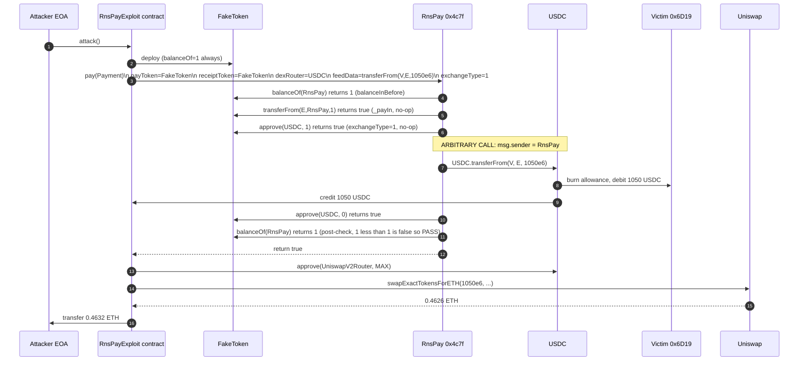

# RnsPay arbitrary `dexRouter` call drains any token a victim approved to the protocol — attacker-supplied exchange target lets `pay()` execute `transferFrom` against arbitrary victims

> **Vulnerability classes:** vuln/access-control/missing-validation · vuln/logic/missing-check · vuln/dependency/unsafe-external-call
> **Reproduction:** the PoC compiles & runs in an isolated Foundry project at [this project folder](.). Full verbose trace: [output.txt](output.txt). Vulnerable contract source is verified on Etherscan and fetched locally to [sources/RnsPay_4c7f92/Rnspay.sol](sources/RnsPay_4c7f92/Rnspay.sol).

---

## Key info

| | |
|---|---|
| **Loss** | 1,050 USDC (~$1,050), laundered to 0.4632 ETH via Uniswap V2 [output.txt:1565](output.txt) |
| **Vulnerable contract** | RnsPay — [`0x4c7f92d77b331EA74092e2E347c9FD026FAA1c3f`](https://etherscan.io/address/0x4c7f92d77b331ea74092e2e347c9fd026faa1c3f) |
| **Attacker EOA** | [`0x806D9D1F1B80107A294393c76258b69b441565f0`](https://etherscan.io/address/0x806d9d1f1b80107a294393c76258b69b441565f0) |
| **Attack contract** | [`0x5198bc63edf0f9d9926c4cd4db4ef18032ac4767`](https://etherscan.io/address/0x5198bc63edf0f9d9926c4cd4db4ef18032ac4767) |
| **Attack tx** | [`0x69a825ffedeb4461afc95e21475c011b1675a95d318bb1dd63b13307dfe3b9ed`](https://etherscan.io/tx/0x69a825ffedeb4461afc95e21475c011b1675a95d318bb1dd63b13307dfe3b9ed) |
| **Chain / block / date** | Ethereum mainnet / 21,988,705 / 2025-03-06 |
| **Compiler** | solc v0.8.18+commit.87f61d96, optimizer enabled, 800,000 runs (verified) |
| **Bug class** | The protocol's `pay()` function lets the caller choose an arbitrary `dexRouterContractAddress` plus arbitrary `dexRouterFeedData` and performs a low-level `router.call(feedData)` from RnsPay's own context — so an attacker can make RnsPay issue `ERC20.transferFrom(victim, attacker, amount)` for any victim who has approved RnsPay. |

## TL;DR

RnsPay is a payments contract intended to route a user's payment token through a DEX and forward the converted receipt token to a merchant. To support that, its `pay()` flow accepts a fully attacker-controlled `dexRouterContractAddress` and `dexRouterFeedData`, then blindly executes `dexRouterContractAddress.call(dexRouterFeedData)` with RnsPay as `msg.sender`. There is no allow-list check on the router (the `exchanges` mapping exists but is never consulted), no validation that the calldata is actually a swap, and no check that the tokens moved belong to the caller.

The exploit weaponises this by supplying a `FakeToken` as both `payToken` and `receiptToken` so that RnsPay's own pre/post balance checks (`balanceOf(address(this))`) all return the constant `1` and trivially pass. The attacker then points `dexRouterContractAddress` at the **USDC contract** and `dexRouterFeedData` at an encoded `transferFrom(victim, attackerContract, 1_050 * 1e6)`. Because RnsPay is the caller, USDC sees RnsPay as the approved `msg.sender` and pulls 1,050 USDC out of a wallet that had granted RnsPay a USDC allowance. The PoC proves this exactly: the victim's USDC balance drops from 76,558.30 to 75,508.30 USDC [output.txt:1591](output.txt), [output.txt:1680](output.txt), and the attacker contract receives the 1,050 USDC [output.txt:1611](output.txt).

The attacker then swaps the stolen USDC through Uniswap V2 (USDC/WETH pair) for 0.4626 WETH, unwraps it, and forwards 0.4632 ETH to the attacker EOA [output.txt:1565](output.txt). The whole attack is permissionless — anyone can call `pay()` — and only requires finding one address that has an outstanding RnsPay approval on a valuable token.

## Background — what RnsPay does

RnsPay is an Ownable2Step payment-routing contract. Its single public entry point is `pay(Payment calldata payment)`, which is meant to take a "pay" token from a user, optionally convert it through a DEX into a "receipt" token, and forward the receipt token to a merchant wallet, optionally paying a fee to a separate receiver. The `Payment` struct bundles everything the contract needs:

```solidity
struct Payment {
  string orderId;                          // orderId
  uint256 payTokenAmountIn;                // amountIn
  uint256 receiptTokenAmountOut;           // paymentAmount
  uint256 feeAmount;
  address payTokenContractAddress;         // tokenInAddress
  address dexRouterContractAddress;        // exchangeAddress   <-- attacker-controlled
  address receiptTokenContractAddress;     // tokenOutAddress
  address receiverWalletAddress;           // paymentReceiverAddress
  address feeReceiverAddress;
  uint8 exchangeType;                      // uniswap_v3, uniswap_v2
  bytes dexRouterFeedData;                 // exchangeCallData  <-- attacker-controlled
  uint256 orderInvalidatedMoment;          // deadline
}
```
*(interface in [sources/RnsPay_4c7f92/Rnspay.sol:717-736](sources/RnsPay_4c7f92/Rnspay.sol))*

The intended flow is: pull `payTokenAmountIn` of the pay token from `msg.sender`, call the DEX to convert pay-token into receipt-token, transfer `receiptTokenAmountOut` of the receipt token to the merchant, and transfer `feeAmount` of the receipt token to the fee receiver. Two balance guards are taken before and after the call to assert that RnsPay's own pay-token and receipt-token balances never decrease (i.e. the user pays the protocol, the protocol pays the merchant, and RnsPay never loses funds).

Crucially, the contract is **designed to be called by ordinary users who supply their own DEX router address and calldata**. The struct comments even label these fields "exchangeAddress" and "exchangeCallData". There is an `exchanges` allow-list mapping and an `onlyOwner enable(exchange, enabled)` setter, but — as the vulnerable code below shows — the `pay()` path never reads `exchanges[dexRouterContractAddress]`. The allow-list is dead code with respect to the exploit path.

## The vulnerable code

The entire kill chain lives in `_convert`, reached from `pay` → `_pay` → `_performPayment` → `_convert`. Source: [sources/RnsPay_4c7f92/Rnspay.sol:910-933](sources/RnsPay_4c7f92/Rnspay.sol).

```solidity
function _convert(IRnsPay.Payment calldata payment) internal {
  bool success;
  if(payment.payTokenContractAddress == NATIVE) {
    if(payment.dexRouterFeedData.length == 0) {
      revert ExchangeCallMissing();
    }
    (success,) = payment.dexRouterContractAddress.call{value: msg.value}(payment.dexRouterFeedData);
  } else {
    if(payment.exchangeType == 1) {         // pull
      IERC20(payment.payTokenContractAddress).safeApprove(payment.dexRouterContractAddress, payment.payTokenAmountIn);
    } else if(payment.exchangeType == 2) {  // push
      IERC20(payment.payTokenContractAddress).safeTransfer(payment.dexRouterContractAddress, payment.payTokenAmountIn);
    }
    // VULNERABLE: arbitrary address, arbitrary calldata, msg.sender == RnsPay
    (success,) = payment.dexRouterContractAddress.call(payment.dexRouterFeedData);
    if(payment.exchangeType == 1) {         // pull
      IERC20(payment.payTokenContractAddress).safeApprove(payment.dexRouterContractAddress, 0);
    }
  }
  if(!success){
    revert ExchangeCallFailed();
  }
}
```

### No router allow-list is enforced

The `exchanges` mapping and `enable()` setter exist, but `pay()` / `_convert()` never consult them:

```solidity
mapping (address => bool) public exchanges;          // line 780
...
function enable(address exchange, bool enabled) external onlyOwner returns(bool) { ... }  // line 989
```

A read of the file shows `exchanges[` is referenced only inside admin code — never in the `pay` path. So `dexRouterContractAddress` is effectively free-form.

### Balance guards can be blinded with a fake token

The only thing standing between the attacker and the arbitrary call is `_validatePostConditions`, which checks that RnsPay's pay-token and receipt-token balances did not drop:

```solidity
if(IERC20(payment.payTokenContractAddress).balanceOf(address(this)) < balanceInBefore) {
  revert InsufficientBalanceInAfterPayment();
}
...
if(IERC20(payment.receiptTokenContractAddress).balanceOf(address(this)) < balanceOutBefore) {
  revert InsufficientBalanceOutAfterPayment();
}
```
*([sources/RnsPay_4c7f92/Rnspay.sol:888-908](sources/RnsPay_4c7f92/Rnspay.sol))*

Because the contract reads balances via `IERC20(...).balanceOf(address(this))` against the **caller-supplied** token address, an attacker who supplies a fake ERC-20 that always returns `1` from `balanceOf` makes both `balanceInBefore == balanceOutBefore == 1` and the post-check trivially `1 < 1 == false`. The PoC's `FakeToken` does exactly this:

```solidity
contract FakeToken {
  function balanceOf(address) external pure returns (uint256) { return 1; }
  function allowance(address, address) external pure returns (uint256) { return 0; }
  function transferFrom(address, address, uint256) external pure returns (bool) { return true; }
  function approve(address, uint256) external pure returns (bool) { return true; }
  function transfer(address, uint256) external pure returns (bool) { return true; }
}
```
*([test/RnsPay_exp.sol](test/RnsPay_exp.sol))*

### The arbitrary call is made with RnsPay as `msg.sender`

When `_convert` runs `(success,) = payment.dexRouterContractAddress.call(payment.dexRouterFeedData);`, the call's `msg.sender` is RnsPay itself. If `dexRouterContractAddress` is pointed at a real ERC-20 (e.g. USDC) and `dexRouterFeedData` encodes `transferFrom(victim, attacker, amount)`, then USDC's `transferFrom` sees an authorised `msg.sender == RnsPay` pulling tokens from any `victim` that has approved RnsPay.

## Root cause — why it was possible

1. **No validation on the exchange target.** `dexRouterContractAddress` is taken verbatim from calldata and called. There is no `require(exchanges[dexRouterContractAddress], "exchange not allowed")`. The owner-controlled allow-list exists but is never enforced in `pay()`.
2. **No validation on the exchange calldata.** `dexRouterFeedData` is opaque bytes passed straight to `.call()`. Nothing checks that the selector is a swap function, that it references the pay token, or that it operates only on the caller's funds.
3. **Balance guards operate on the wrong token identity.** The pre/post checks query `payTokenContractAddress.balanceOf(address(this))`, but the token address is also caller-supplied. A fake token blinds the check entirely, so the protocol never observes the real USDC leaving a victim.
4. **`transferFrom` authorisation is delegated to the protocol's identity.** Because RnsPay is the one performing the call, every victim that has ever approved RnsPay (legitimately, to pay a merchant) is a target. The contract conflates "user authorised RnsPay to move their tokens for a payment" with "RnsPay may move those tokens for any reason it is told to."
5. **Permissionless entry.** `pay()` has no access control. Anyone can call it with any `Payment`, so the search cost for an attacker is just "find any address with an outstanding RnsPay allowance."

## Preconditions

- Permissionless — `pay()` is open to any caller. No privileged role required.
- Requires at least one external address that has approved RnsPay to spend a token. The real attack used USDC victim `0x6D191737f9653A66D0e8236fFF6E8EA543C05bC0`. Any prior legitimate user of RnsPay who did not revoke their allowance is a candidate.
- No flash loan is required. The attacker only needs gas. Profit is realised by swapping the drained token on a public DEX after the theft.

## Attack walkthrough (with on-chain numbers from the trace)

The PoC forks mainnet at block 21,988,705 and reproduces the attack against the live USDC contract and the real victim allowance. Numbers are from the verbose trace.

| Step | Action | On-chain result |
|------|--------|-----------------|
| 0 | Snapshot victim USDC balance | 76,558.295557 USDC (76,558,295,557 raw) [output.txt:1591](output.txt) |
| 1 | Deploy `FakeToken` and `RnsPayExploit` | `FakeToken@0x104f...`, `RnsPayExploit@0x5615...` [output.txt:1597-1598](output.txt) |
| 2 | Build `dexRouterFeedData` = `transferFrom(victim, exploitContract, 1_050e6)` (selector `0x23b872dd`) | hex shown in trace [output.txt:1598](output.txt) |
| 3 | Call `RnsPay.pay()` with `payToken = receiptToken = FakeToken`, `dexRouterContractAddress = USDC`, `exchangeType = 1` (pull) | RnsPay runs `_validatePreConditions` → `FakeToken.balanceOf(RnsPay) == 1` [output.txt:1599](output.txt) |
| 4 | `_payIn` pulls "1" FakeToken from attacker (no-op) | `FakeToken::transferFrom → true` [output.txt:1603](output.txt) |
| 5 | `_convert`: because `exchangeType == 1`, RnsPay calls `FakeToken.safeApprove(USDC, 1)` (no-op on fake token) | [output.txt:1605](output.txt) |
| 6 | `_convert`: **arbitrary call** — `USDC.transferFrom(victim, exploit, 1_050e6)` with `msg.sender = RnsPay` | USDC pulls 1,050 USDC from victim; `emit Transfer(victim → exploit, 1_050e6)` [output.txt:1610-1611](output.txt) |
| 7 | `_convert`: `FakeToken.safeApprove(USDC, 0)` (no-op) | [output.txt:1621](output.txt) |
| 8 | `_payReceiver`: `FakeToken.transfer(exploit, 1)` (no-op) | [output.txt:1622](output.txt) |
| 9 | `_validatePostConditions`: `FakeToken.balanceOf(RnsPay) == 1`, not `< 1` → passes | [output.txt:1623](output.txt) |
| 10 | `swapExactTokensForETH(1_050e6, 0, [USDC, WETH], exploit, deadline)` on Uniswap V2 | Receives 0.4626 WETH from the USDC/WETH pair [output.txt:1661](output.txt) |
| 11 | Router unwraps WETH → ETH | `WETH.withdraw(0.4626e18)` [output.txt:1668](output.txt) |
| 12 | `exploit.receive()` collects 0.4626 ETH, forwards all to attacker EOA | Attacker ETH: 0 → 0.463197226468722730 [output.txt:1564-1565](output.txt) |
| 13 | Re-snapshot victim USDC | 75,508.295557 USDC (75,508,295,557 raw) — exactly 1,050 USDC lower [output.txt:1680](output.txt) |

Profit/loss accounting:
- Victim: −1,050.00 USDC.
- Attacker contract: +1,050 USDC (transiently) → +0.4626 WETH → +0.4626 ETH.
- Attacker EOA: +0.463197226468722730 ETH net (the small extra over the 0.4626 ETH swap output is pre-existing exploit-contract balance forwarded in step 12).
- Fees: 0.3% Uniswap V2 swap fee baked into the 0.4626 ETH output; on-chain tx gas subtracted separately.

## Diagrams



```mermaid
flowchart TD
    A["Attacker calls pay()"] --> B{"dexRouterContractAddress\nallow-listed?"}
    B --|"NO CHECK (bug)"|--> C["execute router.call(feedData)\nmsg.sender = RnsPay"]
    B --|"should be YES"|--> D["reject untrusted router"]
    C --> E{"feedData is a real swap?"}
    E --|"NO CHECK (bug)"|--> F["feedData = transferFrom(victim, attacker, amt)"]
    E --|"should be enforced"|--> D
    F --> G["USDC sees RnsPay as approved msg.sender"]
    G --> H["pulls tokens from any victim\nwho approved RnsPay"]
    H --> I{"RnsPay balance guard\nnotices?"}
    I --|"NO: FakeToken.balanceOf is constant 1"|--> J["post-condition passes\nfunds leave protocol"]
```

## Remediation

1. **Enforce the router allow-list.** At the top of `_convert` (or `_validatePreConditions`), require `require(exchanges[payment.dexRouterContractAddress], "RnsPay: exchange not allowed");`. The mapping already exists; it just needs to be read on the hot path.
2. **Never accept opaque calldata.** Replace `dexRouterContractAddress.call(dexRouterFeedData)` with explicit swap-path parameters (token in, token out, amount, min out, router type) and call a known, audited router interface (`IUniswapV2Router.swapTokensForExactTokens` / V3 `exactInputSingle`). Drop `dexRouterFeedData` entirely.
3. **Bind the swap to the caller's own funds only.** After the swap, verify on a token the contract controls that the conversion consumed exactly the `payTokenAmountIn` the caller deposited, and that no other allowance/transfer could have been used. Concretely, snapshot the *real* pay-token balance of `msg.sender`, not of a caller-supplied token.
4. **Reject caller-supplied token addresses that are not trusted.** Maintain a list of admitted pay/receipt tokens (or at minimum assert `exchanges[...]`-style registration). A fake ERC-20 should never be able to satisfy a balance check.
5. **Revoke all existing user allowances.** Because every prior approval of RnsPay is now a live vulnerability, notify users and have them call `USDC.approve(RnsPay, 0)`. Any redeployment should use a fresh contract address so old allowances point at nothing.
6. **Cap the post-condition by delta, not by absolute floor.** Even with a real token, require `balanceAfter >= balanceBefore + payTokenAmountIn` (the protocol must end up holding *more* of the pay token than it started with, since the user deposited), rather than merely `>= balanceBefore`.

## How to reproduce

The PoC runs fully **offline** via the shared anvil harness committed in `anvil_state.json` — no RPC needed. From the registry root, run:

```bash
_shared/run_poc.sh 2025-03-RnsPay_exp -vvvvv
```

The harness loads the committed `anvil_state.json` (fork of Ethereum mainnet at block **21,988,705**) into a local anvil instance and points the Foundry test at `http://127.0.0.1:8545`. The expected tail of the run, matching [output.txt:1562-1689](output.txt):

```
[PASS] testExploit() (gas: 1260443)
  Attacker Before exploit ETH Balance: 0.000000000000000000
  Attacker After exploit ETH Balance: 0.463197226468722730
Suite result: ok. 1 passed; 0 failed; 0 skipped; ...
```

The PoC asserts two invariants that mechanically prove the exploit: `victimUsdcBefore - victimUsdcAfter == 1_050_000_000` (1,050 USDC drained) and `attacker ETH profit > 0.46 ether`. See [test/RnsPay_exp.sol](test/RnsPay_exp.sol) for the full source.

*Reference: [defimon_alerts on Telegram](https://t.me/defimon_alerts/562).*
