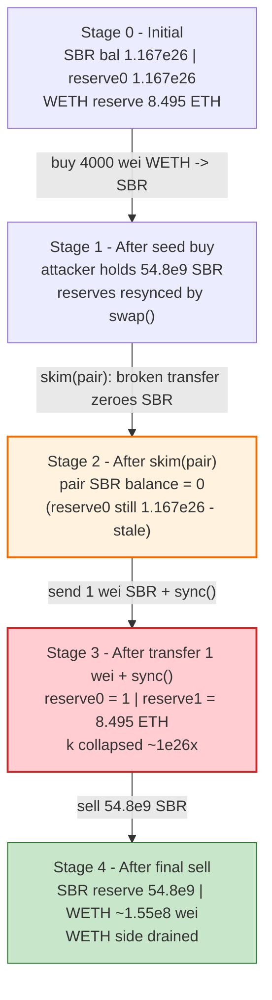
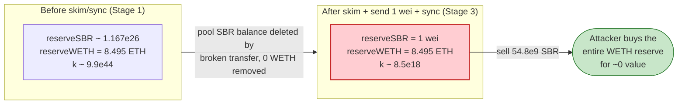
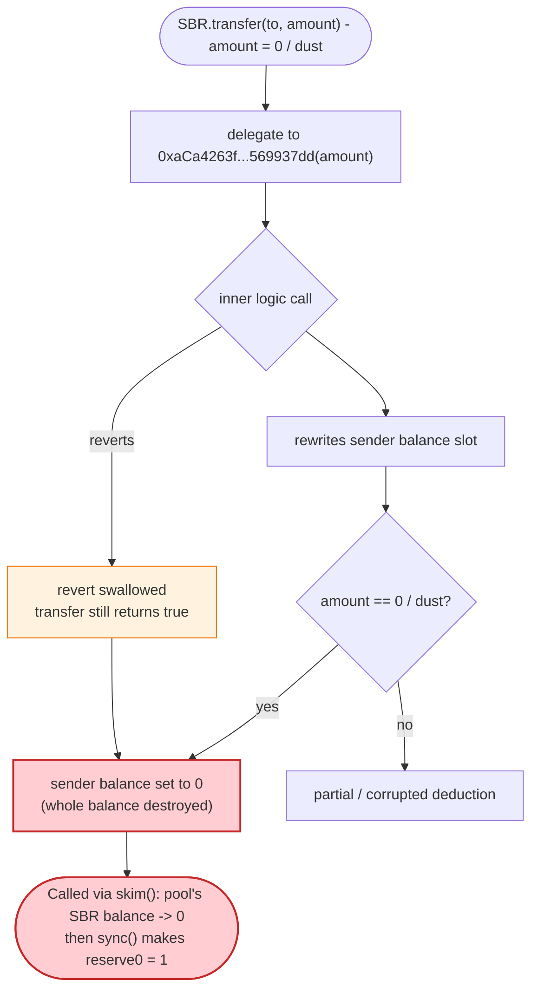

# SBR Token Exploit — `skim()` + broken token `transfer` zeroes a Uniswap-V2 reserve

> **Reproduction:** the PoC compiles & runs in an isolated Foundry project at
> [this project folder](.) (the umbrella DeFiHackLabs repo does not whole-compile,
> so this PoC was extracted).
> Full verbose trace: [output.txt](output.txt).
> The vulnerable SBR token is **unverified** on Etherscan; the weaponized AMM code
> is the standard pair, verified here: [UniswapV2Pair.sol](sources/UniswapV2Pair_3431c5/UniswapV2Pair.sol).

---

## Key info

| | |
|---|---|
| **Loss** | ~**8.495 ETH** (8,495,031,867,920,840,930 wei) — the entire WETH side of the SBR/WETH pool |
| **Vulnerable contract** | `SBR` token — [`0x460B1AE257118Ed6F63Ed8489657588a326a206D`](https://etherscan.io/address/0x460B1AE257118Ed6F63Ed8489657588a326a206D) (unverified; transfer logic delegated to [`0xaCa4263fFddA9E60C7260AAbA08c2b8F80D63cB1`](https://etherscan.io/address/0xaCa4263fFddA9E60C7260AAbA08c2b8F80D63cB1)) |
| **Victim pool** | SBR/WETH Uniswap V2 pair — [`0x3431c535dDFB6dD5376E5Ded276f91DEaA864FF2`](https://etherscan.io/address/0x3431c535dDFB6dD5376E5Ded276f91DEaA864FF2) |
| **Attacker EOA** | [`0x7a6488348a7626c10e35df9ae0a2ad916a56a952`](https://etherscan.io/address/0x7a6488348a7626c10e35df9ae0a2ad916a56a952) |
| **Attacker contract** | [`0x9926796371e0107abe406128fa801fda0e436f44`](https://etherscan.io/address/0x9926796371e0107abe406128fa801fda0e436f44) |
| **Attack tx** | [`0xe4c1aeacf8c93f8e39fe78420ce7a114ecf59dea90047cd2af390b30af54e7b9`](https://etherscan.io/tx/0xe4c1aeacf8c93f8e39fe78420ce7a114ecf59dea90047cd2af390b30af54e7b9) |
| **Chain / block / date** | Ethereum mainnet / 21,991,722 / **2025-03-07** (~01:27 UTC) |
| **Compiler** | PoC: Solidity ^0.8.13 · Pair: v0.5.16 |
| **Bug class** | Broken AMM invariant via a token whose `transfer` deletes the sender's balance — combined with permissionless `skim()`/`sync()` |

---

## TL;DR

The SBR token has a **broken `transfer` implementation**: calling `transfer(x, 0)` (or otherwise
transferring out a tiny/zero amount) **wipes the *entire* balance of the caller** instead of
deducting only the amount sent. The token's transfer logic is delegated to a helper contract
(`0xaCa4263f…`); the inner call reverts but `transfer` still returns `true` and the storage slot
holding the holder's balance is set to `0`.

A Uniswap-V2 pair trusts `IERC20.balanceOf(pair)` to be honest. The attacker exploits this in five
moves:

1. **Buy** a tiny amount of SBR (4000 wei of WETH → 54,804,369,678 SBR) so they hold a position.
2. **Call `skim(pair)`** on the pair. `skim` does `_safeTransfer(SBR, pair, balanceOf(pair) - reserve0)`.
   The surplus is ~0, but the broken SBR `transfer` — invoked with the pair as both sender and amount
   ≈ 0 — **zeroes the pair's entire SBR balance** (from ~1.167e26 down to 0).
3. **Transfer 1 wei** of SBR into the pair, so its SBR balance is exactly `1`.
4. **Call `sync()`**. The pair reads `balanceOf(SBR, pair) = 1` and sets `reserve0 = 1` while
   `reserve1` (WETH) stays at **8.495 ETH**. The pool now believes 1 wei of SBR is worth 8.495 ETH.
5. **Sell** the 54.8e9 SBR bought in step 1 into the now-degenerate pool, draining essentially the
   **whole WETH reserve (8.495 ETH)** to the attacker.

Net cost: 4000 wei of ETH. Net take: ~8.495 ETH.

---

## Background — what the SBR token is

`SBR` (`0x460B1AE2…`) is an unverified ERC-20 on Ethereum mainnet whose core token operations are not
implemented inline but **delegated to an external logic contract** (`0xaCa4263fFddA9E60C7260AAbA08c2b8F80D63cB1`).
In the trace, every SBR `transfer` re-enters that logic contract via selector `0x569937dd`, which reads
SBR's `msgSend()`/`msgReceive()` storage (a stored "from"/"to" context) and rewrites balances:

```text
SBR Token::transfer(to, amount)
 └─ 0xaCa4263f…::569937dd(amount)
      ├─ SBR::msgReceive() / msgSend()     // stored sender / recipient context
      ├─ SBR::balanceOf(pair)              // reads current balance
      └─ writes balance slots              // ← here the bug lives
```

The crucial pathological behaviour, visible directly in the storage diffs of the trace, is that this
logic **does not subtract `amount` from `balanceOf(from)`** — it overwrites the sender's balance slot
in a way that collapses it to `0` when the transferred amount is `0`/dust. SBR is also wired up as a
normal Uniswap-V2 pair token (token0 of the SBR/WETH pair `0x3431c535…`), so it is reachable through
the AMM's `swap`/`skim`/`sync` plumbing.

On-chain state at the fork block (`21,991,721`), read from the trace's `getReserves()`/`balanceOf`
calls:

| Parameter | Value |
|---|---|
| pair `token0` / `token1` | **SBR** / **WETH** |
| pair `reserve0` (SBR) | 116,741,441,055,038,663,162,168,199 (~1.167e26) |
| pair `reserve1` (WETH) | 8,495,031,868,076,313,819 (~**8.495 ETH**) ← the prize |
| pair's actual SBR balance | 116,741,441,055,038,608,357,798,521 |
| attacker SBR balance | 0 |

---

## The vulnerable code

### 1. The SBR token's broken `transfer` (unverified — reconstructed from the trace)

SBR is not verified, so no Solidity source exists. The decisive evidence is in
[output.txt](output.txt) at the `skim()` call: the pair's SBR balance goes from
`116,741,441,055,038,608,357,798,521` to **`0`** as the result of an SBR `transfer(pair, 0)`:

```text
Uniswap V2: Pair::skim(pair)
 ├─ SBR::balanceOf(pair) → 116741441055038608357798521   // surplus over reserve0 ≈ 0
 ├─ SBR::transfer(pair, 0)                                // _safeTransfer(token0, to, balance-reserve0)
 │   ├─ 0xaCa4263f…::569937dd(0)  ← [Revert] EvmError: Revert   // inner logic reverts...
 │   ├─ emit Transfer(pair, pair, 0)                            // ...but transfer still emits & returns true
 │   └─ storage changes:
 │       @ 0x1395f58d68c47c054c6c8eef115df7904bb46da29e7a456e8962d3d4b62058b8:
 │           0x…6090f633571e38507d3279 → 0                       // ⚠️ pair's SBR balance ZEROED
 └─ ...
```

Two independent defects compound here:

- **Catastrophic accounting bug:** transferring **0** (or dust) out of an account **deletes that
  account's whole balance**, rather than subtracting the transferred amount.
- **Silent failure:** the delegated logic call **reverts**, yet `transfer` swallows the revert and
  returns `true` with the corrupted balance committed — so `_safeTransfer`'s success check passes.

### 2. The standard AMM code that trusts the token — `skim` / `sync` / `swap`

The pair is a stock UniswapV2Pair ([UniswapV2Pair.sol](sources/UniswapV2Pair_3431c5/UniswapV2Pair.sol)),
v0.5.16. All three weaponized functions assume `IERC20.balanceOf(pair)` is a faithful number:

```solidity
// force balances to match reserves
function skim(address to) external lock {                       // L485
    address _token0 = token0;
    address _token1 = token1;
    _safeTransfer(_token0, to, IERC20(_token0).balanceOf(address(this)).sub(reserve0)); // L488
    _safeTransfer(_token1, to, IERC20(_token1).balanceOf(address(this)).sub(reserve1));
}

// force reserves to match balances
function sync() external lock {                                 // L493
    _update(IERC20(token0).balanceOf(address(this)),            // L494 — trusts balanceOf
            IERC20(token1).balanceOf(address(this)), reserve0, reserve1);
}
```

[UniswapV2Pair.sol:485-489](sources/UniswapV2Pair_3431c5/UniswapV2Pair.sol#L485-L489) and
[L493-L495](sources/UniswapV2Pair_3431c5/UniswapV2Pair.sol#L493-L495).

`swap()` likewise prices the trade purely from `getReserves()` and only checks the `x·y ≥ k`
invariant against those reserves
([UniswapV2Pair.sol:454-482](sources/UniswapV2Pair_3431c5/UniswapV2Pair.sol#L454-L482)). Once `sync()`
has set `reserve0 = 1`, the invariant is trivially satisfied while the attacker walks off with the
WETH side.

---

## Root cause — why it was possible

The fundamental cause is the **SBR token, not Uniswap**. A Uniswap-V2 pair is a faithful mirror of
`balanceOf(pair)`: `skim()` skims surplus, `sync()` snaps reserves to the live balance. Both functions
are **permissionless by design** and are *safe* only under the (universal) ERC-20 assumption that
`balanceOf` decreases by exactly the amount transferred and never spontaneously collapses.

SBR breaks that assumption. Because its `transfer` deletes the sender's whole balance on a
zero/dust transfer:

1. **`skim(pair)` triggers a `transfer` whose sender is the pair itself.** `skim` computes the
   surplus `balanceOf(pair) - reserve0`; here that is ≈ 0, so it calls `SBR.transfer(pair, 0)`. For a
   normal token this is a harmless no-op. For SBR it **zeroes the pair's SBR balance**, silently
   destroying the pool's entire SBR reserve off the books.
2. **`sync()` then writes the corrupted balance as the canonical reserve.** With the pair holding
   exactly `1` SBR (after the attacker drops in 1 wei), `sync()` sets `reserve0 = 1` while leaving
   `reserve1 = 8.495 ETH` untouched — the constant product `k` collapses by a factor of ~1e26.
3. **`swap()` happily sells against the degenerate pool.** The attacker dumps the ~54.8e9 SBR they
   bought for 4000 wei and the pricing curve (now `1 SBR : 8.495 ETH`) hands them almost the entire
   WETH reserve, with the `x·y ≥ k` check passing because `k` is now ~`1 × 8.495e18`.

In short: an attacker-controlled token + the AMM's blind trust in `balanceOf` + the permissionless
`skim()`/`sync()` reserve-resync primitives = the pool's WETH can be drained for the price of gas.

---

## Preconditions

- An SBR/WETH Uniswap-V2 pair exists with real WETH liquidity (8.495 ETH at the fork block).
- SBR's broken `transfer` (zero/dust transfer deletes the sender's balance) is live — it is the
  token's own code, so always true.
- `skim()` and `sync()` are public on every UniswapV2Pair (always true).
- A trivial amount of starting capital — the attack used **4000 wei** to buy the seed SBR. No flash
  loan needed; this is effectively free.

---

## Attack walkthrough (with on-chain numbers from the trace)

The pair's `token0 = SBR`, `token1 = WETH`, so `reserve0 = SBR`, `reserve1 = WETH`. All figures below
are taken directly from the `Sync`/`Swap` events and `balanceOf` results in
[output.txt](output.txt).

| # | Step | Pair SBR balance | reserve0 (SBR) | reserve1 (WETH) | Effect |
|---|------|-----------------:|---------------:|----------------:|--------|
| 0 | **Initial** | 1.167e26 | 1.167e26 | 8,495,031,868,076,313,819 | Honest pool, ~8.495 ETH locked. |
| 1 | **Buy** — swap 4000 wei WETH → 54,804,369,678 SBR to attacker | 1.167e26 | 1.167e26 | 8,495,031,868,076,317,819 | Attacker now holds 54.8e9 SBR; reserves resynced by `swap`. |
| 2 | **`skim(pair)`** — `transfer(SBR, pair, ~0)` zeroes pair's SBR | **0** | 1.167e26 | 8.495e18 | ⚠️ Pool's SBR balance secretly destroyed; reserves not yet updated. |
| 3 | **`transfer(pair, 1)`** — drop 1 wei SBR into the pair | **1** | 1.167e26 | 8.495e18 | Attacker's SBR: 54,804,369,678 → 54,804,369,677. |
| 4 | **`sync()`** — snap reserves to live balances | 1 | **1** | 8,495,031,868,076,317,819 | ⚠️ Invariant broken: `1 SBR : 8.495 ETH`. |
| 5 | **Sell** 54,804,369,677 SBR → WETH to attacker | 54,804,369,678 | 54,804,369,678 | **155,472,889** (~1.55e8 wei) | Drains 8,495,031,867,920,844,930 wei (~8.495 ETH). |

Key trace anchors:

- Step 1 buy: `Swap(... amount1In: 4000, amount0Out: 54804369678 ...)` then attacker SBR balance
  `54804369678`.
- Step 2 skim: pair SBR `balanceOf` `116741441055038608357798521 → 0` via the reverting
  `transfer(pair, 0)`.
- Step 4 sync: `Sync(reserve0: 1, reserve1: 8495031868076317819)`.
- Step 5 sell: `Swap(... amount0In: 54804369677, amount1Out: 8495031867920844930 ...)`, WETH then
  `withdraw`n and forwarded to the attacker EOA.

**Why selling drains the whole reserve:** with `reserveIn (SBR) = 1` and a 54.8e9-wei SBR input, the
fee-scaled input dwarfs the reserve, so UniswapV2's
`out = (in·997·reserveOut) / (reserveIn·1000 + in·997)` returns ≈ `reserveOut`. The pool gives up
essentially all 8.495 ETH for tokens it values at almost nothing.

### Profit accounting (ETH)

| Item | Amount (wei) | ETH |
|---|---:|---:|
| Attacker ETH before | 1,000,000,000,000,000,000 | 1.000000 |
| Spent — seed buy (`value`) | 4,000 | 0.000000000000004 |
| Received — final sell (WETH→ETH to EOA) | 8,495,031,867,920,844,930 | 8.495032 |
| **Attacker ETH after** | **9,495,031,867,920,840,930** | **9.495032** |
| **Net profit** | **~8,495,031,867,920,840,930** | **~8.495 ETH** |

The take equals the pool's original ~8.495 ETH WETH reserve to the wei — the attacker walked off with
the entire honest WETH side for 4000 wei of seed capital. (Matches the PoC header's "Total Lost :
~ 8.495 ETH".)

---

## Diagrams

### Sequence of the attack

```mermaid
sequenceDiagram
    autonumber
    actor A as "Attacker contract"
    participant R as "UniswapV2 Router"
    participant P as "SBR/WETH Pair"
    participant T as "SBR Token (+ 0xaCa4 logic)"

    Note over P: "Initial reserves<br/>SBR 1.167e26 | WETH 8.495 ETH"

    rect rgb(227,242,253)
    Note over A,T: "Step 1 — seed buy (4000 wei)"
    A->>R: "swapExactETHForTokens (4000 wei)"
    R->>P: "swap()"
    P->>T: "transfer 54,804,369,678 SBR to attacker"
    P-->>A: "54.8e9 SBR"
    end

    rect rgb(255,235,238)
    Note over A,T: "Step 2 — skim zeroes the pool's SBR"
    A->>P: "skim(pair)"
    P->>T: "transfer(SBR, pair, ~0)"
    T-->>P: "inner logic reverts, returns true; pair SBR balance → 0"
    Note over P: "pair SBR balance = 0 (reserves stale)"
    end

    rect rgb(232,245,233)
    Note over A,T: "Step 3 + 4 — set balance to 1, then sync"
    A->>T: "transfer(pair, 1)"
    A->>P: "sync()"
    P->>T: "balanceOf(SBR, pair) = 1"
    Note over P: "reserve0 = 1 | reserve1 = 8.495 ETH  (k collapsed)"
    end

    rect rgb(243,229,245)
    Note over A,T: "Step 5 — drain WETH"
    A->>R: "swapExactTokensForETH (54.8e9 SBR)"
    R->>P: "swap()"
    P-->>A: "8.495 ETH"
    end

    Note over A: "Net +8.495 ETH (the whole WETH reserve)"
```

### Pool state evolution



### Why the resync is theft: constant product before vs. after



### The flaw inside the SBR `transfer` path



---

## Remediation

1. **Fix the token's `transfer` accounting (the real bug).** A transfer must subtract *exactly* the
   transferred amount from the sender and add it to the recipient; transferring `0` must be a no-op,
   never a balance wipe. Conserve total supply on every transfer.
2. **Never swallow failures in `transfer`.** The delegated logic call reverts but `transfer` returns
   `true` — the function must propagate the revert (or return `false`) and must not commit corrupted
   balances. Do not delegate core accounting to an external mutable contract.
3. **Add invariant assertions.** After any transfer, assert
   `balanceBefore(from) - balanceAfter(from) == amount` and `sum(balances) == totalSupply`. A unit
   test for `transfer(x, 0)` would have caught this immediately.
4. **AMM-side defense (defense in depth).** Pools should treat tokens with non-standard transfer
   semantics as hostile; protocols building on pools can monitor for `skim()`/`sync()` that move a
   reserve by an outsized fraction and pause/route around such pairs. The core defect, however, is the
   token — a correct ERC-20 makes `skim()`/`sync()` harmless.

---

## How to reproduce

The PoC was extracted into a standalone Foundry project (the umbrella DeFiHackLabs repo fails to
whole-compile under `forge test`):

```bash
_shared/run_poc.sh 2025-03-SBRToken_exp -vvvvv
```

- RPC: an **Ethereum mainnet archive** endpoint is required (fork block 21,991,721). `foundry.toml`
  uses an Infura archive endpoint; most pruned public RPCs fail with `header not found` /
  `missing trie node` at that depth.
- Result: `[PASS] testExploit()` with ETH balance growing from 1.0 to ~9.495 ETH.

Expected tail:

```
  ETH before attack: 1.000000000000000000
  ETH after attack: 9.495031867920840930

Suite result: ok. 1 passed; 0 failed; 0 skipped
```

---

*References: PoC header — TenArmor Alert https://x.com/TenArmorAlert/status/1897826817429442652 ·
SBR token & 0xaCa4263f… logic contract are unverified on Etherscan, so the token-side analysis is
reconstructed from the verbose execution trace and the verified UniswapV2Pair source.*
