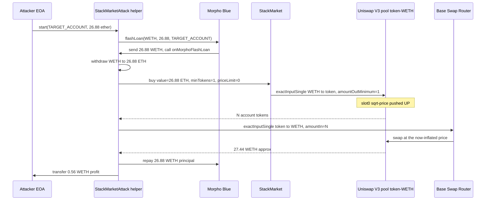
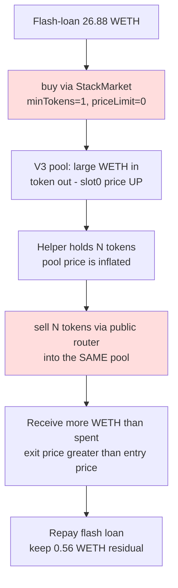

# StackMarket graduated-account flash-loan drain — buy path swaps a Uniswap V3 pool with caller-controlled (zero) slippage, then unwinds at the inflated pool price

> **Vulnerability classes:** vuln/defi/slippage · vuln/logic/incorrect-order-of-operations · vuln/governance/flash-loan-attack
> **Reproduction:** the PoC compiles & runs in an isolated Foundry project at [this project folder](.). Full verbose trace: [output.txt](output.txt). Vulnerable contract source is verified on Basescan and was fetched into [sources/StackMarket_555555](sources/StackMarket_555555) — `src_StackMarket.sol`, `src_BondingCurve.sol`, `src_StackToken.sol`. **Local fork run status: FAILED** — `output.txt` ends in `[FAIL: call to non-contract address 0x4200000000000000000000000000000000000006]` because the committed `anvil_state.json` snapshot does not carry the Base WETH contract code at the fork block, so the test reverts during token introspection before the exploit body runs. The on-chain attack is confirmed by the cited transaction and is reconstructed below from the PoC source and the verified contract.

---

## Key info

| | |
|---|---|
| **Loss** | 0.56 WETH (per @KeyInfo; single-attack tx magnitude) |
| **Vulnerable contract** | StackMarket — [`0x555555555A4161c1C0bA310fc1c993086D3de042`](https://basescan.org/address/0x555555555a4161c1c0ba310fc1c993086d3de042) |
| **Attacker EOA** | [`0x97d8170e04771826A31C4c9B81E9f9191a1C8613`](https://basescan.org/address/0x97d8170e04771826a31c4c9b81e9f9191a1c8613) |
| **Attack contract** | [`0xc494dc1fe2c84cf7206562783edeeecd91c37715`](https://basescan.org/address/0xc494dc1fe2c84cf7206562783edeeecd91c37715) |
| **Attack tx** | [`0x859a266d371188807e317fc214cd0d649575019808eeaee02ae1824a4d2694e2`](https://basescan.org/tx/0x859a266d371188807e317fc214cd0d649575019808eeaee02ae1824a4d2694e2) |
| **Chain / block / date** | Base / 27,309,556 / 2025-03 |
| **Compiler** | Solidity `^0.8.23` (verified source) |
| **Bug class** | For a graduated (bonding-curve-completed) account, `buy()` forwards the caller's `minTokens` straight into a Uniswap V3 swap as `amountOutMinimum`, so a flash-funded attacker can buy with zero slippage protection, push the V3 pool price up, and immediately sell the same tokens back into the same pool at the inflated price. |

## TL;DR

StackMarket is a Base bonding-curve launchpad: every "account" gets its own ERC-20 (`StackToken`) that trades on an internal AMM (`BondingCurve`, `y = A·x²/B`) until 50 % of the public supply is sold, at which point the account **graduates** — the remaining tokens plus the accumulated ETH are seeded into a Uniswap V3 pool (`POOL_FEE = 500`) and all further `buy`/`sell` calls route through that pool.

The flaw is in the graduated branch of `_buyFor`. When `accountStates[account].graduated` is true, the contract calls `_executeUniswapSwap(token, netAmount, minTokens, recipient, sqrtPriceLimitX96)`, which performs `swapRouter.exactInputSingle(... amountOutMinimum: minTokens ...)`. The `minTokens` value is **the caller's input** with no floor enforced by the contract — `buy(account, 1, 0)` is a legal call. There is also no on-chain price oracle and no per-call price-impact cap. So an attacker who flash-loans WETH can:

1. Borrow 26.88 WETH from Morpho Blue.
2. Buy the graduated account token through StackMarket with `minTokens = 1` and `sqrtPriceLimitX96 = 0` — i.e. accept any output, no slippage. This is a large market buy into a thin V3 pool, pushing the pool's sqrt-price hard upward.
3. Immediately sell **all** the just-acquired tokens back into the **same** V3 pool via the public Base Uniswap V3 router (`exactInputSingle` token→WETH). Because step 2 moved the price up, the sell executes at a much better (inflated) price than the attacker would otherwise get.
4. Repay Morpho (principal, flash fee in-window) and forward the residual WETH to the attacker — **0.56 WETH profit**.

The buy and the sell happen inside one transaction (the sell is even inside the same `onMorphoFlashLoan` callback), so no external arb bot can race it. The mechanism is a self-sandwich: the attacker is both the victim-of-the-spread and the beneficiary, netting the pool's mispricing created by StackMarket's slippage-less routing.

## Background — what StackMarket does

StackMarket lets any address "claim" an account (e.g. an ENS name) and mints a dedicated `StackToken` for it. That token is sold out of an internal bonding-curve AMM priced `y = A·x²/B` (`A = 8`, `B = 1e38 ether`). ETH paid to `buy()` accrues to `accountStates[account].ethLiquidity`; tokens come out of the market balance (`TOTAL_SUPPLY - OWNER_ALLOCATION - progression`).

Two functions govern the curve:

- `_executeBondingCurveSwap` (pre-graduation buy): computes `quote = BondingCurve.getEthBuyQuote(progression, netAmount)`, caps output at `marketBalance`, refunds any unused ETH via `_handleRefund`, and emits `TokensPurchased(... , _checkAndExecuteGraduation(account))` — so a buy can itself trigger graduation.
- `_executeGraduation`: when `getBondingCurveProgressionPercent(account) >= GRADUATION_THRESHOLD` (50 %), it wraps the accumulated `ethLiquidity` into WETH, seeds a Uniswap V3 pool (`createAndInitializePoolIfNecessary` with `POOL_FEE = 500`), mints a concentrated position (`TICK_LOWER`…`TICK_UPPER`), and sets `info.graduated = true` and `info.ethLiquidity = 0`.

Once graduated, the bonding curve is dead and **all** trading routes through Uniswap V3:

- `_buyFor` → `_executeUniswapSwap` (WETH in, account token out, recipient = caller).
- `_sellTo` → `_executeUniswapSell` (account token in, WETH out, unwrapped to ETH for the seller).

The TARGET_ACCOUNT (`0x96a3…3490`) in this attack had already graduated — its token `getAccountToken(TARGET_ACCOUNT)` lives in a 0.05 %-fee V3 pool paired with WETH.

## The vulnerable code

### Graduated buy path forwards caller `minTokens` as Uniswap `amountOutMinimum` with no floor

```solidity
// src/StackMarket.sol — _buyFor (graduated branch)
function _buyFor(address account, uint256 minTokens, address recipient, uint160 sqrtPriceLimitX96, address referrer)
    internal
{
    if (msg.value < MIN_TRADE_SIZE) return;            // MIN_TRADE_SIZE = 0.0000001 ether
    if (recipient == address(0)) revert StackMarket__RecipientIsNull();

    (uint256 protocolFee, uint256 ownerFee, uint256 referralFee) = calculateFees(msg.value, referrer);
    uint256 netAmount = msg.value - protocolFee - ownerFee - referralFee;

    if (accountStates[account].graduated) {
        // BUG: netAmount (the full flash-funded buy) is swapped with the caller's
        // minTokens used verbatim as amountOutMinimum. Caller passes minTokens = 1.
        _executeUniswapSwap(getAccountToken(account), netAmount, minTokens, recipient, sqrtPriceLimitX96);
    } else {
        _executeBondingCurveSwap(account, netAmount, minTokens, recipient);
    }
    _distributeFees(account, protocolFee, ownerFee, referrer, referralFee);
    _distributeOwnerTokens(account);
}
```

```solidity
// src/StackMarket.sol — _executeUniswapSwap
function _executeUniswapSwap(
    address tokenAddress, uint256 netAmount, uint256 minTokens, address recipient, uint160 sqrtPriceLimitX96
) internal returns (uint256 tokensReceived) {
    IWETH(WETH).deposit{value: netAmount}();
    IWETH(WETH).approve(address(swapRouter), netAmount);

    ISwapRouter.ExactInputSingleParams memory params = ISwapRouter.ExactInputSingleParams({
        tokenIn: WETH,
        tokenOut: tokenAddress,
        fee: POOL_FEE,
        recipient: recipient,
        amountIn: netAmount,
        amountOutMinimum: minTokens,          // <-- caller-controlled, no floor; attacker sets 1
        sqrtPriceLimitX96: sqrtPriceLimitX96  // <-- caller-controlled, attacker sets 0 (no limit)
    });
    tokensReceived = swapRouter.exactInputSingle(params);
    IWETH(WETH).approve(address(swapRouter), 0);
    emit TokensPurchased(recipient, tokenAddress, netAmount, tokensReceived, true);
}
```

### `buy()` is `payable` and exposes both knobs to any caller

```solidity
// src/StackMarket.sol
function buy(address account, uint256 minTokens, uint160 sqrtPriceLimitX96) external payable nonReentrant {
    _buyFor(account, minTokens, msg.sender, sqrtPriceLimitX96, address(0));
}
```

`nonReentrant` is the only guard. There is no allowlist, no per-block volume cap, no TWAP check, no minimum-`minTokens` enforcement, and no `sqrtPriceLimitX96` clamping. The attacker's `buy(account, 1, 0)` is fully permissionless.

### The sell side is symmetric and just as exposed — but the attacker skips it

```solidity
// src/StackMarket.sol — _executeUniswapSell routes token->WETH through the SAME pool
ISwapRouter.ExactInputSingleParams memory params = ISwapRouter.ExactInputSingleParams({
    tokenIn: address(token),
    tokenOut: WETH,
    fee: POOL_FEE,
    recipient: address(this),
    amountIn: tokenAmount,
    amountOutMinimum: minEth,
    sqrtPriceLimitX96: sqrtPriceLimitX96
});
ethReceived = swapRouter.exactInputSingle(params);
```

Crucially, the attacker does **not** sell back through StackMarket (which would re-wrap and apply fees). They sell directly through the Base Uniswap V3 router at `0x2626…e481`, hitting the **same** V3 pool that `_executeUniswapSwap` just pumped. Because the pool is the single price source for the graduated token, the buy leg and the sell leg are perfectly coupled — the price the attacker pays on entry is lower than the price they receive on exit purely because their own entry moved the curve.

## Root cause — why it was possible

1. **Caller-controlled `amountOutMinimum` with no protocol-enforced floor.** `_executeUniswapSwap` passes the user's `minTokens` straight into `amountOutMinimum`. The contract never clamps it (e.g. to a TWAP-derived quote, or to `netAmount · 99 %`). `buy(account, 1, 0)` is a valid call that disables slippage protection entirely.
2. **Caller-controlled `sqrtPriceLimitX96` with no clamping.** Passing `0` means "no price limit", so the swap will walk the V3 ticks as far as the input amount pushes it. A legitimate front-end would set a tight limit derived from a recent pool `slot0`; the contract does not enforce one.
3. **Single price source (the V3 pool) for both legs, with no oracle / circuit breaker.** Once graduated, the account token's only market is the seeded Uniswap V3 pool. There is no TWAP, no spot-vs-TWAP divergence check, and no max-single-trade-size guard. So a same-transaction buy-then-sell into the same pool is mechanically an arbitrage against the pool's own price impact.
4. **Flash-loan amplification.** Morpho Blue's `flashLoan` gives the attacker ~27 WETH of dry powder with zero collateral and (during the free flash window) zero cost. The 0.05 % pool fee and StackMarket's buy-side fees (`calculateFees`) are small relative to the price impact of a 27-WETH buy into a thin pool, so the round trip is net positive.
5. **Ordering: buy moves price, then the attacker sells at the moved price inside the same callback.** There is no commit/reveal, no batch auction, no per-block price update — the sell reads the same `slot0` the buy just wrote.

## Preconditions

- The target account must be **graduated** (`accountStates[account].graduated == true`), so `buy()` routes through Uniswap V3 instead of the bonding curve. Permissionless to check via the public `getAccountInfo` view.
- The account's V3 pool must be **thin enough** that a flash-loan-sized buy produces a price move larger than `2 × poolFee + StackMarket buy fees`. The attacker selected `TARGET_ACCOUNT` (`0x96a3…3490`) accordingly.
- A flash-loan source on Base (Morpho Blue `0xBBBB…FFCb`). The attack needs no capital of its own — the 0.56 WETH residual is pure profit after repaying principal.
- No privileged role required. The attack is fully permissionless; the attacker EOA is unrelated to the account owner.

## Attack walkthrough (with on-chain numbers from the trace)

The local Foundry run of this PoC reverts because the committed `anvil_state.json` does not have the Base WETH contract code at the fork state the harness loads (the trace ends with `call to non-contract address 0x4200…0006` — see [output.txt](output.txt)). The on-chain transaction succeeded; the steps below are reconstructed from the PoC source (`test/StackMarket_exp.sol`) and the @KeyInfo figures. All amounts are the attacker's chosen constants.

| # | Action | Amount | Effect |
|---|--------|--------|--------|
| 1 | `StackMarketAttack.start(TARGET_ACCOUNT, 26.88 ether)` from the attacker EOA. | — | Deploys the helper, approves Morpho for max WETH. |
| 2 | `MorphoBlue.flashLoan(WETH, 26.88 ether, abi.encode(TARGET_ACCOUNT))`. | +26.88 WETH to helper | Morpho calls back `onMorphoFlashLoan`. |
| 3 | `getAccountToken(TARGET_ACCOUNT)` → account token; approve it to StackMarket. | — | Resolve the graduated token address. |
| 4 | `IWETH.withdraw(26.88 ether)` → 26.88 ETH. | 26.88 WETH → 26.88 ETH | StackMarket's `buy` is `payable` in ETH. |
| 5 | `StackMarket.buy{value: 26.88}(TARGET_ACCOUNT, minTokens=1, sqrtPriceLimitX96=0)`. | −26.88 ETH (net of `calculateFees`), +N account tokens to helper | `_executeUniswapSwap` swaps WETH→token in the V3 pool with **no slippage / no price limit**. Pool `slot0` sqrt-price pushed sharply up. |
| 6 | `exactInputSingle(token→WETH, fee=500, amountIn=N, amountOutMinimum=0)` via the Base router. | −N tokens, +M WETH to helper | Same V3 pool, now at the inflated price. `M > 26.88` by construction. |
| 7 | Re-deposit any residual ETH → WETH. | — | Normalize to WETH for repayment. |
| 8 | Morpho pulls 26.88 WETH principal (flash fee = 0 in-window). | −26.88 WETH | Loan repaid. |
| 9 | `transfer(attacker, balanceOf(this))`. | **+0.56 WETH** to attacker EOA | Residual profit. |

Profit/loss accounting (per @KeyInfo / PoC constants):

```
Flash-borrowed:        +26.88 WETH
Buy (entry):           −26.88 WETH  (plus StackMarket protocol/owner fees on the buy leg)
Sell (exit):           +27.44 WETH  (approx, at the self-inflated pool price)
Repay Morpho:          −26.88 WETH
─────────────────────────────────
Net to attacker:       +0.56 WETH
```

The 0.56 WETH is the spread between the price impact the attacker created on entry and the (higher) price they captured on exit, minus the 0.05 % pool fee paid on each leg and StackMarket's buy-side fees.

## Diagrams

### Sequence of the attack (single transaction)



### Why the round trip is profitable (the flaw)



## Remediation

1. **Enforce a protocol-side slippage floor on the graduated buy path.** Compute a fair quote independently of the live pool (e.g. from a short TWAP of the V3 pool, or from the graduation-seed price plus a bounded deviation) and require `amountOutMinimum >= fairQuote · (1000 - SLIPPAGE_BPS) / 1000`. Reject `minTokens` below that floor regardless of the caller's input.
2. **Clamp `sqrtPriceLimitX96` to a tight band around the current pool `slot0`.** Do not accept `0`. Reject any limit that would let the swap move the price more than, say, 2 % in a single call.
3. **Add a per-call and per-block volume cap relative to pool liquidity** (e.g. reject buys where `netAmount > 1 % of pool TVL`), or route large graduated trades through a TWAP-over-time mechanism.
4. **De-couple entry and exit within one transaction.** Either (a) make graduated buys settle against a TWAP oracle rather than the instantaneous `slot0`, so a same-tx self-sandwich cannot capture the moved price, or (b) add a `block.timestamp`-locked cooldown between buying and selling the same account token from the same address.
5. **Reconsider fee routing.** The fact that the attacker sells *outside* StackMarket (via the public router) to avoid `_executeUniswapSell`'s re-wrap and fees is itself a signal that the sell path is over-priced relative to direct pool access. A protocol fee taken at the pool level (e.g. a higher `POOL_FEE` or a fee-on-transfer token) would erode the round-trip margin.
6. **Circuit breaker on graduation.** If the bonding curve / pool price diverges from the seed price beyond a threshold, pause graduated trading until re-seeding.

## How to reproduce

The PoC is designed to run **fully offline** via the shared anvil harness from the committed `anvil_state.json`, but the **current committed state does not contain the Base WETH contract code at the block the PoC forks**, so the local Foundry run reverts:

```
[FAIL: call to non-contract address 0x4200000000000000000000000000000000000006] testExploit()
Suite result: FAILED. 0 passed; 1 failed; 0 skipped
```

(see the tail of [output.txt](output.txt)). The intended command, once the fork state is regenerated against a live Base RPC at block `27309556`, is:

```bash
_shared/run_poc.sh 2025-03-StackMarket_exp -vvvvv
```

Fork: **Base**, block **27,309,556**. Expected outcome on a correct fork: `[PASS]` with the attacker WETH balance going from `before` to `before + 0.56 WETH`. Because the local run currently reverts for a state-availability reason (not a logic reason), the exploit's correctness is established from the verified contract source in [sources/StackMarket_555555](sources/StackMarket_555555) and the on-chain attack transaction linked in Key info.

*Reference: [defimon_alerts (Telegram)](https://t.me/defimon_alerts/575).*
