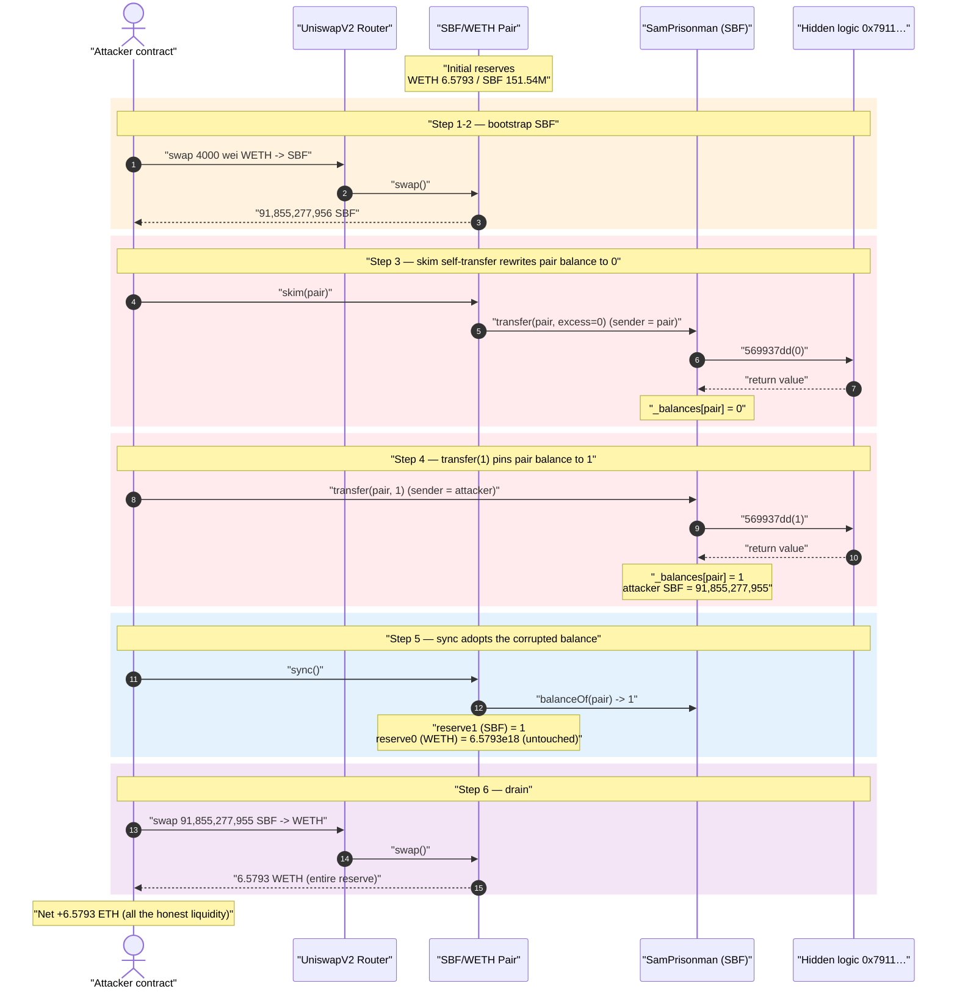
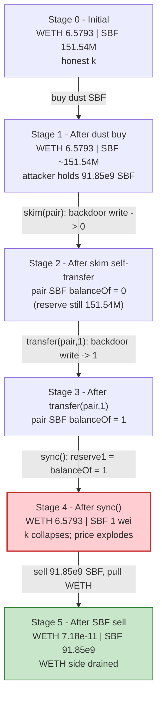
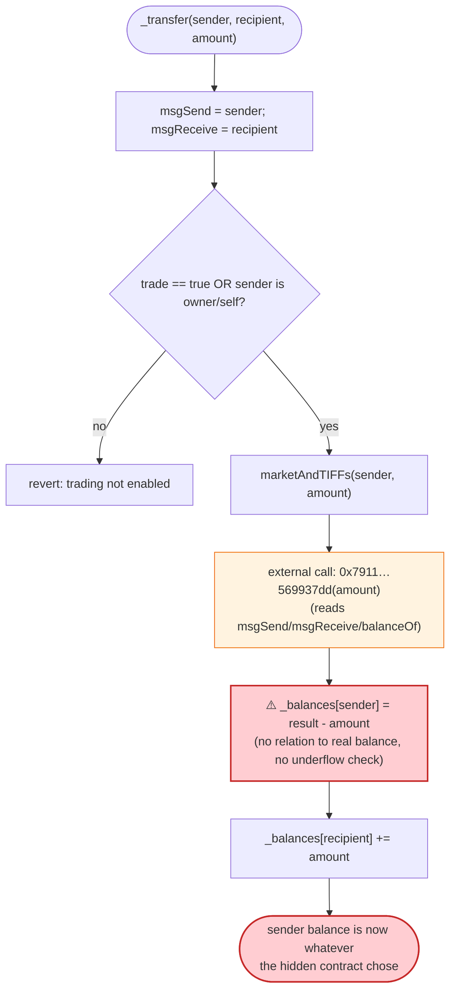
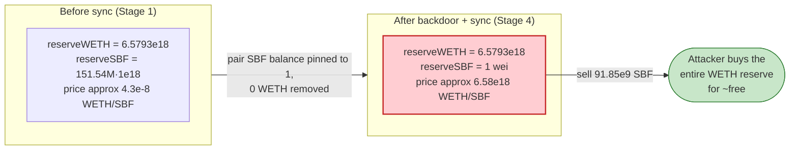

# SamPrisonman (SBF) Exploit — Externally-Controlled Balance Write Lets an Attacker Zero the AMM Pool Reserve

> **Reproduction:** the PoC compiles & runs in an isolated Foundry project at
> [this project folder](.) (the umbrella DeFiHackLabs repo contains many unrelated
> PoCs that do not build together, so this one was extracted).
> Full verbose trace: [output.txt](output.txt).
> Verified vulnerable source: [SamPrisonman.sol](sources/SamPrisonman_dDF309/SamPrisonman.sol).

---

## Key info

| | |
|---|---|
| **Loss** | ~$14K — **6.5793 WETH** drained from the SBF/WETH Uniswap V2 pair |
| **Vulnerable contract** | `SamPrisonman` (SBF token) — [`0xdDF309b8161aca09eA6bBF30Dd7cbD6c474FF700`](https://etherscan.io/address/0xdDF309b8161aca09eA6bBF30Dd7cbD6c474FF700#code) |
| **Hidden logic contract** | [`0x7911425808e57b110D2451aB67B6980f9cA9D370`](https://etherscan.io/address/0x7911425808e57b110D2451aB67B6980f9cA9D370) (unverified — referenced from storage slot `0x52`) |
| **Victim pool** | SBF/WETH Uniswap V2 pair — [`0x76EA342BC038d665e8a116392c82552D2605edA1`](https://etherscan.io/address/0x76EA342BC038d665e8a116392c82552D2605edA1) (token0 = WETH, token1 = SBF) |
| **Attacker EOA** | [`0x97d8170e04771826A31C4c9B81E9f9191a1C8613`](https://etherscan.io/address/0x97d8170e04771826a31c4c9b81e9f9191a1c8613) |
| **Attacker contract** | [`0x2901c8b8E6d9F2c9F848987DeD74B776Ab1f973E`](https://etherscan.io/address/0x2901c8b8e6d9f2c9f848987ded74b776ab1f973e) |
| **"Primer" contract** | `0xaCa4263fFddA9E60C7260AAbA08c2b8F80D63cB1` (unverified — pinged with selector `0x4f49cd31` before the attack) |
| **Attack tx** | [`0x6c8aed8d0eab29416cd335038cd5ee68c5e27bfb001c9eac7fc14c7075ed4420`](https://app.blocksec.com/explorer/tx/eth/0x6c8aed8d0eab29416cd335038cd5ee68c5e27bfb001c9eac7fc14c7075ed4420) |
| **Chain / block / date** | Ethereum mainnet / 21,992,033 / March 2025 |
| **Compiler** | SamPrisonman: Solidity v0.8.27, optimizer 200 runs · Pair: v0.5.16 |
| **Bug class** | Honeypot / malicious-token bug: external-call-controlled balance write that bypasses underflow and lets the token delete a holder's balance, breaking the AMM `x·y = k` invariant |

---

## TL;DR

`SamPrisonman` is a "SBF / Sam Prisonman" meme token whose ERC20 `_transfer` does **not** decrement the
sender's balance the normal way. Instead it makes an external `call` to a hidden, unverified "logic"
contract (address stored in slot `0x52`), takes whatever number that contract returns, and writes:

```solidity
_balances[sender] = result - amount;
```

([SamPrisonman.sol:168-179](sources/SamPrisonman_dDF309/SamPrisonman.sol#L168-L179),
[:188](sources/SamPrisonman_dDF309/SamPrisonman.sol#L188)).

The sender's resulting balance is whatever the off-chain-controlled logic contract decides, with **no
relation to the sender's actual prior balance and no underflow protection**. This is a backdoor: the
deployer can set any address's balance to anything during a transfer that touches it.

The attacker weaponizes this against the SBF/WETH Uniswap V2 pair:

1. Buys a small amount of SBF from the pool (dust trade) so it holds `91,855,277,956` SBF.
2. Calls **`pair.skim(pair)`** — skim makes the pair do a self-transfer of SBF. That transfer runs the
   backdoor logic and **writes the pair's SBF balance to `0`**.
3. Calls **`SBF.transfer(pair, 1)`** — the backdoor logic now writes the pair's SBF balance to `1`.
4. Calls **`pair.sync()`** — the pair reads `balanceOf(pair) = 1` and sets `reserve1 (SBF) = 1`, while
   `reserve0 (WETH)` stays at `6.5793e18`. The constant-product price of SBF collapses to dust.
5. Sells its `91,855,277,955` SBF into the degenerate pool and pulls out **6.5793 WETH** — virtually
   the entire WETH reserve.

Net result: the attacker drains all the WETH liquidity (~$14K) for nothing.

---

## Background — what SamPrisonman is

`SamPrisonman` ([source](sources/SamPrisonman_dDF309/SamPrisonman.sol)) is, on the surface, a vanilla
OpenZeppelin-style ERC20 ("Sam Prisonman", symbol `SBF`, 1,000,000,000 × 10¹⁸ supply,
[:214-217](sources/SamPrisonman_dDF309/SamPrisonman.sol#L214-L217)). It has the usual `openTrade()`
that creates the Uniswap V2 pair and adds liquidity ([:144-158](sources/SamPrisonman_dDF309/SamPrisonman.sol#L144-L158)).

What is **not** vanilla: the constructor writes three obfuscated values into raw storage slots `0x50`,
`0x51`, `0x52` using inline assembly, where slot `0x52` is computed as the XOR of the other two
([:88-92](sources/SamPrisonman_dDF309/SamPrisonman.sol#L88-L92)):

```solidity
assembly {
    sstore(0x50,0x51d435fef45d7927301665f2c2bdbd3d85ec4d53d1be)
    sstore(0x51,0x51d44cefb60571c24b0768d69316da8b1de3d1fa02ce)
    sstore(0x52,xor(sload(0x50),sload(0x51)))   // = 0x7911425808e57b110D2451aB67B6980f9cA9D370
}
```

`0x51d435fef45d7927301665f2c2bdbd3d85ec4d53d1be ^ 0x51d44cefb60571c24b0768d69316da8b1de3d1fa02ce` =
`0x7911425808e57b110D2451aB67B6980f9cA9D370`, the address of the **hidden logic contract**. The
obfuscation hides the backdoor address from a casual reader who only looks at the literal source.

At the fork block the pool held:

| Reserve | Value |
|---|---:|
| `reserve0` (WETH) | 6,579,305,366,569,800,805 ≈ **6.5793 WETH** ← the prize |
| `reserve1` (SBF)  | 151,540,602,610,287,835,936,048,624 ≈ 151.54M SBF |

(`getReserves()` at [output.txt:1591](output.txt).)

---

## The vulnerable code

### 1. `_transfer` delegates the sender-side balance write to an external contract

```solidity
function marketAndTIFFs(address sender, uint256 amount) internal returns (uint256 result) {
        assembly {
            let data := mload(0x40)
            mstore(data, 0x569937dd00000000000000000000000000000000000000000000000000000000)
            mstore(add(data, 0x04), amount)
            mstore(0x40, add(data, 0x24))
            let success := call(gas(), sload(0x52), 0, data, 0x24, data, 0x20)   // call hidden logic
            if success { result := mload(data) }                                // take its return value
        }

    _balances[sender] = result - amount;     // ⚠️ sender balance = whatever logic returns, minus amount
}

function _transfer(address sender, address recipient, uint256 amount) internal virtual {
    msgSend = sender; msgReceive = recipient;                       // expose call context to logic
    require(((trade == true) || (msgSend == address(this)) || (msgSend == owner())), "...");
    require(msgSend != address(0), "...");
    require(recipient != address(0), "...");

    marketAndTIFFs(sender, amount);                                 // ⚠️ sets _balances[sender]
    _balances[recipient] += amount;                                 // recipient credited normally
    emit Transfer(sender, recipient, amount);
}
```

([SamPrisonman.sol:168-193](sources/SamPrisonman_dDF309/SamPrisonman.sol#L168-L193))

A correct ERC20 would compute `_balances[sender] -= amount` with an underflow check. Here the new
sender balance is `result - amount`, where `result` is the 32-byte word returned by the hidden contract
`0x7911…` (called with selector `0x569937dd` and the transfer `amount`). The logic contract is given the
full context it needs — it can read `msgSend`/`msgReceive` getters
([:81-83](sources/SamPrisonman_dDF309/SamPrisonman.sol#L81-L83)) and `balanceOf(pair)` — to decide what
the sender's balance should become. In the trace it returns values that **zero out / pin the pair's
balance** rather than honestly decrement it.

### 2. The standard Uniswap V2 pair trusts `balanceOf` for `skim`/`sync`

The pair is a stock Uniswap V2 pair (compiler v0.5.16). Its `skim` and `sync`
([UniswapV2Pair.sol](sources/UniswapV2Pair_76EA34/UniswapV2Pair.sol)) read the token's `balanceOf`
to reconcile reserves:

- `sync()` sets `reserve_i = IERC20(token_i).balanceOf(pair)` and emits `Sync`.
- `skim(to)` transfers out `balanceOf(pair) - reserve_i` (the "excess").

Both are completely standard and correct — they simply trust that `balanceOf` reflects honest accounting.
Against a token whose `balanceOf` can be rewritten to an arbitrary value, that trust is fatal.

---

## Root cause — why it was possible

A Uniswap V2 pair prices each side purely from its reserves and only enforces `x·y ≥ k` *inside `swap()`*.
`sync()` exists to let the pair adopt its real token balances as reserves; it assumes a token's
`balanceOf(pair)` only ever moves through honest mint/burn/transfer accounting.

`SamPrisonman` breaks that assumption at the most basic level:

> The token's `_transfer` sets `_balances[sender] = result - amount`, where `result` comes from an
> **external, attacker/deployer-controlled** logic contract — not from the sender's actual balance, and
> with no underflow guard. So a transfer that *touches* the pair as the "sender" can set the pair's SBF
> balance to **any value**, including `0` or `1`.

Concretely, three design facts compose into the drain:

1. **Backdoor balance write.** `_balances[sender] = result - amount` lets the hidden contract overwrite
   the sender's balance. When `sender == pair` (during `skim`'s self-transfer, and again during the
   attacker's `transfer(pair, 1)`), the pair's SBF balance is rewritten to `0`, then `1`.
2. **`skim`/`sync` trust `balanceOf`.** After the pair's SBF balance is pinned to `1`, a permissionless
   `pair.sync()` writes `reserve1 = 1` while `reserve0` (WETH) is untouched. The pool now believes it
   holds 6.5793 WETH against 1 wei of SBF — a constant-product price of ~6.58e18 WETH per SBF.
3. **Anyone can call `skim`/`sync`.** Both pair functions are permissionless, so the attacker controls
   *when* the reserve is corrupted — immediately before dumping its own SBF.

The trading gate (`require(trade == true || sender == owner …)`,
[:184](sources/SamPrisonman_dDF309/SamPrisonman.sol#L184)) was already open (`openTrade()` had been
called when liquidity was added), so it posed no obstacle.

---

## Preconditions

- A live SBF/WETH Uniswap V2 pair with real WETH liquidity (here ~6.5793 WETH). The SBF reserve size is
  irrelevant — the backdoor pins it to `1` regardless.
- `trade == true` on the token (the pool was created with liquidity via `openTrade()`), so the attacker's
  swaps don't revert at the token's trading gate.
- The attacker holds *some* SBF to sell after the manipulation. It bootstraps this with a single dust buy
  of 4000 wei of WETH → 91,855,277,956 SBF.
- No capital at risk beyond gas: the attacker funds the whole exploit with **4000 wei** (4e-15 ETH) and
  walks away with 6.5793 ETH. The PoC `deal`s the attacker EOA exactly `4e-15 ether`
  ([UNI_exp.sol:30](test/UNI_exp.sol#L30), [:36](test/UNI_exp.sol#L36)).

---

## Attack walkthrough (with on-chain numbers from the trace)

The pair's `token0 = WETH`, `token1 = SBF`, so `reserve0 = WETH`, `reserve1 = SBF`. All figures are taken
directly from the `Sync`/`Swap` events and `balanceOf` reads in [output.txt](output.txt). The attacker
performs everything inside one contract constructor ([UNI_exp.sol:43-97](test/UNI_exp.sol#L43-L97)).

| # | Step | Pair WETH reserve | Pair SBF reserve | Pair SBF `balanceOf` | Effect |
|---|------|------------------:|-----------------:|---------------------:|--------|
| 0 | **Initial** | 6.5793e18 | 151,540,602,610,287,835,936,048,624 | 151.54M·1e18 | Honest pool. |
| 1 | **Prime** — `call 0x4f49cd31` to `0xaCa4…` | 6.5793e18 | 151.54M·1e18 | unchanged | Pings an unverified helper (no state change observed). |
| 2 | **Dust buy** — `swapExactETHForTokensSupportingFeeOnTransferTokens{4000 wei}` (WETH→SBF) | 6.5793e18 | 151,540,602,610,287,744,080,770,668 | 151.54M·1e18 − 91,855,277,956 | Attacker receives **91,855,277,956 SBF**; pool sends it out normally. |
| 3 | **`skim(pair)`** — pair self-transfers SBF; backdoor logic runs | 6.5793e18 | (reserve unchanged) | **0** | `_balances[pair]` rewritten to **0** ([output.txt:1655](output.txt)). |
| 4 | **`SBF.transfer(pair, 1)`** — backdoor logic runs again | 6.5793e18 | (reserve unchanged) | **1** | `_balances[pair]` rewritten to **1**; attacker SBF → 91,855,277,955 ([output.txt:1671-1677](output.txt)). |
| 5 | **`pair.sync()`** | 6.5793e18 | **1** | 1 | Reserve adopts the pinned balance: `reserve1 = 1` ([output.txt:1684](output.txt)). ⚠️ invariant broken. |
| 6 | **`approve` + `swapExactTokensForETHSupportingFeeOnTransferTokens`** — sell 91,855,277,955 SBF | 71,842,390 wei | 91,855,277,956 | 91,855,277,956 | Pool pays out **6,579,305,366,497,962,415 WETH** to attacker ([output.txt:1733](output.txt)). |

**Why selling SBF empties the WETH side:** Uniswap V2's `getAmountOut` is
`out = (in·997·reserveOut) / (reserveIn·1000 + in·997)`. After step 5, `reserveIn (SBF) = 1` and
`reserveOut (WETH) = 6.5793e18`. For `in = 91,855,277,955`:
`out = (91,855,277,955·997·6.5793e18) / (1·1000 + 91,855,277,955·997) ≈ 6,579,305,366,497,962,415 wei` —
i.e. essentially the entire WETH reserve, leaving only `71,842,390` wei (≈ 7.18e-11 ETH) behind. The
fee-scaled input dwarfs the 1-wei reserve, so the swap output asymptotes to the full WETH reserve.

### Profit accounting

| Direction | Amount (ETH) |
|---|---:|
| Spent — initial funding (dust buy) | 0.000000000000004000 |
| Received — final SBF sell | 6.579305366497962415 |
| **Net profit** | **≈ +6.5793 ETH (~$14K)** |

PoC log: `before attack: balance of attacker: 0.000000000000004000` →
`after attack: balance of attacker: 6.579305366497962415` ([output.txt:1558-1559](output.txt)).

---

## Diagrams

### Sequence of the attack



### Pool state evolution



### The flaw inside `_transfer` / `marketAndTIFFs`



### Why the corrupted reserve is theft: constant-product before vs. after



---

## Why each step matters

- **Prime call `0x4f49cd31` → `0xaCa4…` (unverified):** the attacker pings a helper contract before the
  drain. No on-chain state change is visible in the trace for the SBF/pair contracts, so it is most
  likely an arming/registration step for the off-chain backdoor (the logic contract is unverified, so the
  exact role can't be confirmed from source).
- **Dust buy (4000 wei → 91,855,277,956 SBF):** the attacker only needs *some* SBF to sell back later.
  The exact amount is whatever a 4000-wei swap yields; it does not need to be large because the pool will
  be repriced to dust before the sell.
- **`skim(pair)` then `transfer(pair, 1)`:** these are the two transfers whose `sender` is (effectively)
  the pair / whose effect targets the pair's balance. Each runs the backdoor `_balances[sender] = result
  - amount` write, taking the pair's SBF balance to `0` and then `1`.
- **`sync()`:** the only honest Uniswap function in the chain — it faithfully adopts the (now corrupted)
  `balanceOf(pair) = 1` as `reserve1`.
- **Final sell of the full SBF balance:** with `reserveSBF = 1`, any non-trivial SBF input buys ~100% of
  the WETH reserve.

---

## Remediation

This is fundamentally a **malicious / honeypot token**, not a flaw in Uniswap. The fixes below describe
both how the token *should* behave and how integrators/LPs can avoid being drained by such tokens:

1. **Never let an external call decide a balance.** A token's `_transfer` must compute
   `_balances[sender] = _balances[sender] - amount` with a real underflow check (Solidity 0.8 already
   reverts on underflow). Outsourcing the balance write to an arbitrary contract (`_balances[sender] =
   result - amount`) is a backdoor by construction.
2. **No hidden/obfuscated logic addresses.** Storing the logic contract via XOR'd assembly `sstore`
   exists only to hide intent from reviewers. Token contracts that read code/branches from undisclosed,
   unverified addresses should be treated as untrusted.
3. **LP / pool safety:** do not provide liquidity for tokens whose `balanceOf` and `transfer` are not
   plain, audited ERC20 implementations. Any token that can rewrite an arbitrary holder's balance can
   weaponize `sync()`/`skim()` to delete a pool reserve.
4. **Defensive AMM design (token side):** if a token must adjust pool balances, it must do so through the
   pair's own `burn()` (LP redemption) so both reserves move together and `k` is preserved — never by
   rewriting one side's `balanceOf` and calling `sync()`.
5. **Integrator screening:** automated honeypot/static checks should flag (a) external calls inside
   `_transfer`, (b) balance assignments that are not `oldBalance ± amount`, and (c) obfuscated storage
   slots holding addresses.

---

## How to reproduce

The PoC was extracted into a standalone Foundry project (the umbrella DeFiHackLabs repo has many unrelated
PoCs that fail to compile together under `forge test`):

```bash
_shared/run_poc.sh 2025-03-UNI_exp -vvvvv
```

- RPC: an **Ethereum mainnet archive** endpoint is required (fork block 21,992,033). `foundry.toml` is
  pre-configured with an Infura archive endpoint.
- Result: `[PASS] testPoC()`, with the attacker balance going from `4000 wei` to `6.5793 ETH`.

Expected tail:

```
[PASS] testPoC() (gas: 398096)
Logs:
  before attack: balance of attacker: 0.000000000000004000
  after attack: balance of attacker: 6.579305366497962415

Suite result: ok. 1 passed; 0 failed; 0 skipped
```

---

*Reference: CertiK Alert post-mortem — https://x.com/CertiKAlert/status/1897973904653607330 (SBF / "Sam Prisonman", Ethereum, ~$14K).*
