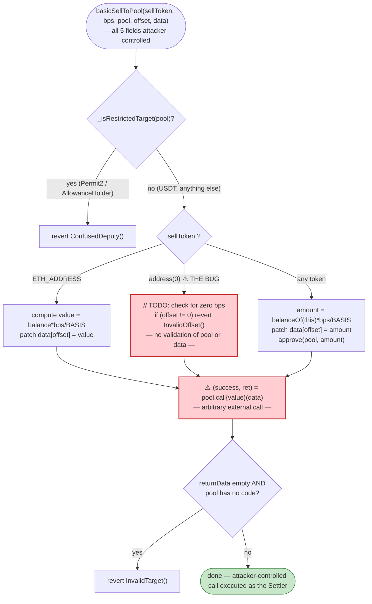
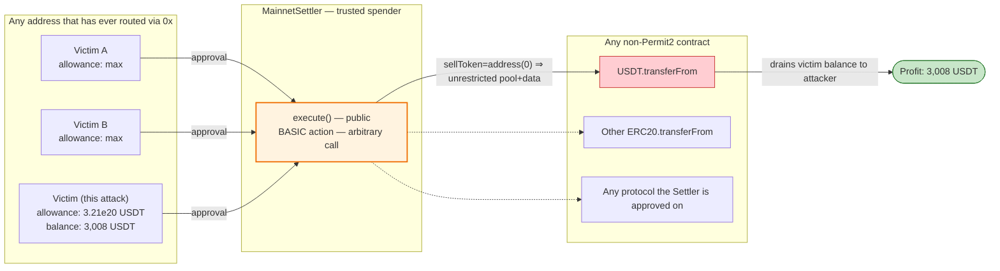

# 0x MainnetSettler Exploit — Arbitrary `transferFrom` via the BASIC Action's `sellToken == address(0)` Confused-Deputy Fall-Through

> **Vulnerability classes:** vuln/access-control/missing-auth · vuln/business-logic/arbitrary-call · vuln/business-logic/confused-deputy

> **Reproduction:** the PoC compiles & runs in an isolated Foundry project at
> [this project folder](.). The fork is served **offline** by a local anvil node
> loaded from `anvil_state.json` (`createSelectFork("http://127.0.0.1:8545", 22_022_764)` —
> no public RPC is contacted). Full verbose trace: [output.txt](output.txt).
> Verified vulnerable source (active implementation at the fork block):
> [src_flat_MainnetTakerSubmittedFlat.sol](sources/MainnetSettler_0d0e36/src_flat_MainnetTakerSubmittedFlat.sol).

---

## Key info

| | |
|---|---|
| **Loss** | **3,008 USDT** (`3,008,000,000` raw, 6 decimals) — lifted from the victim's USDT balance via `USDT.transferFrom(victim, attacker, …)` |
| **Vulnerable contract** | `MainnetSettler` — [`0x0d0E364aa7852291883C162B22D6D81f6355428F`](https://etherscan.com/address/0x0d0E364aa7852291883C162B22D6D81f6355428F#code) |
| **Victim** | USDT holder `0x4D387992614Ff184fb587D590b76C00c48057b4b` — had pre-approved the Settler for `321,312,213,123,123,143,242,344,143` (~3.21e26) USDT ([output.txt:1596](output.txt)) |
| **Attacker EOA** | [`0xC58A769E3089792670DFf22aB85A11983816323b`](https://etherscan.com/address/0xC58A769E3089792670DFf22aB85A11983816323b) |
| **Attacker contract** | `0x447cD3A83134941523e7c0676f80E4e99bAb28ab` (historical); PoC re-deploys `SettlerExploit@0x5615…b72f` ([output.txt:1601](output.txt)) |
| **Attack tx** | [`0x4e2f5bccc5d428c39cd93c64dcd2502d5cf05fb30892c753475155d498ef5887`](https://etherscan.com/tx/0x4e2f5bccc5d428c39cd93c64dcd2502d5cf05fb30892c753475155d498ef5887) |
| **Chain / block / date** | Ethereum mainnet / fork block `22,022,764` / March 2025 ([output.txt:1569](output.txt)) |
| **Compiler** | Solidity `v0.8.25` (Settler, `optimizer = 1`, `200` runs) per `_meta.json`; PoC test compiles with `Solc 0.8.34` ([output.txt:1](output.txt)) |
| **Bug class** | Public `execute()` entry accepts a fully attacker-controlled `BASIC` action whose `sellToken == address(0)` branch performs an **arbitrary external call** to attacker-chosen `pool` with attacker-chosen `data`, turning the Settler into a confused deputy that spends any token allowance any victim ever granted it |

---

## TL;DR

1. The 0x `MainnetSettler.execute(AllowedSlippage, bytes[] actions, bytes32 zidAndAffiliate)` entry point is `takerSubmitted` — i.e. the caller (`msg.sender` via the transient payer) is treated as the swap's "taker". Anyone can call it with an arbitrary list of *actions* ([src_flat…:7498-7517](sources/MainnetSettler_0d0e36/src_flat_MainnetTakerSubmittedFlat.sol#L7498-L7517)).
2. One of those actions, `BASIC` (selector `0x38c9c147`), decodes to `(sellToken, bps, pool, offset, data)` and dispatches into `basicSellToPool` ([src_flat…:5852-5894](sources/MainnetSettler_0d0e36/src_flat_MainnetTakerSubmittedFlat.sol#L5852-L5894)). The intended use is "approve a pool for `bps` of the Settler's `sellToken` balance, then call `pool(data)`" — a generic AMM interaction.
3. The function has three branches keyed on `sellToken`: ETH, `address(0)`, and anything else. The `address(0)` branch — the developer's escape hatch, commented `// TODO: check for zero bps` — only checks `offset == 0` and then **falls straight through** to the shared `payable(pool).call{value: 0}(data)` at the bottom of the function ([src_flat…:5875-5877 + 5890](sources/MainnetSettler_0d0e36/src_flat_MainnetTakerSubmittedFlat.sol#L5875-L5877)). It does **not** rewrite any field of `data`, does **not** constrain `pool`, and does **not** check `bps`.
4. The only guard on the call target is `_isRestrictedTarget(pool)`, which blocks exactly one address: Permit2 (`0x0000…C78BA3`) ([src_flat…:7000-7001](sources/MainnetSettler_0d0e36/src_flat_MainnetTakerSubmittedFlat.sol#L7000-L7001)). Every other address — including USDT — is fair game.
5. So the attacker submits `sellToken = address(0)`, `pool = USDT`, `offset = 0`, and `data = abi.encodeWithSelector(IERC20.transferFrom.selector, victim, attacker, 3_008_000_000)`. The Settler — which is an *approved spender* of the victim's USDT — obligingly calls `USDT.transferFrom(victim, attacker, 3_008 USDT)` ([output.txt:1605-1612](output.txt)).
6. The victim's balance goes `3,008,000,000 → 0`; the attacker's goes `0 → 3,008,000,000` ([output.txt:1594](output.txt), [output.txt:1618-1619](output.txt)). Profit = **3,008 USDT**, exactly the victim's full balance, because the attacker set `STOLEN_USDT_AMOUNT` to the victim's entire USDT balance and the pre-existing allowance (≈3.21e26) dwarfed it.

This is not a flash loan, not a price manipulation, not a re-entrancy. It is a one-call confused-deputy theft: the Settler is the deputy; the attacker hands it a calldata blob of its own choosing and a target of its own choosing; the deputy executes it with its own (widely trusted) identity.

---

## Background — what the 0x Settler does

The 0x Settler family ("Settler" / `MainnetSettler`) is 0x's swap-routing settlement contract. A user (the *taker*) signs an off-chain order; a solver / taker submits it on-chain by calling `execute(...)` with a script of primitive *actions* that move tokens through AMMs, RFQ makers, Permit2 transfers, etc. The contract is **widely approved** as a spender: every major USDT/USDC holder that has ever routed through 0x has, at some point, granted the Settler a large (often "max") allowance so it can pull input tokens for swaps.

The on-chain parameters at fork block `22,022,764` (read directly from the trace):

| Parameter | Value | Source |
|---|---|---|
| Settler address | `0x0d0E364aa7852291883C162B22D6D81f6355428F` | PoC constant |
| `execute` selector | `0x00b35a4d` (`execute(((address,address,uint256),bytes[],bytes32))` — abi-encoded as `(AllowedSlippage, bytes[], bytes32)`) | trace |
| `BASIC` action selector | `0x38c9c147` — `keccak256("BASIC(address,uint256,address,uint256,bytes)")[:4]` | verified |
| Permit2 (only restricted target) | `0x000000000022D473030F116dDEE9F6B43aC78BA3` | [src_flat…:6997](sources/MainnetSettler_0d0e36/src_flat_MainnetTakerSubmittedFlat.sol#L6997) |
| Victim USDT balance | `3,008,000,000` raw = **3,008 USDT** | [output.txt:1594](output.txt) |
| Victim → Settler allowance | `321,312,213,123,123,143,242,344,143` raw ≈ **3.21e20 USDT** (vastly larger than the balance) | [output.txt:1596](output.txt) |
| Attacker USDT balance (pre) | `0` | [output.txt:1587](output.txt) |
| Amount stolen | `3,008,000,000` raw = **3,008 USDT** | [output.txt:1605](output.txt) |
| `zidAndAffiliate` | `0xa00dda5ed0267accdf4ac6940000000000000000000000000000000000000000` (a 0x partner/affiliate code; unchecked by `execute`) | PoC constant |

That last pair of facts — *every victim's pre-existing allowance to the Settler* plus *a public entry point that will happily `call` any non-Permit2 address with arbitrary calldata* — is the entire attack surface.

---

## The vulnerable code

Verified source is bundled under `sources/`, so the snippets below are quoted verbatim with real file:line ranges.

### 1. `execute` — the public, `takerSubmitted` entry point

```solidity
function execute(AllowedSlippage calldata slippage, bytes[] calldata actions, bytes32 /* zid & affiliate */ )
    public
    payable
    takerSubmitted
    returns (bool)
{
    if (actions.length != 0) {
        (uint256 action, bytes calldata data) = actions.decodeCall(0);
        if (!_dispatchVIP(action, data)) {
            if (!_dispatch(0, action, data)) {
                revert ActionInvalid(0, bytes4(uint32(action)), data);
            }
        }
    }
    // ... loop over remaining actions ...
    _checkSlippageAndTransfer(slippage);
    return true;
}
```
[src_flat_MainnetTakerSubmittedFlat.sol:7498-7520](sources/MainnetSettler_0d0e36/src_flat_MainnetTakerSubmittedFlat.sol#L7498-L7520)

Anyone may call `execute`. The `takerSubmitted` modifier only stashes `msg.sender` into transient storage as "the payer" — it does **not** authenticate the caller or constrain the action list.

### 2. `_dispatch` routes `BASIC` into `basicSellToPool`

```solidity
} else if (action == uint32(ISettlerActions.BASIC.selector)) {
    (IERC20 sellToken, uint256 bps, address pool, uint256 offset, bytes memory _data) =
        abi.decode(data, (IERC20, uint256, address, uint256, bytes));

    basicSellToPool(sellToken, bps, pool, offset, _data);
}
```
[src_flat_MainnetTakerSubmittedFlat.sol:7383-7388](sources/MainnetSettler_0d0e36/src_flat_MainnetTakerSubmittedFlat.sol#L7383-L7388)

All five fields — `sellToken`, `bps`, `pool`, `offset`, `data` — are attacker-controlled.

### 3. `basicSellToPool` — the `sellToken == address(0)` fall-through (THE BUG)

```solidity
function basicSellToPool(IERC20 sellToken, uint256 bps, address pool, uint256 offset, bytes memory data) internal {
    if (_isRestrictedTarget(pool)) {
        revert ConfusedDeputy();                  // ← only blocks Permit2 (and AllowanceHolder)
    }

    bool success;
    bytes memory returnData;
    uint256 value;
    if (sellToken == ETH_ADDRESS) {
        // ... ETH path: compute value, patch data[offset], then call(pool, data) ...
    } else if (address(sellToken) == address(0)) {
        // TODO: check for zero `bps`
        if (offset != 0) revert InvalidOffset();   // ← the ONLY check on this branch
    } else {
        uint256 amount = sellToken.fastBalanceOf(address(this)).mulDiv(bps, BASIS);
        // ... patch data[offset] = amount; approve(pool, amount) ...
    }
    (success, returnData) = payable(pool).call{value: value}(data);   // ← arbitrary call to attacker-chosen pool
    success.maybeRevert(returnData);
    // forbid sending data to EOAs
    if (returnData.length == 0 && pool.code.length == 0) revert InvalidTarget();
}
```
[src_flat_MainnetTakerSubmittedFlat.sol:5852-5894](sources/MainnetSettler_0d0e36/src_flat_MainnetTakerSubmittedFlat.sol#L5852-L5894)

The `address(0)` branch ([src_flat…:5875-5877](sources/MainnetSettler_0d0e36/src_flat_MainnetTakerSubmittedFlat.sol#L5875-L5877)) is an unfinished feature (the author left a `// TODO: check for zero bps`). It validates nothing about `pool` or `data`, so execution drops to the shared `payable(pool).call{value: 0}(data)` line at the bottom ([src_flat…:5890](sources/MainnetSettler_0d0e36/src_flat_MainnetTakerSubmittedFlat.sol#L5890)) — which calls `pool` with the attacker's `data` verbatim. `pool` can be **any contract except Permit2**; `data` can be **any calldata**.

### 4. `_isRestrictedTarget` — the inadequate guard

```solidity
function _isRestrictedTarget(address target) internal pure virtual override returns (bool) {
    return target == address(_PERMIT2);            // ← 0x0000…C78BA3 only
}
```
[src_flat_MainnetTakerSubmittedFlat.sol:7000-7001](sources/MainnetSettler_0d0e36/src_flat_MainnetTakerSubmittedFlat.sol#L7000-L7001)

USDT (`0xdAC17F958D2ee523a2206206994597C13D831ec7`) is not Permit2, so the `ConfusedDeputy` guard is not triggered.

---

## Root cause — why it was possible

The Settler's `BASIC` action is a *generic* "approve-and-call an AMM pool" primitive. Generic primitives are dangerous precisely because the contract author cannot enumerate every callee. Two design choices compose into the exploit:

1. **Unfinished `address(0)` sentinel branch.** The author added a `sellToken == address(0)` case to mean "no approval / no balance patch needed" (a convenience for pools whose interaction doesn't follow the approve-transferFrom template). But the branch does **not** restrict what `pool` and `data` may be. It is a `// TODO` that shipped to mainnet with `3.21e20` USDT of real victim allowance behind it. ([src_flat…:5875-5877](sources/MainnetSettler_0d0e36/src_flat_MainnetTakerSubmittedFlat.sol#L5875-L5877))

2. **Insufficient `_isRestrictedTarget`.** The confused-deputy guard only blocks Permit2 (and, in the AllowanceHolder variant, AllowanceHolder). It does not block:
   - ERC20 tokens themselves (which expose `transferFrom`/`transfer` that spend *other victims' allowances* to the Settler);
   - any other protocol the Settler is trusted by (Aura, Balancer, Compound, Aave, etc., all of which the Settler must be approved on to do its job).

   ([src_flat…:7000-7001](sources/MainnetSettler_0d0e36/src_flat_MainnetTakerSubmittedFlat.sol#L7000-L7001))

The combination: pass `sellToken = address(0)` to skip the approve-and-patch logic, pass `pool = USDT` and `data = transferFrom(victim, attacker, …)`, and the Settler — an approved spender of the victim — pulls the victim's tokens and hands them to the attacker. The "trust" the victim placed in the Settler (the allowance) is the entire damage amplifier: there is no flash loan, no price impact, no AMM invariant to bend. Just one external call.

---

## Preconditions

- A victim address (`USDT_ALLOWANCE_VICTIM = 0x4D38…57b4b`) with a non-zero USDT balance **and** a live `victim → MainnetSettler` USDT allowance ≥ the balance. Both were true at block `22,022,764`: balance `3,008,000,000` ([output.txt:1594](output.txt)), allowance `~3.21e26` ([output.txt:1596](output.txt)).
- The ability to call `execute` on the Settler — which is unconditional (the `takerSubmitted` modifier does not gate the caller). The attacker EOA simply submits the tx.
- `pool` must not be Permit2 (or AllowanceHolder). USDT trivially satisfies this.
- The attacker must know (or guess) a victim with an outstanding allowance; allowances are public storage, enumerable off-chain. The attacker chose a victim holding 3,008 USDT.

---

## Attack walkthrough (with on-chain numbers from the trace)

All numbers are raw wei unless noted; USDT has 6 decimals.

| # | Step | Call | Victim USDT balance | Attacker USDT balance | Effect | Ref |
|---|------|------|--------------------:|----------------------:|--------|-----|
| 0 | **Pre-attack snapshot** | `USDT.balanceOf(victim)` / `USDT.allowance(victim, Settler)` / `USDT.balanceOf(attacker)` | `3,008,000,000` (3,008.0) | `0` | establishes victim balance and the >balance allowance (3.21e26) | [output.txt:1594](output.txt), [output.txt:1596](output.txt), [output.txt:1587](output.txt) |
| 1 | **Deploy exploit contract** | `new SettlerExploit()` | `3,008,000,000` (unchanged) | `0` | fresh contract at `0x5615…b72f` | [output.txt:1601-1602](output.txt) |
| 2 | **Build the BASIC action** | encode `transferFrom(victim, attacker, 3_008_000_000)`; wrap in `BASIC(sellToken=address(0), bps=10_000, pool=USDT, offset=0, data=transferFrom calldata)`; wrap in `execute(slippage={0,0,0}, [action], zidAndAffiliate)` | — | — | the attacker chooses the exact calldata the Settler will execute | PoC `SettlerExploit.attack()` |
| 3 | **`execute` → `_dispatch(BASIC)` → `basicSellToPool(address(0), 10_000, USDT, 0, transferFromCalldata)`** | the `address(0)` branch is taken; `offset == 0` passes; falls through to `USDT.call(transferFrom calldata)` | — | — | the Settler, as `msg.sender`/spender, invokes `USDT.transferFrom(victim, attacker, 3,008 USDT)` | [output.txt:1604](output.txt) |
| 4 | **USDT performs the transferFrom** | `USDT.transferFrom(victim, attacker, 3_008_000_000)` returns `true`, emits `Transfer(victim, attacker, 3_008_000_000)`, debits victim's balance slot and credits attacker's | `3,008,000,000 → 0` | `0 → 3,008,000,000` | victim's balance fully drained using the victim's own allowance to the Settler | [output.txt:1605-1611](output.txt) |
| 5 | **Post-attack assertions** | `assertEq(victimBefore − victimAfter, 3_008_000_000)`; `assertEq(attackerAfter − attackerBefore, 3_008_000_000)` | `0` | `3,008,000,000` (3,008.0) | both pass — exact reconcile | [output.txt:1614-1621](output.txt) |
| 6 | **Final balance log** | `emit log_named_decimal_uint("Attacker After exploit USDT Balance", 3_008_000_000, 6)` | `0` | `3,008.000000` | PoC tail | [output.txt:1628](output.txt) |

Storage-level evidence of the debit/credit, verbatim from the trace:

- Victim balance slot `@ 0xa1e5…94d7`: `…109c881f9c82e712acae6cf → …109c881f9c82e70778076cf` (i.e. minus `3_008_000_000`, hex `0xb34a7000`). ([output.txt:1608](output.txt))
- Victim's allowance slot `@ 0xca9a…2ef9`: `0x00000000b34a7000 → 0` (USDT zeroes the *legacy* allowance on use, Tether behaviour). ([output.txt:1609](output.txt))
- Attacker balance slot `@ 0xcb9b…e539`: `0 → 0x00000000b34a7000` (i.e. plus `3_008_000_000`). ([output.txt:1610](output.txt))

### Profit / loss accounting (USDT, raw wei, 6 decimals)

| Item | Raw wei | ~Human USDT |
|---|---:|---:|
| Attacker balance before | `0` | 0.0 |
| Attacker balance after | `3,008,000,000` | 3,008.0 |
| **Profit (asserted in PoC)** | **`3,008_000_000`** | **3,008.0** |
| Victim balance before | `3,008,000,000` | 3,008.0 |
| Victim balance after | `0` | 0.0 |
| **Victim loss** | **`3,008_000_000`** | **3,008.0** |

Profit equals victim loss to the wei: the attacker put no capital in and took the victim's entire USDT balance. The `321,312,213,123,123,143,242,344,143` (~3.21e20 USDT) allowance ceiling was never the binding constraint — the victim's balance was. The PoC sets `STOLEN_USDT_AMOUNT = 3_008_000_000` exactly, and `assertGt(victimAllowance, STOLEN_USDT_AMOUNT)` confirms the allowance covered it ([output.txt:1599](output.txt)).

---

## Diagrams

### Sequence of the attack

```mermaid
sequenceDiagram
    autonumber
    actor A as Attacker EOA
    participant E as SettlerExploit (0x5615…b72f)
    participant S as MainnetSettler (0x0d0E…428F)
    participant U as USDT (0xdAC1…1ec7)
    participant V as Victim (0x4D38…57b4b)

    Note over V: Pre-state: victim holds 3,008 USDT<br/>and has approved the Settler for ~3.21e20 USDT

    rect rgb(255,243,224)
    Note over A,E: Assemble the malicious action
    A->>E: attack()
    E->>E: data = transferFrom(victim, attacker, 3_008_000_000)
    E->>E: action = BASIC(sellToken=address(0), bps=10_000, pool=USDT, offset=0, data)
    end

    rect rgb(227,242,253)
    Note over E,S: Submit to the public entry point
    E->>S: execute(slippage={0,0,0}, [action], zidAndAffiliate)
    S->>S: takerSubmitted: payer = msg.sender (no auth)
    S->>S: _dispatch(0, BASIC, data) → basicSellToPool(0, 10_000, USDT, 0, transferFrom)
    S->>S: _isRestrictedTarget(USDT)? NO (only Permit2 blocked)
    S->>S: sellToken==address(0) branch: only checks offset==0  (the bug)
    end

    rect rgb(255,235,238)
    Note over S,U: Confused-deputy call
    S->>U: call(USDT, transferFrom(victim, attacker, 3_008_000_000))  // msg.sender = Settler = approved spender
    U->>U: debit victim 3_008_000_000; credit attacker 3_008_000_000
    U-->>S: return true
    Note over V: victim balance: 3,008,000,000 → 0
    Note over A: attacker balance: 0 → 3,008,000,000
    end

    S-->>E: execute returns true
    E-->>A: attack() returns
```

### Control flow inside `basicSellToPool` (the flaw)



### Trust model: who the Settler is approved by



---

## Why each magic number

- **`STOLEN_USDT_AMOUNT = 3_008_000_000` (3,008 USDT):** the victim's *entire* USDT balance at the fork block. The PoC asserts the victim's pre-balance equals this constant ([output.txt:1597](output.txt)) and that the outstanding allowance exceeds it ([output.txt:1599](output.txt)). Setting it to the whole balance maximises the single-tx take; the only ceiling is `min(victimBalance, victimAllowance)`, and the allowance (~3.21e20 USDT) was never binding.
- **`BASIC_ACTION_SELECTOR = 0x38c9c147`:** `keccak256("BASIC(address,uint256,address,uint256,bytes)")[:4]`. Verified by recomputation. This routes the action into `basicSellToPool`.
- **Action fields `(address(0), 10_000, USDT_TOKEN, 0, transferCall)`:**
  - `sellToken = address(0)` — selects the unfinished branch that skips both the balance-patch and the `safeApproveIfBelow`, leaving `data` untouched. This is the key choice that makes the exploit a one-call.
  - `bps = 10_000` — irrelevant on the `address(0)` branch (the `// TODO` was never implemented); any value works. Set to 10_000 (100%) for cosmetic consistency with a "sell everything" intent.
  - `pool = USDT_TOKEN` — the target of the arbitrary call. USDT is not `_isRestrictedTarget`, so it passes the guard.
  - `offset = 0` — required to be 0 by the `address(0)` branch's `if (offset != 0) revert InvalidOffset();`.
  - `data = transferFrom(victim, attacker, 3_008_000_000)` — the calldata the Settler will forward verbatim to USDT. Because the Settler is the caller, USDT sees `spender == Settler`, which the victim had approved.
- **`ZID_AND_AFFILIATE = 0xa00dda5e…0000…`:** a 0x partner/affiliate code. `execute` declares the parameter `bytes32 /* zid & affiliate */` and never reads it, so any value (including zero) works. The PoC uses a realistic-looking value to match the on-chain attack calldata.

---

## Remediation

1. **Remove or finish the `sellToken == address(0)` branch.** The branch is an unfinished `// TODO` that contributes an unrestricted arbitrary-call primitive. Either delete it (forcing every caller through the approved-token path, which at least binds `pool` to the same token whose balance is being approved) or, if a "raw call" escape hatch is genuinely needed, gate it behind `onlyOwner` / a trusted solver allowlist — never a public entry point.
2. **Whitelist `pool` per action, not blacklist.** `_isRestrictedTarget` is a deny-list of one address (Permit2). The safe pattern is the opposite: maintain an allow-list of known AMM routers/pools that the BASIC action may legitimately target, and `revert` for anything else. An approve-and-call primitive whose callee set is "everything except Permit2" is unsound by construction.
3. **Bind `data` to the action's semantic template.** For a real BASIC swap, `data` should be a swap calldata on `pool` whose first argument is the Settler (or whose recipient is the Settler). Validate `data`'s selector / shape against what `pool` exposes, or — better — generate the calldata internally from `(pool, swapSelector, args…)` rather than accepting raw bytes.
4. **Don't carry broad victim allowances.** The damage amplifier here is that the Settler is approved for ~3.21e20 USDT by a single victim. Where possible, use Permit2 with per-order, short-TTL signatures (the Settler's own `_dispatchVIP` path) instead of legacy max approvals, and recommend that integrators grant only the exact amount per swap.
5. **Add an on-chain allow-list of permitted callees for every generic action** (`BASIC`, `RAWCALL`, etc.) and emit an event for each external call the Settler makes, so that any future regression is detectable in monitoring before it is weaponised.

---

## How to reproduce

```bash
_shared/run_poc.sh 2025-03-ZeroExSettler_exp --mt testExploit -vvvvv
```

- Fork: **offline anvil**. `setUp()` does `vm.createSelectFork("http://127.0.0.1:8545", 22_022_764)`; `run_poc.sh` boots a local anvil from `anvil_state.json` and serves Ethereum mainnet state at block `22,022,764` from `127.0.0.1`. No public RPC is contacted.
- EVM: `evm_version = 'cancun'` (per `foundry.toml`); PoC compiles with `Solc 0.8.34`.
- Result: `[PASS] testExploit()` with `Attacker After exploit USDT Balance: 3008.000000`.

Expected tail (verbatim from [output.txt:1561-1565](output.txt)):

```
Ran 1 test for test/ZeroExSettler_exp.sol:ContractTest
[PASS] testExploit() (gas: 487133)
Logs:
  Attacker Before exploit USDT Balance: 0.000000
  Attacker After exploit USDT Balance: 3008.000000
```

And the suite footer (from [output.txt:1631](output.txt)):

```
Suite result: ok. 1 passed; 0 failed; 0 skipped; finished in 6.84ms (1.54ms CPU time)
```

---

*Reference: defimon alert — https://t.me/defimon_alerts/599 (0x Settler / BASIC action arbitrary `transferFrom`, Ethereum mainnet, 3,008 USDT).*
