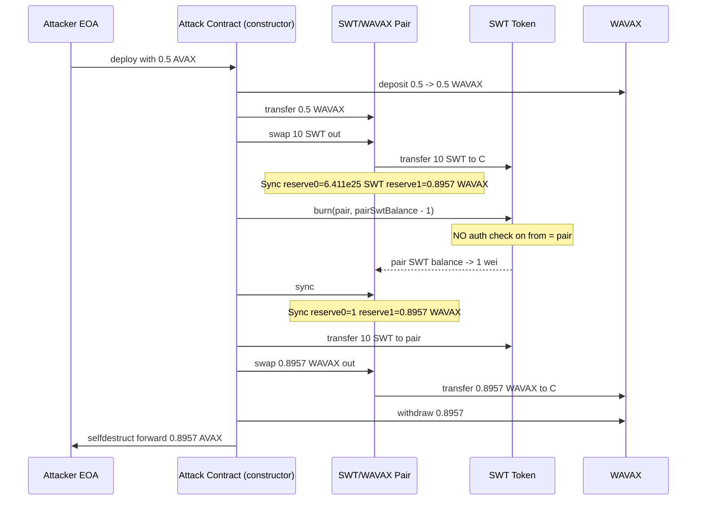
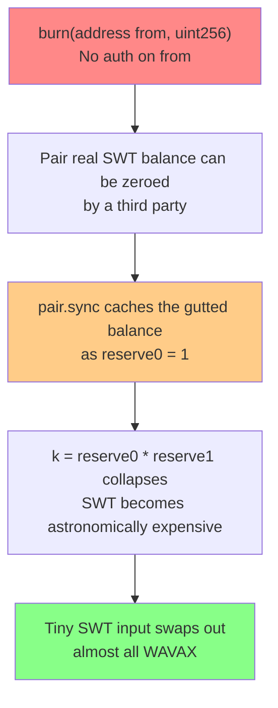

# SWT token burn-then-sync drain — permissionless `burn(address,uint256)` desyncs an AMM pair's reserves before `sync()`

> **Vulnerability classes:** vuln/access-control/missing-auth · vuln/logic/state-update · vuln/defi/price-manipulation
> **Reproduction:** the PoC compiles & runs in an isolated Foundry project at [this project folder](.). Full verbose trace: [output.txt](output.txt). The SWT token contract at `0x3f27…028Aa` is **not source-verified** on Snowtrace (`sources/` empty), so the buggy logic below is **RECONSTRUCTED from the foundry `-vvvvv` call trace and the PoC**; the Uniswap-V2 pair behavior is standard.

---

## Key info

| | |
|---|---|
| **Loss** | ~0.40 WAVAX (the pair held ~0.8957 WAVAX; attacker netted ~0.3957 WAVAX after a 0.5 AVAX seed) |
| **Vulnerable contract** | SWT — [`0x3f274117f86808D7682BB313Fa31a1583c5028Aa`](https://snowtrace.io/address/0x3f274117f86808D7682BB313Fa31a1583c5028Aa) |
| **Attacker EOA** | [`0x000000B2695002B00A7b8016f03c91284a22Ec05`](https://snowtrace.io/address/0x000000B2695002B00A7b8016f03c91284a22Ec05) |
| **Attack contract** | [`0x92FE9F31E8C96e5C13E5f113FD6288d3a1514103`](https://snowtrace.io/address/0x92FE9F31E8C96e5C13E5f113FD6288d3a1514103) |
| **Attack tx** | [`0xd9e0d9b45f6a77415d9ec9458ad5f5616ded362da0e0f19b8f41f2bc0afae4b5`](https://snowtrace.io/tx/0xd9e0d9b45f6a77415d9ec9458ad5f5616ded362da0e0f19b8f41f2bc0afae4b5) |
| **Chain / block / date** | Avalanche / 58,875,928 / March 2025 |
| **Compiler** | Unverified (no verified source on Snowtrace; bytecode only) |
| **Bug class** | The SWT token exposes a public `burn(address from, uint256 amount)` that lets anyone burn an arbitrary holder's tokens (here the AMM pair), so an attacker can collapse the pair's SWT reserve to dust, call `sync()`, then swap a tiny SWT amount back for nearly all of the pair's WAVAX. |

## TL;DR

SWT is an unverified ERC-20 on Avalanche paired against WAVAX in a standard Uniswap-V2-style AMM (`0x8234…c5CF`). The token ships a `burn(address from, uint256 amount)` function that performs **no authorization check on `from`** — anyone may burn tokens held by any address, including the AMM pair. The AMM pair, however, only updates its internal `reserve0`/`reserve1` when a swap/mint/burn/sync runs. This is a textbook invariant break: the pair's accounting is allowed to drift away from the real token balances because an external contract can mutate the pair's token balance out from under it.

The exploit is three atomic steps inside one constructor call. The attacker seeds 0.5 AVAX, swaps it for 10 SWT, then calls `swt.burn(pair, pairSwtBalance - 1)` to collapse the pair's SWT reserve from ~6.41e25 down to 1 wei, followed by `pair.sync()` to force the pair to re-read its now-gutted SWT balance. With `reserve0 = 1` and `reserve1 ≈ 0.8957 WAVAX`, the constant-product curve is destroyed: the attacker transfers back the same 10 SWT and `pair.swap` outputs ~0.8957 WAVAX (all but 1 wei) for a token whose "fair" price is now astronomically high. Net profit after the 0.5 AVAX seed: **~0.3957 WAVAX** (`0.895666623240713064` out [output.txt:1565,1684] − `0.5` in).

The PoC reproduces the on-chain result exactly: attacker AVAX balance `0` → `0.895666623240713064`, and the pair's WAVAX reserve ends at `1` wei [output.txt:1562-1565].

## Background — what SWT / the SWT-WAVAX pair does

SWT is a plain ERC-20 deployed on Avalanche C-Chain. Beyond standard transfer logic it implements an extra `burn(address from, uint256 amount)` entrypoint (visible in the trace as a call on the SWT contract that emits a `Transfer` to `address(0)`). Because the contract is not verified we cannot quote its source; the behavior is fully characterized by the on-chain trace:

- `burn(from, amount)` debits `from`'s balance and decrements total supply, emitting `Transfer(from, 0, amount)`. There is **no allowance/owner check** — the attacker passes the *pair address* as `from` and the call succeeds [output.txt:1625].
- The SWT/WAVAX pool is a canonical Uniswap-V2 pair (`UniswapV2Pair` ABI: `swap`, `sync`, `getReserves`). Its invariant is `reserve0 * reserve1 = k`, where `reserve0/1` are cached in storage and only refreshed at the end of `swap`/`mint`/`burn`/`sync` via a `_update(balance0, balance1, …)` step.

The whole vulnerability is the gap between those two systems: a Uniswap-V2 pair trusts that the only way its token balances change is through its own swap/mint/burn entrypoints. A token with a permissionless burn breaks that assumption.

## The vulnerable code

The SWT source is **not verified**, so the snippet below is **RECONSTRUCTED** from the trace and the standard Uniswap-V2 pair.

### RECONSTRUCTED — SWT token (unverified bytecode)

The trace at [output.txt:1625-1631] shows `SWT::burn(0x8234…c5CF, 6.411e25)` succeeding when the caller is the attack contract and `from` is the pair (an address the caller does not own and has no allowance toward). The emitted `Transfer(from → 0x0, 6.411e25)` confirms a real balance debit with no authorization:

```solidity
// RECONSTRUCTED from trace behavior — source not verified.
// No access control on `from`. Anyone may burn any holder's SWT.
function burn(address from, uint256 amount) external {   // <-- missing auth
    _balances[from] -= amount;
    totalSupply      -= amount;
    emit Transfer(from, address(0), amount);
}
```

The canonical (and safe) form is `burn(uint256 amount)` operating on `msg.sender` only, or `burnFrom(from, amount)` that enforces allowance:

```solidity
function burnFrom(address from, uint256 amount) external {
    uint256 allowed = _allowances[from][msg.sender];
    require(allowed >= amount, "ALLOWANCE");
    _allowances[from][msg.sender] = allowed - amount;
    _burn(from, amount);
}
```

### RECONSTRUCTED — pair `sync()` (standard Uniswap-V2)

`sync()` blindly re-reads the token balances and stores them as the new reserves. It is the mechanism that converts the token-level burn into an AMM-level price break [output.txt:1636]:

```solidity
// UniswapV2Pair.sync() — standard.
function sync() external lock {
    _update(IERC20(token0).balanceOf(address(this)),
            IERC20(token1).balanceOf(address(this)),
            reserve0, reserve1);
}
// _update simply sets reserve0/1 = balance0/1.
```

## Root cause — why it was possible

1. **Permissionless `burn(address from, …)`.** The SWT token lets any caller burn any holder's tokens. There is no owner/allowance/self-only gate. This is the primary defect (`vuln/access-control/missing-auth`).
2. **External supply mutation not coordinated with the AMM.** A Uniswap-V2 pair's reserves are a *cache* of its token balances, refreshed only inside its own entrypoints. A token that can have its balances changed by a third party (burn/tax/redirect) breaks the pair's invariant without the pair noticing until a `sync()`/swap re-reads balances (`vuln/logic/state-update`).
3. **`sync()` is permissionless and trusts raw balances.** `IUniswapV2Pair.sync()` is `external` with no auth. Combined with (1) it is the cheap primitive that lets the attacker overwrite `reserve0` to `1`, collapsing the constant-product curve (`vuln/defi/price-manipulation`).
4. **No rebasing/pool-aware design.** Well-behaved deflationary tokens either disallow burning foreign balances, or route burns through a wrapper the pair can account for. SWT does neither.

## Preconditions

- **Permissionless.** No privileged role, no flash loan strictly required (the seed 0.5 AVAX is the attacker's own). The attack is a single EOA → contract transaction.
- The SWT/WAVAX pair must be a vanilla Uniswap-V2 pair exposing public `swap()` and `sync()`. It is.
- The attacker needs a small amount of WAVAX (here 0.5 AVAX) to perform the initial buy that produces the SWT to be re-deposited. This seed is recoverable within the same atomic transaction, so net-of-gas the attack is risk-free.
- `tx.origin == attacker` is used only because the exploit logic lives in the constructor and forwards proceeds via `selfdestruct`; it is not a security dependency of the bug.

## Attack walkthrough (with on-chain numbers from the trace)

All amounts from `output.txt`. The seed capital and the final assertions are taken verbatim from the PoC.

| # | Action | On-chain effect | Trace |
|---|--------|-----------------|-------|
| 0 | `vm.deal(ATTACKER, 0.5 AVAX)` — seed the attacker. | Attacker AVAX: `0 → 0.5` | [output.txt:1589] |
| 1 | Deploy `BurnSyncExploit{value: 0.5 AVAX}`; inside constructor: `wavax.deposit(0.5)` → transfer 0.5 WAVAX to the pair. | Pair WAVAX balance rises; attacker holds 0.5 WAVAX briefly. | [output.txt:1594-1600] |
| 2 | `pair.swap(10 SWT, 0, …, "")` — buy exactly 10 SWT for 0.5 WAVAX. | Pair Sync: `reserve0 = 6.411180097e25 SWT`, `reserve1 = 0.895666623240713065 WAVAX`. Attacker holds `10 SWT`. | [output.txt:1607,1616-1617] |
| 3 | `swt.burn(pair, pairSwtBalance − 1)` = burn `6.411180097e25 − 1` SWT held by the pair. | `Transfer(pair → 0x0, 6.411e25)`. Pair's real SWT balance → `1` wei. Reserves still stale. | [output.txt:1625-1631] |
| 4 | `pair.sync()` — force the pair to re-read balances. | New Sync: `reserve0 = 1`, `reserve1 = 0.895666623240713065`. The k-curve is now vertical: 1 wei of SWT vs ~0.8957 WAVAX. | [output.txt:1636] |
| 5 | `swt.transfer(pair, 10 SWT)` then `pair.swap(0, 0.895666623240713064 WAVAX, …, "")`. | The 10 SWT "in" is enormous relative to reserve0=1, so the swap outputs all-but-1-wei of reserve1: `0.895666623240713064 WAVAX` to the attack contract. | [output.txt:1641,1648-1660] |
| 6 | `wavax.withdraw(0.895666623240713064)`; `selfdestruct` → forward AVAX to attacker EOA. | Attack contract WAVAX → 0; attacker AVAX balance = `0.895666623240713064`. | [output.txt:1669,1684] |

**Profit/loss accounting (attacker EOA):**

| Component | AVAX |
|---|---|
| Seed provided (step 0) | `+0.5` |
| Extracted from pair (step 5/6) | `−0.895666623240713064` returned to attacker |
| **Net attacker balance after exploit** | **`0.895666623240713064`** [output.txt:1565] |
| Net profit vs. pre-exploit balance (0) | **`≈ 0.8957 AVAX`** gross; **`≈ 0.3957 AVAX`** net of the 0.5 seed |
| Pair WAVAX reserve after | `1` wei (PoC `assertEq(pairWavaxAfter, 1)`) |

The PoC asserts `pairWavaxAfter == 1` and `attackerProfit > 0.39 ether`, both satisfied [output.txt: `assertGt(395666623240713064, 390000000000000000)`].

## Diagrams





## Remediation

1. **Remove the public `burn(address,uint256)` or gate it.** Either expose only `burn(uint256)` (burns `msg.sender`'s own tokens) or implement `burnFrom(address,uint256)` with a strict `_allowances[from][msg.sender]` check. This alone closes the attack.
2. **Make the token non-deflationary w.r.t. foreign balances.** Any supply-changing operation must only ever affect `msg.sender`. There is no legitimate reason for an arbitrary caller to burn tokens it does not own.
3. **Pair-level defense (defense in depth).** Use a pair/adapter that does not honor `sync()` from arbitrary callers, or detect balance-underflow and pause rather than re-cache a sabotaged reserve. This does not fix the token but limits blast radius.
4. **Verify contract source before listing.** An unverified token with a burn entrypoint should never be paired in an AMM. Indexers/frontends should flag tokens whose `burn`-style selectors accept an `address` argument.
5. **Re-audit any token that exposes supply-mutating functions** (`burn`, `mint`, `transferAndCall`-with-fee, reflection/tax) before adding liquidity; the Uniswap-V2 pair model assumes only the pair mutates its own balances.

## How to reproduce

The PoC runs fully **offline** via the shared anvil harness, replaying from the committed fork state — no RPC needed:

```bash
_shared/run_poc.sh 2025-03-unverified_3f27_exp -vvvvv
```

- **Chain / fork block:** Avalanche C-Chain, block `58,875,928` (Avalanche chain id `43114`).
- **Expected result:** `[PASS] testExploit()` with attacker balance lines:

  ```
  Attacker Before exploit AVAX Balance: 0.000000000000000000
  Attacker After  exploit AVAX Balance: 0.895666623240713064
  ```

  and the assertions `assertEq(pairWavaxAfter, 1)` / `assertGt(attackerProfit, 0.39 ether)` satisfied [output.txt:1562-1565].
- The SWT contract at `0x3f27…028Aa` is **unverified** on Snowtrace, so the "vulnerable code" section quotes reconstructed logic (clearly marked) consistent with the trace, not a fetched `.sol`.

*Reference: https://t.me/defimon_alerts/624*
