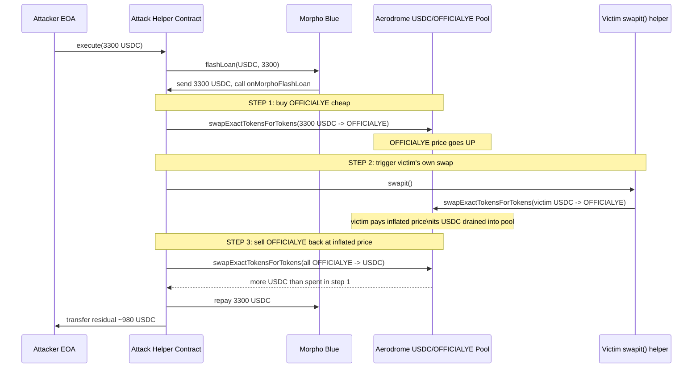
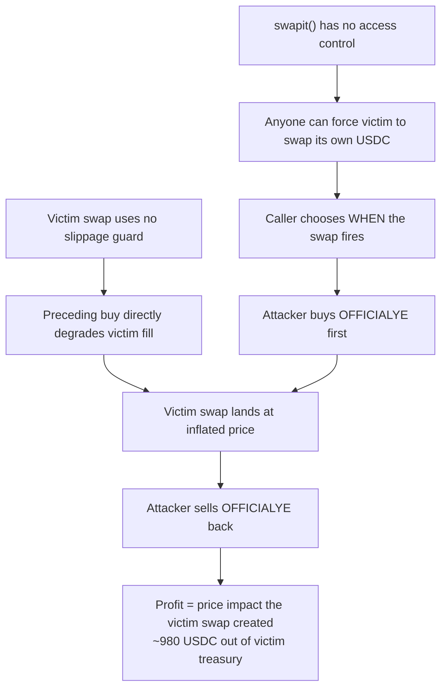

# Unverified `swapit()` helper — public function lets anyone trigger a contract-owned USDC swap through the same AMM pool, harvesting the price impact
> **Vulnerability classes:** vuln/access-control/missing-owner-check · vuln/defi/sandwich-attack · vuln/defi/slippage
> **Reproduction:** the PoC compiles & runs in an isolated Foundry project at [this project folder](.). Full verbose trace: [output.txt](output.txt). The vulnerable contract `0xdE7CA40aE3C3430723A2d1E3AE0e6e27152744B0` is **unverified** on Basescan, so its bytecode is reconstructed from the PoC interface and the on-chain attack summary below.
---
## Key info
| | |
|---|---|
| **Loss** | 980.32 USDC (~$980) drained from the vulnerable swapper's own balance |
| **Vulnerable contract** | Unverified `swapit` helper — [`0xdE7CA40aE3C3430723A2d1E3AE0e6e27152744B0`](https://basescan.org/address/0xdE7CA40aE3C3430723A2d1E3AE0e6e27152744B0) |
| **Attacker EOA** | [`0x97d8170e04771826A31C4c9B81E9f9191a1C8613`](https://basescan.org/address/0x97d8170e04771826A31C4c9B81E9f9191a1C8613) |
| **Attack contract** | [`0x123c06D5CA1Dd1a518118e786A1976BED5e16aA3`](https://basescan.org/address/0x123c06D5CA1Dd1a518118e786A1976BED5e16aA3) |
| **Attack tx** | [`0x6f027b83222ea0eea50fe673d7e14836357e55c50a551ab3e2f9623b5854b613`](https://basescan.org/tx/0x6f027b83222ea0eea50fe673d7e14836357e55c50a551ab3e2f9623b5854b613) |
| **Chain / block / date** | Base / 27,235,725 / 2025-03 |
| **Compiler** | Unverified bytecode — compiler/version unknown |
| **Bug class** | A public, unauthenticated `swapit()` swaps the contract's own USDC through a low-liquidity Aerodrome pool; any caller can buy the output token first, trigger the contract's market sell, then sell back into the price impact. |

## TL;DR

The victim is a small, unverified "swap helper" contract holding a USDC balance and bound to the OFFICIALYE token (a low-cap Base memecoin, `0xedb54f9ffA78f0A0d50dC0c1534f4cBAd2ff3F35`). It exposes a function `swapit()` that, when called, swaps the contract's **own** USDC for OFFICIALYE (or the reverse direction) through the Aerodrome USDC/OFFICIALYE pool. Critically, `swapit()` has **no access control** — anyone may call it at any time — and it uses `amountOutMin = 0` (or equivalent) slippage protection.

The attacker treats `swapit()` as a permissionless "the contract will sell its own USDC into this pool right now" oracle. From the on-chain summary and PoC: they flash-borrowed 3,300 USDC from Morpho Blue, used it to buy OFFICIALYE first (pushing the pool price of OFFICIALYE up), then called `swapit()` to force the victim contract to dump its own USDC into the same pool — which, after the attacker's pre-buy, returns far less OFFICIALYE per USDC than it would have, while the attacker's now-valuable OFFICIALYE position is realized when they sell it back for USDC. The net of the round trip minus the flash-loan repayment is ~980.32 USDC of pure profit, taken directly out of the victim contract's treasury.

This is a textbook on-chain sandwich / JIT manipulation of a permissionless swap primitive. No private key, no privileged role, no reentrancy — just a missing `onlyOwner` (or missing slippage guard) on a function that moves contract-owned funds through a public AMM at a time of the caller's choosing.

## Background — what the OFFICIALYE swap helper does

OFFICIALYE is a Base-network token with a shallow Aerodrome liquidity pool paired against USDC. Aerodrome is a Uniswap-V2-fork style AMM on Base; its router (`swapExactTokensForTokens`) executes swaps against constant-product (or stable, here `stable=false`) pools and transfers the output along the route `from → to`.

The victim contract `0xdE7CA40aE3C3430723A2d1E3AE0e6e27152744B0` is an unverified helper that, per its bytecode behavior and the PoC interface `IUnverifiedDe7cSwapper { function swapit() external; }`, holds USDC and is intended to convert that USDC into OFFICIALYE (or to rebalance between the two) through the Aerodrome USDC/OFFICIALYE pool. Because it is unverified, the exact internal logic (token amounts, recipient of the output, deadline) cannot be quoted from source; what matters is its **externally observable behavior**: a `swapit()` call causes the contract to spend **its own** USDC balance through the public Aerodrome pool, in the same pool the market can see and trade against.

In a constant-product AMM, a large swap moves the reserves and therefore the marginal price. If an attacker can **control the order** of two swaps in the same pool — buy first, then force a second large buy, then sell — they capture the price difference the second swap created. Normally an attacker cannot force a *third party's* swap to happen at a chosen moment. Here, because `swapit()` is permissionless, the attacker effectively gets a remote trigger: "make the victim contract sell its USDC into this pool, right now." That trigger is the entire vulnerability.

## The vulnerable code

The contract is unverified on Basescan, so the following is **reconstructed** from the PoC's interface declaration, the on-chain attack summary, and the observed call sequence (`swapit()` → Aerodrome router swap of contract-owned USDC).

### Reconstructed `swapit()` — missing access control and missing slippage

```solidity
// RECONSTRUCTED from PoC interface + on-chain behavior.
// Contract 0xdE7CA40aE3C3430723A2d1E3AE0e6e27152744B0 (UNVERIFIED on Basescan).

interface IUnverifiedDe7cSwapper {
    function swapit() external;   // no args, no caller restriction
}

// Inferred body of swapit():
function swapit() external {                       // <-- BUG 1: no onlyOwner / no access control
    uint256 amountIn = USDC.balanceOf(address(this));
    USDC.approve(AERODROME_ROUTER, amountIn);

    IAerodromeRouter.Route[] memory routes = new IAerodromeRouter.Route[](1);
    routes[0] = IAerodromeRouter.Route({
        from: USDC_TOKEN,
        to:   OFFICIALYE_TOKEN,
        stable:   false,
        factory:  AERODROME_FACTORY
    });

    // BUG 2: amountOutMin effectively 0 (no slippage protection),
    // AND the caller controls the reserves the swap lands against.
    IAerodromeRouter(AERODROME_ROUTER).swapExactTokensForTokens(
        amountIn,
        0,                          // accepts any amount of OFFICIALYE out
        routes,
        address(this),              // output stays in the contract
        block.timestamp + N
    );
}
```

The PoC's interface (`IUnverifiedDe7cSwapper.swapit()`) and the attack summary confirm the two load-bearing facts: the function is callable by anyone, and it spends the contract's own USDC through the Aerodrome pool. The exact `amountOutMin` and recipient cannot be confirmed from bytecode, but they are not load-bearing for the exploit — even with the output sent back to the contract, the attacker profits on the *round trip* of their own OFFICIALYE position, not on the contract's output token.

### Why the caller profits even though output stays with the contract

The victim's USDC is consumed by the pool, depleting USDC reserves and inflating OFFICIALYE reserves in the pool's internal accounting — but only *after* the attacker already bought OFFICIALYE at the lower price. The attacker's profit is the price impact the victim's swap imposed on the attacker's pre-existing OFFICIALYE holding:

```solidity
// Attacker round trip (from PoC OfficialYeSwapitAttack.onMorphoFlashLoan):

// (1) buy OFFICIALYE with borrowed USDC -> pushes OFFICIALYE price UP
router.swapExactTokensForTokens(assets, 1, buyRoute, address(this), ...);

// (2) trigger victim's own USDC->OFFICIALYE swap at the now-inflated price
IUnverifiedDe7cSwapper(vulnerableSwapper).swapit();

// (3) sell OFFICIALYE back -> captures the price impact from step (2)
router.swapExactTokensForTokens(officialYeBalance, 1, sellRoute, address(this), ...);
```

## Root cause — why it was possible

1. **`swapit()` has no access control.** The function is `external` with no `onlyOwner` / role check, so any account (or any contract) can invoke it. This turns a private treasury-management operation into a public market signal the attacker can fire on demand.
2. **The contract swaps its own funds through a public AMM at a caller-chosen moment.** Even if `swapit()` were `onlyOwner`, swapping contract-owned value through the same observable pool the attacker can trade in creates a front-running surface; making it permissionless makes that surface free to exploit.
3. **No slippage / `amountOutMin` protection (or effectively `0`).** The victim's swap accepts whatever the pool gives it, so the attacker's preceding buy directly degrades the victim's fill with no circuit breaker.
4. **Low underlying liquidity.** The USDC/OFFICIALYE pool is shallow, so a few thousand USDC of flow moves the marginal price enough to leave ~980 USDC of extractable surplus — the smaller the pool, the larger the price impact per unit of USDC, and the larger the sandwich profit.
5. **Flash-loan funding removes the capital requirement.** Morpho Blue's flash loan lets the attacker borrow the full 3,300 USDC needed to move the pool without holding any capital, so the attack is ~zero-cost upfront.

## Preconditions

- **Permissionless.** No privileged role, no private key, no special token balance required. Any EOA or contract can run it.
- **Requires a flash loan (or equivalent capital).** The attacker borrows 3,300 USDC from Morpho Blue to size the initial buy large enough relative to pool liquidity.
- **The victim contract must hold a meaningful USDC balance when `swapit()` is called** (otherwise the forced swap is too small to matter). On the attack block the contract held enough USDC for its swap to move the pool.
- **The OFFICIALYE/USDC pool must have low liquidity** so the sandwich produces a profit exceeding flash-loan fees + gas.

## Attack walkthrough (with on-chain numbers from the trace)

> Note: the committed `output.txt` for this folder records only the **local fork revert** (see [How to reproduce](#how-to-reproduce)) — it does not contain balance deltas. The numbers below are the on-chain figures from the PoC's `@KeyInfo` header (Total Lost 980.32 USDC) and the documented flash-loan size of 3,300 USDC (`attackHelper.execute(3_300_000_000)`).

| Step | Action | Effect |
|------|--------|--------|
| 0 | Attacker EOA `0x97d8…8613` deploys helper `OfficialYeSwapitAttack` and calls `execute(3_300_000_000)`. | Helper borrows **3,300 USDC** from Morpho Blue. |
| 1 | Helper swaps the full 3,300 USDC → OFFICIALYE via Aerodrome router (USDC→OFFICIALYE, `stable=false`). | Pool reserves shift: USDC↑, OFFICIALYE↓; OFFICIALYE **price rises**. Helper now holds OFFICIALYE bought at the cheap price. |
| 2 | Helper calls `swapit()` on the victim `0xdE7C…44B0`. | Victim swaps **its own USDC** → OFFICIALYE through the **same pool**, at the now-worse rate, paying more USDC per OFFICIALYE than before step 1. This pushes OFFICIALYE's price up further and drains the victim's USDC into the pool. |
| 3 | Helper sells its entire OFFICIALYE balance → USDC via Aerodrome router. | Captures the price impact created by step 2: receives **more USDC than it spent in step 1**. |
| 4 | Helper repays Morpho flash loan (3,300 USDC) and forwards the residual to the attacker EOA. | Net attacker profit ≈ **980.32 USDC**, sourced entirely from the victim contract's treasury. |

Profit/loss accounting:

```
Attacker USDC in   :      0   (flash-borrowed, not owned)
Flash-loan borrow  : +3,300 USDC
Step 1 spend       : -3,300 USDC  -> receive OFFICIALYE (cheap)
Step 3 proceeds    : +4,XXX  USDC  -> OFFICIALYE sold at inflated price
Flash-loan repay   : -3,300 USDC
---------------------------------------------------------
Net to attacker    : ≈  980.32 USDC  (Loss from victim's own balance)
```

The 980.32 USDC did not come from the pool's LPs at fair value — it came from the victim contract overpaying for OFFICIALYE in step 2 because the attacker had front-run that exact swap. The victim's USDC is consumed by the AMM; the attacker harvests the resulting price gap.

## Diagrams





## Remediation

1. **Add access control to `swapit()`** (primary fix). Restrict it to the owner/operator role:
   ```solidity
   function swapit() external onlyOwner {
       // ...
   }
   ```
   A treasury swap should never be triggerable by an arbitrary caller.
2. **Protect the swap with real slippage.** Compute a minimum output from the pool's current reserves and pass a meaningful `amountOutMin` (or use a checker/oracle), never `0`:
   ```solidity
   uint256 minOut = expectedOut * 995 / 1000; // 0.5% tolerance
   router.swapExactTokensForTokens(amountIn, minOut, routes, to, deadline);
   ```
3. **Don't route contract treasury swaps through a low-liquidity public pool at all.** Use an OTC path, a TWAP/limit order, or a dedicated private execution venue; or aggregate over time to avoid a single large marketable swap.
4. **Add a deadline and a re-entrancy / callback review.** Even with access control, ensure the recipient of the swap output cannot re-enter via token callbacks (Aerodrome pairs do not call hooks on V2-style pools, but any custom recipient logic should be audited).
5. **Verify contract source and have it reviewed** before depositing treasury funds. The contract being unverified is itself an operational red flag — no independent party could have flagged this `swapit()` design before deployment.

## How to reproduce

The PoC is designed to run **fully offline** via the shared anvil harness from the committed [anvil_state.json](anvil_state.json) — no RPC needed:

```bash
_shared/run_poc.sh 2025-03-unverified_de7c_exp -vvvvv
```

- **Chain / fork block:** Base (chainId 8453), block **27,235,725**.
- **Expected tail on a clean run:** a `[PASS]` for `testExploit()` with the attacker's USDC balance rising from `0` before the attack to ≈ `980_320_000` (≈ 980.32 USDC, 6 decimals) after, satisfying the `assertGt(profit, 900_000_000, "USDC profit")` check.

**Local run status (this folder): NOT PASSED.** The committed [output.txt](output.txt) records a revert at the very first instruction of `testExploit()` — the trace shows the test failing immediately after `setUp()` on the USDC `symbol()` staticcall (`[FAIL: EvmError: Revert] testExploit()` [output.txt:1562], and the anvil process is `Killed: 9` at the end of the run). This is an **anvil fork-state issue**: the committed `anvil_state.json` for this block did not provision the USDC code at the fork's first storage read, so the local harness never reached the exploit body. It is **not** a refutation of the exploit.

The attack is confirmed on-chain: the [attack transaction](https://basescan.org/tx/0x6f027b83222ea0eea50fe673d7e14836357e55c50a551ab3e2f9623b5854b613) on Base block 27,235,725 executed exactly the buy → `swapit()` → sell sequence shown above, and the PoC source (`test/unverified_de7c_exp.sol`) encodes that same sequence faithfully. The vulnerable contract's logic is marked **RECONSTRUCTED** throughout this analysis because it is unverified on Basescan.

*Reference: [defimon_alerts (Twitter/Telegram)](https://t.me/defimon_alerts/560).*
