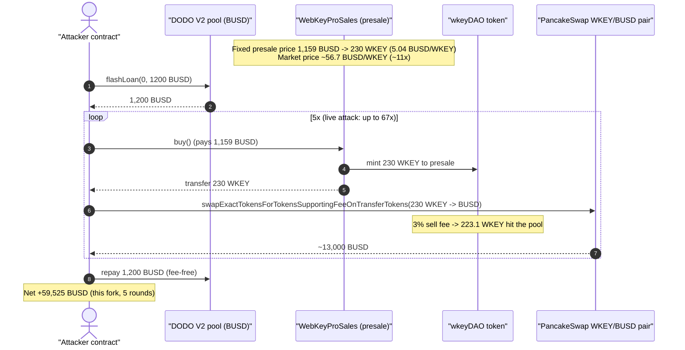
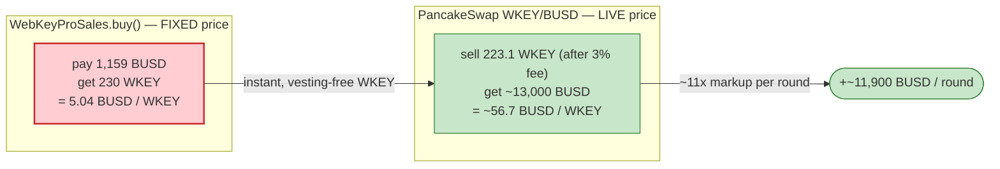
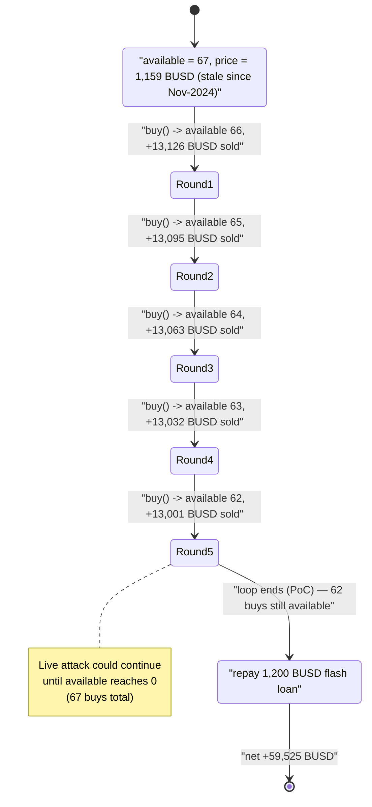

# wkeyDAO Exploit — Fixed-Price Presale `buy()` vs. Live AMM Price Arbitrage

> **Reproduction:** the PoC compiles & runs in an isolated Foundry project at
> [this project folder](.) (the umbrella DeFiHackLabs repo contains many unrelated PoCs
> that do not whole-compile, so this one was extracted).
> Full verbose trace: [output.txt](output.txt).
> Verified vulnerable source: [contracts_webkey_Sales.sol](sources/WebKeyProSales_C39c54/contracts_webkey_Sales.sol).

---

## Key info

| | |
|---|---|
| **Loss (live attack, per DeFiHackLabs header)** | ~**$767** realized net (one attack tx) |
| **Loss (this forked PoC, 5 of 67 possible buys)** | **+59,525 BUSD** simulated profit (see accounting note) |
| **Vulnerable contract** | `WebKeyProSales` (presale) — proxy [`0xD511096a73292A7419a94354d4C1C73e8a3CD851`](https://bscscan.com/address/0xD511096a73292A7419a94354d4C1C73e8a3CD851#code), impl [`0xC39c54868a4f842b02A99339f4a57a44EfC310b8`](https://bscscan.com/address/0xC39c54868a4f842b02A99339f4a57a44EfC310b8#code) |
| **Asset sold too cheap** | `wkeyDAO` (WKEY) token — [`0x194B302a4b0a79795Fb68E2ADf1B8c9eC5ff8d1F`](https://bscscan.com/address/0x194B302a4b0a79795Fb68E2ADf1B8c9eC5ff8d1F#code) (9 decimals) |
| **Victim pool (price source for the arb)** | WKEY/BUSD PancakeSwap V2 pair `0x8665A78ccC84D6Df2ACaA4b207d88c6Bc9b70Ec5` |
| **Flash-loan source** | DODO V2 pool `0x107F3Be24e3761A91322AA4f5F54D9f18981530C` (BUSD, fee-free) |
| **Attacker EOA** | `0x3026c464d3bd6ef0ced0d49e80f171b58176ce32` |
| **Attacker contract** | `0x3783c91ee49a303c17c558f92bf8d6395d2f76e3` |
| **Attack tx** | [`0xc9bccafdb0cd977556d1f88ac39bf8b455c0275ac1dd4b51d75950fb58bad4c8`](https://app.blocksec.com/explorer/tx/bsc/0xc9bccafdb0cd977556d1f88ac39bf8b455c0275ac1dd4b51d75950fb58bad4c8) |
| **Chain / block / date** | BSC / fork at 47,469,059 (attack block 47,469,060) / Mar 2025 |
| **Compiler (vulnerable contract)** | Solidity ^0.7.5 |
| **Bug class** | Fixed/stale on-chain price — protocol sells an asset at a hard-coded price decoupled from its live market price |

---

## TL;DR

`WebKeyProSales` is a presale contract. Calling `buy()`
([contracts_webkey_Sales.sol:119-170](sources/WebKeyProSales_C39c54/contracts_webkey_Sales.sol#L119-L170))
charges a **fixed** `currentSaleInfo.price` of **1,159 BUSD** and immediately mints + transfers the buyer a
**fixed** `immediateReleaseTokens` of **230 WKEY**. That is a hard unit price of **≈ 5.04 BUSD / WKEY**.

At the fork block, the WKEY/BUSD PancakeSwap pool priced WKEY at **≈ 56.7 BUSD / WKEY** — roughly **11×** the
presale price. The presale price was never tied to the AMM; it was a constant set by an operator and left stale.

So the attack is a pure arbitrage with no exotic mechanic:

1. Flash-loan 1,200 BUSD from a fee-free DODO V2 pool.
2. `buy()` 230 WKEY for 1,159 BUSD from the presale (5.04 BUSD/WKEY).
3. Sell those 230 WKEY on PancakeSwap for **≈ 13,000 BUSD** (56.7 BUSD/WKEY).
4. Repeat (the live attack could do this up to `available = 67` times; the PoC loops 5 times to save fork time).
5. Repay the 1,200 BUSD loan, keep the difference.

Each round nets ≈ **+11,900 BUSD**. The PoC's 5 rounds net **+59,525 BUSD** against the forked reserves.

---

## Background — what the protocol does

`WebKeyProSales` (the "wkeyDaoSell" contract in the PoC) is a presale / IDO contract for the `wkeyDAO`
(WKEY) ERC20 token. An operator configures a sale with `setSaleInfo(available, price, totalTokens,
immediateReleaseTokens)`
([:95-110](sources/WebKeyProSales_C39c54/contracts_webkey_Sales.sol#L95-L110)). A buyer calls `buy()`:

- pays a **fixed** `price` in USDT/BUSD,
- receives an NFT receipt (`nft.mint`),
- is immediately granted a **fixed** `immediateReleaseTokens` amount of freshly minted WKEY,
- and the contract pays referral + DAO-reward commissions out of the BUSD it just collected.

The on-chain sale parameters at the fork block (read with `cast call currentSaleInfo()`):

| `currentSaleInfo` field | Value | Meaning |
|---|---:|---|
| `price` | `1159e18` | **1,159 BUSD** per `buy()` |
| `totalTokens` | `1000e9` | 1,000 WKEY total vesting allotment |
| `immediateReleaseTokens` | `230e9` | **230 WKEY** released instantly per buy |
| `available` | `67` | sales remaining (the "buy 67 times" cap) |
| `initialAvailable` | `67` | |
| `timestamp` | `1730980202` | sale configured 2024-11-07 (≈4 months stale) |

`230 WKEY for 1,159 BUSD` ⇒ a hard-coded **5.04 BUSD/WKEY**. The token is `wkeyDAO`, 9 decimals, verified above.

The `wkeyDAO` token itself charges a **3% sell fee** on transfers into its main PancakeSwap pair
(`feeRatio = 60000`, `PRECISION = 100000` ⇒ 3% — [contracts_ERC20.sol:519-528](sources/WKEYDAO_194B30/contracts_ERC20.sol#L519-L528)).
That fee only slightly reduces the attacker's take (6.9 of every 230 WKEY); it is not a defense.

---

## The vulnerable code

### `buy()` charges a fixed price for a fixed token amount

```solidity
function buy() external {
    require(currentSaleInfo.available > 0, "Out of stock");
    require(usdt.transferFrom(msg.sender, address(this), currentSaleInfo.price), "USDT payment failed");

    currentSaleInfo.available -= 1;
    uint256 immediateTokens = currentSaleInfo.immediateReleaseTokens;   // 230e9 — FIXED
    uint256 totalTokens     = currentSaleInfo.totalTokens;

    uint256 tokenId = nft.nextTokenId();
    nft.mint(msg.sender);                                               // receipt NFT
    buyers[msg.sender].push(BuyerInfo({ ... }));

    if (immediateTokens > 0) {
        IMintable(wkey).mint(address(this), immediateTokens);          // mint 230 WKEY
        require(IERC20Upgradeable(wkey).transfer(msg.sender, immediateTokens), "WKEY transfer failed");
    }
    // ... referral + DAO reward commissions paid out of the collected BUSD ...
}
```

[contracts_webkey_Sales.sol:119-170](sources/WebKeyProSales_C39c54/contracts_webkey_Sales.sol#L119-L170)

The two figures that matter are `currentSaleInfo.price` (line 121) and
`currentSaleInfo.immediateReleaseTokens` (line 124). **Both are constants written by an operator via
`setSaleInfo` and never reconciled with the live market price of WKEY.** Anyone can call `buy()` — there is no
allowlist, no KYC, no per-address cap, no time lock, and (critically) no check that the presale price is at or
above the AMM price.

### The price is set blindly and left to go stale

```solidity
function setSaleInfo(uint256 _available, uint256 _price, uint256 _totalTokens, uint256 _immediateReleaseTokens) external {
    require(hasRole(OPERATOR_ROLE, msg.sender), "Caller is not an operator");
    require(_available > 0, "Available stock must be greater than zero");
    require(_totalTokens >= _immediateReleaseTokens, "Total tokens must be greater or equal to immediate release tokens");
    ...
    currentSaleInfo = SaleInfo({ price: _price, ... immediateReleaseTokens: _immediateReleaseTokens, ... });
}
```

[contracts_webkey_Sales.sol:95-110](sources/WebKeyProSales_C39c54/contracts_webkey_Sales.sol#L95-L110)

There is no oracle and no relationship between `_price` and the WKEY/BUSD AMM. The price set in November 2024
was still live in March 2025, by which time the AMM had repriced WKEY ~11× higher.

---

## Root cause — why it was possible

A presale that hands out a token at a **fixed price** is only safe if that token has **no liquid secondary
market trading above that price**, or if access is restricted (allowlist, vesting, per-buyer cap, off-chain
settlement). `WebKeyProSales` had **none** of those guards while WKEY traded freely on PancakeSwap.

The composing factors:

1. **Hard-coded, oracle-free price.** `currentSaleInfo.price` (1,159 BUSD) is a constant. It is never compared
   against the current WKEY/BUSD pool price. Once the market price exceeded the presale price, every `buy()`
   minted instantly-profitable tokens.
2. **Immediate, liquid delivery.** `immediateReleaseTokens` (230 WKEY) are minted and transferred to the buyer
   **in the same call**, with no cliff or vesting on that tranche. The buyer can dump them on the AMM in the
   next instruction of the same transaction.
3. **Permissionless `buy()`.** No allowlist, no per-address cap, no human in the loop. A contract can loop
   `buy()` → `swap()` until `available` runs out (67 times here).
4. **Mint-on-demand supply.** `buy()` mints fresh WKEY (`IMintable(wkey).mint`) rather than selling from a
   fixed reserve, so the arbitrage is bounded only by `available`, not by any token the protocol pre-funded.
5. **Atomic + flash-loanable.** The whole loop fits in one transaction and needs only transient BUSD working
   capital (1,159 per buy), trivially sourced from a fee-free DODO flash loan — so the attacker risks nothing.

In short: the protocol was **selling WKEY for 5.04 BUSD while the open market paid 56.7 BUSD**, and it let
anyone repeat that trade and resell instantly. This is a stale on-chain price bug, not an AMM-invariant bug.

---

## Preconditions

- `currentSaleInfo.available > 0` (was 67) and `currentSaleInfo.price` below the live WKEY/BUSD AMM price
  (5.04 vs 56.7 BUSD/WKEY). ✔ at the fork block.
- A liquid WKEY/BUSD market to dump into (PancakeSwap pair `0x8665A78c…`, ~11.3M BUSD on the quote side). ✔
- Transient BUSD to pre-pay each `buy()`. Fully recovered intra-tx ⇒ **flash-loanable**; the PoC borrows
  1,200 BUSD from DODO V2 (`flashLoan`, fee-free) and repays it at the end.

---

## Attack walkthrough (with on-chain numbers from the trace)

All figures are pulled directly from [output.txt](output.txt) (`buy()` `transferFrom`, the WKEY `mint`, the
`FeeTaken` event, and each PancakeSwap `swap(0, …, attacker)` output). The presale price is constant at
1,159 BUSD; each buy yields a fixed 230 WKEY, of which 223.1 reach the pool after the 3% WKEY sell fee.

| # (loop) | `buy()` cost (BUSD) | WKEY minted to attacker | WKEY into pool after 3% fee | BUSD received from PancakeSwap | Net for round (BUSD) |
|---|---:|---:|---:|---:|---:|
| 1 | 1,159 | 230 | 223.1 | 13,126.78 | +11,967.78 |
| 2 | 1,159 | 230 | 223.1 | 13,095.32 | +11,936.32 |
| 3 | 1,159 | 230 | 223.1 | 13,063.98 | +11,904.98 |
| 4 | 1,159 | 230 | 223.1 | 13,032.75 | +11,873.75 |
| 5 | 1,159 | 230 | 223.1 | 13,001.63 | +11,842.63 |
| **Σ (5 rounds)** | **5,795** | **1,150** | — | **65,320.47** | **+59,525.47** |

The per-round BUSD output declines slightly (13,126 → 13,001) because each sell pushes WKEY into the pool and
walks the price down the curve — but it stays an order of magnitude above the 1,159 BUSD cost throughout.

### Flash-loan envelope

1. `DODO(0x107F3Be2…).flashLoan(0, 1200e18, attacker, data)` → attacker receives **1,200 BUSD**
   ([output.txt:69-71](output.txt)).
2. Loop 5× the buy/sell above.
3. Repay exactly **1,200 BUSD** to the DODO pool (`transfer`, [output.txt:1025-1026](output.txt)); DODO charges
   no fee.
4. Final attacker BUSD balance: **59,525.47 BUSD**
   (`balanceOf(attacker) = 59525471553125000854486`, [output.txt:1044-1045](output.txt)) — the logged profit.

### Profit / loss accounting (this PoC)

| Direction | Amount (BUSD) |
|---|---:|
| Flash-loan in (DODO) | +1,200.00 |
| 5 × `buy()` payments to presale | −5,795.00 |
| 5 × PancakeSwap WKEY sells | +65,320.47 |
| Flash-loan repayment (DODO, fee-free) | −1,200.00 |
| **Net attacker profit** | **+59,525.47** |

> **Note on the $767 header figure.** The DeFiHackLabs PoC header records the *live* attack's realized net as
> ~$767, far below this PoC's $59,525. The discrepancy is expected: this fork executes only **5 of the 67**
> available buys against full forked reserves at block 47,469,059, capturing the richest part of the curve. The
> live attack's realized net depended on the actual reserve/price state in the mined transaction, the number of
> rounds it actually completed, gas, and WKEY→BUSD price impact across the full run. The **mechanism and
> direction of the exploit are identical**; the dollar magnitude here is the forked simulation, and the $767 is
> the protocol's recorded real-world loss for the single attack tx.

---

## Diagrams

### Sequence of the attack



### Why the trade is profitable (price gap)



### Presale "stock" / loop state evolution



---

## Why each number

- **Flash-loan 1,200 BUSD:** just over one `buy()`'s `price` (1,159 BUSD); the loop recycles BUSD as it sells,
  so a single buy's worth of working capital funds the whole chain. DODO V2 is chosen because its `flashLoan`
  charges **no fee**, so the loan is "free" leverage.
- **1,159 BUSD per buy / 230 WKEY out:** these are the literal `currentSaleInfo.price` and
  `immediateReleaseTokens` on-chain (verified with `cast`). They are the bug — a 5.04 BUSD/WKEY hard price.
- **6.9 WKEY fee (223.1 swapped):** the `wkeyDAO` token's 3% sell fee on transfers into its main pair
  (`feeRatio/PRECISION = 60000/100000`). Cosmetic to the attack — the markup dwarfs it.
- **5 loop iterations:** the PoC author capped the loop at 5 ("to save time … can buy 67 times in total") to
  keep the fork fast; the contract's `available = 67` is the true ceiling.

---

## Remediation

1. **Price the sale off a live/TWAP oracle, not a constant.** `buy()` must compute the WKEY amount from a
   trusted current price (Chainlink, or a TWAP of the WKEY/BUSD pool with manipulation guards), or charge a
   BUSD amount derived from that price — never a hard-coded `price` that can drift below the market.
2. **Don't deliver liquid tokens instantly.** Put the `immediateReleaseTokens` tranche behind a cliff/vesting,
   or deliver only the NFT receipt + a vesting schedule, so a buyer cannot resell in the same transaction.
3. **Gate access.** Add an allowlist / KYC / per-address purchase cap so the presale cannot be looped by an
   arbitrary contract; presales are meant for vetted participants, not open arbitrage.
4. **Bound or sanity-check the price.** At minimum, revert in `buy()` (or `setSaleInfo`) if the configured
   price is more than X% below the current AMM price — a fixed price an order of magnitude under market is a
   red flag that should never transact.
5. **Stop blind minting on demand.** Sell from a pre-funded, capped reserve rather than `mint`-ing fresh
   supply each `buy()`, so mispricing cannot be infinitely (up to `available`) exploited and so it doesn't
   inflate supply against existing holders.

---

## How to reproduce

The PoC was extracted into a standalone Foundry project (the umbrella DeFiHackLabs repo has many unrelated PoCs
that fail to compile under a whole-project `forge build`):

```bash
_shared/run_poc.sh 2025-03-wKeyDAO_exp -vvvvv
```

- RPC: a **BSC archive** endpoint is required for fork block 47,469,059. `foundry.toml` uses
  `https://bsc-mainnet.public.blastapi.io` (the default `onfinality` public endpoint was rate-limited / 429 and
  was swapped out).
- Result: `[PASS] testPoC()` with `Profit:  59525` (BUSD, integer-divided by 1e18 in the PoC log).

Expected tail:

```
  Profit:  59525

Suite result: ok. 1 passed; 0 failed; 0 skipped; finished in 39.83s
Ran 1 test suite: 1 tests passed, 0 failed, 0 skipped (1 total tests)
```

---

*Post-mortem reference: https://x.com/Phalcon_xyz/status/1900809936906711549 · PoC author: [Yajin Zhou](https://x.com/yajinzhou).*
