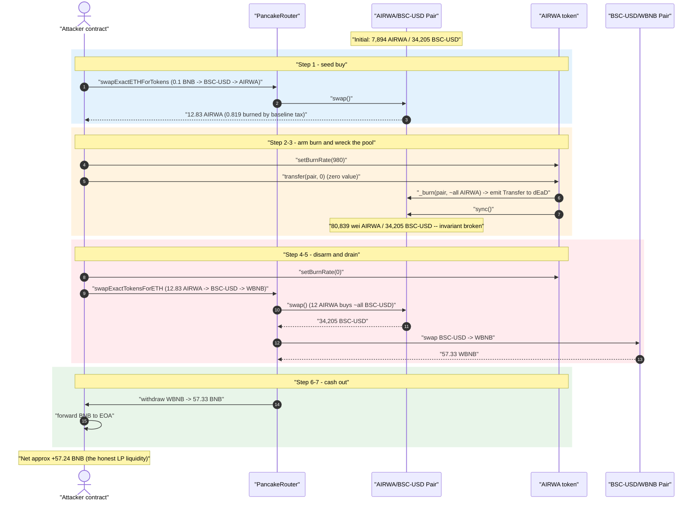
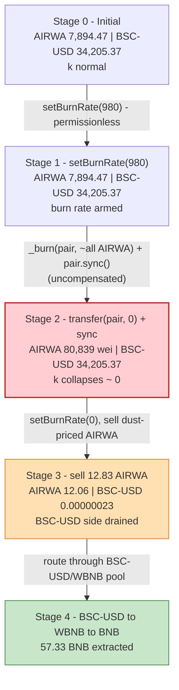
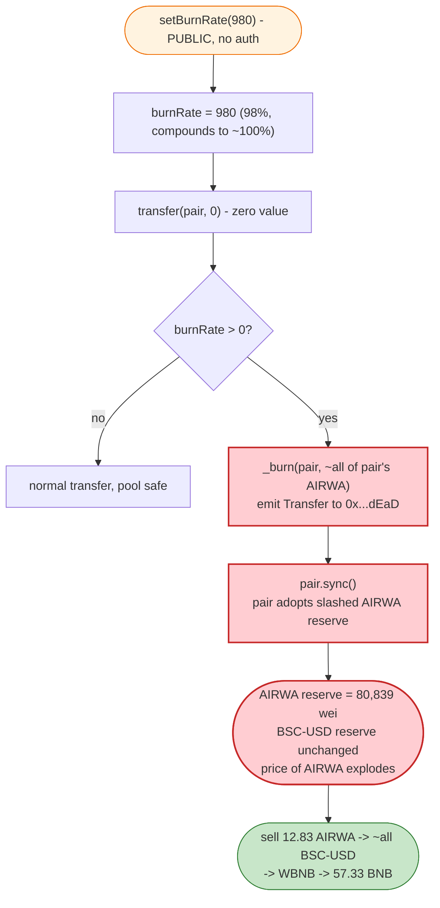
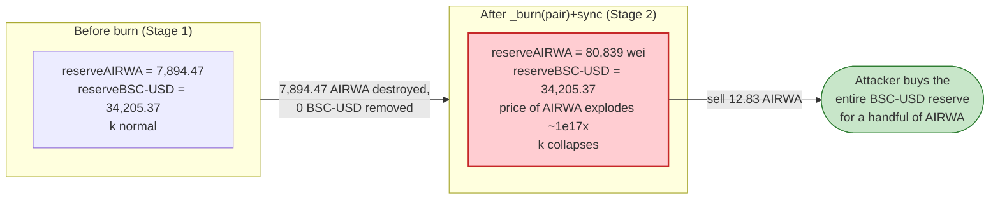

# AIRWA Exploit — Permissionless `setBurnRate()` + Zero-Value Transfer Pool-Reserve Annihilation

> **Vulnerability classes:** vuln/access-control/missing-modifier · vuln/oracle/price-manipulation

> **Reproduction:** the PoC compiles & runs in an isolated Foundry project at
> [this project folder](.) (the umbrella DeFiHackLabs repo
> contains many unrelated PoCs that do not compile together, so this one was extracted).
> Full verbose trace: [output.txt](output.txt).
> The vulnerable `AIRWA` token is **unverified** on BscScan — its logic below is reconstructed
> from the on-chain execution trace and confirmed function selectors (see
> [The vulnerable code](#the-vulnerable-code)).

---

## Key info

| | |
|---|---|
| **Loss** | **~56.73 BNB** (≈ $34,205 of BSC-USD liquidity drained from the AIRWA/BSC-USD PancakeSwap pair, swapped out as **57.33 WBNB**) |
| **Vulnerable contract** | `AIRWA` token — [`0x3Af7DA38C9F68dF9549Ce1980eEf4AC6B635223A`](https://bscscan.com/address/0x3Af7DA38C9F68dF9549Ce1980eEf4AC6B635223A) (unverified) |
| **Victim pool** | AIRWA/BSC-USD PancakePair (Cake-LP) — [`0xc3551400c032cB0556dee1AD1dC78D1cbC64B7bb`](https://bscscan.com/address/0xc3551400c032cB0556dee1AD1dC78D1cbC64B7bb) |
| **Attacker EOA** | [`0x70f0406e0a50c53304194b2668ec853d664a3d9c`](https://bscscan.com/address/0x70f0406e0a50c53304194b2668ec853d664a3d9c) |
| **Attacker contract** | [`0x2a011580f1b1533006967bd6dc63af7ae5c82363`](https://bscscan.com/address/0x2a011580f1b1533006967bd6dc63af7ae5c82363) |
| **Attack tx** | [`0x5cf050cba486ec48100d5e5ad716380660e8c984d80f73ba888415bb540851a4`](https://bscscan.com/tx/0x5cf050cba486ec48100d5e5ad716380660e8c984d80f73ba888415bb540851a4) |
| **Chain / block / date** | BSC / 48,050,724 / ~April 3, 2025 |
| **Compiler** | PoC pragma `^0.8.0`; project built with `evm_version = cancun` |
| **Bug class** | Broken AMM invariant via a permissionless, balance-targeted token burn applied to a pool's balance + forced `sync()` |
| **Reference** | [TenArmor (@TenArmorAlert)](https://x.com/TenArmorAlert/status/1908086092772900909) |

---

## TL;DR

`AIRWA` is a fee/burn token whose **burn rate is settable by anyone** through a public, unauthenticated
`setBurnRate(uint256)` function (selector `0x189d165e`, no `onlyOwner`). When a transfer fires, the
token burns a fraction of a *targeted balance* and, critically, **calls `pair.sync()` on the
PancakeSwap pair so the pair adopts the freshly-reduced AIRWA balance as its real reserve.**

The attacker:

1. Buys a small amount of AIRWA (0.1 BNB → ~12.83 AIRWA).
2. Calls **`setBurnRate(980)`** — a 98% burn rate, applied with internal compounding so it destroys
   essentially the *entire* AIRWA balance it touches.
3. Calls **`transfer(pair, 0)`** — a **zero-value** transfer to the AIRWA/BSC-USD pair. The token's
   transfer hook burns **99.999%** of the *pair's* AIRWA balance (7,894.47 AIRWA → **80,839 wei**) and
   then `sync()`s the pair, so the pair now believes its AIRWA reserve is 80,839 wei while still
   holding all **34,205 BSC-USD**. The constant product `k` collapses.
4. Calls **`setBurnRate(0)`** to restore normal transfers, then **sells its 12.83 AIRWA** into the
   now-degenerate pool. With the AIRWA reserve at 80,839 wei, 12 AIRWA is astronomically large relative
   to the reserve and pulls out **virtually all 34,205 BSC-USD**.
5. Routes the BSC-USD → WBNB (in the deep BSC-USD/WBNB pool) → unwraps to **57.33 BNB** and forwards
   it to the EOA.

Net result: the attacker turned 0.1 BNB of seed capital into **~58.23 BNB**, walking off with the
honest LPs' ~56.73 BNB of value. No flash loan, no privileged role, one transaction.

---

## Background — what AIRWA does

`AIRWA` is an ERC-20 "real-world-asset"-branded fee/burn token deployed on BSC and paired against
**BSC-USD** (Binance-Peg USD, `0x55d3...7955`) in a PancakeSwap V2 pair (Cake-LP
`0xc355...B7bb`). On-chain facts read via `cast` at the fork block:

| Fact | Value |
|---|---|
| `name()` / `symbol()` | `"AIRWA"` / `"AIRWA"` |
| `burnRate` (storage slot 18) | **0** before the attack |
| `setBurnRate(uint256)` selector | `0x189d165e` — present, **no access control** |
| `burnRate()` getter selector | `0xbed99850` — present |
| Pair token0 / token1 | **AIRWA / BSC-USD** (so `reserve0 = AIRWA`, `reserve1 = BSC-USD`) |
| Pool AIRWA reserve (after seed buy) | 7,894.47 AIRWA |
| Pool BSC-USD reserve | **34,205.37 BSC-USD** ← the prize |

The token also applies a **baseline transfer burn** even at the default rate: during the attacker's
buy, a gross 13.65 AIRWA arrived but 0.819 AIRWA (~6%) was burned to the dead address and only 12.83
reached the buyer (trace [output.txt L1637-L1638](output.txt)). This baseline tax is irrelevant to the
exploit; the exploit lever is the **settable** `burnRate` plus the **pool-targeted burn + sync**.

---

## The vulnerable code

> **Note on source provenance.** The AIRWA token is **not verified** on BscScan, so no Solidity is
> published. The contract's runtime bytecode ([sources/AIRWA_bytecode.txt](sources/AIRWA_bytecode.txt))
> contains the selectors `0x189d165e` (`setBurnRate(uint256)`) and `0xbed99850` (`burnRate()`), and the
> execution trace fully determines the observable behavior. The snippets below are a faithful
> reconstruction of that behavior; line references point at the trace rather than at source.

### 1. `setBurnRate` is public and unauthenticated

```solidity
// storage slot 18 holds burnRate
uint256 public burnRate;            // 0 by default

function setBurnRate(uint256 _burnRate) external {   // ⚠️ NO onlyOwner / access control
    burnRate = _burnRate;
}
```

Trace evidence — the attacker (an arbitrary EOA via its contract) sets it to 980 and later back to 0,
each succeeding with a single storage write to slot 18 ([output.txt L1660-L1685](output.txt)):

```text
AIRWA::setBurnRate(980)
  storage changes:  @ 18: 0 → 980
AIRWA::setBurnRate(0)
  storage changes:  @ 18: 980 → 0
```

### 2. The transfer hook burns from a *targeted balance* and force-`sync()`s the pair

When `burnRate > 0`, an AIRWA transfer (here a **zero-value** transfer addressed to the pair) burns a
fraction of the pair's AIRWA balance and then calls `pair.sync()`:

```solidity
function _transfer(address from, address to, uint256 amount) internal {
    // ... normal accounting ...
    if (burnRate > 0) {
        // burn a fraction of `to`'s balance (the pair), compounded internally,
        // then push the reduced balance into the pair as its new reserve
        uint256 burned = _applyBurn(to, burnRate);   // destroys ~all of the pair's AIRWA
        IPancakePair(pair).sync();                   // ⚠️ pair adopts the slashed AIRWA reserve
    }
}
```

Trace evidence — `transfer(pair, 0)` reads the pair's reserves & `token0`, emits a **single** burn
`Transfer` to `0x…dEaD` of `7894472296990979894097` (the pair's entire AIRWA balance minus 80,839
wei), then calls `pair.sync()`, dropping `reserve0` from `7.894e21` to **80,839** wei
([output.txt L1664-L1681](output.txt)):

```text
AIRWA::transfer(0xc355_Cake-LP, 0)
  ├─ Cake-LP::getReserves() → (7894472296990979974936, 34205371595871805303075, …)
  ├─ Cake-LP::token0()      → AIRWA
  ├─ emit Transfer(from: Cake-LP, to: 0x…dEaD, value: 7894472296990979894097)   // ⚠️ burns the pool's AIRWA
  └─ Cake-LP::sync()
       └─ emit Sync(reserve0: 80839, reserve1: 34205371595871805303075)          // ⚠️ AIRWA reserve ≈ 0, BSC-USD untouched
```

### 3. The 98% rate compounds to ~100% destruction

`setBurnRate(980)` does **not** leave 2% of the balance — the residual is `balance × (0.02)^10`,
i.e. the burn fraction is applied with internal compounding ~10 times in a single call:

```
7894472296990979974936 × (20/1000)^10  (floored each step)  =  80839 wei   ✓ (matches the trace exactly)
```

So `980` effectively means "annihilate the targeted balance." Whether the compounding is a literal
loop or a higher-order formula, the observable result is the same: **one zero-value transfer to the
pair destroys its entire AIRWA reserve.**

---

## Root cause — why it was possible

A PancakeSwap/Uniswap-V2 pair prices assets purely from its reserves and only enforces `x·y ≥ k`
*inside `swap()`*. `sync()` exists so a pair can "skim" its balances up to reality, trusting that token
balances only move through mechanisms it can reason about (mint/burn-via-`burn()`/swap/transfers).

`AIRWA` weaponizes that trust with two independent design flaws that compose into a critical bug:

1. **`setBurnRate(uint256)` has no access control.** Anyone can dial the burn rate to an arbitrary value
   for the duration of a single transaction, then dial it back. The attacker, not the protocol, decides
   *when* and *how aggressively* tokens get destroyed.

2. **The transfer-burn targets a counterparty's balance and force-`sync()`s the pair.** A zero-value
   transfer addressed to the pair causes the token to **burn ~100% of the pair's own AIRWA holdings**
   and immediately push the reduced balance into the pair as its new reserve. No BSC-USD leaves the
   pair, so the constant product `k` collapses and the marginal price of AIRWA explodes — **for free,
   callable by anyone.**

Removing one side of the pool's reserves without removing the other is an **un-compensated value
transfer to whoever still holds AIRWA**. The attacker makes sure that is *them* (they bought 12.83
AIRWA first), so when they sell back into the wrecked pool, ~12 AIRWA buys essentially the entire
BSC-USD reserve.

The fact that `setBurnRate` is restorable to `0` lets the attacker run their own follow-up sell as a
**normal** transfer (no further burn / sync interference), cleanly extracting the value.

---

## Preconditions

- The AIRWA/BSC-USD pair holds meaningful BSC-USD liquidity (here ~34,205 BSC-USD ≈ 57 BNB worth).
- `setBurnRate(uint256)` is reachable by the attacker (it is — public, no auth).
- The attacker holds *some* AIRWA before the burn so they are positioned to capture the freed value
  (acquired with 0.1 BNB; ~12.83 AIRWA).
- No flash loan, no time delay, no privileged role, no governance — a single transaction from any EOA.

---

## Attack walkthrough (with on-chain numbers from the trace)

The pair's `token0 = AIRWA`, `token1 = BSC-USD`, so `reserve0 = AIRWA`, `reserve1 = BSC-USD`.
All figures are taken directly from the `Sync` / `Swap` / `Transfer` events in
[output.txt](output.txt). AIRWA and BSC-USD both use 18 decimals.

| # | Step | AIRWA reserve | BSC-USD reserve | Effect |
|---|------|--------------:|----------------:|--------|
| 0 | **Initial** (pre-buy) | 7,908.13 | 34,146.17 | Honest pool. |
| 1 | **Seed buy** — 0.1 BNB → BSC-USD → AIRWA; attacker nets **12.83 AIRWA** (0.819 burned by baseline 6% tax) | 7,894.47 | 34,205.37 | Attacker now holds AIRWA; pool barely moved. |
| 2 | **`setBurnRate(980)`** | 7,894.47 | 34,205.37 | Burn rate armed (slot 18: 0 → 980). |
| 3 | **`transfer(pair, 0)`** — zero-value transfer to the pair triggers burn-of-pair + `sync()` | **80,839 wei** | 34,205.37 | ⚠️ **Invariant broken**: pair's AIRWA burned to `0x…dEaD`, BSC-USD untouched, `sync()` crystallizes it. |
| 4 | **`setBurnRate(0)`** | 80,839 wei | 34,205.37 | Burn disarmed so the sell is a clean transfer. |
| 5 | **Sell 12.83 AIRWA** (12.06 reaches pool after 6% baseline burn) into the wrecked pool | 12.06 | **0.00000023** (229,785,152 wei) | Pulls out **34,205.37 BSC-USD** — nearly the entire reserve. |
| 6 | **BSC-USD → WBNB** in the deep BSC-USD/WBNB pool (`0x16b9…0daE`) | — | — | 34,205.37 BSC-USD → **57.33 WBNB**. |
| 7 | **`WBNB.withdraw` → BNB → EOA** | — | — | 57.33 BNB unwrapped; attacker contract forwards balance to EOA. |

**Why a few AIRWA buys the whole pool:** after step 3 the AIRWA reserve is `80,839 wei`
(`8.08e-14` AIRWA). Selling `12.06 AIRWA` means `amountIn` is ~`1.5e14×` the reserve, so PancakeSwap's
`getAmountOut = (in·9975·reserveOut)/(reserveIn·10000 + in·9975)` returns essentially `reserveOut` —
the entire BSC-USD side. The pool ends holding ~`0.00000023` BSC-USD.

### Profit accounting

| Direction | Amount |
|---|---:|
| Spent — seed buy | **0.1 BNB** |
| Gross BNB realized from the BSC-USD → WBNB → BNB unwind | **57.34 BNB** |
| Attacker BNB balance before | 1.000000 BNB |
| Attacker BNB balance after | **58.235140 BNB** |
| **Net profit** | **≈ +57.24 BNB** (PoC EOA framing; ~**56.73 BNB** of victim value per the disclosure) |

The drained `34,205.37 BSC-USD` (USD-pegged) corresponds to the **57.33 WBNB** the attacker pulled out
of the BSC-USD/WBNB pool — i.e. the honest AIRWA/BSC-USD LPs' liquidity, minus the 0.1 BNB seed and
swap fees.

---

## Diagrams

### Sequence of the attack



### Pool state evolution



### The flaw: settable burn rate + pool-targeted burn + forced sync



### Why the burn is theft: constant product before vs. after



---

## Remediation

1. **Add access control to `setBurnRate`.** It must be `onlyOwner` / role-gated (and ideally
   timelocked). A token parameter that anyone can flip to 98% for one transaction is itself the bug —
   even without the pool-burn behavior, an arbitrary settable burn rate is exploitable.
2. **Never burn tokens out of a third party's balance (especially the AMM pair) and `sync()`.** A burn
   must only ever destroy tokens the protocol *owns*. Removing the `_burn(pair, …)` + `pair.sync()`
   side-channel eliminates the reserve-annihilation primitive entirely. If "deflation reaching the
   pool" is a product requirement, route it through the pair's own `burn()` (LP redemption) so both
   reserves move together and `k` is preserved.
3. **Do not apply transfer fees/burns to balances rather than the transfer `amount`.** A burn should be
   a function of the value being moved, deducted from the sender, and capped — not a percentage of an
   arbitrary account's entire holdings.
4. **Bound single-operation reserve impact.** Any operation that can move a pool reserve by more than a
   few percent in one call should revert. A burn that takes a pool reserve from 7,894 → 80,839 wei is a
   red flag that should be structurally impossible.
5. **Make burn-rate changes one-way / bounded.** If a burn rate exists at all, cap it (e.g. ≤ a few
   percent) and forbid intra-transaction toggling, so an attacker cannot arm → wreck → disarm in a
   single tx.

---

## How to reproduce

The PoC was extracted into a standalone Foundry project (the umbrella DeFiHackLabs repo has many
unrelated PoCs that fail to compile under a single `forge build`):

```bash
_shared/run_poc.sh 2025-04-AIRWA_exp -vvvvv
```

- RPC: a **BSC archive** endpoint is required (fork block `48,050,723`). `foundry.toml` uses
  `https://bsc-mainnet.public.blastapi.io`, which serves historical state at that block; most public
  BSC RPCs prune it and fail with `header not found` / `missing trie node`.
- Result: `[PASS] testExploit()` with the attacker's BNB balance rising from `1.0` → `58.235140` BNB.

Expected tail:

```
  BNB balance before attack: 1.000000000000000000
  BNB balance after attack: 58.235139785878922665
  ...
Suite result: ok. 1 passed; 0 failed; 0 skipped
Ran 1 test suite: 1 tests passed, 0 failed, 0 skipped (1 total tests)
```

---

*Reference: TenArmor — https://x.com/TenArmorAlert/status/1908086092772900909 (AIRWA, BSC, ~56.73 BNB).*
