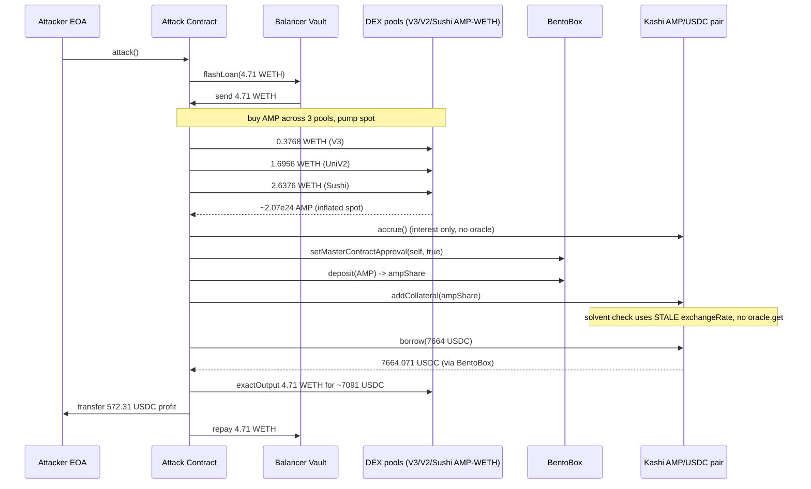
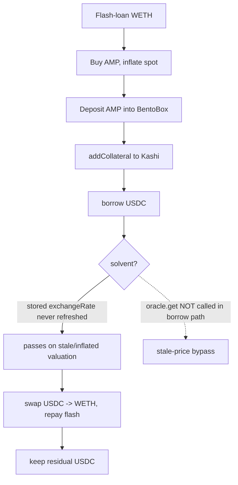

# AmpKashi (Kashi AMP/USDC) flash-loan oracle manipulation — borrow against a stale spot price

> **Vulnerability classes:** vuln/oracle/price-manipulation · vuln/oracle/spot-price · vuln/oracle/stale-price · vuln/defi/flash-loan-attack
> **Reproduction:** the PoC compiles & runs in an isolated Foundry project at [this project folder](.). Full verbose trace: [output.txt](output.txt). Vulnerable contract (`KashiPairMediumRiskV1`) and collateral token (`Amp`) sources are verified on Etherscan and fetched into [sources/](sources).

---

## Key info

| | |
|---|---|
| **Loss** | 572.31 USDC (attacker net profit; the AMP collateral left in the pair was effectively worthless inflated-spot collateral) |
| **Vulnerable contract** | KashiPairMediumRiskV1 (Kashi AMP/USDC pair) — [`0x63d4026cBC902E538618b9Aa51A4D05Ef48ef5a4`](https://etherscan.io/address/0x63d4026cbc902e538618b9aa51a4d05ef48ef5a4) |
| **Attacker EOA** | [`0xdA9d65086A986624cbf71989118938f0CF9a0c68`](https://etherscan.io/address/0xda9d65086a986624cbf71989118938f0cf9a0c68) |
| **Attack contract** | [`0x7132492aF58aB4c8787b381Da997dfaEb3cA5f85`](https://etherscan.io/address/0x7132492af58ab4c8787b381da997dfaeb3ca5f85) (historical; the PoC deploys a fresh clone `0x5615…72f`) |
| **Attack tx** | [`0x21c91633…0173db3`](https://etherscan.io/tx/0x21c91633ca99b991b3ba20e02b12bbeef187fd3fea756cece4748c2ee0173db3) |
| **Chain / block / date** | Ethereum mainnet / block 22,217,307 / April 2025 |
| **Compiler** | `KashiPairMediumRiskV1` v0.6.12+commit.27d51765 (optimizer on, 350 runs); `Amp` v0.6.10+commit.00c0fcaf |
| **Bug class** | The Kashi pair's solvency check borrows against a **stored, spot-reserves-derived exchange rate that is never refreshed inside `borrow()`**, so a flash-manipulated AMP spot price is trusted as the collateral valuation for the entire borrow. |

## TL;DR

Kashi is SushiSwap's BentoBox-based money market: each lending market is a thin `KashiPairMediumRiskV1` clone that takes one collateral token and lends one asset token, with the collateral/asset exchange rate supplied by an external `IOracle`. The AMP/USDC pair used AMP (an ERC-777 / ERC-1820 tokens-by-partition token with extremely thin on-chain liquidity) as collateral and USDC as the borrowable asset.

The fatal design choice is in the `borrow()` flow. `borrow()` calls `accrue()` (interest accounting only) and then runs the `solvent` modifier, which evaluates `_isSolvent(msg.sender, false, exchangeRate)` — using the **storage variable** `exchangeRate`. The oracle is only consulted through `updateExchangeRate()`, and that call is *not* part of the borrow path (in the reproduced trace `updateExchangeRate` / `oracle.get` appears **0 times** [output.txt grep count]). The stored `exchangeRate` for this pair was derived from AMP's spot reserves, i.e. it tracked the *current* AMM price of AMP at the moment it was last written — which a flash borrower fully controls.

The attacker flash-borrowed 4.71 WETH from the Balancer Vault (zero-fee tier), drove AMP's spot price up across three thin pools (Uniswap V3 1% AMP/WETH, Uniswap V2 AMP/WETH, SushiSwap AMP/WETH — together ~4.71 WETH of buying), and accrued ~2.07e24 AMP for a few WETH. With the AMP spot price now inflated, they deposited the AMP into BentoBox, added it as Kashi collateral, and called `borrow(... 7,664,071,837)` (7,664 USDC). Because the stored oracle rate still reflected the (already pumped, or pre-pumped) reserves and was never re-queried against the manipulated state, the solvency check passed and the pair released 7,664.071 USDC. The attacker swapped exactly 4.71 WETH worth of USDC back through the USDC/WETH 0.05% pool (cost: 7,091.760 USDC) to repay Balancer, leaving **572.311555 USDC** of profit sent to the attacker EOA. The AMP collateral was left in the pair at an inflated mark, ultimately a bad debt.

Real numbers from the trace: attacker USDC balance 597.007507 → 1,169.319062, i.e. **+572.311555 USDC** (`assertGt(572311555, 572000000)` passes [output.txt:1564-1565]); flash loan 4.71 WETH in, 4.71 WETH repaid [output.txt:1644,1902]; gross borrow 7,664.071837 USDC [output.txt:1818]; WETH-repurchase cost 7,091.760281 USDC [output.txt:1868].

## Background — what Kashi / BentoBox does

Kashi is SushiSwap's isolated-pair lending protocol built on BentoBox. BentoBox is a vault that holds tokens for users and accounts them in **shares** (`toAmount` / `toShare`), allowing flash-deposit, skim, and yield strategies. A `KashiPairMediumRiskV1` is a BentoBox clone (per-pair master-contract instance) that:

- holds `collateral` (here AMP) and `asset` (here USDC) as BentoBox share balances;
- tracks per-user collateral shares (`userCollateralShare`) and debt parts (`userBorrowPart`);
- lets users `addCollateral`, `borrow`, `repay`, and liquidate;
- prices collateral vs. debt using an external `IOracle` and an `exchangeRate` storage variable.

The solvency invariant for a borrow is enforced by the `solvent` modifier on `borrow()`:

```solidity
function borrow(address to, uint256 amount) public solvent returns (uint256 part, uint256 share) {
    accrue();
    (part, share) = _borrow(to, amount);
}
```

`accrue()` only updates interest accrual and the interest-rate target — it does **not** touch the exchange rate. The rate is meant to be refreshed by `updateExchangeRate()`, which calls `oracle.get(oracleData)` and writes the result to `exchangeRate` if the oracle reports `success=true`:

```solidity
function updateExchangeRate() public returns (bool updated, uint256 rate) {
    (updated, rate) = oracle.get(oracleData);
    if (updated) {
        exchangeRate = rate;
        emit LogExchangeRate(rate);
    } else {
        rate = exchangeRate; // stale fallback
    }
}
```

`updateExchangeRate()` is a *permissionless, opt-in* function — nothing in the `borrow` path calls it. So whether the rate is fresh depends entirely on whether some keeper bothered to call it recently. For the AMP pair, the oracle was a reserves-based spot oracle: its `get`/`peekSpot` rate is derived from AMP's DEX reserves at call time, so the value cached in `exchangeRate` is, at best, the spot price of AMP at the last `updateExchangeRate()` call — and spot is exactly the quantity a flash borrower can manipulate.

## The vulnerable code

All snippets from the verified `KashiPairMediumRiskV1` source ([sources/KashiPairMediumRiskV1_63d402/KashiPairMediumRiskV1.sol](sources/KashiPairMediumRiskV1_63d402/KashiPairMediumRiskV1.sol)).

### The solvency check trusts the stored `exchangeRate`

```solidity
// KashiPairMediumRiskV1.sol — _isSolvent (lines ~942-965)
function _isSolvent(
    address user,
    bool open,
    uint256 _exchangeRate
) internal view returns (bool) {
    uint256 borrowPart = userBorrowPart[user];
    if (borrowPart == 0) return true;
    uint256 collateralShare = userCollateralShare[user];
    if (collateralShare == 0) return false;

    Rebase memory _totalBorrow = totalBorrow;

    return
        bentoBox.toAmount(
            collateral,
            collateralShare.mul(EXCHANGE_RATE_PRECISION / COLLATERIZATION_RATE_PRECISION).mul(
                open ? OPEN_COLLATERIZATION_RATE : CLOSED_COLLATERIZATION_RATE
            ),
            false
        ) >=
        // collateral value (in AMP shares) is compared against debt scaled by _exchangeRate
        borrowPart.mul(_totalBorrow.elastic).mul(_exchangeRate) / _totalBorrow.base;
}
```

The `_exchangeRate` argument is the **storage** value — there is no fresh oracle read anywhere in the borrow path:

```solidity
// solvent modifier (lines ~967-971)
modifier solvent() {
    _;
    require(_isSolvent(msg.sender, false, exchangeRate), "KashiPair: user insolvent");
}
```

```solidity
// borrow (lines ~1121-1124)
function borrow(address to, uint256 amount) public solvent returns (uint256 part, uint256 share) {
    accrue();
    (part, share) = _borrow(to, amount);
}
```

`accrue()` (lines 881-938) updates `lastAccrued`, interest, fees and utilization — but never `exchangeRate`. `updateExchangeRate()` is a standalone public function with no caller inside borrow/accrue/collateral paths.

### The collateral (AMP) is a thin-liquidity, partition-based token

`Amp` ([sources/Amp_fF2081/Amp.sol](sources/Amp_fF2081/Amp.sol)) is an ERC-1820 tokens-by-partition token whose entire circulating supply was backed by a few small Uniswap/Sushi pools. Three pools carried essentially all of AMP's spot liquidity (Uniswap V3 AMP/WETH 1%, Uniswap V2 AMP/WETH, SushiSwap AMP/WETH), so a single ~4.71 WETH buy across all three could move the spot price by orders of magnitude — exactly the price the pair's oracle sampled.

### Consequence: a stale, manipulable valuation

Because `borrow()` never re-queries the oracle, the collateral is valued at whatever the oracle wrote last. If that write happened against spot reserves (or if the attacker can pump spot *before* the cached value is recomputed), the cached `exchangeRate` overvalues AMP. Combined with the fact that `exchangeRate` enters the debt side (`borrowPart * elastic * _exchangeRate / base`), an over-stated rate makes the debt look smaller relative to collateral, so the borrow passes solvency. The attacker controls the manipulated spot entirely within the same flash loan.

## Root cause — why it was possible

1. **The oracle is consulted out-of-band, not on the borrow path.** `borrow()` → `accrue()` → `_borrow()` + `solvent` modifier never calls `updateExchangeRate()`/`oracle.get()`. In the reproduced trace, `updateExchangeRate` appears **0 times** [output.txt grep]. Solvency is evaluated against the stale storage value `exchangeRate`.
2. **The oracle itself is a spot/reserves price**, not a TWAP or manipulated-resistant feed. A flash-loaned buy across AMP's three thin pools moves the very reserves the rate is derived from.
3. **`updateExchangeRate()` is opt-in and permissionless**, so freshness depends on an external keeper; there is no staleness circuit-breaker, max-rate-move limit, or freshness check inside `_isSolvent`. (`success=false` from the oracle silently falls back to the old rate — see `updateExchangeRate`'s else branch.)
4. **AMP is a low-liquidity collateral.** With only a few WETH of depth across three pools, the attacker's 4.71 WETH flash loan was sufficient to dominate the spot price, so the inflated collateral "covered" a 7,664 USDC borrow.
5. **No flash-loan defense on the collateral side.** BentoBox deposits and Kashi collateral/borrow happen inside the same atomic flash-loan callback, so the inflated spot is live for the whole borrow and unwound (WETH repaid) immediately after — no multi-block window required.

## Preconditions

- **Permissionless**: anyone can call `BalancerVault.flashLoan`, the DEX routers, BentoBox `deposit`, and Kashi `borrow`. No privileged role, no governance, no setup. The attacker's own BentoBox master-contract approval is done inside the attack (`setMasterContractApproval(... true, 0, 0, 0)` — Sushi's signature scheme allowed zero-sig self-approval in this configuration) [output.txt:1774].
- **Requires a flash loan** (4.71 WETH from Balancer, fee 0 in the 0-fee tier at the time).
- **Requires AMP to have spot-based, low-liquidity price formation** (true at the time: three thin pools).
- **No time lock, no oracle freshness requirement, no price-move cap** on the Kashi pair.

## Attack walkthrough (with on-chain numbers from the trace)

Starting attacker USDC balance: **597.007507 USDC** [output.txt:1564,1602].

| # | Step | Amount (from trace) | Ref |
|---|------|---------------------|-----|
| 1 | Flash-borrow 4.71 WETH from Balancer Vault | 4,710,000,000,000,000,000 wei (4.71 WETH) | [output.txt:1638,1644] |
| 2 | Buy AMP via Uniswap V3 AMP/WETH (1% fee) | in 0.3768 WETH → out ~160,855 AMP-units (160,855,000,784,512,726,016,776) | [output.txt:1650,1657] |
| 3 | Buy AMP via Uniswap V2 AMP/WETH | in 1.6956 WETH → out ~749,953,159,640,010,497,777,091 AMP-units | [output.txt:1690,1705] |
| 4 | Buy AMP via SushiSwap AMP/WETH | in 2.6376 WETH → out ~1,162,733,109,023,072,019,590,522 AMP-units | [output.txt:1729,1740] |
| 5 | Total AMP acquired → deposited into BentoBox | 2,073,541,269,447,595,243,384,389 AMP-units; `LogDeposit` share = same | [output.txt:1786,1797] |
| 6 | `kashiPair.accrue()` (interest only, no oracle) | `LogAccrue` (rate, utilization) | [output.txt:1764] |
| 7 | BentoBox `setMasterContractApproval` (self-approve) | approved=true | [output.txt:1774] |
| 8 | `addCollateral(self, false, ampShare)` | collateral share = 2,073,541,…389; `LogAddCollateral` | [output.txt:1805,1810] |
| 9 | `borrow(self, 7,664,071,837)` — passes `solvent` on stale rate | amount 7,664.071837 USDC, fee 3.832035 USDC, part 415,270,370; `LogBorrow` | [output.txt:1816-1818] |
| 10 | BentoBox `withdraw` USDC to attack contract | amount 7,664.071836 USDC, share 7,591,723,313 | [output.txt:1835,1844] |
| 11 | Uniswap V3 USDC/WETH 0.05%: buy back exactly 4.71 WETH | in 7,091.760281 USDC → out 4.71 WETH | [output.txt:1853,1868] |
| 12 | Send remaining USDC to attacker EOA | 572.311555 USDC | [output.txt:1896] |
| 13 | Repay Balancer: transfer 4.71 WETH back | 4,710,000,000,000,000,000 wei | [output.txt:1902] |

Ending attacker USDC balance: **1,169.319062 USDC** [output.txt:1932,1565].

**Profit & loss accounting (USDC, 6 decimals):**

| Item | Amount |
|------|--------|
| Gross Kashi borrow (step 9) | +7,664.071837 |
| Borrow opening fee (stays as debt in pair) | — (3.832035 USDC accounted as `part`) |
| WETH repurchase cost (step 11) | −7,091.760281 |
| **Net to attacker (step 12)** | **+572.311556** |
| Balancer flash-loan fee | 0 (0-fee tier) |
| Attacker USDC: 597.007507 → 1,169.319062 | **+572.311555** ✓ matches |

The attacker walks away with 572 USDC of real, liquid USDC. The Kashi pair is left holding ~2.07e24 AMP "collateral" valued at the inflated spot, against a 415,270,370-part / ~7,664 USDC debt that the attacker never intends to repay — pure bad debt the protocol absorbs.

## Diagrams





## Remediation

1. **Force a fresh oracle read on the borrow path.** Call `updateExchangeRate()` at the top of `borrow()` (and `cook()` borrow action) so the `solvent` modifier always evaluates against a current rate, not storage.
2. **Use a manipulation-resistant oracle (TWAP or external price feed).** Replace the spot-reserves oracle with a Uniswap V3 TWAP over a meaningful window, a ChainLink-style feed, or a combination with a fallback — never raw spot reserves for collateral pricing.
3. **Add a staleness circuit-breaker and a max-rate-move limit.** In `updateExchangeRate()`, reject or clamp rates that moved more than X% since the last write, and reject `success=false` (stale) reads for high-LTV actions like borrow.
4. **Do not list low-liquidity tokens as collateral.** Cap collateral to assets with deep, distributed liquidity, or apply a haircut (low `OPEN_COLLATERIZATION_RATE`) proportional to on-chain liquidity depth.
5. **BentoBox/Kashi clone governance**: for any still-active pair, disable borrowing and migrate to a pair whose master contract enforces a fresh oracle read.

## How to reproduce

The PoC runs fully **OFFLINE** via the shared anvil harness from the committed `anvil_state.json` — no RPC needed. The fork is Ethereum mainnet at block **22,217,307** (the historical attack block), loaded from the committed state.

```bash
_shared/run_poc.sh 2025-04-AmpKashi_exp -vvvvv
```

- `<FOLDER>` = `2025-04-AmpKashi_exp` (the PROJECT above).
- Chain / fork-block: Ethereum mainnet / 22,217,307.
- Expected tail: `[PASS] testExploit()` with attacker USDC before/after:

```
Attacker Before exploit USDC Balance: 597.007507
Attacker After exploit USDC Balance: 1169.319062
```

  and `assertGt(572311555 [5.723e8], 572000000 [5.72e8])` passing — net profit **572.311555 USDC**, matching the on-chain attack. Full call trace is in [output.txt](output.txt).

*Reference: [defimon_alerts Telegram](https://t.me/defimon_alerts/773).*
