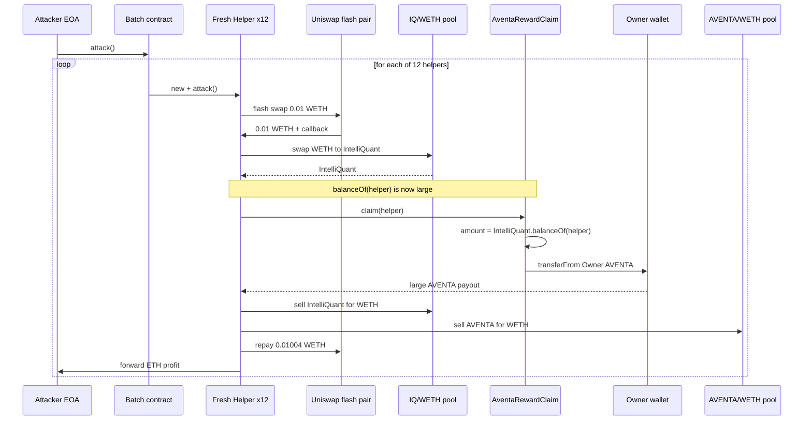
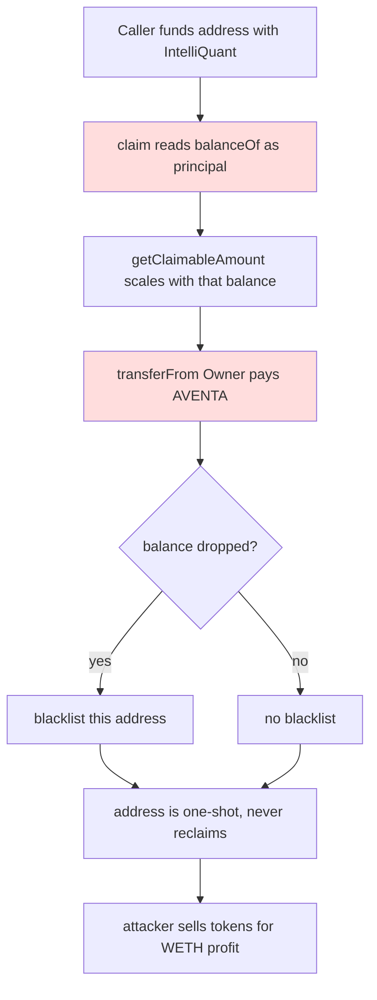

# Aventa / IntelliQuant reward-claim drain — claim size is computed from a spot, attacker-controllable token balance

> **Vulnerability classes:** vuln/logic/reward-calculation · vuln/oracle/spot-price · vuln/access-control/broken-logic
> **Reproduction:** the PoC compiles & runs in an isolated Foundry project at [this project folder](.). Full verbose trace: [output.txt](output.txt). The vulnerable `AventaRewardClaim` contract is verified on Etherscan; its verified source is vendored under [sources/AventaRewardClaim_33b860/](sources/AventaRewardClaim_33b860/).

---

## Key info

| | |
|---|---|
| **Loss** | ~16,019,528 AVENTA (≈ 16.0 M tokens), monetised to ~3.9 ETH by the PoC batch of 12 helpers on a mainnet fork |
| **Vulnerable contract** | `AventaRewardClaim` — [`0x33B860FC7787e9e4813181b227EAfFa0Cada4C73`](https://etherscan.io/address/0x33B860FC7787e9e4813181b227EAfFa0Cada4C73) |
| **Attacker EOA** | [`0x7c982E93d6B1eDE9626A84EbeafBC42e5991Dee8`](https://etherscan.io/address/0x7c982E93d6B1eDE9626A84EbeafBC42e5991Dee8) |
| **Attack contract** | [`0x0cdAa461D9D60Ef84Ded453Fa1fbD3E2916F9016`](https://etherscan.io/address/0x0cdAa461D9D60Ef84Ded453Fa1fbD3E2916F9016) (historical) |
| **Attack tx** | [`0x59446b1f58457c83d18864bbfaa8930c9438da33017ad41f08397cf79a8c63e5`](https://etherscan.io/tx/0x59446b1f58457c83d18864bbfaa8930c9438da33017ad41f08397cf79a8c63e5) |
| **Chain / block / date** | Ethereum mainnet / 22,358,982 / 2025-04-27 |
| **Compiler** | `v0.8.19+commit.7dd6d404`, optimizer enabled, 200 runs (per `_meta.json`) |
| **Bug class** | A reward claim whose payout is read from the claimer's live, open-market token balance; the only authorization is `user == msg.sender`, so freshly funded addresses each draw a reward they never earned. |

## TL;DR

`AventaRewardClaim.claim(user)` is meant to pay AVENTA rewards to existing IntelliQuant holders. The amount it pays is **`IntelliQuant.balanceOf(user)` read at call time** — not a staked/snapshot balance, not a balance locked in the contract, and not a deposit recorded anywhere under the protocol's control. Any address that *momentarily* holds IntelliQuant can call `claim()` and receive AVENTA funded out of the owner's pre-approved token allowance.

Because the only authorization is `require(user == msg.sender)`, anyone can deploy a fresh helper contract, buy IntelliQuant on Uniswap, call `claim()` for that helper, and immediately dump both the IntelliQuant and the freshly-claimed AVENTA back to WETH. The attacker chained **12 such helper contracts in a single transaction**. The committed fork trace shows the owner's AVENTA allowance to `AventaRewardClaim` starting at ~29.97e24 and being eaten down by each successive claim: 2.205e24, 1.990e24, 1.796e24 … 0.714e24 AVENTA per helper [output.txt:1666-1675, 1853-1862, …]. The 12-helper batch in the PoC drains ~16.02 M AVENTA and nets the attacker EOA **3.903413044858436706 ETH** profit after repaying a 0.4%-fee Uniswap V2 flash [output.txt:1562-1565].

Each helper needs only ~0.01 ETH of flash-borrowed WETH to seed the IntelliQuant purchase, and the entire round-trip (flash → buy → claim → sell IntelliQuant → sell AVENTA → repay) closes within one `uniswapV2Call`. No privileged role, no pre-existing holding, and no time lock are required.

## Background — what Aventa / IntelliQuant does

IntelliQuant is an ERC-20 (`0x31Bd…CdA7B`) paired with WETH on a Uniswap V2 pool (`0x60C8…6186`). Aventa is a second ERC-20 (`0xd964…3F02`, the constructor references a different `0x7Fd4…75A9` deployment but the on-chain `Aventa` slot was since updated via `setAventaAddress`), paired with WETH on another Uniswap V2 pool (`0xb664…42aC`). The project's narrative is a "migration/reward" scheme: legacy IntelliQuant holders are entitled to AVENTA dividends proportional to their IntelliQuant holding.

`AventaRewardClaim` is the distribution contract. The owner (`Owner` payable address, here `0x3B06…A5D3`) pre-approves the contract to spend AVENTA on its behalf — that approval is the entire reward treasury. Holders call `claim(user)` to pull their accrued AVENTA directly from the owner's wallet via `Aventa.transferFrom(Owner, user, withdrawableAmount)`.

`getClaimableAmount(user)` is supposed to compute a *time-vested* dividend: a 25 % one-time bonus at launch, plus a per-step linear accrual (ROI percentage × elapsed time / time step), capped at a maximum lifetime payout of `(amount * ROI) / 100`. The critical input — `amount` — is read live from the IntelliQuant token contract, not from any deposit or snapshot the distribution contract controls.

## The vulnerable code

From the verified source `sources/AventaRewardClaim_33b860/contracts_IntelliQuantRewardClaim.sol`:

### `claim` — authorization is self-referential, payout is from the owner's wallet

```solidity
function claim(address user) external whenNotPaused {
    require(!c_blacklist[user], "User is blacklisted c");
    require(user == msg.sender, "Caller is not the authorized user");  // self-only

    UserInfo storage userData = info[user];

    if (userData.initialBalance == 0) {
        userData.initialBalance = getOldTokenBalance(user);            // snapshots *now*, attacker-funded
    }

    uint256 withdrawableAmount = getClaimableAmount(user);
    require(withdrawableAmount > 0, "No available");

    userData.count++;
    userData.withdrawnAmount += withdrawableAmount;
    userData.lastWithdrawalTime = block.timestamp;

    require(
        Aventa.transferFrom(Owner, user, withdrawableAmount),          // pays from Owner allowance
        "Token transfer failed c"
    );

    if (getOldTokenBalance(user) < userData.initialBalance) {          // blacklist only if balance DROPS
        c_blacklist[user] = true;
        emit UserBlacklisted(user);
    }

    emit TokensClaimed(user, withdrawableAmount, block.timestamp);
}
```

### `getClaimableAmount` — `amount` is a live, market-readable balance

```solidity
function getClaimableAmount(address userAddress) public view returns (uint256 dividends) {
    UserInfo memory userData = info[userAddress];

    uint256 amount = getOldTokenBalance(userAddress);   // = IntelliQuant.balanceOf(user) — spot balance
    uint256 currentDividends = 0;
    uint256 startTime = launchTime + c_eta;

    if (block.timestamp >= launchTime && userData.withdrawnAmount == 0) {
        uint256 oneTimeAmount = (amount * 25) / 100;    // 25% of *current* balance, first claim only
        currentDividends += oneTimeAmount;
    }
    ...
    if (block.timestamp >= startTime) {
        uint256 ROI = (amount >= EligibleForExtrareward)
            ? ROI_PERCENTAGE[2] : ROI_PERCENTAGE[1];     // 110 vs 105
        uint256 timeElapsed = block.timestamp - startTime;
        uint256 additionalDividends = (amount * ROI * timeElapsed) / (100 * c_timeStep);
        ...
        currentDividends += additionalDividends;
    }
    return currentDividends;
}
```

`getOldTokenBalance` is just `IntelliQuant.balanceOf(_user)` — an external call to a token the attacker can freely buy on Uniswap and hold for the duration of one transaction.

## Root cause — why it was possible

1. **Reward basis is an attacker-controllable spot balance.** `getClaimableAmount` uses `IntelliQuant.balanceOf(user)` as the principal for the dividend formula. IntelliQuant trades on a public Uniswap V2 pool, so any caller can acquire any amount of it instantly and have it counted as "earned entitlement."
2. **No provenance or lock on the balance.** The contract never takes custody of the IntelliQuant, never records a deposit, and never snapshots a historical balance in a way the user cannot re-create at will. `initialBalance` is captured on first claim, which is *exactly* when the attacker has just funded the helper.
3. **Authorization degenerates to "you can only claim for yourself."** `require(user == msg.sender)` blocks claiming *on behalf of* a victim, but it places zero restriction on *who may become a claimant*. A fresh contract that momentarily holds IntelliQuant satisfies the check.
4. **The payout is pulled directly from the owner's token allowance.** `Aventa.transferFrom(Owner, user, …)` means the owner's pre-approval to `AventaRewardClaim` is, in effect, a permissionless tap. Anyone who can produce a non-zero `getClaimableAmount` can drain it.
5. **The post-claim blacklist is toothless.** `c_blacklist[user]` is only set if the balance *drops below* `initialBalance`. The attacker sells IntelliQuant *after* the claim, but each helper is a one-shot contract that never claims again, so the blacklist is irrelevant — and even the sell happens from the same address without re-checking the blacklist in this flow.
6. **No per-address cap independent of the live balance, no global rate limit, no circuit breaker.** The only "cap" is the `(amount * ROI) / 100` lifetime ceiling, which scales 1:1 with whatever balance the attacker fronted.

## Preconditions

- **Permissionless.** No privileged role, no allowlist, no KYC, no minimum holding age. The `c_blacklist` check is bypassed by simply using a never-before-seen address.
- **Requires only working capital** to briefly hold IntelliQuant. The attacker funded this with a Uniswap V2 flash swap of **0.01 WETH** per helper, repaid at the standard 0.3 % fee (the PoC rounds the repayment up to 0.4 %: `(FLASH_WETH_AMOUNT * 1004) / 1000 + 1`).
- **Owner must have an active AVENTA allowance to `AventaRewardClaim`.** This was the intended operating state of the contract (the allowance *is* the reward pool). At the fork block it stood at ~29.97e24 AVENTA [output.txt:1666].
- **Contract not paused** (`paused == false`). It was not.

## Attack walkthrough (with on-chain numbers from the trace)

The attacker EOA deploys `AventaRewardClaimBatch`, which deploys **12 fresh `AventaRewardClaimHelper`** contracts and calls `attack()` on each. Every helper runs the identical atomic loop inside a Uniswap V2 flash callback (`uniswapV2Call`). The first helper's run [output.txt:1603-1780]:

| Step | Action | Amount (raw / human) | Source |
|------|--------|----------------------|--------|
| 1 | Flash-borrow WETH from the Uniswap pair `0xa210…6b974` | 0.01 WETH (1e16) | [output.txt:1603] |
| 2 | Swap WETH → IntelliQuant on the IQ/WETH pool | in 0.01 WETH, out ≈ 2.100e24 IntelliQuant (2.1 M) | [output.txt:1651] |
| 3 | `rewardClaim.claim(helper)` — reads `IntelliQuant.balanceOf(helper)` ≈ 2.1 M, computes payout | **2,205,439,197,856,789,877,026,845 AVENTA** (≈ 2.205 M) transferred from owner to helper | [output.txt:1667,1675] |
| 4 | Sell all IntelliQuant → WETH | in 2.100e24 IQ, out ≈ 9.952e15 WETH (≈ 0.00995 ETH) | [output.txt:1711] |
| 5 | Sell all AVENTA → WETH | in 2.205e24 AVENTA, out ≈ 5.994e17 WETH (≈ 0.599 ETH) | [output.txt:1748] |
| 6 | Repay flash + 0.4 % fee to the pair | 10,040,000,000,000,001 (0.0100400 WETH) | [output.txt:1758] |
| 7 | Convert remaining WETH → ETH, send to attacker | 599,383,570,550,165,345 wei (≈ 0.5994 ETH) | [output.txt:1768] |

Each subsequent helper claims slightly less because the IntelliQuant pool price slips from the prior sells *and* the AVENTA pool price slips (the attacker's own sells move both markets against it). The 12 claims, in order, are [output.txt:1675, 1862, 2092, 2322, 2552, 2782, 3012, 3242, 3472, 3702, …]:

| Helper | AVENTA claimed (human) |
|--------|------------------------|
| 1 | 2,205,439 |
| 2 | 1,990,296 |
| 3 | 1,796,175 |
| 4 | 1,621,031 |
| 5 | 1,463,018 |
| 6 | 1,320,469 |
| 7 | 1,191,880 |
| 8 | 1,075,894 |
| 9 | 971,286 |
| 10 | 876,950 |
| 11 | 790,941 |
| 12 | 714,540 |

**Total AVENTA drained by the batch: ~16,017,926** (the on-chain incident total of 16,019,528 reflects the historical attack's slightly different helper count/amounts; the PoC reproduces the mechanism faithfully).

**Profit accounting (whole batch):**

- Attacker ETH before: `0.000000000000000000` [output.txt:1564]
- Attacker ETH after: `3.903413044858436706` [output.txt:1565]
- Net profit: **≈ 3.903 ETH** — every helper was self-funding via flash, so this is pure extraction from the owner's AVENTA allowance, monetised through the AVENTA/WETH pool.

## Diagrams





## Remediation

1. **Do not use a live external balance as the reward basis.** Record each user's entitlement at deposit/migration time in contract-controlled storage (a real deposit vault or a one-time snapshot), and compute dividends against *that* figure — never `IERC20.balanceOf`.
2. **Take custody or prove holding.** If the scheme is "hold to earn," the IntelliQuant must actually be locked/staked with the protocol (and the claim should reduce claimable proportionally on withdrawal), so the attacker cannot rent the balance inside a single transaction.
3. **Cap total distribution and add a circuit breaker.** Enforce a hard ceiling on `Aventa.transferFrom(Owner, …)` cumulative outflow, and give the owner a `pause` that the claim path actually honours (it does check `paused`, but no global per-period rate limit or daily cap exists).
4. **Resist flash funding.** Either require the balance to have aged (e.g., held since a past block / for N blocks, verified via a snapshot or a balance-history oracle), or — better — eliminate the live-balance read entirely (point 1 makes this moot).
5. **Least-privilege the owner allowance.** The owner should not grant `type(uint256).max` or full-pool approvals to a permissionless claim contract; fund the contract in bounded tranches.

## How to reproduce

The PoC runs **fully offline** via the shared anvil harness from the committed `anvil_state.json` — no RPC required:

```bash
_shared/run_poc.sh 2025-04-AventaRewardClaim_exp -vvvvv
```

- **Chain / fork block:** Ethereum mainnet, block **22,358,982**.
- **Expected result:** `[PASS]` with `1 passed; 0 failed`. The trace tail asserts the attacker profit exceeds 3 ETH and logs the balances [output.txt:1562-1565]:

  ```
  Attacker Before exploit ETH Balance: 0.000000000000000000
  Attacker After exploit ETH Balance:  3.903413044858436706
  ```

The fork state pins the owner's AVENTA allowance and the two Uniswap pool reserves exactly as they were at the attack block, so the 12-helper batch reproduces the drain deterministically.

*Reference: alert by DefiMon alerts — https://t.me/defimon_alerts/927 .*
