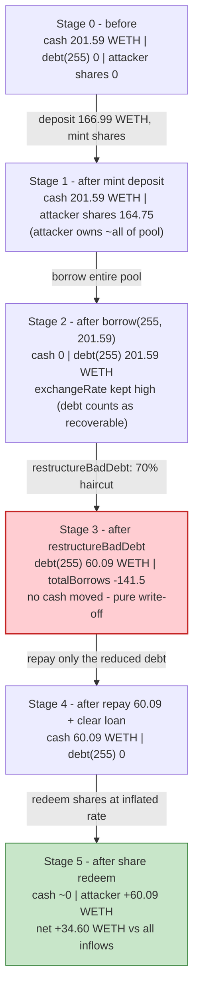
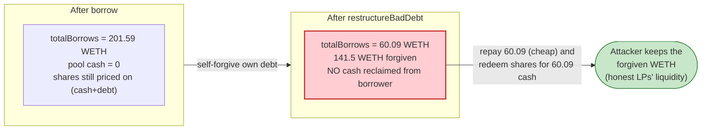

# Impermax V3 Exploit — Self-Liquidation Debt Wipe via `restructureBadDebt`

> **Reproduction:** the PoC compiles & runs in an isolated Foundry project at
> [this project folder](.) (the umbrella DeFiHackLabs repo does not whole-compile,
> so this PoC was extracted into a standalone project).
> Full verbose trace: [output.txt](output.txt).
> Verified vulnerable sources: [ImpermaxV3Collateral.sol](sources/ImpermaxV3Collateral_c1D49f/ImpermaxV3Collateral.sol),
> [ImpermaxV3Borrowable.sol](sources/ImpermaxV3Borrowable_5d93f2/ImpermaxV3Borrowable.sol),
> [TokenizedUniswapV3Position.sol](sources/TokenizedUniswapV3Position_a68F60/TokenizedUniswapV3Position.sol).

---

## Key info

| | |
|---|---|
| **Loss** | ~$300k total (per QuillAudits / SlowMist). This single reproduced run nets **34.60 WETH ≈ $62.6k** from the WETH pool (the live attack repeated/scaled the same primitive across pools). |
| **Vulnerable contracts** | `ImpermaxV3Collateral` — [`0xc1D49fa32d150B31C4a5bf1Cbf23Cf7Ac99eaF7d`](https://basescan.org/address/0xc1D49fa32d150B31C4a5bf1Cbf23Cf7Ac99eaF7d#code) (`restructureBadDebt`) and `ImpermaxV3Borrowable` — [`0x5d93f216f17c225a8B5fFA34e74B7133436281eE`](https://basescan.org/address/0x5d93f216f17c225a8B5fFA34e74B7133436281eE#code) (`exchangeRate`/`restructureDebt`) |
| **Victim pool** | Impermax V3 WETH/USDC lending market on Uniswap V3 WETH/USDC 0.002% pool ([`0x1C450D7d1FD98A0b04E30deCFc83497b33A4F608`](https://basescan.org/address/0x1C450D7d1FD98A0b04E30deCFc83497b33A4F608)) |
| **Position tokenizer** | `TokenizedUniswapV3Position` — [`0xa68F6075ae62eBD514d1600cb5035fa0E2210ef8`](https://basescan.org/address/0xa68F6075ae62eBD514d1600cb5035fa0E2210ef8) |
| **Attacker EOA** | [`0xe3223f7e3343c2c8079f261d59ee1e513086c7c3`](https://basescan.org/address/0xe3223f7e3343c2c8079f261d59ee1e513086c7c3) |
| **Attack contract** | [`0x98e938899902217465f17cf0b76d12b3dca8ce1b`](https://basescan.org/address/0x98e938899902217465f17cf0b76d12b3dca8ce1b) |
| **Attack tx** | [`0xde903046b5cdf27a5391b771f41e645e9cc670b649f7b87b1524fc4076f45983`](https://basescan.org/tx/0xde903046b5cdf27a5391b771f41e645e9cc670b649f7b87b1524fc4076f45983) |
| **Chain / block / date** | Base / 29,437,439 / 26 April 2025, 10:43 UTC |
| **Compiler** | Solidity v0.5.16, optimizer 999,999 runs |
| **Bug class** | Self-induced bad-debt restructuring + share/debt accounting asymmetry (lender == borrower) |

---

## TL;DR

Impermax V3 lets you deposit ERC-20s into a `Borrowable` pool (you get pool shares whose value
is `(cash + outstandingDebt) / totalSupply`) and borrow against a tokenized Uniswap V3 LP NFT held
in a `Collateral` contract. The protocol has a `restructureBadDebt(tokenId)`
([ImpermaxV3Collateral.sol:982](sources/ImpermaxV3Collateral_c1D49f/ImpermaxV3Collateral.sol#L982))
function that, for any *underwater* position, **forgives the borrower's debt down to its collateral
ratio** — meant to socialise losses on genuinely insolvent loans.

The attacker became **both the only meaningful lender and the only borrower** in the same WETH
market, in one flash-loan-funded transaction:

1. **Pre-deposit** 166.99 WETH into the `Borrowable` via `mint()`, receiving 164.75 WETH of pool
   shares — the attacker now owns essentially the entire lending pool.
2. **Open a self-owned LP position** and **inflate its collateral valuation** by running 100+ wash
   swaps through the underlying Uniswap V3 pool. The position's reported collateral counts *accrued,
   un-reinvested Uni-V3 fees at full weight*, so the wash-traded fees pumped the position's apparent
   value enough to borrow against.
3. **Borrow the entire pool** — `borrow(255, …, 201.59 WETH)` drains all cash out of the `Borrowable`
   (cash → 0), but the loan still counts toward `exchangeRate` as `outstandingDebt`, so shares keep
   their value.
4. **`restructureBadDebt(255)`** — the position is now underwater, so the protocol **writes the
   attacker's own 201.59 WETH debt down to 60.09 WETH** (a ~70% haircut) — and **only `totalBorrows`
   is decremented; no cash is repaid**.
5. **Repay the reduced 60.09 WETH debt, redeem the LP, then redeem the pool shares.** The shares
   redeem for 60.09 WETH at the still-inflated exchange rate. Net of the round-trip, the attacker
   keeps the **difference between what they borrowed and what they had to repay after the haircut**.

Because the debt write-off and the share redemption both draw on the *same* pool cash but the
haircut never removed real assets from the lender side, the attacker walks off with ≈ 34.60 WETH of
honest depositors' liquidity. Everything is funded by Morpho flash loans (WETH + USDC) repaid in the
same tx, so the attacker risks ~zero capital.

---

## Background — what Impermax V3 does

Impermax V3 is a leveraged-LP / lending protocol. Each market has three core contracts:

- **`TokenizedUniswapV3Position`** ([source](sources/TokenizedUniswapV3Position_a68F60/TokenizedUniswapV3Position.sol)) —
  wraps a Uniswap V3 LP range into an ERC-721. `getPositionData()` returns the position's
  `realX`/`realY` token amounts at lowest/current/highest price **plus the accrued Uni-V3 fees**.
- **`ImpermaxV3Borrowable`** ([source](sources/ImpermaxV3Borrowable_5d93f2/ImpermaxV3Borrowable.sol)) —
  an ERC-20 lending pool ("PoolToken"). Lenders `mint()` shares; the share price is
  `exchangeRate = (totalBalance + totalBorrows) * 1e18 / totalSupply`
  ([:1009-1015](sources/ImpermaxV3Borrowable_5d93f2/ImpermaxV3Borrowable.sol#L1009-L1015)) — i.e. **outstanding
  debt counts as if fully recoverable**. Borrowers `borrow()` against a collateral NFT.
- **`ImpermaxV3Collateral`** ([source](sources/ImpermaxV3Collateral_c1D49f/ImpermaxV3Collateral.sol)) —
  custodies the LP NFT, decides `canBorrow()`/`isLiquidatable()` from a Chainlink-backed V3 oracle
  price, and exposes `restructureBadDebt()`.

The prices used for collateral valuation come from a **Chainlink oracle**, not a spot price
(`oraclePriceSqrtX96` → `IV3Oracle(oracle)`,
[TokenizedUniswapV3Position.sol:1361-1363](sources/TokenizedUniswapV3Position_a68F60/TokenizedUniswapV3Position.sol#L1361-L1363));
the trace shows `latestAnswer()` reads of 1809.69 for WETH and 1.00001 for USDC). So this is **not an
oracle-manipulation attack** — the price was honest. The exploit lives entirely in the
share/debt accounting and the fee-weighted collateral valuation.

---

## The vulnerable code

### 1. `restructureBadDebt` — forgive an underwater position's debt (callable by anyone)

```solidity
// ImpermaxV3Collateral.sol
function restructureBadDebt(uint tokenId) external nonReentrant {
    CollateralMath.PositionObject memory positionObject = _getPositionObject(tokenId);
    uint postLiquidationCollateralRatio = positionObject.getPostLiquidationCollateralRatio();
    require(postLiquidationCollateralRatio < 1e18, "ImpermaxV3Collateral: NOT_UNDERWATER");
    IBorrowable(borrowable0).restructureDebt(tokenId, postLiquidationCollateralRatio);
    IBorrowable(borrowable1).restructureDebt(tokenId, postLiquidationCollateralRatio);

    blockOfLastRestructureOrLiquidation[tokenId] = block.number;
    emit RestructureBadDebt(tokenId, postLiquidationCollateralRatio);
}
```
[ImpermaxV3Collateral.sol:982-992](sources/ImpermaxV3Collateral_c1D49f/ImpermaxV3Collateral.sol#L982-L992)

`getPostLiquidationCollateralRatio = collateralValue / (debtValue * liquidationPenalty)`
([:866-870](sources/ImpermaxV3Collateral_c1D49f/ImpermaxV3Collateral.sol#L866-L870)). Once the
attacker borrowed the whole pool, the debt value exceeded the position's penalty-adjusted collateral,
so the ratio fell below `1e18` and `restructureBadDebt` became callable on the attacker's *own* loan.

### 2. `restructureDebt` — decrements debt accounting only, never moves cash

```solidity
// ImpermaxV3Borrowable.sol
function restructureDebt(uint tokenId, uint reduceToRatio) public nonReentrant update accrue {
    require(msg.sender == collateral, "ImpermaxV3Borrowable: UNAUTHORIZED");
    require(reduceToRatio < 1e18, "ImpermaxV3Borrowable: NOT_UNDERWATER");

    uint _borrowBalance = borrowBalance(tokenId);
    if (_borrowBalance == 0) return;
    uint repayAmount = _borrowBalance.sub(_borrowBalance.mul(reduceToRatio).div(1e18));
    (uint accountBorrowsPrior, uint accountBorrows, uint _totalBorrows) =
        _updateBorrow(tokenId, 0, repayAmount);   // ⚠️ decreases principal + totalBorrows; no token transfer
    ...
}
```
[ImpermaxV3Borrowable.sol:1103-1113](sources/ImpermaxV3Borrowable_5d93f2/ImpermaxV3Borrowable.sol#L1103-L1113)

The haircut reduces both the position's `principal` and the global `totalBorrows`
([:1046-1060](sources/ImpermaxV3Borrowable_5d93f2/ImpermaxV3Borrowable.sol#L1046-L1060)) — but the
forgiven WETH is *never reclaimed from the borrower*. It is simply written off the books.

### 3. Share price treats outstanding debt as fully recoverable

```solidity
// ImpermaxV3Borrowable.sol
function exchangeRate() public accrue returns (uint) {
    uint _totalSupply = totalSupply;
    uint _actualBalance = totalBalance.add(totalBorrows);   // ⚠️ cash + debt
    if (_totalSupply == 0 || _actualBalance == 0) return initialExchangeRate;
    uint _exchangeRate = _actualBalance.mul(1e18).div(_totalSupply);
    return _mintReserves(_exchangeRate, _totalSupply);
}
```
[ImpermaxV3Borrowable.sol:1009-1015](sources/ImpermaxV3Borrowable_5d93f2/ImpermaxV3Borrowable.sol#L1009-L1015)

### 4. Collateral valuation counts un-reinvested Uniswap V3 fees at full weight

```solidity
// TokenizedUniswapV3Position.sol — getPositionData()
(uint256 feeCollectedX, uint256 feeCollectedY) = _getFeeCollected(position, pool);
...
realXYs.currentPrice.realX += feeCollectedX;   // ⚠️ full (un-weighted) fee added to current-price collateral
realXYs.currentPrice.realY += feeCollectedY;
```
[TokenizedUniswapV3Position.sol:1391-1414](sources/TokenizedUniswapV3Position_a68F60/TokenizedUniswapV3Position.sol#L1391-L1414)

`feeCollected` is `(feeGrowthInsideNow - feeGrowthInsideSnapshot) * liquidity / 2^128`
([:1368-1377](sources/TokenizedUniswapV3Position_a68F60/TokenizedUniswapV3Position.sol#L1368-L1377)). By
wash-trading through the pool the attacker pumps `feeGrowthInside`, inflating the position's
*current-price* collateral value (used by `canBorrow`) so the loan passes the borrow check.

---

## Root cause — why it was possible

The protocol assumed `restructureBadDebt` would only ever be used on **third-party** insolvent loans,
socialising the loss across lenders who are *different actors* than the borrower. Two design facts
break that assumption:

1. **Lender and borrower are not separated, and `restructureBadDebt` is permissionless.** Nothing
   stops one actor from being the dominant lender (owning most of `totalSupply`) *and* the borrower of
   a self-crafted position. By forgiving its own debt, the attacker shifts value from the lender pool
   (which it owns the shares of) into its own pocket as the borrower — but because it owns the shares,
   it captures the "socialised loss" itself, twice.

2. **The debt write-off is purely an accounting decrement, while shares still redeem at
   `(cash + debt)/supply`.** When the attacker borrows the whole pool, `totalBalance → 0` and
   `totalBorrows → 201.59 WETH`, so shares keep their value. After `restructureDebt` writes
   `totalBorrows` down by ~141 WETH *without any cash leaving the borrower*, the only thing the
   attacker has to repay to clear the loan is the reduced 60.09 WETH. It then redeems its shares for
   60.09 WETH of real cash. The net effect: the attacker borrowed 201.59 WETH, kept the forgiven
   ~141 WETH on the books as gone, repaid only 60.09 WETH, and still redeemed 60.09 WETH of pool
   cash — pocketing the gap.

The Uni-V3 fee inflation (item 4 above) is the *enabler* that lets a thinly-funded LP position borrow
the whole pool in the first place; the **value extraction** is the self-restructure + share-redeem
asymmetry.

In short: **`restructureBadDebt` lets a borrower who is also a lender mint a "loss" out of thin air
and then collect that loss as a lender** — a closed-loop, self-liquidation debt wipe.

---

## Preconditions

- A flash-loan source for the deposit + borrow working capital. The attacker used **Morpho**
  flash loans for both 10,544.81 WETH and 22,539,727.99 USDC, repaid in the same tx (0 fee).
- The market's `restructureBadDebt` is reachable and the position can be pushed underwater
  (`postLiquidationCollateralRatio < 1e18`). Borrowing the entire pool against a fee-inflated position
  achieves this.
- A Uniswap V3 pool with non-trivial liquidity to wash-trade through so the LP position accrues enough
  fees to pass `canBorrow`. (Fees paid on wash trades are tiny relative to the pool drained.)
- The attacker owns the bulk of the lending pool shares (achieved by pre-depositing 166.99 WETH).

No special privileges, no oracle manipulation, no admin keys.

---

## Attack walkthrough (with on-chain numbers from the trace)

All figures are taken directly from [output.txt](output.txt). WETH = 18 dec, USDC = 6 dec.
`tokenId = 255`. The Borrowable WETH market is `0x5d93…`; the underlying Uni-V3 pool is `0x1C45…`.

| # | Step | Trace evidence | Effect |
|---|------|----------------|--------|
| 0 | **Flash-loan WETH** 10,544.81 WETH from Morpho; re-enter `onMorphoFlashLoan` and **flash-loan USDC** 22,539,727.99 USDC | [output.txt:21-47](output.txt#L21) | Working capital, repaid at the very end. |
| 1 | **Seed the Uni-V3 pool & build the LP**: `swap` 1,000 USDC→WETH; `pool.mint(-196216,-102028, 3.315e15 liq)`; `Position.mint()` → tokenId 255; `transferFrom` NFT → Collateral; `Collateral.mint(255)` | [output.txt:48-190](output.txt#L48) | Attacker now owns a self-crafted LP collateral position. |
| 2 | **Wash-trade 100+ times** through `0x1C45…` (`swap` true ↔ false, ±19.4k–400k units each), plus `Position.reinvest(255)` | [ImpermaxV3_exp.sol:69-114](test/ImpermaxV3_exp.sol#L69-L114) | Inflates the position's accrued Uni-V3 fees → inflated `getPositionData` collateral value. |
| 3 | **Pre-deposit as a lender**: `WETH.transfer(0x5d93…, 166.988 WETH)` then `Borrowable.mint()` → **164.75 WETH of pool shares** | [output.txt:6049-6077](output.txt#L6049) | Attacker owns essentially the whole WETH lending pool. `AccrueInterest` shows `totalBorrows = 76.01 WETH`, pool cash `= 201.59 WETH`. |
| 4 | **Borrow the entire pool**: `Borrowable.borrow(255, attacker, 201.595 WETH)` | [output.txt:6080-6147](output.txt#L6080) | Pool cash → **0**; `canBorrow` passes thanks to the fee-inflated collateral. Loan recorded as `totalBorrows`. |
| 5 | **`Collateral.restructureBadDebt(255)`** → `Borrowable.restructureDebt(255, 0.298e18)` | [output.txt:6257-6321](output.txt#L6257) | `postLiquidationCollateralRatio = 0.298…` (< 1e18). Debt **written down from 201.595 → 60.090 WETH** (≈70% haircut). **No cash returned.** |
| 6 | **Repay reduced debt**: `WETH.transfer(0x5d93…, 60.090 WETH)`, then `borrow(255, …, 0)` to settle | [output.txt:6322-6347](output.txt#L6322) | Loan principal cleared by repaying only the haircut amount. |
| 7 | **Redeem the LP**: `Collateral.redeem(…,255,1e18)` + `Position.redeem(…,255)` | [output.txt:6348-6396](output.txt#L6348) | Burns the LP, returns the underlying liquidity back to the attacker. |
| 8 | **Redeem the lender shares**: `Borrowable.transfer(self, 120.92 shares)` then `Borrowable.redeem()` → **60.090 WETH** | [output.txt:6487-6512](output.txt#L6487) | Shares redeem at the inflated exchange rate; `redeemAmount = 60.090323368960112162 WETH`. |
| 9 | **Final clean-up swap** on the 0.05% pool (`0xd0b5…`), then **repay both Morpho flash loans** | [output.txt:6514-6566](output.txt#L6514) | USDC flash loan repaid in full (only 20,000 wei USDC dust left); WETH flash loan repaid; attacker keeps the WETH surplus. |

### Borrowable WETH accounting (the core of the theft)

| Quantity | WETH |
|---|---:|
| Pre-deposited (mint)        | 166.988030575033714385 |
| Borrowed (whole pool)       | 201.595425653150513986 |
| Debt after `restructureBadDebt` | 60.090323578407036263 |
| Repaid to clear loan        | 60.090323578407036263 |
| Redeemed for shares         | 60.090323368960112162 |
| **Net out of Borrowable** = borrowed − predeposit − repaid + redeemed | **≈ +34.61** |

The ~70% debt haircut (≈ 141.5 WETH forgiven) is the value the attacker created; the share redemption
lets it collect the pool's residual cash on top, netting roughly the difference.

### Profit accounting

| Asset | Net to attacker |
|---|---:|
| WETH (final balance, after repaying both flash loans) | **34.596457749437561713 WETH** |
| USDC | +0.020000 USDC (dust) |

At the trace's Chainlink WETH price of **$1,809.69**, that is **≈ $62.6k** from this WETH-pool run.
QuillAudits/SlowMist report the full incident at **~$300k** — the live attack applied the same
self-restructure primitive at larger size / across the paired pools.

---

## Diagrams

### Sequence of the attack

```mermaid
sequenceDiagram
    autonumber
    actor A as Attacker contract
    participant M as Morpho
    participant U as UniV3 pool 0x1C45
    participant P as TokenizedPosition
    participant C as ImpermaxV3Collateral
    participant B as ImpermaxV3Borrowable WETH

    A->>M: flashLoan 10,544.81 WETH
    M-->>A: WETH
    A->>M: flashLoan 22,539,727.99 USDC (nested)
    M-->>A: USDC

    rect rgb(255,243,224)
    Note over A,P: Step 1-2 build & inflate self-owned LP
    A->>U: mint LP range + 100x wash swaps
    A->>P: Position.mint() -> tokenId 255
    A->>C: transfer NFT + Collateral.mint(255)
    Note over P: accrued Uni-V3 fees inflate getPositionData value
    end

    rect rgb(232,245,233)
    Note over A,B: Step 3 become the dominant lender
    A->>B: transfer 166.99 WETH + mint()
    B-->>A: 164.75 WETH of pool shares
    Note over B: cash 201.59 WETH / totalBorrows 76.01
    end

    rect rgb(227,242,253)
    Note over A,B: Step 4 borrow the whole pool
    A->>B: borrow(255, 201.595 WETH)
    B->>C: canBorrow(255) -> true (fee-inflated collateral)
    B-->>A: 201.595 WETH
    Note over B: cash -> 0; debt = 201.595 WETH
    end

    rect rgb(255,235,238)
    Note over A,C: Step 5 the exploit - forgive own debt
    A->>C: restructureBadDebt(255)
    C->>B: restructureDebt(255, 0.298e18)
    Note over B: debt 201.595 -> 60.090 WETH (no cash returned)
    end

    rect rgb(243,229,245)
    Note over A,B: Step 6-8 settle cheap, redeem everything
    A->>B: repay 60.090 WETH + borrow(255,0) to clear
    A->>C: redeem(255) + Position.redeem(255)
    A->>B: redeem() shares -> 60.090 WETH
    end

    A->>M: repay USDC + WETH flash loans
    Note over A: keeps +34.60 WETH (honest depositors' liquidity)
```

### Borrowable state evolution (WETH market)



### Where the value leaks (debt-vs-cash asymmetry)



---

## Why each magic number

- **`borrowWETH_amount = 10,544.81 WETH` / `borrowUSDC_amount = 22,539,727.99 USDC`** — Morpho flash-loan
  sizes chosen to cover (a) the 166.99 WETH lender pre-deposit, (b) the WETH used to seed/wash-trade the
  Uni-V3 LP and pay swap fees, and (c) the USDC used in the wash trades. Both are repaid in full at the end.
- **100-iteration wash-swap loop (`±19.4k` units)** — enough cumulative Uni-V3 fee accrual to inflate the
  position's `getPositionData` value above the borrow threshold for the whole pool, while the fees actually
  paid stay tiny.
- **`safetyMarginSqrt = 1.18321596e18`** — the market's safety margin used by `getPositionData`/`canBorrow`.
- **`reduceToRatio = 0.298073…e18`** — *computed by the protocol* as `getPostLiquidationCollateralRatio`,
  not chosen by the attacker; it is what determines the 70% haircut (`repay = debt·(1 − ratio)`).
- **`166.988 WETH` pre-deposit** — sized so the attacker owns the dominant share of the WETH pool, so the
  forgiven debt is recaptured through its own shares.

---

## Remediation

1. **Never allow a borrower to restructure their own debt, and gate the price-of-loss.** Disallow
   `restructureBadDebt` when the caller (or the position's beneficiary) is also a material lender in the
   same market, or require a meaningful time delay / different actor between borrow and restructure.
   The `blockOfLastRestructureOrLiquidation` flag already exists — extend it so a position cannot be
   borrowed-against and restructured in the **same block/transaction**.
2. **Make debt write-offs symmetric with cash.** A bad-debt restructure socialises a loss; it must only be
   reachable for *genuinely* under-collateralised loans and must not be exploitable by a lender capturing
   that socialised loss via their own shares. Consider charging the restructured shortfall to a reserve /
   insurance fund rather than silently reducing `totalBorrows` against live depositor cash.
3. **Do not let transient Uniswap V3 fees inflate borrow power.** `getPositionData` adds *un-reinvested*
   accrued fees to the current-price collateral at full weight, which wash trading can pump. Apply the
   `FEE_COLLECTED_WEIGHT` discount to the current-price branch too, or exclude un-claimed fees from
   borrow-capacity entirely (count them only on redemption).
4. **Add a same-block borrow→restructure→redeem guard.** The whole attack happens in one transaction by
   composing borrow + restructure + redeem; a per-position cooldown across these state transitions removes
   the closed-loop primitive.
5. **Separate share value from outstanding debt during stress.** Pricing shares at `(cash + debt)/supply`
   means a debt write-off must immediately and proportionally reduce share value; ensure `restructureDebt`
   updates the redemption price so a self-restructuring lender cannot redeem at the pre-haircut rate.

---

## How to reproduce

The PoC was extracted into a standalone Foundry project (the umbrella DeFiHackLabs repo does not
whole-compile under `forge test`):

```bash
_shared/run_poc.sh 2025-04-ImpermaxV3_exp -vvvvv
```

- RPC: a **Base archive** endpoint is required (fork block 29,437,438). `foundry.toml` uses
  `https://base.drpc.org`, which serves historical state at that block. The default Infura Base key in the
  shared template lacked Base access (HTTP 401) and the archive-less key returned `pruned history
  unavailable`, so drpc was substituted.
- Result: `[PASS] testExploit()` ending with `WETH balance: 34596457749437561713` (≈ 34.60 WETH) and
  `USDC balance: 20000` (dust).

Expected tail:

```
Ran 1 test for test/ImpermaxV3_exp.sol:ImpermaxV3_exp
[PASS] testExploit() (gas: 74742849)
Logs:
  redeemAmount:  60090323368960112162
  Current USDC balance:  22539728006604
  WETH balance:  34596457749437561713
  USDC balance:  20000

Suite result: ok. 1 passed; 0 failed; 0 skipped
```

---

*References: QuillAudits — "How Impermax V3 Lost $300K in a Flashloan Attack"
(https://medium.com/@quillaudits/how-impermax-v3-lost-300k-in-a-flashloan-attack-35b02d0cf152);
DeFiHackLabs PoC header.*
