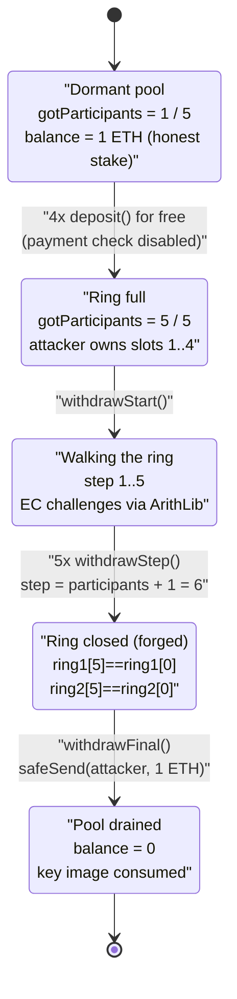
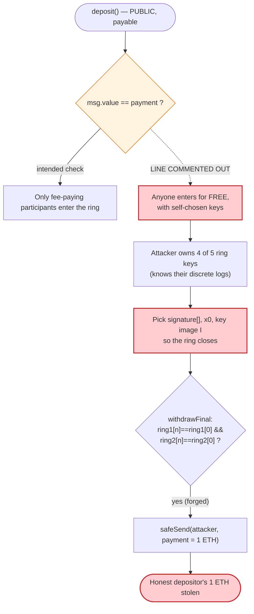

# Laundromat Exploit — Free Ring-Membership Drains a Dormant Mixer

> **Vulnerability classes:** vuln/access-control/missing-auth · vuln/auth/signature-validation

> One-line summary: a 2016-era ring-signature ETH mixer left its deposit fee check **commented out**, so an attacker registered as 4 of the 5 ring members for free, forged the ring signature it now controlled, and walked off with the 1 ETH a real participant had deposited ~9 years earlier.

> **Reproduction:** the PoC compiles & runs in an isolated Foundry project at
> [this project folder](.) (the umbrella DeFiHackLabs repo contains many unrelated PoCs that do not
> all compile, so this one was extracted). Full verbose trace:
> [output.txt](output.txt). Verified vulnerable source:
> [sources/Laundromat_934cbb/Laundromat.sol](sources/Laundromat_934cbb/Laundromat.sol).

---

## Key info

| | |
|---|---|
| **Loss** | ~$1.5K — **1.0 ETH** (the entire pool, deposited by one honest participant) |
| **Vulnerable contract** | `Laundromat` — [`0x934cbbE5377358e6712b5f041D90313d935C501C`](https://etherscan.io/address/0x934cbbE5377358e6712b5f041D90313d935C501C#code) |
| **Victim / pool** | The `Laundromat` mixer itself; the funded ring slot belonged to one real depositor |
| **Helper library** | `ArithLib` (secp256k1 jacobian EC math) — `0x600ad7b57f3e6aeee53acb8704a5ed50b60cacd6` |
| **Attacker EOA** | [`0xd6BE07499d408454D090c96bd74A193F61f706F4`](https://etherscan.io/address/0xd6BE07499d408454D090c96bd74A193F61f706F4) |
| **Attacker contract** | [`0x2E95CFC93EBb0a2aACE603ed3474d451E4161578`](https://etherscan.io/address/0x2E95CFC93EBb0a2aACE603ed3474d451E4161578) |
| **Attack tx** | [`0x08ffb5f7ab6421720ab609b6ab0ff5622fba225ba351119c21ef92c78cb8302c`](https://app.blocksec.com/explorer/tx/eth/0x08ffb5f7ab6421720ab609b6ab0ff5622fba225ba351119c21ef92c78cb8302c) |
| **Chain / block / date** | Ethereum mainnet / 22,222,687 (forked at 22,222,686) / 2025-04-08 |
| **Compiler (victim)** | Solidity **v0.4.4**, optimizer on (200 runs) |
| **Bug class** | Missing access/payment validation → free ring membership → forgeable ring signature |

---

## TL;DR

`Laundromat` is an ancient on-chain mixer that implements a **linkable ring signature** (the
academic "Möbius"/ring-signature ETH-mixing scheme). It is parameterised by a fixed ring size
`participants` and a fixed `payment` amount. Each participant is expected to `deposit()` their fixed
`payment` together with a curve public key `(pubkey1, pubkey2)`; once the ring is full, any one
participant can later prove ring membership with a ring signature and withdraw exactly `payment`.

The whole security model rests on the assumption that *each ring slot is backed by one real,
fee-paying, independent participant whose private key the others do not know*. That assumption is
destroyed by a single commented-out line in `deposit()`:

```solidity
function deposit(uint _pubkey1, uint _pubkey2) payable {
    //if(msg.value != payment) throw;   // ⚠️ payment check DISABLED
    if(gotParticipants >= participants) throw;
    pubkeys1.push(_pubkey1);
    pubkeys2.push(_pubkey2);
    gotParticipants++;
}
```
([sources/Laundromat_934cbb/Laundromat.sol:82-89](sources/Laundromat_934cbb/Laundromat.sol#L82-L89))

With the payment check gone, `deposit()` accepts **public keys of the attacker's choosing for free**.

At the fork block, the contract had been sitting dormant since ~2016 with:
`participants = 5`, `payment = 1 ETH`, `gotParticipants = 1`, and a **1 ETH balance** — one honest
person had filled slot 0 and deposited 1 ETH, and the ring was never completed.

The attacker simply:

1. Called `deposit()` **4 times for free**, filling slots 1-4 with key pairs *it generated itself*
   (so it knows the corresponding "private keys" / ring secrets). The ring is now full (5/5).
2. Ran the withdraw protocol (`withdrawStart` → 5× `withdrawStep` → `withdrawFinal`) producing a ring
   signature. Because the attacker now controls 4 of the 5 ring members and the verification only
   checks that the *ring closes back on itself* (`ring1[n] == ring1[0]`), it forged a closing
   signature without ever knowing the honest participant's secret.
3. `withdrawFinal()` verified the closed ring and sent `payment = 1 ETH` to the attacker.

Net result: attacker ETH balance **0.05 ETH → 1.05 ETH** = **+1.0 ETH**, exactly the honest
participant's deposit.

---

## Background — what Laundromat does

`Laundromat` ([source](sources/Laundromat_934cbb/Laundromat.sol)) is a fixed-anonymity-set ETH mixer
built around a **linkable ring signature** over secp256k1. The EC arithmetic is delegated to a
separate already-deployed library, `ArithLib`
([:11-22](sources/Laundromat_934cbb/Laundromat.sol#L11-L22)), which exposes jacobian-coordinate
primitives `jmul` (scalar mul), `jsub`, `jdecompose`, and `hash_pubkey_to_pubkey`.

The lifecycle is three phases:

- **Deposit phase.** Up to `participants` people call `deposit(pubkey1, pubkey2)`, each *supposed* to
  send `payment` ETH and register their curve public key. Keys accumulate in the public arrays
  `pubkeys1` / `pubkeys2`; `gotParticipants` counts how many slots are filled
  ([:82-89](sources/Laundromat_934cbb/Laundromat.sol#L82-L89)).
- **Withdraw phase (multi-step).** Once the ring is full (`gotParticipants == participants`), a
  withdrawer calls `withdrawStart(signature[], x0, Ix, Iy)` to seed a per-sender `WithdrawInfo`
  (the candidate ring signature, the key image `I = (Ix, Iy)`, and the ring's initial commitment
  `x0`) ([:92-110](sources/Laundromat_934cbb/Laundromat.sol#L92-L110)). They then call `withdrawStep()`
  exactly `participants` times; each step advances the ring by one member, recomputing the next
  challenge from the previous one using the EC math
  ([:112-156](sources/Laundromat_934cbb/Laundromat.sol#L112-L156)).
- **Finalisation.** `withdrawFinal()` checks that after `participants` steps the ring **closed**
  (the last challenge equals the first), marks the key image as `consumed` to prevent double-spend,
  and sends `payment` to the withdrawer ([:158-178](sources/Laundromat_934cbb/Laundromat.sol#L158-L178)).

On-chain parameters at the fork block (read via `cast` against block 22,222,686):

| Parameter | Value |
|---|---|
| `participants` (ring size) | **5** |
| `payment` | **1 ETH** (`1e18` wei) |
| `gotParticipants` | **1** (one honest slot filled) |
| Contract ETH balance | **1.0 ETH** ← the prize |
| Attacker EOA balance | 0.05 ETH |
| `ArithLib` codesize | 1,883 bytes (library present) |

That `gotParticipants = 1` with a `1 ETH` balance is the whole game: one real user deposited and the
ring was never completed, leaving the mixer holding funds that anyone who can complete and forge the
ring can claim.

---

## The vulnerable code

### 1. `deposit()` — the payment check is commented out

```solidity
function deposit(uint _pubkey1, uint _pubkey2) payable {
    //if(msg.value != payment) throw;       // ⚠️ DISABLED
    if(gotParticipants >= participants) throw;

    pubkeys1.push(_pubkey1);
    pubkeys2.push(_pubkey2);
    gotParticipants++;
}
```
([sources/Laundromat_934cbb/Laundromat.sol:82-89](sources/Laundromat_934cbb/Laundromat.sol#L82-L89))

There is **no `msg.value` enforcement and no per-depositor identity / key-uniqueness check**. A
single actor can occupy every remaining ring slot at zero cost, choosing public keys for which it
knows the discrete logs.

### 2. `withdrawFinal()` — verification only checks the ring *closes*

```solidity
function withdrawFinal() returns (bool) {
    WithdrawInfo withdraw = withdraws[uint(msg.sender)];

    if(withdraw.step != (participants + 1)) throw;
    if(consumed[uint(sha3([withdraw.Ix, withdraw.Iy]))]) throw;
    if(withdraw.ring1[participants] != withdraw.ring1[0]) {
        LogDebug("Wrong signature");
        return false;
    }
    if(withdraw.ring2[participants] != withdraw.ring2[0]) {
        LogDebug("Wrong signature");
        return false;
    }

    withdraw.step++;
    consumed[uint(sha3([withdraw.Ix, withdraw.Iy]))] = true;
    safeSend(withdraw.sender, payment);     // ⚠️ pays out the fixed amount
    return true;
}
```
([sources/Laundromat_934cbb/Laundromat.sol:158-178](sources/Laundromat_934cbb/Laundromat.sol#L158-L178))

The ring signature is "valid" iff, after walking all `participants` members, the recomputed challenge
loops back to the seed (`ring1[n] == ring1[0]` and `ring2[n] == ring2[0]`). The soundness of that
check depends entirely on the signer knowing the secret for **at least one** ring member that it does
*not* otherwise control — i.e., on ring slots being filled by independent, fee-paying participants.
Once the attacker owns 4 of the 5 slots (because deposits were free), it has enough degrees of
freedom to choose `signature[]`, `x0`, and `I` so that the ring closes — a standard ring-signature
forgery when you control all-but-one (here, all the meaningful) ring keys.

### 3. The step recurrence (where the EC math runs)

```solidity
(k1x,k1y,k1z) = arithContract.jmul(Gx, Gy, 1, withdraw.signature[withdraw.prevStep % participants]);
(k2x,k2y,k2z) = arithContract.jmul(pubkeys1[withdraw.step % participants],
                                    pubkeys2[withdraw.step % participants], 1,
                                    withdraw.ring2[withdraw.prevStep % participants]);
(k1x,k1y,k1z) = arithContract.jsub(k1x,k1y,k1z, k2x,k2y,k2z);
...
withdraw.ring1.push(uint(sha3([uint(withdraw.sender), pub1x, pub1y, k1x, k1y])));
withdraw.ring2.push(uint(sha3(uint(sha3([...])))));
withdraw.step++; withdraw.prevStep++;
```
([sources/Laundromat_934cbb/Laundromat.sol:129-155](sources/Laundromat_934cbb/Laundromat.sol#L129-L155))

Each `withdrawStep()` consumes one ring public key and one signature scalar to derive the next
challenge. The trace shows exactly this: per step there are two `jmul`s with the generator and with a
ring pubkey, a `jsub`, a `jdecompose`, and a `hash_pubkey_to_pubkey`, all against the attacker-chosen
ring keys.

---

## Root cause — why it was possible

The contract conflates **"a slot in the ring"** with **"an independent, fee-paying participant."**
Two compounding defects:

1. **No deposit validation (the disabled `msg.value != payment` check).** This single commented-out
   line means filling a ring slot costs nothing and requires no proof that the public key belongs to a
   distinct, honest party. The attacker can deterministically generate `(pubkey1, pubkey2)` pairs whose
   discrete logs it knows and push all of them in.
2. **The withdraw verifier trusts the ring's composition.** `withdrawFinal()` only verifies the ring
   *closes*; it has no way to ensure the ring contains at least one member whose secret the withdrawer
   doesn't know. The anonymity-set assumption ("only a true member can close the ring") collapses the
   moment the withdrawer controls the keys of every-but-the-honest slot — and with 4 of 5 controlled
   keys plus freedom over `signature[]`, `x0`, and the key image `I`, closing the ring is mechanical.

In short: the security of a ring mixer is "you can withdraw only if you are one of the depositors who
actually paid in." Because depositing was free and unauthenticated, the attacker *became* (almost) the
entire ring, and the cryptographic check that was supposed to stop a non-depositor became trivially
satisfiable.

This is best understood as a classic **missing-input-validation** bug (the absent payment/identity
check) that **cascades into a cryptographic-soundness failure**. It is not a flaw in `ArithLib`'s EC
math — the math executed correctly; it was fed an adversary-controlled ring.

---

## Preconditions

- The mixer is **deployed and funded but its ring is incomplete** — `gotParticipants < participants`
  with at least `payment` ETH already in the contract. Here: `1/5` slots filled, `1 ETH` held. (If the
  ring were already full, `deposit()` reverts on `gotParticipants >= participants` and the attacker
  cannot insert its keys.)
- The honest deposit's key image has **not been `consumed`** (the legitimate depositor never withdrew).
- The attacker can construct a ring signature that closes given control of all-but-one ring keys —
  i.e., it can pick `signature[]`, `x0`, `Ix`, `Iy` (and the 4 free pubkeys) consistently. In the live
  attack these values were precomputed off-chain and hard-coded into the attacker contract
  ([test/Laundromat_exp.sol:43-78](test/Laundromat_exp.sol#L43-L78)).
- No working capital is required beyond gas: the 4 deposits send **0 ETH** each.

---

## Attack walkthrough (with on-chain numbers from the trace)

All figures are taken directly from [output.txt](output.txt). Slots refer to `pubkeys1`/`pubkeys2`
array indices; storage slots 6/7/8 are `gotParticipants` / `pubkeys1.length` / `pubkeys2.length`.

| # | Call | Effect (from trace storage changes) | Value sent |
|---|------|-------------------------------------|-----------:|
| 0 | **Initial state** (block 22,222,686) | `participants=5`, `payment=1e18`, `gotParticipants=1`, balance `1 ETH` | — |
| 1 | `deposit(pk1, pk2)` | slots 6/7/8: `1 → 2`; pubkey written to `keccak(7)+1` / `keccak(8)+1` | **0 ETH** |
| 2 | `deposit(pk1, pk2)` | `2 → 3`; ring slot 2 filled | **0 ETH** |
| 3 | `deposit(pk1, pk2)` | `3 → 4`; ring slot 3 filled | **0 ETH** |
| 4 | `deposit(pk1, pk2)` | `4 → 5`; ring **full** (`gotParticipants == participants`) | **0 ETH** |
| 5 | `withdrawStart(sig[5], x0, Ix, Iy)` | seeds `WithdrawInfo`: stores `signature[]`, `Ix/Iy`, `x0`, `ring1[0]`, `step=1` | — |
| 6 | `withdrawStep()` #1 | EC recurrence (2×`jmul`, `jsub`, `jdecompose`, `hash_pubkey_to_pubkey`); `step 1→2` | — |
| 7 | `withdrawStep()` #2 | `step 2→3` | — |
| 8 | `withdrawStep()` #3 | `step 3→4` | — |
| 9 | `withdrawStep()` #4 | `step 4→5` | — |
| 10 | `withdrawStep()` #5 | `step 5→6` (= `participants + 1`); ring fully walked, `ring1[5]`/`ring2[5]` computed | — |
| 11 | `withdrawFinal()` | `ring1[5]==ring1[0]` ✓ and `ring2[5]==ring2[0]` ✓ → marks `consumed`, `safeSend(attacker, 1 ETH)` | **−1 ETH out** |
| 12 | `selfdestruct(attacker)` | attacker contract self-destructs, forwarding its 1 ETH to the EOA | — |

Note: the same four free deposits used the **identical** key pair
(`pk1 = 0x53fc1ed6…45ca8a`, `pk2 = 0xdd3a0e94…52d3b6`) in this PoC — the contract performs no
duplicate-key rejection, underscoring the absence of any participant validation.

The single observable payout in the trace:

```
[38985] 0x934cbbE5…501C::withdrawFinal()
  ├─ [0] 0x2E95CFC9…1578::fallback{value: 1000000000000000000}()   // 1 ETH to attacker contract
  └─ ← [Return] true
```
([output.txt:1788-1798](output.txt#L1788-L1798))

### Profit / loss accounting (ETH)

| | Amount |
|---|---:|
| Deposit fees paid by attacker (4 × `deposit`) | **0** |
| Attacker EOA balance before | 0.05 |
| Payout from `withdrawFinal()` | **+1.0** |
| Attacker EOA balance after (post-selfdestruct) | **1.05** |
| **Net attacker profit** | **+1.0 ETH** |
| **Victim (mixer) loss** | **−1.0 ETH** (the honest depositor's entire stake) |

Confirmed by the test logs: `before attack: 0.05` → `after attack: 1.05`
([output.txt:1568, 1802](output.txt#L1568)).

---

## Diagrams

### Sequence of the attack

```mermaid
sequenceDiagram
    autonumber
    actor A as "Attacker (EOA + contract)"
    participant L as "Laundromat mixer"
    participant Lib as "ArithLib (EC math)"

    Note over L: Dormant since ~2016<br/>participants=5, payment=1 ETH<br/>gotParticipants=1, balance=1 ETH

    rect rgb(255,243,224)
    Note over A,L: Phase 1 — fill the ring for FREE
    loop 4 times (slots 1..4)
        A->>L: deposit(pk1, pk2)  value = 0
        Note over L: msg.value check is commented out<br/>gotParticipants++ (no payment)
    end
    Note over L: ring full: gotParticipants == 5
    end

    rect rgb(227,242,253)
    Note over A,L: Phase 2 — drive the withdraw protocol
    A->>L: withdrawStart(signature[5], x0, Ix, Iy)
    Note over L: seeds WithdrawInfo, step = 1
    loop 5 times (withdrawStep)
        A->>L: withdrawStep()
        L->>Lib: jmul / jsub / jdecompose / hash_pubkey_to_pubkey
        Lib-->>L: next ring challenge
        Note over L: step++ ; push ring1[i], ring2[i]
    end
    end

    rect rgb(255,235,238)
    Note over A,L: Phase 3 — forged ring closes, payout
    A->>L: withdrawFinal()
    Note over L: ring1[5]==ring1[0] && ring2[5]==ring2[0]  ✓<br/>mark key image consumed
    L-->>A: safeSend(attacker, 1 ETH)
    end

    A->>A: selfdestruct(payable(attacker EOA))
    Note over A: Net +1.0 ETH (the honest deposit)
```

### Pool / state evolution



### Why the forgery works (trust collapse)



---

## Remediation

1. **Re-enable (and never comment out) the deposit payment check.** `deposit()` must enforce
   `require(msg.value == payment)`. A ring mixer where slots can be claimed for free is fundamentally
   broken — the economic backing of each slot is what the ring signature is supposed to protect.
2. **Authenticate / de-duplicate ring membership.** Reject duplicate public keys and ideally require a
   proof-of-knowledge of the discrete log at deposit time, so a single actor cannot stuff the ring with
   keys it controls. (Here, four *identical* key pairs were accepted without complaint.)
3. **Do not let one party own the whole ring.** Even with the payment check, a single funder could
   complete a thin ring. Mitigations: minimum distinct depositors, time-locked deposit windows, or
   binding each slot to a distinct, externally-attested identity. The cryptographic soundness of the
   ring signature is only as strong as the independence of its members.
4. **Treat dormant funded contracts as live risk.** This contract sat exploitable for ~9 years.
   Mixers/escrows that hold funds with an incomplete quorum should expire and refund honest depositors
   rather than leave value claimable indefinitely.
5. **Audit commented-out security checks.** A disabled `require`/`throw` is a code smell that should be
   caught in review and CI — the single `//` here was the entire vulnerability.

---

## How to reproduce

The PoC was extracted into a standalone Foundry project (the umbrella DeFiHackLabs repo does not build
as a whole under `forge test`):

```bash
_shared/run_poc.sh 2025-04-Laundromat_exp -vvvvv
```

- RPC: an **Ethereum mainnet archive** endpoint is required (the fork block 22,222,686 is from
  2025-04-08). `foundry.toml` uses an Infura archive endpoint, which serves historical state at that
  block.
- The victim `Laundromat` was compiled with Solidity v0.4.4; the PoC itself targets `^0.8.10` and
  reaches the contract purely via low-level `call` selectors, so no cross-version compilation is needed.
- Result: `[PASS] testPoC()` with the attacker balance rising from `0.05` to `1.05` ETH.

Expected tail:

```
Ran 1 test for test/Laundromat_exp.sol:ContractTest
[PASS] testPoC() (gas: 7330994)
  before attack: balance of attacker: 0.050000000000000000
  after attack: balance of attacker: 1.050000000000000000
Suite result: ok. 1 passed; 0 failed; 0 skipped
```

---

*References: PoC header (TenArmor post-mortem — https://x.com/TenArmorAlert/status/1909814943290884596).
On-chain state (`participants=5`, `payment=1e18`, `gotParticipants=1`, balance `1 ETH`) read via `cast`
against fork block 22,222,686.*
