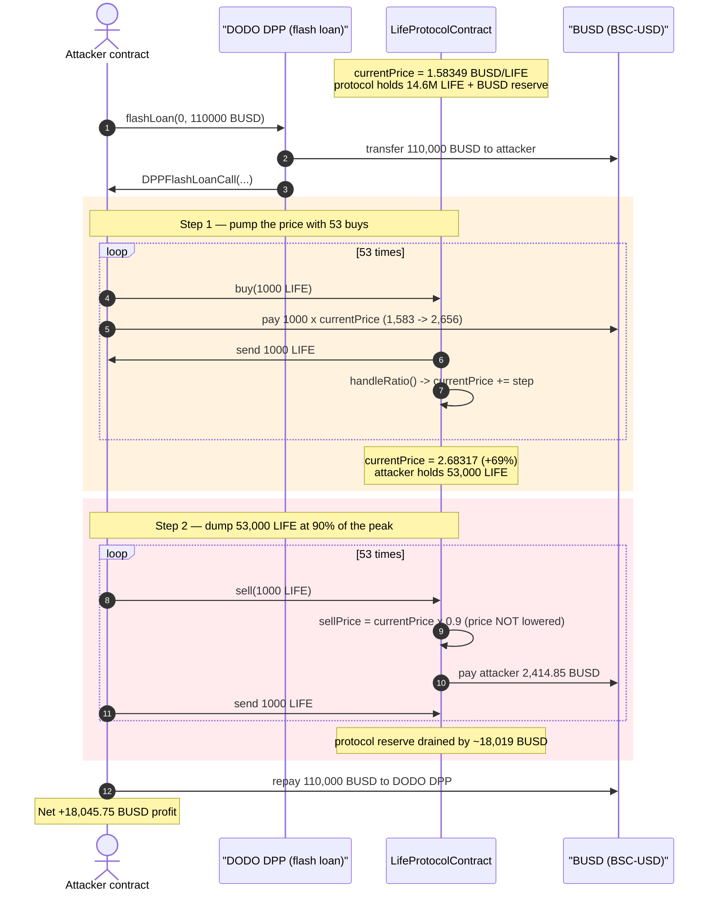
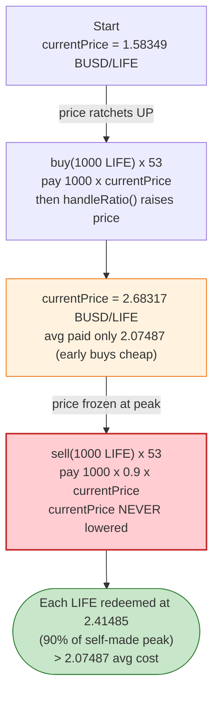
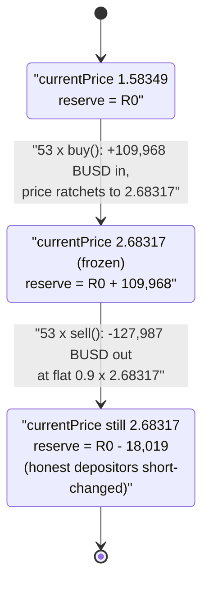

# Life Protocol Exploit — Asymmetric Bonding Curve: Pump the Buy Price, Dump at 90% of the Peak

> **Vulnerability classes:** vuln/logic/price-calculation · vuln/logic/incorrect-state-transition

> **Reproduction:** the PoC compiles & runs in an isolated Foundry project at
> [this project folder](.) (the umbrella DeFiHackLabs repo contains many unrelated PoCs that do not
> whole-compile, so this one was extracted standalone).
> Full verbose trace: [output.txt](output.txt).
> Verified vulnerable source: [LifeProtocolContract.sol](sources/LifeProtocolContract_42e277/LifeProtocolContract.sol).

---

## Key info

| | |
|---|---|
| **Loss** | **~18,045 BUSD** drained in the reproduced transaction (the original incident is reported at **15,114 BUSD** — both are the protocol's own USDT reserve) |
| **Vulnerable contract** | `LifeProtocolContract` — [`0x42e2773508e2AE8fF9434BEA599812e28449e2Cd`](https://bscscan.com/address/0x42e2773508e2ae8ff9434bea599812e28449e2cd#code) |
| **Victim** | The protocol's own BUSD `buyBackReserve` held inside `LifeProtocolContract` |
| **Attacker EOA** | [`0x3026C464d3Bd6Ef0CeD0D49e80f171b58176Ce32`](https://bscscan.com/address/0x3026C464d3Bd6Ef0CeD0D49e80f171b58176Ce32) |
| **Attacker contract** | [`0xF6Cee497DFE95A04FAa26F3138F9244a4d92f942`](https://bscscan.com/address/0xF6Cee497DFE95A04FAa26F3138F9244a4d92f942) |
| **Attack tx** | [`0x487fb71e3d2574e747c67a45971ec3966d275d0069d4f9da6d43901401f8f3c0`](https://bscscan.com/tx/0x487fb71e3d2574e747c67a45971ec3966d275d0069d4f9da6d43901401f8f3c0) |
| **Funding flash loan** | DODO DPP (BUSD/?) at `0x6098A5638d8D7e9Ed2f952d35B2b67c34EC6B476` — borrows 110,000 BUSD, 0 fee |
| **Chain / block / date** | BSC / 48,703,545 (fork = attack block − 1) / April 2025 |
| **Compiler** | Solidity v0.8.26, optimizer **200 runs** |
| **Bug class** | Broken price-curve invariant — asymmetric buy/sell pricing (sell price is never adjusted back down after buys pump it) |

---

## TL;DR

`LifeProtocolContract` is a "bonding-curve"-style market maker for the `LIFE` token, priced in BUSD.
It keeps a single mutable `currentPrice` ([:1071](sources/LifeProtocolContract_42e277/LifeProtocolContract.sol#L1071)).

- **Buying** charges `lifeAmount × currentPrice`, then **raises** `currentPrice` by a tiny step in
  `handleRatio()` ([:1374-1386](sources/LifeProtocolContract_42e277/LifeProtocolContract.sol#L1374-L1386)).
- **Selling** pays out `lifeAmount × currentPrice × 90%`
  ([:1177-1178](sources/LifeProtocolContract_42e277/LifeProtocolContract.sol#L1177-L1178)) — but **never
  touches `currentPrice` at all**. Selling does not move the price back down.

Because the buy curve is a *slowly rising ramp* while the sell curve is a *flat 90%-of-the-current-price
line that is pinned to the peak*, an attacker can:

1. Buy a large block of LIFE in many small steps, watching the *average* paid price stay well below the
   *final* price (the early buys are cheap, the late buys are dear).
2. Immediately sell the entire block back at `90% × finalPrice`, applied uniformly to every token —
   because `currentPrice` is frozen at the peak the buys created.

As long as `0.9 × finalPrice > averageBuyPrice`, the round-trip is profitable. In this attack:

- 53 × `buy(1000 LIFE)` pumped `currentPrice` from **1.58349 → 2.68317 BUSD/LIFE** and cost a total of
  **109,967.85 BUSD** (average **2,074.87 BUSD per 1,000 LIFE**).
- 53 × `sell(1000 LIFE)` each paid a flat **2,414.85 BUSD** (= `2.68317 × 0.9 × 1000`), totalling
  **127,987.06 BUSD**.

Round-trip profit ≈ **127,987.06 − 109,967.85 = 18,019 BUSD**, lifted out of the protocol's
pre-existing BUSD reserve. A DODO 0-fee flash loan supplied the working capital; the entire 110,000 BUSD
was repaid in the same transaction, leaving **18,045.75 BUSD** of pure profit.

---

## Background — what Life Protocol does

`LifeProtocolContract` ([source](sources/LifeProtocolContract_42e277/LifeProtocolContract.sol#L1062)) is
a standalone primary market for the in-house `LIFE` ERC20, denominated in BUSD (the contract calls it
`UsdtToken`; on BSC `0x55d3…7955` is the BSC-USD / BUSD token). It is **not** a Uniswap-style
constant-product pool — it is a custom curve with a mutable price:

- **`currentPrice`** — the spot price of 1 LIFE in BUSD, stored in slot 8. Initialized to `1e18`
  at deployment ([:1111](sources/LifeProtocolContract_42e277/LifeProtocolContract.sol#L1111)); at the
  fork block it had already drifted up to **1.58349 BUSD/LIFE** from prior real activity.
- **`buyBackReserve`** — accumulates BUSD paid in by buyers
  ([:1125](sources/LifeProtocolContract_42e277/LifeProtocolContract.sol#L1125)); used to fund buybacks of
  queued sell orders and to pay sellers.
- **`buy(lifeTokenAmount)`** ([:1121](sources/LifeProtocolContract_42e277/LifeProtocolContract.sol#L1121)) —
  pulls `lifeAmount × currentPrice` BUSD, hands the buyer LIFE from supply (or from queued sell orders),
  then runs `handleRatio()`.
- **`sell(amount)`** ([:1171](sources/LifeProtocolContract_42e277/LifeProtocolContract.sol#L1171)) — quotes
  `sellPrice = currentPrice × 90 / 100`; if the contract holds enough BUSD it pays the seller
  `sellPrice × amount` **immediately** and takes the LIFE; otherwise it queues a sell order.

On-chain state at the fork block (read from the trace):

| Parameter | Value |
|---|---|
| `currentPrice` (slot 8) before the attack | **1.58349 BUSD/LIFE** |
| `minTradeAmount` / `maxTradeAmount` | 1 / 5000 BUSD per trade |
| LIFE held by the protocol (sellable supply) | **14,657,517 LIFE** (plenty) |
| BUSD reserve held by the protocol at sell time | **162,670.53 BUSD** (after the 53 buys) |
| LIFE `totalSupply` | 21,000,000 |

The whole exploit lives in one fact: **`buy()` raises `currentPrice`; `sell()` reads `currentPrice` but
never lowers it.** The price is a one-way ratchet that the attacker controls.

---

## The vulnerable code

### 1. `buy()` charges spot price, then ratchets the price up

```solidity
function buy(uint256 lifeTokenAmount) external nonReentrant {
    uint256 totalUsdtCost = calculateTotalCost(lifeTokenAmount);          // lifeAmount * currentPrice / 1e18
    require(totalUsdtCost >= minTradeAmount && totalUsdtCost <= maxTradeAmount, "Invalid trade amount");

    buyBackReserve = buyBackReserve.add(totalUsdtCost);
    require(UsdtToken.transferFrom(msg.sender,address(this),totalUsdtCost),"usdt transfer failed!");
    ...
    buyFromSupply(msg.sender, lifeTokenAmount);   // sends LIFE to buyer at the OLD price
    buyBack();
    handleRatio(totalUsdtCost);                   // ⬆️ raises currentPrice
}
```
([:1121-1144](sources/LifeProtocolContract_42e277/LifeProtocolContract.sol#L1121-L1144))

`handleRatio()` ([:1374-1386](sources/LifeProtocolContract_42e277/LifeProtocolContract.sol#L1374-L1386))
nudges the price up after every buy:

```solidity
function handleRatio(uint256 _amount) internal {
    uint256 circulatingSupply = lifeToken.totalSupply().sub(lifeToken.balanceOf(address(this)));
    uint256 circulatingSupplyValue = (circulatingSupply.mul(currentPrice)).div(1e18);
    if (buyBackReserve > circulatingSupplyValue) {
        currentPrice = (buyBackReserve.mul(1e18)).div(circulatingSupply);   // reserve-ratio branch
        emit PriceAdjusted(currentPrice);
    } else {
        uint256 priceIncrease = calculatePriceIncrease(_amount);            // ← the branch taken here
        currentPrice = currentPrice.add(priceIncrease);                     // ⬆️ monotone increase
    }
}
```

In this attack the trace contains **zero `PriceAdjusted` events**, so every buy took the `else` branch:
`currentPrice += calculatePriceIncrease(totalUsdtCost)`. With `currentPrice` in the `> 1e18` range,
`calculatePriceIncrease` ([:1310-1324](sources/LifeProtocolContract_42e277/LifeProtocolContract.sol#L1310-L1324))
returns `transactionValue / 21_000_000`, so each ~2,000-BUSD buy bumps the price by a few thousandths —
a slow, monotone ramp.

### 2. `sell()` prices at 90% of the *current* (peaked) price and never moves it

```solidity
function sell(uint256 amount) external nonReentrant {
    require(lifeToken.balanceOf(msg.sender) >= amount, "Insufficient balance");
    ...
    uint256 sellPrice   = currentPrice.mul(90).div(100);        // ← reads the peaked price
    uint256 requiredUSDT = sellPrice.mul(amount).div(1e18);
    ...
    if (UsdtToken.balanceOf(address(this)) >= requiredUSDT) {
        lifeToken.transferFrom(msg.sender, address(this), amount);
        remainingSupply = remainingSupply.add(amount);
        buyBackReserve  = buyBackReserve.sub(requiredUSDT);
        require(UsdtToken.transfer(msg.sender,requiredUSDT),"usdt transfer failed!"); // ← pays out
        ...
    } else { /* queue order */ }
    buyBack();
    // ⚠️ NOTE: handleRatio() / handle_Ratio() is NEVER called here.
    //          currentPrice is NOT decreased. The sell price stays pinned to the peak.
}
```
([:1171-1225](sources/LifeProtocolContract_42e277/LifeProtocolContract.sol#L1171-L1225))

There is no `currentPrice = …` anywhere in `sell()`, `resolveBuyback()`, `buyFromSellOrders()`, or
`cancelSellOrder()`. The only writers of `currentPrice` are the two `handleRatio`/`handle_Ratio`
functions, and those run **only on the buy side**. Selling 53,000 LIFE back-to-back therefore drains
BUSD at a constant `0.9 × peakPrice` for every single token.

---

## Root cause — why it was possible

A solvent automated market maker must satisfy a *path-independence* property: a round trip of
"buy X, then immediately sell X" must return **less** than it cost (the spread / fee is the protocol's
edge). Life Protocol's curve violates this badly.

> The **buy price is an increasing ramp** (cheap early, dear late), but the **sell price is a flat line
> equal to 90% of the *current* price** — and the current price is whatever the most recent buy pumped
> it to. Because selling never pushes the price back down, the attacker first inflates `currentPrice`
> with their own buys (paying a *low average*), then redeems the whole position at *90% of the high they
> created* (a *high uniform* price).

Three independent design errors compose into the bug:

1. **Asymmetric price update.** `buy()` moves the price; `sell()` does not. A correct bonding curve must
   decrease the price on sells by the same law it increases it on buys, so that the marginal sell price
   tracks the marginal buy price. Here the sell price is permanently anchored to the post-pump peak.
2. **Uniform (not marginal) sell pricing.** `sell()` prices *the entire amount* at the single current
   price, rather than walking the curve down token-by-token. So the 53,000th LIFE sold pays exactly the
   same `0.9 × peak` as the first — there is no slippage penalty for dumping a large position.
3. **A 10% "haircut" that is too small to be a real fee.** The only thing standing between the attacker
   and free money is the `× 90/100` factor. But the buys pumped the price ~+69% (1.58349 → 2.68317), so
   `0.9 × 2.68317 = 2.41485` comfortably exceeds the **2.07487** average buy price. The haircut is
   dwarfed by the self-inflicted pump, so the round trip clears a profit.

The attack needs no privileged role, no oracle, and no reentrancy — just enough BUSD to run the
buy/sell loop, which a 0-fee DODO flash loan supplies for free.

---

## Preconditions

- The protocol must hold enough BUSD in `buyBackReserve` / its balance to settle the sells immediately
  (so `sell()` takes the instant-payout branch rather than queueing). At the fork block it held
  **162,670 BUSD** after the buys — far more than the **127,987 BUSD** the sells demanded.
- Sellable LIFE supply must exist (the protocol held **14.6M LIFE** — never a constraint).
- Each individual trade must clear `minTradeAmount ≤ cost ≤ maxTradeAmount` (1–5000 BUSD). The attacker
  uses `buy(1000 LIFE)` so each leg costs ~1.6k–2.7k BUSD, comfortably inside the band — which is exactly
  *why* the position is built in 53 small steps rather than one big trade.
- Working capital in BUSD for the round trip. Peak outlay was the 110,000-BUSD flash loan; it is fully
  recovered intra-transaction, hence **flash-loanable** (the PoC borrows it from the DODO DPP at 0 fee).

---

## Attack walkthrough (with on-chain numbers from the trace)

The attacker contract implements `DPPFlashLoanCall` as the DODO flash-loan callback
([Lifeprotocol_exp.sol:40-54](test/Lifeprotocol_exp.sol#L40-L54)).

| # | Step | `currentPrice` (BUSD/LIFE) | BUSD spent / received | Running effect |
|---|------|---------------------------:|----------------------:|----------------|
| 0 | **Flash loan** 110,000 BUSD from DODO DPP | 1.58349 | +110,000 (borrowed) | Working capital in hand. |
| 1 | **`buy(1000 LIFE)` × 53** — each pulls `1000 × currentPrice` BUSD and ratchets the price up | 1.58349 → **2.68317** | −109,967.85 total (1,583.49 → 2,656.60 each; **avg 2,074.87**) | Attacker holds **53,000 LIFE**; price pumped **+69.4%**. |
| 2 | **`sell(1000 LIFE)` × 53** — each pays `1000 × 0.9 × currentPrice`, price untouched | **2.68317** (frozen) | +127,987.06 total (**flat 2,414.85 each**) | Attacker dumps all 53,000 LIFE at 90% of the peak. |
| 3 | **Repay** 110,000 BUSD to the DODO DPP | — | −110,000 | Flash loan closed, 0 fee. |
| 4 | **Settle** | — | — | Attacker keeps **18,045.75 BUSD**. |

Selected buy-leg costs (from the 53 `Buy` events, `param2` = BUSD cost):

| Buy # | 1 | 10 | 20 | 30 | 40 | 50 | 53 |
|-------|---|----|----|----|----|----|----|
| BUSD / 1000 LIFE | 1,583.49 | 1,731.84 | 1,913.03 | 2,113.17 | 2,334.26 | 2,578.47 | 2,656.60 |

Every one of the 53 sell legs paid an **identical 2,414.85 BUSD** — direct proof that `currentPrice`
never changed during the sell loop (slot 8 appears in zero sell storage-change blocks; sells only touch
slots 9 `buyBackReserve` and 10 `remainingSupply`).

### Why the round trip is profitable

The break-even condition is `0.9 × peakPrice > avgBuyPrice`:

```
avgBuyPrice = 109,967.85 / 53,000 LIFE   = 2.07487 BUSD/LIFE
sellPrice   = 0.9 × 2.68317              = 2.41485 BUSD/LIFE
spread      = 2.41485 − 2.07487          = 0.33998 BUSD/LIFE
profit      = 0.33998 × 53,000           ≈ 18,019 BUSD   (matches the realized 18,045.75)
```

The +69% pump created by the attacker's own buys is far larger than the 10% sell haircut, so the spread
is positive and scales linearly with position size. The choice of "53 iterations of 1000 LIFE" is just
tuning: enough buys to pump the price meaningfully while every leg stays under `maxTradeAmount`, and a
total round trip the 110k flash loan can fund.

### Profit accounting (BUSD)

| Direction | Amount |
|---|---:|
| Borrowed (flash loan) | 110,000.00 |
| Spent — 53 buys | 109,967.85 |
| Received — 53 sells | 127,987.06 |
| Repaid (flash loan) | 110,000.00 |
| **Net profit (final attacker balance)** | **+18,045.75** |

The net is lifted directly out of the protocol's pre-existing BUSD reserve: the protocol took in
109,967.85 BUSD of buys but paid out 127,987.06 BUSD of sells for the same 53,000 LIFE — a
**~18,019 BUSD shortfall** absorbed by honest depositors' reserve.

---

## Diagrams

### Sequence of the attack



### Price-curve asymmetry (the core flaw)



### State evolution of `currentPrice` and the protocol BUSD reserve



---

## Remediation

1. **Make the curve symmetric.** The single most important fix: `sell()` must update `currentPrice`
   with the *inverse* of the law `buy()` applies, so the marginal sell price tracks the marginal buy
   price and a round trip can never net positive. As written, `sell()` calls neither `handleRatio` nor
   `handle_Ratio`, so the price only ever goes up.
2. **Price each unit marginally, not uniformly.** Quote sells (and buys) by walking the curve unit-by-unit
   (or with the closed-form integral of the curve), so dumping a large position incurs real slippage.
   Pricing the whole `amount` at one spot price lets an attacker exit a pumped position with no penalty.
3. **Track and enforce solvency invariants.** The protocol should never pay out more BUSD for a block of
   LIFE than it received for that same block. Add an invariant check that total `sell` proceeds for a
   position cannot exceed total `buy` cost minus the spread.
4. **Charge a spread that exceeds the maximum self-induced price move per transaction.** A flat 10% sell
   haircut is meaningless when the attacker can move the price 69% within a single transaction. Either
   cap per-transaction price movement, or impose a sliding fee/cooldown that makes a same-block
   pump-and-dump unprofitable.
5. **Rate-limit or cooldown round trips.** Buying and selling the same tokens within one transaction (or
   block) is the entire attack; a per-account hold period or a TWAP-based price would defeat it.

---

## How to reproduce

The PoC was extracted into a standalone Foundry project (the umbrella DeFiHackLabs repo has many
unrelated PoCs that fail to compile under `forge test`'s whole-project build):

```bash
_shared/run_poc.sh 2025-04-Lifeprotocol_exp -vvvvv
```

- RPC: a **BSC archive** endpoint is required (fork block 48,703,545). `foundry.toml` uses
  `https://bsc-mainnet.public.blastapi.io`, which serves historical state at that block; most public BSC
  RPCs prune it and fail with `header not found` / `missing trie node`.
- Result: `[PASS] testExploit()` with `Profit: 18045 BUSD`.

Expected tail:

```
  Profit: 18045 BUSD

Suite result: ok. 1 passed; 0 failed; 0 skipped; finished in 10.43s (8.21s CPU time)

Ran 1 test suite: 1 tests passed, 0 failed, 0 skipped (1 total tests)
```

---

*The PoC header reports the incident loss as 15,114 BUSD; the reproduction at block 48,703,545 nets
18,045.75 BUSD. The difference is just the exact on-chain reserve / price state at the chosen fork block
versus the original attack block — the mechanism (pump the buy ramp, dump at 90% of the frozen peak) is
identical.*
