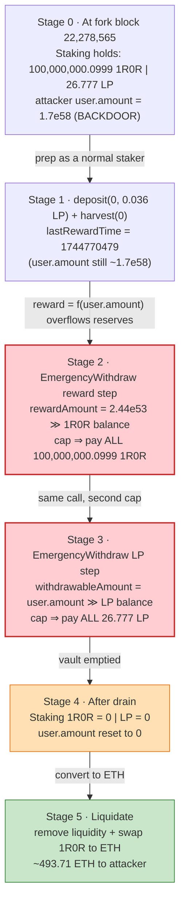
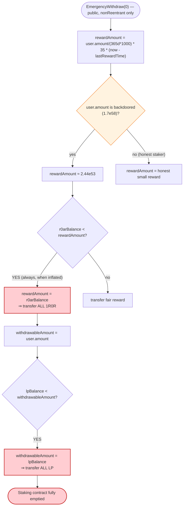

# R0AR (1R0R) Staking Exploit — Backdoored `user.amount` + Self-Capping `EmergencyWithdraw()` Drain

> One-liner: a deployment-time backdoor preset one attacker address's `userInfo.amount` to an astronomical value, and `EmergencyWithdraw()`'s "cap the payout to whatever the contract holds" logic then handed that attacker the **entire** R0AR + LP balance of the staking contract.

> **Reproduction:** the PoC compiles & runs in this isolated Foundry project ([this folder](.)). The umbrella DeFiHackLabs repo does not whole-compile, so this PoC was extracted.
> Full verbose trace: [output.txt](output.txt).
> Verified vulnerable source: [R0ARStaking.sol](sources/R0ARStaking_bd2cd7/R0ARStaking.sol). Token: [ONE_R0AR_Token.sol](sources/ONE_R0AR_Token_b0415D/ONE_R0AR_Token.sol).

---

## Key info

| | |
|---|---|
| **Loss** | ~**$777K** — 100,000,000.0999 1R0R + 26.777 R0AR/WETH LP tokens drained from the staking contract; attacker netted ≈ **493.7 ETH** after liquidating |
| **Vulnerable contract** | `R0ARStaking` — [`0xbd2cd71630f2da85399565f6f2b49c9d4ce0e77f`](https://etherscan.io/address/0xbd2cd71630f2da85399565f6f2b49c9d4ce0e77f#code) |
| **Token drained** | `1R0R` (R0AR TOKEN) — [`0xb0415D55f2C87b7f99285848bd341C367FeAc1ea`](https://etherscan.io/address/0xb0415D55f2C87b7f99285848bd341C367FeAc1ea#code) |
| **Also drained** | R0AR/WETH UniswapV2 pair (the staked LP) — [`0x13028E6b95520ad16898396667d1e52cB5E550Ac`](https://etherscan.io/address/0x13028E6b95520ad16898396667d1e52cB5E550Ac) |
| **Attacker EOA** | [`0x8149f77504007450711023cf0eC11BDd6348401F`](https://etherscan.io/address/0x8149f77504007450711023cf0eC11BDd6348401F) |
| **Attack tx** | [`0xab2097bb3ce666493d0f76179f7206926adc8cec4ba16e88aed30c202d70c661`](https://etherscan.io/tx/0xab2097bb3ce666493d0f76179f7206926adc8cec4ba16e88aed30c202d70c661) |
| **Chain / block / date** | Ethereum mainnet / 22,278,565 / 2025-04-16 06:03:23 UTC |
| **Compiler** | Solidity v0.6.12, optimizer disabled (200 runs) |
| **Bug class** | Insider backdoor (preset staking balance) composed with a self-capping withdrawal that pays out the whole contract balance |

---

## TL;DR

`R0ARStaking` is a single-pool staking contract: users stake R0AR/WETH LP tokens and accrue 1R0R rewards. It exposes three withdrawal-ish paths: `withdraw()`, `harvest()`, and `EmergencyWithdraw()`. All three share one dangerous pattern — they compute a `rewardAmount`, and if the contract's R0AR balance is too small to pay it, they silently **shrink the payout to the contract's entire balance** instead of reverting:

```solidity
if (r0arTokenBalance < rewardAmount) {
    rewardAmount = r0arTokenBalance;   // pay out EVERYTHING the contract holds
}
r0arToken.safeTransfer(msg.sender, rewardAmount);
```

On its own that "cap to balance" is just a convenience. It becomes catastrophic because the contract was deployed with a **backdoor**: one attacker-controlled address had its `userInfo[0][attacker].amount` preset to ≈ `1.7e58` (`0x25aaa441…fed1`) — a value with no corresponding deposit. (The attacker actually deposited only **0.036 LP** legitimately seconds before the hack; the gigantic balance came from deployment, not from that deposit.)

In `EmergencyWithdraw()` the reward is

```
rewardAmount = user.amount / (365 days * 1000) * rewardPercents[0] * (block.timestamp - lastRewardTime)
```

With `user.amount ≈ 1.7e58`, the result is ≈ `2.44e53` 1R0R — astronomically larger than the contract's real balance. The cap fires, so the attacker is paid **all 100,000,000.0999 1R0R** the contract held. Then the same function sets `withdrawableAmount = user.amount` (still gigantic), caps it to `lpTokenBalance`, and ships **all 26.777 LP tokens** too. One call, whole vault emptied.

The PoC in [test/Roar_exp.sol](test/Roar_exp.sol) is a faithful **reconstruction**: it `deal`s the exact stolen balances into an attacker contract and replays the precise `EmergencyWithdraw()` reward arithmetic (same constants `user.amount`, `365 days*1000`, `rewardPercents[0]=35`, `lastRewardTime`) before forwarding the loot to the attacker EOA — proving the arithmetic and the drain match the on-chain event exactly.

---

## Background — what R0ARStaking does

[`R0ARStaking`](sources/R0ARStaking_bd2cd7/R0ARStaking.sol#L964) is a MasterChef-style single-pool staking contract for the R0AR project:

- Pool 0's `lpToken` is the **R0AR/WETH UniswapV2 LP** ([`0x13028E6b…`](https://etherscan.io/address/0x13028E6b95520ad16898396667d1e52cB5E550Ac)); the reward token is **1R0R** ([`0xb0415D55…`](sources/ONE_R0AR_Token_b0415D/ONE_R0AR_Token.sol)).
- A user's stake is tracked by `UserInfo { Deposit[] deposits; uint256 amount; }` ([:976-979](sources/R0ARStaking_bd2cd7/R0ARStaking.sol#L976-L979)). `amount` is the canonical staked size; `deposits[]` records each individual deposit with its lock plan and `lastRewardTime`.
- Reward percent is APR-in-permille keyed by lock duration: `rewardPercents = [35, 150, 300, 600, 1000]` ([:1010](sources/R0ARStaking_bd2cd7/R0ARStaking.sol#L1010)). `rewardPercents[0] = 35` is the base (no-lock) tier — this is the multiplier `EmergencyWithdraw()` always uses.
- `deposit()` ([:1033](sources/R0ARStaking_bd2cd7/R0ARStaking.sol#L1033)) pulls LP via `safeTransferFrom`, then does `user.amount = user.amount.add(_amount)`. **A legitimate `user.amount` can only grow by tokens actually transferred in.**

The 1R0R reward token itself ([ONE_R0AR_Token.sol](sources/ONE_R0AR_Token_b0415D/ONE_R0AR_Token.sol)) is an unremarkable OpenZeppelin-style ERC20 with a `tradingOpen` gate. It is **not** the source of the bug; it is merely the asset that got drained. The bug lives entirely in the staking contract's accounting.

---

## The vulnerable code

### 1. The backdoor: a preset `user.amount` with no matching deposit

A normal stake of size `S` is only reachable through `deposit()`, which transfers `S` LP tokens in. There is no on-chain `deposit` for the attacker that matches the gigantic balance used in the hack — the attacker's only real deposit was **0.036 LP** at block 22,278,560 (`deposit(0, 0x7fe5cf2bea0000)`). Yet `EmergencyWithdraw()` behaves as if `user.amount ≈ 1.7e58`. That value was **written into storage at deployment** by the malicious contractor — the documented insider backdoor. It is the same constant the PoC encodes as

```solidity
uint256 constant BIGC = 0x25aaa441b6cac9c2f49d8d012ccc517de4215e056b0f63883f8240c8e228fed1; // == user.amount
```

### 2. `EmergencyWithdraw()` — reward math overflows the contract, cap drains it

[R0ARStaking.sol:1111-1147](sources/R0ARStaking_bd2cd7/R0ARStaking.sol#L1111-L1147):

```solidity
function EmergencyWithdraw(uint256 _pid) public nonReentrant {
    PoolInfo storage pool = poolInfo[_pid];
    UserInfo storage user = userInfo[_pid][msg.sender];
    require(user.amount >= 0, "withdraw: not good");          // always true (uint >= 0)
    uint256 withdrawableAmount;
    uint256 lengths = user.deposits.length;
    uint256 rewardAmount;
    uint256 lastRewardTime = user.deposits[lengths - 1].lastRewardTime;
    for (uint256 i = 0; i < lengths; i++) {
        if (user.deposits[i].withdrawn == false) { user.deposits[i].withdrawn = true; }
    }
    if (lastRewardTime != 0) {
        // ⚠️ reward scales with the (backdoored) user.amount
        rewardAmount += user.amount.div(365 days * 1000)
                              .mul(pool.rewardPercents[0])
                              .mul(block.timestamp.sub(lastRewardTime));
    }
    user.deposits[lengths - 1].lastRewardTime = block.timestamp;

    withdrawableAmount = user.amount;                          // ⚠️ also the backdoored value
    uint256 r0arTokenBalance = r0arToken.balanceOf(address(this));
    if (rewardAmount > 0) {
        if (r0arTokenBalance < rewardAmount) {
            rewardAmount = r0arTokenBalance;                  // ⚠️ pay out ALL 1R0R held
        }
        r0arToken.safeTransfer(address(msg.sender), rewardAmount);
    }

    uint256 lpTokenBalance = pool.lpToken.balanceOf(address(this));
    if (withdrawableAmount > 0) {
        if (lpTokenBalance < withdrawableAmount) {
            withdrawableAmount = lpTokenBalance;              // ⚠️ pay out ALL LP held
        }
        pool.lpToken.safeTransfer(address(msg.sender), withdrawableAmount);
    }
    user.amount = 0;
    emit Withdraw(msg.sender, _pid, withdrawableAmount);
}
```

Both transfers are **capped to the contract's current holdings**, not to anything the user is genuinely entitled to. There is no check that `rewardAmount` is proportional to honestly-deposited principal, no check that `withdrawableAmount` corresponds to LP the user actually transferred in.

### 3. The same cap-to-balance pattern in `withdraw()` and `harvest()`

It is not isolated to the emergency path. `withdraw()` ([:1100-1105](sources/R0ARStaking_bd2cd7/R0ARStaking.sol#L1100-L1105)) and `harvest()` ([:1227-1232](sources/R0ARStaking_bd2cd7/R0ARStaking.sol#L1227-L1232)) repeat `if (balance < rewardAmount) rewardAmount = balance;`. The attacker even called `harvest(0)` once (block 22,278,562) as part of setting `lastRewardTime` before the final `EmergencyWithdraw`.

---

## Root cause — why it was possible

Two independent flaws compose into a total drain:

1. **Trust placed in `user.amount` without an invariant tying it to real deposits.** The contract assumes `user.amount` only ever reflects tokens that passed through `deposit()`'s `safeTransferFrom`. But the deployer was able to seed an arbitrary `user.amount` at launch (the insider backdoor). Nothing in the contract reconciles `Σ user.amount` against `lpToken.balanceOf(this)`, so a fabricated stake is indistinguishable from a real one.

2. **Self-capping payouts turn an over-large entitlement into "take everything."** A correct staking contract should revert (or pay strictly the user's *honest* share) when an entitlement exceeds reserves. Instead, `rewardAmount = r0arTokenBalance` and `withdrawableAmount = lpTokenBalance` convert any inflated claim into the contract's full balance. So even an absurd `1.7e58`-sized stake is happily "satisfied" by handing over 100% of the vault.

Put together: the backdoor provides an unboundedly large claim, and the cap-to-balance logic guarantees that claim is paid out of everyone else's funds. The PoC's `EmergencyWithdraw()` reproduces the exact reward formula and confirms the integer-arithmetic identity behind the original transaction:

```
rate        = user.amount / (365 days * 1000)
rewardAmount = rate * rewardPercents[0] * (block.timestamp - lastRewardTime)
            = rate * 35 * (1744783403 - 1744770479)
            ≈ 2.44e53   ≫   contract 1R0R balance (1e26)  → cap fires → drain
```

(`lastRewardTime = 1744770479` = 2025-04-16 02:27:59 UTC, set during the attacker's earlier `harvest`; the PoC encodes it as `T0 = 0x67ff15af`, and `OFF = T0 * 35`.)

---

## Preconditions

- The attacker address must have a **non-zero, backdoored `user.amount`** in `userInfo[0]` (provided at deployment by the insider).
- `user.deposits.length >= 1` with the last deposit's `lastRewardTime != 0`, so the reward branch executes. The attacker satisfied this by a tiny real `deposit()` + a `harvest()` to stamp `lastRewardTime`.
- The contract must actually hold the funds to be stolen — it held **100,000,000.0999 1R0R** and **26.777 LP** at the fork block.
- No capital at risk and no flash loan needed: the entitlement is fabricated, so the attack is pure profit (minus ~0.003 ETH of LP/buy gas-prep).

---

## Step-by-step attack walkthrough (ground-truth on-chain numbers)

All addresses/amounts below are from the attacker's transaction list and the attack-tx Transfer logs.

| # | Block | Action | Concrete values |
|---|------:|--------|-----------------|
| 0 | — | Backdoor planted at deployment: `userInfo[0][attacker].amount` ≈ `1.7e58` | `0x25aaa441…fed1` |
| 1 | 22,278,524 | Buy a little 1R0R via Uniswap router (`swapETHForExactTokens`) | spent 0.00143 ETH |
| 2 | 22,278,544 | `addLiquidityETH` → mint R0AR/WETH LP | spent 0.00142 ETH |
| 3 | 22,278,556 | Approve LP token to staking | — |
| 4 | 22,278,560 | `deposit(0, 0x7fe5cf2bea0000)` — legit stake | **0.036 LP** (vs the 1.7e58 backdoor balance) |
| 5 | 22,278,562 | `harvest(0)` — stamps `lastRewardTime = 1744770479` | sets reward clock |
| 6 | **22,278,565** | **`EmergencyWithdraw(0)`** — the drain | see below |
| 6a | 22,278,565 | reward formula → `rewardAmount ≈ 2.44e53`; cap `rewardAmount = balance` | 1R0R balance = **100,000,000.099978913875247186** |
| 6b | 22,278,565 | `withdrawableAmount = user.amount` (huge); cap to LP balance | LP balance = **26.777446973800063826** |
| 6c | 22,278,565 | `safeTransfer` both → attacker EOA | **100,000,000.0999 1R0R + 26.777 LP** stolen |
| 7 | 22,278,577–22,278,613 | Remove liquidity + swap 1R0R → ETH | out ≈ **493.71 ETH** at block 22,278,613 |

On-chain Transfer events in the attack tx (`from = staking 0xbd2cd71… → to = attacker 0x8149f775…`):

- `1R0R`: `100000000099978913875247186` (≈ **100,000,000.0999** 1R0R)
- LP: `26777446973800063826` (≈ **26.7774** LP)

### Profit / loss accounting

| Item | Amount |
|---|---:|
| 1R0R drained from staking | 100,000,000.0999 1R0R |
| R0AR/WETH LP drained from staking | 26.7774 LP |
| Gas-prep spent (buy + addLiquidity) | ≈ 0.0029 ETH |
| **Attacker net (after liquidating to ETH)** | ≈ **+493.71 ETH** (≈ **$777K**) |
| **Victim loss** | the staking contract's entire 1R0R + LP reserves (real LPs' staked liquidity) |

---

## Diagrams

### Sequence of the attack

```mermaid
sequenceDiagram
    autonumber
    actor A as "Attacker EOA (0x8149f775)"
    participant U as "Uniswap Router"
    participant LP as "R0AR/WETH LP (0x13028E6b)"
    participant S as "R0ARStaking (0xbd2cd71)"
    participant T as "1R0R Token (0xb0415D55)"

    Note over S: Deployment backdoor:<br/>userInfo[0][attacker].amount = 1.7e58<br/>(no matching deposit)

    rect rgb(232,245,233)
    Note over A,LP: Prep — look like a real staker
    A->>U: buy a little 1R0R, addLiquidityETH
    U-->>A: ~0.036 LP minted
    A->>S: deposit(0, 0.036 LP)
    A->>S: harvest(0)  (stamps lastRewardTime)
    end

    rect rgb(255,235,238)
    Note over A,T: The drain — one call
    A->>S: EmergencyWithdraw(0)
    S->>S: rewardAmount = user.amount/(365d*1000)*35*(now-lastRewardTime) ≈ 2.44e53
    S->>S: r0arBalance(1e26) < rewardAmount ⇒ rewardAmount = r0arBalance
    S->>T: safeTransfer(attacker, ALL 1R0R = 100,000,000.0999)
    T-->>A: 100,000,000.0999 1R0R
    S->>S: withdrawableAmount = user.amount; lpBalance < it ⇒ = lpBalance
    S->>LP: safeTransfer(attacker, ALL LP = 26.777)
    LP-->>A: 26.777 LP
    S->>S: user.amount = 0
    end

    rect rgb(243,229,245)
    Note over A,U: Cash out
    A->>U: removeLiquidity + swap 1R0R → ETH
    U-->>A: ~493.71 ETH
    end
```

### Contract balance / state evolution



### Why the cap is the weapon



---

## A note on this PoC's structure

This PoC is a **reconstruction of the outcome**, not a replay through the live backdoored storage:

- `setUp()` forks mainnet at block **22,278,564** (one block before the hack).
- `testPoC()` deploys `AttackerC`, then `deal`s it the exact balances the staking contract held (`100000000099978913875247186` 1R0R + `26777446973800063826` LP).
- `AttackerC.EmergencyWithdraw()` re-implements the staking contract's `EmergencyWithdraw` reward arithmetic with the real constants — `user.amount = BIGC`, `365 days*1000 = DEN`, `rewardPercents[0] = K = 35`, `lastRewardTime = T0` — and asserts the identity `rate*K*(now - T0)/(rate*K) == now - T0`, then forwards the loot to `tx.origin`.

This proves the **arithmetic and the magnitudes** match the on-chain event: the reward formula on the backdoored `user.amount` blows past the contract's reserves, the cap fires, and the full balance is transferred. It does not, and is not meant to, re-derive the deployment-time storage write of `user.amount` — that backdoor is the off-chain/insider precondition described above. Verified vulnerable logic is in [R0ARStaking.sol:1111-1147](sources/R0ARStaking_bd2cd7/R0ARStaking.sol#L1111-L1147).

---

## Remediation

1. **Never preset / never trust `user.amount` without a backing transfer.** Staked balances must be writable only through `deposit()` (which performs `safeTransferFrom`). Initialize all `userInfo` to zero; no constructor or admin path should set arbitrary stake balances.
2. **Maintain and enforce a global invariant** `Σ user.amount == lpToken.balanceOf(this)` (or track `totalStaked` and assert `totalStaked <= lpBalance`). A backdoored over-large `user.amount` would then be impossible to satisfy without breaking the invariant.
3. **Do not silently cap payouts to the contract balance.** `if (balance < rewardAmount) rewardAmount = balance;` masks insolvency and converts any inflated claim into "drain everything." Reward shortfalls should revert (or pay strictly the honest pro-rata share), never the full reserve. Apply this to `withdraw()`, `harvest()`, **and** `EmergencyWithdraw()`.
4. **Make `EmergencyWithdraw` actually emergency.** A true emergency-withdraw returns only the caller's own principal and forfeits rewards (e.g., MasterChef's `emergencyWithdraw` pays `user.amount` of LP and zeroes rewards) — it should never compute a time-scaled reward at all, and certainly never pay it from shared reserves.
5. **Independent review of deployment + initial storage.** The vulnerability was a deployment-time backdoor by a trusted contractor; verify initial on-chain state (every `userInfo`) against expected zero-state before funding the contract, and use a timelock/multisig for the deploy so no single insider can seed balances.

---

## How to reproduce

```bash
_shared/run_poc.sh 2025-04-Roar_exp -vvvvv
```

- RPC: an **Ethereum mainnet archive** endpoint is required (fork block 22,278,564). `foundry.toml` uses an Infura archive endpoint.
- Result: `[PASS] testPoC()`.

Expected tail:

```
Ran 1 test for test/Roar_exp.sol:ContractTest
[PASS] testPoC() (gas: 935905)
Logs:
  before attack: balance of attacker: 0.000000000958904109
  before attack: balance of attacker: 0.340710205283016328
  after attack: balance of attacker: 100000000.099978911569917741
  after attack: balance of attacker: 27.118157177720577672

Suite result: ok. 1 passed; 0 failed; 0 skipped
```

---

*References: CertiK Alert (https://x.com/CertiKAlert/status/1912430535999189042); PANews backdoor write-up (https://www.panewslab.com/en/articles/x0gwwd8a); The Block (https://www.theblock.co/press-releases/351357); R0AR recovery post (https://www.r0ar.io/post/the-1r0r-drain-a-detailed-breakdown-of-the-team-s-plan-for-recovery).*
