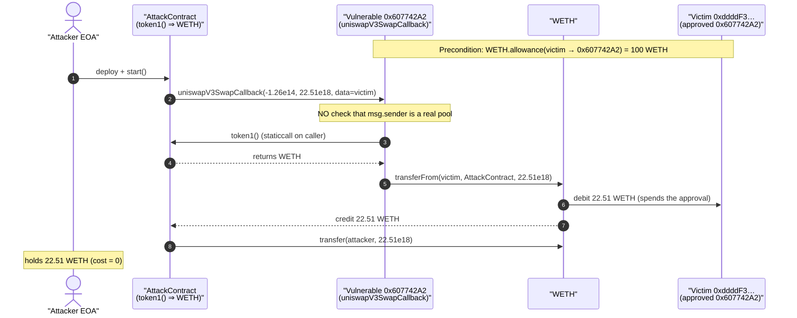
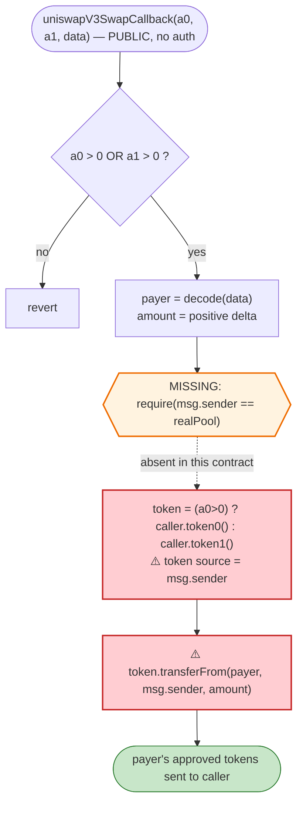
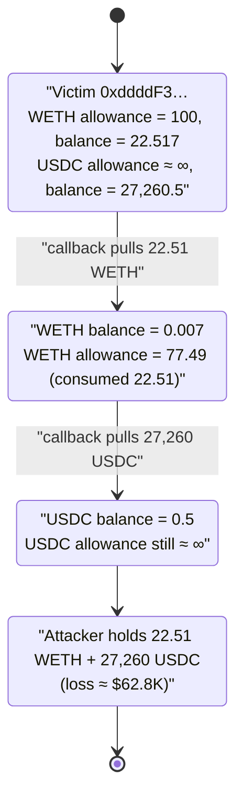

# Unverified `0x607742A2` Exploit — Permissionless `uniswapV3SwapCallback` Approval Drain

> **Vulnerability classes:** vuln/access-control/missing-auth · vuln/access-control/missing-modifier

> One-liner: a "swap-executor" helper exposes a public `uniswapV3SwapCallback` that pulls `token` from an attacker-supplied address and sends it to `msg.sender`, **with no check that the caller is a real Uniswap V3 pool** — so anyone can drain any wallet that has approved the contract.

> **Reproduction:** the PoC compiles & runs in an isolated Foundry project at
> [this project folder](.). Full verbose trace: [output.txt](output.txt).
> The vulnerable contract is **unverified** on BaseScan; the analysis below is reconstructed from the on-chain bytecode (disassembled with `cast disassemble`) and the live execution trace.

---

## Key info

| | |
|---|---|
| **Loss** | ~$62.3K — **22.51 WETH** + **27,260 USDC** drained from a single approving wallet |
| **Vulnerable contract** | `0x607742A2Adea4037020e11Bb67CB98E289E3eC7D` (UNVERIFIED) — [BaseScan](https://basescan.org/address/0x607742a2adea4037020e11bb67cb98e289e3ec7d) |
| **Victim** | EOA `0xddddF3D84a1E94036138Cab7ff35d003c1207A77` (had granted token approvals to the vulnerable contract) |
| **Stolen tokens** | WETH `0x4200…0006`, USDC `0x833589fCD6eDb6E08f4c7C32D4f71b54bdA02913` |
| **Attacker EOA / contract** | `0x780e5cb8de79846f35541b700637057c9ddded68` |
| **Attack tx** | [`0x1a6002d8aee205dff67cb2cdaf60569721655857d49ffe2ce81e10fde8c45946`](https://basescan.org/tx/0x1a6002d8aee205dff67cb2cdaf60569721655857d49ffe2ce81e10fde8c45946) |
| **Chain / block / date** | Base / 28,791,090 / April 2025 |
| **Compiler** | unknown (unverified) — bytecode targets EVM `cancun`/`shanghai`-era opcodes (`PUSH0`) |
| **Bug class** | Missing caller authentication on an externally-callable callback → spending other users' ERC20 approvals (CWE-862, missing access control) |

---

## TL;DR

The contract at `0x607742A2` is a generic "router/swap-executor" helper that interacts with Uniswap-V3-style pools. It implements `uniswapV3SwapCallback(int256 amount0Delta, int256 amount1Delta, bytes data)` — the function a V3 pool invokes *during* a swap to collect the input tokens it is owed.

In a correct router, the callback must verify that `msg.sender` is a genuine, expected pool (so that only the pool can ask the router to pay). **This contract does not.** Its callback:

1. takes a `payer` address straight out of the attacker-controlled `data` blob,
2. reads which token to move by calling `token0()`/`token1()` **on `msg.sender`** (the caller), and
3. executes `token.transferFrom(payer, msg.sender, amount)` — pushing the payer's tokens to whoever called the callback.

Because none of those three inputs is validated against a trusted pool, an attacker simply deploys a tiny contract that returns the desired token from `token1()`, then calls the victim contract's `uniswapV3SwapCallback` directly with:
- `amount1Delta` = the amount to steal,
- `data` = the victim's address.

The callback dutifully runs `WETH.transferFrom(victim, attackerContract, 22.51e18)` and `USDC.transferFrom(victim, attackerContract, 27,260e6)`. The only precondition is that the victim has an open ERC20 allowance to `0x607742A2` — which the victim `0xddddF3…` did (100 WETH and an effectively unlimited USDC allowance).

The PoC reproduces both drains in two near-identical "AttackContract" calls (one per token) and ends holding **22.51 WETH + 27,260.02 USDC**.

---

## Background — what the contract does

`0x607742A2` is an unverified helper exposing exactly two external selectors (from the dispatch table in [output.txt](output.txt) / `cast disassemble`):

| Selector | Signature | Role |
|---|---|---|
| `0x3f1caa96` | a swap-entry helper (takes a `uint64` block deadline; reverts `"Expired"` if `deadline < block.number`) | initiates a swap and routes into the same `transferFrom` helper |
| `0xfa461e33` | `uniswapV3SwapCallback(int256,int256,bytes)` | the Uniswap V3 pay-callback — **the vulnerable entry point** |

In the Uniswap V3 model, `swap()` optimistically sends the output tokens to the recipient and then calls `uniswapV3SwapCallback` back on the initiator, expecting the initiator to transfer in the input tokens it owes before the pool re-checks its balances. The callback is therefore *designed* to move tokens out of the initiator/payer — which is exactly why it **must** authenticate its caller.

The official Uniswap V3 periphery enforces this with `CallbackValidation.verifyCallback(factory, tokenA, tokenB, fee)`, which recomputes the pool's deterministic CREATE2 address and requires `msg.sender == computedPool`. This contract has no such check.

---

## The vulnerable code

The contract is unverified, so the snippets below are decompiled pseudo-Solidity reconstructed from the bytecode (`/tmp` disassembly) and confirmed against the runtime trace. Selector entry points are cited by program-counter offset in the disassembly.

### 1. The callback — entry at PC `0x00e9`

```solidity
// selector 0xfa461e33 — anyone can call this
function uniswapV3SwapCallback(int256 amount0Delta, int256 amount1Delta, bytes calldata data) external {
    // sanity: a V3 callback always has exactly one positive (owed) delta
    require(amount0Delta > 0 || amount1Delta > 0);            // PC 0x00ec / 0x00f5: SGT checks

    // decode the payer out of attacker-supplied data
    (address payer, uint256 _x) = abi.decode(data, (address, uint256));  // PC 0x010f

    // pick the owed amount = the positive delta
    uint256 amountToPay = (amount0Delta < amount1Delta)
        ? uint256(amount1Delta)
        : uint256(amount0Delta);                              // PC 0x0117: SLT branch

    address caller = msg.sender;                              // PC 0x017c: CALLER

    // choose token by which side is positive, asking the CALLER itself
    address token = (amount0Delta > 0)
        ? IPool(caller).token0()                              // PC 0x019e: selector 0x0dfe1681
        : IPool(caller).token1();                             // else-branch: token1()

    // ⚠️ move the payer's tokens straight to msg.sender
    token.transferFrom(payer, caller, amountToPay);           // PC 0x020a: selector 0x23b872dd, recipient = CALLER
}
```

Key dangerous instructions, verbatim from the disassembly:

- `0000017c: CALLER` — the recipient and the `token0/token1` source are both `msg.sender`.
- `0000019e: PUSH4 0x0dfe1681` then `000001c0: STATICCALL` — `token0()`/`token1()` is read **from the caller**, so the attacker decides which token gets pulled by controlling what their own contract returns.
- `0000020a: PUSH4 0x23b872dd` / `00000210: CALLER` / `0000023c: CALL` — `transferFrom(payer, msg.sender, amount)`.

There is **no `factory`/`CREATE2`/`require(msg.sender == pool)` validation anywhere** in the callback path.

### 2. What is missing (reference: Uniswap V3 SwapRouter)

```solidity
// Uniswap V3 periphery — the check this contract omits
function uniswapV3SwapCallback(int256 a0, int256 a1, bytes calldata data) external {
    SwapCallbackData memory d = abi.decode(data, (SwapCallbackData));
    (address tokenIn, address tokenOut, uint24 fee) = d.path.decodeFirstPool();
    CallbackValidation.verifyCallback(factory, tokenIn, tokenOut, fee); // <-- proves msg.sender IS the pool
    ...
    pay(tokenIn, d.payer, msg.sender, amountToPay);
}
```

`verifyCallback` recomputes `PoolAddress.computeAddress(factory, key)` and reverts unless `msg.sender` equals it. Without it, "the pool is asking me to pay" degrades into "anyone who calls me can make me pay with someone else's approval."

---

## Root cause — why it was possible

Three independently attacker-controlled inputs feed a privileged `transferFrom`, and none is anchored to a trusted contract:

1. **Unauthenticated caller.** `uniswapV3SwapCallback` is `external` with no `require(msg.sender == expectedPool)`. The contract trusts that *only a real V3 pool* would ever call it — a trust it never verifies.
2. **Token chosen via the caller.** The token to move is read with `token0()`/`token1()` **on `msg.sender`**. The attacker's own contract returns whatever token it wants stolen (here it returns `token1() == WETH`, then `token1() == USDC`), so the attacker freely selects the asset.
3. **Payer chosen via calldata.** The address whose approval is spent comes verbatim from the `data` argument. The attacker points it at any wallet holding a live allowance to `0x607742A2`.

The terminal sink is `token.transferFrom(payer, msg.sender, amount)`. With (1)+(2)+(3) all attacker-controlled and the recipient hard-wired to `msg.sender`, the function is a universal "spend anyone's approval to me" primitive. The victim `0xddddF3…` had approved `0x607742A2` for 100 WETH and an effectively unlimited USDC amount (presumably to use it as a router), which is all it took.

This is the same class of bug as the well-known Uniswap-V3 / SushiSwap RouteProcessor2 (April 2023) and Multichain-style "callback with no `verifyCallback`" approval drains.

---

## Preconditions

- The victim must have a **non-zero, unspent ERC20 allowance** to `0x607742A2`. Verified on-chain at the fork block:
  - `WETH.allowance(0xddddF3…, 0x607742A2) = 100.0 WETH`
  - `USDC.allowance(0xddddF3…, 0x607742A2) ≈ 9.999e19` (a giant, "infinite-style" approval)
- The victim must hold a balance to drain:
  - `WETH.balanceOf(0xddddF3…) = 22.517 WETH` (22.51 taken)
  - `USDC.balanceOf(0xddddF3…) = 27,260.51 USDC` (27,260 taken)
- No capital, no flash loan, and no specific pool state are required — the attack is a single external call per token. (The PoC needs no `deal`; it spends nothing.)

---

## Step-by-step attack walkthrough (ground-truth numbers from the trace)

The PoC runs two structurally identical sub-attacks, one per token. `AttackContract.token1()` returns WETH; `AttackContract2.token1()` returns USDC. In both, the supplied `data` decodes to `(payer = 0xddddF3D84a1E94036138Cab7ff35d003c1207A77, 0x5ad023c7e400)`; the second word is not load-bearing (the full positive delta is pulled regardless).

| # | Actor / call | Inputs | On-chain effect (from trace) |
|---|---|---|---:|
| 1 | Deploy `AttackContract` whose `token1()` ⇒ WETH | — | attacker-controlled token source |
| 2 | `AttackContract.start()` → `0x607742A2.uniswapV3SwapCallback(-125,859,570,852,398, 22.51e18, data)` | `amount1Delta = 22.51e18`, `payer = 0xddddF3…` | callback selects `token1()=WETH`, runs `WETH.transferFrom(0xddddF3…, AttackContract, 22.51e18)` — emits `Transfer 0xddddF3 → AttackContract, 22.51 WETH` |
| 3 | `WETH.transfer(test, 22.51e18)` | — | attacker forwards loot to EOA; `WETH.balanceOf(test) = 22.51` |
| 4 | Deploy `AttackContract2` whose `token1()` ⇒ USDC | — | second token source |
| 5 | `AttackContract2.start()` → `0x607742A2.uniswapV3SwapCallback(-125,859,570,852,398, 27,260e6, data)` | `amount1Delta = 27,260e6`, `payer = 0xddddF3…` | callback selects `token1()=USDC`, runs `USDC.transferFrom(0xddddF3…, AttackContract2, 27,260e6)` — emits `Transfer 0xddddF3 → AttackContract2, 27,260 USDC` |
| 6 | `USDC.transfer(test, 27,260e6)` | — | `USDC.balanceOf(test) = 27,260.02` |

Final balances logged by the test:

```
WETH:  22.510000000000000000
USDC:  27260.020000
```

(The extra 0.02 USDC is dust the test address already held; the drained amount is exactly 27,260 USDC.)

### Profit / loss accounting

| Asset | Drained from victim | Approx. USD (Apr 2025) |
|---|---:|---:|
| WETH | 22.51 | ≈ $35,560 (@ ~$1,580/ETH) |
| USDC | 27,260.00 | ≈ $27,260 |
| **Total** | | **≈ $62.8K** (matches the reported ~$62.3K) |

Attacker cost: **0** (no capital, no flash loan, no fees beyond gas). The entire loss is the victim's two token approvals.

---

## Diagrams

### Sequence of the attack (WETH leg; USDC leg is identical)



### Control flow inside the callback (where the check should be)



### Victim allowance / balance state evolution



---

## Remediation

1. **Authenticate the callback caller.** The single fix that kills the bug: verify `msg.sender` is the exact pool the swap was initiated against. Use Uniswap's `CallbackValidation.verifyCallback(factory, tokenA, tokenB, fee)` (recomputes the deterministic `CREATE2` pool address) or store the expected pool in transient/locked state at swap-initiation time and `require(msg.sender == s_expectedPool)` inside the callback, then clear it.
2. **Never read the token-to-move from `msg.sender`.** The token and pool identity must be derived from trusted, swap-time parameters (the path the router itself chose), not from `token0()`/`token1()` on the unverified caller.
3. **Do not take the payer from raw calldata in an unauthenticated context.** Once (1) is in place the pool is trusted, but the payer should still be the swap initiator captured at entry, not a free-form `data` field that any caller can set.
4. **Use a re-entrancy / swap-in-progress latch.** Set a flag in the entry function (`0x3f1caa96`) and require it inside the callback, so the callback can never execute outside a swap this contract started.
5. **Users / integrators: revoke stale approvals.** The victim's loss was enabled by a large standing allowance to a router-style helper. Use exact-amount approvals or revoke after use; monitoring for unlimited approvals to non-canonical routers would have flagged this.

---

## How to reproduce

The PoC was extracted into a standalone Foundry project (the umbrella DeFiHackLabs repo has several unrelated PoCs that fail to compile under a whole-project build):

```bash
_shared/run_poc.sh 2025-04-Unverified_6077_exp -vvvvv
```

- RPC: a **Base archive** endpoint is required (fork block 28,791,089 predates standard pruning windows). `foundry.toml` uses `https://base-mainnet.public.blastapi.io`, which serves historical state at that block; Infura's default tier rejected this network/block, and most public Base RPCs (`mainnet.base.org`, `publicnode`) have the block header but **prune state** (`error code -32603: state … is pruned`).
- Result: `[PASS] testExploit()` — ends holding 22.51 WETH and 27,260.02 USDC.

Expected tail:

```
Ran 1 test for test/Unverified_6077_exp.sol:Unverified_6077_exp
[PASS] testExploit() (gas: 1012310)
Logs:
  WETH: 22.510000000000000000
  USDC: 27260.020000

Suite result: ok. 1 passed; 0 failed; 0 skipped
```

---

*Source for this analysis: on-chain bytecode of `0x607742A2` (unverified) disassembled via `cast disassemble`, plus the full execution trace in [output.txt](output.txt). Reference tweet: https://x.com/TenArmorAlert/status/1910662533607796887*
