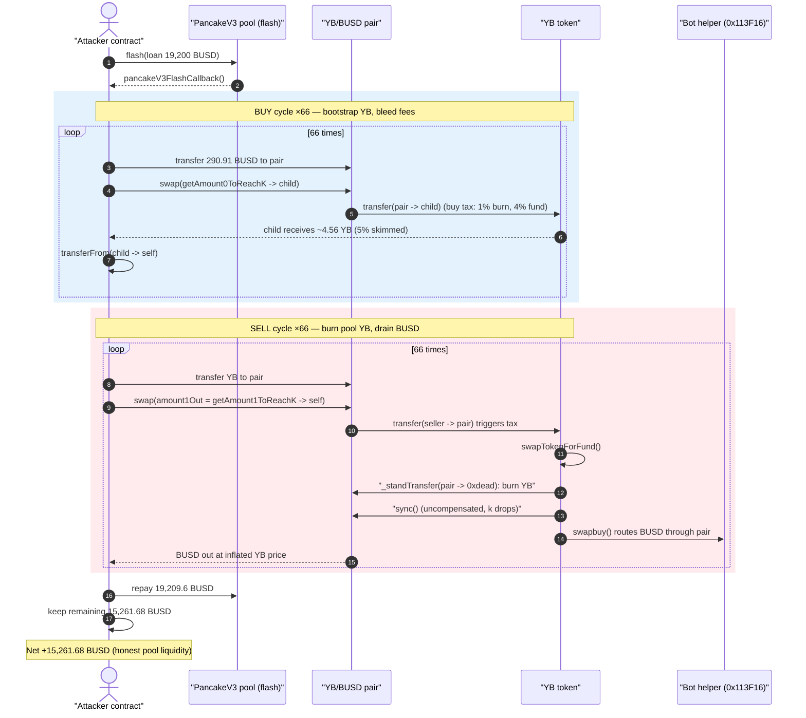
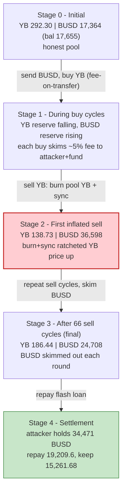
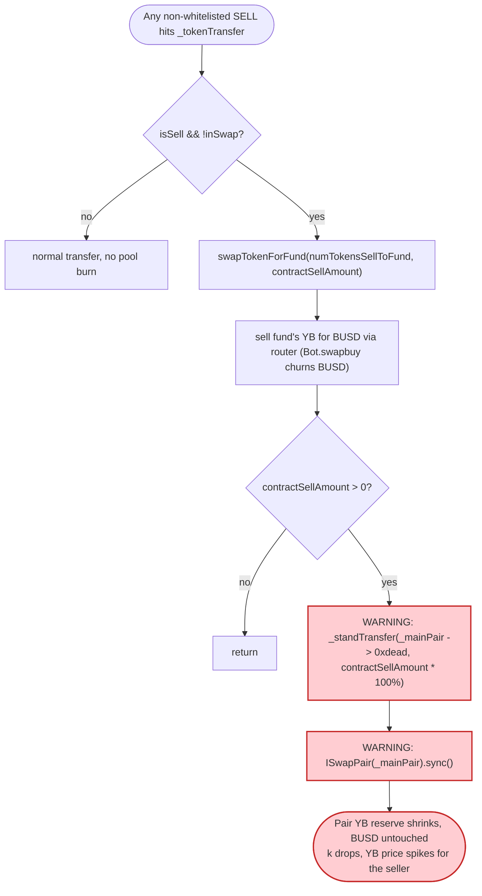
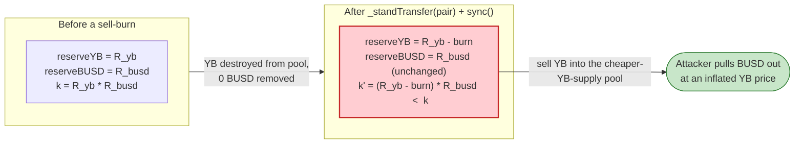

# YB Token Exploit — Sell-Triggered Uncompensated Pool-Reserve Burn (`sync()` price manipulation)

> **Vulnerability classes:** vuln/oracle/price-manipulation · vuln/defi/slippage

> **Reproduction:** the PoC compiles & runs in an isolated Foundry project at
> [this project folder](.) (the umbrella DeFiHackLabs repo contains many unrelated
> PoCs that do not whole-compile, so this one was extracted).
> Full verbose trace: [output.txt](output.txt).
> Verified vulnerable source: [sources/YB_042273/YB.sol](sources/YB_042273/YB.sol).
> Victim AMM pair source: [sources/PancakePair_38231F/PancakePair.sol](sources/PancakePair_38231F/PancakePair.sol).

---

## Key info

| | |
|---|---|
| **Loss** | **15,261.68 BUSD** (~$15.3K) drained from the YB/BUSD PancakeSwap pair |
| **Vulnerable contract** | `YB` token — [`0x04227350eDA8Cb8b1cFb84c727906Cb3CcBff547`](https://bscscan.com/address/0x04227350eDA8Cb8b1cFb84c727906Cb3CcBff547#code) (the PoC header also names the off-chain "Bot" helper `0x113F16…`, but the exploitable logic is entirely in the YB token) |
| **Victim pool** | YB/BUSD pair (`_mainPair`) — `0x38231F8Eb79208192054BE60Cb5965e34668350A` |
| **Attacker EOA** | [`0x00000000b7da455fed1553c4639c4b29983d8538`](https://bscscan.com/address/0x00000000b7da455fed1553c4639c4b29983d8538) |
| **Attacker contract** | [`0xbdcd584ec7b767a58ad6a4c732542b026dceaa35`](https://bscscan.com/address/0xbdcd584ec7b767a58ad6a4c732542b026dceaa35) |
| **Attack tx** | [`0xe1e7fa81c3761e2698aa83e084f7dd4a1ff907bcfc4a612d54d92175d4e8a28b`](https://bscscan.com/tx/0xe1e7fa81c3761e2698aa83e084f7dd4a1ff907bcfc4a612d54d92175d4e8a28b) |
| **Flash-loan source** | PancakeV3 pool `0x36696169C63e42cd08ce11f5deeBbCeBae652050` (19,200 BUSD, 0.05% fee) |
| **Chain / block / date** | BSC / 48,415,276 (forked at `-1`) / April 2025 |
| **Compiler** | Solidity ^0.8.19 (token), ^0.8.13 (PoC) |
| **Bug class** | Broken AMM `x·y=k` invariant via an uncompensated, fee-driven reserve burn + `sync()` on every sell |

---

## TL;DR

The `YB` token's transfer-fee machinery burns YB **directly out of its own AMM pair's balance** and
then calls `pair.sync()` on **every taxed sell**. The relevant call lives in `swapTokenForFund`:

```solidity
if (contractSellAmount > 0) {
    _standTransfer(_mainPair, address(0xdead), (contractSellAmount * _sellBurnRate) / 10000);
    ISwapPair(_mainPair).sync();
}
```
([YB.sol:891-898](sources/YB_042273/YB.sol#L891-L898))

`_standTransfer` debits the pair's YB balance and credits `0xdead` ([YB.sol:706-713](sources/YB_042273/YB.sol#L706-L713)),
then `sync()` forces the pair to accept the reduced YB balance as its new reserve. **No BUSD leaves the
pair.** That is an uncompensated deletion of one side of the pool — it shifts `k` and inflates YB's
marginal price in the seller's favor, for free, on a path that any sell triggers.

Rather than do it once, the attacker iterates **66 buy + 66 sell** micro-cycles inside a single flash
loan. Each cycle:

1. Sends a slice of the flash-loaned BUSD straight to the pair and uses a hand-computed "amount that
   exactly restores K" (`getAmount0ToReachK`) to buy YB out of the pool ([YBToken_exp.sol:60-79](test/YBToken_exp.sol#L60-L79)).
   The YB buy itself is fee-on-transfer (1% burned to `0x0`, 4% to the fund), so the pool's *honest*
   value bleeds a little to the attacker each time.
2. Sells YB back into the pool. The sell trips `swapTokenForFund`, which burns YB from the pair and
   `sync()`s — **ratcheting the YB/BUSD price up** — and the fund's accumulated YB is sold for BUSD
   (via the `Bot.swapbuy` helper), pushing even more BUSD into and back out of the pair.

After 66 cycles the attacker holds 34,471 BUSD, repays the 19,209.6 BUSD flash loan, and walks away
with **15,261.68 BUSD** — the honest BUSD liquidity that was in the YB/BUSD pool.

---

## Background — what YB does

`YB` ([source](sources/YB_042273/YB.sol)) is a typical BSC "tax token": a 3,000-supply ERC20 with
buy/sell taxes, LP-reward bookkeeping, and a fund/burn redistribution engine. The pieces that matter
for this exploit:

- **Buy/sell tax.** `_tokenTransfer` ([YB.sol:717-798](sources/YB_042273/YB.sol#L717-L798)) charges,
  on a buy (`from == pair`) or sell (`to == pair`), a destroy fee to `address(0x0)` and a fund fee to
  the `_feeDistributor`. At the fork block `_totalBuyFees = _totalSellFees = 500` bps (5%) with
  `_buyDestroyFee = _sellDestroyFee = 100` bps (1%) ([YB.sol:324-332](sources/YB_042273/YB.sol#L324-L332)).
  So a buy out of the pool to a fresh address loses ~5% to fees — the destroy portion is *burned from
  the recipient*, but it is the pool's tokens that funded the swap.
- **Sell-side "swap for fund" + LP burn.** When a sell happens and we are not already `inSwap`,
  `_tokenTransfer` calls `swapTokenForFund` ([YB.sol:753-780](sources/YB_042273/YB.sol#L753-L799)).
  That routine sells the fund's accumulated YB for BUSD through the router and then, crucially,
  **burns YB out of `_mainPair` and `sync()`s it** ([YB.sol:891-898](sources/YB_042273/YB.sol#L891-L898)).
- **Configurable burn rate.** The burned amount is `contractSellAmount * _sellBurnRate / 10000`, with
  `_sellRate = 1000` (10%) and `_sellBurnRate = 10000` (**100%**)
  ([YB.sol:1153-1162](sources/YB_042273/YB.sol#L1153-L1162)). So every taxed sell deletes
  `10% of the sell amount` worth of YB straight from the pool's reserve.
- **Off-chain "Bot".** `bot.swapbuy(...)` / `bot.swapsell(...)` fire from within `_tokenTransfer`
  ([YB.sol:781-795](sources/YB_042273/YB.sol#L781-L795)). The bot (the PoC's nominal "vulnerable
  contract" `0x113F16…`, source unverified) simply does extra router swaps that move more BUSD through
  the pair on each sell — amplifying the price ratchet but not itself the root cause.

The starting YB/BUSD pool at the fork block (first `getReserves` in the trace,
[output.txt:48-49](output.txt#L48)) held:

| | |
|---|---|
| `reserve0` (YB) | 292.295 YB |
| `reserve1` (BUSD) | 17,364.37 BUSD |
| pool BUSD balance | 17,655.28 BUSD ← the prize |

A pool with only ~17.7K BUSD of liquidity; the attack siphons 15.3K of it.

---

## The vulnerable code

### 1. Every sell burns YB out of the pair, then `sync()`s

```solidity
function swapTokenForFund(uint256 tokenAmount, uint256 contractSellAmount) private lockTheSwap {
    ...
    if (contractSellAmount > 0) {
        _standTransfer(
            _mainPair,
            address(0xdead),
            (contractSellAmount * _sellBurnRate) / 10000   // _sellBurnRate = 10000 = 100%
        );
        ISwapPair(_mainPair).sync();                         // ⚠️ force pair to adopt the smaller YB reserve
    }
}
```
([YB.sol:817-899](sources/YB_042273/YB.sol#L817-L899))

`_standTransfer` is a raw balance edit — it moves YB from the pair to `0xdead` with **no matching BUSD
movement**:

```solidity
function _standTransfer(address sender, address recipient, uint256 tAmount) private {
    _balances[sender] = _balances[sender] - tAmount;   // sender == _mainPair
    _takeTransfer(sender, recipient, tAmount);          // recipient == 0xdead
}
```
([YB.sol:706-713](sources/YB_042273/YB.sol#L706-L713))

### 2. The AMM trusts `sync()` and only enforces `k` inside `swap()`

```solidity
function sync() external lock {
    _update(IERC20(token0).balanceOf(address(this)),
            IERC20(token1).balanceOf(address(this)),
            reserve0, reserve1);
}
```
([PancakePair.sol:491-492](sources/PancakePair_38231F/PancakePair.sol#L491-L492))

`swap()` only checks `balance0Adjusted · balance1Adjusted ≥ reserve0 · reserve1 · 10000²`
([PancakePair.sol:475](sources/PancakePair_38231F/PancakePair.sol#L475)). It has **no defense** against
a token that quietly deletes the pair's balance and re-`sync()`s a smaller reserve between swaps — the
reserve simply *is* whatever the token says it is after the burn.

### 3. The fee-on-transfer buy that bootstraps the attacker's YB

On the optimistic transfer inside `swap()`, the pool sends `4.804e18` YB to the attacker's child
contract, but YB's buy-tax burns/diverts ~5% so only `4.564e18` arrives — see the three `Transfer`
events at [output.txt:54-56](output.txt#L54): `4.804e16` burned to `0x0`, `1.921e17` to the fund
`0x81e1…`, `4.564e18` to the child. The attacker harvests the child's YB via the pre-approved
`transferFrom` ([output.txt:78](output.txt#L78), enabled by `AttackerCChild`'s constructor approval at
[YBToken_exp.sol:128-132](test/YBToken_exp.sol#L128-L132)).

---

## Root cause — why it was possible

The same class as classic "burn-from-pool" token bugs: **a token must never destroy balances held by
its own AMM pair and then `sync()`**.

> A Uniswap-V2/PancakeSwap pair prices assets purely from its reserves and only enforces `x·y ≥ k`
> *inside `swap()`*. `sync()` exists to reconcile balances the pair can't otherwise observe. YB abuses
> this: it `_standTransfer`s YB out of the pair to `0xdead` and `sync()`s, asserting "your YB reserve
> is now this much smaller." No BUSD leaves. `k` drops and YB's price spikes — and this happens on
> **every taxed sell**, a fully permissionless path.

The compounding design decisions:

1. **Uncompensated reserve burn on a public path.** `swapTokenForFund` → `_standTransfer(_mainPair, 0xdead, …)` + `sync()` runs as a side-effect of any non-whitelisted sell. The attacker chooses exactly when and how often it fires by selling.
2. **Burn rate is 100% of the sell-derived amount** (`_sellBurnRate = 10000`), so each sell removes a meaningful slice of the pool's YB reserve, monotonically inflating YB's price relative to BUSD.
3. **Asymmetric fee-on-transfer.** Buys lose ~5% (1% to `0x0`, 4% to the fund) but the *destroy* portion is removed from circulation while the pool still owes BUSD — every round bleeds honest pool value toward the attacker and the fund-sale path (`Bot.swapbuy`) recycles that BUSD back through the pair.
4. **Hand-tuned K restoration.** `getAmount0ToReachK` / `getAmount1ToReachK` ([YBToken_exp.sol:102-125](test/YBToken_exp.sol#L102-L125)) compute the maximal YB/BUSD out that still satisfies the pair's K check after the manipulated balances, so each micro-swap extracts the most value the invariant allows.
5. **Iterate under one flash loan.** 66 buy + 66 sell cycles ratchet the price and skim the pool; the whole thing is atomic and flash-loan-funded, so no capital is at risk.

The LP-reward / fund bookkeeping (the `_feeDistributor`, `processLPReward`, the `Bot`) only *amplify*
the leak by shoving more BUSD through the pair on each sell — they are not required for the core
invariant break, which is the `_burn-from-pool + sync()` itself.

---

## Preconditions

- A live YB/BUSD PancakeSwap pair with non-trivial BUSD liquidity (here 17,655 BUSD).
- `swapTokenForFund`'s sell path reachable — i.e. the attacker's address is **not** fee-whitelisted, so
  taxed-sell logic (and therefore the pool burn + `sync()`) runs. The attacker contract is a fresh,
  non-whitelisted contract, satisfying this.
- A flash-loan source for BUSD to size the swaps; the attacker borrowed 19,200 BUSD from a PancakeV3
  pool ([YBToken_exp.sol:44-49](test/YBToken_exp.sol#L44-L49)). The whole operation is repaid in the
  same transaction.
- No price oracle / TWAP guarding the YB/BUSD price; the pool's instantaneous reserve is the only
  pricing source.

---

## Attack walkthrough (with on-chain numbers from the trace)

The pair's `token0 = YB`, `token1 = BUSD`, so `reserve0 = YB`, `reserve1 = BUSD`. All figures are read
directly from the `Sync`/`Swap` events in [output.txt](output.txt).

| # | Step | YB reserve | BUSD reserve | Source |
|---|------|-----------:|-------------:|--------|
| 0 | **Flash-loan 19,200 BUSD** from PancakeV3 (fee 9.6 BUSD) | 292.30 | 17,364.37 | [output.txt:34](output.txt#L34), [:48-49](output.txt#L48) |
| 1 | **Buy cycle (×66 begins).** Send `290.91 BUSD` (= 19,200/66) to the pair, then `swap()` out the exact "reach-K" YB amount `4.804e18` to a child. Buy-tax burns `0.048` YB to `0x0`, sends `0.192` to fund, `4.564` to child | 287.49 | 17,655.28 | [output.txt:42-70](output.txt#L42) |
| 1b| Harvest child YB via `transferFrom`; repeat — each buy pushes BUSD in and pulls fee-skimmed YB out | falling | rising | [output.txt:78](output.txt#L78), loop to [:3270](output.txt#L3270) |
| 2 | **Sell cycle (×66 begins).** Transfer YB to the pair; the taxed sell fires `swapTokenForFund`: burn `0.2206` YB from the pair to `0xdead` + `sync()`, and `Bot.swapbuy` routes 674.8 BUSD through the pair | manipulated down | churned | [output.txt:3273-3355](output.txt#L3273), [:3358-3400](output.txt#L3358) |
| 2b| `swap()` out BUSD at the inflated YB price: first sell takes `559.83 BUSD` out for `2.095 YB` in | 138.73 | 36,598.55 | [output.txt:3648-3660](output.txt#L3648) |
| 3 | …66 sell cycles total; pool BUSD ratchets up then is skimmed each round | 186.44 | 24,708.90 (final) | [output.txt:12573](output.txt#L12573) |
| 4 | **Settle.** Attacker contract now holds `34,471.28 BUSD`; repay `19,209.6 BUSD` to the V3 pool | — | — | [output.txt:12579-12581](output.txt#L12579) |
| 5 | **Profit** `15,261.68 BUSD` forwarded to the attacker EOA | — | — | [output.txt:12597-12606](output.txt#L12597) |

The two helper formulas the attacker uses each cycle
([YBToken_exp.sol:102-125](test/YBToken_exp.sol#L102-L125)) reproduce the pair's own
`getAmountOut`/K math so that, after the fee-on-transfer skim and the burn-and-`sync()`, the chosen
`amount0Out`/`amount1Out` lands the pool *exactly* on the K boundary and extracts the maximum the
invariant permits.

### Profit accounting (BUSD)

| Item | Amount (BUSD) |
|---|---:|
| Flash-loan principal borrowed | 19,200.00 |
| Flash-loan fee (0.05%) | 9.60 |
| **Total to repay** | **19,209.60** |
| Attacker contract BUSD after 66 sell cycles | 34,471.28 |
| − Repaid to PancakeV3 pool | −19,209.60 |
| **Net profit (to attacker EOA)** | **+15,261.68** |

The 15,261.68 BUSD profit is the honest BUSD liquidity that real LPs had supplied to the YB/BUSD pool;
the attacker walked it out using the token's own self-burning fee engine.

---

## Diagrams

### Sequence of one full attack



### Pool reserve evolution (representative stages)



### The flaw inside `swapTokenForFund`



### Why the burn is theft: constant-product before vs. after a sell-burn



---

## Remediation

1. **Never burn from the liquidity pool.** Remove the `_standTransfer(_mainPair, 0xdead, …)` +
   `ISwapPair(_mainPair).sync()` block in `swapTokenForFund`
   ([YB.sol:891-898](sources/YB_042273/YB.sol#L891-L898)). A burn must only destroy tokens the protocol
   *owns* (its own balance / treasury). Deleting pair balances and `sync()`-ing is an uncompensated
   one-sided reserve removal that always breaks `x·y=k` in a trader's favor.
2. **Drop the 100% sell-burn rate.** If deflation is a product goal, route it through the pair's own
   `burn()` (LP redemption) so both reserves move together and `k` is preserved, rather than a
   side-channel single-sided burn. `_sellBurnRate = 10000`
   ([YB.sol:1154](sources/YB_042273/YB.sol#L1154)) makes the leak large on every sell.
3. **Don't run `sync()`-able state changes inside transfer hooks.** Any token operation that mutates
   the AMM pair's balance during a swap must be impossible to weaponize. Cap single-operation reserve
   impact and reject mutations that move a reserve by more than a small percentage in one call.
4. **Use an oracle/TWAP for any value decision keyed off pool reserves.** The fund-sale path and the
   bot price off the instantaneous, manipulable reserve; a manipulation-resistant price source removes
   the recyclable BUSD amplification.
5. **Whitelist-independent invariant guard.** The taxed-sell path is reachable by any non-whitelisted
   address; relying on fee-whitelisting for safety is not a security boundary.

---

## How to reproduce

The PoC was extracted into a standalone Foundry project (the umbrella DeFiHackLabs repo has many
unrelated PoCs that fail to whole-compile under `forge test`):

```bash
_shared/run_poc.sh 2025-04-YBToken_exp -vvvvv
```

- RPC: a **BSC archive** endpoint is required (block ~48.4M). `foundry.toml` uses
  `https://bsc-mainnet.public.blastapi.io`, which serves historical state at that block; the default
  `onfinality` public endpoint rate-limits (HTTP 429) and was swapped out.
- Result: `[PASS] testPoC()` with `Profit: 15261 BUSD`.

Expected tail:

```
Ran 1 test for test/YBToken_exp.sol:YBToken_exp
[PASS] testPoC() (gas: 21439151)
  Profit: 15261 BUSD
Suite result: ok. 1 passed; 0 failed; 0 skipped; finished in 152.00s
```

---

*Reference: DeFiHackLabs `src/test/2025-04/YBToken_exp.sol`; PoC author [@rotcivegaf](https://twitter.com/rotcivegaf).
Loss figure from the PoC header: 15,261.68 BUSD, matched to the wei by the live fork trace.*
