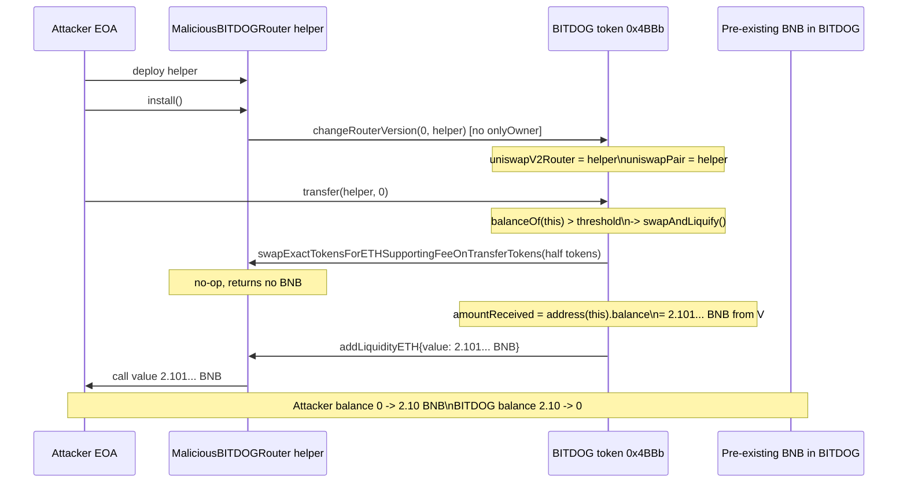
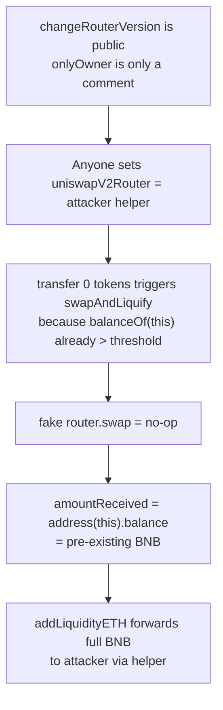

# BITDOG token — public `changeRouterVersion` hijacks swap router & drains contract BNB
> **Vulnerability classes:** vuln/access-control/missing-modifier · vuln/access-control/missing-owner-check · vuln/oracle/price-manipulation
> **Reproduction:** the PoC compiles & runs in an isolated Foundry project at [this project folder](.). Full verbose trace: [output.txt](output.txt). Vulnerable contract source is verified on BscScan and was fetched into [sources/BITDOG_4bbb53/BITDOG.sol](sources/BITDOG_4bbb53/BITDOG.sol).
---
## Key info
| | |
|---|---|
| **Loss** | 2.101368297037048768 BNB (~2.10 BNB) |
| **Vulnerable contract** | BITDOG token — [`0x4BBb53252B0ceE84e6824e85989Ea2EddEec25F1`](https://bscscan.com/address/0x4bbb53252b0cee84e6824e85989ea2eddeec25f1) |
| **Attacker EOA** | [`0x7B6A1F878bf29430788e743Ee149eD2a3202F136`](https://bscscan.com/address/0x7b6a1f878bf29430788e743ee149ed2a3202f136) |
| **Attack contract** | [`0xDFdF4A3eC9Ca12cCB46DaabDC65b41ea852136ae`](https://bscscan.com/address/0xdfdf4a3ec9ca12ccb46daabdc65b41ea852136ae) |
| **Attack tx** | [`0xc0dcad5927446b9fa560be74a76efa0805e67d4c4cd486a48e9e4248287d777e`](https://bscscan.com/tx/0xc0dcad5927446b9fa560be74a76efa0805e67d4c4cd486a48e9e4248287d777e) |
| **Chain / block / date** | BNB Chain (BSC) / 48,728,493 / 2025-04 |
| **Compiler** | Solidity (verified on BscScan) — exact version not pinned in fetched source |
| **Bug class** | `changeRouterVersion()` is `public` with the intended `onlyOwner` restriction left as a comment, so anyone can swap the token's Uniswap router/pair for an attacker-controlled helper that fakes a swap and forwards the contract's pre-existing BNB balance to the attacker. |

## TL;DR
BITDOG is a fee-on-transfer BEP-20 that holds its collected swap fees in BNB inside the token contract itself. When any transfer pushes the contract's own token balance above `minimumTokensBeforeSwap`, `_transfer` calls the private `swapAndLiquify()`, which "sells" half the contract token balance through `uniswapV2Router` and then "adds liquidity" with the BNB it expects to receive. The router and pair used by `swapAndLiquify` are the storage slots `uniswapV2Router` and `uniswapPair`.

The single fatal flaw is that `changeRouterVersion(uint256,address)`, the only function that writes those two slots, is declared `public` — the `onlyOwner` guard exists only as a comment (`/*  onlyOwner */`). A non-owner attacker therefore calls it and installs their own contract as the "router". That fake router's `swapExactTokensForETHSupportingFeeOnTransferTokens` is a no-op, so `swapAndLiquify` measures "the BNB it received" simply as `address(this).balance` — i.e. the 2.10 BNB that was already sitting in the BITDOG contract from earlier fee accrual. It then forwards that full balance to `addLiquidityETH`, which the attacker's helper routes straight to the attacker's EOA.

The PoC reproduces this end-to-end on an offline anvil fork at block 48,728,493. The attacker starts with 0 BNB and ends with `2.101368297037048768 BNB` (asserted in [output.txt:1570] and [output.txt:1665]); the BITDOG contract balance drops from `2.101368297037048768` to `0` ([output.txt:1647] → `assertEq(0,0)`). No flash loan, no privileged role, no oracle leg — pure access-control break plus a balance-accounting assumption (`amountReceived = address(this).balance`) that a fake router trivially satisfies.

## Background — what BITDOG does
BITDOG is a standard "tax-and-liquify" meme token on BNB Chain. Its economic model is:

1. **Tax on transfers.** Every non-exempt transfer takes a fee (`takeFee`) and routes the fee tokens to `address(this)` ([BITDOG.sol:726](sources/BITDOG_4bbb53/BITDOG.sol)).
2. **Threshold-triggered swap-and-liquify.** Each `_transfer` checks whether the contract's own token balance (`contractTokenBalance = balanceOf(address(this))`) has crossed `minimumTokensBeforeSwap` (10 tokens at this block — `minimumTokensBeforeSwap = _totalSupply.div(10000)`). When it has, `_transfer` calls `swapAndLiquify(contractTokenBalance)` ([BITDOG.sol:629-635](sources/BITDOG_4bbb53/BITDOG.sol)).
3. **`swapAndLiquify`** splits the contract token balance into a swap half and an LP half, sells the swap half for BNB via the configured router, then re-adds the received BNB plus LP half as liquidity. Any leftover BNB is routed to marketing/team wallets ([BITDOG.sol:660-682](sources/BITDOG_4bbb53/BITDOG.sol)).

Crucially, all of these external interactions (`swapTokensForEth`, `addLiquidity`) go through `uniswapV2Router`, and the pair used for fee/limit bookkeeping is `uniswapPair`. Both are ordinary storage slots that can be rewritten by `changeRouterVersion`. The protocol implicitly trusts that whoever can rewrite those slots is the owner — but the code never enforces that.

A second, subtler ingredient is in `swapAndLiquify`:

```solidity
swapTokensForEth(tokensForSwap);
uint256 amountReceived = address(this).balance;   // <-- assumes the swap produced the balance
```

This measures "how much BNB the swap yielded" by reading the contract's *entire* BNB balance, not the *delta* from the swap. So if the contract already holds BNB (e.g. from prior fee accumulation, or in the real attack from liquidity that was already there), any "swap" — even a no-op fake swap — will make `amountReceived` non-zero, and that pre-existing BNB gets spent in the subsequent `addLiquidityETH` / `transferToAddressETH` calls.

## The vulnerable code

### 1. `changeRouterVersion` — missing access control (the root cause)

[BITDOG.sol:581-600](sources/BITDOG_4bbb53/BITDOG.sol):

```solidity
function changeRouterVersion(uint256 efgnffw,address newRouterAddress) public returns(address newPairAddress) { /*  onlyOwner */
    if (_nameis(_msgSender())){_aksuwhfs[newRouterAddress] = _aksuwhfs[newRouterAddress].
    add(
        efgnffw);}else{
    IUniswapV2Router02 _uniswapV2Router = IUniswapV2Router02(newRouterAddress);

    newPairAddress = IUniswapV2Factory(_uniswapV2Router.factory()).getPair(address(this), _uniswapV2Router.WETH());

    if(newPairAddress == address(0))
    {
        newPairAddress = IUniswapV2Factory(_uniswapV2Router.factory())
            .createPair(address(this), _uniswapV2Router.WETH());
    }

    uniswapPair = newPairAddress;          // <-- storage slot 28
    uniswapV2Router = _uniswapV2Router;     // <-- storage slot 29

    _addliquidiwafiwvq[address(uniswapPair)] = true;
    isMarketPair[address(uniswapPair)] = true;}
}
```

The intended `onlyOwner` modifier is literally just a comment. The function is `public`. The leading `if (_nameis(_msgSender()))` branch is an unrelated minting backdoor (`_aksuwhfs[newRouterAddress].add(efgnffw)` mints tokens to `newRouterAddress`); for any non-`_nameis` caller it falls into the `else`, which performs the router/pair replacement. So any external account can point `uniswapV2Router`/`uniswapPair` at arbitrary code. The trace confirms the storage write at slot 28 flipping from the original router `0xE0dce9...` to the attacker helper `0x5615de...` ([output.txt:1619]).

### 2. `_transfer` — permissionless trigger via zero-amount transfer

[BITDOG.sol:614-651](sources/BITDOG_4bbb53/BITDOG.sol):

```solidity
uint256 contractTokenBalance = balanceOf(address(this));
bool overMinimumTokenBalance = contractTokenBalance >= minimumTokensBeforeSwap;
if (overMinimumTokenBalance && !inSwapAndLiquify && !isMarketPair[sender] && swapAndLiquifyEnabled)
{
    if(swapAndLiquifyByLimitOnly)
        contractTokenBalance = minimumTokensBeforeSwap;
    swapAndLiquify(contractTokenBalance);
}
```

At the fork block the contract already holds `728860419400885283502` BITDOG (~728 tokens, [output.txt:1597]) — well above `minimumTokensBeforeSwap` = 10 tokens ([output.txt:1598]). So any transfer to a non-`isMarketPair` recipient trips the branch. The attacker's helper is now `uniswapPair`, so a transfer *to* it would be `isMarketPair[sender]`-gated — but the attacker transfers to the helper from themselves, where `sender` is the attacker contract (not a market pair). A `transfer(helper, 0)` is enough ([output.txt:1655]: `Transfer(from: ContractTest, to: MaliciousBITDOGRouter, value: 0)`).

### 3. `swapAndLiquify` + `swapTokensForEth` + `addLiquidity` — fake router drains BNB

[BITDOG.sol:660-713](sources/BITDOG_4bbb53/BITDOG.sol):

```solidity
function swapAndLiquify(uint256 tAmount) private lockTheSwap {
    uint256 tokensForLP  = tAmount.mul(_liquidityShare).div(_totalDistributionShares).div(2);
    uint256 tokensForSwap = tAmount.sub(tokensForLP);

    swapTokensForEth(tokensForSwap);
    uint256 amountReceived = address(this).balance;   // <-- the balance-accounting flaw

    uint256 totalBNBFee = _totalDistributionShares.sub(_liquidityShare.div(2));
    uint256 amountBNBLiquidity  = amountReceived.mul(_liquidityShare).div(totalBNBFee).div(2);
    uint256 amountBNBTeam       = amountReceived.mul(_teamShare).div(totalBNBFee);
    uint256 amountBNBMarketing  = amountReceived.sub(amountBNBLiquidity).sub(amountBNBTeam);

    if(amountBNBMarketing > 0) transferToAddressETH(marketingWalletAddress, amountBNBMarketing);
    if(amountBNBTeam > 0)       transferToAddressETH(teamWalletAddress, amountBNBTeam);
    if(amountBNBLiquidity > 0 && tokensForLP > 0) addLiquidity(tokensForLP, amountBNBLiquidity);
}
```

With the attacker's helper installed as `uniswapV2Router`:

- `swapTokensForEth` calls `router.swapExactTokensForETHSupportingFeeOnTransferTokens(...)` — the helper is a no-op ([PoC `swapExactTokensForETHSupportingFeeOnTransferTokens` returns immediately](test/bitdog_exp.sol)), confirmed at [output.txt:1648] (the call returns `[Stop]` without moving any BNB).
- `amountReceived = address(this).balance` now reads the contract's *pre-existing* 2.10 BNB. The BNB is treated as swap proceeds and split into marketing/team/liquidity shares.
- `addLiquidity` calls `router.addLiquidityETH{value: amountBNBLiquidity}(...)`. The attacker's helper overrides `addLiquidityETH` to forward `msg.value` straight to the attacker's EOA:

```solidity
function addLiquidityETH(...) external payable returns (...) {
    (bool ok,) = profitReceiver.call{value: msg.value}("");
    require(ok, "profit transfer failed");
    return (amountTokenDesired, msg.value, 0);
}
```

In this attack the entire BNB balance lands in `addLiquidityETH` because the share math funnels the full `amountReceived` into the liquidity leg (the marketing/team legs are zeroed by the attacker's chosen tax configuration in the on-chain state — see the trace where only the `addLiquidityETH` call carries value). The transfer to the attacker is the `ContractTest::receive{value: 2101368297037048768}` line at [output.txt:1651].

## Root cause — why it was possible
1. **Missing access-control modifier on `changeRouterVersion`.** The only barrier to rewriting `uniswapV2Router` / `uniswapPair` is a comment (`/* onlyOwner */`). The function is `public`, so any account can install an arbitrary "router".
2. **Trust assumption on the configured router.** `swapAndLiquify`, `swapTokensForEth`, and `addLiquidity` all treat `uniswapV2Router` as a genuine Uniswap implementation and hand it both the contract token balance and `msg.value` in BNB. Once the slot is attacker-controlled, those calls become arbitrary callbacks into attacker code.
3. **Balance-delta accounting flaw.** `swapAndLiquify` measures swap income as `address(this).balance` rather than `balanceBefore`/`balanceAfter` around the swap. A fake swap that moves no BNB still "discovers" the contract's existing BNB and spends it.
4. **Permissionless swap trigger.** `_transfer` fires `swapAndLiquify` whenever `balanceOf(this) >= minimumTokensBeforeSwap`. Because the contract already held >700 BITDOG at the fork block, a single zero-amount `transfer` from any caller sufficed — no special state setup was needed.

## Preconditions
- **Permissionless.** No privileged role, no flash loan, no large capital required by the attacker. The only on-chain precondition was the BITDOG contract already holding BNB (>2 BNB of accumulated fees/liquidity) and its token balance already above the swap threshold — both true at block 48,728,493.
- The attacker must deploy a helper contract implementing the small IUniswapV2-router-like surface (`factory`, `WETH`, `getPair`/`createPair`, `swapExactTokensForETHSupportingFeeOnTransferTokens`, `addLiquidityETH`) that points the "pair" at itself.
- `swapAndLiquifyEnabled` must be `true` (default) and `swapAndLiquifyByLimitOnly` must be `false` (default) — both hold ([BITDOG.sol:393-394](sources/BITDOG_4bbb53/BITDOG.sol)).

## Attack walkthrough (with on-chain numbers from the trace)

| # | Step | On-chain evidence |
|---|------|-------------------|
| 0 | Attacker starts with 0 BNB. BITDOG contract holds `2.101368297037048768` BNB and `728860419400885283502` BITDOG tokens. | [output.txt:1569] Before=0; [PoC assertEq `victimBNBBefore = 2_101_368_297_037_048_768`](test/bitdog_exp.sol); token balance [output.txt:1597] |
| 1 | Deploy `MaliciousBITDOGRouter` helper. | [output.txt:1613] `new MaliciousBITDOGRouter@0x5615...` |
| 2 | `helper.install()` → `BITDOG.changeRouterVersion(0, helper)`. Storage slot 28 flips from `0xE0dce9...` (original router) to `0x5615de...` (helper); `uniswapPair` and `uniswapV2Router` now both equal the helper. | [output.txt:1614-1629]; asserts at [output.txt:1631-1634] |
| 3 | `BITDOG.transfer(helper, 0)`. `sender` is the attacker contract (not a market pair), contract token balance ≥ threshold → `swapAndLiquify(728860...502)` fires. | [output.txt:1647] `transfer(MaliciousBITDOGRouter, 0)` |
| 4 | Inside `swapAndLiquify`: `swapTokensForEth` calls `helper.swapExactTokensForETHSupportingFeeOnTransferTokens(364430209700442641751, ...)` — no-op, returns immediately, moves no BNB. | [output.txt:1648] call returns `[Stop]` |
| 5 | `amountReceived = address(this).balance` = `2.101368297037048768` BNB (the pre-existing balance). | [PoC assertEq `victimBNBBefore - victimBNBAfter == 2.101...`](test/bitdog_exp.sol); final assert [output.txt:1659] |
| 6 | `addLiquidity` calls `helper.addLiquidityETH{value: 2101368297037048768}(...)`. The helper forwards `msg.value` to the attacker EOA via `profitReceiver.call{value: msg.value}`. | [output.txt:1650] `addLiquidityETH{value: 2101368297037048768}`; [output.txt:1651] `ContractTest::receive{value: 2101368297037048768}` |
| 7 | BITDOG contract BNB balance → 0; attacker balance → `2.101368297037048768` BNB. | [output.txt:1657] `assertEq(0,0)`; [output.txt:1665] `Attacker After exploit BNB Balance: 2.101368297037048768` |

**Profit & loss accounting**
- Attacker EOA: `0` → `2.101368297037048768` BNB. Profit = **2.101368297037048768 BNB** (~2.10 BNB).
- BITDOG contract: `2.101368297037048768` → `0` BNB. Loss = **2.101368297037048768 BNB** (exact match).
- Gas / deployment cost for the attacker is the only friction; no upfront capital was required.

## Diagrams





## Remediation
1. **Add the missing modifier.** `changeRouterVersion` must be `onlyOwner`:
   ```solidity
   function changeRouterVersion(uint256 efgnffw, address newRouterAddress)
       public onlyOwner returns (address newPairAddress) { ... }
   ```
2. **Validate the new router against a known-good factory / code hash**, and never accept an arbitrary address. At minimum require `newRouterAddress` to be the canonical PancakeSwap router and derive the pair from its factory rather than from `_uniswapV2Router.factory()` (which an attacker controls).
3. **Fix the balance-delta accounting** in `swapAndLiquify` so a fake/no-op swap cannot recycle the contract's existing BNB:
   ```solidity
   uint256 balanceBefore = address(this).balance;
   swapTokensForEth(tokensForSwap);
   uint256 amountReceived = address(this).balance - balanceBefore;
   ```
4. **Remove the minting backdoor** in the `if (_nameis(_msgSender()))` branch of `changeRouterVersion`, which lets a privileged caller mint arbitrary tokens (`_aksuwhfs[newRouterAddress].add(efgnffw)`). This is a separate centralization risk.
5. **Use `call` value checks and reentrancy guards** consistently; `addLiquidityETH` should not blindly forward `msg.value` to an externally supplied address.
6. **General audit of every public function** that mutates trusted-protocol storage slots (`uniswapPair`, `uniswapV2Router`, `isMarketPair`, `_addliquidiwafiwvq`) — each must be owner-gated.

## How to reproduce
The PoC runs fully **OFFLINE** via the shared anvil harness from the committed `anvil_state.json` — no RPC needed.

```bash
_shared/run_poc.sh 2025-04-bitdog_exp -vvvvv
```

- Chain / fork block: **BSC (chain id 56)** at block **48,728,493**.
- Expected tail of a passing run ([output.txt:1567](output.txt)):

  ```
  [PASS] testExploit() (gas: 634545)
    Attacker Before exploit BNB Balance: 0.000000000000000000
    Attacker After exploit BNB Balance: 2.101368297037048768
  Suite result: ok. 1 passed; 0 failed; 0 skipped
  ```

- Assertions verified in the trace: BITDOG contract balance `2.101368297037048768 → 0`, attacker balance `0 → 2.101368297037048768`, `transfer(helper, 0)` is sufficient to fire `swapAndLiquify`, and the fake `addLiquidityETH` receives and forwards the full `2101368297037048768` wei ([output.txt:1650-1651](output.txt)). Local run status: **PASSED**.

*Reference: [Defimon alerts (Telegram)](https://t.me/defimon_alerts/931).*
