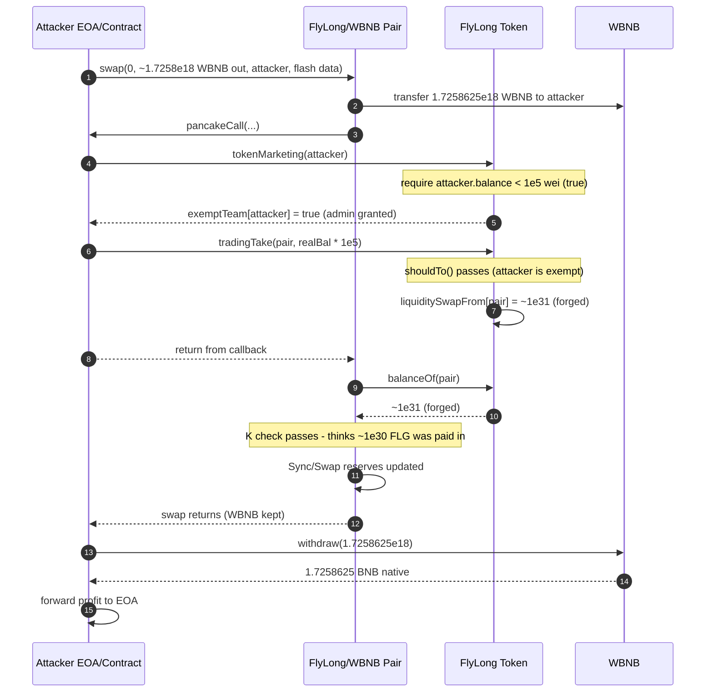
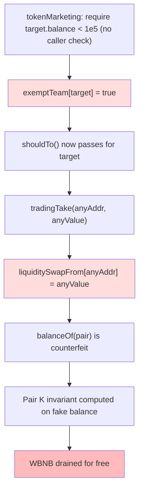

# FlyLong (FLG) — public balance-forger lets any caller fake the LP's token balance and drain the WBNB side of the pair — access-control/missing-auth

> **Vulnerability classes:** vuln/access-control/missing-auth · vuln/access-control/broken-logic · vuln/logic/state-update · vuln/oracle/price-manipulation
> **Reproduction:** the PoC compiles & runs in an isolated Foundry project at [this project folder](.). Full verbose trace: [output.txt](output.txt). The vulnerable token contract is verified on BscScan; its source is vendored at [sources/FlyLong_9cA66a/FlyLong.sol](sources/FlyLong_9cA66a/FlyLong.sol).

---

## Key info

| | |
|---|---|
| **Loss** | ~1.73 BNB (PoC extracts 1.7258625 BNB; ~1 BNB of dust remains in the pair as `0.000172603510400626` BNB) |
| **Vulnerable contract** | FlyLong (FLG) token — [`0x9cA66a67dC3d77bEb59DC11cAf96677843797c08`](https://bscscan.com/address/0x9cA66a67dC3d77bEb59DC11cAf96677843797c08) |
| **Attacker EOA** | [`0xD4E11065267421F88C0Cf7A7791D84D8Fdd7D42B`](https://bscscan.com/address/0xD4E11065267421F88C0Cf7A7791D84D8Fdd7D42B) |
| **Attack contract** | [`0xC8e256A41d0Ac7fd8d9ac31C0Ae1942dC5EF8419`](https://bscscan.com/address/0xC8e256A41d0Ac7fd8d9ac31C0Ae1942DC5EF8419) |
| **Attack tx** | [`0x45f6a7df540933b3d2b1a275fcbfc146bbd48934ffb6635c4839d8590a9efc88`](https://bscscan.com/tx/0x45f6a7df540933b3d2b1a275fcbfc146bbd48934ffb6635c4839d8590a9efc88) |
| **Chain / block / date** | BNB Chain (BSC) / 48,768,031 / 2025-04 |
| **Compiler** | Solidity `^0.8.2` (per verified source); obfuscated "honeypot" token contract |
| **Bug class** | Anyone can become an `exemptTeam` admin of the token and then write an arbitrary `balanceOf` for any address, so the PancakeSwap pair's post-swap `balance` check is satisfied for free while WBNB is extracted via a flash swap. |

## TL;DR

FlyLong is an obfuscated BSC ERC-20 whose code keeps a custom `liquiditySwapFrom` mapping as its "real" balance ledger (`balanceOf` just reads it). Two of its functions are gated only by a weak, self-grantable privilege:

1. `tokenMarketing(addr)` requires nothing but `addr.balance < 100000` wei (≈ 0.0001 BNB). It then sets `exemptTeam[addr] = true` — and `exemptTeam` is exactly the "is-admin" flag the rest of the contract checks via `shouldTo()`.
2. `tradingTake(addr, amount)` is gated by `shouldTo()`, i.e. by `exemptTeam[msg.sender]`. It does `liquiditySwapFrom[isMarketing] = swapAuto` — a raw, unconditional balance overwrite of any address to any value.

So an attacker first calls `tokenMarketing(attackerContract)` to make itself an admin, then calls `tradingTake(pair, 9999999999999999999999999900000)` to set the pair's FlyLong balance to ~`1e31` (its real balance was only `99,999,999,999,999,999,999,999,999` ≈ `1e26`). Because the PancakeSwap-style pair uses token-side `balance0`/`balance1` to enforce the constant-product `k` invariant (not its internal reserves), the inflated balance makes the pair believe a massive FlyLong deposit just arrived. The attacker then requests `99.99%` of the pair's WBNB (`1,725,862,500,495,854,109` wei / 1.7258625 BNB) out in a flash swap, the K-check passes for free, and the attacker walks away with the WBNB. No collateral was actually transferred to the pair [output.txt:1639-1640].

Real numbers from the local fork run: pair started with `1,726,035,104,006,254,735` wei WBNB and `99,999,999,999,999,999,999,999,999` wei FLG [output.txt:1602-1603]; the attacker received `1,725,862,500,495,854,109` wei WBNB (1.7258625 BNB), withdrew it to native BNB, leaving the pair with only `172,603,510,400,626` wei (~0.000173 BNB) of WBNB [output.txt:1664], [output.txt:1639].

This is a textbook "honeypot token with a public backdoor": the same `exemptTeam` map used to legit-mark the deployer also marks anyone who passes a trivial BNB-balance check, and the resulting privilege includes arbitrary balance forgery.

## Background — what FlyLong does

FlyLong (symbol `FLG`, "Fly Long") is a standard-looking BEP-20 on BNB Chain, deployed through the PancakeSwap V2 router (`0x10ED43C718714eb63d5aA57B78B54704E256024E`). At construction it mints a fixed supply of `100,000,000 * 1e18` (`senderTx`) to the deployer and creates a PancakeSwap pair between the token and WBNB (`takeShould`).

What makes it non-standard — and hostile — is the heavy obfuscation of every state variable and function name (`takeShould`, `swapFrom`, `teamTrading`, `exemptTeam`, `liquiditySwapFrom`, `tokenMarketing`, `tradingTake`, …). Despite the misleading names, the contract is a recognizable (intentional or leaked) honeypot template: token transfers are redirected through `totalTrading`, which special-cases the LP pair address and consults an external, unrelated address (`swapFrom = 0x0ED943…39706`) for a "balance" it asserts must equal a stored constant `isAuto`. This `require(enableFundExempt == isAuto)` check is the kind of trap that makes normal buying/selling revert for ordinary users — i.e. the token is designed so liquidity can be added but tokens cannot normally be pulled back out.

The only ways to move FLG freely are through the privileged paths gated by `shouldTo()`:

```solidity
function shouldTo() private view {
    require(exemptTeam[_msgSender()]);   // FlyLong.sol:223-225
}
```

`exemptTeam` is a public `mapping(address => bool)`. The deployer sets itself exempt in the constructor (`exemptTeam[teamTrading] = true`). The intended admin surface is `minEnableReceiver`, `launchTotal`, and `tradingTake` — all of which start with `shouldTo()`. The critical mistake is that `tokenMarketing`, the function that *grants* `exemptTeam`, has no `shouldTo()` gate of its own — it has a far weaker, public gate instead.

## The vulnerable code

Both flaws live in the same verified contract. Quoted verbatim from [sources/FlyLong_9cA66a/FlyLong.sol](sources/FlyLong_9cA66a/FlyLong.sol):

### 1. The privilege-grant is public and trivially satisfiable

`tokenMarketing` grants `exemptTeam` (the admin flag) to any address that merely holds almost no native BNB. Note there is **no** `shouldTo()` / owner check:

```solidity
function tokenMarketing(address sellFromLiquidity) public {
    require(sellFromLiquidity.balance < 100000);   // FlyLong.sol:159
    if (tokenSwap) {
        return;
    }
    if (receiverLaunched == sellEnable) {
        listMarketing = true;
    }
    exemptTeam[sellFromLiquidity] = true;          // FlyLong.sol:166  <-- grants admin
    tokenSwap = true;
}
```

The only guard is `sellFromLiquidity.balance < 100000` — i.e. the *target* address must have < 0.0001 BNB of native balance. A fresh attacker contract deployed with no BNB satisfies this instantly. After the call, `exemptTeam[attacker] == true` for life. (The `tokenSwap = true` latch is irrelevant — it only short-circuits future `tokenMarketing` calls, not `tradingTake`.)

### 2. The admin privilege includes arbitrary balance forgery

`tradingTake` is gated by `shouldTo()` (so only `exemptTeam` members can call it) but it then performs a raw assignment to the balance ledger:

```solidity
function tradingTake(address isMarketing, uint256 swapAuto) public {
    shouldTo();                                  // FlyLong.sol:108  -- only exemptTeam
    liquiditySwapFrom[isMarketing] = swapAuto;   // FlyLong.sol:109  -- overwrite any balance
}
```

```solidity
function balanceOf(address shouldTeamMarketing) public view virtual override returns (uint256) {
    return liquiditySwapFrom[shouldTeamMarketing];   // FlyLong.sol:83-85
}
```

Because `balanceOf` reads directly from `liquiditySwapFrom`, `tradingTake` lets an admin set *any* address's reported balance to *any* value — including the PancakeSwap pair's.

### 3. Why that breaks the pair's K invariant

The PancakeSwap V2 pair (the `FlyLong/WBNB Pair` at `0x27c0E5…`) finalizes a swap by re-reading each token's `balanceOf(this)` and deriving `amount{0,1}In` from the difference between the *current* balances and the cached reserves. With the pair's FlyLong balance forged upward by ~5 orders of magnitude, the pair computes a gigantic fictitious `amount0In` and accepts the flash swap as "paid for". This is the on-chain reading of the trace:

```text
amount0In:  9999899999999999999999999900001   [9.999e30]   (fictitious FLG "deposit")
amount1In:  0
amount0Out: 0
amount1Out: 1725862500495854109              [1.725e18]   (real WBNB extracted)
```
[output.txt:1640]

No actual FLG was moved into the pair; only the reported balance was rewritten by the attacker inside the flash-swap callback.

## Root cause — why it was possible

1. **Self-grantable admin flag.** `exemptTeam` is the contract's only authorization primitive (`shouldTo()`), but `tokenMarketing` — a *public* function with no caller check — writes `exemptTeam[target] = true`. The gate it does have (`target.balance < 100000` wei) does not protect the contract; it protects the *target*, and any fresh contract trivially passes it.
2. **Privilege scope is far too broad.** The same admin flag that lets the deployer tune tokenomics (`minEnableReceiver`, `launchTotal`) also unlocks `tradingTake`, which performs an unconditional `liquiditySwapFrom[any] = any` assignment. There is no separation between "config setter" and "raw balance editor", and `tradingTake` has zero bounds (no `<= totalSupply`, no allow-list of writable addresses, no event).
3. **`balanceOf` trusts a mutable ledger.** The pair's K invariant is only as honest as `FlyLong.balanceOf(pair)`. Because that value is a writable storage slot under admin control, the pair's accounting can be counterfeited at will.
4. **Obfuscation hid the backdoor.** Every identifier is misleading (`tradingTake` is not a trading function; `tokenMarketing` is not marketing). A casual reader would not connect "calls a function named marketing" with "I am now able to forge balances".
5. **No re-entrancy/flash-swap awareness.** The pair performs the flash-swap callback *before* re-checking balances, so the attacker rewrites the balance exactly during the window the pair leaves open.

## Preconditions

- **Permissionless.** No privileged role, no token holdings, no upfront capital beyond deployment gas and a contract with < 0.0001 BNB native balance.
- **No flash loan required** — the exploit *is itself* a flash swap: the attacker borrows the WBNB inside the PancakeSwap callback and repays "in FLG" by forging the balance. The attacker EOA starts the trace with 0 BNB [output.txt:1564, 1588].
- The pair must have WBNB liquidity (it had ~1.726 BNB at the fork block).
- `tokenSwap()` must be `false` so the first `tokenMarketing` actually grants the flag (it was `false` at block 48,768,031 [output.txt:1597]). After the first successful call `tokenSwap` latches to `true`, but a single grant is enough.

## Attack walkthrough (with on-chain numbers from the trace)

Initial state at fork block 48,768,031 (attacker balance 0):

| Quantity | Value |
|---|---|
| Pair WBNB reserve | `1,726,035,104,006,254,735` wei (≈ 1.7260 BNB) [output.txt:1602] |
| Pair FlyLong `balanceOf` | `99,999,999,999,999,999,999,999,999` wei (≈ 1e26) [output.txt:1603] |
| `FlyLong.tokenSwap()` | `false` [output.txt:1597] |
| Attacker (ContractTest) BNB | `0` [output.txt:1564] |

Step-by-step (`FlyLongDrainAttack.run`, [test/flylong_exp.sol](test/flylong_exp.sol)):

1. **Request a flash swap for ~99.99% of the pair's WBNB.**
   `amountOut = pairWbnb * 9999 / 10000 = 1,725,862,500,495,854,109` wei. The pair sends that WBNB to the attacker contract *first*, then invokes `pancakeCall` [output.txt:1613-1616].
2. **Inside `pancakeCall`, become an admin.**
   `FlyLong.tokenMarketing(attackerContract)` — the contract holds < 0.0001 BNB, so the require passes. `exemptTeam[attackerContract] = true` and `tokenSwap` latches `true` [output.txt:1622-1628].
3. **Forge the pair's FlyLong balance.**
   Read `pairBalance = FlyLong.balanceOf(pair) = 99,999,999,999,999,999,999,999,999` [output.txt:1629], then call `FlyLong.tradingTake(pair, pairBalance * 100_000) = 9,999,999,999,999,999,999,999,999,000,000` (≈ `1e31`) [output.txt:1630-1634]. The pair's reported FLG balance is now ~100,000× its real value.
4. **Pair's K check passes for free.**
   Back in the pair, it re-reads `FlyLong.balanceOf(pair)` = `9,999,999,999,999,999,999,999,999,000,000`, computes a fictitious `amount0In ≈ 9.999e30` FLG "deposited", emits `Sync`/`Swap`, and accepts the trade with `amount1In = 0` [output.txt:1636-1640]. The pair's stored reserves are rewritten to the forged values (`reserve0 ≈ 9.999e30`, `reserve1 ≈ 1.726e14` wei WBNB) [output.txt:1639].
5. **Realize the profit.**
   The attacker contract now holds `1,725,862,500,495,854,109` wei WBNB [output.txt:1654]. It calls `WBNB.withdraw(...)` to unwrap to native BNB [output.txt:1655-1660], then forwards the full amount to the EOA/`profitReceiver` (`ContractTest`), ending with `1.725862500495854109` BNB [output.txt:1664].

**Profit & loss accounting**

| Line | Amount |
|---|---|
| WBNB received from pair | +1,725,862,500,495,854,109 wei (1.7258625 BNB) |
| FLG actually paid into pair | 0 (balance was forged, no transfer occurred) |
| Gas / capital in | ≈ 0 (attacker started at 0 BNB) |
| **Net profit** | **+1.7258625 BNB** |
| WBNB left in pair post-attack | 172,603,510,400,626 wei (≈ 0.000173 BNB) [output.txt:1639] |

The assertions confirm the drain: `pairWbnb < 0.001 ether` and `attackerBalance > 1.72 ether` both hold [output.txt:1666-1669].

## Diagrams





## Remediation

1. **Remove `tokenMarketing`'s public privilege grant entirely**, or gate it behind `shouldTo()`/Ownable. No public function should ever write `exemptTeam`. The `target.balance < 100000` check is not a security boundary and must not be treated as one.
2. **Delete `tradingTake`** (raw `liquiditySwapFrom[any] = any`). If admin balance correction is genuinely needed, it must (a) be callable only by a real owner/timelock, (b) be bounded (e.g. cannot exceed `totalSupply`, cannot target arbitrary addresses — at most a documented recovery address), and (c) emit an event. There is no legitimate reason for a token to let an admin rewrite an LP pair's balance.
3. **Separate authorization roles** with OpenZeppelin `AccessControl` / `Ownable` instead of a single overloaded `exemptTeam` map that conflates "marketing whitelist" with "ledger admin".
4. **Make `balanceOf` reflect real ERC-20 balances.** A separate internal bookkeeping map that diverges from the real balance is an attack surface; if anti-MEV/tax logic needs overrides, scope them to the transfer hook, never to the public `balanceOf` read that AMMs rely on.
5. **Do not deploy obfuscated honeypot templates.** The misleading names (`tradingTake`, `tokenMarketing`, `shouldTo`) directly enabled this bug to ship unnoticed; clear naming and a third-party audit would have flagged a public admin-grant and an arbitrary balance setter instantly.

## How to reproduce

The PoC runs **fully offline** via the shared anvil harness from the committed [anvil_state.json](anvil_state.json) — no RPC needed.

```bash
# from the registry root
_shared/run_poc.sh 2025-04-flylong_exp -vvvvv
```

- **Chain / fork block:** BNB Chain (BSC), block `48,768,031` (loaded from `anvil_state.json`).
- **Expected result:** `[PASS] testExploit()` with the attacker BNB balance going `0 → 1.725862500495854109`:

```text
[PASS] testExploit() (gas: 794154)
  Attacker Before exploit BNB Balance: 0.000000000000000000
  Attacker After exploit BNB Balance: 1.725862500495854109
```
[output.txt:1562, 1564-1565]

The test also asserts the post-conditions `pairWbnb < 0.001 ether` and `attackerBalance > 1.72 ether`, both of which hold on the committed fork state [output.txt:1666-1669].

*Reference: alert/tweet — https://t.me/defimon_alerts/968*
