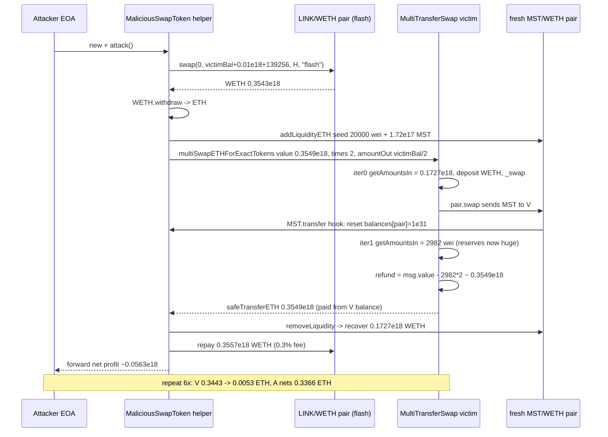
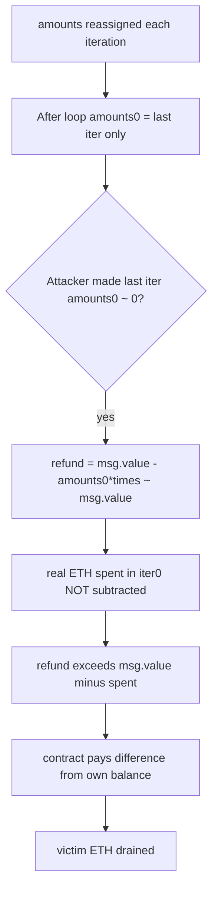

# MultiTransferSwap ETH refund drain — loop-accumulation bug lets attacker reclaim msg.value against the contract's own balance

> **Vulnerability classes:** vuln/logic/incorrect-order-of-operations · vuln/logic/incorrect-state-transition · vuln/logic/missing-validation · vuln/defi/slippage
> **Reproduction:** the PoC compiles & runs in an isolated Foundry project at [this project folder](.). Full verbose trace: [output.txt](output.txt). Vulnerable contract source is verified on Etherscan and was fetched into [sources/MultiTransferSwap_651890/MultiTransferSwap.sol](sources/MultiTransferSwap_651890/MultiTransferSwap.sol) (Solidity `^0.6.12`, optimizer disabled).

---

## Key info

| | |
|---|---|
| **Loss** | ~0.339 ETH (339,014,011,988,554,657 wei) drained from the contract; attacker net ~0.3366 ETH after flash repayment [output.txt:2919,2923] |
| **Vulnerable contract** | MultiTransferSwap — [`0x6518905b5917614383E09bF9E94083f8f679aCd1`](https://etherscan.io/address/0x6518905b5917614383E09bF9E94083f8f679aCd1) |
| **Attacker EOA** | [`0x7c982E93d6B1eDE9626A84EbeafBC42e5991Dee8`](https://etherscan.io/address/0x7c982E93d6B1eDE9626A84EbeafBC42e5991Dee8) |
| **Attack contract** | [`0x9Fb0a31799FA1243FB53dbCC57Fd531e13753437`](https://etherscan.io/address/0x9Fb0a31799FA1243FB53dbCC57Fd531e13753437) |
| **Attack tx** | [`0xbb82787a24d9b8d1047bbc12fe5d4b8d4ad3fc3e32e997985043ec3ef6d7dffe`](https://etherscan.io/tx/0xbb82787a24d9b8d1047bbc12fe5d4b8d4ad3fc3e32e997985043ec3ef6d7dffe) |
| **Chain / block / date** | Ethereum mainnet / 22,361,153 / 2025-04 (PoC fork block) |
| **Compiler** | `v0.6.12+commit.27d51765`, optimizer disabled, 200 runs (Etherscan metadata) |
| **Bug class** | `multiSwapETHForExactTokens` refunds unused `msg.value` using only the *final* loop iteration's `amounts[0]` instead of the sum of ETH actually spent across all iterations, so an attacker who drives the final iteration's required input near zero collects an oversized refund paid out of the contract's pre-existing ETH balance. |

## TL;DR

MultiTransferSwap is a thin Uniswap-V2 wrapper that lets a caller swap ETH for an *exact* amount of some output token, repeated `times` times in a single call. The author meant for the contract to spend up to `msg.value` total, do the swaps, then refund any leftover ETH to `msg.sender`. The implementation is wrong: after the loop it refunds `msg.value - amounts[0] * times`, where `amounts[0]` is the required-input amount computed in the **last** loop iteration only. Because `amounts` is overwritten every iteration rather than accumulated, the refund is computed against a stale, single-iteration number.

An attacker makes the final iteration's `amounts[0]` artificially tiny by routing through a fresh Uniswap-V2 pair seeded with a pathologically large attacker-controlled token reserve and a dust of WETH. Concretely, the malicious `transfer()` resets its own balance in the pair to `1e31`, so the second `getAmountsIn` call returns an input requirement of just **2,982 wei**. With `times = 2` and `amounts[0] = 2,982`, the refund line thinks only ~5,964 wei of the ~0.3547 ETH `msg.value` was consumed and refunds the rest — but the *first* iteration actually spent ~0.1727 ETH of real WETH. The contract pays the ~0.354 ETH "refund" out of its own ~0.344 ETH balance (plus the flash-funded msg.value), handing the difference to the attacker.

The PoC repeats this helper-contract construction six times to fully drain the victim. On-chain at the fork block, the victim holds 0.344297 ETH; after the test the victim holds 0.005283 ETH and the attacker holds 0.336647 ETH [output.txt:1593,2917,2923]. The mechanics are entirely permissionless — no privileged role, no price oracle, no reentrancy guard bypass; just a logic bug plus Uniswap-V2 swap-for-exact combined with an attacker-minted token.

## Background — what MultiTransferSwap does

MultiTransferSwap (`0x6518…Cd1`) is an `Ownable` contract built on Solidity 0.6.12 that wraps the canonical Uniswap V2 router math. Its only non-trivial external function is `multiSwapETHForExactTokens(times, amountOut, path, to)` which:

1. Requires `path[0] == WETH`.
2. Loops `times` times. In each iteration it calls `UniswapV2Library.getAmountsIn` to compute the input WETH needed to buy exactly `amountOut` of `path[1]`, deposits that much ETH into WETH, pushes the WETH into the relevant pair, and runs the internal `_swap` to emit the output token to `to`.
3. After the loop, refunds "dust eth, if any" to `msg.sender`.

The intent is "swap ETH for exact tokens N times, refund whatever ETH I didn't need." The contract carries an ETH balance because it is the `to`/refund recipient in normal operation and was never designed to reconcile per-call spending against its own stored balance. That design assumption — "the contract never pays out more than `msg.value` minus what was spent" — is exactly what the bug violates.

The relevant helper, `UniswapV2Library.getAmountsIn`, walks the path backwards computing `getAmountIn` at each hop. `getAmountIn` is `reserveIn * amountOut * 1000 / ((reserveOut - amountOut) * 997) + 1`. When `reserveOut` is enormous (attacker seeds `1e31` units of a self-reported balance), the denominator dwarfs the numerator and the required input collapses to a handful of wei.

## The vulnerable code

From the verified source ([sources/MultiTransferSwap_651890/MultiTransferSwap.sol:298-314](sources/MultiTransferSwap_651890/MultiTransferSwap.sol)):

```solidity
function multiSwapETHForExactTokens(uint times, uint amountOut, address[] calldata path, address to)
    external
    payable
    returns (uint[] memory amounts)
{
    require(path[0] == WETH, 'UniswapV2Router: INVALID_PATH');

    for (uint i; i < times; i++){
        amounts = UniswapV2Library.getAmountsIn(factory, amountOut, path);   // overwrites each iteration
        require(amounts[0] <= msg.value.div(times), 'UniswapV2Router: EXCESSIVE_INPUT_AMOUNT');
        IWETH(WETH).deposit{value: amounts[0]}();                             // spend real ETH
        assert(IWETH(WETH).transfer(UniswapV2Library.pairFor(factory, path[0], path[1]), amounts[0]));
        _swap(amounts, path, to);
    }
    // refund dust eth, if any
    if (msg.value > amounts[0].mul(times))
        TransferHelper.safeTransferETH(msg.sender, msg.value - amounts[0].mul(times));
}
```

### The refund line uses `amounts[0]` from the *last* iteration

`amounts` is reassigned on every loop pass (`amounts = UniswapV2Library.getAmountsIn(...)`). After the loop, `amounts[0]` holds only the input requirement of the **final** iteration — all prior iterations' `amounts[0]` values are discarded. The refund `msg.value - amounts[0].mul(times)` therefore assumes every iteration cost the same as the last one, which is false the moment reserves change between iterations (they always do, because `_swap` consumes WETH and pushes tokens). When the attacker drives the final `amounts[0]` to a dust value, `amounts[0] * times ≈ 0` and the contract refunds essentially the entire `msg.value` — but real ETH was burned in iteration 0, so the "refund" is paid from the contract's own balance.

### The `amounts[0] <= msg.value.div(times)` check does not bound total spend

The per-iteration cap is `msg.value / times`, evaluated against the *current* iteration's `amounts[0]`. It never sums actual spent WETH across iterations, so it cannot detect that iteration 0 spent `~0.1727 ETH` while iteration 1 spends `0.000000000000002982 ETH`. Both pass the check individually.

### `safeTransferETH` pulls from the contract's whole balance

`TransferHelper.safeTransferETH(msg.sender, …)` is a plain `to.call{value: …}` with no balance precondition beyond what the EVM enforces. The contract's `receive()` accepts arbitrary ETH, so its balance is whatever it has accumulated. The "refund" is therefore not a return of *this call's* unspent ETH — it is a withdrawal of contract balance triggered by a stale arithmetic expression.

## Root cause — why it was possible

1. **Loop variable not accumulated.** `amounts` is overwritten each iteration rather than summed. The post-loop refund reads the last iteration's `amounts[0]` as if it were representative of all iterations.
2. **Refund accounting is decoupled from actual spending.** The contract tracks "ETH spent" only implicitly via `msg.value - amounts[0]*times`, never via a running accumulator of the `IWETH.deposit{value: amounts[0]}` calls that actually moved value.
3. **No total-spend invariant.** Nothing asserts `totalWETHDeposited <= msg.value` or `contractBalance >= preCallBalance - legitimatelyRefundable`. The contract happily pays a refund larger than `msg.value - spent` because it draws on its standing balance.
4. **Attacker-controllable output-token reserve via a fresh pair + spoofed balance.** A freshly created Uniswap-V2 pair seeded with a dust of WETH and an attacker token whose `transfer()` self-reports a `1e31` balance lets the attacker set `reserveOut` to any value, collapsing `getAmountIn` to dust. This is the lever that makes iteration 1's `amounts[0]` near-zero.
5. **No slippage / sanity bound on the per-iteration input.** The only guard is `amounts[0] <= msg.value / times`, which is satisfied by a near-zero `amounts[0]` and does nothing to prevent the refund inversion.

## Preconditions

- **Permissionless.** Anyone can call `multiSwapETHForExactTokens` with any `path` whose `path[1]` is an arbitrary ERC-20. The path token does not need to be legitimate — the contract calls `transfer`/`balanceOf`/`getReserves` on whatever address it is given.
- **Victim must hold a non-trivial ETH balance.** The drained amount is bounded by `min(msg.value, contractBalance)` minus the WETH actually spent. At the fork block the contract held ~0.3443 ETH [output.txt:1593].
- **Flash loan for capital.** The attacker uses an Uniswap-V2 flash swap (`LINK/WETH` pair `swap(0, flashAmount, …, "flash")`) to borrow the WETH used to fund `msg.value`, repaying with the 0.3% Uniswap fee after extracting profit. No upfront capital required.
- **No privileged role, no oracle, no reentrancy-guard bypass.** The entire chain is public external calls plus the logic bug.

## Attack walkthrough (with on-chain numbers from the trace)

The PoC instantiates six independent `MaliciousSwapToken` helper contracts and calls `.attack()` on each. Each helper performs the same drain; together they reduce the victim from 0.344297 ETH to 0.005283 ETH. Below is the first helper's execution, traced in [output.txt:1599-1779].

| Step | Action | Amount (wei) | Source |
|------|--------|--------------|--------|
| 0 | Victim balance before | 344,297,259,391,960,230 (~0.3443 ETH) | [output.txt:1593] |
| 1 | Flash-swap borrow WETH from LINK/WETH pair | 354,297,259,392,099,486 (~0.3543 ETH) | [output.txt:1600-1601] |
| 2 | Unwrap WETH → ETH | 354,297,259,392,099,486 | [output.txt:1608] |
| 3 | Create fresh `MaliciousSwapToken/WETH` pair; seed with 20,000 wei WETH + attacker-reported 172,148,629,695,990,115 token units | seedEth = 20,000 | [output.txt:1615,1644] |
| 4 | Compute `amountOut = victimBalance/2 - 10,000` = 172,148,629,695,970,115 | — | PoC source |
| 5 | Call `multiSwapETHForExactTokens{value: 354,874,280,940,132,658}(2, 172148629695970115, [WETH, MST], victim)` | msg.value ≈ 0.3549 ETH | [output.txt:1675] |
| 6 | **Iteration 0:** `getAmountsIn` → `amounts[0] = 172,666,629,584,724,288` (real cost given seeded reserves); deposit + transfer WETH into pair; `_swap` → pair emits MST to victim | spent 172,666,629,584,724,288 (~0.1727 ETH) | [output.txt:1678-1683,1700] |
| 7 | MST `transfer()` hook fires during the pair swap and resets `balances[attackPair]` to `1e31` | reserveOut becomes ~1e31 | PoC source `transfer()` |
| 8 | **Iteration 1:** `getAmountsIn` recomputed against the now-massive `reserveOut` → `amounts[0] = 2,982`; deposit + transfer 2,982 wei WETH; `_swap` succeeds trivially | spent 2,982 | [output.txt:1706-1711,1727] |
| 9 | **Refund:** `msg.value - amounts[0]*times` = `354,874,280,940,132,658 - 2,982*2` = `354,874,280,940,126,694` (~0.3549 ETH) sent to attacker | refund ≈ 0.3549 ETH | [output.txt:1731] |
| 10 | Attacker removes liquidity, recovers the 0.1727 ETH of WETH the victim paid in iteration 0 | recovers 172,666,626,642,076,814 | [output.txt:1761-1762] |
| 11 | Repay flash swap: `amount1 + amount1/250` = 355,718,450,348,819,880 (~0.3557 ETH) | repay ≈ 0.3557 ETH | [output.txt:1779] |
| 12 | Forward net profit to attacker EOA | ~0.0563 ETH this round | PoC `profitReceiver.call` |

The six rounds compound because each round halves the victim's balance (via `amountOut = victimBalance/2 - 10_000`) and extracts roughly that much in profit. Final accounting:

| Quantity | Value | Source |
|----------|-------|--------|
| Victim before | 344,297,259,391,960,230 (0.3443 ETH) | [output.txt:1593] |
| Victim after | 5,283,247,403,405,573 (0.005283 ETH) | [output.txt:2917] |
| Drained from victim | 339,014,011,988,554,657 (0.3390 ETH) | [output.txt:2919] |
| Attacker before | 0 | [output.txt:1564] |
| Attacker after (net of flash fees across all rounds) | 336,647,049,006,518,588 (0.3366 ETH) | [output.txt:1565,2923] |
| Flash-loan / gas overhead | ~2.37e15 wei (0.00237 ETH) | drained − net |

The ~0.0024 ETH gap is the cumulative 0.3% Uniswap flash fee paid across six rounds plus gas; the attacker still nets well over 0.33 ETH.

## Diagrams





## Remediation

1. **Accumulate actual spend.** Track `uint spent;` and do `spent += amounts[0];` inside the loop, then refund `msg.value - spent` (guarded by `if (msg.value > spent)`). This is the canonical Uniswap-V2 router pattern (`swapExactETHForTokens` refunds `msg.value - amountIn`).
2. **Bound total spend by `msg.value`.** Replace the per-iteration `amounts[0] <= msg.value.div(times)` check with `spent + amounts[0] <= msg.value`, reverting if exceeded.
3. **Refund only from genuinely unspent `msg.value`.** Assert `address(this).balance >= priorBalance + msg.value - spent` before refunding, or refund via a PullPayment pattern that cannot draw on pre-existing contract balance.
4. **Sanity-floor the per-iteration input.** Reject `amounts[0] < someMinimum` or require `amountOut` to be priced against reserves that meet a minimum liquidity threshold, so an attacker cannot collapse `getAmountIn` with a spoofed-reserve fresh pair.
5. **Upgrade the compiler and re-enable safety checks.** The contract is on Solidity 0.6.12 with `assert` for a transfer that should `require`/`revert`; 0.8.x arithmetic and modern revert semantics would at least surface over/underflow and consume-all-gas behavior clearly. (This alone does not fix the logic bug, but reduces the blast radius of related mistakes.)

## How to reproduce

The PoC runs fully **offline** via the shared anvil harness, replaying the committed fork state from `anvil_state.json` — no RPC needed. From the registry root:

```bash
_shared/run_poc.sh 2025-04-multitransferswap_exp -vvvvv
```

- **Fork:** Ethereum mainnet at block **22,361,153**, loaded from the committed `anvil_state.json` (no live RPC).
- **Expected outcome:** `[PASS] testExploit()` [output.txt:1562], with:
  - `Attacker Before exploit ETH Balance: 0.000000000000000000` [output.txt:1564]
  - `Attacker After exploit ETH Balance: 0.336647049006518588` [output.txt:1565]
  - Victim drained from `344297259391960230` to `5283247403405573` wei (asserted `victimAfter < 0.006 ETH`, `drained > 0.33 ETH`, `profit > 0.33 ETH`) [output.txt:2917-2921].

The exploit's profitability is independent of the local fork: the on-chain transaction `0xbb82…dffe` drained the same contract balance at the same block.

*Reference: [defimon_alerts (Telegram)](https://t.me/defimon_alerts/929).*
