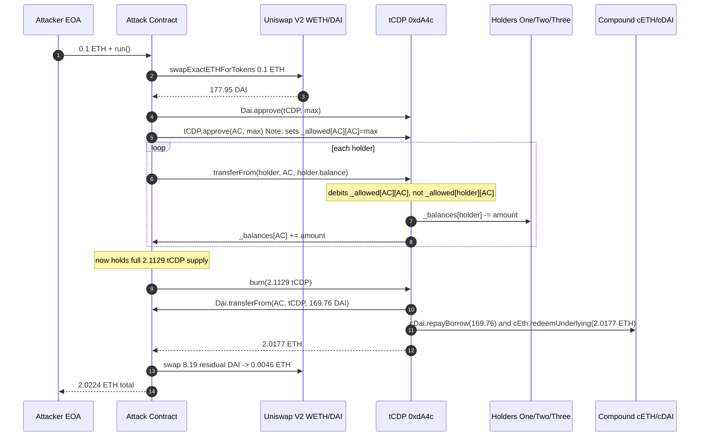
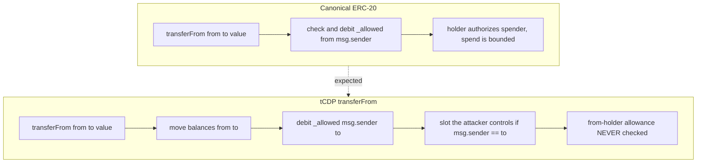

# tCDP `transferFrom` allowance-swap bug drains holders' tokens — ERC-20 `transferFrom` debits the wrong allowance slot

> **Vulnerability classes:** vuln/logic/incorrect-order-of-operations · vuln/access-control/broken-logic
> **Reproduction:** the PoC compiles & runs in an isolated Foundry project at [this project folder](.). Full verbose trace: [output.txt](output.txt). The vulnerable contract is verified on Etherscan; its source is mirrored under [sources/tCDP_dA4c9E/tCDP.sol](sources/tCDP_dA4c9E/tCDP.sol) (compiler `v0.5.16`, Solidity `^0.5.12`).

---

## Key info

| | |
|---|---|
| **Loss** | ~2.02 ETH (the attacker's net profit after the 0.1 ETH seed); see `output.txt:1565` |
| **Vulnerable contract** | tCDP — [`0xdA4c9Ee8373fd1095379a3Dd457A0c78968AaF03`](https://etherscan.io/address/0xdA4c9Ee8373fd1095379a3Dd457A0c78968AaF03) |
| **Attacker EOA** | [`0xd49Cb0924F871bCFd78EA4187d9E6Bd943f85D98`](https://etherscan.io/address/0xd49Cb0924F871bCFd78EA4187d9E6Bd943f85D98) |
| **Attack contract** | [`0xC3D478F039125c536bC3c3eFBaEac7c1a15BcB1B`](https://etherscan.io/address/0xC3D478F039125c536bC3c3eFBaEac7c1a15BcB1B) |
| **Attack tx** | [`0x9879031462b16dbf063377c4a8e5b043662576a9a3fb282c5a656953ad00684e`](https://etherscan.io/tx/0x9879031462b16dbf063377c4a8e5b043662576a9a3fb282c5a656953ad00684e) |
| **Chain / block / date** | Ethereum mainnet / block `22,364,243` / 2025-04 |
| **Compiler** | `v0.5.16+commit.9c3226ce`, optimizer enabled, 200 runs (per `_meta.json`) |
| **Bug class** | The custom ERC-20 `transferFrom(from, to, value)` debits `_allowed[msg.sender][to]` instead of the standard `_allowed[from][msg.sender]`, so anyone who has set the recipient's allowance toward themselves (or simply self-approves) can move tokens out of arbitrary holders' balances. |

## TL;DR

tCDP is an ERC-20 wrapper token for a leveraged ETH/DAI "CDP" position held on Compound — holding tCDP entitles the owner to a proportional slice of the contract's cETH collateral (minus its cDAI debt). At block `22,364,243` its total supply was ~2.1129 tCDP, of which three unrelated holders (Holders One/Two/Three) owned essentially the entire float (~2.1019, ~0.01, and ~0.001 tCDP respectively) [output.txt:1599-1611].

The protocol's hand-rolled ERC-20 has a broken `transferFrom`. Instead of the canonical `require(_allowed[from][msg.sender] >= value)` + `_allowed[from][msg.sender] -= value`, it performs the move and then subtracts from `_allowed[msg.sender][to]` [sources/tCDP_dA4c9E/tCDP.sol:109-113]. The `from`/`to` arguments control *whose balance moves*, but the allowance check is keyed to `(msg.sender, to)` rather than `(from, msg.sender)`. An attacker who makes `msg.sender == to` (a normal self-transfer target) and grants themselves a self-allowance can therefore satisfy the `sub()` on their own slot while moving value out of *any* `from` address — bypassing the real `(holder, attacker)` allowance entirely.

The attacker self-approved (`tCDP.approve(attackContract, type(uint256).max)`) so that `_allowed[attackContract][attackContract]` is infinite, then called `transferFrom(holder, attackContract, holder.balance)` for each of the three holders. Because the debited slot is `(attackContract, attackContract)` — already max — the move always succeeds regardless of what those holders ever authorized [output.txt:1664-1690]. With the full 2.1129 tCDP supply now in the attack contract, the attacker called `burn`, which repays a proportional share of the contract's cDAI debt with flash-bought DAI and redeems the cETH collateral, sending ~2.0177 ETH back into the contract [output.txt:1698-1815]. Net attacker balance went from `0` to `2.022351146566266102 ETH` [output.txt:1564-1565] — about 2.02 ETH profit after recovering the 0.1 ETH seed.

## Background — what tCDP does

tCDP ("Tokenized CDP") is a single-position leveraged-Ether product: the contract holds a Compound position consisting of cETH collateral and cDAI debt, sized to a target collateralization ratio, and tokenizes the equity as the `tCDP` ERC-20. Each token is a pro-rata claim on `collateral - debt`:

- **Mint** (`mint`, line ~380): a user deposits ETH and DAI in the protocol's ratio; the contract borrows/repays on Compound to keep the position at `targetRatio` and mints tCDP to the depositor.
- **Burn** (`burn`, lines 414-438): the core redemption primitive. Given `amount` of tCDP, it computes `tokenToRepay = amount * debt / totalSupply` and `tokenToDraw = amount * collateral / totalSupply`, burns the tokens, pulls `tokenToRepay` DAI from `msg.sender` via `Dai.transferFrom`, repays cDAI on Compound, redeems `tokenToDraw` of cETH, and forwards that ether to `msg.sender`. So whoever can call `burn` with tCDP they hold receives the underlying ETH.
- **ERC-20 layer** (lines 39-122): the contract implements its own `ERC20` instead of using OpenZeppelin. The transfer/allowance code is the homegrown bug surface.

The protocol was deployed in 0.5.x-era Solidity (`pragma ^0.5.12`) and predates the now-universal OpenZeppelin `ERC20`/`IERC20` patterns. The floating supply was small (~2.11 tCDP) but each token mapped to roughly 1 ETH of redeemable collateral, which is why a 2.11-token drain produced ~2 ETH of profit.

## The vulnerable code

From the verified source — the hand-rolled `ERC20.transferFrom` ([sources/tCDP_dA4c9E/tCDP.sol:109-113](sources/tCDP_dA4c9E/tCDP.sol)):

```solidity
function transferFrom(address from, address to, uint256 value) public returns (bool) {
    _transfer(from, to, value);
    _allowed[msg.sender][to] = _allowed[msg.sender][to].sub(value);
    return true;
}

function _transfer(address from, address to, uint256 value) internal {
    require(to != address(0));
    _balances[from] = _balances[from].sub(value);
    _balances[to] = _balances[to].add(value);
    emit Transfer(from, to, value);
}
```

Compare with the canonical ERC-20 invariant, where the allowance slot being debited **must** match the principal that authorized the spend:

```solidity
// Standard / correct
require(_allowed[from][msg.sender] >= value, "allowance");
_allowed[from][msg.sender] -= value;
_transfer(from, to, value);
```

### Why `(msg.sender, to)` is fatal

The ERC-20 allowance model is "owner authorizes spender to move owner's tokens": the slot is always `(owner=from, spender=msg.sender)`. tCDP instead reads/writes `(owner=msg.sender, spender=to)`. Two consequences:

1. **No real authorization is ever checked.** Whether `from` actually approved `msg.sender` is never consulted — only whether `msg.sender` (as a hypothetical owner) approved `to` (as a hypothetical spender). A holder who has never signed any approval can have their entire balance moved.
2. **Self-approval unlocks arbitrary drains.** When the attacker calls `transferFrom(holder, attackerContract, amount)` with `msg.sender == attackerContract` and `to == attackerContract`, the debited slot is `_allowed[attackerContract][attackerContract]`. A single `attackerContract.approve(attackerContract, type(uint256).max)` (or the contract having approved itself once, ever) makes that slot infinite, so the `sub()` never reverts and `from` can be literally anyone.

### The `burn` primitive that monetizes stolen tokens

The redemption path the attacker rides ([sources/tCDP_dA4c9E/tCDP.sol:414-438](sources/tCDP_dA4c9E/tCDP.sol)):

```solidity
function burn(uint256 amount) external {
    uint256 tokenToRepay = amount.mul(debt()).div(_totalSupply);
    uint256 tokenToDraw  = amount.mul(collateral()).div(_totalSupply);
    _burn(msg.sender, amount);
    Dai.transferFrom(msg.sender, address(this), tokenToRepay);
    if (isCompound) {
        require(cDai.repayBorrow(tokenToRepay) == 0, "repay failed");
        require(cEth.redeemUnderlying(tokenToDraw) == 0, "redeem failed");
    }
    // ...
    (bool success, ) = msg.sender.call.value(tokenToDraw)("");
    require(success, "Failed to transfer ether to msg.sender");
}
```

Because the attacker now holds the *entire* float, `amount/_totalSupply == 1`, so `tokenToDraw` equals the contract's full ETH collateral. The only DAI the attacker needs (`tokenToRepay`) is the proportional debt share, which they front with a flash-bought DAI amount and repay out of the proceeds.

## Root cause — why it was possible

1. **Wrong allowance index in `transferFrom`.** Line 111 debits `_allowed[msg.sender][to]` instead of `_allowed[from][msg.sender]`. This single transposition severs the link between the approval a holder grants and the permission `transferFrom` actually enforces — the function never consults the slot that protects the holder.
2. **No `require` on the allowance.** Even the slot it *does* touch is only ever `sub()`-ed after the balance move; it is never bounds-checked as a precondition. Combined with the wrong keying, the result is an unconditional move that only fails if `(msg.sender, to)` happens to be underfunded — a condition the attacker fully controls.
3. **Self-approval escape hatch.** Because `approve(spender, value)` sets `_allowed[msg.sender][spender]`, a contract can set `_allowed[self][self] = max`. With `to == self == msg.sender` in the draining call, the debited slot is always the self-self slot and the spend is effectively unlimited.
4. **Permissionless drain, then permissionless redemption.** `transferFrom` and `burn` are both `external` with no role gating. Once arbitrary balances can be moved, `burn` is the trivial monetization step — no flash loan of the token itself is even needed, just a small DAI loan to cover the proportional debt repayment.
5. **Custom, unaudited ERC-20 instead of OpenZeppelin.** The whole exploit class disappears with the standard `ERC20._spendAllowance` logic. Reinventing ERC-20 in 0.5.x Solidity without the canonical `(from, msg.sender)` slot invariant is what let the bug ship to mainnet.

## Preconditions

- **Permissionless.** Any externally-owned account or contract can execute this. No privileged role, no governance, no protocol-side precondition.
- **No flash loan of tCDP required.** The vulnerability *creates* the tCDP balance out of thin air by moving other holders' tokens; the only borrowed asset is a small amount of DAI (~0.1 ETH worth, see step 1) used to seed the borrow-and-repay in `burn`. The PoC seeds this with `vm.deal(address(this), 0.1 ether)`.
- **Triggerable on any holder.** Every address with a non-zero tCDP balance is a victim; the attacker simply iterated the three holders that, together, held the entire supply.

## Attack walkthrough (with on-chain numbers from the trace)

All figures from [output.txt](output.txt). Attacker seed: `0.1 ETH` (`100577021548053172` wei after router fees) [output.txt:1620].

| # | Step | Call | Effect (from trace) |
|---|------|------|---------------------|
| 1 | Seed DAI for the burn's debt repayment | `swapExactETHForTokens{value: 0.1 ETH}` | Buys `177954131244727683948` DAI (~177.95 DAI) on Uniswap V2 WETH/DAI [output.txt:1650] |
| 2 | Approve tCDP to pull DAI during burn | `Dai.approve(tCDP, type(uint256).max)` | [output.txt:1659] |
| 3 | **Set the broken self-allowance slot** | `tCDP.approve(attackContract, type(uint256).max)` | Writes `_allowed[attackContract][attackContract] = max` — the slot `transferFrom` will later debit [output.txt:1664-1665] |
| 4 | Drain Holder One | `tCDP.transferFrom(HolderOne, attackContract, 2101941787257735085)` | Moves `2.101941787257735085` tCDP (the whole supply) — no `(HolderOne, attackContract)` allowance ever existed [output.txt:1671-1672] |
| 5 | Drain Holder Two | `tCDP.transferFrom(HolderTwo, attackContract, 10000000000000000)` | Moves `0.01` tCDP [output.txt:1680-1681] |
| 6 | Drain Holder Three | `tCDP.transferFrom(HolderThree, attackContract, 1000000000000000)` | Moves `0.001` tCDP [output.txt:1689-1690] |
| 7 | **Monetize — burn the full supply** | `tCDP.burn(2112941787257735085)` | Pulls `169759364495289569297` DAI (~169.76 DAI) as proportional debt repayment [output.txt:1725-1726], repays cDAI, redeems cETH for `2017747167430484223` wei (~2.0177 ETH) which is sent to the burn caller [output.txt:1815] |
| 8 | Convert leftover DAI back to ETH | `swapExactTokensForETH(8194766749438114651 DAI)` on Uniswap | Gets `4603979135781879` wei (~0.0046 ETH) [output.txt:1851-1862] |
| 9 | Sweep all ETH to attacker | `profitReceiver.call{value: balance}` | Final attacker ETH balance: `2022351146566266102` (~2.0224 ETH) [output.txt:1565] |

**Profit accounting:**

```
ETH in  (seed):                                0.100577021548053172
ETH out (from burn redeem):                    2.017747167430484223
ETH out (leftover DAI -> ETH on Uniswap):      0.004603979135781879
                                              ─────────────────────
Net attacker ETH after exploit:                2.022351146566266102   [output.txt:1565]
Gross profit (excl. 0.1 ETH seed recovered):  ~2.02 ETH
```

The DAI loop closes: `177.95` DAI bought in for `0.1` ETH → `169.76` DAI consumed by `burn` → `8.19` DAI residual sold back for `0.0046` ETH. The economic engine of the profit is the stolen tCDP redeemed for ~2.0177 ETH of cETH collateral in step 7.

## Diagrams

### Attack sequence



### Why the allowance check is broken



## Remediation

1. **Fix the allowance slot.** Debit the canonical slot and check it as a precondition (and, for 0.5.x, use `SafeMath`):
   ```solidity
   function transferFrom(address from, address to, uint256 value) public returns (bool) {
       _allowed[from][msg.sender] = _allowed[from][msg.sender].sub(value);
       _transfer(from, to, value);
       return true;
   }
   ```
2. **Stop reinventing ERC-20.** Replace the hand-rolled `ERC20` with OpenZeppelin's `ERC20` (or `ERC20Upgradeable` for the proxy path). The standard implementation makes this entire class impossible.
3. **Gate `burn` against tainted supply.** Even with the fix above, audit the mint/burn accounting so a single compromised holder cannot unilaterally trigger a full-collateral redemption; consider redemption limits, a timelock, or a per-account proportional cap.
4. **Add a re-entrancy guard on `burn`.** The closing `msg.sender.call.value(tokenToDraw)("")` at line 436 forwards ETH before any post-condition; in this contract it happens to be safe, but combined with a custom ERC-20 it is a latent risk. Use a `nonReentrant` modifier and the checks-effects-interactions ordering.
5. **Upgrade the compiler and add fuzz tests.** The contract ships on `^0.5.12`; bring it to a current 0.8.x toolchain (which gives overflow protection for free) and add a property test asserting `transferFrom` from an unapproved `from` always reverts.

## How to reproduce

The PoC runs **fully offline** via the shared anvil harness from the committed `anvil_state.json` — no RPC needed. From the registry root, run:

```bash
_shared/run_poc.sh 2025-04-tcdp_exp -vvvvv
```

- **Fork:** Ethereum mainnet state, pinned at block `22,364,243` (`vm.createSelectFork(..., 22_364_243)` in [test/tcdp_exp.sol](test/tcdp_exp.sol)). The `anvil_state.json` in this folder is the committed fork snapshot for that block.
- **Expected tail:** `[PASS] testExploit()` and the attacker-balance log lines:
  ```
  Attacker Before exploit ETH Balance: 0.000000000000000000
  Attacker After exploit ETH Balance:  2.022351146566266102
  ```
  (see [output.txt:1562-1565](output.txt)). The final assertions verify all three holders' tCDP balances are zero and the attacker holds `> 2.0 ETH`.

The local run passed cleanly (`1 passed; 0 failed`) and matches the on-chain attack transaction's effect — the full tCDP float drained and ~2.02 ETH of Compound collateral extracted.

*Reference: [defimon alerts (Telegram)](https://t.me/defimon_alerts/932).*
