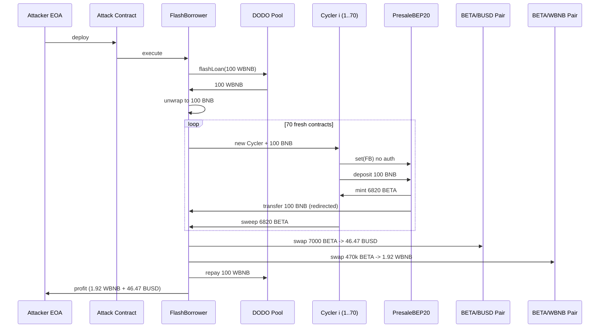
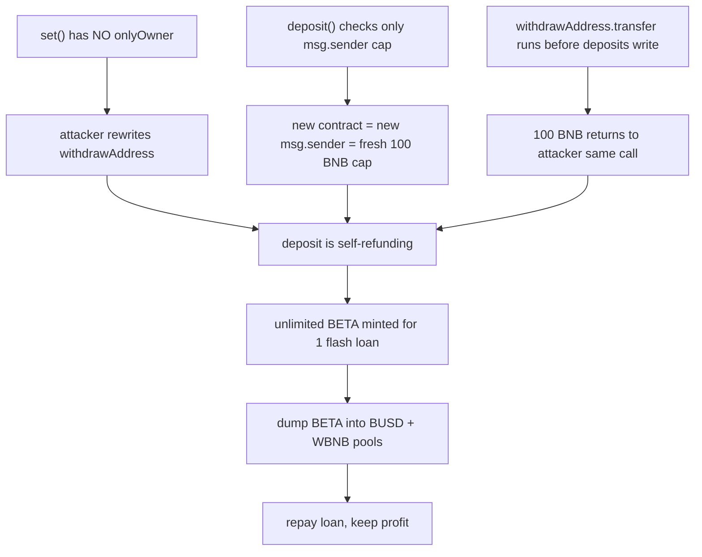

# Beta (BETA) Presale — public `set()` + per-sender-only deposit cap let a recycled flash loan drain the presale
> **Vulnerability classes:** vuln/access-control/missing-auth · vuln/logic/incorrect-order-of-operations · vuln/defi/fee-manipulation
> **Reproduction:** the PoC compiles & runs in an isolated Foundry project at [this project folder](.). Full verbose trace: [output.txt](output.txt). Vulnerable `PresaleBEP20` source is verified on BscScan and was fetched into [sources/PresaleBEP20_760C2a/PresaleBEP20.sol](sources/PresaleBEP20_760C2a/PresaleBEP20.sol); the bug quotes below come straight from that verified file.
---
## Key info
| | |
|---|---|
| **Loss** | 1.921686798824852706 WBNB + 46.474821659738262175 BUSD (≈ 1,700+ USD at the time) |
| **Vulnerable contract** | PresaleBEP20 — [`0x760C2aAa22220f24B9343b2a91A62dD664953853`](https://bscscan.com/address/0x760C2aAa22220f24B9343b2a91A62dD664953853) |
| **Attacker EOA** | [`0xc49f2938327aA2cDc3F2f89Ed17B54b3671F05dE`](https://bscscan.com/address/0xc49f2938327aA2cDc3F2f89Ed17B54b3671F05dE) |
| **Attack contract** | [`0x627ba7A2b5c07546D38614315CE85f28B332d79c`](https://bscscan.com/address/0x627ba7A2b5c07546D38614315CE85f28B332d79c) |
| **Attack tx** | [`0x47670c20325924e89aa87fcdd41df88c21246bd972056736e7964799831abf12`](https://bscscan.com/tx/0x47670c20325924e89aa87fcdd41df88c21246bd972056736e7964799831abf12) |
| **Chain / block / date** | BNB Chain (BSC) / 49,951,833 / 2025-05 |
| **Compiler** | Solidity `^0.6.x` (verified source; `pragma solidity ^0.6.0`/`^0.6.2`) |
| **Bug class** | A permissionless `set(address)` lets anyone redirect the presale withdrawal address, and `deposit()` enforces its 100 BNB maximum only per `msg.sender` while immediately forwarding all held BNB to that mutable address — so a flash-loaned 100 BNB can be recycled through 70 fresh contracts to mint the hard-cap worth of tokens for free. |

## TL;DR
The Beta token presale contract `PresaleBEP20` has two compounding flaws in its `deposit()` flow. First, anyone can call the public, unguarded `set()` to overwrite `withdrawAddress` — the address that receives every BNB deposit the moment it lands. Second, `deposit()` only checks that `deposits[msg.sender]` stays within the 100 BNB ceiling; because the deposited BNB is instantly `.transfer()`-ed out to `withdrawAddress`, a single 100 BNB flash loan can be re-deposited 70 times by 70 freshly deployed contracts, each a new `msg.sender`, each minting the full 6,820 BETA reward.

The attacker took a 100 WBNB flash loan from a DODO pool, unwrapped it to BNB, and spun up 70 `BetaDepositCycler` child contracts. Each child called `set()` to point `withdrawAddress` at the borrower, called `deposit()` with the recycled 100 BNB, received the minted BETA, and swept it up — while the 100 BNB came straight back via the redirected `withdrawAddress.transfer()`. Net result: 70 × 6,820 ≈ 477,401 BETA minted for the cost of one 100 BNB loan that was repaid in full. The attacker then sold 7,000 BETA into the BETA/BUSD pair for 46.47 BUSD and the remaining 470,401 BETA into the BETA/WBNB pair for 1.9217 WBNB [output.txt:3590,3618], repaid the 100 WBNB to DODO, and kept the proceeds.

The local Foundry fork run confirms the on-chain result exactly: attacker WBNB goes 0 → 1.921686798824852706, BUSD 0 → 46.474821659738262175, and the DODO pool ends holding 261.758849579073468662 WBNB after the flash repayment [output.txt:1539-1540,1537].

## Background — what Beta's presale does
`PresaleBEP20` is a simple BNB-for-token presale contract. Users send BNB via `deposit()` (or the `receive()` fallback) and are minted BETA at a fixed rate derived from `rewardTokenCount = 0.0146627 ether` — i.e. roughly 68.2 BETA per BNB (`msg.value.mul(1e18).div(rewardTokenCount)`). The contract holds a `maximumDepositEthAmount = 100 ether` per address, a `hardCapEthAmount = 9600 ether`, and a `minimumDepositEthAmount` of 0, plus soft-cap and time-window guards that are commented out (the active `deposit()` does not enforce `presaleStartTimestamp`/`presaleEndTimestamp` or the hard cap — see lines 755-756 in the verified source).

Two design choices turn this from a rate-limited presale into a drain. (1) Every deposit is forwarded immediately to a configurable `withdrawAddress` via `withdrawAddress.transfer(address(this).balance)` at the end of `deposit()`. (2) `withdrawAddress` is set through a `set(address)` function that is **`external` with no access control** — no `onlyOwner`, no modifier, no caller check whatsoever. The combination means the BNB never actually accumulates in the contract: it is always pushed out to whatever address the most recent caller of `set()` chose.

## The vulnerable code
From the verified source at `sources/PresaleBEP20_760C2a/PresaleBEP20.sol` (lines 754-773):

```solidity
function deposit() public payable {
    //require(now >= presaleStartTimestamp && now <= presaleEndTimestamp, "presale is not active");
    //require(totalDepositedEthBalance.add(msg.value) <= hardCapEthAmount, "deposit limits reached");
    require(deposits[msg.sender].add(msg.value) >= minimumDepositEthAmount && deposits[msg.sender].add(msg.value) <= maximumDepositEthAmount, "incorrect amount");

    uint256 rewardTokenCount;

    rewardTokenCount = 0.0146627 ether; //  68.2 tokens per BNB

    uint256 tokenAmount = msg.value.mul(1e18).div(rewardTokenCount);
    token.mint(msg.sender, tokenAmount);
    withdrawAddress.transfer(address(this).balance);   // forwards ALL held BNB to a mutable address
    totalDepositedEthBalance = totalDepositedEthBalance.add(msg.value);
    deposits[msg.sender] = deposits[msg.sender].add(msg.value);
    emit Deposited(msg.sender, msg.value);
}

 function set(address payable _address) external {       // NO onlyOwner, NO modifier
    withdrawAddress = _address;
}
```

### Why this is broken
- **`set()` is permissionless.** Anyone can re-point `withdrawAddress` to an attacker-controlled contract. The trace shows the very first child cycler doing exactly that — `PresaleBEP20::set(BetaPresaleFlashBorrower)` with a storage write of slot 10 from the legitimate `0xF45E…08D5` to the borrower [output.txt:1623-1625].
- **The cap is per-`msg.sender`, not global or per-recipient.** `deposits[msg.sender]` is updated *after* the mint and transfer, and each new contract address starts at zero, so the 100 BNB `maximumDepositEthAmount` is re-earned by every freshly deployed cycler. The (commented-out) global `totalDepositedEthBalance <= hardCapEthAmount` check that would have stopped this is never executed.
- **Funds leave before accounting completes.** `withdrawAddress.transfer(address(this).balance)` runs *before* `deposits[msg.sender]` is recorded, and because `withdrawAddress` was already hijacked, the 100 BNB returns to the attacker in the same call frame — ready to be reused for the next deposit.

## Root cause — why it was possible
1. **Missing access control on `set()`.** `set(address payable _address)` is `external` with no `onlyOwner` and no modifier, allowing any caller to overwrite `withdrawAddress` at will. This is the single enabler that turns the presale into a self-refunding mint.
2. **Per-`msg.sender` deposit cap bypassed by cheap contract deployment.** The 100 BNB ceiling is keyed on `msg.sender`; creating a new contract costs a few million gas but resets the limit. With the global hard-cap check commented out, nothing bounds total deposits.
3. **Funds forwarded to a mutable address before accounting.** `withdrawAddress.transfer(address(this).balance)` executes before `deposits[msg.sender]` is written, so the BNB the attacker "deposits" never leaves their control — it is bounced back through the hijacked `withdrawAddress` in the same transaction.
4. **Time/cap guards disabled in production.** Lines 755-756 are commented out, so neither the presale window nor the 9,600 BNB hard cap constrain the attacker.

## Preconditions
- **Permissionless.** No privileged role, no allowance, no signature required. Any externally owned account can deploy the attack contracts and call `set()`/`deposit()`.
- **Flash loan needed only for capital efficiency.** The attacker needs 100 BNB to trigger each deposit but recovers it immediately via the redirected `withdrawAddress`, so a single 100 WBNB DODO flash loan funds all 70 cycles.
- **Active BETA liquidity pools.** The BETA/BUSD and BETA/WBNB PancakeSwap pairs must hold enough reserves to absorb the minted tokens; at the forked block the pairs held ~122,570 BETA / ~47.29 BUSD and ~3,222,663 BETA / ~1.935 WBNB respectively [output.txt:3583,3611].
- **Presale must hold `token.mint` permission.** `PresaleBEP20` is the BETA minter, so its `deposit()` mints tokens out of thin air for the caller.

## Attack walkthrough (with on-chain numbers from the trace)
All amounts from [output.txt](output.txt). One BNB cycle = 100 BNB in, 6,820.026 BETA minted, 100 BNB returned.

| # | Step | Amount | Trace ref |
|---|------|--------|-----------|
| 1 | Take 100 WBNB flash loan from DODO pool | 100 WBNB | [output.txt:1607] |
| 2 | Unwrap WBNB → BNB | 100 BNB | [output.txt:1616] |
| 3 | Deploy cycler #1, call `set(borrower)` | redirects `withdrawAddress` | [output.txt:1623] |
| 4 | Cycler calls `deposit{value: 100 BNB}` → mints BETA | 6,820.026 BETA | [output.txt:1629] |
| 5 | `withdrawAddress.transfer` sends 100 BNB back to borrower | 100 BNB recycled | [output.txt:1633] |
| 6 | Cycler sweeps minted BETA to borrower | 6,820.026 BETA | [output.txt:1644] |
| 7 | Repeat steps 3-6 for 70 cyclers | 70 × 6,820.026 ≈ 477,401 BETA | (loop, [output.txt:1623-3581]) |
| 8 | Swap 7,000 BETA → BUSD on BETA/BUSD pair | 46.4748 BUSD | [output.txt:3590] |
| 9 | Swap 470,401.842 BETA → WBNB on BETA/WBNB pair | 1.9217 WBNB | [output.txt:3618] |
| 10 | Re-wrap 100 BNB → WBNB and repay DODO | 100 WBNB | [output.txt:3636-3642] |

**Accounting.** Flash loan principal 100 WBNB is repaid in full. The attacker keeps 46.474821659738262175 BUSD and 1.921686798824852706 WBNB of pure profit, paid for entirely by the freshly minted (and then dumped) BETA — the presale contract and its legitimate depositors are left holding worthless, hyper-inflated tokens.

## Diagrams





## Remediation
1. **Gate `set()` with `onlyOwner`.** Add the `onlyOwner` modifier (the contract already `is Ownable` and uses it on `recoverBEP20`). Without this, the entire redirection primitive disappears.
2. **Enforce the global hard cap and presale window.** Uncomment and require the `totalDepositedEthBalance + msg.value <= hardCapEthAmount` and timestamp checks so total deposits are bounded regardless of how many distinct `msg.sender`s are used.
3. **Do not forward funds to a mutable address mid-`deposit()`.** Hold BNB inside the presale contract and only withdraw to `withdrawAddress` via a separate, owner-gated function after the presale closes — or pull funds rather than push.
4. **Account before external interaction.** Update `deposits[msg.sender]` (and `totalDepositedEthBalance`) before any external `.transfer()`/mint, and apply the cap on a global aggregate, not just per-sender.
5. **Use `call` with reentrancy guards instead of `.transfer()`.** Even with the above fixes, `.transfer()`'s 2300-gas stipend is fragile; combined with the push-to-mutable-address pattern it invites reentrancy and DoS on legitimate `withdrawAddress` contracts.
6. **Bound token minting with a per-presale supply cap** so a compromised `deposit()` cannot inflate the token beyond the intended sale allocation.

## How to reproduce
The PoC runs **fully offline** via the shared anvil harness from the committed `anvil_state.json` — no RPC needed. From the registry root, run:

```bash
_shared/run_poc.sh 2025-05-BetaPresale_exp -vvvvv
```

- **Fork**: BNB Chain (BSC), block **49,951,833** (loaded from the committed `anvil_state.json`).
- **Expected result**: the suite passes. Tail of `output.txt`:

```
[PASS] testExploit() (gas: 27801888)
  Attacker Before exploit WBNB Balance: 0.000000000000000000
  Attacker After exploit WBNB Balance: 1.921686798824852706
Suite result: ok. 1 passed; 0 failed; 0 skipped
```

- The PoC also asserts the BUSD profit (46.474821659738262175 BUSD) and the post-repay DODO pool WBNB balance (261.758849579073468662 WBNB), all matching the on-chain transaction.

*Reference: https://t.me/defimon_alerts/1092*
```
