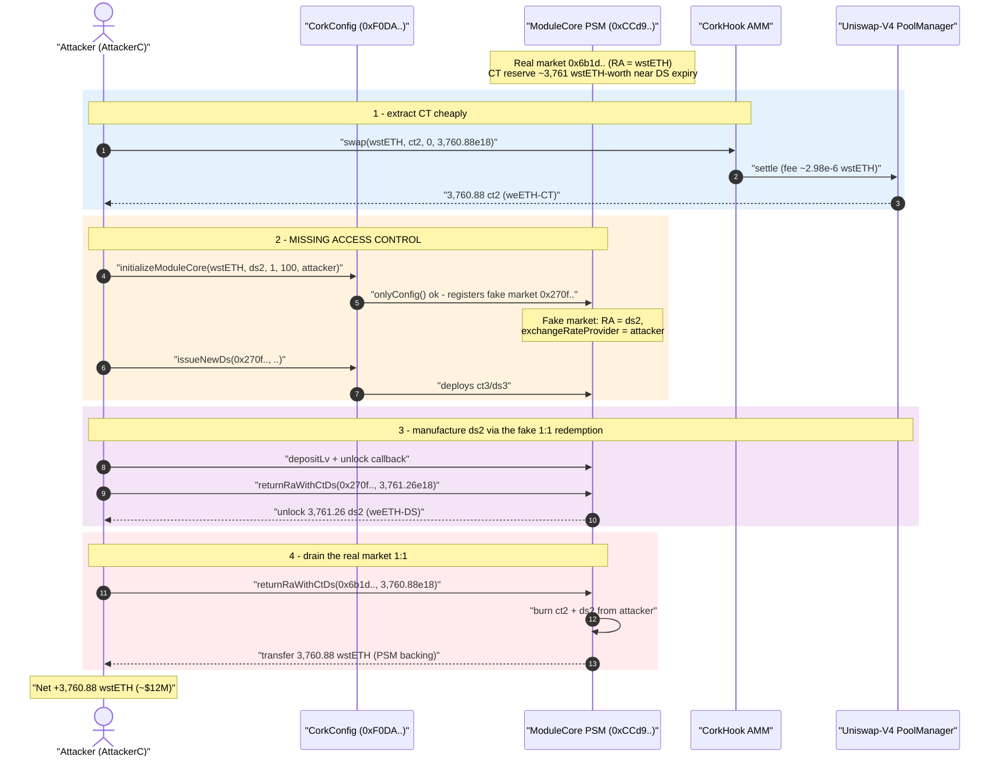
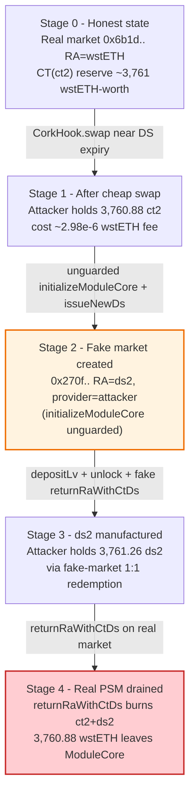
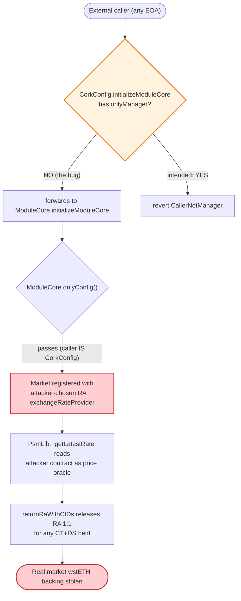

# Cork Protocol Exploit — Permissionless Market Creation with Attacker-Controlled `exchangeRateProvider`

> **Reproduction:** the PoC compiles & runs in an isolated Foundry project at
> [this project folder](.) (the umbrella DeFiHackLabs repo does not whole-compile, so this PoC
> was extracted). Full verbose trace: [output.txt](output.txt).
> Verified vulnerable source: [contracts_core_CorkConfig.sol](sources/CorkConfig_F0DA89/contracts_core_CorkConfig.sol)
> and [contracts_libraries_PsmLib.sol](sources/CorkConfig_F0DA89/contracts_libraries_PsmLib.sol).

---

## Key info

| | |
|---|---|
| **Loss** | ~$12M — **3,760.88 wstETH** drained from the live wstETH↔weETH PSM/Vault market |
| **Vulnerable contract** | `CorkConfig` — [`0xF0DA8927Df8D759d5BA6d3d714B1452135D99cFC`](https://etherscan.io/address/0xF0DA8927Df8D759d5BA6d3d714B1452135D99cFC#code) (permissionless `initializeModuleCore` / `issueNewDs`) |
| **Victim contract** | `ModuleCore` proxy (PSM + Liquidity Vault) — [`0xCCd90F6435dd78C4ECCED1FA4db0D7242548a2a9`](https://etherscan.io/address/0xCCd90F6435dd78C4ECCED1FA4db0D7242548a2a9) |
| **Drained market** | wstETH↔weETH market `id = 0x6b1d373b…6a9ea07a` (RA = wstETH) |
| **Attacker EOA** | `0xEA6f30e360192bae715599E15e2F765B49E4da98` |
| **Attacker contract** | `0x9af3dce0813fd7428c47f57a39da2f6dd7c9bb09` (PoC redeploys as `AttackerC`) |
| **Attack tx** | [`0xfd89cdd0be468a564dd525b222b728386d7c6780cf7b2f90d2b54493be09f64d`](https://app.blocksec.com/explorer/tx/eth/0xfd89cdd0be468a564dd525b222b728386d7c6780cf7b2f90d2b54493be09f64d) |
| **Chain / block / date** | Ethereum mainnet / 22,581,020 / May 28, 2025 |
| **Compiler** | Solidity v0.8.26 (PoC built with `via_ir = true`) |
| **Bug class** | Missing access control → attacker-controlled trust input (exchange-rate oracle) → cross-market RA drain |

---

## TL;DR

Cork Protocol lets a "Module" (a PSM + Liquidity-Vault pair) be created for a Redemption-Asset / Pegged-Asset
(RA/PA) couple. Each module mints two receipt tokens per epoch — a **CT** (Cover Token) and a **DS** (Depeg
Swap). The crucial economic guarantee is that **`CT + DS` of a market always redeems 1:1 for that market's RA**
(`returnRaWithCtDs`), and that the RA backing those receipts is held in the PSM.

Two governance entry points on `CorkConfig` were left **without the `onlyManager` modifier**:

- `initializeModuleCore(pa, ra, initialArp, expiryInterval, exchangeRateProvider)`
  ([contracts_core_CorkConfig.sol:247-259](sources/CorkConfig_F0DA89/contracts_core_CorkConfig.sol#L247))
- `issueNewDs(id, ammLiquidationDeadline)`
  ([:265-270](sources/CorkConfig_F0DA89/contracts_core_CorkConfig.sol#L265))

These were meant to be manager-only (the inner `ModuleCore` functions enforce `onlyConfig()`, trusting that
`CorkConfig` is the gatekeeper — but `CorkConfig` failed to gate the caller). Because anyone can call them, the
attacker:

1. **Registered a brand-new market whose RA is the *legitimate* market's DS token** (`ds2 = weETH-DS`), whose
   PA is wstETH, and **whose `exchangeRateProvider` is the attacker's own contract** — a contract that returns a
   rate of `1` on demand.
2. Used the AMM (`CorkHook`) to swap a few μwstETH of fee into **3,760.88 CT (`ct2`)** of the live market — the
   StableSwap curve near DS expiry prices CT≈RA, so virtually the whole CT reserve came out almost for free.
3. Issued a DS for the **attacker-controlled** market and deposited/redeemed against it, using the fake market's
   1:1 `CT+DS → RA` redemption (`returnRaWithCtDs`) to convert tokens it controlled into the live market's DS
   token (`ds2`, weETH-DS) at a manufactured rate.
4. Finally called `returnRaWithCtDs` on the **real** wstETH market with the `ct2`/`ds2` it had accumulated,
   redeeming **3,760.88 wstETH** of genuine PSM backing 1:1 and walking off with it.

Attacker wstETH balance went from **0.9966 → 3,761.88 wstETH** in one transaction — a net theft of
**≈ 3,760.88 wstETH (~$12M)**.

---

## Background — what Cork Protocol does

Cork is a "depeg-insurance" / pegged-asset money market. For an `(RA, PA)` pair (e.g. RA = wstETH, PA = weETH):

- **PSM (Peg Stability Module)** — depositing RA mints equal amounts of **CT** and **DS** tokens
  (`depositPsm` / `PsmLib.deposit`,
  [contracts_libraries_PsmLib.sol:329-350](sources/CorkConfig_F0DA89/contracts_libraries_PsmLib.sol#L329)).
  Holding both back (`returnRaWithCtDs`) burns them and returns the RA 1:1
  ([:393-403](sources/CorkConfig_F0DA89/contracts_libraries_PsmLib.sol#L393)).
- **Liquidity Vault (LV)** — pools CT/RA and provides liquidity to a Uniswap-V4 hook AMM (`CorkHook`,
  [lib_Cork-Hook_src_CorkHook.sol](sources/CorkHook_5287E8/lib_Cork-Hook_src_CorkHook.sol)) so DS/CT can be
  traded against RA. The AMM is a Curve-style StableSwap whose "1−t" parameter decays toward DS expiry,
  pushing CT's price toward 1 RA as expiry approaches.
- **`exchangeRateProvider`** — per-market oracle used by the PSM to value DS issuance/redemption
  (`PsmLib._getLatestRate`,
  [:51-69](sources/CorkConfig_F0DA89/contracts_libraries_PsmLib.sol#L51)).

`ModuleCore` (proxy `0xCCd9…a2a9`) holds all RA backing and enforces `onlyConfig()` on every privileged action,
delegating the *authorization* decision to `CorkConfig`
([contracts_interfaces_Init.sol](sources/CorkConfig_F0DA89/contracts_interfaces_Init.sol) documents
`initializeModuleCore` as "initialize a new pool … deploy new LV token", clearly an admin operation).

On the fork block the live wstETH↔weETH market `0x6b1d…07a` held thousands of wstETH of real backing. The
AMM reserves for the soon-to-expire epoch `dsId=7` were `(296,488,645 wstETH-wei, 3,761.26e18 ct2)` — i.e. the
CT side held essentially the entire ~3,761 wstETH of value (line 67 of the trace).

---

## The vulnerable code

### 1. Permissionless market creation in `CorkConfig`

```solidity
// contracts_core_CorkConfig.sol
modifier onlyManager() {
    if (!hasRole(MANAGER_ROLE, msg.sender)) revert CallerNotManager();
    _;
}

// ... dozens of admin setters all correctly use `onlyManager` ...
function setHook(address _hook) external onlyManager { ... }
function setTreasury(address _treasury) external onlyManager { ... }

// ⚠️ NO onlyManager — anyone can register a market with ANY parameters
function initializeModuleCore(
    address pa,
    address ra,
    uint256 initialArp,
    uint256 expiryInterval,
    address exchangeRateProvider      // ⚠️ caller picks the price oracle
) external {                          // ⚠️ no access modifier
    moduleCore.initializeModuleCore(pa, ra, initialArp, expiryInterval, exchangeRateProvider);
    Id id = moduleCore.getId(pa, ra, initialArp, expiryInterval, exchangeRateProvider);
    moduleCore.updateVaultNavThreshold(id, defaultNavThreshold);
}

// ⚠️ also unguarded except for the pause switch
function issueNewDs(Id id, uint256 ammLiquidationDeadline) external whenNotPaused {
    moduleCore.issueNewDs(id, defaultDecayDiscountRateInDays, rolloverPeriodInBlocks, ammLiquidationDeadline);
    _autoAssignFees(id);
    _autoAssignTreasurySplitPercentage(id);
}
```

[contracts_core_CorkConfig.sol:247-270](sources/CorkConfig_F0DA89/contracts_core_CorkConfig.sol#L247).
Every other state-changing function on `CorkConfig` carries `onlyManager`; these two — the most powerful ones —
do not.

### 2. `ModuleCore` trusts `CorkConfig` as gatekeeper

```solidity
// contracts_core_ModuleCore.sol
function initializeModuleCore(...) external {
    onlyConfig();          // ← only CorkConfig may call; assumes CorkConfig already authorized the caller
    ...
}
```

The defense-in-depth was meant to live in `CorkConfig.onlyManager`. With that modifier missing, `onlyConfig()`
is satisfied by routing through the public `CorkConfig.initializeModuleCore`, so the whole chain is open.

### 3. The exchange rate is read straight from the caller-supplied provider

```solidity
// contracts_libraries_PsmLib.sol
function _getLatestRate(State storage self) internal view returns (uint256 rate) {
    Id id = self.info.toId();
    uint256 exchangeRates = IExchangeRateProvider(self.info.exchangeRateProvider).rate();   // ⚠️
    if (exchangeRates == 0) {
        exchangeRates = IExchangeRateProvider(self.info.exchangeRateProvider).rate(id);      // ⚠️
    }
    return exchangeRates;
}
```

[contracts_libraries_PsmLib.sol:51-61](sources/CorkConfig_F0DA89/contracts_libraries_PsmLib.sol#L51). For a
market the attacker created, `self.info.exchangeRateProvider` *is the attacker's contract*. In the PoC the
attacker exposes `rate() => 0` and `rate(bytes32) => 1` ([test/Corkprotocol_exp.sol:237-243](test/Corkprotocol_exp.sol#L237)),
so the fake market values DS at the fixed rate `1`.

### 4. 1:1 RA redemption against any `CT+DS` of the market

```solidity
// contracts_libraries_PsmLib.sol
function _returnRaWithCtDs(State storage self, DepegSwap storage ds, address owner, uint256 amount)
    internal returns (uint256 ra)
{
    ra = TransferHelper.fixedToTokenNativeDecimals(amount, self.info.ra);
    self.psm.balances.ra.unlockTo(owner, ra);          // ← releases the market's RA 1:1
    ERC20Burnable(ds.ct).burnFrom(owner, amount);
    ERC20Burnable(ds._address).burnFrom(owner, amount);
}
```

[contracts_libraries_PsmLib.sol:393-403](sources/CorkConfig_F0DA89/contracts_libraries_PsmLib.sol#L393). This is
correct *if* the CT/DS were honestly minted by depositing RA. The attack subverts that invariant by acquiring the
real market's CT (`ct2`) almost for free from the AMM, and by fabricating the matching DS (`ds2`) through the
self-controlled fake market — then redeeming the real market's wstETH 1:1.

---

## Root cause — why it was possible

The proximate root cause is a **single missing access-control modifier**: `CorkConfig.initializeModuleCore` and
`CorkConfig.issueNewDs` should be `onlyManager` but are not. That one omission turns a privileged, trusted
operation (registering a market and choosing its price oracle) into a permissionless one, and the design's trust
model collapses:

1. **Attacker-chosen `exchangeRateProvider`.** The PSM reads the per-market rate from whatever address was passed
   at `initializeModuleCore` time. By registering a market with its own contract as the provider, the attacker
   controls the price used to mint/redeem DS in that market — defeating the only economic check on DS issuance.
2. **Attacker-chosen RA.** The attacker set the *fake* market's RA to the *real* market's DS token (`ds2`,
   weETH-DS). This couples the two markets: receipts minted in the fake market can be spent as if they were the
   real market's DS.
3. **Cheap CT extraction from the AMM.** Near DS expiry the StableSwap curve prices CT ≈ RA, so a swap consuming
   only the **fee** (~2.98e-6 wstETH) pulled out **3,760.88 `ct2`** — essentially the entire CT reserve of the
   live market (line 78 + line 136 of the trace).
4. **1:1 RA redemption with no provenance check.** `returnRaWithCtDs` releases RA to anyone holding the market's
   CT+DS in equal amount, regardless of how those tokens were obtained. Once the attacker held both `ct2` and
   `ds2`, the real wstETH backing was theirs for the taking.

In short: *governance trust input (the price oracle) + market-asset coupling + a 1:1 redemption primitive*,
all unlocked by a missing `onlyManager`, compose into a full drain of the PSM's RA.

---

## Preconditions

- `CorkConfig.initializeModuleCore` / `issueNewDs` reachable by an arbitrary EOA (the bug — true at the fork
  block).
- A live, well-funded market exists (wstETH↔weETH `0x6b1d…07a`) whose AMM holds the bulk of its value on the CT
  side as it nears DS expiry — so CT can be swapped out near 1:1.
- Working capital is tiny: the attacker entered with **0.9966 wstETH** plus some existing `LiquidityToken`
  balance; the swap fee paid into the AMM was only ~**2.98e-6 wstETH**. The exploit is essentially self-funding.

---

## Attack walkthrough (with on-chain numbers from the trace)

All figures are taken from [output.txt](output.txt). Key actors: `ModuleCore` proxy `0xCCd9…a2a9`,
`CorkConfig` `0xF0DA…9cFC`, `CorkHook` `0x5287…Ea88`, Uniswap-V4 `PoolManager` `0x0000…8A90`,
FlashSwapRouter proxy `0x55B9…0fc3`. `ct2 = 0xCd25aA56` (weETH-CT), `ds2 = 0x7ea06140` (weETH-DS).

| # | Step | On-chain effect |
|---|------|-----------------|
| 0 | **Setup** — attacker holds 0.9966 wstETH; pushes its `LiquidityToken` dust into `ModuleCore` and pulls its 0.9966 wstETH into the attack contract | balance bookkeeping (trace L43-L61) |
| 1 | **Read the live market** — `getDeployedSwapAssets(wstETH, _pa, …, 7)` ⇒ `ct2 = 0xCd25…`, `ds2 = 0x7ea0…`; `CorkHook.getReserves(wstETH, ct2)` = `(296,488,645 wei, 3,761.26e18 ct2)` | L62-L67 |
| 2 | **Cheap CT extraction** — `CorkHook.swap(wstETH, ct2, 0, 3,760.88e18)`: the StableSwap curve near expiry lets the attacker take **3,760.88 ct2** out for only **~2.98e-6 wstETH** of fee (`PoolManager.take(ct2 → attacker, 3,760.88e18)`) | L78-L137 |
| 3 | **Deposit into the real market** — `depositPsm(0x6b1d…07a, 4e15)` mints `4e15 CT + 4e15 DS` for epoch `dsId=2`, locking only `4e15` wstETH | L221-L265 |
| 4 | **⚠️ Permissionless market creation** — `CorkConfig.initializeModuleCore(wstETH, ds2, 1, 100, attacker)` registers fake market `id = 0x270f…4c7d` with **RA = ds2** and **exchangeRateProvider = attacker** | L271-L344 |
| 5 | **⚠️ Permissionless DS issuance** — `CorkConfig.issueNewDs(0x270f…4c7d, …)` deploys the fake market's `ct3 = 0x51f7…` / `ds3 = 0x1D27…` (epoch `dsId=1`) | L349-L443 |
| 6 | **Seed the fake market** — `depositLv(0x270f…4c7d, 2e15, …)` mints fake CT/DS and initializes a Uniswap-V4 pool for `ct3/ds2` (rate fixed at `1` via attacker provider) | L455-L793 |
| 7 | **Manufacture `ds2` via the fake market** — `PoolManager.unlock` → attacker `unlockCallback` drives the AMM and the FlashSwapRouter's `returnRaWithCtDs` on the *fake* market, depositing 3,761.26 `ds2` into the real PSM proxy and pulling it back out as attacker-held `ds2` | L794-L1082 |
| 8 | **Redeem the fake market 1:1** — `returnRaWithCtDs(0x270f…4c7d, 3,761.26e18)` burns the attacker's fake CT/DS and unlocks **3,761.26 `ds2`** to the attacker | L1036-L1066 |
| 9 | **Drain the REAL market 1:1** — `returnRaWithCtDs(0x6b1d…07a, 3,760.88e18)` burns `ct2 + ds2` and **`WstETH.transfer(attacker, 3,760.88e18)`** out of `ModuleCore` | L1095-L1125 |
| 10 | **Withdraw** — `WstETH.transfer(attacker EOA, 3,761.88e18)` | L1137-L1142 |

The decisive event is **L1102**:
`WstETH.transfer(from: ModuleCore, to: AttackerC, value: 3,760,885,365,943,909,071,528)` — the real PSM's
wstETH backing leaving 1:1 against tokens the attacker assembled for ~free.

### Profit accounting (wstETH)

| | Amount (wstETH) |
|---|---:|
| Attacker balance before | 0.996592 |
| AMM swap fee paid (step 2) | ≈ 0.00000298 |
| PSM deposit (step 3, recovered) | 0.004 (round-trips back) |
| **wstETH unlocked from real market (step 9)** | **3,760.885366** |
| Attacker balance after | **3,761.877955** |
| **Net profit** | **≈ 3,760.881 wstETH (~$12M)** |

The ≈3,760.88 wstETH out is essentially the entire CT-side value of the live wstETH↔weETH market — the honest
backing depositors had locked in the PSM.

---

## Diagrams

### Sequence of the attack



### Market / state evolution



### Where trust breaks: the `onlyManager` gap



---

## Remediation

1. **Gate market creation and issuance.** Add `onlyManager` (or a dedicated `MARKET_CREATOR_ROLE`) to
   `CorkConfig.initializeModuleCore` and `CorkConfig.issueNewDs`. These deploy tokens, choose the RA and the
   price oracle, and create AMM pools — they must never be permissionless. This single change closes the
   exploit.
2. **Whitelist / validate `exchangeRateProvider`.** Even for trusted creators, restrict the provider to a known
   set of oracle implementations and reject EOAs / arbitrary contracts. Never let an externally chosen contract
   define the redemption rate of a market that shares accounting with other markets.
3. **Constrain RA/PA to vetted assets.** Reject markets whose RA is *another market's CT/DS token*. The
   attack hinges on coupling a fake market's RA to the real market's DS; an allow-list of base assets (wstETH,
   weETH, etc.) breaks that coupling.
4. **Enforce provenance in `returnRaWithCtDs`.** The 1:1 RA release is safe only if the CT/DS were minted by
   locking RA in the same market. Track per-market minted supply and ensure redemptions cannot exceed honestly
   locked RA, so receipts obtained by AMM swaps (rather than PSM deposits) cannot pull more RA than was deposited.
5. **Don't trust reserve-near-expiry pricing for cheap CT.** Independently, the StableSwap curve that let
   3,760 CT be swapped out for a fee-only cost is a sharp edge; bound single-swap reserve impact and add slippage
   guards on the LV/AMM side.

---

## How to reproduce

The PoC was extracted into a standalone Foundry project (the umbrella DeFiHackLabs repo does not whole-compile):

```bash
_shared/run_poc.sh 2025-05-Corkprotocol_exp -vvvvv
```

- `foundry.toml` sets `via_ir = true` (the PoC's deep stack needs it) and uses an **Infura mainnet archive**
  endpoint (fork block `22,581,019`); pruned public RPCs fail with `header not found` / `missing trie node`.
- Result: `[PASS] testPoC()` — attacker wstETH balance goes from `0.9966` to `3,761.88`.

Expected tail:

```
Ran 1 test for test/Corkprotocol_exp.sol:ContractTest
[PASS] testPoC() (gas: 9801968)
Logs:
  before attack: balance of attacker: 0.996592406032878584
  after attack: balance of attacker: 3761.877955370438004964

Suite result: ok. 1 passed; 0 failed; 0 skipped; finished in 40.68s
```

---

*Reference: SlowMist post-mortem — https://x.com/SlowMist_Team/status/1928100756156194955 (Cork Protocol, Ethereum, ~$12M).*
