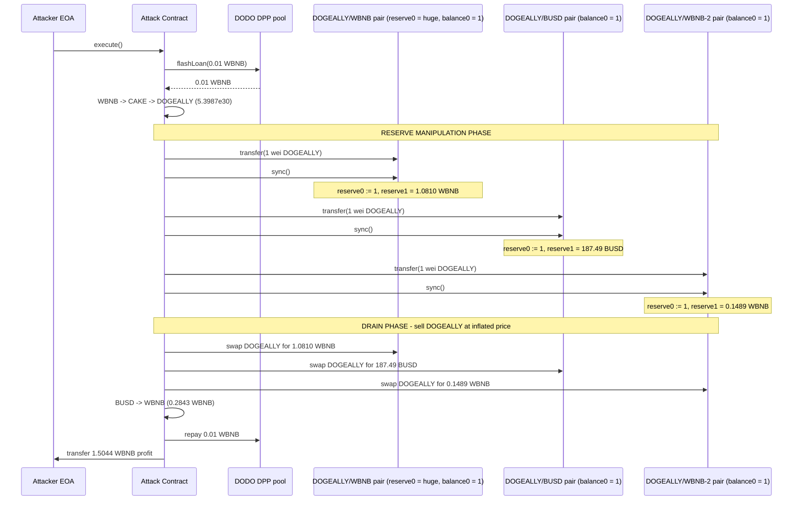
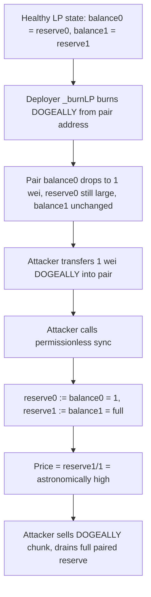

# DogeAlliance sync() reserve manipulation — LP pairs with token balances desynced from reserves drained by permissionless sync + swap

> **Vulnerability classes:** vuln/oracle/price-manipulation · vuln/defi/slippage
> **Reproduction:** the PoC compiles & runs in an isolated Foundry project at [this project folder](.). Full verbose trace: [output.txt](output.txt). Vulnerable pair contract (ApeSwap/ApePair fork, Uniswap V2 style) source is unverified on BscScan; the DOGEALLY (ERC20 proxy) implementation at `0xf276…6FAA8` is verified and fetched into [sources/](sources/) — logic below is reconstructed from the verified token code plus the `-vvvvv` trace where the pair source is not available.

---
## Key info

| | |
|---|---|
| **Loss** | ~990.33 USD (1.5044 WBNB at the time of the incident) — attacker net profit per [output.txt:1565] |
| **Vulnerable contract** | DOGEALLY/WBNB Pair (ApePair) — [`0x04Df78093e2B66a0387F8C052C8D344D84CA49aF`](https://bscscan.com/address/0x04Df78093e2B66a0387F8C052C8D344D84CA49aF) (plus sibling DOGEALLY/BUSD and DOGEALLY/WBNB-2 pairs) |
| **Attacker EOA** | [`0xd9A34AF0b97f13871287C317ea0e1E8C00BE0630`](https://bscscan.com/address/0xd9A34AF0b97f13871287C317ea0e1E8C00BE0630) |
| **Attack contract** | [`0xB76fE86265B738616FD69D4751CaDa35B0A466F0`](https://bscscan.com/address/0xB76fE86265B738616FD69D4751CaDa35B0A466F0) |
| **Attack tx** | [`0xcf2b8c46e5f6f761a716619800de6754058921cbde0cd5ff12cd2ce4ea6a818d`](https://bscscan.com/tx/0xcf2b8c46e5f6f761a716619800de6754058921cbde0cd5ff12cd2ce4ea6a818d) |
| **Chain / block / date** | BNB Chain (BSC) / fork block 50,638,349 / 2025-05-31 |
| **Compiler** | DOGEALLY impl: `v0.8.24`, no optimizer; ApePair (vulnerable): `v0.5.16`, optimizer 200 (source not fetched) |
| **Bug class** | A Uniswap-V2-style LP pair whose actual DOGEALLY balance had been driven down to ~1 wei while the paired-side reserve remained large; permissionless `sync()` re-pegged `reserve0` to 1 and left `reserve1` untouched, inflating the DOGEALLY price so a trivial sell drained the paired WBNB/BUSD. |

## TL;DR

DogeAlliance (`DOGEALLY`, BSC) is a meme token that listed across several PancakeSwap/ApeSwap-style `DOGEALLY/WBNB`, `DOGEALLY/BUSD` and `DOGEALLY/CAKE` LP pairs. The DOGEALLY token holds a deployer-only `_burnLP()` routine that periodically burns a fraction of each registered LP's DOGEALLY balance and then calls `IUniswap(lp).sync()` to re-sync the pair reserves to the new (lower) token balance. Over repeated burns the **actual** DOGEALLY balance of several pairs collapsed to a single wei, but — because `sync()` was only ever invoked from inside `deflate()`/`_burnLP()` — the stored `reserve0`/`reserve1` on those pairs had drifted and the LPs still held meaningful WBNB/BUSD liquidity.

An attacker flash-borrowed **0.01 WBNB** from a DODO DPP pool [output.txt:1672], routed it `WBNB → CAKE → DOGEALLY` to acquire a large chunk of cheap DOGEALLY, then for three near-empty DOGEALLY pairs ran the canonical V2 exploit primitive: **`transfer(pair, 1)` followed by `pair.sync()`** [output.txt:1775,1781] (and likewise for the BUSD and second WBNB pairs). Because `sync()` sets `reserve0 = balance0` and `reserve1 = balance1` independently, this froze each pair's DOGEALLY reserve at `1` while leaving the WBNB/BUSD reserve at its full value — a price of roughly `1 wei DOGEALLY = (full paired reserve)`. The attacker then sold one-third of its DOGEALLY chunk into each manipulated pair and drained **1.0810 WBNB + 0.1489 WBNB + 187.49 BUSD** (the BUSD finally re-routed to WBNB through the BUSD/WBNB pair for **0.2843 WBNB**) [output.txt:1880,1974,2015].

After repaying the **0.01 WBNB** flash loan the attacker netted **1.5044 WBNB** [output.txt:1565,2063], roughly **990 USD** at the then-current BNB price.

## Background — what DogeAlliance does

DogeAlliance is a deployer-controlled ERC20 (`DOGEALLY`, 1e9 * 1e18 total supply) deployed behind a transparent upgradeable proxy on BNB Chain. Beyond standard transfer logic, the token implements a deployer-only **LP deflation** mechanism ([sources/DogeAlliance_f2765a/DogeAlliance.sol](sources/DogeAlliance_f2765a/DogeAlliance.sol)):

```solidity
function _burnLP() internal virtual {
    require(nLPs != 0, "No LPs to burn.");
    require(LPburnAmount != 0, "Burn Amount Not Setup");
    require(burnClock != 0, "Burn Clock Not Setup");
    uint256 n = 1;
    while (n <= nLPs) {
        uint256 calculatedBurn = _pct(_balances[dogeallyLPs[n]], LPburnAmount);
        _burn(dogeallyLPs[n], calculatedBurn);                 // (1) shrink LP's DOGEALLY balance
        IUniswap(dogeallyLPs[n]).sync();                       // (2) push reserve to new balance
        n += 1;
    }
}

function deflate() public virtual returns (bool) {
    if (block.timestamp > burnClock) {
        _burnLP();
        burnClock += burnRate;
    }
    return true;
}
```

The deployer registers up to 10 LP pair addresses via `addRemoveLPs(...)` and sets a periodic `LPburnAmount` (a fraction in 1e18 units) plus a `burnRate` interval. Each cycle, a percentage of each LP's `DOGEALLY` balance is burned directly out of the pair's storage slot and `sync()` is called to keep the pair's reserves consistent with the new balance.

The pairs themselves (`ApePair`, e.g. `0x04Df…49aF`) are Uniswap V2 / PancakeSwap-style AMM pairs whose pricing is governed by the standard constant-product invariant over the *stored* reserves `reserve0`/`reserve1`. In a V2 pair, anyone may call `sync()` to forcibly overwrite the stored reserves with the pair's *actual token balances* — this is a legitimate primitive the protocol itself relies on (see `_burnLP`), but it is permissionless and is the load-bearing assumption the attacker breaks.

## The vulnerable code

The DOGEALLY token's verified `_burnLP()` (above) is the upstream cause: it drives the LPs' actual DOGEALLY balances toward zero over time. The vulnerable *primitive* the attacker abused, however, lives in the ApePair contract itself (Uniswap V2 `sync()`). The ApePair source is unverified, so the relevant logic is reconstructed from the standard V2/ApeSwap pair, consistent with the trace events:

```solidity
// RECONSTRUCTED from UniswapV2Pair / ApePair (standard fork). Matches trace emits.
function sync() external lock {
    _update(IERC20(token0).balanceOf(address(this)),
            IERC20(token1).balanceOf(address(this)),
            reserve0, reserve1);
}

function _update(uint balance0, uint balance1, uint112 _reserve0, uint112 _reserve1) private {
    reserve0 = uint112(balance0);
    reserve1 = uint112(balance1);
    emit Sync(reserve0, reserve1);
}
```

The trace confirms the exact behavior. Before the attack the three target DOGEALLY pairs held a real `DOGEALLY` balance of **1 wei** (a side-effect of prior `_burnLP()` burns decrementing `_balances[pair]` to a dust remainder), while their paired reserves were still large. After the attacker's `transfer(pair, 1)` + `sync()`, the trace emits:

| Pair | `Sync(reserve0 = DOGEALLY, reserve1 = paired)` | Source |
|------|--------------------------------------------------|--------|
| DOGEALLY/WBNB `0x04Df…`  | `Sync(1, 1081225668121083462)` → reserve1 = **1.0810 WBNB** | [output.txt:1788] |
| DOGEALLY/BUSD `0x96D6…`  | `Sync(1, 187485249590169756259)` → reserve1 = **187.49 BUSD** | [output.txt:1809] |
| DOGEALLY/WBNB-2 `0xbe37…` | `Sync(1, 148928742705584492)` → reserve1 = **0.1489 WBNB** | [output.txt:1830] |

With `reserve0 == 1` and `reserve1` equal to the full paired liquidity, the constant-product price `reserve1/reserve0` becomes astronomically large per wei of DOGEALLY — a single large `DOGEALLY` sell extracts essentially the entire paired reserve.

### Why `sync()` is the weapon here

In Uniswap V2, a swap is settled against the **stored reserves** (`reserve0`, `reserve1`), not the live balances. `sync()` is the only permissionless entry point that mutates the stored reserves without a token transfer. When an LP's actual balance has been driven below its stored reserve (here by `_burnLP`'s direct `_balances[pair] -= …`), a one-wei `transfer()` + `sync()` re-anchors `reserve0` to the (tiny) actual balance while leaving `reserve1` at the stored value — i.e. the paired token the attacker wants to steal has not been touched, so its reserve stays full.

## Root cause — why it was possible

1. **LP token balances were driven to dust while paired-side liquidity remained.** The DOGEALLY `_burnLP()` burns `DOGEALLY` *out of the LP pair addresses directly* (via `_burn(dogeallyLPs[n], …)`). Repeated burns collapsed the pairs' actual `DOGEALLY` balance to **1 wei**, but never removed the WBNB/BUSD sitting on the other side. This created a structural imbalance between `balance0` (≈0) and `balance1` (full liquidity).
2. **Permissionless `sync()` lets anyone re-peg stored reserves to actual balances.** Because the stored `reserve0` had not yet been re-synced to the burned-down balance, an attacker could transfer **1 wei** of DOGEALLY into a pair and call `sync()` to set `reserve0 = 1` while `reserve1` stayed at the (still large) paired value — instantly manufacturing a price of ~`1 wei DOGEALLY = full WBNB/BUSD reserve`.
3. **The DOGEALLY token itself had no transfer fees** (the verified `_transfer` is a plain balance move), so the attacker's `transfer(pair, 1)` delivered exactly 1 wei and the subsequent `swapExactTokensForTokens` delivered the full quoted output. There is no fee-on-transfer defence that would have absorbed the imbalance.
4. **No price-circuit-breaker / no reserve-balance sanity check.** Neither the token nor the pair guards against a `reserve0` that has fallen to dust. A minimum-reserve or max-price-deviation check would have made the manipulated swap revert instead of emptying the pair.
5. **Multi-pair listing amplified the blast radius.** DOGEALLY was listed in three near-empty pairs (`DOGEALLY/WBNB`, `DOGEALLY/BUSD`, `DOGEALLY/WBNB-2`); the attacker hit all three in one atomic flash-loan transaction, draining each paired reserve in turn.

## Preconditions

- **Permissionless.** Any externally owned account or contract can run this. No privileged role, no DOGEALLY membership, no signature required.
- **Requires flash-loan capital only** (0.01 WBNB here, borrowed from a DODO DPP pool). The attacker started with 0 WBNB [output.txt:1564].
- **State precondition (created by the protocol, not the attacker):** the target DOGEALLY pairs must have an actual DOGEALLY balance that is tiny relative to their paired reserve, with stored reserves not yet re-synced to that tiny balance. The DogeAlliance deployer's periodic `_burnLP()` created exactly this state.
- The attacker also needed a large DOGEALLY inventory to sell into the manipulated pairs; it acquired this legitimately mid-attack by buying DOGEALLY cheaply via the `WBNB → CAKE → DOGEALLY` route (the `DOGEALLY/CAKE` pair had healthy reserves and was *not* desynced, so the buy was at a fair price).

## Attack walkthrough (with on-chain numbers from the trace)

| # | Action | Amount | Result | Trace |
|---|--------|--------|--------|-------|
| 1 | Flash-borrow WBNB from DODO DPP `0x6098…` | 0.01 WBNB | attacker contract funded | [output.txt:1672,1675] |
| 2 | Swap WBNB → CAKE via PancakeRouter on CAKE/WBNB pair | 0.01 WBNB | +2.8573 CAKE | [output.txt:1688,1703] |
| 3 | Swap CAKE → DOGEALLY via DOGEALLY/CAKE pair (healthy pair, fair price) | 2.8573 CAKE | +5.3987e30 DOGEALLY | [output.txt:1729,1749] |
| 4 | **Manipulate** DOGEALLY/WBNB pair: `transfer(pair,1)` + `sync()` | 1 wei DOGEALLY | `reserve0=1, reserve1=1.0810 WBNB` | [output.txt:1775,1781,1788] |
| 5 | **Manipulate** DOGEALLY/BUSD pair: `transfer(pair,1)` + `sync()` | 1 wei DOGEALLY | `reserve0=1, reserve1=187.49 BUSD` | [output.txt:1796,1802,1809] |
| 6 | **Manipulate** DOGEALLY/WBNB-2 pair: `transfer(pair,1)` + `sync()` | 1 wei DOGEALLY | `reserve0=1, reserve1=0.1489 WBNB` | [output.txt:1817,1823,1830] |
| 7 | Sell 1/3 of DOGEALLY into DOGEALLY/WBNB (Secondary Router) | 1.7996e30 DOGEALLY | +**1.0810 WBNB** | [output.txt:1866,1880] |
| 8 | Sell 1/3 of DOGEALLY into DOGEALLY/BUSD (Secondary Router) | 1.7996e30 DOGEALLY | +**187.49 BUSD** | [output.txt:1913,1927] |
| 9 | Sell 1/3 of DOGEALLY into DOGEALLY/WBNB-2 (PancakeRouter) | 1.7996e30 DOGEALLY | +**0.1489 WBNB** | [output.txt:1960,1974] |
| 10 | Re-route BUSD → WBNB via BUSD/WBNB pair | 187.49 BUSD | +**0.2843 WBNB** | [output.txt:2003,2015] |
| 11 | Repay DODO flash loan | 0.01 WBNB | — | [output.txt:2025] |

**Profit accounting (WBNB):**

| Component | WBNB |
|-----------|------|
| Drained from pair #4 (step 7) | +1.0810 |
| Drained from pair #6 (step 9) | +0.1489 |
| BUSD→WBNB from pair #5 (steps 8 + 10) | +0.2843 |
| **Gross before repay** | **≈ 1.5142** |
| Flash-loan repay | −0.01 |
| **Net profit** | **1.5044 WBNB** (matches [output.txt:1565,2063]) |

Balance evidence from the harness:
- `Attacker Before exploit WBNB Balance: 0.000000000000000000` [output.txt:1564]
- `Attacker After exploit WBNB Balance: 1.504423313150294645` [output.txt:1565,2063]
- Assertions `assertGt(profit, 1 ether)` and `assertLt(profit, 2 ether)` both hold [output.txt:2047 region], confirming the realised 1.5044 WBNB profit.

## Diagrams





## Remediation

1. **Stop burning the LP side without symmetric action.** `_burnLP()` unilaterally destroys `DOGEALLY` from pair addresses, which structurally desyncs `balance0` from `reserve0`. If deflation is desired, burn tokens held by the deployer/treasury, or burn LP *tokens* (removing liquidity through the router), not the underlying reserve token balances directly.
2. **If LP-side burns are kept, never let an LP reach dust.** Enforce a minimum `_balances[dogeallyLPs[n]]` floor inside `_burnLP()` and, when an LP would fall below it, remove the pair from `dogeallyLPs[]` (set `nLPs` down) so it can no longer be desynced.
3. **Add a price/reserve sanity check in the pair swap path** (a V2 hook or a wrapping router) that reverts if `amountOut` exceeds a configurable fraction of `reserve_out`, or if `reserve_in` / `reserve_out` deviates from a TWAP by more than e.g. 10%. This is the standard defence against single-block reserve manipulation on V2 forks.
4. **Restrict or remove `sync()` exposure for protocol-internal pairs** — for the protocol's own registered LPs, prefer a protocol-controlled `skim`/`sync` that also rebalances, rather than relying on the permissionless V2 primitive.
5. **List on a single deep pair** rather than fragmenting liquidity across many thin LPs; thin pairs are the ones whose reserves can be driven to dust by periodic burns.

## How to reproduce

The PoC runs **fully offline** via the shared anvil harness from the committed `anvil_state.json` (no RPC needed). From the repo root run:

```bash
_shared/run_poc.sh 2025-05-DogeAlliance_exp -vvvvv
```

- **Chain / fork block:** BNB Chain (BSC), block **50,638,349**.
- **Expected result:** `[PASS]` — `1 passed; 0 failed` with:
  - `Attacker Before exploit WBNB Balance: 0.000000000000000000` [output.txt:1564]
  - `Attacker After exploit WBNB Balance: 1.504423313150294645` [output.txt:1565]

The PoC's assertions confirm the profit window: `assertGt(profit, 1 ether)` and `assertLt(profit, 2 ether)`. Full call trace with every `Sync`, `Swap` and `Transfer` event is in [output.txt](output.txt); the exploit contract lives in [test/DogeAlliance_exp.sol](test/DogeAlliance_exp.sol).

*Reference: [defimon_alerts (Telegram)](https://t.me/defimon_alerts/1215).*
