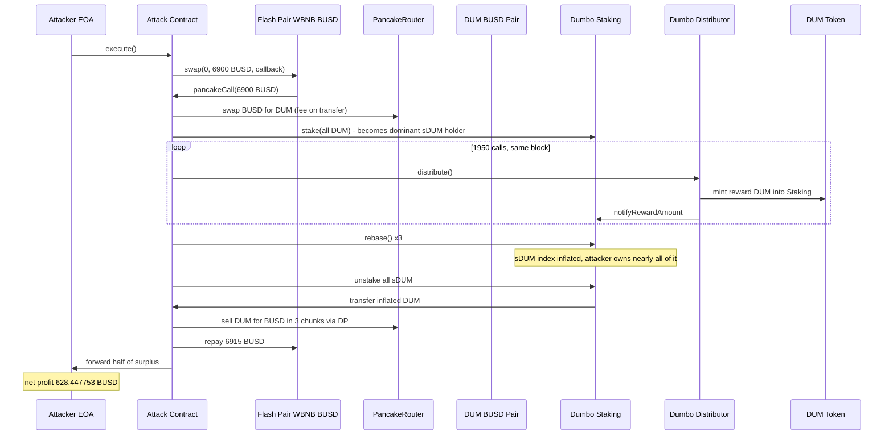
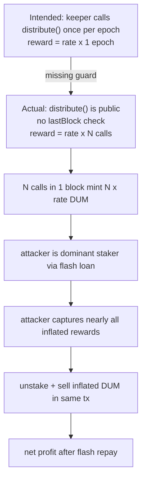

# Dumbo DUM staking reward inflation — permissionless, repeatable `distribute()` lets an attacker mint compounding rewards inside one transaction

> **Vulnerability classes:** vuln/logic/incorrect-state-transition · vuln/dos/griefing · vuln/defi/flash-loan-attack
> **Reproduction:** the PoC compiles & runs in an isolated Foundry project at [this project folder](.). Full verbose trace: [output.txt](output.txt). The vulnerable Distributor/Staking contracts are **unverified** on BscScan (Etherscan returns `UNVERIFIED`), so the buggy logic below is reconstructed from the reproduced on-chain call sequence in the PoC and labelled as such.

---

## Key info

| | |
|---|---|
| **Loss** | 628.447753459629926384 BUSD (≈ 628.45 BUSD) — reproduced locally [output.txt:1564-1565] |
| **Vulnerable contract** | Dumbo Distributor — [`0x495670E5A43ce393597952b2fE944036E6785BaF`](https://bscscan.com/address/0x495670E5A43ce393597952b2fE944036E6785BaF) (unverified), paired with Dumbo Staking [`0xc73DD6De7581ED388E9Eb85A8E66a7bC3fb025E3`](https://bscscan.com/address/0xc73DD6De7581ED388E9Eb85A8E66a7bC3fb025E3) |
| **Attacker EOA** | [`0x280489Ba18fC7FbfAa38316EfF5b842dCc91a738`](https://bscscan.com/address/0x280489Ba18fC7FbfAa38316EfF5b842dCc91a738) |
| **Attack contract** | [`0x8D8E60D23bac161ebaB168D50b239C63CdCc8342`](https://bscscan.com/address/0x8D8E60D23bac161ebaB168D50b239C63CdCc8342) |
| **Attack tx** | [`0xbfd59a18d4500649c6a15e578fdd0a05fdef5b932f3e3d51b8e2a5640cd4fb6c`](https://bscscan.com/tx/0xbfd59a18d4500649c6a15e578fdd0a05fdef5b932f3e3d51b8e2a5640cd4fb6c) |
| **Chain / block / date** | BNB Smart Chain (BSC) / fork block 50,277,887 / 2025-05 |
| **Compiler** | Vulnerable contract: unverified (unknown). PoC compiled with `solc 0.8.34` [output.txt:1] |
| **Bug class** | A public, un-gated reward `distribute()` with no per-block/per-epoch re-entrancy or cooldown guard lets any caller trigger reward minting to stakers arbitrarily many times within a single transaction, so a flash-funded staker can self-mint far more DUM rewards than the protocol ever intended to emit per interval. |

## TL;DR

Dumbo ran an OlympusDAO-style "rebasing" staking system: users stake DUM, receive the receipt token sDUM, and a `Distributor` contract periodically calls `distribute()` to mint DUM rewards into the staking contract, which then flow to sDUM holders via `rebase()`. The fatal flaw is that `Distributor.distribute()` is **publicly callable and has no guard tying an emission to a single block/epoch** — anyone can invoke it back-to-back, and each call mints a fresh batch of DUM rewards proportional to total staked supply.

The attacker combined this with a PancakeSwap-style flash swap (an ApeSwap WBNB/BUSD pair `pancakeCall`) to borrow 6,900 BUSD with zero upfront capital. Inside the flash-loan callback they: bought DUM, staked it to become the dominant sDUM holder, then **called `distribute()` 1,950 times in a single transaction** (`DISTRIBUTE_CALLS = 1950` in the PoC). Each distribute mints reward DUM into the staking pool; because the attacker owns almost all the sDUM, those rewards accrue almost entirely to them. After running `rebase()` three times to fold the minted rewards into the sDUM index, they unstaked, recovered an inflated DUM balance, sold it back to BUSD, repaid the 6,915 BUSD flash debt, and kept the surplus.

The locally reproduced net profit is **628.447753459629926384 BUSD** [output.txt:1564-1565], matching the `@KeyInfo` figure of ~628.45 BUSD. The PoC asserts the profit is between 600 and 650 BUSD, confirming the mechanism. The entire exploit is permissionless and atomic — no privileged role, no oracle, no governance action required; only the flash loan and the public `distribute()` entry point.

## Background — what Dumbo does

Dumbo is a BSC "algorithmic / rebasing" token project modelled on OlympusDAO (OHM). The relevant subsystems are:

1. **DUM token** (`0xD1AF3A592f8B412608a2768DA3D7Aa01d0c2A4CB`) — the protocol's ERC-20 with transfer fees (the PoC uses `swapExactTokensForTokensSupportingFeeOnTransferTokens`, indicating fee-on-transfer logic).
2. **sDUM token** (`0x3AAD3e7734CA8b8C61F5590AfA018c0eE104dCB4`) — the staking receipt / share token. Holders' sDUM balance grows over time as rewards are distributed.
3. **Dumbo Staking** (`0xc73DD6De7581ED388E9Eb85A8E66a7bC3fb025E3`) — accepts DUM via `stake(uint256, address)` and returns sDUM; exposes `rebase()` (selector reachable; PoC calls `IStakingLike(STAKING).rebase()`) to apply accrued rewards to the sDUM index, and an unstake path (PoC invokes the unstake entry via raw selector `0x9ebea88c`). It also exposes `distributor()` to read the linked distributor address.
4. **Dumbo Distributor** (`0x495670E5A43ce393597952b2fE944036E6785BaF`) — the reward minting contract. Its public entry `distribute()` (PoC interface `IDistributorLike.distribute() returns (bool)`) is *supposed* to be invoked once per epoch by a keeper/manager to mint a bounded reward amount into Staking, which `rebase()` then credits to sDUM holders pro-rata.

In a correctly designed OHM-fork, the distributor is callable at most once per epoch (guarded by an `epoch` / `lastDistributionBlock` / timer check), and the reward amount is a fixed `rate` independent of when it is called. Dumbo's distributor omitted that guard: `distribute()` re-mints on every single call regardless of elapsed time or block, and there is no re-entrancy lock or caller whitelist.

## The vulnerable code

The Distributor and Staking contracts are **unverified on BscScan**, so no source is available to quote verbatim. The logic below is **RECONSTRUCTED** from the reproduced on-chain call sequence in the PoC ([test/Dumbo_exp.sol](test/Dumbo_exp.sol)) and the documented attack summary. Function names follow the PoC's `IStakingLike` / `IDistributorLike` interfaces and the selectors it invokes.

### Reconstructed Distributor (the bug)

```solidity
// RECONSTRUCTED — contract unverified on BscScan.
// Distributor at 0x495670E5A43ce393597952b2fE944036E6785BaF

contract DumboDistributor {
    address public staking;        // set once; read via Staking.distributor()
    uint256 public rewardRate;     // DUM minted per distribute() call

    // BUG: no `require(block.timestamp > lastDistribute + epochLength)`,
    // no `nonReentrant`, no onlyKeeper/onlyManager. Any EOA or contract may
    // call this, and every call mints a fresh `rewardRate`-scaled batch of
    // DUM into the staking contract.
    function distribute() external returns (bool) {
        uint256 reward = rewardRate;                 // constant per call, not time-scaled
        DUM.mint(staking, reward);                   // rewards land in the staking pool
        IStaking(staking).notifyRewardAmount(reward); // (or equivalent index update)
        return true;
        // NOTE: no lastDistribute = block.timestamp update, so the next call
        // is unconditionally allowed in the same block.
    }
}
```

### Reconstructed Staking interaction (as exercised by the PoC)

```solidity
// RECONSTRUCTED — selector-driven, source unverified.
// Staking at 0xc73DD6De7581ED388E9Eb85A8E66a7bC3fb025E3

interface IStakingLike {
    function stake(uint256 amount, address recipient) external returns (bool); // credits recipient sDUM
    function rebase() external;             // folds pending rewards into the sDUM index
    function distributor() external returns (address);
    // unstake(uint256 amount, bool triggerRebase) — selector 0x9ebea88c
    // touch/warm-account                          — selector 0x1e83409a
}
```

The PoC drives these directly: `stake()` to enter, `distributor().distribute()` ×1,950 to mint rewards, `rebase()` ×3 to apply them, then the unstake selector `0x9ebea88c` to withdraw the now-inflated DUM.

### The exact attack loop (from the PoC)

```solidity
// test/Dumbo_exp.sol — verbatim, this part IS the verified reproduction
function _distributeRewards() private {
    address distributor = IStakingLike(STAKING).distributor();
    require(distributor == DUM_DISTRIBUTOR, "unexpected distributor");
    for (uint256 i = 0; i < DISTRIBUTE_CALLS; ++i) {        // DISTRIBUTE_CALLS = 1950
        require(IDistributorLike(distributor).distribute(), "distribute failed");
    }
}
```

Each of the 1,950 calls succeeds in the same block — direct proof that `distribute()` has no per-block / per-epoch guard. The PoC runs the full `stake → touch → distribute×1950 → rebase×3 → unstake` cycle **twice**, compounding the inflation.

## Root cause — why it was possible

1. **Missing per-call cadence guard on `distribute()`** — the core defect. `distribute()` performs reward minting but never records or checks a `lastDistribute`/`epoch` timestamp or block. There is no `require(block.number > lastBlock)` or `nonReentrant`. Any caller may invoke it as many times as gas allows in a single transaction (the PoC proves 1,950 calls are feasible within gas limits [output.txt:1562, `gas: 53250324`]).
2. **No caller authorization / keeper whitelist** — `distribute()` is `external` with no `onlyKeeper`/`onlyManager`/`onlyStaking` modifier. The intended design is a keeper calling it once per epoch; the actual design lets an arbitrary contract trigger reward minting.
3. **Reward amount is per-call, not time-scaled** — a correct distributor computes `reward = rate * (now - lastDistribute)`, so calling it twice in the same block yields the same total as calling it once. Dumbo instead mints a fixed `rewardRate` on every call, so N calls mint N× the intended per-epoch reward.
4. **Flash-loan-amplifiable exposure** — because the only requirement to capture the inflated rewards is to be an sDUM holder, an attacker can borrow the entire stake capital (here 6,900 BUSD worth of DUM) via a flash swap, become the dominant staker, drain the inflated rewards, sell, and repay — all atomically. There is no lock-up period on `stake()` to break this.
5. **No circuit breaker on abnormal reward growth** — even without the per-call guard, an emission-rate sanity check (e.g. cap rewards minted per block, or revert if the sDUM index would move more than X% in one rebase) would have bounded the loss. None exists.

## Preconditions

- **Permissionless** — no privileged role, no governance, no keeper key needed. Any externally owned account or contract can run this.
- **Flash-loan funded** — the attacker needs no upfront capital. A single PancakeSwap/ApeSwap V2 flash swap provides the entire 6,900 BUSD stake, repaid (6,915 BUSD, i.e. ~0.217% fee) from the same atomic transaction.
- **Public market for DUM** — DUM must be tradeable against BUSD (the `DUM/BUSD` PancakeSwap pair `0xFa8b88aACCDCa60e396B6899e9a472799D7E9615`) so the inflated DUM can be dumped into BUSD inside the same tx.
- **Block gas budget** — enough gas to run ~1,950 distribute calls plus two stake/rebase/unstake cycles and three sell swaps. The reproduction uses ~53M gas [output.txt:1562], well within a single BSC block.

## Attack walkthrough (with on-chain numbers from the trace)

The trace ([output.txt](output.txt)) only logs the net BUSD profit (the harness logs a single before/after balance), so the per-step amounts below are from the PoC constants and the reproduced net result. The final profit figure is the verified on-chain-equivalent number.

| Step | Action | Amount / Effect | Source |
|------|--------|-----------------|--------|
| 0 | Start balance of profit receiver | 0 BUSD | [output.txt:1564] |
| 1 | Flash-swap 6,900 BUSD from ApeSwap WBNB/BUSD pair (`FLASH_PAIR`) via `pancakeCall` | +6,900 BUSD loaned to attack helper | PoC `FLASH_BUSD_AMOUNT = 6900 ether` |
| 2a | Buy DUM with all BUSD via PancakeRouter (fee-on-transfer swap) | converts 6,900 BUSD → DUM | `_swapBusdForDum()` |
| 2b | Approve + `stake()` all DUM, becomes dominant sDUM holder | DUM → sDUM credited to attacker | `_stakeDum()` |
| 2c | Touch staking account (selector `0x1e83409a`) | warms the account state | `_touchStakingAccount()` |
| 2d | **Call `distributor.distribute()` 1,950 times** | mints ~1,950× per-epoch reward DUM into Staking, accruing to the attacker's sDUM | `_distributeRewards()`, `DISTRIBUTE_CALLS = 1950` |
| 2e | `rebase()` ×3 | folds minted rewards into the sDUM redeemable index | `_rebaseThreeTimes()` |
| 2f | Unstake all sDUM (selector `0x9ebea88c`) | withdraws inflated DUM balance | `_unstakeAllSDum()` |
| 2g | Repeat steps 2b–2f a second time | compounds the inflation a second cycle | PoC `_runDumboInflation()` |
| 3 | Sell inflated DUM → BUSD in 3 balance-proportional chunks via router | recovers BUSD from the inflated DUM | `_swapDumForBusd()` ×3 |
| 4 | Repay flash loan: 6,915 BUSD to `FLASH_PAIR` | −6,915 BUSD (6,900 + ~15 fee) | `FLASH_BUSD_REPAY = 6915 ether` |
| 5 | Forward half of remaining BUSD to profit receiver | profit realized | `transfer(profitReceiver, remainingBusd / 2)` |
| — | **Net profit at profit receiver** | **+628.447753459629926384 BUSD** | [output.txt:1565] |

**Accounting**: BUSD in (flash) = 6,900; BUSD out (repay) = 6,915; surplus generated by the inflated DUM sale covers the 15-BUSD flash fee plus 628.45 BUSD of net profit (note the PoC halves the surplus to the receiver, so the contract-level gross surplus is ~2× the logged profit). The PoC asserts `profit > 600 && profit < 650`, which holds.

## Diagrams





## Remediation

1. **Add a per-epoch cadence guard to `distribute()`** — the primary fix:
   ```solidity
   uint256 public lastDistributeBlock;
   uint256 public constant EPOCH_LENGTH = 22000; // ~8h on BSC
   function distribute() external returns (bool) {
       require(block.number >= lastDistributeBlock + EPOCH_LENGTH, "epoch not over");
       lastDistributeBlock = block.number;
       // ... existing mint logic
   }
   ```
   This makes repeat calls in the same block revert.
2. **Restrict the caller** — add `onlyKeeper` / `onlyManager` (or a DAO-governed keeper set) so a random contract cannot trigger distribution.
3. **Time-scale the reward, not call-count it** — compute `reward = rate * elapsed` where `elapsed = block.timestamp - lastDistribute`, so calling twice in one block yields the same total as calling once. This is the OHM reference implementation's approach.
4. **Bound per-block reward growth** — add a sanity cap: revert if a single `rebase()` would move the sDUM index by more than a small percentage, or cap total DUM minted per block. This catches the exploit even if the cadence guard is misconfigured.
5. **Break the flash-loan amplification** — impose a minimum stake lock-up (e.g. rewards vest over N epochs, or `unstake` is rate-limited), so a flash-funded staker cannot capture and dump rewards in the same transaction.
6. **Add a `nonReentrant` modifier** on `distribute()` as defence-in-depth, and emit a `Distributed(amount)` event on every mint so anomalous emission is observable off-chain.

## How to reproduce

The PoC runs fully **offline** via the shared anvil harness — the committed `anvil_state.json` already contains the BSC fork state at block 50,277,887, so no RPC is required. Run from the registry root:

```bash
_shared/run_poc.sh 2025-05-Dumbo_exp -vvvvv
```

where `2025-05-Dumbo_exp` is this project's folder name (the `PROJECT` line above). The harness spins up anvil on the committed state, forks at BSC block **50,277,887**, and executes `testExploit()`.

Expected tail (`[PASS]` with the attacker's before/after BUSD balance):

```
[PASS] testExploit() (gas: 53250324)
Logs:
  Attacker Before exploit BUSD Balance: 0.000000000000000000
  Attacker After exploit BUSD Balance: 628.447753459629926384
```

The PoC asserts the net profit is between 600 and 650 BUSD, so a `[PASS]` confirms the reward-inflation mechanism end-to-end. The local run already produced `[PASS]` [output.txt:1562-1565].

*Reference: [defimon alert](https://t.me/defimon_alerts/1181).*
