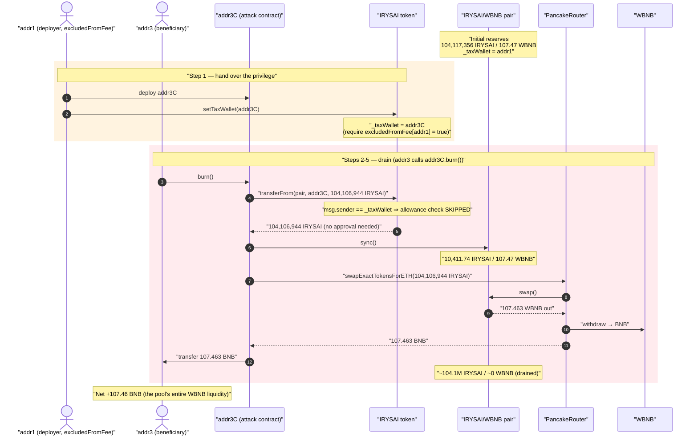
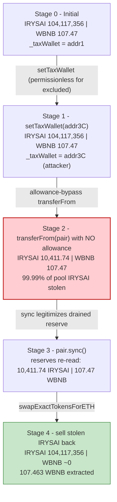
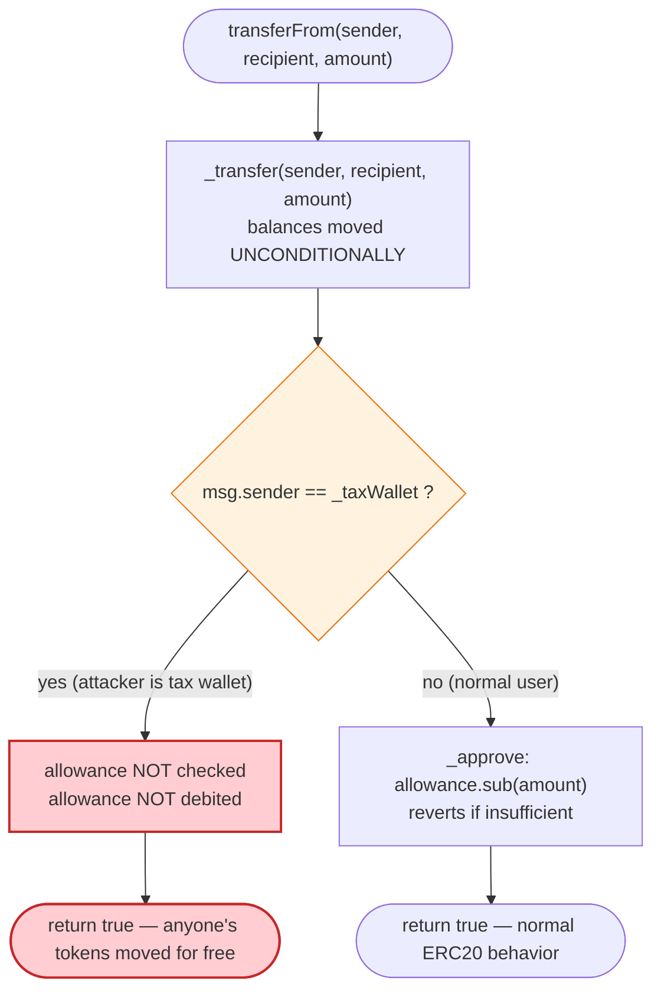

# IRYSAI Exploit — Backdoored `transferFrom` Lets the Tax Wallet Drain the LP Pool

> **Reproduction:** the PoC compiles & runs in an isolated Foundry project at
> [this project folder](.) (the umbrella DeFiHackLabs repo does not whole-compile,
> so this PoC was extracted). Full verbose trace: [output.txt](output.txt).
> Verified vulnerable source: [contracts_CA.sol](sources/StandardToken_746727/contracts_CA.sol).

---

## Key info

| | |
|---|---|
| **Loss** | ~$69.6K — **107.46 WBNB** drained from the IRYSAI/WBNB PancakeSwap pair |
| **Vulnerable contract** | `StandardToken` (IRYSAI / "FIRST BNB IRYS") — [`0x746727FC8212ED49510a2cB81ab0486Ee6954444`](https://bscscan.com/address/0x746727FC8212ED49510a2cB81ab0486Ee6954444#code) |
| **Victim pool** | IRYSAI/WBNB pair — [`0xeB703Ed8C1A3B1d7E8E29351A1fE5E625E2eFe04`](https://bscscan.com/address/0xeB703Ed8C1A3B1d7E8E29351A1fE5E625E2eFe04) |
| **Deployer / "excluded" EOA (re-points taxWallet)** | `addr1` — `0xc4cE1E4A8Cd2Ba980646e855817252C7AA9C4AE8` |
| **Beneficiary EOA (triggers drain, receives BNB)** | `addr3` — `0x20bB82f7C5069c2588fa900eD438FEFD2Ae36827` |
| **Attack contract** | `addr3C` — deployed at `0x6233a81BbEcb355059DA9983D9fC9dFB86D7119f` (live) |
| **Backdoor / setup tx** | [`0x8c637fc98ad84b922e6301c0b697167963eee53bbdc19665f5d122ae55234ca6`](https://bscscan.com/tx/0x8c637fc98ad84b922e6301c0b697167963eee53bbdc19665f5d122ae55234ca6) |
| **Rugpull / drain tx** | [`0xe9a66bad8975f2a7b68c74992054c84d6d80ac4c543352e23bf23740b8858645`](https://bscscan.com/tx/0xe9a66bad8975f2a7b68c74992054c84d6d80ac4c543352e23bf23740b8858645) |
| **Chain / block / date** | BSC / 49,994,891 / 2025-05-20 |
| **Compiler** | Solidity v0.8.24, optimizer **disabled** |
| **Bug class** | Token backdoor — privileged `transferFrom` allowance-bypass + permissionless `setTaxWallet` |

---

## TL;DR

IRYSAI's `transferFrom` contains a **hidden privilege for the tax wallet**: when
`msg.sender == _taxWallet`, the function performs the balance move but **skips the allowance
deduction entirely** ([contracts_CA.sol:258-278](sources/StandardToken_746727/contracts_CA.sol#L258-L278)).
Whoever is the tax wallet can therefore call `transferFrom(victim, attacker, amount)` for **any
holder, with no approval** — including the liquidity pool's entire IRYSAI balance.

The second half of the backdoor is `setTaxWallet`
([:429-432](sources/StandardToken_746727/contracts_CA.sol#L429-L432)): it is gated only by
`require(_excludedFromFee[msg.sender])`, and the deployer (`addr1`) was already
`_excludedFromFee` (set in the constructor). So `addr1` could freely re-point `_taxWallet` to a
purpose-built attack contract.

The attack:

1. `addr1` deploys `addr3C` and calls `IRYSAI.setTaxWallet(addr3C)` — handing the
   allowance-bypass privilege to the attack contract.
2. `addr3C` (now the tax wallet) calls `transferFrom(pair, addr3C, ~99.99% of the pair's IRYSAI)`
   **with zero allowance** — draining the pool's IRYSAI side directly.
3. `addr3C` calls `pair.sync()` so the pair re-reads its now-tiny IRYSAI balance as the new reserve.
4. `addr3C` swaps the stolen IRYSAI back through the PancakeSwap router for **107.46 WBNB**, unwraps it
   to BNB, and forwards it to `addr3`.

Net result: the pool's entire 107.46 WBNB of real liquidity is converted to BNB in the attacker's
hands. Profit = **107.46 BNB (~$69.6K)**.

---

## Background — what IRYSAI does

`StandardToken` ([source](sources/StandardToken_746727/contracts_CA.sol)) is a stock "meme launch"
template ERC20 (9 decimals, 1,000,000,000 supply) with the usual launchpad bolt-ons:

- A **tax wallet** (`_taxWallet`) that collects sell taxes and receives ETH from internal swaps
  (`sendFeeETH`, [:362-364](sources/StandardToken_746727/contracts_CA.sol#L362-L364)).
- A **fee-exclusion** set (`_excludedFromFee`) and per-block buy/sell limits.
- `enableTrading()` that creates the PancakeSwap pair and seeds liquidity
  ([:385-409](sources/StandardToken_746727/contracts_CA.sol#L385-L409)).

On the surface it looks like a normal tax token. The malice is in two functions that, in a
correct ERC20, would be innocuous: `transferFrom` and `setTaxWallet`.

State at the fork block (read from the trace):

| Fact | Value |
|---|---|
| IRYSAI held by the pair (pool IRYSAI reserve) | 104,117,356.08 IRYSAI |
| WBNB held by the pair (pool WBNB reserve) | **107.47 WBNB** ← the prize |
| `_taxWallet` before the attack | `addr1` (`0xc4cE1E…`) — the deployer |
| `_excludedFromFee[addr1]` | **true** (set in constructor) |

---

## The vulnerable code

### 1. `transferFrom` skips the allowance check for the tax wallet

```solidity
function transferFrom(
    address sender,
    address recipient,
    uint256 amount
) public override returns (bool) {
    _transfer(sender, recipient, amount);          // ← moves balances unconditionally

    if (
        msg.sender != _taxWallet &&                // ⚠️ tax wallet is EXEMPT from...
        (sender == uniswapV2Pair || recipient != address(0xdead))
    )
        _approve(                                   // ...the allowance deduction below
            sender,
            _msgSender(),
            _allowances[sender][_msgSender()].sub(
                amount,
                "ERC20: transfer amount exceeds allowance"
            )
        );
    return true;
}
```

[contracts_CA.sol:258-278](sources/StandardToken_746727/contracts_CA.sol#L258-L278)

`_transfer` runs first and moves the balance **before** any allowance is consulted. The allowance
deduction is then *conditional*: it only runs when `msg.sender != _taxWallet`. So the tax wallet can
move **anyone's** tokens by calling `transferFrom(victim, anywhere, amount)` — it never needs an
approval. In the trace, the drain transferFrom decrements only the balance slots — **no allowance
slot is touched** ([output.txt:1593-1598](output.txt)).

### 2. `setTaxWallet` is callable by any fee-excluded address

```solidity
function setTaxWallet(address payable newWallet) external {
    require(_excludedFromFee[msg.sender]);   // ← only gate
    _taxWallet = newWallet;
}
```

[contracts_CA.sol:429-432](sources/StandardToken_746727/contracts_CA.sol#L429-L432)

No `onlyOwner`. The constructor already marked the deployer as fee-excluded
(`_excludedFromFee[_taxWallet] = true`, [:209](sources/StandardToken_746727/contracts_CA.sol#L209)),
so the deployer can re-assign the privileged `_taxWallet` to any contract at will. The trace shows
storage slot 5 flipping from `addr1` → `addr3C`
([output.txt:1578-1581](output.txt)).

---

## Root cause — why it was possible

A correct ERC20 `transferFrom` enforces the invariant *"a spender may only move `sender`'s tokens up
to `allowance[sender][spender]`, and that allowance must be debited."* IRYSAI breaks this invariant
**by design** for a privileged address:

> If `msg.sender == _taxWallet`, the balance move in `_transfer` happens with **no allowance
> requirement and no allowance debit.** The tax wallet is effectively an omnipotent spender over every
> account that holds IRYSAI — including the AMM pair, which holds the protocol's entire WBNB-backed
> liquidity in IRYSAI form.

Combined with a permissionless `setTaxWallet`, the chain is:

1. **Re-assignable privilege.** Any fee-excluded address (the deployer is one) can move the
   `_taxWallet` privilege to an attacker-controlled contract — no owner check, no timelock.
2. **Privilege == unlimited spend.** Once you are the tax wallet, `transferFrom(pair, you, amount)`
   succeeds with zero allowance. The LP pair never approved anyone, yet its IRYSAI can be pulled out.
3. **`sync()` legitimizes the theft.** After the pair's IRYSAI is removed, `pair.sync()` makes the
   pair adopt its drained balance as the new reserve, so the stolen tokens can be cleanly sold back
   for the untouched WBNB side.

This is a textbook **honeypot/backdoor token**: trading looks normal to ordinary users, but the
deployer retains a hidden lever to seize the pool's liquidity at any moment.

---

## Preconditions

- The attacker controls a `_excludedFromFee` address. The deployer `addr1` qualifies because the
  constructor excludes the initial tax wallet
  ([:209](sources/StandardToken_746727/contracts_CA.sol#L209)).
- A live IRYSAI/WBNB PancakeSwap pair with real WBNB liquidity exists (107.47 WBNB here).
- No capital is required — the drain pulls the pool's IRYSAI for free and sells it for the pool's own
  WBNB. There is no flash loan and no working capital; the attack is pure extraction.

---

## Attack walkthrough (with on-chain numbers from the trace)

The pair's `token0 = IRYSAI` (9 decimals), `token1 = WBNB` (18 decimals), so `reserve0 = IRYSAI`,
`reserve1 = WBNB`. All figures are taken directly from the `Transfer` / `Sync` / `Swap` events in
[output.txt](output.txt).

| # | Step | Pair IRYSAI | Pair WBNB | Effect |
|---|------|------------:|----------:|--------|
| 0 | **Initial** | 104,117,356.08 | 107.47 | Honest pool. `_taxWallet = addr1`. |
| 1 | `addr1` calls `setTaxWallet(addr3C)` | 104,117,356.08 | 107.47 | Attack contract becomes the privileged tax wallet (slot 5). |
| 2 | `addr3C.transferFrom(pair, addr3C, 104,106,944.35)` — **no allowance** | 10,411.74 | 107.47 | 99.99% of the pool's IRYSAI pulled to the attacker; allowance untouched. |
| 3 | `addr3C` calls `pair.sync()` | 10,411.74 | 107.47 | Pair re-reads its drained IRYSAI as the new reserve. |
| 4 | `router.swapExactTokensForETHSupportingFeeOnTransferTokens(104,106,944.35 IRYSAI)` | 104,117,356.08 | ~0 | Stolen IRYSAI sold back into the now-thin pool; pulls out **107.46 WBNB**, unwrapped to BNB. |
| 5 | `addr3C` forwards 107.46 BNB to `addr3` | — | — | Beneficiary EOA cashes out. |

**The swap math (step 4):** after `sync`, the pair reserves were `10,411.74 IRYSAI / 107.47 WBNB`.
Selling the 104,106,944.35 IRYSAI back (≈ 10,000× the IRYSAI reserve) moves essentially the entire
WBNB side out: `amount1Out = 107,462,996,233,504,225,783 wei = 107.463 WBNB`
([output.txt:1636-1651](output.txt)). The pair is left holding all the IRYSAI and ~0 WBNB.

### Profit / loss accounting

| | BNB |
|---|---:|
| `addr3` balance before | 0.100003 |
| `addr3` balance after | 107.562999 |
| **Net gain (≈ WBNB out of swap)** | **+107.463** |
| Pool's original WBNB liquidity (the loss to LPs) | 107.47 |

The attacker's gain (107.46 BNB) equals the pool's pre-attack WBNB reserve to within the swap fee —
confirming the LPs' entire WBNB liquidity was walked off. At the time, ~107.46 BNB ≈ **$69.6K**,
matching the reported loss.

---

## Diagrams

### Sequence of the attack



### Pool / privilege state evolution



### The backdoor logic inside `transferFrom`



---

## Remediation

1. **Never exempt any caller from the allowance check.** `transferFrom` must always require and debit
   `allowance[sender][msg.sender]`, with no `_taxWallet`/owner/role bypass. Use OpenZeppelin's
   `ERC20`/`_spendAllowance` verbatim rather than a hand-rolled conditional. The whole exploit
   collapses once the tax wallet has no special spend power.
2. **Remove the privileged-spend pattern.** A tax wallet only needs to *receive* tokens/ETH; it never
   needs to *pull* tokens from arbitrary holders. There is no legitimate reason for the bypass to
   exist — its presence is a deliberate backdoor.
3. **Lock down `setTaxWallet`.** Gate it with `onlyOwner` plus a timelock, and never let a
   `_excludedFromFee` membership confer administrative power. Better, make the tax wallet immutable or
   only updatable through governance.
4. **Treat fee-exclusion and admin authority as orthogonal.** `_excludedFromFee` is a fee policy flag;
   using it as an access-control gate (here, on `setTaxWallet` and `updateBot`) silently grants
   admin-level capability to anyone the owner whitelists.
5. **Users / integrators: screen tokens for non-standard `transferFrom`.** Any token whose
   `transferFrom` branches on `msg.sender` against an admin-settable address is a rug primitive;
   liquidity providers should avoid pairing against it.

---

## How to reproduce

The PoC was extracted into a standalone Foundry project (the umbrella DeFiHackLabs repo has several
unrelated PoCs that fail to whole-compile under `forge test`):

```bash
_shared/run_poc.sh 2025-05-IRYSAI_exp -vvvvv
```

- RPC: a **BSC archive** endpoint is required (fork block 49,994,891). `foundry.toml` uses
  `https://bsc-mainnet.public.blastapi.io`, which serves historical state at that block; most pruned
  public BSC RPCs fail with `header not found` / `missing trie node`.
- Result: `[PASS] testPoC()` — `addr3` BNB balance goes from `0.100…` to `107.56…`.

Expected tail:

```
  before attack: balance of addr3: 0.100002794628763783
  after attack: balance of addr3: 107.562999028132989566

Suite result: ok. 1 passed; 0 failed; 0 skipped
```

---

*Reference: post-mortem by TenArmor — https://x.com/TenArmorAlert/status/1925012844052975776 (IRYSAI, BSC, ~$69.6K).*
