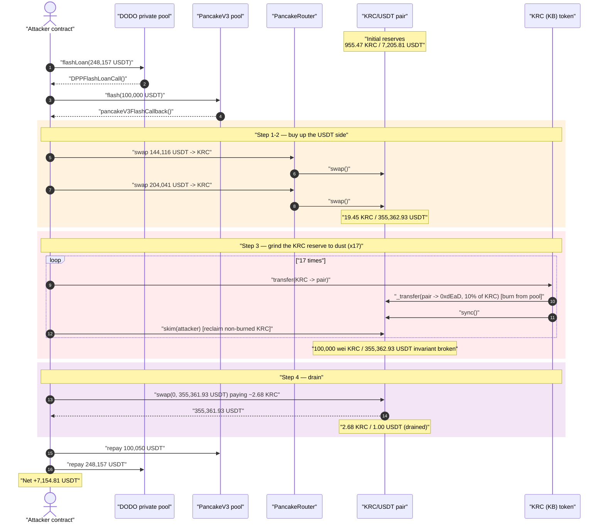
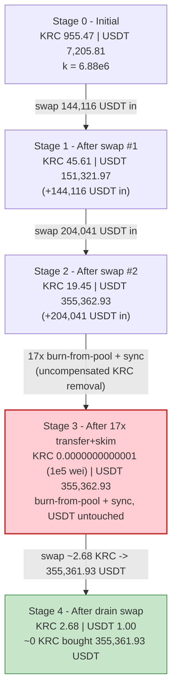
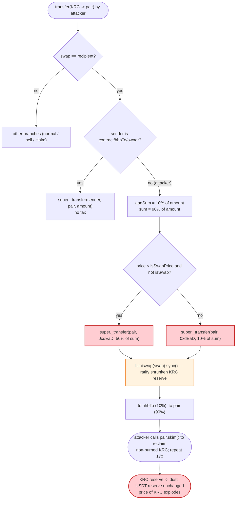
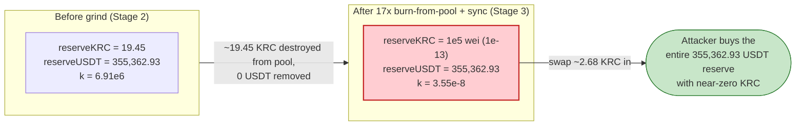

# KRC Token Exploit — Fee-on-Transfer Token Burns From Its Own Pool, Desyncing Reserves

> **Reproduction:** the PoC compiles & runs in an isolated Foundry project at
> [this project folder](.) (the umbrella DeFiHackLabs repo contains many unrelated PoCs
> that do not whole-compile, so this one was extracted).
> Full verbose trace: [output.txt](output.txt).
> Verified vulnerable source: [sources/KB_1814a8/KB.sol](sources/KB_1814a8/KB.sol).

---

## Key info

| | |
|---|---|
| **Loss** | ~$7,155 — **7,154.81 USDT** drained from the KRC/USDT PancakeSwap-V2 pair |
| **Vulnerable contract** | `KB` (token symbol "KRC") — [`0x1814a8443F37dDd7930A9d8BC4b48353FE589b58`](https://bscscan.com/address/0x1814a8443F37dDd7930A9d8BC4b48353FE589b58#code) |
| **Victim pool** | KRC/USDT V2 pair — [`0xdBEAD75d3610209A093AF1D46d5296BBeFFd53f5`](https://bscscan.com/address/0xdBEAD75d3610209A093AF1D46d5296BBeFFd53f5) |
| **Attacker EOA** | [`0x9943f26831f9b468a7fe5ac531c352baab8af655`](https://bscscan.com/address/0x9943f26831f9b468a7fe5ac531c352baab8af655) |
| **Attacker contract** | `0xd995edcab2efe3283514ff111cedc9aaff0349c8` |
| **Attack tx** | [`0x78f242dee5b8e15a43d23d76bce827f39eb3ac54b44edcd327c5d63de3848daf`](https://bscscan.com/tx/0x78f242dee5b8e15a43d23d76bce827f39eb3ac54b44edcd327c5d63de3848daf) |
| **Chain / block / date** | BSC / 49,875,423 / May 18, 2025 |
| **Compiler** | KB token: Solidity v0.8.24, optimizer 1 run · Pair: v0.5.16 |
| **Bug class** | Broken AMM invariant — fee-on-transfer token burns from the pool's own balance and `sync()`s |
| **Funding** | Two stacked flash loans (DODO private pool + PancakeV3 flash), repaid same-tx |

---

## TL;DR

`KB` (the KRC token) is a fee-on-transfer / reflection token. When tokens are transferred **into**
the AMM pair, its `_transfer` override does something fatal: it **burns a slice of KRC out of the
pair's own balance** (`super._transfer(swap, destroy, ...)`) and then immediately calls
`IUniswap(swap).sync()` ([KB.sol:4701-4706](sources/KB_1814a8/KB.sol#L4701-L4706)). This is an
*un-compensated* deletion of one side of the pool's reserves: KRC vanishes from the pair, no USDT
leaves, and `sync()` forces the pair to accept the shrunken balance as its new reserve. Each such
transfer-into-the-pool collapses the constant-product invariant `x·y = k` a little further in the
attacker's favor.

The attacker exploited it mechanically:

1. **Flash-borrow** ~248,157 USDT from a DODO private pool, then nest a 100,000 USDT PancakeV3 flash
   loan for working capital.
2. **Buy KRC** by swapping ~348,157 USDT into the pair across two swaps, inflating the pool's USDT
   reserve to **355,362.93 USDT** while the KRC reserve drops to **~19.45 KRC**.
3. **Repeatedly `transfer(KRC → pair)` then `skim()`** — 17 cycles. Each inbound transfer triggers the
   token's `_transfer` override, which burns ~10% of the KRC *from the pair's own balance* and `sync()`s.
   The KRC reserve is ratcheted from 19.45 KRC down to **100,000 wei (1e-13 KRC)**, while the USDT
   reserve stays pinned at **355,362.93 USDT**.
4. **Drain** — with the pool now holding ~0 KRC against 355k USDT, the attacker swaps in just **2.68 KRC**
   and pulls out **355,361.93 USDT**.
5. **Repay** both flash loans (PancakeV3: 100,050 USDT incl. fee; DODO: 248,157 USDT) and walk away
   with **+7,154.81 USDT** net profit.

---

## Background — what the KRC token does

`KB` ([source](sources/KB_1814a8/KB.sol)) is a Chinese-comment "DeFi MLM / mining" ERC20 deployed under
the symbol **KRC**. On top of a standard ERC20 it bolts on:

- A **swap-aware fee/burn engine** keyed off a designated `swap` address (the KRC/USDT PancakeSwap
  pair). Buys and sells through that pair are taxed and partially burned.
- A **`hhbTo` marketing/treasury sink** (10% of pair-bound transfers go here).
- A **`destroy = 0xdEaD` black-hole** that receives the burned portion.
- **Referral / staking / "hashrate" mining** (`blind`, `fenpei`, `drawUser*Income`, cycle accounting)
  — irrelevant to this exploit but explain the contract's sprawl.

On-chain facts at the fork block:

| Parameter | Value |
|---|---|
| `swap` | the KRC/USDT pair `0xdBEAD75d…` |
| `destroy` (black hole) | `0x...dEaD` ([KB.sol:4563](sources/KB_1814a8/KB.sol#L4563)) |
| `hhbTo` (treasury sink) | `0x1Fd01fD3Cd3a82BedCe4bC947c4e07f093cD92f7` ([KB.sol:4608](sources/KB_1814a8/KB.sol#L4608)) |
| `BASE` (percentage denominator) | 1,000,000 ([KB.sol:4437](sources/KB_1814a8/KB.sol#L4437)) |
| `isSwapPrice` (price gate) | 3,000 USDT ([KB.sol:4555](sources/KB_1814a8/KB.sol#L4555)) |
| `isSwap` | false (so the heavier burn branch is eligible) |
| Pair token0 / token1 | KRC (`0x1814…`) / USDT (`0x55d3…`) → **reserve0 = KRC, reserve1 = USDT** |
| Initial pair reserves | **955.47 KRC / 7,205.81 USDT** |

The whole game lives in two lines of the token's `_transfer`: a burn that targets the **pair's**
balance and a `sync()` that ratifies it.

---

## The vulnerable code

### 1. Transfer *into* the pair burns KRC out of the pair and `sync()`s

[KB.sol:4694-4709](sources/KB_1814a8/KB.sol#L4694-L4709):

```solidity
}else if (swap == recipient) {                       // KRC being sent INTO the pair
    if(sender == address(this) || sender == hhbTo || sender == owner()){
        super._transfer(sender, recipient, amount);  // privileged: no tax
    }else {
        uint256 aaaSum = amount.percentage(100000);  // 10% of `amount`
        uint256 sum = amount - aaaSum;               // 90% of `amount`
        if(getKBUSDT() < isSwapPrice && !isSwap){
            super._transfer(swap, destroy, sum.percentage(500000));  // burn 50% of `sum` FROM PAIR
        }else {
            super._transfer(swap, destroy, sum.percentage(100000));  // ⚠️ burn 10% of `sum` FROM PAIR
        }

        IUniswap(swap).sync();                        // ⚠️ ratify the shrunken pair balance as reserves
        super._transfer(sender, hhbTo, aaaSum);       // 10% to treasury
        super._transfer(sender, recipient, sum);      // 90% actually reaches the pair
    }
}
```

`percentage(amount, p) = amount * p / 1,000,000` ([KB.sol:4439-4444](sources/KB_1814a8/KB.sol#L4439-L4444)),
so `percentage(x, 100000)` = **10%** and `percentage(x, 500000)` = **50%**.

The critical statement is `super._transfer(swap, destroy, sum.percentage(100000))`: the **first
argument is `swap`** — the pair itself. The token is moving KRC **from the pair's balance** to the
dead address. It does **not** touch the USDT side. Then `IUniswap(swap).sync()` tells the pair "your
KRC balance just dropped; adopt it as your new reserve."

### 2. `sync()` trusts whatever balance it currently sees

The pair ([PancakePair.sol](sources/PancakePair_dBEAD7/PancakePair.sol)) implements the standard
UniswapV2 `sync()`/`skim()`:

```solidity
function skim(address to) external lock {
    _safeTransfer(_token0, to, IERC20(_token0).balanceOf(address(this)).sub(reserve0));
    _safeTransfer(_token1, to, IERC20(_token1).balanceOf(address(this)).sub(reserve1));
}
```

`sync()` sets `reserve = balanceOf(pair)`; `skim()` pays out `balance − reserve`. Both assume token
balances only move via `mint`/`burn`/`swap` the pair can reason about. The KRC token violates that by
deleting reserve-token out from under the pair on every inbound transfer.

---

## Root cause — why it was possible

A UniswapV2/PancakeSwap pair prices assets purely from its cached reserves and only enforces
`x·y ≥ k` *inside `swap()`*. `sync()` exists so the pair can adopt its real balance as the reserve —
it trusts that balance changes are legitimate.

`KB._transfer` weaponizes that trust:

> When KRC is sent into the pair, the token **destroys KRC held by the pair** (`super._transfer(swap,
> destroy, …)`) and then calls `pair.sync()`, telling the pair "your KRC reserve is now this much
> smaller." No USDT leaves. The product `k` collapses and the marginal price of KRC explodes — and the
> burn fires on **every** transfer-in, so it can be repeated until the KRC reserve is dust.

Three composing design flaws turn a "deflationary tokenomics" gimmick into a critical drain:

1. **The burn targets the pair's balance, not the token contract's own balance.** A legitimate
   deflationary design burns tokens the protocol *owns*. Burning from `swap` (the pair) is a direct
   value transfer to whoever holds the other side — i.e., anyone who can buy out the USDT.
2. **`sync()` is called after the burn.** Without `sync()`, the pair would still price against the old
   reserve and `skim()` would just return the surplus. By calling `sync()`, the token *commits* the
   reserve loss, permanently shrinking `reserve0` while `reserve1` is untouched.
3. **The burn is unbounded by repetition.** Because it fires on every inbound transfer (and the
   attacker pairs each with a `skim()` to reclaim non-burned KRC), the KRC reserve can be ground down
   geometrically — from 19.45 KRC to 1e5 wei in 17 cycles — until a near-zero KRC reserve sits against
   the full USDT reserve.

The transfer-out tax that might have clawed value back is irrelevant here: the attacker is *adding*
USDT and *removing* USDT via the pair's raw `swap()`, never routing the profitable leg through the
token's taxed `swap == sender` path in a way that costs them the reserve.

---

## Preconditions

- KRC's `swap` address is set to the live KRC/USDT pair and the burn branch is active
  (`getKBUSDT() < isSwapPrice && !isSwap`, true at the fork block — KRC price was well under the
  3,000 USDT `isSwapPrice` gate).
- Enough working capital to (a) buy up the pool's USDT side so there is a large `reserve1` to steal and
  (b) provide the small KRC needed to grind the reserve down. The attacker sourced this from **two
  nested flash loans** (DODO private pool + PancakeV3 flash), so the up-front capital requirement was
  effectively zero — everything is repaid in the same transaction.
- The pair is a vanilla UniswapV2 fork exposing public `skim()`/`sync()`/`swap()` (PancakeSwap V2).

---

## Attack walkthrough (with on-chain numbers from the trace)

Pair `token0 = KRC`, `token1 = USDT` → `reserve0 = KRC`, `reserve1 = USDT`. All figures below are taken
directly from the `Sync` / `Swap` events and `getReserves` returns in
[output.txt](output.txt). The flash-loan envelope:

- DODO `flashLoan(0, 248,157.13 USDT, …)` → `DPPFlashLoanCall`
  ([test/KRCToken_pair_exp.sol:40-51](test/KRCToken_pair_exp.sol#L40-L51))
- nested PancakeV3 `flash(this, 100,000 USDT, 0, …)` → `pancakeV3FlashCallback`
  ([test/KRCToken_pair_exp.sol:47](test/KRCToken_pair_exp.sol#L47))

| # | Step | KRC reserve | USDT reserve | Effect |
|---|------|------------:|-------------:|--------|
| 0 | **Initial** pool | 955.47 | 7,205.81 | Honest pool. |
| 1 | **Swap #1** — 144,116.16 USDT → KRC (to attacker) | 45.61 | 151,321.97 | Pool USDT side inflated ~21×; KRC reserve squeezed. |
| 2 | **Swap #2** — 204,040.97 USDT → KRC (to attacker) | 19.45 | 355,362.93 | USDT reserve now **355,362.93** — the prize; KRC reserve ≈ 19.45. |
| 3 | **17× `transfer(KRC→pair)` + `skim`** (burn 10% of pair KRC each time, then `sync`) | 17.09 → 14.98 → 13.07 → … → **100,000 wei** | 355,362.93 (unchanged) | Each cycle burns ~10% of the pair's KRC and `sync()`s; USDT untouched. **Invariant destroyed.** |
| 4 | **Drain swap** — `pair.swap(0, 355,361.93 USDT, attacker)` paying ~2.68 KRC | 2.68 | 1.00 | ~0 KRC buys virtually the entire USDT reserve. |
| 5 | Repay PancakeV3 flash — 100,050 USDT (incl. 50 USDT fee) | — | — | |
| 6 | Repay DODO flash — 248,157.13 USDT | — | — | |

The 17-cycle KRC-reserve drain from the `Sync` events (USDT reserve constant at 355,362.93 throughout):

```
19.45 → 17.09 → 14.98 → 13.07 → 11.35 → 9.81 → 8.42 → 7.17 → 6.04 → 5.03
      → 4.11 → 3.29 → 2.55 → 1.89 → 1.29 → 0.75 → 0.27 → 0.0000000000001 (1e5 wei)  KRC
```

**Why a few wei of KRC buys the whole pool:** PancakeSwap's `getAmountOut` is
`out = (in·9975·reserveOut) / (reserveIn·10000 + in·9975)`. After the grind `reserveIn ≈ 1e5 wei`, so
even a tiny `in` of KRC dominates the denominator and the swap returns essentially all of `reserveOut`
(the 355k USDT). The attacker put in `2.68 KRC` and received `355,361.93 USDT`.

### Profit accounting (USDT)

| Direction | Amount (USDT) |
|---|---:|
| Borrowed — DODO flash | 248,157.13 |
| Borrowed — PancakeV3 flash | 100,000.00 |
| Spent — swap #1 into pair | 144,116.16 |
| Spent — swap #2 into pair | 204,040.97 |
| Received — drain swap out of pair | 355,361.93 |
| Repaid — PancakeV3 flash (+50 fee) | 100,050.00 |
| Repaid — DODO flash | 248,157.13 |
| **Attacker USDT before** | 26.54 |
| **Attacker USDT after** | 7,181.35 |
| **Net profit** | **+7,154.81** |

Verified from the PoC balance log:
`Attacker Before exploit USDT Balance: 26.542161622221038197` →
`Attacker After exploit USDT Balance: 7181.350034142233996894`.

---

## Diagrams

### Sequence of the attack



### Pool state evolution



### The flaw inside `KB._transfer` (inbound-to-pair branch)



### Why the burn is theft: constant-product before vs. after the grind



---

## Why each magic number

- **DODO flash 248,157.13 USDT + PancakeV3 flash 100,000 USDT:** total ~348k USDT working capital,
  sized so the two buy-in swaps (144,116 + 204,041 ≈ 348k) push the pool's USDT reserve to ~355k while
  leaving the KRC reserve thin (~19.45 KRC), maximizing the USDT that can later be stolen.
- **17 transfer/skim cycles with geometrically decreasing KRC amounts (26.16, 23.54, 21.19, … 2.98):**
  each cycle's `transfer` triggers a 10%-of-pair-KRC burn + `sync`; the `skim` reclaims the
  surplus KRC the attacker over-sent so it can be re-used next cycle. The decreasing schedule mirrors
  the shrinking reserve (always sending roughly the current reserve back in), grinding KRC reserve to
  exactly 1e5 wei.
- **Final `swap(0, 355,361.93 USDT)` paying ~2.68 KRC:** with `reserveKRC = 1e5 wei`, the AMM formula
  lets a couple of KRC purchase essentially the whole 355k USDT reserve, capped just short of the full
  reserve so the swap's `k`-check passes.
- **Repay 100,050 USDT (PancakeV3) and 248,157.13 USDT (DODO):** principal + the V3 flash fee (50 USDT);
  the DODO private-pool flash here carried no fee.

---

## Remediation

1. **Never burn from the liquidity pool.** A deflationary burn must only destroy tokens the protocol
   *owns* (its own balance / treasury). Remove `super._transfer(swap, destroy, …)` followed by
   `IUniswap(swap).sync()` — that single pattern is the entire vulnerability. If "deflation should
   reach LPs" is a requirement, implement it as the protocol buying & burning from its own funds, not
   as a side-channel deletion of pool reserves.
2. **Do not call `pair.sync()` from token transfer logic.** `sync()` after an asymmetric balance change
   permanently commits a one-sided reserve loss and is the lever that converts a "fee" into a price
   manipulation. Even without an explicit burn, calling `sync()` from `_transfer` is dangerous.
3. **Make fees symmetric and pool-neutral.** Taxes/burns should be taken from the *transferred* amount
   (the sender's tokens), never from a third party's balance — least of all the AMM pair's.
4. **Cap single-operation reserve impact.** Any token whose transfer can move a pool reserve should
   bound that movement to a small percentage and revert otherwise; a repeatable 10%-of-pool burn that
   compounds to ~100% over a few calls is a red flag.
5. **For integrators / LPs:** treat fee-on-transfer / reflection tokens that interact with the pair
   (especially ones that `sync()`/`skim()` the pair, or hold a `swap` address) as hostile to AMM
   invariants, and avoid providing real liquidity against them.

---

## How to reproduce

The PoC was extracted into a standalone Foundry project (the umbrella DeFiHackLabs repo has many
unrelated PoCs that fail to compile under a whole-project `forge build`):

```bash
_shared/run_poc.sh 2025-05-KRCToken_pair_exp -vvvvv
```

- RPC: a **BSC archive** endpoint is required (fork block 49,875,423). `foundry.toml` uses
  `https://bsc-mainnet.public.blastapi.io`, which serves historical state at that block; most pruned
  public BSC RPCs fail with `header not found` / rate-limit (429).
- Result: `[PASS] testExploit()`, with the balance log showing the USDT profit.

Expected tail:

```
Ran 1 test for test/KRCToken_pair_exp.sol:KRC_Exploit
  Attacker Before exploit USDT Balance: 26.542161622221038197
  Attacker After exploit USDT Balance: 7181.350034142233996894
[PASS] testExploit() (gas: 2285768)
Suite result: ok. 1 passed; 0 failed; 0 skipped
```

Net profit = **7,181.35 − 26.54 = 7,154.81 USDT** (≈ $7.15k), matching the reported ~$7k loss.

---

*References: OpenZeppelin post-mortem — https://x.com/OpenZeppelin/status/1953111764536561867 ·
CertiK — https://x.com/CertikAIAgent/status/1924280794916536765 (KRC, BSC, ~$7K).*
