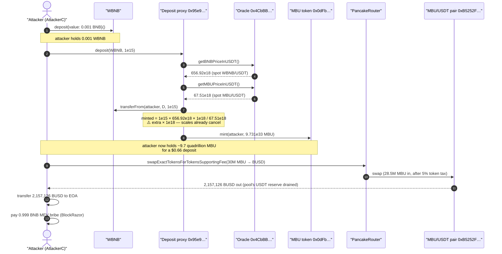
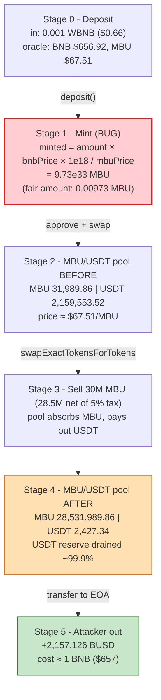
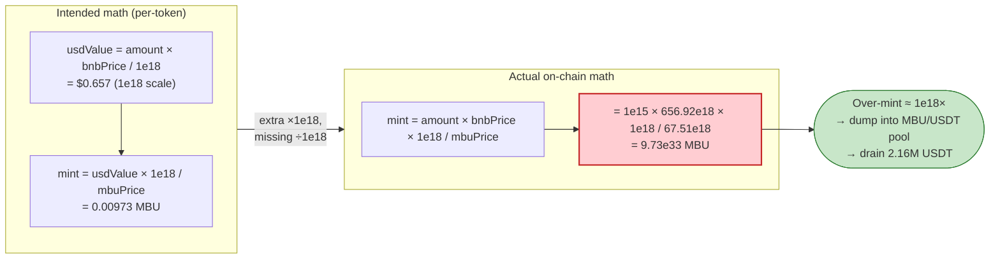

# MBU Token Exploit — Decimal-Scaling Bug in `deposit()` Mints ~1e18× Too Many Tokens

> **Reproduction:** the PoC compiles & runs in an isolated Foundry project at
> [this project folder](.) (the umbrella DeFiHackLabs repo contains many
> unrelated PoCs that do not whole-compile, so this one was extracted).
> Full verbose trace: [output.txt](output.txt).
> The vulnerable logic contracts are **unverified** on BscScan — the deposit/mint
> formula below is reconstructed *exactly* from the on-chain trace (every number
> reproduces to the wei). The fetched proxy sources are OZ ERC1967 boilerplate in
> [sources/](sources/).

---

## Key info

| | |
|---|---|
| **Loss** | **~2,157,126 BUSD (~$2.16M)** drained from the MBU/USDT PancakeSwap pair |
| **Vulnerable contract (deposit/mint)** | `Staking/Deposit` ERC1967 proxy — [`0x95e92B09b89cF31Fa9F1Eca4109A85F88EB08531`](https://bscscan.com/address/0x95e92B09b89cF31Fa9F1Eca4109A85F88EB08531) (impl `0x637D8Ce897bb653cb83bA436CDf76bBe158f05B1`, unverified) |
| **MBU token** | [`0x0dFb6Ac3A8Ea88d058bE219066931dB2BeE9A581`](https://bscscan.com/address/0x0dFb6Ac3A8Ea88d058bE219066931dB2BeE9A581) (impl `0xB1C4605f08D90a2Af06a0f85348d50b499629Aa8`) |
| **Price oracle** | `0x4CbBB1b6ab63b6B01F9309b0Aa53a05962A4A66B` (impl `0xb9d3Bb65aaCd77BA6033f92cEf043b979d9c10D4`) — spot AMM price |
| **Victim pool** | MBU/USDT PancakeSwap pair — `0xB5252FCef718F8629F81f1DFCfF869594AD478c6` |
| **Attacker EOA** | [`0xb32a53af96f7735d47f4b76c525bd5eb02b42600`](https://bscscan.com/address/0xb32a53af96f7735d47f4b76c525bd5eb02b42600) |
| **Attacker contract** | [`0x631adff068d484ce531fb519cda4042805521641`](https://bscscan.com/address/0x631adff068d484ce531fb519cda4042805521641) |
| **Attack tx** | [`0x2a65254b41b42f39331a0bcc9f893518d6b106e80d9a476b8ca3816325f4a150`](https://bscscan.com/tx/0x2a65254b41b42f39331a0bcc9f893518d6b106e80d9a476b8ca3816325f4a150) |
| **Chain / block / date** | BSC / 49,470,430 / May 2025 |
| **Compiler** | Solidity v0.8.20, optimizer 200 runs (proxies) |
| **Bug class** | Decimal-scaling / unit-mismatch error in mint math (mint amount ≈ 1e18× too large) |

---

## TL;DR

The `deposit()` entry point on `0x95e9…` accepts a token (here WBNB), prices it in
USDT via a **spot AMM oracle**, then mints MBU to the depositor based on that USD value
divided by the **spot MBU/USDT price**. The mint formula carries an **extra `× 1e18`
scaling factor** that the two 18-decimal price terms should have cancelled. The net
effect: every wei of value deposited mints roughly **1e18 times** the MBU it should.

In the attack, the attacker deposited just **0.001 WBNB (≈ $0.66)** and the contract
minted **9,731,099,570,720,980,659,843,835,099,042,677 MBU (≈ 9.73 × 10³³, i.e. ~9.7
quadrillion whole MBU)** — for a deposit worth less than a dollar. The attacker then
sold a tiny slice of this mint (30,000,000 MBU) into the MBU/USDT pool and walked away
with **2,157,126 BUSD**, draining essentially the entire 2.16M USDT reserve.

The single broken line, reconstructed from the trace:

```solidity
// BUGGY (reconstructed): both prices are 1e18-scaled, but the formula multiplies by 1e18 AGAIN
mintAmount = depositAmount * getBNBPriceInUSDT() * 1e18 / getMBUPriceInUSDT();
//                                                  ^^^^  extra factor — should not be here
```

Reproduces to the wei:
`1e15 × 656.9216…e18 × 1e18 / 67.5074…e18 = 9,731,099,570,720,980,659,843,835,099,042,677`.

---

## Background — what the protocol does

MBU is a proxy-based ERC20 (`0x0dFb…`) paired with a "deposit / staking" proxy
(`0x95e9…`) and a price-oracle proxy (`0x4CbBB…`). The intended flow:

1. A user calls `deposit(token, amount)` on `0x95e9…` with some accepted asset.
2. The deposit contract reads two **spot AMM prices** from the oracle:
   - `getBNBPriceInUSDT()` — derived from the WBNB/USDT Pancake pair `0x16b9a8…`.
   - `getMBUPriceInUSDT()` — derived from the MBU/USDT Pancake pair `0xB5252F…`.
3. It values the deposit in USDT and mints a corresponding amount of fresh MBU to the
   depositor (recorded against an internal balance / `availableRewards` ledger;
   the trace shows a `ReservesUpdated` and `Deposit(...,balance,availableRewards)`
   event).

Both oracle prices are **18-decimal fixed-point** values, computed directly from pool
reserves (verified against the trace, see below). That decimal convention is the seed
of the bug: when you divide a `1e18`-scaled USD value by a `1e18`-scaled token price,
the scales cancel and you get a *raw* token count — so any additional `× 1e18` is a
straight 18-order-of-magnitude inflation.

---

## The vulnerable code (reconstructed from the trace)

> The deposit-contract and oracle **implementations are unverified** on BscScan, so the
> snippets below are reconstructed from the verbose execution trace. Every constant and
> intermediate value is matched against the trace to the wei (see the math section).

### 1. The oracle returns 18-decimal spot prices from pool reserves

Trace [output.txt:34-47](output.txt) (`getBNBPriceInUSDT`) and
[output.txt:48-63](output.txt) (`getMBUPriceInUSDT`):

```solidity
// reconstructed — both return a 1e18-scaled price (USDT per 1 token)
function getBNBPriceInUSDT() public view returns (uint256) {
    (uint112 r0, uint112 r1,) = IPair(WBNB_USDT_PAIR).getReserves(); // r0=USDT, r1=WBNB
    // = reserveUSDT * 1e18 / reserveWBNB
    return uint256(r0) * 1e18 / uint256(r1);
}

function getMBUPriceInUSDT() public view returns (uint256) {
    (uint112 r0, uint112 r1,) = IPair(MBU_USDT_PAIR).getReserves();  // r0=MBU, r1=USDT
    // = reserveUSDT * 1e18 / reserveMBU
    return uint256(r1) * 1e18 / uint256(r0);
}
```

Verified against the trace reserves:
- WBNB/USDT pair `0x16b9a8…`: USDT `21,802,473.21`, WBNB `33,188.85` → `getBNBPriceInUSDT = 656.9216017408…e18` ✓ (raw `656921601740811896377`)
- MBU/USDT pair `0xB5252F…`: MBU `31,989.86`, USDT `2,159,553.52` → `getMBUPriceInUSDT = 67.5074380820…e18` ✓ (raw `67507438082060477686`)

### 2. The deposit contract mints with an extra `× 1e18`

Trace [output.txt:32-86](output.txt): `deposit(WBNB, 1e15)` → `mint(attacker, 9.731e33)`.

```solidity
// reconstructed deposit() in 0x637D8Ce… (delegatecall target of 0x95e9…)
function deposit(address token, uint256 amount) external returns (uint256 minted) {
    uint256 bnbPrice = oracle.getBNBPriceInUSDT();   // 1e18-scaled, e.g. 656.92e18
    uint256 mbuPrice = oracle.getMBUPriceInUSDT();   // 1e18-scaled, e.g.  67.51e18

    IERC20(token).transferFrom(msg.sender, address(this), amount);

    // ⚠️ BUG: bnbPrice and mbuPrice are BOTH 1e18-scaled. Their scales cancel in the
    //         division, so the result is already a raw token count. Multiplying by an
    //         additional 1e18 inflates the mint by ~1e18×.
    minted = amount * bnbPrice * 1e18 / mbuPrice;    // ⚠️ extra * 1e18

    MBU.mint(msg.sender, minted);                    // emits Mint / Transfer(0 -> attacker)
    // ... updates internal balance / availableRewards ledger ...
}
```

The mint amount in the trace — `9,731,099,570,720,980,659,843,835,099,042,677` — is
**exactly** `amount * bnbPrice * 1e18 / mbuPrice`.

---

## Root cause — why it was possible

A textbook **decimal / unit mismatch** in fixed-point math:

> `USD_value (1e18 scale) / MBU_price (1e18 scale)` already yields a **raw, unscaled**
> token count. To express it in 18-decimal MBU you would multiply by `1e18` *only if the
> USD value were not already 1e18-scaled*. Here the value **was** already 1e18-scaled (it
> came from `amount × price`, an 18×18 = 1e36-scale product, with one `1e18` carried
> through), so the additional `× 1e18` in the mint formula is a pure error.

Concretely the intended-vs-actual:

| Quantity | Value |
|---|---:|
| Deposit | 0.001 WBNB = `1e15` wei |
| BNB price | $656.92 |
| Deposit USD value | **$0.657** |
| MBU price | $67.51 |
| **Fair mint** ($0.657 / $67.51) | **0.00973 MBU** |
| **Actual mint** | **9.73 × 10³³ MBU** |
| **Over-mint factor** | **≈ 1 × 10¹⁸** |

Three design choices compose into the critical bug:

1. **Wrong scaling in the mint formula** (`× 1e18` that should not exist) — the core flaw.
2. **No sanity cap on mint output.** Minting 9.7 *quadrillion* tokens for a sub-dollar
   deposit triggers no upper bound, no per-tx limit, no max-supply check that would have
   caught a 1e18× anomaly.
3. **Mint priced off a manipulable spot AMM oracle**, and the minted MBU is freely
   sellable into that same shallow MBU/USDT pool. Even a *correctly* scaled mint priced
   by spot reserves is risky; the scaling bug just makes it catastrophic, since the
   attacker doesn't even need to manipulate the oracle — the raw over-mint dwarfs any pool.

The attacker did not need to manipulate any oracle or take a flash loan: the bug alone
hands them an unbounded supply of MBU. The only constraint on profit was the size of the
victim MBU/USDT pool — they sold just enough MBU (30M) to empty its 2.16M USDT reserve.

---

## Preconditions

- The buggy `deposit()` path is **permissionless** — any address can call it.
- An accepted deposit token (WBNB) and a trivial amount of it (0.001 WBNB ≈ $0.66).
- A liquid MBU/USDT pool to dump the over-minted MBU into (the MBU/USDT pair held
  **2,159,553 USDT** — that is the cap on profit).
- No flash loan, no oracle manipulation, no privileged role required.

---

## Attack walkthrough (with on-chain numbers from the trace)

The attacker's contract `AttackerC` runs the whole thing in one transaction
([test/MBUToken_exp.sol:43-69](test/MBUToken_exp.sol#L43-L69)):

| # | Step | Trace | Numbers |
|---|------|-------|---------|
| 0 | Wrap 0.001 BNB → WBNB | [output.txt:22](output.txt) | `WBNB.deposit{value: 1e15}` → 0.001 WBNB |
| 1 | Approve & `deposit(WBNB, 1e15)` to `0x95e9…` | [output.txt:32-86](output.txt) | reads BNB price `$656.92`, MBU price `$67.51`; transfers in 0.001 WBNB |
| 2 | Contract mints MBU (the bug) | [output.txt:72-75](output.txt) | **mints 9,731,099,570,720,980,659,843,835,099,042,677 MBU** to attacker |
| 3 | Approve MBU to PancakeRouter (max) | [output.txt:87-93](output.txt) | unlimited approval |
| 4 | `swapExactTokensForTokensSupportingFeeOnTransferTokens(30M MBU → BUSD)` | [output.txt:94-228](output.txt) | sells **30,000,000 MBU**; 5% token transfer-tax skims **1.5M MBU** ([output.txt:105](output.txt), `FeePaid`), **28,500,000 MBU** reaches the pool |
| 5 | Pool swaps MBU → USDT | [output.txt:209-228](output.txt) | pool out = **2,157,126.18 USDT**; `Sync(MBU 28,531,989.86, USDT 2,427.34)` — USDT reserve nearly emptied |
| 6 | Forward proceeds to EOA | [output.txt:234-236](output.txt) | `BUSD.transfer(attacker, 2,157,126.18)` |
| 7 | Pay MEV/relayer bribe | [output.txt:236-238 area](output.txt) | `BlockRazor.call{value: 0.999 ether}` |

Note the attacker only sold **30M** of the **9.73 × 10³³** minted MBU — about
`3 × 10⁻²⁶` of the mint. The mint was so large that the only thing limiting the haul was
how much USDT sat in the victim pool.

### Swap math (validates step 5)

PancakeSwap V2 `getAmountOut` with 0.25% fee, against the MBU/USDT pool reserves at
attack time (MBU `31,989.86`, USDT `2,159,553.52`), with a 28,500,000-MBU net input:

```
amountInWithFee = 28,500,000 × 9975 / 10000 = 28,428,750 MBU
out = amountInWithFee × reserveUSDT / (reserveMBU + amountInWithFee)
    = 28,428,750e18 × 2,159,553.52e18 / (31,989.86e18 + 28,428,750e18)
    = 2,157,126.179348943736411799 USDT
```

This matches the trace `amount1Out` to the wei ([output.txt:223](output.txt)).

### Profit / loss accounting

| Item | Amount |
|---|---:|
| Cost — WBNB deposited | 0.001 WBNB (~$0.66) |
| Cost — MEV/relayer bribe | 0.999 BNB (~$657) |
| **Total cost** | **~1 BNB (~$657)** |
| Proceeds — BUSD/USDT received | **2,157,126.18 BUSD** |
| **Net profit** | **≈ 2,157,126 BUSD (~$2.16M)** |

Final balance check ([output.txt:243](output.txt)):
`BUSD.balanceOf(attacker) = 2,157,126,179,348,943,736,411,799` →
`emit log_named_decimal_uint("Profit in BUSD", 2157126.179348…, 18)`.

---

## Diagrams

### Sequence of the attack



### Pool / state evolution



### Where the scaling goes wrong



---

## Why the numbers line up

- **Oracle prices** are plain spot prices: `reserveUSDT × 1e18 / reserveOtherToken`,
  18-decimal scaled. Both verified to the wei against the pair reserves in the trace.
- **The mint** equals `amount × bnbPrice × 1e18 / mbuPrice` exactly
  (`9,731,099,570,720,980,659,843,835,099,042,677`). Since `bnbPrice` and `mbuPrice` are
  both 1e18-scaled, the ratio `bnbPrice/mbuPrice` is dimensionless (`656.92/67.51 ≈ 9.73`),
  so the mint reduces to `amount × 9.73 × 1e18` — i.e. **the deposit amount multiplied by
  ~1e18**. That spurious `1e18` is the whole bug.
- **The 5% transfer tax**: selling 30M MBU, the MBU token's own transfer logic skims
  `1,500,000 MBU` (5%) to a fee router ([output.txt:105,192](output.txt)), so the pool
  receives `28,500,000 MBU` — matching `amount0In` in the `Swap` event.
- **The profit** equals the pool's pre-attack USDT reserve almost exactly
  (`2,157,126.18` of `2,159,553.52`), confirming the attacker emptied the pool's quote side.

---

## Remediation

1. **Fix the scaling in the mint formula.** The intended computation is
   `mint = (amount × bnbPrice / 1e18) × 1e18 / mbuPrice` = `amount × bnbPrice / mbuPrice`
   (the two 1e18 scales cancel). Remove the stray `× 1e18`. Add a unit/decimal comment and
   a test asserting that a $X deposit mints ≈ `X / mbuPrice` tokens.
2. **Bound mint output.** Enforce a max-supply / per-transaction mint cap and a sanity
   check that the minted value (re-priced) does not exceed the deposited value by more
   than a tiny tolerance. A 1e18× anomaly must revert.
3. **Do not price mints off raw spot AMM reserves.** Use a manipulation-resistant oracle
   (Chainlink, or a TWAP), and/or value the deposit and the mint with the **same** price
   source and **same** scaling so a sign/scale error cannot inflate one side.
4. **Decouple freshly-minted supply from an exit pool.** Minting tokens that are
   immediately sellable into a shallow pool turns any mint-side bug into a direct drain.
   Consider vesting, mint/burn against the protocol's own reserves, or routing redemptions
   through a controlled path rather than the open AMM.
5. **Add invariant tests / fuzzing on decimal handling.** Property: "for any accepted token
   and amount, `valueOf(minted MBU) ≈ valueOf(deposited token)` within fees." A fuzzer would
   have flagged the 1e18 discrepancy immediately.

---

## How to reproduce

The PoC was extracted into a standalone Foundry project (the umbrella DeFiHackLabs repo
has many unrelated PoCs that fail under a whole-project `forge build`):

```bash
_shared/run_poc.sh 2025-05-MBUToken_exp -vvvvv
```

- RPC: a **BSC archive** endpoint is required (fork block `49,470,429`).
  `foundry.toml` uses `https://bsc-mainnet.public.blastapi.io`, which serves historical
  state at that block. The default `onfinality` public endpoint rate-limits (HTTP 429) and
  was swapped out.
- Result: `[PASS] testPoC()` with `Profit in BUSD: 2157126.179348943736411799`.

Expected tail:

```
Ran 1 test for test/MBUToken_exp.sol:MBUToken_exp
[PASS] testPoC() (gas: 1132893)
  Profit in BUSD: 2157126.179348943736411799
Suite result: ok. 1 passed; 0 failed; 0 skipped
```

---

*PoC author: [rotcivegaf](https://twitter.com/rotcivegaf). Loss ≈ $2.16M (MBU, BSC, May 2025).*
