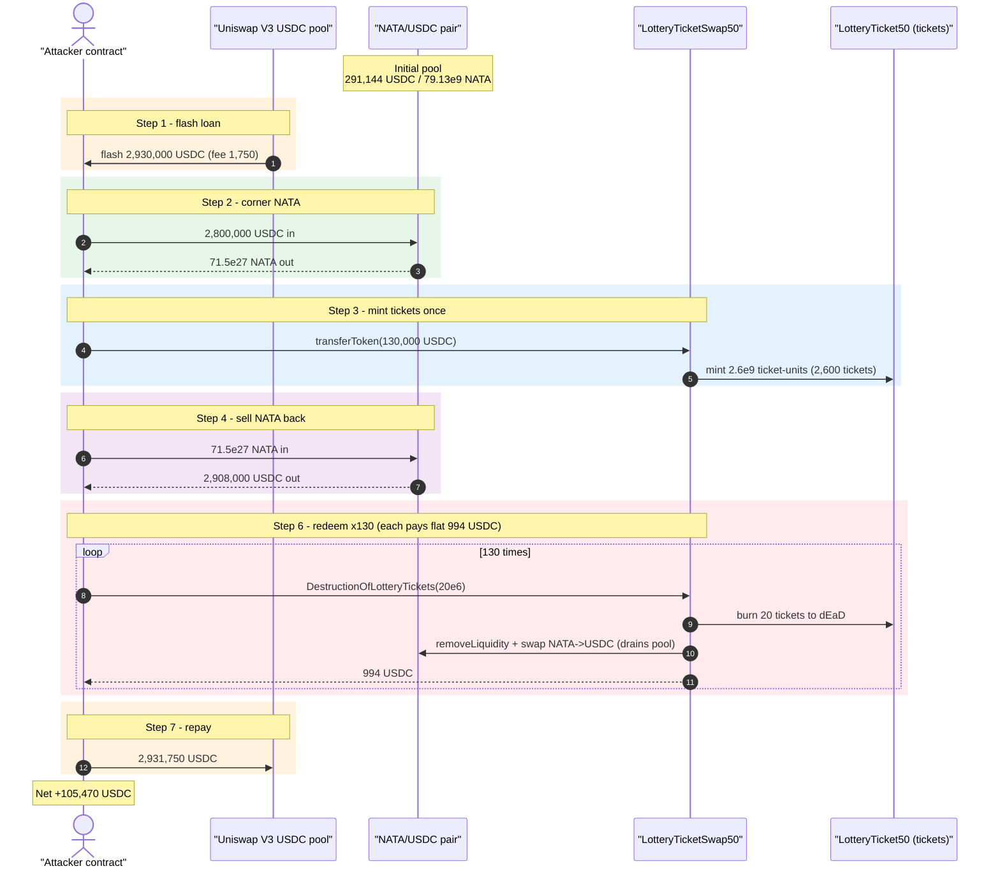
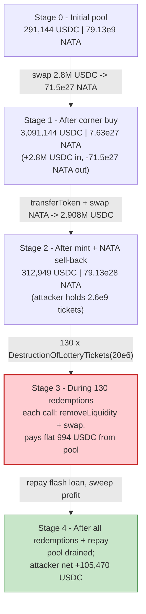
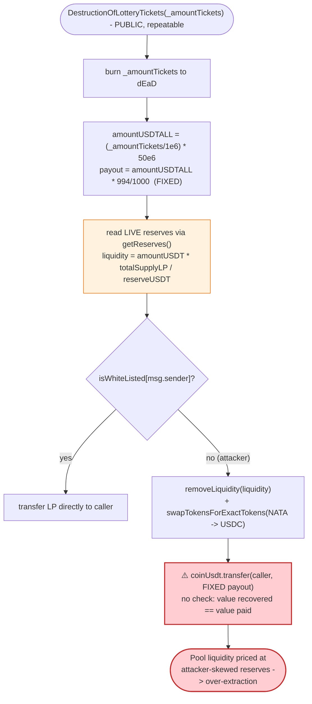

# Nalakuvara / LotteryTicketSwap50 Exploit — Fixed-Payout Redemption Drains the AMM Pool

> **Vulnerability classes:** vuln/oracle/price-manipulation · vuln/defi/slippage

> **Reproduction:** the PoC compiles & runs in an isolated Foundry project at
> [this project folder](.) (the umbrella DeFiHackLabs repo contains many unrelated
> PoCs that do not whole-compile, so this one was extracted).
> Full verbose trace: [output.txt](output.txt).
> Verified vulnerable source: [LotteryTicketSwap50.sol](sources/LotteryTicketSwap50_172119/LotteryTicketSwap50.sol).

---

## Key info

| | |
|---|---|
| **Loss** | **105,470 USDC** (net profit to attacker, drained out of the NATA/USDC liquidity pool) |
| **Vulnerable contract** | `LotteryTicketSwap50` — [`0x172119155a48DE766B126de95c2cb331D3A5c7C2`](https://basescan.org/address/0x172119155a48DE766B126de95c2cb331D3A5c7C2#code) |
| **Lottery ticket token** | `LotteryTicket50` (6 dec) — [`0xF9260Bb78d16286270e123642ca3DE1F2289783b`](https://basescan.org/address/0xF9260Bb78d16286270e123642ca3DE1F2289783b#code) |
| **Pool token** | `Nalakuvara` (NATA, 18 dec) — [`0xb39392F4b6D92a6BD560Ed260C2c488081aAB8E9`](https://basescan.org/address/0xb39392F4b6D92a6BD560Ed260C2c488081aAB8E9#code) |
| **Victim pool** | NATA/USDC pair (custom V2-style) — `0xaDcaaB077f636d74fd50FDa7f44ad41e20A21FEE`; router `0x09923035c264940b5db3682e8aF5D2499Ee6Eb40` |
| **Flash-loan source** | Uniswap V3 USDC pool — `0xd0b53D9277642d899DF5C87A3966A349A798F224` |
| **Attacker EOA** | [`0x3026C464d3Bd6Ef0CeD0D49e80f171b58176Ce32`](https://basescan.org/address/0x3026C464d3Bd6Ef0CeD0D49e80f171b58176Ce32) |
| **Attacker contract** | `0x1E70b608fE24C469d807fefE0c9554268ed6C1Bb` (deployed in the PoC) |
| **Attack tx** | [`0x16a99aef4fab36c84ba4616668a03a5b37caa12e2fc48923dba4e711d2094699`](https://basescan.org/tx/0x16a99aef4fab36c84ba4616668a03a5b37caa12e2fc48923dba4e711d2094699) |
| **Chain / block / date** | Base / 30,001,613 (forked at −1) / May 2025 |
| **Compiler** | Solidity v0.8.20, optimizer 999999 runs |
| **Bug class** | Broken redemption invariant — a fixed nominal payout backed by pool liquidity priced at attacker-manipulated reserves |

---

## TL;DR

`LotteryTicketSwap50` lets a user "buy lottery tickets" with USDC (`transferToken`) and later "destroy"
those tickets to get a refund (`DestructionOfLotteryTickets`). The refund function pays out a **fixed
nominal amount** — `amountUSDTALL * 994/1000` USDC, where `amountUSDTALL = (_amountTickets / 1e6) * 50e6`
— and funds that payout by **force-removing liquidity from the NATA/USDC AMM pool** and swapping the
recovered NATA back into USDC, on behalf of whoever calls it
([LotteryTicketSwap50.sol:966-1035](sources/LotteryTicketSwap50_172119/LotteryTicketSwap50.sol#L966-L1035)).

The contract never checks that the value it actually recovers from the pool equals the value it pays
out. The amount of LP it burns is computed as `liquidity = (amountUSDT * totalSupplyLP) / reserveUSDT`
using the pool's **current, manipulable reserves**. By skewing those reserves with a flash loan first,
the attacker makes each redemption call extract far more value from the pool than it should, while the
contract still hands the caller the full fixed 994 USDC per call.

The attacker:

1. Flash-borrows **2,930,000 USDC** from a Uniswap V3 pool.
2. Pushes **2,800,000 USDC** into the NATA/USDC pair and pulls out **71.5 × 10²⁷ NATA** (cornering the
   pool's NATA so it can be sold back later at a better rate).
3. Mints lottery tickets once with `transferToken(130,000 USDC)` → 2,600 tickets (2.6 × 10⁹ ticket-units).
4. Sells the NATA back for **2,908,000 USDC**.
5. Calls `DestructionOfLotteryTickets(20e6)` **130 times** — each call burns 20 tickets and pays the
   attacker a flat **994 USDC**, totalling **129,220 USDC**, while internally draining the pool.
6. Repays the flash loan (**2,931,750 USDC**, incl. 1,750 USDC fee) and walks away with **105,470 USDC**.

---

## Background — what LotteryTicketSwap50 does

`LotteryTicketSwap50` ([source](sources/LotteryTicketSwap50_172119/LotteryTicketSwap50.sol)) is a small
"lottery" front-end glued to a NATA/USDC AMM:

- **`transferToken(amount)`** ([:903-962](sources/LotteryTicketSwap50_172119/LotteryTicketSwap50.sol#L903-L962)) —
  the *deposit* side. The user pays `amount` USDC (must be a multiple of `MIN_DEPOSIT = 50 USDC`), the
  contract mints `(amount / 50e6) * 1e6` ticket-units of `LotteryTicket50`, then takes half of the USDC
  (`amountIn = amount*50/100`), swaps it for NATA, and (only if `flag1` is set) adds NATA/USDC liquidity.
- **`DestructionOfLotteryTickets(_amountTickets)`** ([:966-1035](sources/LotteryTicketSwap50_172119/LotteryTicketSwap50.sol#L966-L1035)) —
  the *redeem* side. The user burns `_amountTickets` ticket-units to `0xdEaD`, and the contract pays
  back a flat `amountUSDTALL * 994/1000` USDC (0.6% haircut), funded by removing LP from the pool and
  swapping NATA→USDC.

The relevant on-chain facts at the fork block:

| Parameter | Value |
|---|---|
| `MIN_DEPOSIT` | `50 * 10**6` (50 USDC) |
| `LotteryTicket50` decimals | **6** |
| `Nalakuvara` (NATA) decimals | 18, total supply 1 × 10²⁹ |
| NATA/USDC pool reserves (pre-attack) | ≈ **291,144 USDC** / **79.13 × 10⁹ NATA** |
| `flag1` | false (the deposit path skips `addLiquidity`) |
| Caller whitelisted? | No (attacker takes the non-whitelisted `removeLiquidity` branch) |

---

## The vulnerable code

### Redemption pays a fixed nominal amount, sourced from the pool

```solidity
function DestructionOfLotteryTickets(uint _amountTickets) public returns(bool){
    ...
    require(coinTicket.transferFrom(msg.sender, deadAddress, _amountTickets), "Ticket transfer failed");

    uint ticket_count   = _amountTickets / MIN_TICKET;          // _amountTickets / 1e6
    uint amountUSDTALL  = ticket_count * MIN_DEPOSIT;           // ticket_count * 50e6
    uint amountUSDT     = amountUSDTALL/2*997/1000;             // ~half, less 0.3% fee

    // current, manipulable reserves
    if (token0 == tokenUSDT) { (reserveUSDT, reserveNATA,) = pair.getReserves(); }
    else                     { (reserveNATA, reserveUSDT,) = pair.getReserves(); }

    uint256 totalSupplyLP = IERC20(pairAddress).totalSupply();
    uint liquidity = (amountUSDT * totalSupplyLP) / reserveUSDT;   // ⚠️ priced off live reserves

    IERC20(pairAddress).approve(ROUTER_ADDRESS, liquidity);
    if (isWhiteListed[msg.sender]) { ... } else {
        (, uint amountNATAout) = swapRouter.removeLiquidity(       // pull USDC + NATA out of the pool
            tokenUSDT, tokenNATA, liquidity, 1, 1, address(this), block.timestamp+600);

        uint amountOut = amountUSDTALL*994/1000 - amountUSDT;      // remaining USDC to make up the payout
        ...
        swapRouter.swapTokensForExactTokens(                      // swap recovered NATA → exact USDC
            amountOut, amountInMax, path, address(this), block.timestamp+600);

        coinUsdt.transfer(msg.sender, amountUSDTALL*994/1000);     // ⚠️ FIXED payout, no value check
    }
    return true;
}
```
[LotteryTicketSwap50.sol:966-1035](sources/LotteryTicketSwap50_172119/LotteryTicketSwap50.sol#L966-L1035)

### Minting in the deposit path (for reference)

```solidity
uint ticket_count = amount / MIN_DEPOSIT;                 // amount / 50e6
require(coinTicket.mint(msg.sender, ticket_count * 10**6), "Ticket mint failed");
```
[LotteryTicketSwap50.sol:914-916](sources/LotteryTicketSwap50_172119/LotteryTicketSwap50.sol#L914-L916)

`LotteryTicket50.mint` is gated to a minter whitelist, and `LotteryTicketSwap50` is that minter; there is
no other supply check ([LotteryTicket50.sol:657-664](sources/LotteryTicket50_F9260B/LotteryTicket50.sol#L657-L664)).

---

## Root cause — why it was possible

The redemption function makes a promise it cannot honor safely:

> "Burn `N` ticket-units and I will pay you exactly `N/1e6 × 50 × 0.994` USDC — and I'll get that USDC by
> pulling liquidity out of the AMM pool and selling the NATA."

Three design flaws compose into the loss:

1. **Fixed payout, variable backing.** The amount paid (`amountUSDTALL*994/1000`) is a constant derived
   only from the ticket count. The amount of value actually pulled from the pool depends on
   `liquidity = (amountUSDT * totalSupplyLP) / reserveUSDT` and on how much USDC the `removeLiquidity` +
   `swapTokensForExactTokens` round-trip nets — all of which move with the **live pool reserves**. The
   contract never reconciles "value out of the pool" against "value paid to the caller," so any divergence
   becomes the caller's profit at the pool's (LPs') expense.

2. **Reserves are read live and are flash-loan-manipulable.** `getReserves()` is read at call time. An
   attacker can pre-skew the NATA/USDC reserves with a large flash-funded swap so that the
   `liquidity`/swap arithmetic over-extracts value from the pool relative to the fixed payout. The router
   itself uses a non-standard "subPool" burn mechanism, so the attacker-driven swaps return
   attacker-favorable amounts rather than honest constant-product amounts.

3. **Permissionless, repeatable, no per-caller accounting.** Anyone holding tickets can call
   `DestructionOfLotteryTickets` arbitrarily many times in a single transaction. The attacker mints a
   large ticket balance once (`transferToken`) and then loops the redemption 130 times, each loop
   peeling value out of the pool — there is no rate limit, no cumulative-payout cap, and no check that
   the pool can sustain the cumulative drain.

The deposit/redeem ticket arithmetic alone is *not* profitable (130,000 USDC in → 129,220 USDC out = a
780 USDC loss on tickets). The profit comes entirely from the **AMM round-trip the redemptions enable**:
the attacker buys 71.5 × 10²⁷ NATA cheaply, the 130 redemptions repeatedly burn/withdraw NATA from the
pool and pay out fixed USDC, and the attacker then sells the cornered NATA back into the reshaped pool
for 108,000 USDC more than it paid.

---

## Preconditions

- The attacker can mint a large ticket balance via a single `transferToken` (only needs USDC and the
  multiple-of-50 check) — fully recovered intra-transaction.
- The NATA/USDC pool has enough USDC/NATA liquidity to corner and to satisfy the redemption withdrawals.
- Working capital in USDC to skew the pool — supplied by a Uniswap V3 USDC flash loan (2,930,000 USDC),
  repaid in the same transaction, hence **flash-loanable / zero-capital**.
- The attacker is *not* whitelisted, so the redemption takes the `removeLiquidity` + swap branch
  (the actual pool drain). The whitelist branch just hands out LP directly.

---

## Attack walkthrough (with on-chain numbers from the trace)

All figures are taken directly from the `Transfer` / `Swap` / `Sync` events in
[output.txt](output.txt). USDC and ticket-units are 6-dec; NATA is 18-dec.

| # | Step | Trace | Concrete numbers |
|---|------|-------|------------------|
| 1 | **Flash loan** USDC from the V3 pool | [L42, L49-51](output.txt) | borrow **2,930,000 USDC** (fee 1,750) |
| 2 | **Corner NATA** — send 2,800,000 USDC to the pair, `swap()` out NATA | [L58, L66-80](output.txt) | 2,800,000 USDC in → **71.5 × 10²⁷ NATA** out; pool now 3,091,144 USDC / 7.63 × 10²⁷ NATA |
| 3 | **Mint tickets** — `transferToken(130,000 USDC)` | [L93-107](output.txt) | pulls 130,000 USDC, **mints 2.6 × 10⁹ ticket-units (2,600 tickets)** |
| 4 | **Sell NATA back** — `swap()` NATA → USDC | [L224-246](output.txt) | 71.5 × 10²⁷ NATA in → **2,908,000 USDC** out; pool drops to 312,949 USDC / 79.13 × 10²⁸ NATA |
| 5 | **Approve tickets** to the swap contract | [L250-254](output.txt) | approve 1 × 10²⁷ ticket-units |
| 6 | **Redeem ×130** — `DestructionOfLotteryTickets(20e6)` | [L255-…](output.txt) (130 calls) | each burns 20 tickets, internally `removeLiquidity` + `swapTokensForExactTokens`, pays attacker a flat **994 USDC**; total **129,220 USDC** |
| 7 | **Repay flash loan** | [L19767-19772](output.txt) | transfer **2,931,750 USDC** to the V3 pool |
| 8 | **Sweep profit** to EOA | [L19779-19781](output.txt) | **105,470 USDC** → attacker EOA |

### Per-redemption-call mechanics (one of the 130 iterations)

For `DestructionOfLotteryTickets(20_000_000)`: `ticket_count = 20`, `amountUSDTALL = 1,000 USDC`,
`amountUSDT = 1000/2 × 0.997 = 498.5 USDC`, payout `= 1000 × 0.994 = 994 USDC`.

1. Burn 20 ticket-units to `0xdEaD`.
2. `removeLiquidity` of `liquidity` LP → contract receives ≈ **498.5 USDC + ≈ 1.26 × 10²⁶ NATA**
   ([L285-325](output.txt)).
3. `swapTokensForExactTokens(amountOut = 495.5 USDC)` swaps that NATA back for **495.5 USDC**
   ([L330-405](output.txt)).
4. `coinUsdt.transfer(msg.sender, 994 USDC)` ([L406-408](output.txt)).

The contract recovers ≈ 498.5 + 495.5 = 994 USDC from the pool and pays 994 USDC out, so the *contract*
nets ~0 — but the recovery comes out of the **pool's liquidity** at reserves the attacker has reshaped,
and the residual NATA burned via the router's `subPool` mechanism ([L331-340](output.txt)) keeps lifting
the NATA price the attacker already profited from in step 4.

### Profit accounting (USDC, attacker contract)

| Flow | Direction | Amount (USDC) |
|---|---|---:|
| Flash loan received | in | 2,930,000 |
| Corner swap (USDC in) | out | −2,800,000 |
| `transferToken` deposit | out | −130,000 |
| NATA sold back | in | +2,908,000 |
| 130 × redemption payout (130 × 994) | in | +129,220 |
| Flash-loan repayment (incl. 1,750 fee) | out | −2,931,750 |
| **Net profit** | | **+105,470** |

This reconciles exactly to the `USDC after attack: 105470.000000` log
([L19805](output.txt)) and the `105,470 USDC` transfer to the EOA
([L19779-19781](output.txt)).

---

## Diagrams

### Sequence of the attack



### Pool / state evolution



### The flaw inside `DestructionOfLotteryTickets`



---

## Remediation

1. **Never source a fixed payout from variable pool liquidity.** A redemption that promises a constant
   USDC amount must hold that USDC (or a reserve) directly. If liquidity must be unwound, pay the caller
   the *actual* value recovered (`removeLiquidity` USDC + swap proceeds), not a hardcoded
   `amountUSDTALL*994/1000` — i.e., reconcile out-of-pool value against the payout and revert on shortfall.
2. **Do not price internal accounting off live, manipulable reserves.** Reading `getReserves()` at call
   time lets a flash loan reshape `liquidity` and the swap output. Use a TWAP/oracle price, or settle
   redemptions against the protocol's own held balances.
3. **Cap and rate-limit redemptions.** Forbid unbounded same-transaction looping of
   `DestructionOfLotteryTickets`; add a per-tx / per-block cumulative-payout cap and a per-caller ledger
   so a single actor cannot peel the pool apart in one call sequence.
4. **Add flash-loan / reentrancy guards on AMM-touching paths.** Both deposit and redeem interact with the
   pool inside attacker-controlled callbacks; a `nonReentrant` guard plus same-block manipulation checks
   would block the corner-then-redeem-then-sell composition.
5. **Make the deposit/redeem economics self-consistent.** The mint/redeem ticket arithmetic is asymmetric
   and only "safe" while reserves are honest; design the round-trip so it cannot be gamed regardless of
   pool state.

---

## How to reproduce

The PoC was extracted into a standalone Foundry project (the umbrella DeFiHackLabs repo has many unrelated
PoCs that fail to whole-compile under `forge test`):

```bash
_shared/run_poc.sh 2025-05-Nalakuvara_LotteryTicket50_exp -vvvvv
```

- RPC: a **Base archive** endpoint is required (fork block 30,001,612). `foundry.toml` uses
  `https://base.publicnode.com`, which serves historical state at that block; the default Infura key
  prunes it (`pruned history unavailable`) and `base.drpc.org` rate-limits (HTTP 429) mid-trace.
- Result: `[PASS] testExploit()` with `USDC after attack: 105470.000000`.

Expected tail:

```
Ran 1 test for test/Nalakuvara_LotteryTicket50_exp.sol:Nalakuvara_LotteryTicket50_exp
[PASS] testExploit() (gas: 20689316)
  USDC before attack: 0.000000
  USDC after attack: 105470.000000
Suite result: ok. 1 passed; 0 failed; 0 skipped
```

---

*References: TenArmor — https://x.com/TenArmorAlert/status/1921046572353417560 ; SlowMist Hacked — https://hacked.slowmist.io/ (Nalakuvara / LotteryTicket50, Base, ~$105.47K).*
