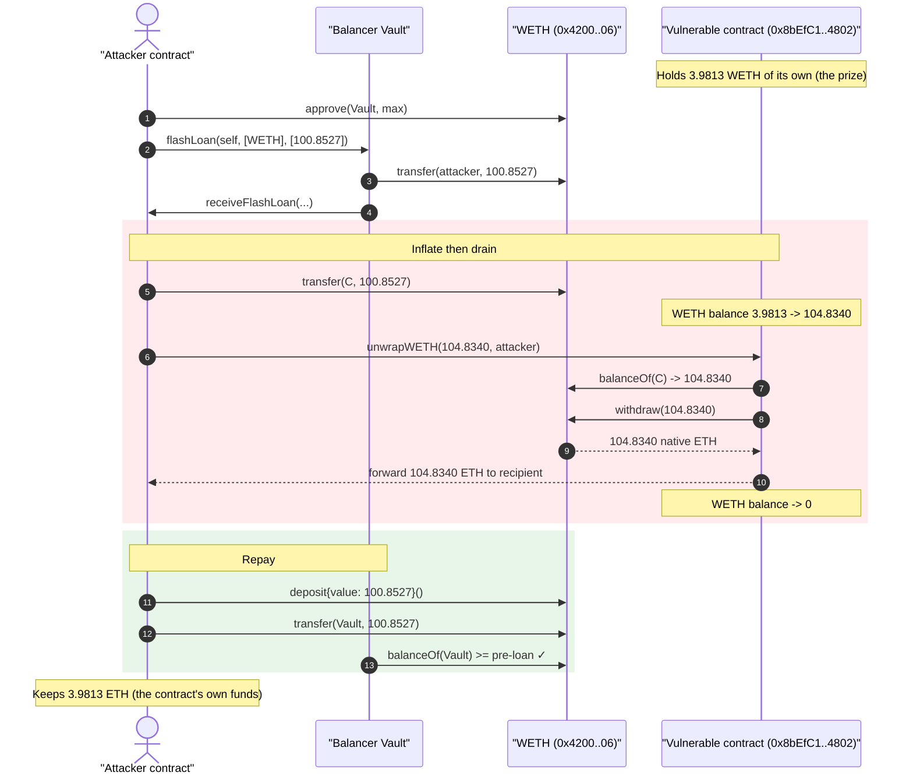
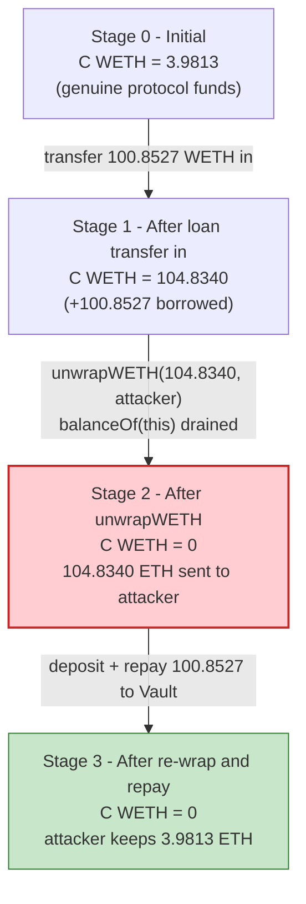
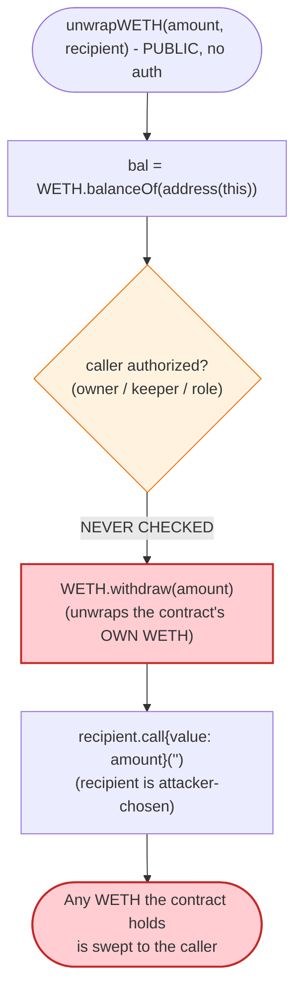

# Unwarp Exploit — Permissionless `unwrapWETH(amount, recipient)` Self-Balance Drain

> **Reproduction:** the PoC compiles & runs in an isolated Foundry project at
> [this project folder](.) (the umbrella DeFiHackLabs repo contains many
> unrelated PoCs that do not whole-compile, so this one was extracted).
> Full verbose trace: [output.txt](output.txt).
> The vulnerable contract is a **verified** OpenZeppelin
> [`TransparentUpgradeableProxy`](sources/TransparentUpgradeableProxy_8bEfC1/openzeppelin_contracts_proxy_transparent_TransparentUpgradeableProxy.sol),
> but its logic implementation (`0xd971…f131`) is **unverified** — the vulnerable
> `unwrapWETH` behavior below is reconstructed from the on-chain execution trace.

---

## Key info

| | |
|---|---|
| **Loss** | **3.9813269016365735 WETH (≈ $9K)** — the vulnerable contract's own pre-existing WETH balance |
| **Vulnerable contract** | proxy [`0x8bEfC1d90d03011a7d0b35B3a00eC50f8E014802`](https://basescan.org/address/0x8bEfC1d90d03011a7d0b35B3a00eC50f8E014802#code) → logic `0xd971fD39D9714d5eb1B54B931790170A0630f131` (unverified) |
| **Victim** | the proxy itself (its idle WETH balance); flash-loan liquidity from Balancer Vault |
| **Liquidity source** | Balancer V2 Vault `0xBA12222222228d8Ba445958a75a0704d566BF2C8` (flash loan, 0 fee) |
| **Attacker EOA** | [`0x5cc162c556092fe1d993b95d1b9e9ce58a11dbc9`](https://basescan.org/address/0x5cc162c556092fe1d993b95d1b9e9ce58a11dbc9) |
| **Attacker contract** | [`0x0c6a8c285d696d4d9b8dd4079a72a6460a4da05f`](https://basescan.org/address/0x0c6a8c285d696d4d9b8dd4079a72a6460a4da05f) |
| **Attack tx** | [`0xac6f716c57bbb1a4c1e92f0a9531019ea2ecfcaea67794bbd27115d400ae9b41`](https://app.blocksec.com/explorer/tx/base/0xac6f716c57bbb1a4c1e92f0a9531019ea2ecfcaea67794bbd27115d400ae9b41) |
| **Chain / block / date** | **Base** / 30,210,273 / May 2025 |
| **Compiler (proxy)** | Solidity v0.8.20, optimizer enabled |
| **Bug class** | Missing access control + caller-controlled recipient on a balance-based WETH unwrap |

---

## TL;DR

The vulnerable contract exposes a **permissionless** function
`unwrapWETH(uint256 amount, address recipient)`. It unwraps the **contract's own**
WETH (`WETH.balanceOf(this)`) into native ETH via `WETH.withdraw(...)` and forwards
that ETH to an **arbitrary caller-supplied `recipient`** — with no `onlyOwner` /
keeper / role check and no validation that the caller is entitled to that ETH.

Any WETH sitting in the contract can therefore be swept by anyone. To maximize the
take in a single atomic transaction, the attacker uses a flash loan as a *balance
amplifier*:

1. **Flash-loan 100.8527 WETH** from the Balancer Vault (0 fee).
2. **Transfer all 100.8527 WETH into the vulnerable contract**, temporarily inflating
   its WETH balance from its genuine **3.9813 WETH** up to exactly **104.8340 WETH**.
3. **Call `unwrapWETH(104.8340e18, attacker)`** — the contract withdraws its *entire*
   104.8340 WETH balance as ETH and sends it to the attacker.
4. **Re-wrap 100.8527 WETH** and **repay the flash loan**.

The attacker walks away with `104.8340 − 100.8527 = ` **3.9813269016365735 ETH**, which
is precisely the contract's own pre-existing WETH balance. The flash loan contributes
**zero** profit — it only lets the attacker drain the whole balance in one shot while
still being able to repay. The genuine loss is the protocol's idle WETH (~$9K).

---

## Background — what the contract does

The address `0x8bEfC1…4802` is a standard OpenZeppelin
[`TransparentUpgradeableProxy`](sources/TransparentUpgradeableProxy_8bEfC1/openzeppelin_contracts_proxy_transparent_TransparentUpgradeableProxy.sol)
(verified) that `delegatecall`s into an unverified logic contract
`0xd971fD39…f131`. From the trace, that logic is a router/helper-style contract that,
among other things, holds a WETH balance and exposes a `unwrapWETH(uint256,address)`
helper — a common pattern in periphery contracts that need to convert WETH the contract
is holding back into native ETH for a recipient (e.g. after a swap or fee sweep).

On-chain facts at the fork block (read straight from the trace, `output.txt`):

| Fact | Value | Trace ref |
|---|---|---|
| WETH (canonical Base) | `0x4200000000000000000000000000000000000006` | — |
| Vulnerable contract's WETH balance | **3.9813269016365735 WETH** | [output.txt:36](output.txt#L36) (`0x374083b91ac129eb`) |
| Balancer Vault WETH balance | 1,261.2649 WETH | [output.txt:21-22](output.txt#L21-L22) |
| Flash loan fee | **0** | [output.txt:23-24](output.txt#L23-L24) |
| `unwrapWETH` selector | `0xe16d9ce5` | — |

That single fact — the contract sitting on **3.98 WETH of its own** — is the entire prize.
The flash loan exists only to make the unwrap drain *all* of it atomically.

---

## The vulnerable code

The logic contract is unverified, so the snippet below is the **behavioral
reconstruction** from the execution trace. The trace shows, inside the
`delegatecall` to `0xd971…f131`, exactly this sequence for
`unwrapWETH(104833984375000000000, attacker)`:

```text
unwrapWETH(uint256 amount, address recipient):           // selector 0xe16d9ce5, PUBLIC
    bal = WETH.balanceOf(address(this));                  // -> 104.833984375  (trace L40-41)
    WETH.withdraw(amount);                                // withdraw(104.833984375)  (trace L42)
        // WETH burns the contract's wrapped balance and
        // sends native ETH to address(this)
    recipient.call{value: amount}("");                    // ETH forwarded to attacker  (trace L51)
    return true;
```

Reconstructed from [output.txt:38-54](output.txt#L38-L54):

```text
[25566] 0x8bEfC1…4802::unwrapWETH(104833984375000000000, Unwarp)
  └─ [20615] 0xd971…f131::unwrapWETH(104833984375000000000, Unwarp) [delegatecall]
       ├─ WETH::balanceOf(0x8bEfC1…4802) -> 104833984375000000000   // reads OWN balance
       ├─ WETH::withdraw(104833984375000000000)                     // unwrap OWN WETH -> ETH
       │    └─ emit Withdrawal(src: 0x8bEfC1…4802, wad: 104.833984375)
       └─ Unwarp::fallback{value: 104833984375000000000}()          // ETH sent to caller
```

The two fatal properties, both visible in the trace:

1. **No access control.** The call originates from the attacker's contract (an arbitrary
   address), inside a Balancer flash-loan callback — there is no `onlyOwner`/role revert.
   The function executes for anyone.
2. **The unwrap is funded by the contract's *own* balance, but the ETH is sent to a
   caller-chosen `recipient`.** `balanceOf(address(this))` is the source of funds, and the
   `recipient` argument (the attacker) is the destination. There is no accounting tying
   the caller to any deposit, so the caller can specify themselves and receive the
   contract's WETH as ETH.

(The proxy's own `_fallback` delegate-forwarding is the standard OZ
[`Proxy._delegate`](sources/TransparentUpgradeableProxy_8bEfC1/openzeppelin_contracts_proxy_Proxy.sol);
the proxy is not the bug — the unprotected `unwrapWETH` in the logic is.)

---

## Root cause — why it was possible

A WETH-unwrap helper is only safe if **the funds it unwraps belong to the caller** or if
**the function is privileged**. This one is neither:

> `unwrapWETH` unwraps `address(this)`'s WETH and forwards the resulting ETH to an
> arbitrary `recipient`, with no caller authorization and no per-caller balance
> accounting. Whatever WETH the contract is holding becomes free for the taking.

The flash loan does **not** create the value — it is purely a *balance amplifier*:

- The contract's drainable funds = `WETH.balanceOf(contract)` at the moment of the unwrap.
- By transferring borrowed WETH *into* the contract first, the attacker inflates that
  balance, then unwraps the inflated total to themselves, then re-wraps the borrowed
  portion to repay. The borrowed amount is conserved (in → out → repay); only the
  contract's pre-existing **3.9813 WETH** is net-extracted.
- Without the flash loan the attacker could still steal the 3.98 WETH directly
  (`unwrapWETH(3.98e18, attacker)`); the loan just guarantees the whole balance is taken in
  one atomic, capital-free transaction.

So the design defects that compose into the loss:

1. **Permissionless entry point** to a fund-moving routine.
2. **Source of funds = `balanceOf(this)`** (not a per-caller credit), so any token the
   contract custodies is exposed.
3. **Caller-controlled `recipient`**, so the thief can name themselves.

---

## Preconditions

- The vulnerable contract holds a non-zero WETH balance (here **3.9813 WETH**). This is the
  only value at risk — and the only thing the attacker actually keeps.
- A flash-loan source for WETH with enough liquidity and (ideally) zero fee. Balancer V2's
  Vault on Base served **1,261 WETH at 0 fee** ([output.txt:21-24](output.txt#L21-L24)).
  The loan is optional for the theft itself but lets the drain be atomic and capital-free.
- The attacker must pass `amount = balanceOf(contract)` after the deposit (here
  `3.9813 + 100.8527 = 104.8340 WETH`) so the unwrap takes the full balance.

---

## Attack walkthrough (with on-chain numbers from the trace)

All figures are read directly from the events/storage diffs in [output.txt](output.txt).
`A` = vulnerable contract `0x8bEfC1…4802`. `WETH` = `0x4200…0006`.

| # | Step | Actor | WETH moved | `A` WETH balance | Trace ref |
|---|------|-------|-----------:|-----------------:|-----------|
| 0 | **Initial** — `A` holds its own idle WETH | — | — | **3.9813269016** | [L36](output.txt#L36) |
| 1 | `approve(Vault, max)` so the loan can be repaid | attacker | — | 3.9813269016 | [L15-19](output.txt#L15-L19) |
| 2 | **`Vault.flashLoan(self, [WETH], [100.8527], …)`** — borrow 100.8527 WETH, fee 0 | Balancer | +100.8527 → attacker | 3.9813269016 | [L20-30](output.txt#L20-L30) |
| 3 | inside callback: **`WETH.transfer(A, 100.8527)`** — inflate `A`'s balance | attacker | 100.8527 → `A` | **104.833984375** | [L32-37](output.txt#L32-L37) |
| 4 | **`A.unwrapWETH(104.833984375, attacker)`** — unwrap *all* of `A`'s WETH, send ETH to attacker | attacker | `A` → 0; 104.8340 ETH → attacker | **0** | [L38-54](output.txt#L38-L54) |
| 5 | **`WETH.deposit{value: 100.8527}()`** — re-wrap the borrowed portion | attacker | — | 0 | [L55-59](output.txt#L55-L59) |
| 6 | **`WETH.transfer(Vault, 100.8527)`** — repay the flash loan | attacker | 100.8527 → Vault | 0 | [L60-65](output.txt#L60-L65) |
| 7 | Balancer re-checks balance ≥ pre-loan (1,261.2649) ✓ — loan settles | Balancer | — | 0 | [L67-69](output.txt#L67-L69) |

After step 4 the attacker holds **104.8340 ETH**; after repaying **100.8527 WETH** it
retains **3.9813269016365735 ETH** as native ETH.

> **Note on the PoC's log line.** The test prints
> `WETH Balance after the attack: 79228162518.245664…` ([output.txt:71](output.txt#L71)).
> That number is *not* the profit — it is `address(this).balance` of the Foundry test
> contract, which Foundry seeds with a default `uint96`-ish ETH balance (~7.9e28 wei) for
> gas. The **actual profit is the contract's drained 3.9813269016365735 WETH/ETH**, derived
> above from the balance diffs.

### Profit accounting (WETH/ETH)

| Direction | Amount (WETH) |
|---|---:|
| Borrowed from Balancer | 100.8527 |
| Unwrapped out of `A` (to attacker, as ETH) | 104.833984375 |
| Re-wrapped & repaid to Balancer | 100.8527 |
| Flash-loan fee | 0 |
| **Net profit** | **+3.9813269016365735** |

The net equals `A`'s original WETH balance to the wei — confirming the attacker simply
swept the contract's idle WETH, with the flash loan contributing nothing but reach.

---

## Diagrams

### Sequence of the attack



### Contract WETH-balance evolution



### The flaw inside `unwrapWETH`



---

## Why the flash loan (and why it adds nothing to profit)

- The drainable amount is *exactly* `WETH.balanceOf(contract)` at unwrap time. Borrowed
  WETH transferred in is conserved: it goes `Vault -> attacker -> contract -> (unwrapped)
  -> attacker -> re-wrapped -> Vault`. The loop nets to zero for the borrowed portion.
- The only **net** outflow from the system is the contract's pre-existing **3.9813 WETH**.
- The attacker chose `amount = 104.833984375 = 3.9813 (existing) + 100.8527 (borrowed)` so
  that the single `unwrapWETH` call empties the entire balance and the borrowed part is
  available to repay. A direct `unwrapWETH(3.9813e18, attacker)` with no loan would have
  stolen the same 3.98 WETH — the loan just makes it atomic and capital-free.

---

## Remediation

1. **Add access control.** `unwrapWETH` (and any routine that moves the contract's own
   funds) must be gated — `onlyOwner`, a trusted keeper role, or be `internal` and only
   reachable from a flow that already authenticated the caller.
2. **Never unwrap `balanceOf(address(this))` for an arbitrary recipient.** Tie withdrawals
   to per-caller accounting: only let `msg.sender` redeem WETH they actually deposited /
   are credited for. Do not let the `recipient` argument point the contract's own balance
   at an unrelated address.
3. **Validate the `amount` against the caller's entitlement, not the raw balance.** Even if
   the function must remain public, it should cap the unwrap at the caller's recorded
   credit, so transient balance inflation (via a direct transfer or flash loan) cannot be
   weaponized.
4. **Don't custody idle funds in a periphery/router contract.** If the contract only needs
   to forward funds within a single call, it should never hold a standing balance an
   attacker can sweep; sweep dust to a treasury under access control instead.
5. **Treat `balanceOf(address(this))` as attacker-influenceable.** Any logic that reads its
   own token balance must assume an adversary can inflate it (donation / flash loan) within
   the same transaction.

---

## How to reproduce

The PoC was extracted into a standalone Foundry project (the umbrella DeFiHackLabs repo has
many unrelated PoCs that fail to compile under a single `forge test` build):

```bash
_shared/run_poc.sh 2025-05-Unwarp_exp -vvvvv
```

- **RPC:** a **Base archive** endpoint is required (fork block 30,210,273). The default
  Infura Base key prunes that history and fails with
  `error code 4444: pruned history unavailable`; `foundry.toml` therefore points `base` at
  `https://base.drpc.org`, which serves the historical state.
- Result: `[PASS] testExploit()`. The drained value is the contract's own
  **3.9813269016365735 WETH (~$9K)**.

Expected tail:

```
Ran 1 test for test/Unwarp_exp.sol:Unwarp
[PASS] testExploit() (gas: 128493)
Logs:
  WETH Balance after the attack: 79228162518.245664495180524010   # = test contract's seeded ETH, NOT the profit
Suite result: ok. 1 passed; 0 failed; 0 skipped
```

---

*Reference: original attacker / attack tx per the PoC header; loss ≈ 3.98 WETH (~$9K) on Base, May 2025.*
