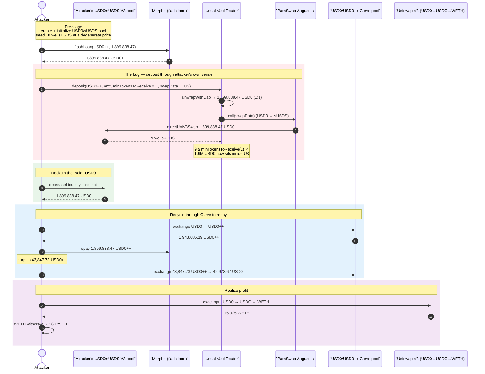
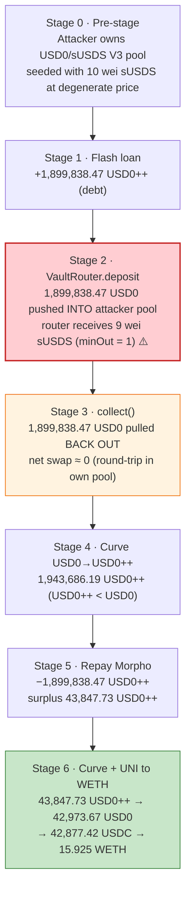
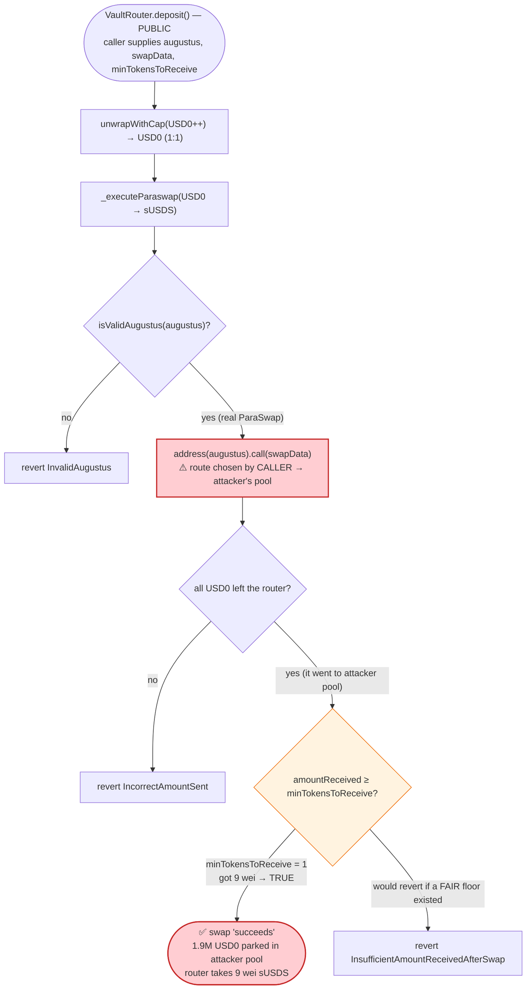

# Usual Money Exploit — `VaultRouter.deposit` Routes Through an Attacker-Controlled Swap Venue With No Real Slippage Floor

> **Reproduction:** the PoC compiles & runs in an isolated Foundry project at
> [this project folder](.) (the umbrella DeFiHackLabs repo
> contains several unrelated PoCs that do not whole-compile, so this one was extracted).
> Full verbose trace: [output.txt](output.txt).
> Verified vulnerable source: [src_VaultRouter.sol](sources/VaultRouter_E033cb/src_VaultRouter.sol).

---

## Key info

| | |
|---|---|
| **Loss** | ~$43,000 — **15.925 WETH** extracted out of Usual's `VaultRouter` / `WrappedDollarVault` deposit path |
| **Vulnerable contract** | `VaultRouter` — [`0xE033cb1bB400C0983fA60ce62f8eCDF6A16fcE09`](https://etherscan.io/address/0xE033cb1bB400C0983fA60ce62f8eCDF6A16fcE09#code) |
| **Victim / value source** | `VaultRouter.deposit` flow (unwrap USD0++ → USD0 → swap to sUSDS) and the USD0/USD0++ Curve pool `0x1d08E7adC263CfC70b1BaBe6dC5Bb339c16Eec52` |
| **Attacker EOA** | [`0x2ae2f691642bb18cd8deb13a378a0f95a9fee933`](https://etherscan.io/address/0x2ae2f691642bb18cd8deb13a378a0f95a9fee933) |
| **Attacker contract** | [`0xf195b8800b729aee5e57851dd4330fcbb69f07ea`](https://etherscan.io/address/0xf195b8800b729aee5e57851dd4330fcbb69f07ea) |
| **Attack tx** | [`0x585d8be6a0b07ca2f94cfa1d7542f1a62b0d3af5fab7823cbcf69fb243f271f8`](https://etherscan.io/tx/0x585d8be6a0b07ca2f94cfa1d7542f1a62b0d3af5fab7823cbcf69fb243f271f8) |
| **Chain / block / date** | Ethereum mainnet / 22,575,930 / May 27, 2025 |
| **Compiler** | Solidity ^0.8.20 (VaultRouter), OpenZeppelin upgradeable libs |
| **Bug class** | Caller-supplied swap venue + ineffective slippage floor → value siphoned into attacker-owned pool and reclaimed |

---

## TL;DR

`VaultRouter.deposit(augustus, USD0++, amountIn, minTokensToReceive, …, swapData)` lets a depositor
hand in USD0++, which the router **unwraps 1:1 into USD0** and then **swaps into sUSDS via ParaSwap**,
using a `swapData` blob the *caller fully controls*
([`_convertUSD0ppToTokens`](sources/VaultRouter_E033cb/src_VaultRouter.sol#L329-L351),
[`_executeParaswap`](sources/VaultRouter_E033cb/src_VaultRouter.sol#L388-L440)). The only
slippage protection on that swap is the `minTokensToReceive` the caller themselves passes in — and the
attacker passed **`1`**.

Because the caller picks the ParaSwap route, the attacker pointed the swap at a **brand-new Uniswap V3
USD0/sUSDS pool that the attacker had just created and seeded one block earlier**, initialized at a
degenerate price. The router dutifully fed **1,899,838.47 USD0** into that pool and received back
**9 wei** of sUSDS — passing the `minTokensToReceive = 1` check. The 1,899,838 USD0 simply landed as a
balance inside the attacker's own V3 position.

The attacker then `decreaseLiquidity` + `collect`ed that same **1,899,838.47 USD0** straight back out
of their pool, swapped it through the USD0/USD0++ Curve pool to repay the Morpho flash loan, and walked
the remaining spread out as **15.925 WETH (~$43k)**.

So the router converted ~$1.9M of unwrapped USD0 into ~9 wei of sUSDS "by design", because it trusted a
caller-chosen swap venue with a caller-chosen (and trivially-low) minimum-out. Everything else — the
flash loan, the Curve hops, the WETH exit — is plumbing to recycle that mispriced swap into profit.

---

## Background — what the VaultRouter does

Usual's `WrappedDollarVault` is a 1:1 ERC-4626 vault over **sUSDS** (Sky's savings-USDS token). To let
users enter the vault with USD0++ (Usual's bonded stablecoin) instead of sUSDS, Usual built a
`VaultRouter` ([source](sources/VaultRouter_E033cb/src_VaultRouter.sol)) that, on `deposit`:

1. Pulls the user's **USD0++**.
2. Calls `MINTER_USD0PP.unwrapWithCap(amount)` to convert USD0++ → **USD0** at a **1:1** ratio
   (subject to a daily "unwrap cap"). This is the `unwrapWithCap` delegatecall to the USD0PP
   implementation behind proxy [`0x35D894…`](https://etherscan.io/address/0x35D8949372D46B7a3D5A56006AE77B215fc69bC0#code).
3. **Swaps USD0 → sUSDS via ParaSwap**, using `augustus` + `swapData` supplied *by the caller*.
4. Deposits the resulting sUSDS into the 1:1 `WrappedDollarVault` and mints vault shares to `receiver`.

The intended design is: "User brings USD0++; router converts it to sUSDS at market rate and gives them
vault shares." The router is meant to be a convenience wrapper, so it lets the caller bring their own
ParaSwap route for the USD0→sUSDS leg.

Relevant on-chain facts at the fork block:

| Fact | Value |
|---|---|
| USD0++ → USD0 unwrap ratio (`unwrapWithCap`) | **1 : 1** |
| Caller-supplied `minTokensToReceive` (slippage floor) in the attack | **1** |
| ParaSwap Augustus used | `0xDEF171Fe48CF0115B1d80b88dc8eAB59176FEe57` (passes `isValidAugustus`) |
| ParaSwap route chosen by caller | `directUniV3Swap` over USD0/sUSDS pool **created by the attacker one block earlier** |
| Attacker's seeded sUSDS liquidity in that pool | **10 wei** sUSDS |
| USD0/USD0++ Curve pool used to repay | `0x1d08E7adC263CfC70b1BaBe6dC5Bb339c16Eec52` |

The single fact that makes this profitable: **the router lets the caller choose where the USD0→sUSDS
swap happens and how little it must return.** The attacker chose a pool *they own*, so the "lost" USD0
is not lost at all — it just moves into the attacker's pool and is reclaimed.

---

## The vulnerable code

### 1. `deposit` forwards a caller-supplied `swapData` and `minTokensToReceive`

[src_VaultRouter.sol:161-192](sources/VaultRouter_E033cb/src_VaultRouter.sol#L161-L192)

```solidity
function deposit(
    IParaSwapAugustus augustus,
    IERC20 tokenIn,
    uint256 amountIn,
    uint256 minTokensToReceive,   // ⚠️ caller-chosen slippage floor — attacker passed 1
    uint256 minSharesToReceive,
    address receiver,
    bytes calldata swapData       // ⚠️ caller-chosen ParaSwap route → attacker's own pool
) public payable whenNotPaused nonReentrant returns (uint256 sharesReceived) {
    if (tokenIn != USD0PP && tokenIn != SUSDS) revert InvalidInputToken(address(tokenIn));
    if (receiver == address(0)) revert NullAddress();

    uint256 tokensAmount = _convertToTokens(
        augustus, tokenIn, amountIn, minTokensToReceive, swapData
    );

    sharesReceived = VAULT.deposit(tokensAmount, receiver);   // deposits whatever sUSDS came out (5 wei)
    if (sharesReceived < minSharesToReceive) revert InsufficientSharesReceived();
    ...
}
```

### 2. The USD0++ path unwraps 1:1 then swaps via the caller's route

[src_VaultRouter.sol:329-351](sources/VaultRouter_E033cb/src_VaultRouter.sol#L329-L351)

```solidity
function _convertUSD0ppToTokens(
    IParaSwapAugustus augustus,
    uint256 amountUSD0ppIn,
    uint256 minTokensToReceive,
    bytes calldata swapData
) internal returns (uint256) {
    uint256 initialUSD0Balance = USD0.balanceOf(address(this));

    IERC20(USD0PP).safeTransferFrom(_msgSender(), address(this), amountUSD0ppIn);

    MINTER_USD0PP.unwrapWithCap(amountUSD0ppIn);                       // USD0++ → USD0, 1:1

    uint256 amountUSD0 = USD0.balanceOf(address(this)) - initialUSD0Balance; // ≈ amountUSD0ppIn

    return _executeParaswap(
        augustus, swapData, USD0, SUSDS, amountUSD0, minTokensToReceive  // swap USD0 → sUSDS
    );
}
```

### 3. The swap's only floor is the caller-supplied `minAmountToReceive`

[src_VaultRouter.sol:388-440](sources/VaultRouter_E033cb/src_VaultRouter.sol#L388-L440)

```solidity
function _executeParaswap(
    IParaSwapAugustus augustus,
    bytes calldata data,
    IERC20 assetToSwapFrom,
    IERC20 assetToSwapTo,
    uint256 amountToSwap,
    uint256 minAmountToReceive
) internal returns (uint256) {
    if (!AUGUSTUS_REGISTRY.isValidAugustus(address(augustus))) revert InvalidAugustus(); // augustus ok

    uint256 balanceBeforeAssetFrom = assetToSwapFrom.balanceOf(address(this));
    if (balanceBeforeAssetFrom < amountToSwap) revert InsufficientBalanceBeforeSwap();
    uint256 balanceBeforeAssetTo = assetToSwapTo.balanceOf(address(this));

    address tokenTransferProxy = augustus.getTokenTransferProxy();
    assetToSwapFrom.approve(tokenTransferProxy, amountToSwap);

    (bool success,) = address(augustus).call(data);   // ⚠️ executes the CALLER's swapData verbatim
    if (!success) { /* bubble revert */ }

    if (assetToSwapFrom.balanceOf(address(this)) != balanceBeforeAssetFrom - amountToSwap)
        revert IncorrectAmountSent();                 // only checks ALL USD0 left, not where it went

    uint256 amountReceived = assetToSwapTo.balanceOf(address(this)) - balanceBeforeAssetTo;
    if (amountReceived < minAmountToReceive) revert InsufficientAmountReceivedAfterSwap(); // 9 ≥ 1 ✓

    return amountReceived;                            // returns 9 wei sUSDS (then 5 after fee)
}
```

The router validates that:
- the Augustus contract is registered (`isValidAugustus` → true for the real ParaSwap router), and
- exactly `amountToSwap` USD0 left the router, and
- the swap returned `amountReceived ≥ minAmountToReceive`.

It does **not** validate the swap *route* (the caller picked it), nor does it impose a *protocol-side*
fair-value floor on the USD0→sUSDS conversion. With `minAmountToReceive = 1`, "I gave 1.9M USD0 and got
9 wei sUSDS" passes every check.

---

## Root cause — why it was possible

The deposit path delegates the entire price-discovery step to **two caller-controlled inputs that
should never both be trusted on a swap that handles protocol value**:

1. **The swap venue is caller-chosen.** `swapData` is a raw ParaSwap `directUniV3Swap` calldata blob
   that names the pool (token0, token1, the V3 router, the fee tier). The attacker named a USD0/sUSDS
   V3 pool **they had created and initialized one block before the attack** at a degenerate
   `sqrtPriceX96 = 181769597477799861` (tick `-536040`) — i.e., a price at which 1.9M USD0 buys
   essentially nothing.
2. **The slippage floor is also caller-chosen, and trivially low.** `minTokensToReceive` is passed
   straight through from `deposit` into `_executeParaswap`'s `minAmountToReceive`. The attacker passed
   **1 wei**. So the router's only sanity check on the conversion was "did you get at least 1 wei of
   sUSDS back?" — which is vacuous.

Combine the two and the router will happily take **$1.9M of freshly-unwrapped USD0 and swap it for 9 wei
of sUSDS** through a pool the attacker owns. Crucially, because the destination pool is attacker-owned,
the USD0 is not destroyed — it sits as a token balance inside the attacker's V3 position, and the
attacker pulls it right back out with `decreaseLiquidity` + `collect`.

> The protocol effectively let an unprivileged caller specify *“sell my unwrapped USD0 into my own
> pool, and accept any amount of dust in return.”* The router's "fair-value" assumption (that the
> ParaSwap route reflects market price) is false whenever the caller controls the route.

The leftover spread the attacker walks away with comes from a *second*, smaller mispricing: after
recovering the USD0, the attacker round-trips it through the USD0/USD0++ Curve pool. Because USD0++
traded slightly below USD0 in Curve, swapping **1,899,838.47 USD0 → 1,943,686.19 USD0++** yields
**43,847.73 USD0++ more than the 1,899,838.47** needed to repay the Morpho flash loan. That surplus
USD0++ is swapped back to **42,973.67 USD0**, then **USD0 → USDC → WETH**, exiting as **15.925 WETH**.

But that Curve spread alone is tiny relative to position size; it is profitable *only because the USD0
itself was obtained for ~free* from the VaultRouter mispricing. The VaultRouter bug is the enabler.

---

## Preconditions

- The attacker can create and initialize a Uniswap V3 USD0/sUSDS pool (permissionless) and seed it with
  a dust amount of sUSDS (PoC `deal`s **10 wei** sUSDS). Done in `setUp` + the first lines of
  `testExploit` ([test/UsualMoney_exp.sol:41-69](test/UsualMoney_exp.sol#L41-L69)).
- The attacker can flash-loan a large amount of USD0++. The PoC uses Morpho's free
  `flashLoan(USD0++, 1,899,838.47e18)` ([test/UsualMoney_exp.sol:72](test/UsualMoney_exp.sol#L72)). This
  is the working capital; it is repaid in the same transaction, so **no real capital is required**.
- `VaultRouter.deposit` accepts `tokenIn = USD0++`, a caller-chosen `augustus`/`swapData` route, and a
  caller-chosen `minTokensToReceive` — all true on the deployed router.
- The daily USD0++ unwrap cap must be high enough to unwrap the full borrowed amount in one shot. The
  trace shows `unwrapWithCap(1.899e24)` succeeding with `remainingAllowance: 0`
  ([output.txt:1731-1760](output.txt#L1731-L1760)), so the attack sized the loan to the available cap.

---

## Attack walkthrough (with on-chain numbers from the trace)

All figures are taken directly from the events/returns in [output.txt](output.txt). Token decimals:
USD0 / USD0++ / sUSDS / WETH = 18, USDC = 6.

| # | Step | Concrete numbers | Effect |
|---|------|------------------|--------|
| 0 | **Pre-stage** — create USD0/sUSDS V3 pool & mint a 10-wei sUSDS position at a degenerate tick | pool `0xB4f2…3D68`, tickLower `-536050`, tickUpper `-536040`, liquidity `8,720,452,440,564,722`, tokenId `998318` | Attacker now owns a pool whose price is whatever they say. ([output.txt:1597-1670](output.txt#L1597-L1670)) |
| 1 | **Flash-loan** 1,899,838.465685… USD0++ from Morpho | `1,899,838.465685386939269479` USD0++ | Working capital, repaid same-tx. ([output.txt:1671-1700](output.txt#L1671-L1700)) |
| 2 | **`VaultRouter.deposit(USD0++, …, minTokensToReceive = 1, swapData → attacker pool)`** | router unwraps USD0++ → `1,899,838.4656…` USD0; ParaSwap `directUniV3Swap` sells it into the attacker pool for **9 wei** sUSDS | Router accepts 9 ≥ 1; the 1.899M USD0 lands inside the attacker's V3 pool. ([output.txt:1708-1872](output.txt#L1708-L1872)) |
| 3 | **`decreaseLiquidity` + `collect`** on the attacker's V3 position | burns liquidity → `amount0 = 1,898,888.546452…` USD0; `collect` returns **`1,899,838.465685386939269477`** USD0 | Attacker reclaims essentially all the USD0 it just "sold". ([output.txt:1911-1950](output.txt#L1911-L1950)) |
| 4 | **Curve USD0 → USD0++** (`exchange(0,1, 1,899,838.4656… , 0)`) | out = **`1,943,686.191462722550900815`** USD0++ | USD0++ priced below USD0 in Curve → attacker gets MORE USD0++ than USD0 in. ([output.txt:1966-2050](output.txt#L1966-L2050)) |
| 5 | **Repay Morpho flash loan** | `1,899,838.4656…` USD0++ transferred back to Morpho | Loan closed; surplus = `43,847.726` USD0++ remains. ([output.txt:2256-2257 region / final transferFrom](output.txt#L2256)) |
| 6 | **Curve USD0++ → USD0** (`exchange(1,0, 43,847.7257…, 0)`) | out = **`42,973.674683230843641696`** USD0 | Converts the surplus USD0++ back to USD0. ([output.txt:2063-2146](output.txt#L2063-L2146)) |
| 7 | **Uniswap V3 USD0 → USDC → WETH** (`exactInput`, fees 0.01% then 0.05%) | `42,973.6747` USD0 → `42,877.423895` USDC → **`15.925452345403740016`** WETH | Realize profit in WETH. ([output.txt:2158-2223](output.txt#L2158-L2223)) |
| 8 | **`WETH.withdraw`** | unwraps `16.125452345403740016` WETH (15.925 from the swap + 0.2 pre-existing) → ETH | Attacker ends with **16.125 ETH**. ([output.txt:2226-2229](output.txt#L2226-L2229)) |

The decisive number is in step 2 → step 3: the router took **1,899,838.47 USD0** and returned **9 wei**
of sUSDS, yet the attacker `collect`ed back **1,899,838.47 USD0** in step 3. The "swap" was a no-op
round-trip through the attacker's own pool.

### Profit accounting

| Item | Amount |
|---|---:|
| Flash-loaned USD0++ (returned in full) | 1,899,838.4657 USD0++ |
| USD0 reclaimed from attacker's V3 pool (step 3) | 1,899,838.4657 USD0 |
| USD0 → USD0++ via Curve (step 4) | 1,943,686.1915 USD0++ |
| − Repay Morpho (step 5) | −1,899,838.4657 USD0++ |
| = Surplus USD0++ | **43,847.726 USD0++** |
| Surplus USD0++ → USD0 (step 6) | 42,973.6747 USD0 |
| USD0 → USDC (step 7) | 42,877.4239 USDC |
| USDC → WETH (step 7) | **15.9255 WETH** |
| Pre-existing WETH on attacker contract | 0.2000 WETH |
| **Attacker ETH after exploit** | **16.1255 ETH** |
| **Net profit attributable to the exploit** | **≈ 15.925 WETH (~$43k)** |

The starting ETH balance logged by the harness is **0** (the `balanceLog` modifier `vm.deal`s the test
contract to 0 before running), and the after balance is **16.125 ETH**
([output.txt:1539-1540](output.txt#L1539-L1540)). The DeFiHackLabs header records the realized loss as
**~$43k**, consistent with ~15.9 ETH at May-2025 prices.

---

## Diagrams

### Sequence of the attack



### Value / state evolution



### The flaw inside the deposit path



---

## Why each magic number

- **`borrowAmount = 1,899,838.465685386939269479` USD0++** — sized to the *available daily unwrap cap*
  on USD0++ at the fork block. The trace shows `unwrapWithCap` consuming the cap exactly
  (`remainingAllowance: 0`, [output.txt:1754](output.txt#L1754)). A bigger loan would revert at the cap;
  a smaller one would leave profit on the table.
- **`minTokensToReceive = 1`** (4th `deposit` arg) — the attacker's slippage floor on the USD0→sUSDS
  swap. Setting it to `1` makes `_executeParaswap`'s `amountReceived ≥ minAmountToReceive` check vacuous,
  so the router accepts the 9-wei output of the degenerate pool.
- **`sqrtPriceX96 = 181769597477799861` / tick range `-536050..-536040`** — initializes the attacker's
  USD0/sUSDS V3 pool at a price so far out of band that 1.9M USD0 entering the pool barely moves any
  sUSDS out (only 9 wei), while leaving the USD0 collectable as `amount0` of the position.
- **`liquidity = 8,720,452,440,564,722`, 10 wei sUSDS** — the minimal seed needed to make the V3 pool
  initializable and to host the inbound USD0 inside the chosen tick range.
- **`43,847.725777335611631336` USD0++** (reverse Curve input) — exactly the surplus USD0++ left after
  repaying the `1,899,838.4657` USD0++ flash loan out of the `1,943,686.19` USD0++ obtained from Curve.

---

## Remediation

1. **Do not let the caller choose the swap venue for protocol-owned value.** The router should swap
   USD0→sUSDS through a *fixed, protocol-vetted* route (a specific Curve/Uniswap pool or an allow-listed
   aggregator path), not through an arbitrary `swapData` blob the depositor supplies. Whitelisting the
   Augustus contract is insufficient — `directUniV3Swap` lets the caller name any V3 pool, including one
   they just created.
2. **Enforce a protocol-side fair-value floor, independent of the caller's `minTokensToReceive`.** Price
   the unwrapped USD0 against an oracle (USD0 and sUSDS both have robust price sources) and require the
   swap output to be ≥ `fairValue × (1 − maxSlippageBps)`. The caller's `minTokensToReceive` should only
   be allowed to make the floor *stricter*, never weaker.
3. **Reject degenerate destination pools.** If a swap route must be caller-supplied, validate the
   destination pool's liquidity/observation history (e.g., require a minimum TWAP age and a minimum
   reserve depth) so a one-block-old, dust-seeded pool cannot be used as the venue.
4. **Treat "balance left the router" as necessary but not sufficient.** `IncorrectAmountSent` confirms
   all USD0 departed, but says nothing about whether the router received fair value. The economic check
   must be on `amountReceived` vs. a trusted valuation of `amountToSwap`, not on a caller-set constant.
5. **Bound per-deposit value loss.** Cap the implied slippage of a single deposit (e.g., revert if the
   USD0→sUSDS conversion realizes worse than a few percent vs. oracle), so even a mis-set `minTokensToReceive`
   cannot route ~$1.9M for 9 wei.

---

## How to reproduce

The PoC was extracted into a standalone Foundry project (the umbrella DeFiHackLabs repo has several
unrelated PoCs that fail to whole-compile under `forge test`). `basetest.sol` + `tokenhelper.sol` were
copied to the project root so the PoC's `import "../basetest.sol"` resolves.

```bash
_shared/run_poc.sh 2025-05-UsualMoney_exp -vvvvv
```

- RPC: an **Ethereum mainnet archive** endpoint is required (fork block 22,575,929). `foundry.toml`
  uses an Infura archive endpoint; most pruning public RPCs fail here with `missing trie node`.
- Result: `[PASS] testExploit()` with the attacker's ETH balance going **0 → 16.125 ETH**.

Expected tail:

```
Ran 1 test for test/UsualMoney_exp.sol:UsualMoney
[PASS] testExploit() (gas: 5841534)
  Attacker Before exploit ETH Balance: 0.000000000000000000
  Attacker After exploit ETH Balance: 16.125452345403740016
Suite result: ok. 1 passed; 0 failed; 0 skipped
```

---

*References:*
- *Post-mortem: https://www.quadrigainitiative.com/hackfraudscam/usualmoneyusdssyncvaultpricingarbitrageexploit.php*
- *BlockSec: https://x.com/BlockSecTeam/status/1927601457815040283*
- *tonykebot: https://x.com/tonykebot/status/1927603610180788499*
