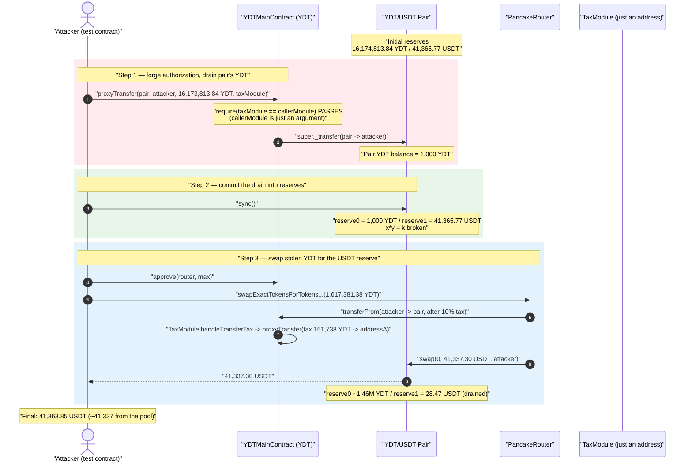
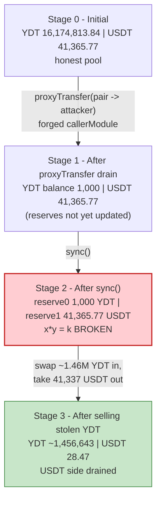
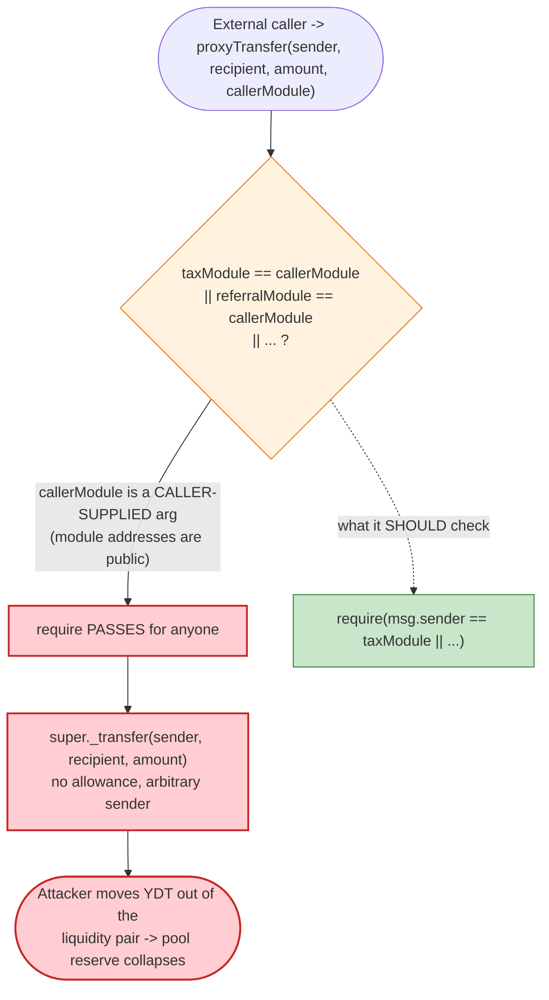

# YDT Token Exploit — Permissionless `proxyTransfer()` Drains the Liquidity Pool

> **Vulnerability classes:** vuln/access-control/missing-auth · vuln/access-control/fake-account-substitution

> One-line summary: `YDTMainContract.proxyTransfer()` authorizes the caller by comparing a **user-supplied argument** to its module addresses instead of checking `msg.sender`, so anyone can move YDT out of any account — the attacker empties the PancakeSwap pair's YDT reserve, `sync()`s it, and swaps a sliver of YDT for ~41,337 USDT of real liquidity.

> **Reproduction:** the PoC compiles & runs in an isolated Foundry project at [this project folder](.). Full verbose trace: [output.txt](output.txt). Verified vulnerable source: [contracts_YDTToken_YDTMainContract.sol](sources/YDTMainContract_3612e4/contracts_YDTToken_YDTMainContract.sol).

---

## Key info

| | |
|---|---|
| **Loss** | ~**41,337 USDT** drained from the YDT/USDT PancakeSwap pair (PoC reports a final balance of **41,363.85 USDT**, which includes ~26.5 USDT already held on the fork) |
| **Vulnerable contract** | `YDTMainContract` (YDT) — [`0x3612e4Cb34617bCac849Add27366D8D85C102eFd`](https://bscscan.com/address/0x3612e4Cb34617bCac849Add27366D8D85C102eFd#code) |
| **Victim pool** | YDT/USDT PancakeSwap V2 pair — [`0xFd13B6E1d07bAd77Dd248780d0c3d30859585242`](https://bscscan.com/address/0xFd13B6E1d07bAd77Dd248780d0c3d30859585242) |
| **Tax module (used as the fake `callerModule`)** | [`0x013E29791A23020cF0621AeCe8649c38DaAE96f0`](https://bscscan.com/address/0x013E29791A23020cF0621AeCe8649c38DaAE96f0#code) |
| **Attacker (PoC test contract)** | `0x7FA9385bE102ac3EAc297483Dd6233D62b3e1496` (Foundry default test address) |
| **Chain / block / date** | BSC / 50,273,545 / 2025-05-25 06:16:51 UTC (pair `Sync` timestamp 1748153811) |
| **Stablecoin** | USDT (BSC) `0x55d398326f99059fF775485246999027B3197955` (18 decimals) |
| **YDT decimals** | 6 |
| **Compiler** | Solidity `^0.8.13` (PoC); YDT compiled with 0.8.x |
| **Bug class** | Broken access control — caller authorization via a forgeable argument instead of `msg.sender` |

---

## TL;DR

`YDTMainContract` is a fee-on-transfer ("tax") token whose sub-modules (tax, referral, deflation, liquidity, LP-tracking) are allowed to move tokens around without re-triggering the tax/referral logic. To support that, the token exposes:

```solidity
function proxyTransfer(address sender, address recipient, uint256 amount, address callerModule) external {
    require(
        address(taxModule)       == callerModule ||
        address(referralModule)  == callerModule ||
        address(deflationModule) == callerModule ||
        address(liquidityModule) == callerModule ||
        address(lpTrackingModule)== callerModule,
        "Only sub-modules allowed"
    );
    super._transfer(sender, recipient, amount);
}
```

The `require` checks the **`callerModule` parameter** — a value the caller chooses — against the module addresses. It never checks that `msg.sender` *is* one of those modules. The module addresses are public (`getXxxModule()` view getters, and they appear in every transaction), so any external account can call `proxyTransfer(anyAccount, attacker, anyAmount, taxModuleAddress)` and pull tokens out of any address that holds YDT.

The attacker uses this to drain the YDT/USDT pair:

1. `proxyTransfer(Pair, attacker, pairYDTBalance − 1000e6, taxModule)` — moves ~16.17M YDT out of the pair, leaving exactly 1,000 YDT.
2. `Pair.sync()` — forces the pair to register its now-tiny YDT balance (1,000 YDT) as `reserve0`, while the USDT reserve (`reserve1`) stays at ~41,365 USDT. The constant-product invariant is now wildly broken in the attacker's favor.
3. Swap a small amount of the stolen YDT back into the pair through the router — buying out almost the entire 41,365 USDT reserve. Net take: ~41,337 USDT.

---

## Background — what YDT does

`YDTMainContract` ([source](sources/YDTMainContract_3612e4/contracts_YDTToken_YDTMainContract.sol)) is an OpenZeppelin-based ERC20 with a modular "tax token" architecture. Its `_transfer` override routes every (non-owner) transfer through external sub-modules:

- **ReferralModule** — `handleTransfer(...)` referral bookkeeping.
- **TaxModule** — `handleTransferTax(...)`: on a sell (recipient == pair) it charges a 10% tax and sends it to a treasury address `addressA` ([TaxModule.sol:42-49](sources/YDTMainContract_3612e4/contracts_YDTToken_TaxModule.sol#L42-L49)).
- **LPHolderTrackingModule** — `handleTransferLpTracking(...)` LP holder accounting.

Because these modules need to move YDT *without* re-entering the taxed `_transfer` path (which would recurse), the token gives them a privileged primitive: `proxyTransfer`, which calls the raw OpenZeppelin `super._transfer` and bypasses all module logic. The intended caller is, e.g., the tax module, which invokes it as:

```solidity
// TaxModule.handleTransferTax — the LEGITIMATE call site
ydtToken.proxyTransfer(sender, ydtToken.getAddressA(), tax, address(this));
//                                                            ^^^^^^^^^^^^^ passes itself
```

i.e., the tax module passes `address(this)` (its own address) as `callerModule`. The fatal mistake is that the token trusts that argument as proof of identity.

On-chain facts at the fork block (from the trace):

| Fact | Value |
|---|---|
| YDT held by the pair (`reserve0`, 6 dp) | **16,174,813.841158 YDT** |
| USDT held by the pair (`reserve1`, 18 dp) | **41,365.772361 USDT** ← the prize |
| Tax module address (the forgeable key) | `0x013E29791A23020cF0621AeCe8649c38DaAE96f0` |
| Sell tax | 10% to `addressA` `0x61Ff48b327e450a4037E02f77B511bc0187cA854` |

---

## The vulnerable code

### 1. `proxyTransfer` authorizes by argument, not `msg.sender`

[contracts_YDTToken_YDTMainContract.sol:245-263](sources/YDTMainContract_3612e4/contracts_YDTToken_YDTMainContract.sol#L245-L263):

```solidity
// 代理转账方法，允许子模块绕过税收和推荐处理
function proxyTransfer(
    address sender,
    address recipient,
    uint256 amount,
    address callerModule          // 调用方模块地址（需为子合约） — caller-supplied!
) external {
    // 校验调用者必须为子合约
    require(
        address(taxModule)        == callerModule ||
        address(referralModule)   == callerModule ||
        address(deflationModule)  == callerModule ||
        address(liquidityModule)  == callerModule ||
        address(lpTrackingModule) == callerModule,
        "Only sub-modules allowed"
    );

    // 直接调用父类转账（跳过子模块逻辑）
    super._transfer(sender, recipient, amount);   // moves anyone's YDT, no allowance
}
```

The intent (per the comment) is "the caller must be a sub-contract." But the check is `module == callerModule`, where `callerModule` is the **4th function argument**, fully controlled by whoever calls the function. There is no `require(msg.sender == address(taxModule) || ...)`. `super._transfer(sender, recipient, amount)` then moves `amount` YDT from an arbitrary `sender` with no `allowance` check.

### 2. The legitimate call site shows the intended trust model

[contracts_YDTToken_TaxModule.sol:42-50](sources/YDTMainContract_3612e4/contracts_YDTToken_TaxModule.sol#L42-L50):

```solidity
if (recipient == pancakePair) {
    // 收取10%的卖出税给A地址
    uint256 tax = amount.mul(100).div(1000);
    uint256 amountAfterTax = amount.sub(tax);
    uint256 senderBalance = ydtToken.balanceOf(sender);
    if (amount > 0 && senderBalance >= amount) {
        console.log("proxyTransfer.start");
        ydtToken.proxyTransfer(sender, ydtToken.getAddressA(), tax, address(this)); // passes itself
        console.log("proxyTransfer.end");
    }
    return amountAfterTax;
}
```

Note that `handleTransferTax` itself *is* properly guarded (`onlyAuthorizedCaller`, callable only by the token). The developers protected the module but left the privileged primitive `proxyTransfer` it relies on wide open — anyone can replicate the `(…, address(this))` pattern by literally typing the tax module's known address.

### 3. The owner bypass confirms `proxyTransfer` is the only "raw move" needed

[contracts_YDTToken_YDTMainContract.sol:206-214](sources/YDTMainContract_3612e4/contracts_YDTToken_YDTMainContract.sol#L206-L214) shows that the only entity allowed to do an untaxed/raw move is the owner — every other transfer is taxed. `proxyTransfer` accidentally hands that same raw-move power to the public.

---

## Root cause — why it was possible

A standard access-control rule: **authenticate the *caller*, not a value the caller hands you.** The classic safe pattern is `require(msg.sender == trustedAddress)`. YDT instead wrote `require(trustedAddress == callerModule)` where `callerModule` is an argument. Since the trusted module addresses are public knowledge, the predicate is trivially satisfiable by any attacker, collapsing the access control to "no access control."

Concretely, the bug composes into a critical loss because of three facts:

1. **Forgeable authorization.** `proxyTransfer` can be called by anyone who passes a known module address as `callerModule`.
2. **No allowance / no balance ownership check on `sender`.** `super._transfer(sender, …)` moves tokens out of an *arbitrary* `sender`, so the attacker can target the liquidity pool (which holds the bulk of YDT) rather than just their own balance.
3. **AMM reserves are derived from balance + `sync()`.** Once the pair's YDT balance is drained, a permissionless `Pair.sync()` writes the depleted balance into the official reserves, breaking `x·y = k`. The attacker then trades the stolen YDT back in to extract the untouched USDT reserve.

This is a textbook "approve/transferFrom bypass" elevated to a pool drain because the privileged transfer can name any source account.

---

## Preconditions

- The YDT token must hold the buggy `proxyTransfer` and have its sub-module addresses set (they are public via getters and visible in any tx) — true at the fork block.
- A YDT/USDT (or YDT/anything-of-value) pool with meaningful liquidity exists — the pair held ~41,365 USDT.
- The attacker needs **no capital, no flash loan, and no prior token holdings** — the YDT used to swap out the USDT is itself stolen from the pair via `proxyTransfer`. (The PoC's reported profit includes ~26.5 USDT that happened to be on the test address on the fork; the exploit-attributable take is the ~41,337 USDT pulled from the pool.)

---

## Step-by-step attack walkthrough (with on-chain numbers from the trace)

The pair's `token0 = YDT` (6 dp), `token1 = USDT` (18 dp), so `reserve0 = YDT`, `reserve1 = USDT`. All figures are taken directly from [output.txt](output.txt) (`Sync`/`Swap` events and `balanceOf`/`getReserves` returns).

| # | Step (PoC line) | Call | YDT in pair | USDT in pair | Effect |
|---|---|---|---:|---:|---|
| 0 | Initial | `balanceOf(pair)` → 16,174,813.841158 YDT | 16,174,813.84 | 41,365.77 | Honest pool. |
| 1 | [test L27](test/YDTtoken_exp.sol#L27) | `proxyTransfer(pair, attacker, 16,173,813.841158 YDT, taxModule)` | **1,000.00** | 41,365.77 | ~16.17M YDT stolen straight out of the pair; balance left = exactly 1,000 YDT (`amount − 1000·1e6`). |
| 2 | [test L29](test/YDTtoken_exp.sol#L29) | `Pair.sync()` → `Sync(reserve0=1,000 YDT, reserve1=41,365.77 USDT)` | 1,000.00 | 41,365.77 | Reserves now reflect the drained YDT balance. **Invariant broken.** |
| 3 | [test L34-40](test/YDTtoken_exp.sol#L34-L40) | `swapExactTokensForTokensSupportingFeeOnTransferTokens(1,617,381.384115 YDT, 0, [YDT,USDT], attacker)` | — | — | Attacker sells 1/10 of its stolen YDT. |
| 3a | (inside swap) | TaxModule charges 10% via `proxyTransfer(attacker, addressA, 161,738.138411 YDT, taxModule)` | — | — | 161,738 YDT goes to treasury `addressA`. |
| 3b | (inside swap) | `transferFrom` delivers 1,455,643.245704 YDT to pair; `Pair.swap(0, 41,337.303225 USDT, attacker)` | 1,456,643.25 | **28.47** | Pair pays out **41,337.30 USDT** for ~1.46M YDT against a 1,000-YDT reserve. |
| 4 | [test L43](test/YDTtoken_exp.sol#L43) | `balanceOf(attacker)` in USDT | — | — | Final attacker USDT = **41,363.845387** (≈26.54 pre-existing + 41,337.30 drained). |

The pair's USDT reserve fell from **41,365.77 → 28.47 USDT**, i.e. **41,337.30 USDT extracted** — the realized loss. The attacker still holds ~14.56M stolen YDT (90% of the original pair balance) and the unsold remainder, but its value is near-zero once the pool is destroyed.

### Why one tiny YDT sell drains the USDT side

After step 2 the pair holds only 1,000 YDT against 41,365 USDT. PancakeSwap prices off reserves, so YDT is now valued absurdly high inside the pool. Selling ~1.46M YDT (against a 1,000-YDT reserve) buys essentially the entire USDT reserve: `out = (in·9975·reserveUSDT)/(reserveYDT·10000 + in·9975)`, and with `in ≫ reserveYDT` the output approaches the full `reserveUSDT`.

### Profit / loss accounting

| Direction | Amount |
|---|---:|
| Capital required (flash loan / own funds) | **0** |
| YDT stolen from pair (via `proxyTransfer`) | 16,173,813.841158 YDT |
| YDT used to buy out the pool (1/10 of holdings) | 1,617,381.384115 YDT |
| USDT in pair before final swap (reserve1) | 41,365.772361 |
| USDT in pair after final swap (reserve1) | 28.469136 |
| **USDT drained from pool (loss)** | **41,337.303225** |
| Attacker final USDT balance (PoC `Profit in`) | 41,363.845387 |
| Attacker leftover stolen YDT (value ≈ 0) | ~14.56M YDT |

---

## Diagrams

### Sequence of the attack



### Pool state evolution



### The flaw inside `proxyTransfer`



---

## Remediation

1. **Authenticate `msg.sender`, never an argument.** Remove the `callerModule` parameter entirely and gate on the actual caller:
   ```solidity
   function proxyTransfer(address sender, address recipient, uint256 amount) external {
       require(
           msg.sender == address(taxModule)        ||
           msg.sender == address(referralModule)   ||
           msg.sender == address(deflationModule)  ||
           msg.sender == address(liquidityModule)  ||
           msg.sender == address(lpTrackingModule),
           "Only sub-modules allowed"
       );
       super._transfer(sender, recipient, amount);
   }
   ```
   This single change makes the forgery impossible — an attacker cannot make `msg.sender` equal a contract they do not control.

2. **Prefer a modifier / role.** Introduce an `onlyModule` modifier or an OpenZeppelin `AccessControl` `MODULE_ROLE` and apply it to every privileged primitive, so the pattern is centralized and audited once.

3. **Constrain what `proxyTransfer` may do.** Even for genuine modules, consider restricting the `sender`/`recipient` set (e.g., only move *from the module itself* or only the taxed amount) so a single compromised/buggy module cannot move arbitrary third-party balances, including the pool's.

4. **Defense-in-depth on AMM interaction.** Tokens whose balances can be moved by privileged code should not let that code touch the AMM pair's balance, since `sync()` will convert any such change into an exploitable reserve mismatch.

---

## How to reproduce

The PoC was extracted into a standalone Foundry project (the umbrella DeFiHackLabs repo has many unrelated PoCs that fail to compile under a whole-project `forge test`):

```bash
_shared/run_poc.sh 2025-05-YDTtoken_exp -vvvvv
```

- RPC: a **BSC archive** endpoint is required (fork block 50,273,545). `foundry.toml` uses `https://bsc-mainnet.public.blastapi.io`, which serves historical state at that block; most public BSC RPCs prune it and fail with `header not found` / `missing trie node`.
- Result: `[PASS] testExploit()` with `Profit in : 41363.845386954430366587`.

Expected tail:

```
Ran 1 test for test/YDTtoken_exp.sol:ContractTest
[PASS] testExploit() (gas: 315535)
Logs:
  ...
  Profit in : 41363.845386954430366587

Suite result: ok. 1 passed; 0 failed; 0 skipped
```

---

*Bug class: broken access control (caller authorization via a forgeable argument). Vulnerable primitive: `YDTMainContract.proxyTransfer(address,address,uint256,address)` — selector `0xec22f4c7`.*
