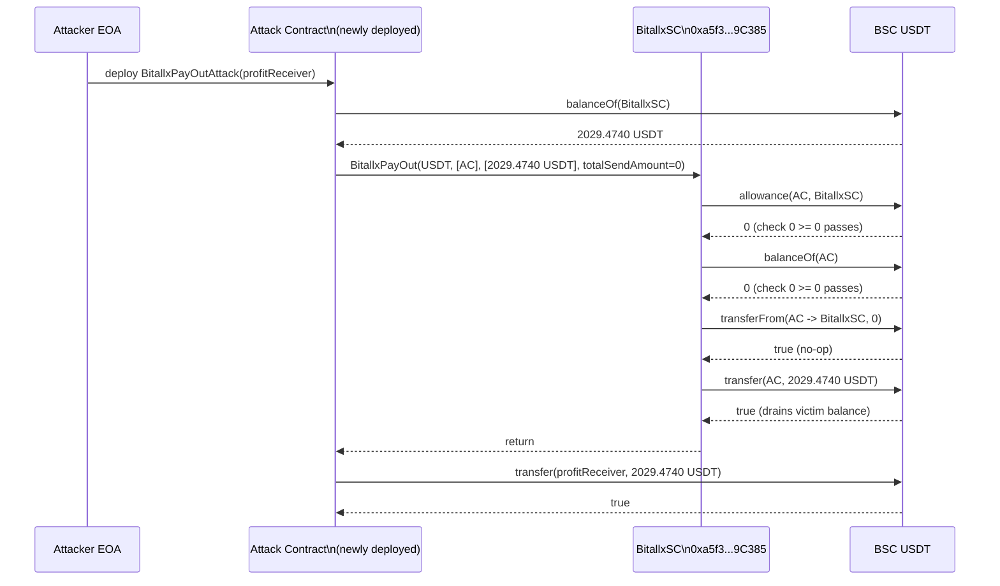
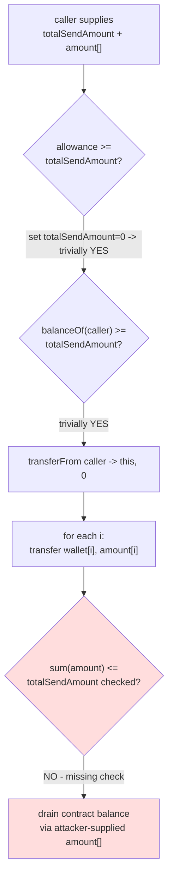

# BitallxSC payout-array bypass drains victim USDT balance — public `BitallxPayOut` validates only `totalSendAmount`, never `sum(amount[])`

> **Vulnerability classes:** vuln/access-control/missing-auth · vuln/logic/missing-validation · vuln/logic/missing-check
> **Reproduction:** the PoC compiles & runs in an isolated Foundry project at [this project folder](.). Full verbose trace: [output.txt](output.txt). Verified BSC contract source fetched from BscScan into [sources/BitallxSC_a5f372/BitallxSC.sol](sources/BitallxSC_a5f372/BitallxSC.sol) (compiler `v0.8.30+commit.73712a01`, optimizer enabled, runs=200).

---

## Key info

| | |
|---|---|
| **Loss** | 2,029.47 USDT (`2,029,473,999,999,999,986,000` wei) — full victim contract balance [output.txt:1565] |
| **Vulnerable contract** | `BitallxSC` — [`0xa5f3728767F834C591eE99C8C5854b752F39C385`](https://bscscan.com/address/0xa5f3728767F834C591eE99C8C5854b752F39C385#code) |
| **Attacker EOA** | [`0xF499F7a82De632CFd194025A51C88d1b44C8155e`](https://bscscan.com/address/0xF499F7a82De632CFd194025A51C88d1b44C8155e) |
| **Attack contract** | [`0x81e631FaC80CdaC59b1A5BBC5667AaaCB238965F`](https://bscscan.com/address/0x81e631FaC80CdaC59b1A5BBC5667AaaCB238965F) |
| **Attack tx** | [`0x1fe893e4d8370a8d6da590b32f66bd032217bac2e56bd2bf0de2a9df9c7117dd`](https://bscscan.com/tx/0x1fe893e4d8370a8d6da590b32f66bd032217bac2e56bd2bf0de2a9df9c7117dd) |
| **Chain / block / date** | BNB Chain (BSC) / fork block `49,758,338` / May 2025 |
| **Compiler** | `v0.8.30+commit.73712a01`, optimizer=1, runs=200 (per `_meta.json`) |
| **Bug class** | A public, unguarded payout function checks token allowance/balance only against `totalSendAmount` but never checks that the per-recipient `amount[]` sums are bounded by `totalSendAmount`, so `totalSendAmount=0` passes every guard while `transfer` in the loop pays out arbitrary amounts out of the contract's own holdings. |

## TL;DR

`BitallxSC` is a small BSC rewards/payout contract holding ~2,029.47 USDT in treasury. It exposes a function `BitallxPayOut(tokencontract, wallet[], amount[], totalSendAmount)` that is supposed to take `totalSendAmount` tokens **from** `msg.sender` (via `transferFrom`) and then distribute them to the `wallet[]` recipients according to `amount[]`.

The function performs three checks — array length match, `allowance(msg.sender, this) >= totalSendAmount`, and `balanceOf(msg.sender) >= totalSendAmount` — and then calls `transferFrom(msg.sender, this, totalSendAmount)` followed by a `for` loop that calls `transfer(wallet[i], amount[i])`. **Critically, the loop uses `amount[i]`, not `totalSendAmount`, and there is no check that `sum(amount[i]) <= totalSendAmount`** (nor any check that the payout is funded by what was just pulled in). The two amounts are completely decoupled.

The attacker exploited this by deploying a contract that calls `BitallxPayOut(USDT, [attackContract], [victimBalance], 0)`. With `totalSendAmount=0`, the allowance check (`0 >= 0`) and balance check (`0 >= 0`) both pass, `transferFrom` moves zero tokens, and the loop then `transfer`s the victim contract's entire USDT balance to the attack contract. The PoC shows the victim balance going from `2,029,473,999,999,999,986,000` (`2029.4740 USDT`) to `0`, and the attacker going from `0` to `2029.4740 USDT` [output.txt:1564-1565]. The attack is single-transaction, permissionless, requires no flash loan, and no privileged role.

## Background — what BitallxSC does

`BitallxSC` is a thin BEP-20 payout/treasury contract. Its storage consists of a reference to the BSC USDT token (`0x55d398326f99059fF775485246999027B3197955`), reward min/max limits (`0` and `100 ether`), and an `Ownable`-style owner/publisher pair [sources/BitallxSC_a5f372/BitallxSC.sol].

It is intended to provide three token-movement entry points:

1. **`BitallxPayOut(tokencontract, wallet[], amount[], totalSendAmount)`** — a generic batch-payout helper. The intended flow: a caller authorizes the contract to spend `totalSendAmount` of `tokencontract`, the contract pulls that exact total **from the caller** via `transferFrom`, and then redistributes it across `wallet[]`/`amount[]`. It has **no access-control modifier** — it is callable by anyone.
2. **`claimReward(wallet, amount)`** — a `onlyPublisher` reward faucet bounded by the min/max reward limits and the contract balance.
3. **`verifyCTreasury(tokencontract, wallet, amount)`** — an `onlyOwner` sweep that transfers an arbitrary amount of an arbitrary token to an arbitrary wallet.

The contract's treasury (the 2,029.47 USDT) sits idle, intended to back reward claims and payouts. The fatal assumption is that `BitallxPayOut` is "deposit-then-distribute": that the funds it pays out are exactly the funds it just pulled in from `msg.sender`. Nothing in the code enforces that.

## The vulnerable code

From the verified source [sources/BitallxSC_a5f372/BitallxSC.sol]:

```solidity
function BitallxPayOut(
    address tokencontract,
    address[] calldata wallet,
    uint256[] calldata amount,
    uint256 totalSendAmount
) external {
    require(wallet.length == amount.length, "The length of 2 arrays should be the same");

    uint256 allowance = IBEP20(tokencontract).allowance(msg.sender, address(this));
    require(allowance >= totalSendAmount, "Insufficient token allowance");

    uint256 balance = IBEP20(tokencontract).balanceOf(msg.sender);
    require(balance >= totalSendAmount, "Insufficient balance in sender wallet");

    IBEP20(tokencontract).transferFrom(msg.sender, address(this), totalSendAmount);

    for (uint256 i = 0; i < wallet.length; i++) {
        IBEP20(tokencontract).transfer(wallet[i], amount[i]);
    }
}
```

### The decoupled `totalSendAmount` vs `amount[]`

The two guarded quantities — `allowance` and `balance` — are checked against `totalSendAmount`, and `transferFrom` pulls in exactly `totalSendAmount`. But the payout loop pays out `amount[i]` per recipient. **There is no `require(sum(amount) <= totalSendAmount)`, no `require(sum(amount) <= this.balance)`, and no accounting that ties the outflow to the inflow.** Setting `totalSendAmount = 0` satisfies both `>=` checks trivially (any `uint256 >= 0`), performs a no-op `transferFrom`, and then the loop disperses `sum(amount)` taken straight from the contract's own balance.

### No access control

`BitallxPayOut` carries no `onlyOwner`/`onlyPublisher`/`onlyRole` modifier. Any externally owned account or contract can call it. The function's only "auth-like" check (allowance from `msg.sender`) is in fact the attacker's own allowance *to* the contract — which the attacker controls and which is meaningless when `totalSendAmount = 0`.

### The return value of `transfer` is also unchecked

The `transfer(wallet[i], amount[i])` call ignores the boolean return value. (USDT/BEP-20 on BSC returns a bool and does not revert on failure, but this is a secondary issue; it is not what the exploit relied on.) The same pattern repeats in `claimReward` and `verifyCTreasury`.

## Root cause — why it was possible

1. **Missing sum-validation invariant.** The fundamental invariant of a "deposit-then-distribute" function — that `sum(amount[i])` must not exceed the `totalSendAmount` actually deposited — is never asserted. The deposit and the distribution are two unrelated token movements that share no enforced relationship.
2. **Missing access control.** `BitallxPayOut` is `external` with no modifier, so the untrusted caller fully controls all four parameters including `tokencontract`, `wallet[]`, `amount[]`, and `totalSendAmount`.
3. **Zero-as-bypass value.** Because the two guards use `>=` against a caller-supplied `totalSendAmount`, supplying `0` makes every guard vacuously true while the `amount[]` array carries the real (non-zero) drain. The validation is structurally gameable.
4. **Self-funded payout out of the contract's own balance.** The loop's `transfer` is issued from the contract and pays out of the contract's own token balance — not out of the freshly `transferFrom`'d tokens in any tracked sub-account. There is no per-call ledger separating "deposited this call" funds from "treasury" funds.
5. **Unchecked `transfer` return values** compound the issue (silent failure on non-reverting BEP-20s) but are not the primary cause of this drain.

## Preconditions

- **Permissionless.** No privileged role, no allowance from the victim, no deposit, no flash loan needed. Any BSC account/contract can call `BitallxPayOut`.
- The victim contract must hold a non-zero balance of the target token (here, ~2,029.47 USDT). The attacker reads `balanceOf(BitallxSC)` at runtime and sets `amount[0]` to exactly that value.
- The target token (`tokencontract`) is also attacker-supplied, so any BEP-20 the contract holds can be drained via the same path (USDT here; any other balance the contract keeps is equally exposed).

## Attack walkthrough (with on-chain numbers from the trace)

Setup / starting state (fork block `49,758,338`):

| Account | USDT balance |
|---|---|
| `profitReceiver` (attacker proxy) | `0` [output.txt:1564] |
| `BitallxSC` (victim) | `2,029,473,999,999,999,986,000` (≈ 2,029.4740 USDT) [output.txt:1564-1565, trace balanceOf] |

Steps (PoC `BitallxPayOutAttack` constructor, single transaction):

1. **Read victim balance.** `USDT.balanceOf(BitallxSC)` → `2,029,473,999,999,999,986,000` [output.txt trace, `BitallxPayOutAttack` constructor `balanceOf(BitallxSC)`].
2. **Build arrays.** `wallets = [address(this)]` (the attack contract itself); `amounts = [2,029,473,999,999,999,986,000]`.
3. **Call `BitallxPayOut(USDT, wallets, amounts, 0)`** [output.txt trace, `BitallxSC::BitallxPayOut(..., 0)`].
   - Inside `BitallxPayOut`:
     - `allowance(attackContract, BitallxSC)` → `0`; check `0 >= 0` ✅ [output.txt trace `allowance ... ← [Return] 0`].
     - `balanceOf(attackContract)` → `0`; check `0 >= 0` ✅ [output.txt trace `balanceOf ... ← [Return] 0`].
     - `transferFrom(attackContract → BitallxSC, 0)` → emits a `Transfer(…, value: 0)` and `Approval(... value: 0)`, returns `true` [output.txt trace `transferFrom ... value: 0`].
     - Loop iteration 0: `transfer(attackContract, 2,029,473,999,999,999,986,000)` → emits `Transfer(from: BitallxSC, to: attackContract, value: 2,029,473,999,999,999,986,000)`, returns `true`; victim storage balance slot drops to `0` [output.txt trace `transfer ... value: 2029473999999999986000` and the two storage-change rows].
4. **Forward profit.** Attack contract `transfer(profitReceiver, 2,029,473,999,999,999,986,000)` → `Transfer(from: attackContract, to: profitReceiver, value: 2,029,473,999,999,999,986,000)` [output.txt trace].

End state:

| Account | USDT balance |
|---|---|
| `profitReceiver` (attacker) | `2,029,473,999,999,999,986,000` (≈ 2,029.4740 USDT) [output.txt:1565] |
| `BitallxSC` (victim) | `0` [output.txt trace final `balanceOf(BitallxSC) ← [Return] 0`, asserted] |

**Profit & loss accounting:**

- Attacker inflow: **+2,029.4740 USDT**
- Attacker outflow (gas / deposit): 0 USDT deposited; only BNB gas for one tx
- Victim loss: **-2,029.4740 USDT** (the contract's entire USDT balance)
- Net profit: **≈ 2,029.47 USDT**

## Diagrams

Attack sequence (single transaction):



Flaw control-flow:



## Remediation

1. **Bound the payout by the deposit.** Compute `sumAmount` in a loop and require it before any transfer:
   ```solidity
   uint256 sumAmount;
   for (uint256 i = 0; i < amount.length; i++) {
       sumAmount += amount[i];            // unchecked-add safe with later check
   }
   require(sumAmount == totalSendAmount, "payout must equal deposit"); // or <= if rounding intended
   require(wallet.length == amount.length, "...");
   ```
   Place this **before** the `transferFrom`, so the function can never pay out more than it pulls in.
2. **Add access control.** Restrict `BitallxPayOut` to the owner/publisher (or a dedicated operator role): add `onlyOwner` (or `onlyPublisher`) to the function signature. A generic batch-transfer that pays out of the caller's own deposit can stay open, but it must then pay only out of freshly-deposited funds.
3. **Do not pay out of the contract's general balance.** If the intent is "caller funds the distribution," pull `sumAmount` from the caller (`transferFrom(msg.sender, address(this), sumAmount)`) and then pay exactly `sumAmount` out — never reference the contract's pre-existing treasury. If the intent is "owner distributes treasury," gate it behind `onlyOwner` and keep it as a separate function.
4. **Validate `tokencontract`.** Either hard-code the allowed payout token (the contract already stores `BSCUSDTTokenContract`) or maintain an allowlist. Letting the caller choose any token means any asset the contract holds is exposed through this same path.
5. **Check `transfer`/`transferFrom` return values** (use `SafeERC20.safeTransfer`/`safeTransferFrom`) for USDT-style BEP-20s that return `false` instead of reverting. This prevents silent failures and is good hygiene even after the primary fix.
6. **Re-deploy** rather than upgrading in place; this contract has no proxy and no upgrade mechanism (`proxy: 0` per `_meta.json`). Any funds remaining must be secured first via the `verifyCTreasury` (owner) path before redeployment.

## How to reproduce

The PoC runs **fully offline** via the shared anvil harness, replaying from the committed `anvil_state.json` (no RPC needed). From the registry root:

```bash
_shared/run_poc.sh 2025-05-bitallx_exp -vvvvv
```

- **Chain / fork block:** BNB Chain (BSC), block `49,758,338`.
- **Expected outcome:** `[PASS]` (see [output.txt:1562]). The final log lines should read:
  - `Attacker Before exploit USDT Balance: 0.000000000000000000` [output.txt:1564]
  - `Attacker After exploit USDT Balance: 2029.473999999999986000` [output.txt:1565]
- The PoC additionally asserts `BitallxSC` USDT balance goes to `0` and `profitReceiver` receives the full `2,029,473,999,999,999,986,000` wei (both `assertEq` checks in the trace pass). The local fork run passes — the on-chain tx is reproduced identically.

*Reference: https://t.me/defimon_alerts/1065 (alert cited in the PoC `@Analysis`).*
