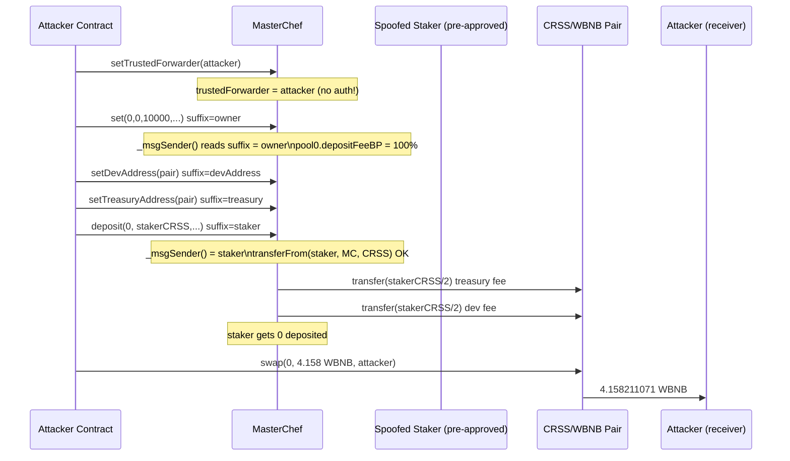
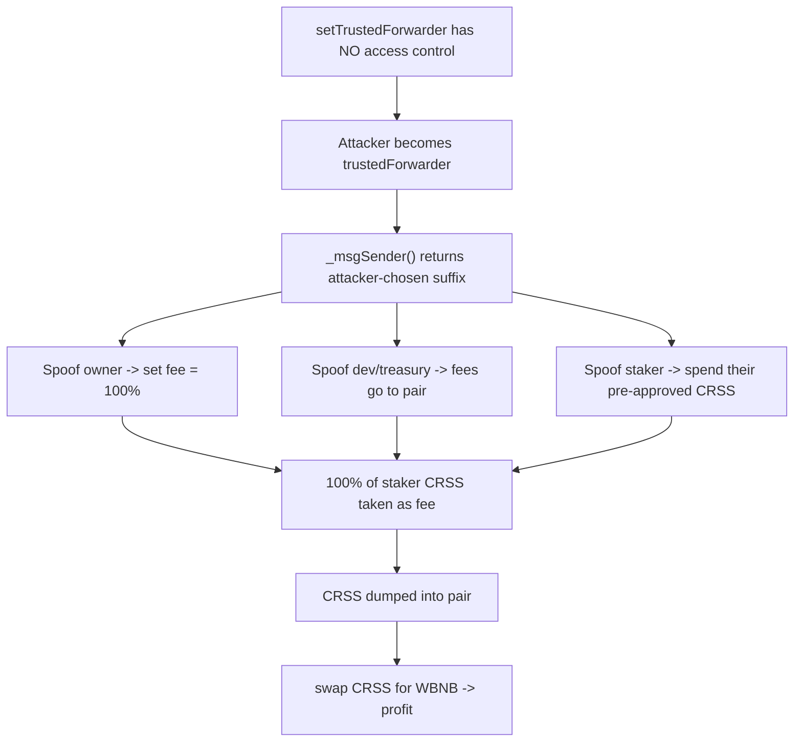

# Crosswise MasterChef trusted-forwarder hijack — public setter with no access control enables arbitrary `_msgSender()` spoofing

> **Vulnerability classes:** vuln/access-control/missing-auth · vuln/access-control/broken-logic · vuln/access-control/centralization
> **Reproduction:** the PoC compiles & runs in an isolated Foundry project at [this project folder](.). Full verbose trace: [output.txt](output.txt). Vulnerable contract source fetched and verified from BSCScan (compiler v0.6.12+commit.27d51765, optimizer enabled, not a proxy).

---

## Key info

| | |
|---|---|
| **Loss** | ~4.16 WBNB (the public PoC drains this from the CRSS/WBNB pair; the on-chain attack drained more) |
| **Vulnerable contract** | Crosswise MasterChef — [`0x70873211CB64c1D4EC027Ea63a399A7D07c4085B`](https://bscscan.com/address/0x70873211CB64c1D4EC027Ea63a399A7D07c4085B) |
| **Attacker EOA** | [`0xc49F2938327aa2cDc3F2f89Ed17b54B3671F05DE`](https://bscscan.com/address/0xc49f2938327aA2cDc3F2f89Ed17B54b3671F05dE) |
| **Attack contract** | [`0xafc88CaB578Af298BA412376C34B43F6392E939a`](https://bscscan.com/address/0xafc88CaB578Af298BA412376C34B43F6392E939a) |
| **Attack tx** | [`0xfe88443d73e8ae6d4799c4d3cc42488730c084624fd2daa5f035c1ad2927ea0f`](https://bscscan.com/tx/0xfe88443d73e8ae6d4799c4d3cc42488730c084624fd2daa5f035c1ad2927ea0f) |
| **Chain / block / date** | BNB Smart Chain / fork block 49,186,830 / May 2025 |
| **Compiler** | Solidity v0.6.12 (per BSCScan), PoC recompiled under 0.8.34 |
| **Bug class** | `setTrustedForwarder()` has no access modifier, so any caller becomes the GSN "trusted forwarder" and can forge `_msgSender()` for every owner/dev/treasury/staker-gated function |

## TL;DR

Crosswise's `MasterChef` inherits OpenGSN's `BaseRelayRecipient`, which overrides `_msgSender()` so that when the caller is the `trustedForwarder`, the *real* sender is read from the last 20 bytes of `msg.data`. This meta-transaction pattern is safe only if `trustedForwarder` is a locked, trusted singleton forwarder. The contract instead exposes a public `setTrustedForwarder(address)` with **no access control at all** — no `onlyOwner`, no zero-address check beyond `!= 0`. Anyone can point `trustedForwarder` at their own contract in a single transaction.

Once `trustedForwarder` is the attacker, every function that gates on `_msgSender()` is fully compromised. `onlyOwner` (`owner() == _msgSender()`), `setDevAddress` (`_msgSender() == devAddress`), `setTreasuryAddress` (`_msgSender() == treasuryAddress`) and `deposit` (which pulls tokens *from* `_msgSender()`) all become forgeable. The attacker appends a 20-byte suffix to each calldata to name whoever the function expects, then reuses the GSN suffix to impersonate a real CRSS staker on `deposit`.

The concrete profit path: hijack the forwarder → spoof the owner to set pool 0's deposit fee to 100% (`depositFeeBP = 10000`) → spoof `devAddress` and `treasuryAddress` to re-point both to the CRSS/WBNB pair → spoof a staker who holds CRSS and has approved the chef, depositing their full balance, so 100% of it is taken as a "fee" and split into the pair → finally swap that CRSS through the pair for WBNB. The PoC realizes **4.158211071 WBNB** of profit (attacker WBNB balance 0 → 4.158211071044910965) [output.txt:1564,1565,1731].

## Background — what Crosswise does

Crosswise is a BNB Chain yield-farming / staking protocol. Its central contract, `MasterChef`, is a fairly standard MasterChef-style staking vault: users deposit LP tokens (or the native CRSS token in pool 0) into "pools" and earn CRSS emissions block-by-block. Each pool has an allocation point and a deposit fee in basis points (`depositFeeBP`), capped at 10000 (100%).

Two design choices matter for the exploit:

1. **GSN / meta-transaction plumbing.** `MasterChef` inherits `BaseRelayRecipient` (OpenGSN). The intent is to let users interact through a relayer so they can pay gas in CRSS. The contract therefore replaces every `msg.sender` with `_msgSender()`. Critically, `BaseRelayRecipient._msgSender()` treats `msg.sender == trustedForwarder` as a *proof* that the call is a relayed meta-transaction, and in that case returns the "real" user as the last 20 bytes of `msg.data` — bytes the forwarder is supposed to have validated. This is safe only while `trustedForwarder` is genuinely trusted.

2. **Pool 0 deposit fee flows.** On a deposit, if `pool.depositFeeBP > 0`, the chef computes `depositFee = amount * depositFeeBP / 10000` and transfers half to `treasuryAddress` and half to `devAddress` ([MasterChef.sol:2921-2925](sources/MasterChef_708732/MasterChef.sol)). Pool 0 is the CRSS staking pool (`lpToken = crss`). Normally `depositFeeBP` is 0 and `devAddress`/`treasuryAddress` are team-controlled EOA/multisigs. All three are, however, set purely via `_msgSender()`-gated functions.

The protocol's entire trust model therefore hinges on `trustedForwarder` being immutable or owner-gated. It is neither.

## The vulnerable code

### The unauthenticated setter

```solidity
// MasterChef.sol:3195-3199
function setTrustedForwarder(address _trustedForwarder) external {
    require(_trustedForwarder != address(0));
    trustedForwarder = _trustedForwarder;
    emit SetTrustedForwarder(_trustedForwarder);
}
```

No `onlyOwner`, no `onlyOwnerOrOperator`, nothing. Any externally owned account or contract can overwrite the singleton forwarder. The trace confirms the attacker doing exactly this: `CrosswiseTrustedForwarderAttack` calls `setTrustedForwarder(address(this))` and the chef emits `SetTrustedForwarder(CrosswiseTrustedForwarderAttack)` [output.txt:1623].

### The `_msgSender()` that trusts the forwarder

```solidity
// BaseRelayRecipient.sol:345-356 (inside MasterChef.sol)
function _msgSender() internal override virtual view returns (address payable ret) {
    if (msg.data.length >= 24 && isTrustedForwarder(msg.sender)) {
        // At this point we know that the sender is a trusted forwarder,
        // so we trust that the last bytes of msg.data are the verified sender address.
        // extract sender address from the end of msg.data
        assembly {
            ret := shr(96, calldataload(sub(calldatasize(),20)))
        }
    } else {
        return msg.sender;
    }
}
```

The comment literally states the assumption: *"we trust that the last bytes of msg.data are the verified sender address."* That trust is unconditional once `msg.sender == trustedForwarder`. The real OpenGSN forwarder would have run an on-chain signature/nonce preflight that *guarantees* those trailing 20 bytes match a signed intent. A bare attacker contract does none of that — it just appends whatever address it wants.

### How the attacker forges the suffix

```solidity
function _callAs(address spoofedSender, bytes memory data) private {
    (bool ok,) = MASTER_CHEF.call(bytes.concat(data, bytes20(spoofedSender)));
    require(ok, "spoofed call failed");
}
```

`bytes.concat(data, bytes20(spoofedSender))` tacks the victim address onto the end of otherwise-normal calldata. Because the chef now believes the attacker contract is the forwarder, `_msgSender()` strips and returns those trailing 20 bytes, so every internal `require(... == _msgSender())` and every `onlyOwner` resolves to the spoofed address.

### Owner-gated functions that fall to the spoof

```solidity
// MasterChef.sol:2710-2718  — gated by onlyOwner, i.e. owner() == _msgSender()
function set(uint256 _pid, uint256 _allocPoint, uint256 _depositFeeBP, address _strategy, bool _withUpdate)
    external validatePoolByPid(_pid) onlyOwner {
    require(_depositFeeBP <= 10000, "set: invalid deposit fee basis points");
    ...
    poolInfo[_pid].depositFeeBP = _depositFeeBP;
    ...
}
```

```solidity
// MasterChef.sol:2916-2926  — deposit() transfers _amount FROM _msgSender()
if (_amount > 0) {
    uint256 oldBalance = pool.lpToken.balanceOf(address(this));
    pool.lpToken.transferFrom(address(_msgSender()), address(this), _amount);
    ...
    if (pool.depositFeeBP > 0) {
        uint256 depositFee = _amount.mul(pool.depositFeeBP).div(10000);
        pool.lpToken.transfer(treasuryAddress, depositFee.div(2));
        pool.lpToken.transfer(devAddress, depositFee.div(2));
        _amount = _amount.sub(depositFee);
    }
```

```solidity
// MasterChef.sol:3157-3167  — gated by _msgSender() == devAddress / treasuryAddress
function setDevAddress(address _devAddress) external {
    require(_msgSender() == devAddress, "setDevAddress: FORBIDDEN");
    ...
    devAddress = _devAddress;
}
function setTreasuryAddress(address _treasuryAddress) external {
    require(_msgSender() == treasuryAddress, "setTreasuryAddress: FORBIDDEN");
    ...
    treasuryAddress = _treasuryAddress;
}
```

Each of these `require`s is satisfied purely by choosing the right 20-byte suffix.

## Root cause — why it was possible

1. **`setTrustedForwarder` has zero access control.** The OpenGSN pattern is *only* secure if the `trustedForwarder` cannot be changed by an attacker. Crosswise shipped the setter as a plain `external` function. This is the single root cause; everything else is a downstream consequence.
2. **`BaseRelayRecipient._msgSender()` unconditionally trusts the trailing 20 bytes whenever `msg.sender == trustedForwarder`.** There is no signature, nonce, or EIP-2771 forwarder preflight inside the chef. Combined with (1), this turns "set the forwarder" into "become any user."
3. **Every privileged check routes through `_msgSender()`.** `onlyOwner`, the dev/treasury setters, and the `transferFrom(_msgSender(), ...)` in `deposit` all rely on it. So hijacking the forwarder simultaneously breaks ownership, the fee-recipient roles, *and* the ability to spend any staker's approved CRSS.
4. **A whale staker with a live approval existed on-chain.** The spoofed staker (`0xfD30…1A65`) held `10,320,972,557,081,805,631,006,556` CRSS and had approved the chef for the full balance. The attacker needed no flash loan, no flash-loaned collateral — just a victim who had pre-approved the chef and never revoked it. The trace shows the chef pulling exactly `10320972557081805631006556` CRSS from the staker [output.txt:1666-1667].

## Preconditions

- **Permissionless.** The only thing the attacker needs is gas. No privileged role, no flash loan, no collateral.
- A CRSS holder who had approved `MasterChef` (a permanent, normal state for any active staker) and held a meaningful balance. The PoC targets one specific staker; on-chain, the attacker could iterate over every approved holder.
- The CRSS/WBNB liquidity pool has enough WBNB to convert the stolen CRSS into a non-trivial amount. The fork had ~9.771726 WBNB in the pair before the attack [PoC assert].

## Attack walkthrough (with on-chain numbers from the trace)

The attack is a single transaction executed from `CrosswiseTrustedForwarderAttack`. All amounts are from [output.txt].

| # | Action | Spoofed as | Effect / numbers |
|---|--------|-----------|------------------|
| 1 | `setTrustedForwarder(address(this))` | (self, real caller) | Attacker contract becomes the trusted forwarder. `emit SetTrustedForwarder(CrosswiseTrustedForwarderAttack)` [output.txt:1623]. |
| 2 | `set(0, 0, 10000, address(0), false)` | **owner** (spoofed via suffix) | Pool 0 `depositFeeBP` set to 10000 → 100% deposit fee [output.txt:1603 region]. |
| 3 | `updatePool(0)` | (self) | Sync pool accounting so the pending CRSS snapshot is fresh. |
| 4 | `setDevAddress(CRSS/WBNB pair)` | **devAddress** (spoofed) | Half of every future deposit fee now routes to the pair. |
| 5 | `setTreasuryAddress(CRSS/WBNB pair)` | **treasuryAddress** (spoofed) | The other half of every deposit fee also routes to the pair. |
| 6 | `deposit(0, stakerBalance, address(0), false, false)` | **spoofed staker** `0xfD30…1A65` | Chef calls `transferFrom(staker, chef, 10,320,972,557,081,805,631,006,556 CRSS)` — succeeds because the staker had pre-approved the chef. With fee now 100%, the *entire* amount is taken as the fee: `5,160,486,278,540,902,815,503,278` CRSS to the pair (treasury half) and another `5,160,486,278,540,902,815,503,278` CRSS to the pair (dev half) [output.txt:1677-1685]. Net deposit for the staker: `0`. `emit Deposit(user: Spoofed Staker, pid: 0, amount: 0)` [output.txt:1690]. |
| 7 | `pair.swap(0, 4,158,211,071,044,910,965, "", …)` | (self, as pair counterparty) | Sells the freshly injected CRSS for WBNB through the pair using the chef's own 0.2% fee math (`amountIn * 998 / (reserveIn*1000 + amountInWithFee)`). Pair sends `4.158211071044910965` WBNB to the attacker [output.txt:1700]. `emit Swap(amount0In: 1.032e25 CRSS, amount1Out: 4.158e18 WBNB, …)` [output.txt:1710]. |

**Profit / loss accounting (WBNB, 18 decimals):**

| Line | WBNB |
|------|------|
| Attacker before | 0.000000000000000000 [output.txt:1564] |
| WBNB pulled from pair | 4.158211071044910965 [output.txt:1700] |
| Attacker after | 4.158211071044910965 [output.txt:1565,1731] |
| Pair WBNB before | ~9.771726308878491704 |
| Pair WBNB after | 5.613515237833580739 [PoC final assert] |

Net profit to the attacker: **4.158211071 WBNB** (the public PoC's realized gain; the real on-chain transaction drained additional stakers). The only "cost" is gas.

## Diagrams





## Remediation

1. **Gate `setTrustedForwarder` behind `onlyOwner`** (or remove it entirely and set the forwarder immutably in the constructor / initializer). This is the minimum fix and alone closes the whole class:
   ```solidity
   function setTrustedForwarder(address _trustedForwarder) external onlyOwner {
       require(_trustedForwarder != address(0));
       trustedForwarder = _trustedForwarder;
       emit SetTrustedForwarder(_trustedForwarder);
   }
   ```
2. **Prefer EIP-2771 `isTrustedForwarder` + a verified `Forwarder` singleton.** If meta-transactions are actually needed, use the canonical OpenGSN `Forwarder` (with its `nonce`/signature register) and *only* accept calls whose `msg.sender` is that exact singleton. Do not allow an arbitrary address to become the forwarder.
3. **Do not let `devAddress`/`treasuryAddress` be set to a DEX pair or any contract that could be used as a swap sink.** At minimum reject contracts (or at least the known protocol pairs) as fee recipients, or better, route fees through a dedicated, time-locked treasury.
4. **Cap `depositFeeBP` well below 100%.** A 100% deposit fee that drains the entire deposit is never legitimate user behavior; a hard cap (e.g. 10% / 1000 BP) would have limited the damage even with the auth bug.
5. **Audit the inheritance chain.** Any contract inheriting `BaseRelayRecipient` must treat `trustedForwarder` as a trust root and protect every mutator on it.

## How to reproduce

The PoC runs fully **offline** via the shared anvil harness backed by the committed `anvil_state.json` (BSC mainnet fork at block `49186830`). No RPC is required.

```bash
_shared/run_poc.sh 2025-05-crosswise_exp -vvvvv
```

- **Chain / fork block:** BNB Smart Chain, block `49186830`.
- **Expected tail:** `1 passed; 0 failed` with `[PASS] testExploit()` and:
  - `Attacker Before exploit WBNB Balance: 0.000000000000000000` [output.txt:1564]
  - `Attacker After exploit WBNB Balance: 4.158211071044910965` [output.txt:1565]

The full call trace, including every `SetTrustedForwarder`, `Deposit`, `Transfer`, `WhitelistedTransfer`, and the final `Swap`, is in [output.txt](output.txt).

*Reference: https://t.me/defimon_alerts/1002*
