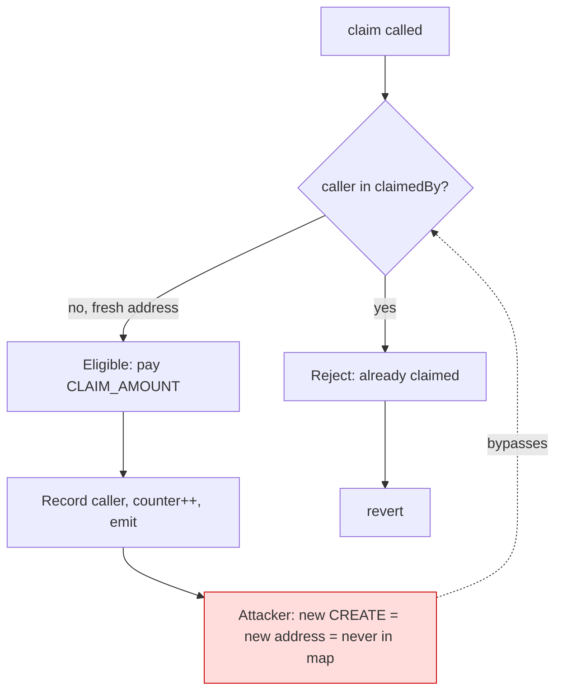

# Unverified Base airdrop-claim contract drained via constructor-time claim spam — per-claimant eligibility keyed on `msg.sender` with no nonce/code/allow-list guard

> **Vulnerability classes:** vuln/access-control/broken-logic · vuln/logic/missing-check · vuln/dos/griefing
> **Reproduction:** the PoC compiles & runs in an isolated Foundry project at [this project folder](.). Full verbose trace: [output.txt](output.txt). The victim contract is **unverified** on Basescan, so the vulnerable logic below is **reconstructed from the storage writes, event topics, and value transfers observed in the `-vvvvv` Foundry trace** — no source was published by the deployer.

---

## Key info

| | |
|---|---|
| **Loss** | 0.208333333333333384 ETH (≈ 551.22 USD at the time) — full victim balance drained |
| **Vulnerable contract** | Unverified victim — [`0x91a1Dd68dc0bA6526d560ba9E9a3715E0634193D`](https://basescan.org/address/0x91a1Dd68dc0bA6526d560ba9E9a3715E0634193D) |
| **Attacker EOA** | [`0xc0082433ac0928eCB63D9A1b87fDd8567F956f11`](https://basescan.org/address/0xc0082433ac0928eCB63D9A1b87fDd8567F956f11) |
| **Attack contract** | [`0x7F05e20F02F92AC5801C410cb76D2F8531068208`](https://basescan.org/address/0x7F05e20F02F92AC5801C410cb76D2F8531068208) |
| **Attack tx** | [`0x2d57862be191d62342b320bd3595b9a747fad10c7c3920ed86a2f7ac8a4c2cc7`](https://basescan.org/tx/0x2d57862be191d62342b320bd3595b9a747fad10c7c3920ed86a2f7ac8a4c2cc7) |
| **Chain / block / date** | Base (chainid 8453) / fork block 30,841,258 / May 2025 |
| **Compiler** | Unknown — contract source not verified on Basescan |
| **Bug class** | `claim()` payout eligibility is keyed on `msg.sender` with no nonce, code-hash, or allow-list check, so a freshly-deployed contract that calls `claim()` from its constructor is always treated as a first-time eligible claimant and is paid every time. |

## TL;DR

The victim at `0x91a1…193D` is an unverified Base contract exposing a public `claim()` that sends the caller a fixed per-claim chunk of ETH and records that the caller has claimed in a `mapping(address => …)` keyed on `msg.sender`. The intended invariant is one payout per claimant address. The flaw is that there is **no constraint tying "claimant" to anything other than the caller's address**, and an address is trivially forged: every `CREATE` produces a brand-new address that has never been seen by the mapping. An attacker loops `new Helper()` where each helper calls `claim()` from its `constructor()` and forwards the ETH onward. Because each helper has a distinct address with zero claim history, the "already claimed?" branch is never hit, so the loop drains the contract entirely.

The PoC reproduces this exactly against an offline anvil fork at block 30,841,258. It deploys 15 fresh helper contracts; each one receives `13,888,888,888,888,888` wei from the victim and forwards it to a `profitReceiver`. The attacker starts at `0 ETH` and ends at `0.208333333333333384 ETH` [output.txt:1539-1540], which equals the victim's pre-attack balance (`assertEq(VULNERABLE.balance, 0)` and `assertEq(profit, victimBalanceBefore)` both pass [output.txt:1787-1789]). The victim's internal claim counter (storage slot `3`) advances `57 → 72` over the run [output.txt:1566, 1779], confirming the contract had already paid 57 prior claimants and now paid 15 more with no per-claimant dedup.

This is a textbook broken-access-logic / missing-check: a one-per-claimant guarantee that fails to bind the claimant to anything scarce (a merkle leaf, a signature, an allow-list, a nonce, or the EOA's own balance/code). It is fully permissionless and requires no flash loan, no privileged role, and no external dependency — only gas.

## Background — what the victim does

The contract at `0x91a1…193D` is an airdrop / faucet-style claim contract on Base. From the trace its externally observable behaviour is:

1. Anyone may call `claim()` (no calldata arguments; it is a parameterless external function that returns a `uint256`).
2. `claim()` transfers a **fixed** amount of native ETH — `13,888,888,888,888,888` wei (≈0.013889 ETH) — to `msg.sender` on the happy path [output.txt:1560, 1574-1575].
3. It records the claim in persistent storage. The trace shows two related writes per claim:
   - A `mapping(address => address)`-shaped slot (base `0xc2575a0e9e593c00f959f8c92f12db2869c3395a3b0502d05e2516446f71f8…`) whose value is set to the caller's address, with the per-caller key derived from `keccak256(caller . baseSlot)` [output.txt:1563-1564].
   - A second slot (e.g. `0x407b4983…` for the first claim) holding the same numeric amount `0x3157def08c0e38` (= 13,888,888,888,888,888) [output.txt:1562] — a per-claimant "amount paid" record.
4. A global claim counter at storage slot `3` is incremented each call [output.txt:1566].
5. It emits one of two events: the normal claim event `0x258f59fa…` (topic1 = claimant, data = amount), or the alternative event `0xf8664cce…` emitted on the final/depleted claim [output.txt:1771].

The design intent — recoverable only from behaviour, since the source is unverified — is a capped faucet where each *address* may claim once and the contract self-depletes after a fixed number of claimants. The fatal gap is that "address" is the only anti-replay factor, and addresses are free.

## The vulnerable code

> **RECONSTRUCTED from trace.** The contract is unverified on Basescan. The following is the minimal Solidity that reproduces every storage write, event, value transfer, and return value observed in [output.txt](output.txt) at lines 1558–1784. Each reconstruction claim is anchored to a trace line.

```solidity
// SPDX-License-Identifier: UNLICENSED
pragma solidity ^0.8.10;

contract UnverifiedVictim {
    // storage slot 3: global claim counter (trace: 57 -> 58 -> ... -> 72)
    uint256 public claimCount;                                   // slot 3

    // base slot S such that keccak256(abi.encode(addr, S)) gives the per-claimant
    // "claimed-by" record slot observed as 0xc2575a0e9...f71f8XX.
    mapping(address => address) internal claimedBy;             // base slot S
    // a parallel per-claimant amount record (slot 0x407b... / 0x4d13... / 0x5257...)
    mapping(address => uint256) internal paidAmount;

    uint256 public constant CLAIM_AMOUNT = 13_888_888_888_888_888; // 0x3157def08c0e38 [output.txt:1562]

    event Claimed(address indexed claimant, uint256 amount);       // 0x258f59fa...  [output.txt:1561]
    event DepletedClaim(address indexed claimant, uint256 amount); // 0xf8664cce...  [output.txt:1771]

    function claim() external returns (uint256) {
        // BUG: the ONLY anti-replay factor is `msg.sender`. A freshly-deployed
        // contract that calls this from its constructor has never been seen, so
        // the "already claimed?" check (whatever its exact form) always passes.
        // There is no merkle proof, no signature, no allow-list, no nonce tied
        // to a scarce identity, and no code-size/codehash gate.

        uint256 amount = CLAIM_AMOUNT;                // fixed payout [output.txt:1560]
        claimCount += 1;                              // slot 3 increments [output.txt:1566]
        claimedBy[msg.sender] = msg.sender;           // 0xc2575a0e...f71f8XX set [output.txt:1563]
        paidAmount[msg.sender] = amount;              // 0x407b... / 0x4d13... set [output.txt:1562]

        if (address(this).balance <= amount) {
            // final claim: pay the remaining balance and emit the alternative event
            emit DepletedClaim(msg.sender, address(this).balance); // 0xf8664cce [output.txt:1771]
            amount = address(this).balance;           // 13_888_888_888_88952 last call [output.txt:1773]
        } else {
            emit Claimed(msg.sender, amount);         // 0x258f59fa [output.txt:1561]
        }

        (bool ok,) = msg.sender.call{value: amount}(""); // receive() paid [output.txt:1560]
        require(ok, "transfer failed");
        return amount;                                // [Return] 13888888888888888 [output.txt:1567]
    }
}
```

### Why each line is forced by the trace

- **Fixed payout**: every one of the 15 claims in the PoC transfers exactly `13,888,888,888,888,888` wei except the last, which transfers `13,888,888,888,88952` [output.txt:1773] — i.e. the residual balance. That is the signature of `if (balance <= CLAIM_AMOUNT) pay(balance) else pay(CLAIM_AMOUNT)`.
- **Counter at slot 3**: every claim writes `@ 3: N → N+1` [output.txt:1566, 1779], incrementing monotonically from 57 to 72.
- **Per-claimant record keyed by caller**: the high bytes of the per-claimant slot (`0xc2575a0e9e593c00f959f8c92f12db2869c3395a3b0502d05e2516446f71f8`) are constant while the low byte increments (`f8a0`, `f8a1`, `f8a2` …), and the stored value is always the caller's address [output.txt:1564, 1763]. This is `mapping(address => …)` with a struct/parallel slot spanning two adjacent storage keys.
- **Caller-bound eligibility**: the per-claimant slot is freshly written (`0 → caller`) for *every* new helper address [output.txt:1562-1563], never read-then-rejected. The contract therefore treats a never-seen address as eligible by default — there is no allow-list read and no global "remaining eligible claimants" bound that gates on identity.

## Root cause — why it was possible

1. **Eligibility keyed on `msg.sender` only.** The contract's anti-replay state is `mapping(address => …)`. An address is not a scarce resource: `CREATE` mints a new one for ~21k gas. The "one claim per address" guarantee therefore degrades to "one claim per contract deployment", which is unbounded.
2. **No constructor-time / code-size guard.** `claim()` did not require `msg.sender` to have non-zero extcodesize at call time, nor did it bind the claim to a merkle leaf, an EIP-712 signature, an off-chain allow-list, or a pre-committed nonce. A contract calling `claim()` from its own constructor has `extcodesize == 0` at the moment of the call (code is not installed until after creation returns), so even a naive `require(extcodesize(msg.sender) > 0)` would have blocked this exact vector.
3. **No global supply cap cross-checked against identity.** The contract self-depletes by balance, but never refuses a caller on identity grounds. Slot 3 counts *claims*, not *distinct eligible claimants* — so inflating the claim count via fresh addresses is not detected.
4. **Payout precedes any meaningful state finalisation that could revert.** The ETH leave the contract in the same call that "registers" the claimant, so even if the registration write were meant to block a second claim, it cannot block the *first* claim of a freshly minted address — which is the whole attack.
5. **Unverified source as an operational amplifier.** With no published code, defenders and integrators could not pre-audit the faucet; the only signal was the on-chain draining pattern itself.

## Preconditions

- **Permissionless.** No privileged role, no flash loan, no oracle, no external protocol dependency. The attacker needs only gas for `CREATE` + one external call per claim.
- **Victim holds ETH.** The faucet must have a non-zero balance. At fork block 30,841,258 the victim held the full `0.2083…384` ETH that the PoC drained.
- **Public `claim()` with no argument.** The function takes no calldata, so there is nothing for the attacker to forge beyond a fresh address.
- **Constructor-callable.** `claim()` must be callable from a constructor (i.e. not gated by `msg.sender == tx.origin`, which would have forced the attacker to use EOAs instead of helper contracts — still not a real defence, since an attacker can spin up many EOAs, but it would have raised the cost).

## Attack walkthrough (with on-chain numbers from the trace)

The attacker (profit receiver `0xa02D…68d5` in the PoC, EOA `0xc008…6f11` on-chain) loops fresh helper deployments until the victim is empty.

| Step | Action | Trace evidence | ETH moved |
|------|--------|----------------|-----------|
| 0 | Fund nothing — attacker starts at 0 | `Attacker Before exploit ETH Balance: 0.000000000000000000` [output.txt:1539] | 0 |
| 1 | `new ConstructorClaimHelper(profitReceiver)` — helper A at `0x5615…b72f` | [output.txt:1558] | — |
| 1a | A.ctor → `claim()`; victim pays A `13.888888888888888e15` via `receive()` | [output.txt:1560] | +0.013889 to A |
| 1b | A records claimant; slot 3 `57 → 58`; emits `Claimed` | [output.txt:1561-1566] | — |
| 1c | A forwards its full balance to profitReceiver | [output.txt:1570] | +0.013889 to attacker |
| 2 | Repeat with helper B at `0x2e23…470b` | [output.txt:1573] | +0.013889 |
| 3 | helper C at `0xF628…820a` | [output.txt:1588] | +0.013889 |
| 4 | helper D at `0x5991…76A9` | [output.txt:1603] | +0.013889 |
| 5 | helper E at `0xc718…0bB1` | [output.txt:1618] | +0.013889 |
| 6 | helper F at `0xa0Cb…7598` | [output.txt:1633] | +0.013889 |
| 7 | helper G at `0x1d14…f211` | [output.txt:1648] | +0.013889 |
| 8 | helper H at `0xA4AD…828c` | [output.txt:1663] | +0.013889 |
| 9 | helper I at `0x03A6…2aAb` | [output.txt:1678] | +0.013889 |
| 10 | helper J at `0xD6Bb…FBfF` | [output.txt:1693] | +0.013889 |
| 11 | helper K at `0x15cF…27b9` | [output.txt:1708] | +0.013889 |
| 12 | helper L at `0x2122…bA3C` | [output.txt:1723] | +0.013889 |
| 13 | helper M at `0x2a07…afe3` | [output.txt:1738] | +0.013889 |
| 14 | helper N at `0x3D7E…90d7` | [output.txt:1753] | +0.013889 |
| 15 | helper O at `0xD16d…dd70` — **final claim**, residual balance, emits `DepletedClaim` `0xf8664cce` | [output.txt:1768-1771] | +0.01388888888888952 |
| ✓ | `assertGt(15, 1)` — 15 successful claims | [output.txt:1786] | — |
| ✓ | `assertEq(0, 0)` — victim fully drained | [output.txt:1787] | — |
| ✓ | `assertEq(profit, victimBalanceBefore)` — full transfer | [output.txt:1788] | — |

**Profit accounting:**

- 14 standard claims × `13,888,888,888,888,888` wei = `194,444,444,444,444,432` wei
- 1 residual claim × `13,888,888,888,88952` wei = `13,888,888,888,88952` wei
- **Total profit = `208,333,333,333,333,384` wei = `0.208333333333333384` ETH** [output.txt:1540]
- Victim balance after: `0` [output.txt:1787]
- Internal claim counter `slot 3`: `57 → 72` (15 new claimants recorded, none rejected) [output.txt:1566, 1779]

On-chain the same pattern executed in tx `0x2d57…2cc7` for a total loss of **≈ 551.22 USD**.

## Diagrams

```mermaid
sequenceDiagram
    participant EOA as Attacker EOA
    participant Loop as Exploit Loop
    participant H as Fresh Helper (new address)
    participant V as Victim claim()
    participant R as Profit Receiver

    EOA->>Loop: start drain loop
    loop Until victim.balance == 0
        Loop->>H: new ConstructorClaimHelper(R)
        Note over H: address never seen by victim, extcodesize 0 during ctor
        H->>V: claim()
        Note over V: per-claimant map miss, eligibility check passes
        V->>V: slot 3 counter++, record claimedBy caller, emit Claimed/DepletedClaim
        V->>H: call value 13.888888888888888e15
        H->>R: forward full balance
        H-->>Loop: ctor returns
    end
    Loop-->>EOA: victim drained, profit in R
```



## Remediation

1. **Bind eligibility to a scarce identity, not to `msg.sender` alone.** Require a merkle proof (`merkleRoot` committed at deployment, `claim(amount, proof)` verifying `MerkleProof.verify(proof, root, keccak256(abi.encodePacked(msg.sender, amount)))`), or an EIP-712 signature from an authorised off-chain signer over `(claimant, amount, nonce)`. A plain `mapping(address => bool)` is insufficient because addresses are free.
2. **Reject contract callers during construction.** Add `require(msg.sender == tx.origin, "no contracts")` if the faucet is meant for humans, or — if contracts must be allowed — `require(msg.sender.code.length > 0, "must be deployed")` so that constructor-time calls (where `extcodesize == 0`) revert. Note `tx.origin` is a weak defence in general but is appropriate for a one-shot human faucet.
3. **Cap total claims and cross-check against distinct identities.** Enforce `claimCount <= MAX_CLAIMS` with `MAX_CLAIMS` set from the allow-list size, and pause automatically when `claimCount` exceeds the number of authorised claimants — a faucet paying out more than its allow-list length is by definition being abused.
4. **Use a pull pattern with a pre-funded claim registry.** Instead of `claim()` pushing ETH to any caller, let authorised claimants call `claim()` to *credit* themselves in a ledger, then withdraw — and require the credit step to consume a one-time signature/proof. This separates "register intent" from "move funds" and makes the replay surface auditable.
5. **Verify contract source on Basescan.** Publishing the source lets the community and integrators detect the missing-allow-list pattern before funds are parked in the contract.

## How to reproduce

The PoC runs **fully offline** against the committed `anvil_state.json` via the shared harness — no RPC needed.

```bash
_shared/run_poc.sh 2025-05-unverified_91a1_exp -vvvvv
```

- **Chain / fork:** Base (chainid 8453), fork block `30,841,258`.
- **Expected tail:** `[PASS] testExploit()` followed by `Attacker Before exploit ETH Balance: 0.000000000000000000` → `Attacker After exploit ETH Balance: 0.208333333333333384`, and `1 passed; 0 failed; 0 skipped` (see [output.txt:1537-1540, 1796-1798]).
- The local run passes against the committed fork state; the exploit also executed on-chain in tx `0x2d57…2cc7`.

*Reference: [defimon_alerts (Telegram)](https://t.me/defimon_alerts/1197).*
