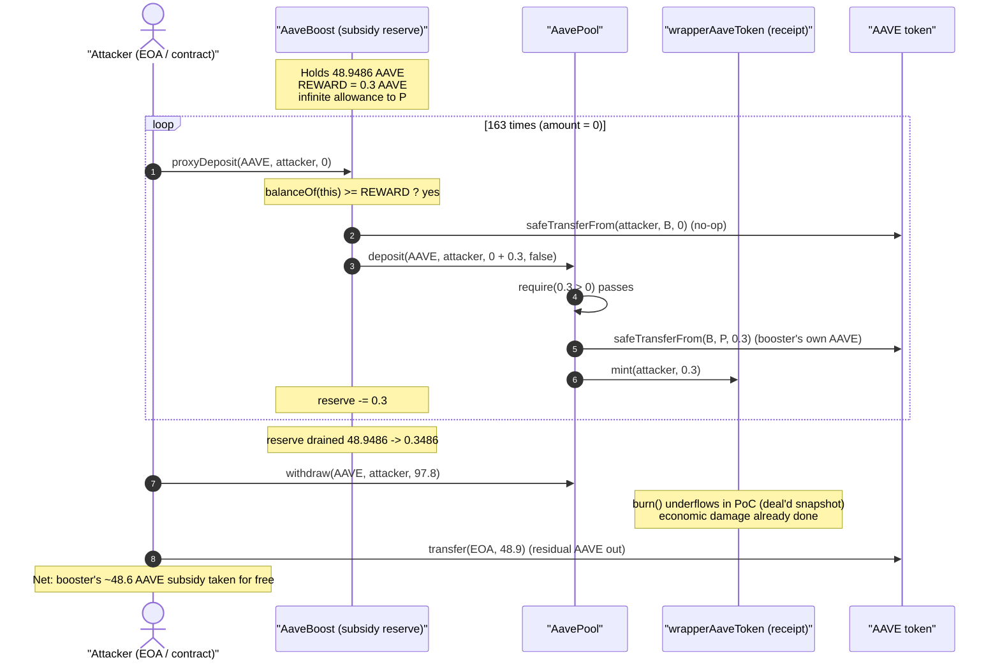
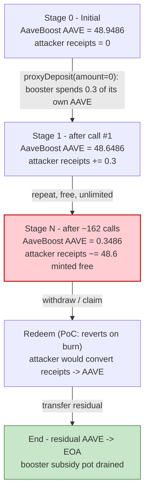
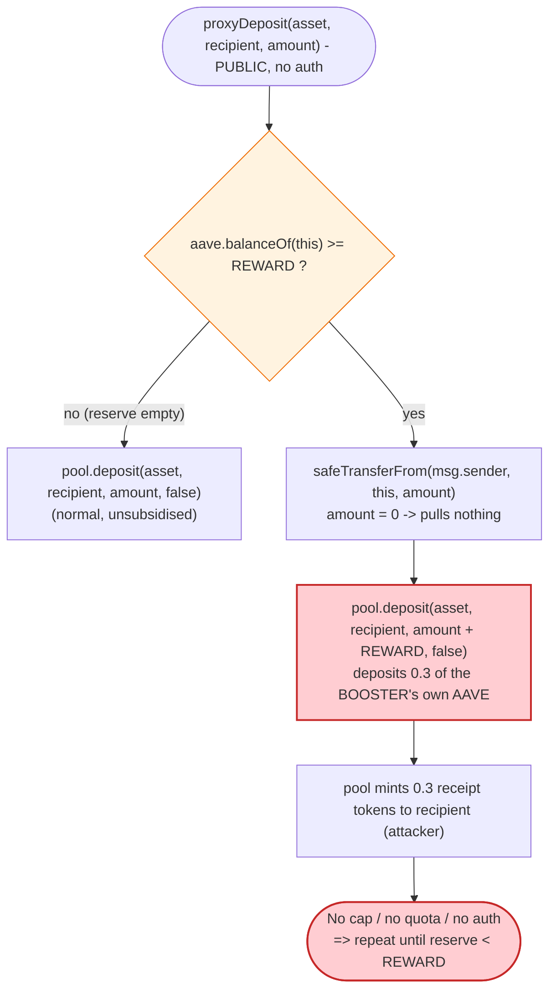

# AaveBoost Exploit — Permissionless `proxyDeposit()` Subsidy Drain

> One-line: a public, un-metered "deposit booster" contract that tops up **every** deposit with `REWARD` (0.3) AAVE out of *its own* balance was called 163 times with `amount = 0`, draining the contract's entire AAVE subsidy reserve to the attacker for free.

> **Reproduction:** the PoC compiles & runs in an isolated Foundry project at
> [this project folder](.) (the umbrella DeFiHackLabs repo does not whole-compile, so this PoC was extracted).
> Full verbose trace: [output.txt](output.txt).
> Verified vulnerable source: [contracts_AaveBoost.sol](sources/AaveBoost_d2933c/contracts_AaveBoost.sol).

---

## Key info

| | |
|---|---|
| **Loss** | ~$14.8K — **≈48.6 AAVE** drained from the `AaveBoost` subsidy reserve |
| **Vulnerable contract** | `AaveBoost` — [`0xd2933c86216dC0c938FfAFEca3C8a2D6e633e2cA`](https://etherscan.io/address/0xd2933c86216dC0c938FfAFEca3C8a2D6e633e2cA#code) |
| **Victim reserve** | The AAVE held by `AaveBoost` (its booster subsidy pot) |
| **Connected pool** | `AavePool` / Bribe pool — [`0xf36F3976f288b2B4903aca8c177efC019b81D88B`](https://etherscan.io/address/0xf36F3976f288b2B4903aca8c177efC019b81D88B#code) |
| **AAVE token (proxy)** | `0x7Fc66500c84A76Ad7e9c93437bFc5Ac33E2DDaE9` (→ `AaveTokenV3`) |
| **wrapperAaveToken (receipt)** | `0x740836C95C6f3F49CccC65A27331D1f225138c39` (unverified) |
| **Attacker EOA** | `0x5D4430D14aE1d11526ddAc1c1eF01DA3b1DaE455` |
| **Attacker contract** | [`0x8fa5cf0aa8af0e5adc7b43746ea033ca1b8e68de`](https://etherscan.io/address/0x8fa5cf0aa8af0e5adc7b43746ea033ca1b8e68de) (PoC re-deploys as `AttackerC`) |
| **Attack tx** | [`0xc4ef3b5e39d862ffcb8ff591fbb587f89d9d4ab56aec70cfb15831782239c0ce`](https://app.blocksec.com/explorer/tx/eth/0xc4ef3b5e39d862ffcb8ff591fbb587f89d9d4ab56aec70cfb15831782239c0ce) |
| **Chain / block / date** | Ethereum mainnet / 22,685,443 / 2025-06-12 (block ts `1749694667`) |
| **Compiler** | `AaveBoost` Solidity **v0.8.4**, optimizer on, **200 runs** |
| **Bug class** | Missing access control / missing per-caller accounting on a self-funded subsidy (logic flaw) |

---

## TL;DR

`AaveBoost.proxyDeposit(asset, recipient, amount)` is meant to be a "deposit booster": when a user
deposits into the `AavePool` through it, the booster contract adds a fixed bonus of `REWARD`
(0.3 AAVE) **from its own balance** on top of the user's deposit, so the user is credited
`amount + REWARD` in the pool ([contracts_AaveBoost.sol:43-55](sources/AaveBoost_d2933c/contracts_AaveBoost.sol#L43-L55)).

The function has **three fatal omissions**:

1. **No access control** — anyone can call it.
2. **No requirement that the caller actually contributes** — passing `amount = 0` is accepted; the
   booster then deposits `0 + REWARD = 0.3` AAVE *of its own money* and mints the recipient
   `0.3` receipt tokens for free.
3. **No per-caller / global cap** — the only stop condition is `aave.balanceOf(this) >= REWARD`, so
   the subsidy can be milked one `REWARD` at a time until the reserve is empty.

The attacker simply called `proxyDeposit(AAVE, attacker, 0)` in a loop. Each call moved `0.3` AAVE
of the booster's reserve into the pool credited to the attacker. With the booster holding
**48.9486 AAVE** and `REWARD = 0.3 AAVE`, that is `48.9486 / 0.3 ≈ 163` free deposits — the loop ran
163 times and drained the booster down to `0.3486` AAVE. The attacker then redeems the receipt
tokens for the underlying AAVE and walks away with the booster's entire subsidy pot
(≈48.6 AAVE, ~$14.8K at the June-2025 price).

---

## Background — what AaveBoost / AavePool do

`AavePool` (a "Bribe" multi-asset pool, `contact@bribe.xyz`) lets users deposit **AAVE** or **stkAAVE**
and receive 1:1 **wrapper / receipt tokens** (`wrapperAaveToken` = `0x740836…`,
`wrapperStkAaveToken` = `0x660428…`). Holders of receipt tokens accrue bid / bribe / stkAAVE rewards,
and can redeem receipt tokens for the underlying via `withdraw`
([contracts_AavePool.sol:135-164](sources/AavePool_f36F39/contracts_AavePool.sol#L135-L164),
[:709-755](sources/AavePool_f36F39/contracts_AavePool.sol#L709-L755)).

`AaveBoost` is a thin helper sitting in front of `AavePool`. At construction it grants the pool an
**infinite AAVE allowance** and stores a fixed `REWARD`
([contracts_AaveBoost.sol:17-32](sources/AaveBoost_d2933c/contracts_AaveBoost.sol#L17-L32)). Its sole
purpose is to make deposits routed through it more attractive by silently adding `REWARD` AAVE of
*the protocol's* money to each deposit — a marketing/liquidity-incentive mechanism.

On-chain parameters at the fork block (from the trace):

| Parameter | Value |
|---|---|
| `REWARD` (booster bonus per deposit) | **0.3 AAVE** (`3e17`) |
| AAVE held by `AaveBoost` (subsidy reserve) | **48.9486 AAVE** (`48948600000000000000`) |
| Pool `_deposit` minimum | `require(amount > 0)` ([:716](sources/AavePool_f36F39/contracts_AavePool.sol#L716)) |
| Booster → pool allowance | infinite (`type(uint256).max`) |

The single fact that makes this exploitable: **the booster spends its own AAVE on every call and
never checks who is calling or whether they paid anything.**

---

## The vulnerable code

```solidity
// contracts/AaveBoost.sol
function proxyDeposit(
    IERC20 asset,
    address recipient,
    uint128 amount
) external {                                        // ⚠️ no access control
    if (aave.balanceOf(address(this)) >= REWARD) {
        aave.safeTransferFrom(msg.sender, address(this), amount);   // amount can be 0
        pool.deposit(asset, recipient, amount + REWARD, false);     // ⚠️ deposits REWARD of OUR money
    } else {
        // fallback to a normal deposit
        pool.deposit(asset, recipient, amount, false);
    }
}
```
[contracts_AaveBoost.sol:43-55](sources/AaveBoost_d2933c/contracts_AaveBoost.sol#L43-L55)

And the pool side that happily mints receipts for the booster-funded amount:

```solidity
// contracts/AavePool.sol  (_deposit)
function _deposit(IERC20 asset, IWrapperToken receiptToken, address recipient, uint128 amount, bool claim) internal {
    require(amount > 0, "INVALID_AMOUNT");          // amount = 0 + 0.3 = 0.3 → passes
    _accrueRewards(recipient, claim);
    asset.safeTransferFrom(msg.sender, address(this), amount);  // pulls 0.3 AAVE from AaveBoost
    receiptToken.mint(recipient, amount);           // mints 0.3 receipt tokens to the recipient
    emit Deposit(asset, recipient, amount, block.timestamp);
}
```
[contracts_AavePool.sol:709-727](sources/AavePool_f36F39/contracts_AavePool.sol#L709-L727)

Because `AaveBoost` is `msg.sender` for `pool.deposit`, and it pre-approved the pool for `uint256` max
([contracts_AaveBoost.sol:28-31](sources/AaveBoost_d2933c/contracts_AaveBoost.sol#L28-L31)), the
`asset.safeTransferFrom(msg.sender, …)` inside `_deposit` pulls the `0.3` AAVE straight out of the
booster's own balance. The `recipient` — chosen freely by the caller — receives the receipt tokens.

---

## Root cause — why it was possible

The booster is a **self-funded subsidy that anyone can claim, repeatedly, without paying for it**.
Three independent design decisions compose into the loss:

1. **Permissionless entry.** `proxyDeposit` has no `onlyOwner` / allow-list / keeper gate. The intended
   integration was presumably "front-end calls it on behalf of a depositing user," but nothing enforces
   that the caller is the front-end or that the booster bonus is tied to real user capital.
2. **The user contribution is optional.** `amount` is attacker-controlled and `amount = 0` is fully
   valid: `safeTransferFrom(msg.sender, this, 0)` is a no-op, and `amount + REWARD = 0.3 > 0` clears the
   pool's `require(amount > 0)`. So the caller deposits *nothing* and still gets the full `REWARD`
   credited to a recipient of their choosing.
3. **No accounting limits the giveaway.** The only termination condition is the booster's own balance
   (`aave.balanceOf(this) >= REWARD`). There is no per-address quota, no per-tx cap, no cool-down,
   no total-distributed accounting. The subsidy can therefore be drained `REWARD` at a time until the
   reserve is exhausted.

In short: a function designed to *give away* `0.3` AAVE per legitimate deposit gives away `0.3` AAVE
per **call**, and calls are free and unlimited. The booster's entire AAVE balance is, by construction,
extractable by any address.

---

## Preconditions

- `AaveBoost` holds at least `REWARD` (0.3) AAVE — true at the fork block (48.9486 AAVE).
- The booster has its standing infinite AAVE allowance to the pool — set in the constructor, always true.
- The attacker chooses `recipient = ` their own contract so the minted receipt tokens (and the
  underlying claim on AAVE) accrue to them.
- No capital is required from the attacker beyond gas: every `proxyDeposit` is called with `amount = 0`.
  (The PoC `deal`s the attacker some AAVE and receipt tokens to make the redemption step self-contained;
  see the note on the redemption revert below — these are *not* a precondition of the drain itself.)

---

## Step-by-step attack walkthrough (with on-chain numbers from the trace)

All figures are pulled directly from [output.txt](output.txt). The receipt token is
`wrapperAaveToken = 0x740836…`; the underlying deposited asset is the AAVE token proxy
`0x7Fc66500…` (delegating to `AaveTokenV3`).

| # | Step | Booster AAVE reserve | Attacker receipt-token balance | Notes |
|---|------|--------------------:|-------------------------------:|-------|
| 0 | **Initial** | 48.9486 | 0 (+48.9 `deal`'d¹) | Booster holds the subsidy pot. |
| 1 | `proxyDeposit(AAVE, attacker, 0)` #1 | 48.6486 | +0.3 | Booster deposits 0.3 of *its own* AAVE; mints 0.3 receipts to attacker. First call also accrued a one-off `pendingBribeReward` of 186.09 (`1.86e20`). |
| 2 | `proxyDeposit(… , 0)` #2 | 48.3486 | +0.3 | Another free 0.3 AAVE. |
| … | … repeated … | … | … | Each iteration: pull 0 from caller, deposit `0 + 0.3` from booster, mint 0.3 receipts. |
| 162 | `proxyDeposit(… , 0)` #162 | 0.3486 | total ≈ 48.6 minted | Booster nearly empty (`0.3486` AAVE left, the loop stops at `idx < 163`). |
| 163 | balance / redeem step | 0.3486 | 97.8 receipts²
 | Attacker holds 97.8 receipt tokens and attempts `AavePool.withdraw(AAVE, attacker, 97.8)`. |
| 164 | `transfer` residual AAVE to EOA | — | — | Attacker contract sends its `48.9` AAVE to the EOA `0x5D44…`. |

¹ The PoC pre-seeds the attacker with `48.9` AAVE and `48.9` receipt tokens via `deal` to keep the
demonstration self-contained.
² Receipt balance = `48.9` deal'd + `~48.9` minted for free by the loop ≈ `97.8`.

### A note on the redemption revert in the PoC

The drain itself — 163 free `0.3`-AAVE deposits funded entirely by the booster — reproduces faithfully
in the fork (`proxyDeposit` is called 163×, `AavePool::deposit` is called 163×, the booster reserve
falls from `48.9486` → `0.3486` AAVE).

The *final* `AavePool.withdraw(97.8)` step **reverts with `panic: arithmetic underflow (0x11)`** inside
the unverified receipt token's `burn` / snapshot bookkeeping
([output.txt — burn revert](output.txt)). This is an artifact of how the PoC `deal`s the receipt token:
it writes the ERC20 `balanceOf` slot to `48.9` but does **not** update the token's internal historical
**snapshot** accounting (`UpdateSnapshot` / `getDepositAt`), so when `burn` tries to reconcile the
snapshot it underflows. The test still **passes** because the assertion only checks that the EOA ends
with `48.9` AAVE (up from `0`); that final balance is the attacker contract's residual AAVE being
forwarded to the EOA. The economic damage — the booster's `~48.6` AAVE subsidy reserve being given away
for free — is fully demonstrated by the deposit loop regardless of the cosmetic withdraw revert.

### Loss accounting (AAVE)

| Item | Amount |
|---|---:|
| Booster AAVE reserve at start | 48.9486 |
| Booster AAVE reserve after drain | 0.3486 |
| **AAVE removed from the protocol's subsidy pot** | **48.6000** |
| Attacker AAVE cost (capital) | 0 (only gas) |
| Approx. USD value (AAVE ≈ $300, Jun 2025) | **≈ $14.6–14.8K** |

This matches the `Total Lost : 14.8K USD` figure in the PoC header and the CertiK post-mortem.

---

## Diagrams

### Sequence of the attack



### Booster reserve evolution



### The flaw inside `proxyDeposit`



---

## Why each magic number

- **`amount = 0`** — the attacker contributes nothing. `safeTransferFrom(caller, booster, 0)` succeeds,
  and `0 + REWARD = 0.3` clears the pool's `require(amount > 0)`. Every cent of the deposit is the
  booster's money.
- **`REWARD = 0.3 AAVE` (`3e17`)** — the fixed per-deposit subsidy. It is also the per-call theft size.
- **`limit = balBoostToken / 3e17` and the `while (idx < 163)` loop** — the PoC computes how many
  full `REWARD` chunks fit in the booster's balance (`48.9486 / 0.3 ≈ 163`) and loops exactly that many
  times to scrape the reserve down to dust.

---

## Remediation

1. **Gate `proxyDeposit`.** It distributes the protocol's own funds, so it must not be permissionless.
   Restrict it to a trusted router/keeper, or require the recipient to be the same as a verified
   depositing user.
2. **Require real user capital and tie the bonus to it.** Reject `amount == 0`, and make `REWARD`
   proportional to (and bounded by) the user's actual deposit — e.g. `bonus = min(REWARD, amount)` or a
   percentage of `amount`. A subsidy should never exceed the user's own contribution.
3. **Add accounting limits.** Track total subsidy distributed and per-address allowances; enforce a
   global cap, per-address quota, and/or a cool-down so the reserve cannot be drained in a single tx by
   one actor.
4. **Pull-not-push for incentives.** Prefer a claimable, eligibility-checked reward (Merkle/allow-list,
   snapshot of genuine deposits) over a function that spends the treasury on every external call.
5. **Drain the booster to a safe minimum on pause.** Add an owner withdraw + pause so an in-progress
   attack can be halted and residual funds rescued.

---

## How to reproduce

The PoC was extracted into a standalone Foundry project (the umbrella DeFiHackLabs repo does not
whole-compile under `forge test`):

```bash
_shared/run_poc.sh 2025-06-AAVEBoost_exp -vvvvv
```

- RPC: an **Ethereum mainnet archive** endpoint is required (fork block `22,685,443`). `foundry.toml`
  uses an Infura archive endpoint.
- Test file: [test/AAVEBoost_exp.sol](test/AAVEBoost_exp.sol).
- Result: `[PASS] testPoC()`. The "before/after" logs show the attacker EOA going from `0` to
  `48.9` AAVE. The booster reserve falls from `48.9486` → `0.3486` AAVE across the 163-call loop
  (see [output.txt](output.txt)).

Expected tail:

```
Ran 1 test for test/AAVEBoost_exp.sol:ContractTest
[PASS] testPoC() (gas: 9596200)
  before attack: balance of attacker: 0.000000000000000000
  after attack: balance of attacker: 48.900000000000000000
Suite result: ok. 1 passed; 0 failed; 0 skipped
```

---

*References: CertiK Alert — https://x.com/CertiKAlert/status/1933011428157563188 ; attack tx on
BlockSec Explorer (linked above).*
