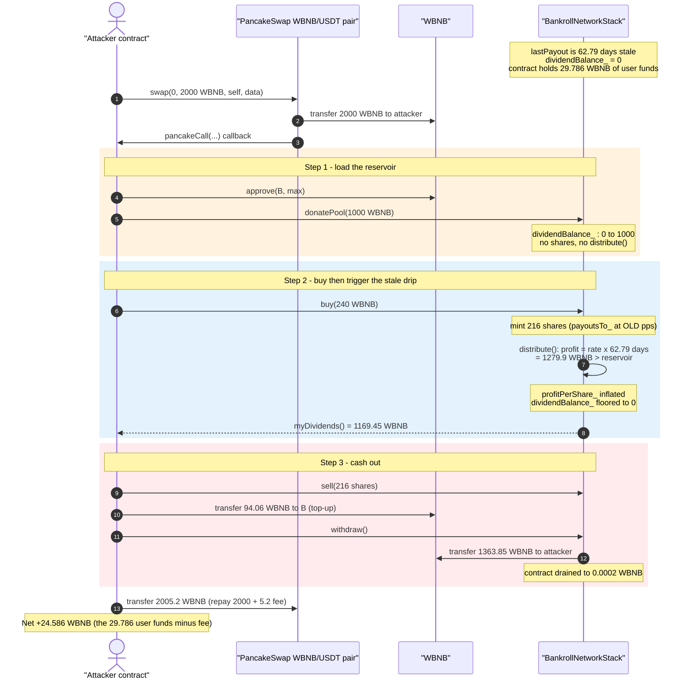
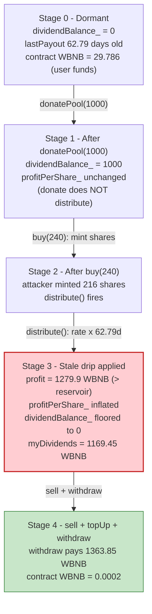
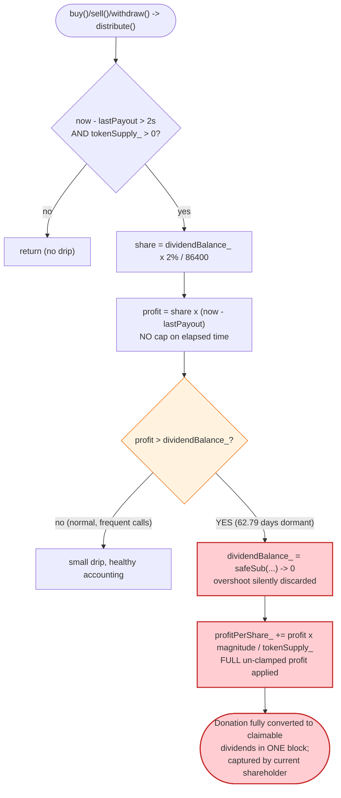

# BankrollNetwork Stack Exploit — Stale `lastPayout` Instant-Drip Dividend Inflation

> **Reproduction:** the PoC compiles & runs in an isolated Foundry project at
> [this project folder](.) (the umbrella DeFiHackLabs repo contains many unrelated PoCs
> that do not whole-compile, so this one was extracted).
> Full verbose trace: [output.txt](output.txt).
> Verified vulnerable source:
> [BankrollNetworkStack.sol](sources/BankrollNetworkStack_AdEfb9/BankrollNetworkStack.sol).

---

## Key info

| | |
|---|---|
| **Loss** | **24.586 WBNB** net attacker profit (≈ 29.786 WBNB of honest user deposits drained from the contract, less the 5.2 WBNB flash-loan fee) |
| **Vulnerable contract** | `BankrollNetworkStack` — [`0xAdEfb902CaB716B8043c5231ae9A50b8b4eE7c4e`](https://bscscan.com/address/0xAdEfb902CaB716B8043c5231ae9A50b8b4eE7c4e#code) |
| **Victim pool** | The BankrollNetworkStack rewards contract itself (holds WBNB user deposits) |
| **Flash-loan source** | PancakeSwap WBNB/USDT pair — `0x16b9a82891338f9bA80E2D6970FddA79D1eb0daE` |
| **Attacker EOA** | [`0x2dEa406bb3bEA68D6bE8d9Ef0071fDf63082fB52`](https://bscscan.com/address/0x2dea406bb3bea68d6be8d9ef0071fdf63082fb52) |
| **Attacker contract** | [`0xe63A5C681cACb8484C8a989cFDd41b8e3b7a2bE2`](https://bscscan.com/address/0xe63a5c681cacb8484c8a989cfdd41b8e3b7a2be2) |
| **Attack tx** | [`0x7226b3947c7e8651982e5bd777bca52d03ea31d19b515dec123595a4435ae22c`](https://bscscan.com/tx/0x7226b3947c7e8651982e5bd777bca52d03ea31d19b515dec123595a4435ae22c) |
| **Chain / block / date** | BSC / 51,715,418 / 2025-06-19 07:14:49 UTC |
| **Compiler** | Solidity v0.6.8, optimizer **off** (`runs: 200` recorded but `optimizer: 0`) |
| **Bug class** | Reward-accounting flaw — stale `lastPayout` lets a single `donatePool` + `buy` drip a whole donation into `profitPerShare_` in one block, instantly claimable by the depositor |

---

## TL;DR

`BankrollNetworkStack` is a "drip pool" rewards contract (a fork of the well-known *X-Perpetual* /
*Bankroll* family). Donations go into `dividendBalance_`, and a **time-based drip** moves a slice of
that pool into the global `profitPerShare_` accumulator every time `distribute()` runs
([BankrollNetworkStack.sol:875-898](sources/BankrollNetworkStack_AdEfb9/BankrollNetworkStack.sol#L875-L898)).
The amount dripped is proportional to **`now − lastPayout`** — the wall-clock time since the last
distribution.

At the fork block the contract had been **dormant for 62.79 days** (`lastPayout` was 5,425,032 s
stale). The attacker, holding a freshly-flash-loaned 2,000 WBNB, did the following inside a single
`pancakeCall` callback:

1. **`donatePool(1000 WBNB)`** — dumps 1,000 WBNB straight into `dividendBalance_`. `donatePool`
   does **not** mint any shares and does **not** call `distribute()`.
2. **`buy(240 WBNB)`** — mints `216` shares to the attacker (10% entry fee). At the **end** of `buy`,
   `distribute()` finally runs. Because `lastPayout` was 62.79 days stale, the per-second drip rate
   `dividendBalance_ × 2% / 86400` multiplied by 5.4M seconds yields a drip **larger than the entire
   `dividendBalance_`** — so essentially the **whole 1,000 WBNB donation is converted into
   `profitPerShare_` in one shot**.
3. Because `tokenSupply_` was tiny and the attacker had just become the dominant shareholder, that
   freshly-minted `profitPerShare_` accrues almost entirely to the attacker. `myDividends()` jumps to
   **1,169.45 WBNB**.
4. **`sell(216)`** burns the shares (adding the exit-fee tax to `dividendBalance_`), then the attacker
   tops up the contract with 94.06 WBNB so it has enough WBNB on hand, and **`withdraw()`** pays out
   the inflated **1,363.85 WBNB** dividend balance.
5. Repay the 2,000 WBNB flash loan + 5.2 WBNB fee.

Net result: the attacker recovers all injected capital **plus** the **29.786 WBNB** of honest user
deposits that were sitting in the contract — netting **+24.586 WBNB** after the flash-loan fee.

---

## Background — what BankrollNetworkStack does

`BankrollNetworkStack`
([source](sources/BankrollNetworkStack_AdEfb9/BankrollNetworkStack.sol)) is a perpetual-rewards
("drip") staking contract denominated in a single ERC-20 collateral token — here **WBNB**
(`tokenAddress`). Conceptually it is a share pool:

- **Buy** (`buy`/`buyFor`, [:565-587](sources/BankrollNetworkStack_AdEfb9/BankrollNetworkStack.sol#L565-L587)):
  deposit collateral, pay a **10% entry fee** (`entryFee_`), receive shares (`tokenBalanceLedger_`)
  for the remaining 90%. `tokenSupply_` is the total share count.
- **Sell** (`sell`, [:661-689](sources/BankrollNetworkStack_AdEfb9/BankrollNetworkStack.sol#L661-L689)):
  burn shares, pay a **10% exit fee** (`exitFee_`); the post-tax value is virtually credited.
- **Dividends** accrue through a global accumulator `profitPerShare_`. Each holder's claimable amount
  is `dividendsOf = (profitPerShare_ × balance − payoutsTo_) / magnitude`
  ([:795-797](sources/BankrollNetworkStack_AdEfb9/BankrollNetworkStack.sol#L795-L797)).
- **Donations** (`donatePool`, [:556-562](sources/BankrollNetworkStack_AdEfb9/BankrollNetworkStack.sol#L556-L562)):
  anyone can push collateral into `dividendBalance_`, the un-dripped reward reservoir.
- **The drip** (`distribute`, [:875-898](sources/BankrollNetworkStack_AdEfb9/BankrollNetworkStack.sol#L875-L898)):
  releases `payoutRate_` (2%) of `dividendBalance_` **per day**, pro-rated by elapsed seconds, into
  `profitPerShare_`.

The on-chain state at the fork block (read from the trace):

| Parameter | Value |
|---|---|
| `entryFee_` / `exitFee_` | 10% each |
| `payoutRate_` | 2% per day |
| `distributionInterval` | 2 s |
| `magnitude` | `2^64` |
| WBNB held by the contract (honest user deposits) | **29.786 WBNB** ← the prize |
| `lastPayout` (slot 7) | `1,744,892,257` (April 17, 2025) |
| block timestamp at attack | `1,750,317,289` (June 19, 2025) |
| **`now − lastPayout`** | **5,425,032 s = 62.79 days** ← the enabler |

That last fact is the whole game: the drip rate is calibrated to release ~2%/day, but it had not run
for **62.79 days**, so a single trigger releases up to `62.79 × 2% = 125%` of the reservoir — i.e.
the entire donation.

---

## The vulnerable code

### 1. `donatePool` injects the reservoir without minting shares or distributing

```solidity
/// @dev This is how you pump pure "drip" dividends into the system
function donatePool(uint amount) public returns (uint256) {
    require(token.transferFrom(msg.sender, address(this), amount));
    dividendBalance_ += amount;            // ⚠️ reservoir grows, no distribute(), no shares
    emit onDonation(msg.sender, amount, now);
}
```
([:556-562](sources/BankrollNetworkStack_AdEfb9/BankrollNetworkStack.sol#L556-L562))

### 2. The time-based drip — proportional to `now − lastPayout`, with no per-call cap

```solidity
function distribute() private {
    ...
    if (SafeMath.safeSub(now, lastPayout) > distributionInterval && tokenSupply_ > 0) {
        //A portion of the dividend is paid out according to the rate
        uint256 share = dividendBalance_.mul(payoutRate_).div(100).div(24 hours);
        //divide the profit by seconds in the day
        uint256 profit = share * now.safeSub(lastPayout);     // ⚠️ scales with 62.79 days of staleness
        //share times the amount of time elapsed
        dividendBalance_ = dividendBalance_.safeSub(profit);  // ⚠️ safeSub floors at 0 — overshoot ignored

        //Apply divs
        profitPerShare_ = SafeMath.add(profitPerShare_, (profit * magnitude) / tokenSupply_); // ⚠️ FULL profit applied
        lastPayout = now;
    }
}
```
([:875-898](sources/BankrollNetworkStack_AdEfb9/BankrollNetworkStack.sol#L875-L898))

The two fatal lines:

- `profit = share * (now − lastPayout)` — with 62.79 days of staleness, `profit` (≈ 1,280 WBNB-worth)
  **exceeds** the entire `dividendBalance_` (1,019.2). There is **no `profit = min(profit,
  dividendBalance_)` clamp.**
- `dividendBalance_ = dividendBalance_.safeSub(profit)` silently floors to **0** (the custom
  `safeSub` returns 0 on underflow, [:996-1002](sources/BankrollNetworkStack_AdEfb9/BankrollNetworkStack.sol#L996-L1002)),
  but `profitPerShare_` is incremented by the **un-clamped** `profit`. So `profitPerShare_` is bumped
  as if more than 100% of the reservoir were released, and it all lands on the current shareholders.

### 3. `buy` triggers `distribute()` *after* the buyer's shares are minted

```solidity
function buyFor(address _customerAddress, uint buy_amount) public returns (uint256) {
    require(token.transferFrom(msg.sender, address(this), buy_amount));
    totalDeposits += buy_amount;
    uint amount = purchaseTokens(_customerAddress, buy_amount);  // mints shares, sets payoutsTo_ at OLD pps
    emit onLeaderBoard(...);
    distribute();                                                // ⚠️ now drips 62.79 days into pps
    return amount;
}
```
([:571-587](sources/BankrollNetworkStack_AdEfb9/BankrollNetworkStack.sol#L571-L587))

`purchaseTokens` records the buyer's `payoutsTo_` baseline using the **old** `profitPerShare_`
([:945-946](sources/BankrollNetworkStack_AdEfb9/BankrollNetworkStack.sol#L945-L946)). The subsequent
`distribute()` then raises `profitPerShare_`, so the entire increase is claimable by the freshly-bought
shares — classic "buy → inflate accumulator → claim" ordering.

---

## Root cause — why it was possible

The drip is a *rate × elapsed-time* integral with **no upper bound on the elapsed-time factor and no
clamp against the reservoir it draws from**. Under normal operation `distribute()` runs on every
buy/sell/withdraw, so `now − lastPayout` stays small (seconds to hours) and the per-call drip is a tiny
fraction of `dividendBalance_`. But nothing *enforces* frequent calls. After a 62.79-day dormancy, the
first `distribute()` releases far more than the daily rate — in fact more than 100% of the reservoir.

This becomes a theft primitive because of three composing decisions:

1. **`donatePool` is permissionless and instantly enlarges the reservoir** that the very next
   `distribute()` will drip — so the attacker controls *how much* gets dripped.
2. **`buy` mints shares before calling `distribute()`**, and `payoutsTo_` is baselined at the *old*
   `profitPerShare_`. So the attacker can become the dominant shareholder *immediately before* the
   inflated drip is applied, capturing essentially all of it.
3. **The drip has no clamp** (`profit` is not bounded by `dividendBalance_`), so a long dormancy turns
   the donation into >100%-of-reservoir `profitPerShare_` growth that the sole large holder withdraws.

The economic effect: the attacker round-trips their own donation + buy back out as "dividends," and on
top of it sweeps the contract's **pre-existing 29.786 WBNB of honest user deposits**, because
`withdraw()` pays out `myDividends()` from the contract's *total* WBNB balance, not from a
per-user-segregated ledger.

The `topUp` transfer of 94.06 WBNB (PoC line 62-63) is purely a liquidity bridge: the attacker's
claimable dividends (1,363.85 WBNB) exceeded what they had deposited plus the user funds present, so
they pre-funded the contract so `withdraw()`'s `token.transfer` would not revert — that 94.06 comes
right back inside the same payout.

---

## Preconditions

- **`tokenSupply_ > 0`** so `distribute()` executes its drip branch (the contract had pre-existing
  shareholders).
- **A large `now − lastPayout`** — i.e. the contract had not had a buy/sell/withdraw for a long time
  (here 62.79 days). The longer the dormancy, the larger the single-shot drip relative to the
  reservoir.
- **Working capital in WBNB** to donate + buy. Fully recovered intra-transaction, hence
  **flash-loanable** — the PoC borrows 2,000 WBNB from the PancakeSwap WBNB/USDT pair via `pair.swap`
  and repays in the same callback.

No special role, no admin key, no oracle. Everything is permissionless.

---

## Attack walkthrough (with on-chain numbers from the trace)

All figures are taken directly from the events and storage diffs in [output.txt](output.txt). The
attacker contract's logic lives in `pancakeCall`
([BankrollNetwork_exp.sol:47-69](test/BankrollNetwork_exp.sol#L47-L69)).

| # | Step | Call | Amount (WBNB) | Effect (from trace) |
|---|------|------|--------------:|---------------------|
| 0 | **Flash loan** | `pair.swap(0, 2000e18, …)` | +2,000.00 | Pair sends 2,000 WBNB to the attacker; `pancakeCall` invoked. |
| 1 | **Approve** | `WBNB.approve(bankroll, max)` | — | Allow the rewards contract to pull WBNB. |
| 2 | **Donate** | `donatePool(1000e18)` | −1,000.00 | `dividendBalance_` slot 10: `0 → 1,000e18`. No shares minted, no distribute. |
| 3 | **Buy** | `buy(240e18)` | −240.00 | Mints **216** shares (10% fee). `distribute()` then fires: drips 62.79 days of reservoir. `profitPerShare_` (slot 5) jumps; `dividendBalance_` (slot 10) drained `1,019.2e18 → 0`. |
| 4 | **Inspect** | `myDividends()` | — | Reports **1,169.45 WBNB** claimable for the attacker's 216 shares. |
| 5 | **Sell** | `sell(216e18)` | — | Burns the 216 shares; exit-fee tax (`216 × 10% = 21.6`, post-buyback split) returns `17.28` to `dividendBalance_`. |
| 6 | **Top-up** | `WBNB.transfer(bankroll, 94.06e18)` | −94.06 | Pre-funds the contract so the oversized withdraw won't revert. |
| 7 | **Withdraw** | `withdraw()` | +1,363.85 | Contract transfers **1,363.85 WBNB** (full `myDividends`) to the attacker. Contract WBNB balance drops `1,363.85 → 0.0002`. |
| 8 | **Repay** | `WBNB.transfer(pair, 2005.2e18)` | −2,005.20 | Flash loan principal 2,000 + 0.26% fee 5.2. |
| 9 | **End** | — | **= 24.586** | Attacker's residual WBNB balance. |

### The drip math (Step 3), reproduced exactly

```
dividendBalance_ before distribute = donate 1000 + (entry-fee dividend portion) 19.2 = 1019.2 WBNB
share  = 1019.2e18 * 2 / 100 / 86400          ≈ 2.3593e14  (per-second drip)
elapsed = 1,750,317,289 − 1,744,892,257       = 5,425,032 s   (62.79 days)
profit = share * elapsed                       ≈ 1,279.9 WBNB   ← EXCEEDS the 1,019.2 reservoir
dividendBalance_ = safeSub(1019.2, 1279.9)     = 0              ← floored, overshoot lost
profitPerShare_ += profit * 2^64 / tokenSupply_                ← applied with the FULL 1,279.9
```

The drip releases the *entire* reservoir (and would have released more if it existed) into
`profitPerShare_` in one block. With the attacker holding the dominant share of `tokenSupply_` and a
`payoutsTo_` baseline set at the old (low) `profitPerShare_`, the resulting `myDividends()` of
1,169.45 WBNB is almost the whole donation flowing back to the attacker — plus the protocol's existing
balance.

### Profit accounting (WBNB)

| Direction | Item | Amount |
|---|---|---:|
| IN | Flash-loan borrow | +2,000.000 |
| IN | `withdraw()` payout | +1,363.851 |
| | **Total in** | **+3,363.851** |
| OUT | `donatePool` | −1,000.000 |
| OUT | `buy` | −240.000 |
| OUT | `topUp` transfer | −94.065 |
| OUT | Flash-loan repay (2,000 + 5.2 fee) | −2,005.200 |
| | **Total out** | **−3,339.265** |
| | **Net profit** | **+24.586** |

This reconciles to the wei with the trace's final attacker balance of `24,586,313,427,964,087,472`
(24.586 WBNB). The contract's WBNB balance fell from **29.786 → 0.0002**; the missing **29.786 WBNB**
is exactly the honest-user deposits stolen, and `29.786 − 5.2` (flash-loan fee) `= 24.586` net.

---

## Diagrams

### Sequence of the attack



### Reservoir / accumulator state evolution



### The flaw inside `distribute()`



---

## Why each magic number

- **Flash loan 2,000 WBNB** — working capital only. Donating 1,000 + buying 240 + topping up 94.06
  needs ~1,334 WBNB; 2,000 leaves headroom and the unused amount is repaid.
- **`donatePool(1000 WBNB)`** — sets the reservoir size. Because the drip releases >100% of it after
  62.79 days, this 1,000 is the lever that the stale drip multiplies into `profitPerShare_`. A larger
  donation would drip out a proportionally larger `profitPerShare_` (bounded by the elapsed-time
  factor), so the attacker sized it to comfortably exceed the protocol's 29.786 WBNB so they capture
  all of it.
- **`buy(240 WBNB)`** — mints exactly `216` shares (after the 10% fee). This makes the attacker the
  dominant fresh shareholder *before* `distribute()` runs, so the inflated `profitPerShare_` accrues to
  them rather than to pre-existing holders.
- **`topUp = 94.064984776383565540 WBNB`** — the precise amount needed so the contract's WBNB balance
  (29.786 user funds + 1,240 deposits + 94.06) ≥ the 1,363.85 dividend payout, preventing
  `withdraw()`'s `token.transfer` from reverting. It is returned within the same withdraw.
- **`repay = 2,005.2 WBNB`** — 2,000 principal + PancakeSwap's 0.25%/0.3%-style fee (here 5.2 WBNB ≈
  0.26% of 2,000) to settle the flash swap.

---

## Remediation

1. **Clamp the drip to the reservoir.** The single highest-impact fix:
   ```solidity
   uint256 profit = share * now.safeSub(lastPayout);
   if (profit > dividendBalance_) profit = dividendBalance_;   // ← add this clamp
   dividendBalance_ = dividendBalance_.sub(profit);
   profitPerShare_  = profitPerShare_.add((profit * magnitude) / tokenSupply_);
   ```
   This guarantees the drip can never release more than the reservoir actually holds, defusing the
   "long dormancy = >100% release" primitive.
2. **Cap the elapsed-time factor.** Even with the clamp, bound `now − lastPayout` to a small maximum
   (e.g. one `distributionInterval`-worth, or one day) so a long idle period cannot front-load months
   of drip into one block.
3. **Distribute on `donatePool` (or update `lastPayout`).** Run `distribute()` (or at least reset the
   timing baseline) *before* growing `dividendBalance_`, so a donation cannot be immediately re-dripped
   by the donor on the same stale clock.
4. **Order `distribute()` before minting in `buy`.** Apply pending drip to existing holders *before*
   minting new shares, so a just-bought position cannot capture a drip that accrued while it did not
   exist. (Set `payoutsTo_` after the accumulator is brought current.)
5. **Segregate accounting from raw balance.** `withdraw()` paying `myDividends()` out of the contract's
   total token balance lets inflated accounting reach into honest users' principal. Track an explicit
   "claimable" ledger that can never exceed funds genuinely allocated to dividends.

---

## How to reproduce

The PoC was extracted into a standalone Foundry project (the umbrella DeFiHackLabs repo has many
unrelated PoCs that fail to compile under a whole-project `forge build`):

```bash
_shared/run_poc.sh 2025-06-BankrollNetwork_exp -vvvvv
```

- RPC: a **BSC archive** endpoint is required (fork block 51,715,417). `foundry.toml` uses
  `https://bsc-mainnet.public.blastapi.io`, which serves historical state at that block; most public
  BSC RPCs prune it and fail with `header not found` / `missing trie node`.
- The PoC imports `../basetest.sol` (copied to the project root alongside its `tokenhelper.sol`
  dependency) plus the shared `interface.sol`.
- Result: `[PASS] testExploit()` with the attacker ending on **24.586313427964087472 WBNB**.

Expected tail:

```
  [Begin] Attacker WBNB before exploit: 0.000000000000000000
  [Before] Attacker bank roll balance: 0.0
  [Before] Attacker bank roll dividends: 0.0
  [After] Attacker bank roll balance: 216000000000000000000.0
  [After] Attacker bank roll dividends: 1169451298204347653012.0
  [End] Attacker WBNB after exploit: 24.586313427964087472
  Attacker After exploit WBNB Balance: 24.586313427964087472

Suite result: ok. 1 passed; 0 failed; 0 skipped
```

---

*Reference: Phalcon post-mortem — https://x.com/Phalcon_xyz/status/1943518566831296566 ;
TenArmor alert — https://x.com/TenArmorAlert/status/1935618109802459464 (BankrollNetwork, BSC, ~24.5 WBNB).*
