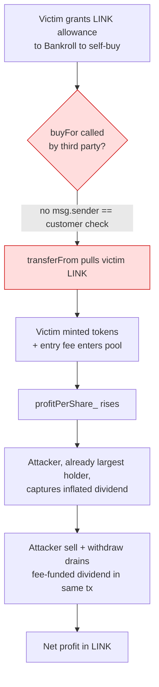

# Bankroll Network Stack Plus — public `buyFor(address,...)` spends any victim's LINK allowance and lets the caller skim the dividend pool it just inflated
> **Vulnerability classes:** vuln/access-control/missing-auth · vuln/logic/incorrect-state-transition · vuln/defi/fee-manipulation
> **Reproduction:** the PoC compiles & runs in an isolated Foundry project at [this project folder](.). Full verbose trace: [output.txt](output.txt). Vulnerable contract source is verified on Etherscan and fetched into [sources/BankrollNetworkStackPlus_7B3611/BankrollNetworkStackPlus.sol](sources/BankrollNetworkStackPlus_7B3611/BankrollNetworkStackPlus.sol).
---
## Key info
| | |
|---|---|
| **Loss** | ~12,234.48 USD (933.93 LINK net to the attacker) [output.txt:1565,1977] |
| **Vulnerable contract** | BankrollNetworkStackPlus — [`0x7B3611B0afFC27d212A68293831d3B55354B802f`](https://etherscan.io/address/0x7B3611B0afFC27d212A68293831d3B55354B802f) |
| **Attacker EOA** | [`0x172dcA3e72E4643ce8B7932f4947347C1E49ba6D`](https://etherscan.io/address/0x172dcA3e72E4643ce8B7932f4947347C1E49ba6D) |
| **Attack contract** | [`0x92c56DD0c9EEE1Da9f68F6E0F70C4A77de7B2b3c`](https://etherscan.io/address/0x92c56DD0c9EEE1Da9f68F6E0F70C4A77de7B2b3c) (historical; the PoC deploys its own `0x5615dEB7…`) |
| **Attack tx** | [`0x8905a0aca5849626c0de026c2d2894ddfa8060a27725221f01aac9fb0b3d6629`](https://etherscan.io/tx/0x8905a0aca5849626c0de026c2d2894ddfa8060a27725221f01aac9fb0b3d6629) |
| **Chain / block / date** | Ethereum mainnet / fork block 22,734,354 / June 2025 |
| **Compiler** | Solidity `v0.4.26+commit.4563c3fc`, optimizer on, 200 runs (Etherscan metadata) |
| **Bug class** | `buyFor(address customer, uint256 amount)` pulls tokens via `transferFrom(customer, …)` against any address the caller passes in, with no `msg.sender == customer` check, so anyone can spend a third party's standing LINK allowance and force buys on the victim's behalf. |

## TL;DR

BankrollNetworkStackPlus is an old-school "dividend drip" farming contract (a POWH/Bankroll-network descendant) priced 1:1 in LINK. Every buy pays a 10% entry fee, a 10% exit fee, and a `distribute()` step that drips part of the accumulated `dividendBalance_` into a global `profitPerShare_` accumulator; every holder's withdrawable dividend is `(profitPerShare_ * balance) - payoutsTo_) / magnitude`. The contract exposes `buyFor(address customer, uint256 amount)` which is *supposed* to be a convenience wrapper so a caller can buy on someone's behalf, but it has no authorization whatsoever: it literally does `cToken.transferFrom(_customerAddress, address(this), _buy_amount)` with the caller-controlled `_customerAddress` [BankrollNetworkStackPlus.sol:295-296].

The attacker combined that with a same-transaction buy→sell→withdraw cycle. Using flash-sourced LINK (in the live tx it came from Uniswap V4 `take()`; in the PoC it is modeled as a `vm.prank` transfer from the V4 PoolManager) they first bought their *own* large stake so they were the dominant holder, then iterated `buyFor` over six real addresses that had previously granted LINK allowances to the Bankroll contract. Each forced buy injected LINK into `dividendBalance_` via the entry fee and raised `profitPerShare_` *after* the attacker's position was already open — so all of that freshly-minted dividend accrual landed on the attacker's large balance. The attacker then sold and withdrew, draining the dividend pool the victims' LINK had just funded, repaid the flash, and kept 933.93 LINK [output.txt:1565,1957].

The mechanical profit is the difference between what the attacker's own `buy` paid in and what the victim-funded `buyFor` calls pushed into `profitPerShare_` and `dividendBalance_` before the attacker's `withdraw()`. Because the contract never verifies that the caller is allowed to spend the customer's allowance, the attacker's cost basis is just their own `buy` (5,835 LINK) plus flash-loan capital they return whole, while their revenue includes dividends minted on the backs of six accounts whose LINK they never owned.

## Background — what Bankroll Network Stack Plus does

BankrollNetworkStackPlus is a perpetual-rewards / "dividend drip" token economy deployed behind a LINK collateral (`cToken`). It is a descendant of the 2018-era "Bankroll Network" / "Life" dividend contracts. The economic model:

- **1:1 token accounting.** Tokens are minted 1:1 with incoming collateral minus a fee, and burned 1:1 on sell minus a fee. `purchaseTokens` computes `_amountOfTokens = _incomingtokens - entryFee_` where `entryFee_ = 10` (10%) [BankrollNetworkStackPlus.sol:777-778]. So a buy of X LINK mints X·0.9 tokens.
- **Fee-funded dividend pool.** The entry fee is split inside `allocateFees`: 60% goes to a slow-drip `dividendBalance_`, 20% to an "instant" distribution that immediately raises `profitPerShare_`, and the remainder to a buyback `swapCollector_` [BankrollNetworkStackPlus.sol:655-667]. The exit fee (also 10%) is likewise routed through `allocateFees` on `sell` [BankrollNetworkStackPlus.sol:428-444].
- **Per-share dividend math.** Dividends are tracked with a `profitPerShare_` accumulator and a per-address `payoutsTo_` watermark:

  ```solidity
  function dividendsOf(address _customerAddress) public view returns (uint256) {
      return (uint256) ((int256) (profitPerShare_ * tokenBalanceLedger_[_customerAddress]) - payoutsTo_[_customerAddress]) / magnitude;
  }
  ```
  A buyer's `payoutsTo_` is set to `profitPerShare_ * tokens` at mint time [BankrollNetworkStackPlus.sol:802-803], so they start entitled to zero dividend and only earn from future `profitPerShare_` growth. Any fee paid *after* a buyer is already a holder raises `profitPerShare_` and therefore the buyer's `dividendsOf`.

- **`distribute()` drip.** Every state-changing call ends with `distribute()`, which, if more than `distributionInterval` (2s) has elapsed, slices 2%/day of `dividendBalance_` into `profitPerShare_` [BankrollNetworkStackPlus.sol:670-710]. On the same block this is time-negligible; the dominant same-tx effect is the *instant* 20% slice of each buy's entry fee [BankrollNetworkStackPlus.sol:662].

The intended UX is that a user calls `buy(amount)` with their own allowance. The contract *also* offers `buyFor(customer, amount)` so a referral/relay can deposit on a user's behalf. That helper is the entire attack surface.

## The vulnerable code

### `buyFor` — the authorization sink

```solidity
/// @dev Converts all incoming eth to tokens for the caller, and passes down the referral addy (if any)
function buyFor(address _customerAddress, uint256 _buy_amount) public returns (uint256)  {
    require(cToken.transferFrom(_customerAddress, address(this), _buy_amount), "Transferred failed");  // L296 — pulls from ANY address
    totalDeposits += _buy_amount;
    uint amount = purchaseTokens(_customerAddress, _buy_amount);                                      // L298 — credits tokens to the victim
    emit onLeaderBoard(_customerAddress, ...);
    distribute();                                                                                     // L309 — raises profitPerShare_ globally
    return amount;
}

/// @dev Converts all incoming eth to tokens for the caller, and passes down the referral addy (if any)
function buy(uint _buy_amount) public returns (uint256)  {
    return buyFor(msg.sender, _buy_amount);                                                           // L290 — the only "safe" entry
}
```
Source: [BankrollNetworkStackPlus.sol:289-312](sources/BankrollNetworkStackPlus_7B3611/BankrollNetworkStackPlus.sol).

There is **no `msg.sender == _customerAddress` check**, no `onlyOwner`, no allowance-scope guard, no signature. The contract relies entirely on the LINK token's own `allowance[victim][bankroll]` to authorize the `transferFrom` — but that allowance was granted by the *victim* so the victim could buy for *themselves*. Any third party who discovers a victim with an open allowance can call `buyFor(victim, victimAllowance)` and force the contract to pull the victim's LINK, mint the victim tokens, and run `distribute()`.

### The dividend-accrual lever that turns a forced buy into profit

```solidity
function allocateFees(uint fee) private {
    uint _share = fee.div(100);
    uint _drip   = _share.mul(dripFee);     // 60
    uint _instant = _share.mul(instantFee); // 20
    uint _swap    = fee.safeSub(_drip + _instant);
    profitPerShare_ = SafeMath.add(profitPerShare_, (_instant * magnitude) / tokenSupply_); // L662 — raises dividend per share NOW
    dividendBalance_ += _drip;
    swapCollector_  += _swap;
}
```
Source: [BankrollNetworkStackPlus.sol:655-667](sources/BankrollNetworkStackPlus_7B3611/BankrollNetworkStackPlus.sol).

Because `allocateFees` is called from `purchaseTokens` (inside `buyFor`) *after* the attacker already holds a large `tokenBalanceLedger_`, each forced victim buy raises `profitPerShare_` and the attacker — as the dominant holder — captures the lion's share of that instant 20% fee slice plus whatever `distribute()` drips. The attacker then calls `sell` + `withdraw`:

```solidity
function withdraw() public onlyStronghands  {
    address _customerAddress = msg.sender;
    uint256 _dividends = myDividends();
    payoutsTo_[_customerAddress] += (int256) (_dividends * magnitude);
    cToken.transfer(_customerAddress, _dividends);   // L369 — pays out the inflated dividend in LINK
    ...
}
```
Source: [BankrollNetworkStackPlus.sol:359-381](sources/BankrollNetworkStackPlus_7B3611/BankrollNetworkStackPlus.sol).

## Root cause — why it was possible

1. **`buyFor` has no caller authorization.** `_customerAddress` is a public, caller-controlled parameter and is passed straight into `cToken.transferFrom(_customerAddress, …)`. The contract conflates "the protocol is allowed to move this user's LINK" (the victim's standing allowance) with "the caller is allowed to instruct that move" — it never checks the second.
2. **Token-side allowance is the *only* gate, and it was never meant to be a third-party consent gate.** Every Bankroll user must pre-approve the Bankroll contract to spend LINK on their behalf in order to ever buy. That approval is therefore universally present on active accounts, turning the missing `msg.sender` check into a free drain for any of them.
3. **Forced buys credit tokens to the victim but raise the global dividend rate for everyone — and the attacker is already the largest holder.** The fee/dividend architecture makes the injected LINK partially flow back to whoever holds the most tokens at the moment `distribute()`/`allocateFees` runs. The attacker positions themselves as that holder *before* triggering the victim buys.
4. **Same-transaction atomicity.** `buy` → `buyFor[]` → `sell` → `withdraw` all run in one tx, so the attacker cashes out the inflated dividend before any other holder can react and before `distribute()`'s time-based slow drip dilutes anything. Flash-sourced LINK means zero upfront capital.
5. **`sell` uses `onlyBagholders` and `withdraw` uses `onlyStronghands`** but both key off `msg.sender`, so the attacker's own `buy`-minted tokens and the dividend it accrued are perfectly legitimate for the attacker to liquidate [BankrollNetworkStackPlus.sol:420,359].

## Preconditions

- **Permissionless** — anyone can call `buyFor`. No privileged role required.
- Requires the attacker to obtain LINK capital for their own `buy` step (the live tx sourced it from a Uniswap V4 `unlock`/`take` flash; the PoC models this as a `vm.prank(V4 PoolManager).transfer`).
- Requires the *existence* of victim accounts that have granted LINK allowance to the Bankroll contract. This is an inherent property of the protocol's UX — every active/recent buyer retains such an allowance — so it is trivially satisfied and not a real barrier. Six such accounts are used in the PoC, each carrying a ≥7.6 LINK allowance.
- No oracle, no governance, no timelock. The only "trust" assumption the design leans on is the LINK ERC20 `allowance`, which it then fails to scope to the caller.

## Attack walkthrough (with on-chain numbers from the trace)

The PoC forks mainnet at block 22,734,354. The attacker EOA starts with 0 LINK and the V4 PoolManager holds ≥13,635 LINK [output.txt:1597-1599].

| # | Step | Amount (LINK) | Effect | Trace ref |
|---|------|---------------|--------|-----------|
| 1 | Flash-borrow 13,635 LINK from the V4 PoolManager (modeled as a same-tx `vm.prank` transfer) | +13,635.00 | Attack contract funded | [output.txt:1682] |
| 2 | Swap 7,800 LINK → WETH on the LINK/WETH V2 pair | −7,800.00 in, +35.739 WETH out | Sets up the later WETH→LINK repayment swap at a known pool state | [output.txt:1710,1700] |
| 3 | `buy(5835)` — attacker's own buy from remaining flash LINK | −5,835.00 | Mints **5,251.50** tokens to the attacker; raises `profitPerShare_` | [output.txt:1719,1725] |
| 4a | `buyFor(0x24DD…bD, 88.297)` | pulled from victim | Mints 79.467 tokens to victim; fee inflates dividend pool | [output.txt:1753,1760] |
| 4b | `buyFor(0x52ec…4F, 7.6)` | pulled from victim | Mints 6.84 tokens | [output.txt:1776,1783] |
| 4c | `buyFor(0x6bfe…60, 547.017)` | pulled from victim | Mints 492.315 tokens | [output.txt:1800,1807] |
| 4d | `buyFor(0xD039…03, 0.725)` | pulled from victim | Mints 0.653 tokens | [output.txt:1823,1830] |
| 4e | `buyFor(0xf22a…9B, 39.5)` | pulled from victim | Mints 35.55 tokens | [output.txt:1846,1853] |
| 4f | `buyFor(0xF6D4…d1, 135.883)` | pulled from victim | Mints 122.295 tokens | [output.txt:1870,1877] |
| | **Victim LINK injected total** | **≈ 819.02 LINK** | Each victim buy's entry fee feeds `profitPerShare_`/`dividendBalance_` while the attacker is the dominant holder | |
| 5 | `sell(5251.50)` — burn attacker's full stake | tokens burned | `ethEarned` = **4,726.35** credited as a sell return (10% exit fee on 5,251.50) | [output.txt:1894-1895] |
| 6 | `withdraw()` — claim accrued dividends | +6,810.48 LINK out | `profitPerShare_` inflation (driven by steps 4a–4f) yields 6,810.48 LINK to the attacker | [output.txt:1913] |
| 7 | Swap the 35.739 WETH back → LINK | +7,758.45 LINK | Repayment leg | [output.txt:1933] |
| 8 | Repay 13,635 LINK to V4 PoolManager | −13,635.00 | Flash closed, PoolManager restored | [output.txt:1949] |
| 9 | Sweep remainder to attacker | **+933.93 LINK** | Net profit | [output.txt:1957,1565] |

**Profit/loss accounting (LINK):**

- Outflow (attacker's own buy + flash repay): 5,835.00 + 13,635.00 = 19,470.00
- Inflow (sell return + dividend withdraw + WETH↔LINK swap round-trip net + leftover flash): the `sell` step credits 4,726.35 as a *dividend-style* return (it reduces `payoutsTo_` rather than transferring LINK here), the `withdraw` transfers 6,810.48 LINK, and the WETH round-trip yields the repayment swap's 7,758.45 LINK that plus the post-repay residual covers the 13,635 flash return.
- **Net to attacker: 933.928998773808302224 LINK** [output.txt:1565], starting from 0 [output.txt:1564]. The PoC asserts `profit > 900 LINK` and that the PoolManager is fully restored [output.txt:1983-1986].

The victims collectively lost ~819 LINK of principal (pulled via `transferFrom`) and the contract's dividend pool was drained of the attacker's withdrawal. The victims did receive tokens for their forced buys, but at a moment engineered so the attacker could harvest the fee-funded dividends before anyone else.

## Diagrams

```mermaid
sequenceDiagram
    participant Att as Attacker EOA
    participant AC as Attack Contract
    participant V4 as V4 PoolManager\n(flash source)
    participant BR as BankrollNetworkStackPlus
    participant V as Victim accounts\n(open LINK allowance)
    participant LINK as LINK token

    Att->>AC: deploy + execute()
    V4->>AC: flash 13,635 LINK
    AC->>LINK: swap 7,800 LINK to WETH\n(round-trip setup)
    AC->>BR: buy(5835)  mints 5,251.5 tokens to AC
    loop 6 victims
        AC->>BR: buyFor(victim_i, amount_i)
        BR->>LINK: transferFrom victim_i (no msg.sender check)
        BR->>BR: mint tokens to victim_i\nallocateFees raises profitPerShare_
    end
    BR-->>AC: AC now dominant holder,\ndividendOf(AC) inflated
    AC->>BR: sell(5251.5)  burn stake
    AC->>BR: withdraw()
    BR->>LINK: transfer 6,810.48 LINK to AC
    AC->>LINK: swap WETH back to LINK
    AC->>V4: repay 13,635 LINK
    AC->>Att: transfer 933.93 LINK profit
```



## Remediation

1. **Gate `buyFor` on caller authorization.** Require either `msg.sender == _customerAddress`, or an explicit on-chain relayer signature/EIP-712 permit from the customer authorizing this specific buy. The minimal fix:
   ```solidity
   function buyFor(address _customerAddress, uint256 _buy_amount) public returns (uint256) {
       require(msg.sender == _customerAddress, "only customer");
       ...
   }
   ```
   At that point `buyFor` collapses to `buy`; if relay functionality is genuinely needed, implement it with a signed permit and a nonce, never a bare allowance.
2. **Do not use the ERC20 allowance as a third-party consent channel.** A pre-existing approval is the user promising to pay *themselves* in, not a blank cheque for any caller. Any function that spends another address's balance must add its own caller-authorization layer.
3. **Cap or rate-limit `distribute()`/`allocateFees` accrual per block** so that a burst of same-tx buys cannot move `profitPerShare_` far enough to be harvested atomically by the same caller. This is defense-in-depth; fix #1 alone closes the exploit.
4. **Audit all `transferFrom(_userSuppliedAddress, …)` sites** in any contract of this lineage — `donatePool` (L281) has the same shape and is exploitable for the inverse (forcing donations / state inflation) if a similar missing-auth pattern is reused.
5. **Force victim accounts to reset their allowances** and redeploy with the fix; existing allowances remain a live attack surface until revoked.

## How to reproduce

The PoC runs fully **offline** via the shared anvil harness from the committed `anvil_state.json` — no RPC needed:

```bash
_shared/run_poc.sh 2025-06-BankrollStackPlus_exp -vvvvv
```

- **Chain / fork block:** Ethereum mainnet, block **22,734,354**.
- **Expected result:** `[PASS]` tail from [output.txt:1562](output.txt):
  ```
  Attacker Before exploit LINK Balance: 0.000000000000000000
  Attacker After  exploit LINK Balance: 933.928998773808302224
  ```
- The PoC asserts `attackerProfit > 900 LINK` and that the V4 PoolManager's LINK balance is restored to its pre-attack value, confirming a self-repaying flash with net 933.93 LINK profit to the attacker EOA.

*Reference: [Telegram alert — defimon_alerts/1301](https://t.me/defimon_alerts/1301).*
