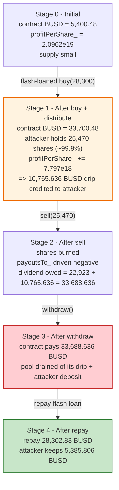
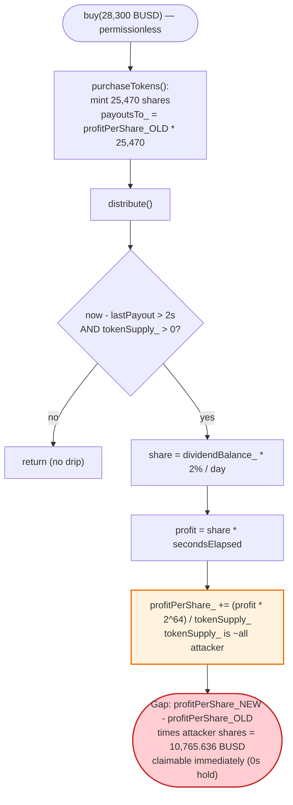

# BankrollStack (BankrollNetworkStack) Exploit — Flash-Loan Dividend-Drip Capture

> **One-liner:** A flash loan buys ~99.9% of the dividend contract's supply for one block, so the
> per-block "drip" of the accumulated dividend pool (`distribute()`) is credited almost entirely to
> the attacker, who then sells and `withdraw()`s **more BUSD than they deposited net of fees** — walking
> off with the protocol's pre-existing dividend reserve.

> **Reproduction:** the PoC compiles & runs in an isolated Foundry project at
> [this project folder](.) (the umbrella DeFiHackLabs repo does not whole-compile, so this PoC was
> extracted). Full verbose trace: [output.txt](output.txt).
> Verified vulnerable source: [BankrollNetworkStack.sol](sources/BankrollNetworkStack_16d0a1/BankrollNetworkStack.sol).

---

## Key info

| | |
|---|---|
| **Loss** | **5,385.806 BUSD** (~$5.4K) profit to the attacker, drained from the contract's dividend pool |
| **Vulnerable contract** | `BankrollNetworkStack` — [`0x16d0a151297a0393915239373897bCc955882110`](https://bscscan.com/address/0x16d0a151297a0393915239373897bCc955882110#code) |
| **Victim / pool** | The dividend contract's own accumulated `dividendBalance_` (real user deposits/fees in BUSD) |
| **Flash-loan source** | PancakeSwap V3 pool `0x4f3126d5DE26413AbDCF6948943FB9D0847d9818` (28,300 BUSD) |
| **Attacker EOA** | [`0x172dca3e72e4643ce8b7932f4947347c1e49ba6d`](https://bscscan.com/address/0x172dca3e72e4643ce8b7932f4947347c1e49ba6d) |
| **Attacker contract** | `0x92c56dd0c9eee1da9f68f6e0f70c4a77de7b2b3c` |
| **Attack tx** | [`0x0706425beba4b3f28d5a8af8be26287aa412d076828ec73d8003445c087af5fd`](https://bscscan.com/tx/0x0706425beba4b3f28d5a8af8be26287aa412d076828ec73d8003445c087af5fd) |
| **Chain / block / date** | BSC / fork at 51,698,203 (attack block 51,698,204) / June 2025 |
| **Compiler** | Solidity v0.6.8, optimizer disabled (200 runs metadata) |
| **Bug class** | Flash-loan share inflation against a time-based dividend drip (POWH/Bankroll-style `profitPerShare_` accounting) |

---

## TL;DR

`BankrollNetworkStack` is a "perpetual rewards" / POWH-style contract: users `buy()` shares with BUSD,
pay an 8–10% fee that accumulates into a `dividendBalance_` pool, and that pool is then **dripped out
over time** to share-holders via `distribute()` (≈2% of the pool per day, computed per elapsed second).
Owed dividends are tracked with the classic mass-payout pattern
`dividendsOf = (profitPerShare_ · tokenBalance − payoutsTo_) / magnitude`.

The flaw: **`distribute()` divides the dripped profit by the *current* `tokenSupply_`**
([:893](sources/BankrollNetworkStack_16d0a1/BankrollNetworkStack.sol#L893)), and a buyer's
`payoutsTo_` is anchored to the `profitPerShare_` value *before* their own buy's `distribute()` runs
([purchaseTokens :945-946](sources/BankrollNetworkStack_16d0a1/BankrollNetworkStack.sol#L945-L946)).
So an attacker who flash-loans a large `buy()` momentarily owns the overwhelming majority of
`tokenSupply_`. The `distribute()` triggered *by their own buy* then credits almost the entire pending
drip of the accumulated pool to **their** shares. They immediately `sell()` (which books the sell-tax
back to them as dividends) and `withdraw()`, receiving **deposit-net-of-fees + the captured drip**, which
exceeds their flash-loan repayment.

In this transaction the attacker:

1. Flash-loaned **28,300 BUSD** from a PancakeSwap V3 pool.
2. `buy(28,300)` → received **25,470** shares (10% entry fee). Their buy's `distribute()` lifted
   `profitPerShare_` by **+7.797e18** (scaled), and since the attacker now held ~99.9% of supply, that
   drip became **their** dividend.
3. `sell(25,470)` → burned shares, booking **22,923 BUSD** of sell-tax dividend to themselves.
4. `withdraw()` → received **33,688.636 BUSD** = `22,923` (sell-tax) **+ 10,765.636** (captured drip).
5. Repaid **28,302.83 BUSD** (loan + 0.01% fee). **Net profit = 5,385.806 BUSD.**

---

## Background — what BankrollStack does

From the contract header
([:276-278](sources/BankrollNetworkStack_16d0a1/BankrollNetworkStack.sol#L276-L278)):

> *"Stack is a perpetual rewards contract that collects 8% fee on buys/sells for a dividend pool that
> drips 2% daily. A 2% fee is paid instantly to ELEPHANT token holders on buys/sells as buybacks…"*

It is a BUSD-denominated POWH3D / "Bankroll" clone. The relevant mechanics:

- **Shares (`tokenBalanceLedger_` / `tokenSupply_`)** are minted on `buy()` and burned on `sell()`. They
  are internal accounting units, not an external ERC20.
- **Fees** — `entryFee_ = 10%` on buys, `exitFee_ = 10%` on sells
  ([:391-395](sources/BankrollNetworkStack_16d0a1/BankrollNetworkStack.sol#L391-L395)). Fees feed
  `allocateFees()`, which puts 1/5 into an ELEPHANT-buyback reserve and the remaining 4/5 into
  `dividendBalance_` ([:854-873](sources/BankrollNetworkStack_16d0a1/BankrollNetworkStack.sol#L854-L873)).
- **Drip distribution (`distribute()`)** — every state-changing entry point calls `distribute()`, which
  moves a slice of `dividendBalance_` into `profitPerShare_` at `payoutRate_ = 2%` per day, prorated by
  the seconds elapsed since `lastPayout`, divided over the **current `tokenSupply_`**
  ([:875-898](sources/BankrollNetworkStack_16d0a1/BankrollNetworkStack.sol#L875-L898)).
- **Dividend accounting** — the standard mass-payout invariant
  `dividendsOf = (profitPerShare_ · tokenBalance − payoutsTo_) / magnitude`
  ([:795-797](sources/BankrollNetworkStack_16d0a1/BankrollNetworkStack.sol#L795-L797)),
  `magnitude = 2**64` ([:401](sources/BankrollNetworkStack_16d0a1/BankrollNetworkStack.sol#L401)).

On-chain state at the fork block (from the trace):

| Parameter | Value |
|---|---|
| `entryFee_` / `exitFee_` | 10% / 10% |
| `payoutRate_` | 2% per day |
| `distributionInterval` | 2 seconds |
| `magnitude` | 2^64 |
| Contract BUSD balance (pre-attack) | **5,400.48 BUSD** (the dividend pool that gets captured) |
| `profitPerShare_` before attacker's buy distribute | 20,962,271,877,748,224,170 (scaled) |

---

## The vulnerable code

### 1. `distribute()` — drips the pool over the *current* supply

[BankrollNetworkStack.sol:875-898](sources/BankrollNetworkStack_16d0a1/BankrollNetworkStack.sol#L875-L898):

```solidity
function distribute() private {
    if (now.safeSub(lastBalance_) > balanceInterval) {
        emit onBalance(totalTokenBalance(), now);
        lastBalance_ = now;
    }

    if (SafeMath.safeSub(now, lastPayout) > distributionInterval && tokenSupply_ > 0) {
        //A portion of the dividend is paid out according to the rate
        uint256 share = dividendBalance_.mul(payoutRate_).div(100).div(24 hours);
        //divide the profit by seconds in the day
        uint256 profit = share * now.safeSub(lastPayout);
        //share times the amount of time elapsed
        dividendBalance_ = dividendBalance_.safeSub(profit);

        //Apply divs
        profitPerShare_ = SafeMath.add(profitPerShare_, (profit * magnitude) / tokenSupply_);  // ⚠️ divides by CURRENT supply

        lastPayout = now;
    }
}
```

The dripped `profit` is shared out by `(profit · magnitude) / tokenSupply_`. Whoever owns the supply at
this instant captures the drip — and supply can be inflated to ~100% by a single flash-loaned `buy()`.

### 2. `buy()` → `purchaseTokens()` anchors `payoutsTo_` *before* the buy's `distribute()`

[buyFor :571-587](sources/BankrollNetworkStack_16d0a1/BankrollNetworkStack.sol#L571-L587) calls
`purchaseTokens()` first, then `distribute()`:

```solidity
function buyFor(address _customerAddress, uint buy_amount) public returns (uint256)  {
    require(token.transferFrom(msg.sender, address(this), buy_amount));
    totalDeposits += buy_amount;
    uint amount = purchaseTokens(_customerAddress, buy_amount);   // sets payoutsTo_ with OLD profitPerShare_
    emit onLeaderBoard(...);
    distribute();                                                  // THEN bumps profitPerShare_
    return amount;
}
```

Inside [purchaseTokens :941-946](sources/BankrollNetworkStack_16d0a1/BankrollNetworkStack.sol#L941-L946):

```solidity
tokenBalanceLedger_[_customerAddress] = SafeMath.add(tokenBalanceLedger_[_customerAddress], _amountOfTokens);
// "buyer doesn't deserve dividends for tokens before they owned them"
int256 _updatedPayouts = (int256) (profitPerShare_ * _amountOfTokens);  // ⚠️ uses pre-distribute profitPerShare_
payoutsTo_[_customerAddress] += _updatedPayouts;
```

Because `payoutsTo_` is set with the *pre-distribute* `profitPerShare_` but `distribute()` then raises
`profitPerShare_`, the gap `(profitPerShare_after − profitPerShare_before) · attackerShares` becomes
*immediately claimable* dividend for the attacker — even though they held the shares for zero time.

### 3. `sell()` books the sell-tax back as the seller's own dividend

[sell :661-689](sources/BankrollNetworkStack_16d0a1/BankrollNetworkStack.sol#L661-L689):

```solidity
uint256 _undividedDividends = SafeMath.mul(_amountOfTokens, exitFee_) / 100;   // 10% sell fee
uint256 _taxedeth = SafeMath.sub(_amountOfTokens, _undividedDividends);        // 90% "kept"

tokenSupply_ = SafeMath.sub(tokenSupply_, _amountOfTokens);
tokenBalanceLedger_[_customerAddress] -= _amountOfTokens;

// update dividends tracker
int256 _updatedPayouts = (int256) (profitPerShare_ * _amountOfTokens + (_taxedeth * magnitude));
payoutsTo_[_customerAddress] -= _updatedPayouts;   // ⚠️ subtracting _taxedeth*magnitude makes payoutsTo_ very negative
allocateFees(_undividedDividends);
distribute();
```

After the sell the seller's `tokenBalance` is 0, so
`dividendsOf = (0 − payoutsTo_)/magnitude = _taxedeth + capturedDrip`. The `profitPerShare_·amount`
terms cancel exactly against the buy-time anchor, leaving `_taxedeth` **plus** the drip captured in step 2.

### 4. `withdraw()` pays it all out in BUSD

[withdraw :627-657](sources/BankrollNetworkStack_16d0a1/BankrollNetworkStack.sol#L627-L657):

```solidity
function withdraw() onlyStronghands public {
    address _customerAddress = msg.sender;
    uint256 _dividends = myDividends();
    payoutsTo_[_customerAddress] += (int256) (_dividends * magnitude);
    token.transfer(_customerAddress, _dividends);   // ⚠️ pays out 33,688.636 BUSD of real reserve
    ...
    distribute();
}
```

---

## Root cause — why it was possible

The contract distributes a **time-based drip of an accumulated, real-asset pool** to share-holders, but
the per-share credit is `(profit · magnitude) / tokenSupply_` measured at the instant of distribution,
with **no minimum holding period and no protection against single-block supply inflation**. A flash loan
collapses all three protections at once:

1. **Supply is trivially inflatable for one transaction.** `buy()` mints shares 1:1 (minus fee) for any
   BUSD amount. By flash-borrowing 28,300 BUSD, the attacker minted 25,470 shares against a tiny
   pre-existing supply, instantly owning ~99.9% of `tokenSupply_`.
2. **The drip is credited to current holders with zero time requirement.** `distribute()` runs *inside
   the same buy transaction*. The drip of `dividendBalance_` (funded by *other users'* fees and
   donations) is split over the now-attacker-dominated supply, so the attacker captures it despite
   holding for 0 seconds.
3. **The anchor/round-trip lets the attacker realize the drip immediately.** `payoutsTo_` is set with the
   pre-distribute `profitPerShare_`, so the drip increment is claimable the moment the buy returns. The
   `sell()` → `withdraw()` round-trip converts the inflated share-dividend into a BUSD transfer out of
   the contract's reserve.

The end effect is a **deposit that returns more than it costs**: 28,300 BUSD in (→ 25,470 shares →
22,923 sell-tax dividend) plus 10,765.636 BUSD of *captured drip from the pre-existing pool* = 33,688.636
BUSD out, against a 28,302.83 BUSD flash-loan repayment.

> This is the canonical "Bankroll / POWH dividend drip" flash-loan vector: any reward system that drips a
> shared, time-accumulated balance over instantaneously-mintable shares is drainable by whoever can
> temporarily own the supply. The same family hit *BankrollNetwork* and several forks.

---

## Preconditions

- A non-trivial `dividendBalance_` already accrued in the contract (here the contract held ~5,400 BUSD of
  real pool funds, and the drip credited per the elapsed-time formula). The bigger the pool / the longer
  since `lastPayout`, the larger the capture.
- `tokenSupply_ > 0` (so `distribute()` does not early-return) but small relative to the attacker's buy —
  satisfied: the attacker's 25,470 shares dwarfed the existing supply.
- A BUSD flash-loan source. Here a **PancakeSwap V3 pool** with ≥28,300 BUSD provided a near-free flash
  (0.01% fee = 2.83 BUSD). No capital of the attacker's own was required.
- `distributionInterval` (2s) and the holding-period requirement (none) are easily met within one block.

---

## Attack walkthrough (with on-chain numbers from the trace)

All figures below are taken directly from [output.txt](output.txt) (events + storage diffs).

| # | Step | Call / value | Result |
|---|------|--------------|--------|
| 0 | **Initial** | contract BUSD balance | **5,400.48 BUSD** pool; `profitPerShare_` = 2.0962e19 (scaled) |
| 1 | **Flash loan** | `PancakeV3Pool.flash(this, 0, 28,300e18)` | attacker contract receives **28,300 BUSD** ([:1581](output.txt)) |
| 2 | **Approve** | `BUSD.approve(BankrollStack, max)` | — |
| 3 | **Buy** | `buy(28,300e18)` → mints **25,470e18** shares (10% fee → 2,830 to pool/elephant) | attacker now owns ~99.9% of supply; emits `onTokenPurchase(...,25470e18,...)` ([:1609](output.txt)) |
| 3a | ↳ `distribute()` in buy | drips `dividendBalance_` → `profitPerShare_` **+7.797e18** (scaled) | the +7.797e18 × 25,470 shares = **+10,765.636 BUSD** owed to attacker |
| 4 | **Read** | `myTokens()` → **25,470e18** | ([:1630](output.txt)) |
| 5 | **Sell** | `sell(25,470e18)` → `_taxedeth = 22,923e18` | burns shares; `payoutsTo_` driven very negative → dividend owed = **22,923 + 10,765.636** ([:1632](output.txt)) |
| 6 | **Withdraw** | `withdraw()` → `token.transfer(attacker, 33,688.636e18)` | contract pays out **33,688.636 BUSD** ([:1641-1642](output.txt)) |
| 7 | **Repay** | `BUSD.transfer(PancakeV3Pool, 28,302.83e18)` | loan 28,300 + 0.01% fee 2.83 ([:1656](output.txt)) |
| 8 | **End** | attacker BUSD balance | **5,385.806 BUSD** profit ([:1675](output.txt)) |

**The dividend math (verified against storage):**

- `profitPerShare_` used by `purchaseTokens` (pre-distribute) = `payoutsTo_after_buy / 25,470e18` =
  **20,962,271,877,748,224,170**.
- Effective `profitPerShare_` at sell (back-solved from the 33,688.636 payout) =
  **28,759,324,919,434,130,000** → increment **+7,797,053,041,685,905,830**.
- Captured drip = `increment × 25,470e18 / 2^64` = **10,765.636481875055 BUSD** — matches the trace to the wei.
- `withdraw()` payout = `_taxedeth (22,923)` + `captured drip (10,765.636)` = **33,688.636481875052 BUSD**
  — matches `Transfer(...,33688636481875051588537)` exactly.

---

## Profit / loss accounting (BUSD)

| Direction | Amount (BUSD) |
|---|---:|
| Flash-loan received | +28,300.000 |
| `buy()` cost (BUSD into contract) | −28,300.000 |
| `withdraw()` received | +33,688.636 |
| Flash-loan repayment (28,300 + 0.01% fee) | −28,302.830 |
| **Net profit** | **+5,385.806** |

Of the 33,688.636 BUSD withdrawn, **22,923** is simply the attacker's own deposit cycled through the 10%
buy + 10% sell fees, and **10,765.636** is the genuinely stolen value — the drip captured from the
contract's pre-existing `dividendBalance_` (real funds belonging to other depositors). The 5,385.806 BUSD
net profit is that stolen drip minus the round-trip fees and flash fee.

---

## Diagrams

### Sequence of the attack

```mermaid
sequenceDiagram
    autonumber
    actor A as "Attacker contract"
    participant V3 as "PancakeSwap V3 pool"
    participant BUSD as "BUSD token"
    participant BR as "BankrollNetworkStack"

    Note over BR: "Pre-attack: pool holds 5,400.48 BUSD<br/>profitPerShare_ = 2.0962e19 (scaled)"

    A->>V3: "flash(this, 0, 28,300 BUSD)"
    V3->>BUSD: "transfer 28,300 BUSD to attacker"
    activate A
    Note over A,BR: "pancakeV3FlashCallback"

    A->>BUSD: "approve(BankrollStack, max)"

    rect rgb(255,243,224)
    Note over A,BR: "Step 1 — buy ~99.9% of supply"
    A->>BR: "buy(28,300 BUSD)"
    BR->>BUSD: "transferFrom(attacker, 28,300)"
    BR->>BR: "purchaseTokens(): mint 25,470 shares,<br/>payoutsTo_ anchored to OLD profitPerShare_"
    BR->>BR: "distribute(): profitPerShare_ += 7.797e18<br/>(drip of dividendBalance_ over supply)"
    end

    rect rgb(255,235,238)
    Note over A,BR: "Step 2 — sell & withdraw"
    A->>BR: "myTokens() => 25,470"
    A->>BR: "sell(25,470)"
    BR->>BR: "burn shares; payoutsTo_ very negative<br/>=> dividend owed = 22,923 + 10,765.636"
    A->>BR: "withdraw()"
    BR->>BUSD: "transfer(attacker, 33,688.636 BUSD)"
    end

    A->>BUSD: "transfer(V3 pool, 28,302.83 BUSD) (repay)"
    deactivate A
    Note over A: "Net +5,385.806 BUSD"
```

### Dividend-pool state evolution



### Why the drip is captured: `distribute()` over inflated supply



---

## Why each number

- **Flash size 28,300 BUSD** — large enough that the minted 25,470 shares dominate `tokenSupply_`, so the
  drip in `distribute()` (divided by `tokenSupply_`) lands almost entirely on the attacker. It also has to
  exceed the captured drip + fees so the round-trip is solvent for repayment; 28,300 was the sizing that
  yielded the ~5.4K profit at this pool size / `lastPayout` staleness.
- **Entry/exit fee 10% each** — the 22,923 BUSD that returns via `sell()`/`withdraw()` is the attacker's
  own 28,300 deposit minus the 10% buy fee and 10% sell fee (28,300 × 0.9 × 0.9 = 22,923). This part is a
  wash; the *profit* comes purely from the captured drip.
- **Captured drip 10,765.636 BUSD** — equals `(profitPerShare_increment 7.797e18) × (attacker shares
  25,470e18) / magnitude(2^64)`. The increment is the `distribute()` drip of the pre-existing
  `dividendBalance_` over the (now attacker-dominated) supply.
- **Repay 28,302.83 BUSD** — flash principal 28,300 + PancakeSwap V3 flash fee of 0.01% (2.83 BUSD), seen
  as `paid1: 2.83e18` in the `Flash` event ([:1667](output.txt)).

---

## Remediation

1. **Require a minimum holding period / time-weighting before dividends accrue.** A buyer who has held
   shares for 0 seconds must not be eligible for any drip credited in the same block. Snapshot eligibility
   so that `distribute()` increments only apply to shares held across at least one interval.
2. **Block flash-loan-scale supply manipulation.** Disallow `buy()` and `sell()`/`withdraw()` from
   executing within the same transaction (or same block) for the same address, or apply a withdraw delay
   so the round-trip cannot be atomic.
3. **Don't run `distribute()` inside the same call that mints supply.** Credit the drip based on the
   `tokenSupply_` / holder set *prior* to the new buy, so a fresh buyer cannot dilute the existing pool's
   drip onto themselves. Equivalently, call `distribute()` *before* `purchaseTokens()` increases supply.
4. **Cap per-transaction share of the pool.** Any single buy that would own more than a small fraction of
   `tokenSupply_` should not be able to capture a proportional drip; bound the per-address drip claim.
5. **Decouple time-elapsed drip from instantaneous holdings.** Because `profit = share × (now −
   lastPayout)` can be large when `lastPayout` is stale, an attacker buying right before a big drip and
   selling right after captures it. Use accrual that integrates over actual time *held*, not time elapsed
   on the global pool while the attacker briefly owns the supply.

This whole class is best avoided: **do not drip a shared, real-asset balance over shares that can be
minted and burned atomically.** It is structurally flash-loanable.

---

## How to reproduce

The PoC was extracted into a standalone Foundry project (the umbrella DeFiHackLabs repo does not
whole-compile under `forge test`):

```bash
_shared/run_poc.sh 2025-06-BankrollStack_exp -vvvvv
```

- RPC: a **BSC archive** endpoint is required (fork block 51,698,203). `foundry.toml` uses
  `https://bsc-mainnet.public.blastapi.io`, which serves historical state at that block.
- The PoC ([test/BankrollStack_exp.sol](test/BankrollStack_exp.sol)) flash-loans BUSD from a PancakeSwap
  V3 pool and runs `buy → sell → withdraw → repay` inside `pancakeV3FlashCallback`.

Expected tail:

```
[PASS] testExploit() (gas: 362053)
Logs:
  Attacker Before exploit BUSD Balance: 0.000000000000000000
  Attacker After exploit BUSD Balance: 5385.806481875051588537

Suite result: ok. 1 passed; 0 failed; 0 skipped
```

---

*Vulnerable contract: [`BankrollNetworkStack` 0x16d0a1…2110](https://bscscan.com/address/0x16d0a151297a0393915239373897bCc955882110#code).
References from the PoC header: Phalcon post-mortem (https://x.com/Phalcon_xyz/status/1943518566831296566),
TenArmor (https://x.com/TenArmorAlert/status/1935618109802459464).*
