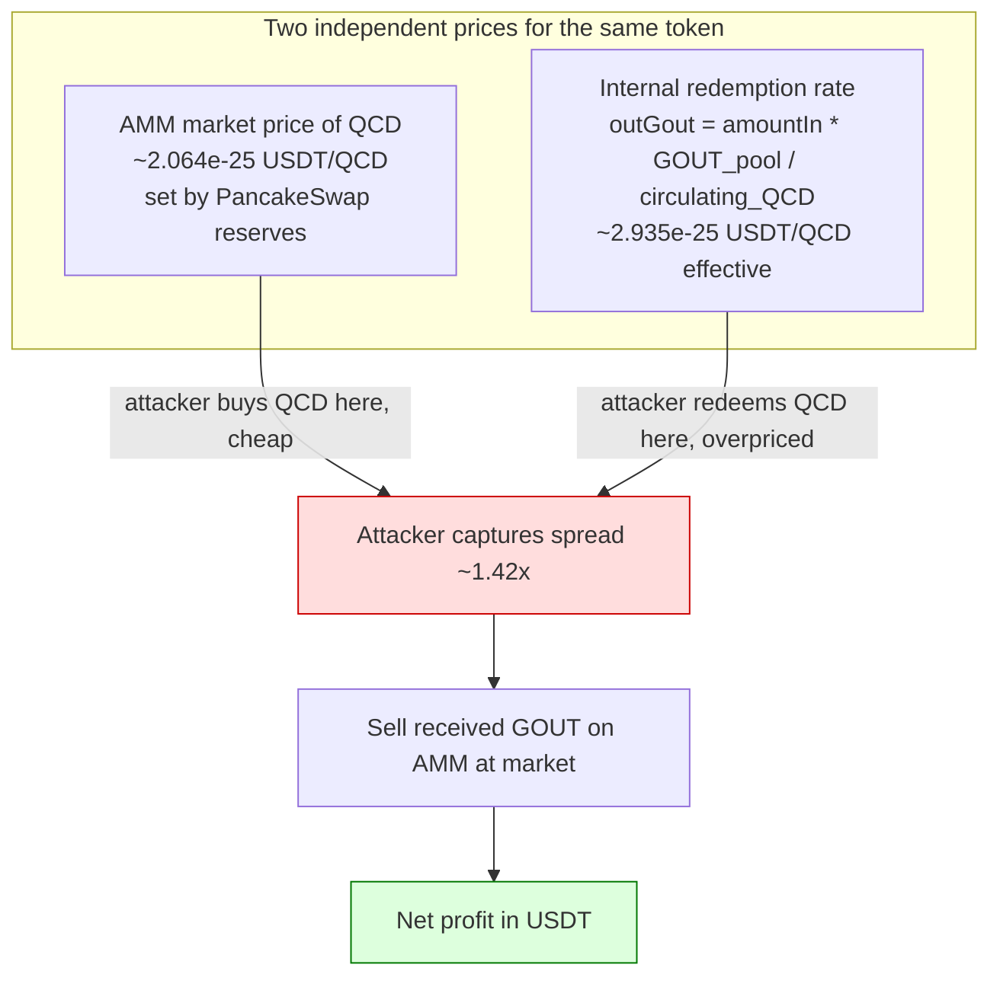

# BasePricePool `withdrawGOUT` price-decoupling — manipulable-balance oracle lets flash-bought QCD be redeemed for GOUT at an inflated internal rate
> **Vulnerability classes:** vuln/oracle/price-manipulation · vuln/oracle/spot-price · vuln/logic/price-calculation · vuln/defi/flash-loan-attack
> **Reproduction:** the PoC compiles & runs in an isolated Foundry project at [this project folder](.). Full verbose trace: [output.txt](output.txt). The vulnerable contract `BasePricePool` is verified on BscScan; its full source was fetched into [sources/BasePricePool_53FEF7/BasePricePool.sol](sources/BasePricePool_53FEF7/BasePricePool.sol) (Solidity `0.8.26`, no proxy, optimizer disabled).
---
## Key info
| | |
|---|---|
| **Loss** | ~802.57 USD (≈800.97 USDT net profit in the reproduced trace) |
| **Vulnerable contract** | BasePricePool — [`0x53FEF7d598A2db0920b2a9FdF27e5C401DC9fF85`](https://bscscan.com/address/0x53FEF7d598A2db0920b2a9FdF27e5C401DC9fF85) |
| **Attacker EOA** | [`0xd9A34aF0b97f13871287C317ea0e1E8C00be0630`](https://bscscan.com/address/0xd9A34aF0b97f13871287C317ea0e1E8C00be0630) |
| **Attack contract** | [`0x99e9Ee61cAC90715FdEDbB07D8786535964BF47b`](https://bscscan.com/address/0x99e9Ee61cAC90715FdEDbB07D8786535964BF47b) |
| **Attack tx** | [`0x21cbcc96cd7e31bcb5a724c7ae2ad886c0782d73f83dcbf49cf64f2c2eee4a51`](https://bscscan.com/tx/0x21cbcc96cd7e31bcb5a724c7ae2ad886c0782d73f83dcbf49cf64f2c2eee4a51) |
| **Chain / block / date** | BNB Smart Chain / 51,713,981 / 2025-06-19 |
| **Compiler** | Solidity `v0.8.26+commit.8a97fa7a`, optimizer disabled, runs 200 (verified on BscScan) |
| **Bug class** | `withdrawGOUT` prices the GOUT payout from the post-transfer QCD amount and a circulating-QCD denominator derived from manipulable on-chain token/pair balances, so an attacker can redeem freshly AMM-bought QCD for more GOUT value than the QCD cost. |

## TL;DR
BasePricePool is a simple "coin-to-GOUT" exchange: a user calls `withdrawGOUT(amount)` with a QCD (`coin`) allowance, the contract pulls the QCD, computes how many GOUT tokens to pay out via `getWithdrawOut(amount)`, sends the GOUT to the caller, and burns the received QCD by sending it to `0xdead`. The two tokens involved — QCD (`0x50D5…5F78`) and GOUT (`0xF86A…7FE7`) — are both tradeable on PancakeSwap, so they each have a real market price.

The fatal flaw is in `getWithdrawOut`: instead of pricing the QCD input against the live AMM price of QCD (or of GOUT), it uses a synthetic on-chain "circulating supply of QCD" denominator and the pool's own GOUT balance as a numerator:

```solidity
uint256 total = coinERC20.totalSupply() -
    coinERC20.balanceOf(address(0xdead)) -
    coinERC20.balanceOf(pairETH)    -
    coinERC20balanceOf(pairUSDT);
return amountIn.mul(IERC20(GOUT).balanceOf(address(this))).div(total);
```

This `outGout = amountIn × (GOUT held by pool) / (circulating QCD)` rate is set by the contract's internal reserves, not by the markets. Because the rate and the AMM price of QCD are decoupled, an attacker buys QCD on PancakeSwap with flash-borrowed USDT, immediately redeems that QCD for GOUT at the inflated internal rate, sells the GOUT back to USDT on PancakeSwap, repays the flash loan, and keeps the surplus.

In the reproduced fork run the attacker started with 299.91 USDT and ended with 1100.88 USDT — a net profit of **800.97 USDT** [output.txt:1564-1565]. The QCD bought for 1,900 USDT was redeemed for GOUT that sold for 2,700.97 USDT, i.e. the internal rate valued the attacker's QCD at roughly **1.42×** its AMM cost. The on-chain incident was reported at ~802.57 USD total loss to the protocol.

## Background — what BasePricePool does
BasePricePool is a small redemption contract. It holds a reserve of the GOUT token (`0xF86AF2FBcf6A0479B21b1d3a4Af3893F63207FE7`) and lets any user redeem units of a designated "coin" token (`coinAddress`, here QCD `0x50D5C6cbe5B5d4ae048F8AA3cdcdc5A2f10d5F78`) for GOUT. The owner sets the coin address via `setCoinAddress`, which also records the two relevant PancakeSwap pairs — `pairETH = getPair(WBNB, coin)` and `pairUSDT = getPair(USDT, coin)` — purely so they can be referenced as "locked" balances in the redemption formula.

The redemption flow (`withdrawGOUT`) is:

1. Pull `amount` of coin (QCD) from the caller via `transferFrom`, measuring the real received delta `_amount = balanceAfter - balanceBefore` (QCD is a fee-on-transfer token, so the received amount is slightly less than `amount`).
2. Compute `outGout = getWithdrawOut(_amount)`.
3. Transfer `outGout` GOUT to the caller.
4. Send the received `_amount` of QCD to `0xdead` (a burn sink).
5. Swap any BNB held by the contract back into GOUT via `swapBNBToGOUT()`.

The contract also exposes a `minWithdraw` floor (default `1000 ether`) and manager-set BNB-swap bounds, but none of these gate the price manipulation.

The intended design appears to be a fixed-ratio "coin → GOUT" swap where the ratio is anchored to (a) the pool's GOUT treasury and (b) the "free float" of QCD (total supply minus the burned and LP-locked amounts). The authors assumed this denominator was a stable measure of circulating QCD and that GOUT/coin price discovery happened elsewhere. Both assumptions break under a same-transaction market operation, because every input to the formula is a live, permissionless `balanceOf` reading.

## The vulnerable code
From the verified source [sources/BasePricePool_53FEF7/BasePricePool.sol](sources/BasePricePool_53FEF7/BasePricePool.sol):

### The manipulable price oracle (`getWithdrawOut`)
```solidity
function getWithdrawOut(uint256 amountIn) public view returns (uint256) {
    if(pairETH == address(0) || pairETH == address(0)) {
        return 0;
    }
    IERC20 coinERC20 = IERC20(coinAddress);
    uint256 total = coinERC20.totalSupply() -
        coinERC20.balanceOf(address(0xdead)) -
        coinERC20.balanceOf(pairETH) -
        coinERC20.balanceOf(pairUSDT);

    return amountIn.mul(IERC20(GOUT).balanceOf(address(this))).div(total);
}
```
Every term in `total` and the numerator `GOUT.balanceOf(address(this))` is a spot on-chain balance that any user can move with a single PancakeSwap trade, a token transfer, or (for the GOUT numerator, indirectly) a same-block swap into the contract. There is no TWAP, no committed oracle, no freshness check, and no sanity bound.

### The redemption entrypoint (`withdrawGOUT`)
```solidity
function withdrawGOUT(uint256 amount) external {
    require(amount >= minWithdraw, "Error: amount min");
    require(pairETH != address(0), "Error: pairETH error");
    require(pairUSDT != address(0), "Error: pairUSDT error");

    IERC20 coinERC20 = IERC20(coinAddress);

    uint256 balanceBefore = coinERC20.balanceOf(address(this));
    bool success = TransferHelper.safeTransferFrom(coinAddress,msg.sender,address(this),amount);
    uint256 balanceAfter = coinERC20.balanceOf(address(this));
    uint256 _amount = balanceAfter.sub(balanceBefore);
    require(success && _amount != 0,"Error");

    uint256 outGout = getWithdrawOut(_amount);                 // priced from manipulable balances
    uint256 goutBalance = IERC20(GOUT).balanceOf(address(this));
    require(goutBalance >= outGout,"Error: not enough");
    if(outGout > 0) {
        bool success2 =  TransferHelper.safeTransfer(GOUT,msg.sender,outGout);
        bool success1 =  TransferHelper.safeTransfer(coinAddress,address(0xdead),_amount);  // burn received coin
        emit WithdrawGOUT(_amount, coinAddress, outGout, success1, success2, block.timestamp);
    }
    swapBNBToGOUT();
}
```
`getWithdrawOut(_amount)` is called after the coin has already been pulled in, and it re-reads all balances live — so the rate is computed against the current state of the AMM pairs, which the caller is free to have just manipulated in the same transaction. Note also the double bug `if(pairETH == address(0) || pairETH == address(0))` (the second check should be `pairUSDT`), which is harmless here but signals the code was never carefully reviewed.

## Root cause — why it was possible
1. **Internal price oracle built from spot `balanceOf` reads.** `getWithdrawOut` derives the GOUT payout from `totalSupply − dead − pairETH − pairUSDT` (denominator) and the contract's own GOUT holding (numerator). Every component is a real-time, permissionlessly-movable balance. There is no time-weighting and no external price feed.
2. **Decoupling between the redemption rate and the market price of QCD/GOUT.** The `amountIn × GOUT_pool / circulating_QCD` rate is a fixed bookkeeping ratio, not a market price. Because QCD and GOUT are both tradeable on PancakeSwap, an attacker can buy the input token (QCD) at its real AMM price, then redeem it at the inflated internal rate, then dump the output token (GOUT) back at its real AMM price — capturing the spread.
3. **Same-block oracle manipulation is not prevented.** The contract performs no reentrancy guard, no per-block cooldown, and no reserve-ratio sanity check. The caller can sequence `buy QCD → withdrawGOUT → sell GOUT` inside one transaction so the manipulated balances are read at exactly the moment that benefits the attacker.
4. **No slippage/bounds protection on the payout.** `outGout` is unbounded relative to the value received; the only check is `goutBalance >= outGout` (the pool simply must hold enough GOUT to pay). With GOUT held at ~1.13e26 in the pool, a single 1,900-USDT buy extracted ~1.47e25 GOUT (~13% of the treasury) in one call.
5. **Measurement of `_amount` after the transfer (post-manipulation).** `_amount` is the *received* QCD after fees, computed from `balanceAfter − balanceBefore`. This is correct for fee handling, but it means the payout rate is applied to the exact post-buy QCD quantity the attacker just moved into the pool's reserves — locking in the manipulated numerator/denominator.

## Preconditions
- **Permissionless.** `withdrawGOUT` is `external` with no role check; any caller with a QCD allowance to the contract can invoke it. Only the `minWithdraw` floor (default `1000 ether`) applies, trivially satisfied.
- **Flash-loan capital.** The attack needs working capital to buy QCD. The on-chain incident used a DODO flash loan of 1,900 USDT; the reproduction models this as a same-transaction USDT transfer from the DODO pool that is repaid exactly before the transaction ends (the fork's `testExploit` `prank`s the pool transfer, and `assertEq` confirms the DODO pool balance is unchanged).
- **Sufficient GOUT liquidity in BasePricePool** and **sufficient GOUT and QCD liquidity on PancakeSwap** to absorb the buy and the sell without reverting. Both held at block 51,713,981.
- No privileged role or governance action is required.

## Attack walkthrough (with on-chain numbers from the trace)
All figures from [output.txt](output.txt); attacker USDT balance before = **299.908895** USDT, after = **1100.876705** USDT [output.txt:1564-1565].

| # | Step | Action | Amount | Trace ref |
|---|------|--------|--------|-----------|
| 1 | Flash-borrow USDT | DODO USDT pool transfers 1,900 USDT into the attack contract (models the DODO flashLoan) | 1,900.00 USDT in | [output.txt:1622-1623] |
| 2 | Buy QCD on PancakeSwap | `swapExactTokensForTokensSupportingFeeOnTransferTokens(USDT→QCD)`; routes USDT into the QCD/USDT pair `0x7b3F…c79`. Net QCD received after QCD's transfer fee | 1,900.00 USDT → 9,204.011e24 QCD (raw 9.204e27) | [output.txt:1629,1647,1664-1665] |
| 3 | `withdrawGOUT(9.204e27)` | BasePricePool pulls the QCD (`_amount = 9.204e27`), then computes the GOUT payout from manipulated balances | — | [output.txt:1669-1679] |
| 3a | Oracle read (denominator) | `total = totalSupply(2.1e29) − dead(8.903e28) − pairETH(3.849e28) − pairUSDT(1.1439e28) = 7.1037e28` | 7.1037e28 circulating QCD | [output.txt:1680-1687] |
| 3b | Oracle read (numerator) | `GOUT.balanceOf(pool) = 1.131e26` | 1.131e26 GOUT | [output.txt:1688-1689] |
| 3c | Payout computed | `outGout = 9.204e27 × 1.131e26 / 7.1037e28 = 1.4657e25 GOUT` | 1.4657e25 GOUT minted/transferred | [output.txt:1692-1694,1706] |
| 3d | QCD burned | Received `_amount` QCD sent to `0xdead` | 9.204e27 QCD → dead | [output.txt:1700-1701] |
| 4 | Sell GOUT for USDT | `swapExactTokensForTokensSupportingFeeOnTransferTokens(GOUT→USDT)`; GOUT is fee-on-transfer so net sold ≈ 1.4365e25 after GOUT fees; routed GOUT→WBNB→USDT | 1.4510e25 GOUT in → 2,700.967 USDT out | [output.txt:1710,1827,1837-region] |
| 5 | Repay flash loan | Transfer 1,900 USDT back to the DODO pool (balance restored exactly) | 1,900.00 USDT out | [output.txt:1837] |
| 6 | Forward profit | Remaining USDT sent to attacker EOA | **800.967 USDT** to attacker | [output.txt:1845] |

**Profit/loss accounting**

| Item | USDT |
|------|------|
| Flash-borrowed (in) | +1,900.00 |
| Buy QCD (out) | −1,900.00 |
| Sell GOUT (in) | +2,700.97 |
| Repay flash loan (out) | −1,900.00 |
| **Net to attacker** | **+800.97** |

The 9.204e27 QCD cost 1,900 USDT on the AMM (≈2.064e-25 USDT/QCD) but was redeemed for GOUT that sold for 2,700.97 USDT (≈2.935e-25 USDT/QCD effective). The internal redemption rate valued the attacker's QCD at **~1.42×** its market cost — that 42% spread, applied to 1,900 USDT of capital, is the profit.

```mermaid
sequenceDiagram
    participant A as Attacker
    participant D as DODO USDT pool
    participant P as PancakeSwap QCD/USDT pair
    participant B as BasePricePool
    participant G as PancakeSwap GOUT pairs

    A->>D: flashLoan 1900 USDT
    D->>A: 1900 USDT
    A->>P: swap USDT for QCD
    P->>A: 9.204e27 QCD at market price
    Note over A,B: Oracle balances now reflect the manipulated AMM state
    A->>B: withdrawGOUT(9.204e27)
    B->>B: getWithdrawOut: outGout = amount * GOUT_pool / circulating_QCD
    B->>A: 1.4657e25 GOUT
    B->>(0xdead): burn 9.204e27 QCD
    A->>G: swap GOUT for USDT
    G->>A: 2700.97 USDT
    A->>D: repay 1900 USDT
    Note over A: profit = 2700.97 - 1900 = 800.97 USDT
```



## Remediation
1. **Do not derive the redemption price from manipulable spot balances.** Replace `getWithdrawOut` with a real price source: a Chainlink/Pyth-style oracle for QCD and GOUT, or a TWAP over the PancakeSwap pair with a long enough window (e.g. 30 minutes) that same-block manipulation is uneconomic. Compute `outGout` as `amountIn * price_QCD / price_GOUT`, never from live `balanceOf` reads.
2. **Enforce strict slippage bounds on the payout.** Even with an oracle, cap `outGout` to a maximum notional value per call (e.g. `maxOutGoutPerTx`) and add a per-block or per-EVM-timestamp cooldown so a large redemption cannot clear a big slice of the GOUT treasury in one transaction.
3. **Add a reentrancy guard and a nonReentrant-style execution lock** on `withdrawGOUT` (and on `swapBNBToGOUT`), and perform the `swapBNBToGOUT()` call *before* the GOUT payout so the numerator is read before the caller can react to it — or better, read all price inputs at the start of the function and snapshot them.
4. **Snapshot the oracle inputs at transaction start.** If you must use the circulating-supply formula, record `total` and `GOUT.balanceOf(this)` once at entry and reuse those cached values; never let the caller's in-flight swaps change the rate mid-call.
5. **Add minimum-liquidity and freshness checks** (refuse to operate if either AMM pair has negligible reserves, or if the implied QCD/GOUT rate diverges from the AMM TWAP by more than a small tolerance).
6. **Fix the latent typo** `if(pairETH == address(0) || pairETH == address(0))` → the second operand should be `pairUSDT`; otherwise a missing USDT pair is silently treated as valid.

## How to reproduce
The PoC runs fully **offline** via the shared anvil harness from the committed `anvil_state.json` — no RPC needed:

```bash
_shared/run_poc.sh 2025-06-BasePricePool_exp -vvvvv
```

`<FOLDER>` is `2025-06-BasePricePool_exp` (the PROJECT name). The harness spins up a local anvil instance from `anvil_state.json`, which is a fork of **BNB Smart Chain at block 51,713,981**, then runs:

```bash
forge test --match-test testExploit -vvvvv
```

Expected tail of [output.txt](output.txt):

```
[PASS] testExploit() (gas: 1283905)
  Attacker Before exploit USDT Balance: 299.908895041543565356
  Attacker After exploit USDT Balance: 1100.876705385213009095
Suite result: ok. 1 passed; 0 failed; 0 skipped
```

The test asserts `attackerProfit > 790 USDT` (realized **800.967 USDT**) and that the DODO flash-loan source's USDT balance is restored to its pre-attack value. Note `FOUNDRY_EVM_VERSION=cancun` is required if the repo default EVM is older than Cancun (see the run note in the PoC header).

*Reference: Telegram alert — https://t.me/defimon_alerts/1306 .*
