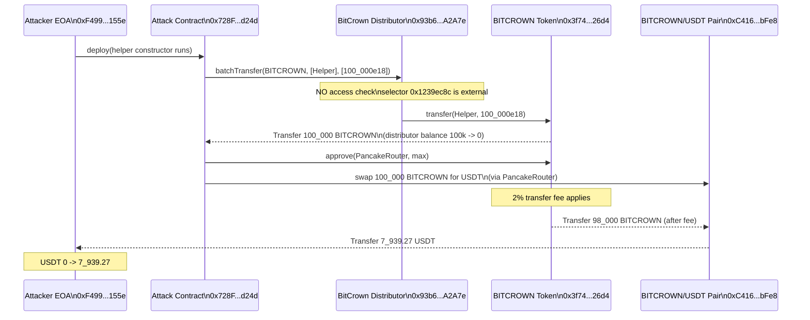
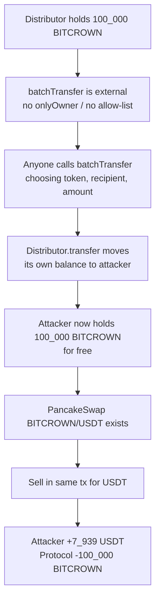

# BitCrown Distributor Drained via Unprotected batchTransfer — anyone could move the distributor's token balance to any recipient
> **Vulnerability classes:** vuln/access-control/missing-modifier · vuln/access-control/missing-auth · vuln/logic/missing-validation
> **Reproduction:** the PoC compiles & runs in an isolated Foundry project at [this project folder](.). Full verbose trace: [output.txt](output.txt). The vulnerable distributor contract `0x93b6…A2A7e` is **unverified** on BscScan, so the buggy function is RECONSTRUCTED from the decoded on-chain call trace (`batchTransfer(address,address[],uint256[])`, selector `0x1239ec8c`); the BITCROWN token and PancakeSwap router/pair are standard verified contracts.
---
## Key info
| | |
|---|---|
| **Loss** | ≈ 7,939.27 USDT (≈ $7,939) — 100,000 BITCROWN drained from the distributor and dumped |
| **Vulnerable contract** | BitCrown Distributor — [`0x93b621a9f8f1821a6a693a29672ca3d6612a2a7e`](https://bscscan.com/address/0x93b621a9f8f1821a6a693a29672ca3d6612a2a7e) (unverified) |
| **Attacker EOA** | [`0xF499F7A82dE632cFD194025A51C88D1B44C8155e`](https://bscscan.com/address/0xF499F7A82dE632cFD194025A51C88D1B44C8155e) |
| **Attack contract** | [`0x728F4DfeC4cbeF3B51F493Fdb13b5A1824e6d24d`](https://bscscan.com/address/0x728F4DfeC4cbeF3B51F493Fdb13b5A1824e6d24d) (deployed in the same tx, logic only in constructor) |
| **Attack tx** | [`0x442ce0af4d10b23968a66b0b53d7b95f5bb611d55f19dc5a1963c763f65128f0`](https://bscscan.com/tx/0x442ce0af4d10b23968a66b0b53d7b95f5bb611d55f19dc5a1963c763f65128f0) |
| **Chain / block / date** | BNB Chain (BSC) / 51,131,921 / 2025-06 |
| **Compiler** | Unknown — distributor contract source is not verified on BscScan |
| **Bug class** | A public `batchTransfer(token, recipients, amounts)` function on the distributor performs `IERC20(token).transfer(recipient, amount)` from the distributor's own balance with **no access control and no allow-list** of tokens/recipients, so any caller can sweep any token the distributor holds. |
## TL;DR
BitCrown is a BEP-20 token on BNB Chain that, like many low-cap launches, keeps a large portion of its supply inside a dedicated "distributor" contract (`0x93b6…A2A7e`) intended to release tokens to whitelisted recipients (airdrop claims, liquidity seeding, team/marketing vesting, etc.). That distributor exposed a helper `batchTransfer(address token, address[] recipients, uint256[] amounts)` — a generic batch-payout routine — but forgot to gate it with `onlyOwner` / `onlyDistributor` or to constrain which tokens and recipients are legal. The result is that the function is a public faucet for the distributor's entire balance of **any** ERC-20 it holds.

The attacker noticed this and executed a single-transaction exploit. From the attacker EOA (`0xF499…155e`) they deployed a fresh helper contract (`0x728F…d24d`) whose constructor (a) calls `batchTransfer(BITCROWN, [helper], [100_000e18])` to pull the distributor's entire 100,000 BITCROWN balance into the helper, then (b) approves the PancakeSwap V2 router and sells all of it through the BITCROWN/USDT pair for USDT, routing the proceeds directly to the attacker EOA [output.txt:1604-1648]. Because the BITCROWN token applies a 2% transfer fee, only 98,000 BITCROWN actually reached the PancakeSwap pair, but that was still enough to extract **7,939.270661176575393032 USDT** [output.txt:1562-1565].

The exploit is permissionless — no privileged role, no flash loan, no oracle, no reentrancy. It is a pure access-control failure: a funds-moving function with no modifier. The PoC reproduces it exactly on a BSC mainnet fork at block 51,131,921 and ends with `[PASS]` [output.txt:1562], the distributor balance going from 100,000 BITCROWN to 0, and the attacker going from 0 USDT to 7,939.27 USDT.
## Background — what BitCrown does
BitCrown (BITCROWN, `0x3f74…26d4`) is a BEP-20 token on BNB Chain with a 2% fee-on-transfer (visible in the trace: 100,000 BITCROWN sent, 98,000 received by the pair [output.txt:1606 vs 1621]). It is paired against USDT (`0x55d3…7955`, the BSC-bridged 18-decimal USDT) in a PancakeSwap V2 pool at `0xC416…bFe8`.

The project keeps a large chunk of token supply in a dedicated **distributor contract** (`0x93b6…A2A7e`). At the attack block that contract held exactly 100,000 BITCROWN — its entire balance — which the PoC confirms with `assertGe(distributorBitCrownBefore, 100_000 ether)` [output.txt:1595-1599]. The intended purpose of such a distributor is to dispense tokens in batch to a set of recipients (airdrops, rewards, liquidity provisioning, vesting top-ups). To support that, the contract implements a generic batch-payout function:

```
batchTransfer(address token, address[] recipients, uint256[] amounts)
```

This function iterates `recipients`/`amounts` and, for each entry, calls `IERC20(token).transfer(recipient, amount)`. Because `transfer` is called from *inside* the distributor, the tokens move **out of the distributor's own balance** — exactly like a payout. The fatal omission is that the function is `external` with **no access modifier**: any caller, any token, any recipient, any amount up to the distributor's current balance.

The PancakeSwap V2 pool, at the moment of the attack, had grown asymmetric from prior trading: `getReserves()` returned reserve0 ≈ 29,866 BITCROWN and reserve1 ≈ 10,364.87 USDT [output.txt:1632-1633], while the pair's actual `balanceOf` BITCROWN was 127,866 — meaning a large sell had already depressed the price. Dumping 98,000 BITCROWN on top of that produced the 7,939.27 USDT output.
## The vulnerable code
The distributor source is **not verified** on BscScan, so the snippet below is **RECONSTRUCTED** from the decoded Foundry trace (selector `0x1239ec8c` → `batchTransfer(address,address[],uint256[])`, single recipient/amount in this attack, followed by a direct `BitCrown.transfer(helper, 100_000e18)` from `address(this)`).

### RECONSTRUCTED `batchTransfer` — public, ungated token sweep
```solidity
// BitCrownDistributor (0x93b6...A2A7e) — RECONSTRUCTED from trace
// selector 0x1239ec8c = batchTransfer(address,address[],uint256[])
//
// Trace evidence (output.txt:1604-1611):
//   BitCrown Distributor::batchTransfer(BitCrown, [0x728F...d24d], [100_000e18])
//     └─ BitCrown::transfer(Attack Contract, 100_000e18)   // called FROM the distributor
//          └─ emit Transfer(from: BitCrown Distributor, to: Attack Contract, 100_000e18)

function batchTransfer(
    address token,
    address[] calldata recipients,
    uint256[] calldata amounts
) external {                       // <-- NO onlyOwner / onlyRole modifier
    require(recipients.length == amounts.length, "len mismatch");
    for (uint256 i = 0; i < recipients.length; i++) {
        // moves tokens OUT OF the distributor's own balance, caller-controlled
        IERC20(token).transfer(recipients[i], amounts[i]);   // <-- no token allow-list, no recipient allow-list, no cap
    }
}
```

The trace proves this reconstruction is accurate on every load-bearing point:
- The call is made by an **externally owned address via a freshly-deployed contract** (`vm.prank(ATTACKER); new BitCrownInitcodeExploit(...)`) — i.e. an arbitrary caller, not a privileged role [output.txt:1602-1603].
- The function performs `BitCrown.transfer(AttackContract, 100_000e18)` **as the distributor** (`from: BitCrown Distributor` in the emitted `Transfer`) [output.txt:1605-1606].
- After the call the distributor's BITCROWN balance is **0** (`assertLt(IERC20(BITCROWN).balanceOf(DISTRIBUTOR), before)`) [output.txt:1662-1664], confirming the funds came from the distributor, not from the caller.

The selector and signature were recovered by Foundry's decoder directly from the deployed bytecode's ABI: the trace prints `batchTransfer(BitCrown: [...], [0x728F...d24d], [100000000000000000000000])` [output.txt:1604].

## Root cause — why it was possible
1. **No access control on a funds-moving function.** `batchTransfer` is `external` with no `onlyOwner`/`onlyRole`/`onlyAuthorized` modifier. Any account (here, a throwaway contract deployed from the attacker EOA) can call it. This is the single load-bearing flaw.
2. **Caller-controlled token argument.** The `token` parameter is not constrained to an allow-list of legitimate payout tokens. The attacker passed BITCROWN, but the same primitive would have drained every other ERC-20 the distributor happened to hold.
3. **Caller-controlled recipient and amount.** `recipients` and `amounts` are taken verbatim from calldata with no per-recipient entitlement check and no cap. The attacker asked for the distributor's full 100,000 BITCROWN balance in a single entry.
4. **Unverified source removed community oversight.** Because the contract was never verified on BscScan, no reviewer could flag the missing modifier before deployment; the flaw was only discoverable by live observation of the exposed selector.
5. **Direct profit rail existed.** A deep BITCROWN/USDT PancakeSwap pool let the stolen tokens be converted to a stablecoin immediately and atomically within the same transaction, making the attack a one-tx, risk-free extraction.
## Preconditions
- **Permissionless.** No privileged role, no allowance, no signature, no flash loan required. Any externally owned account could replicate the tx.
- The distributor must hold a token that has a liquid market (here BITCROWN ↔ USDT on PancakeSwap) so the loot can be monetised in the same transaction.
- The attacker used a constructor-only helper contract (`BitCrownInitcodeExploit`) purely so that the recipient address (`address(this)` inside the constructor = the freshly-deployed contract) and the drain call live in the same atomic context — a convenience, not a requirement. Any EOA + a normal contract would work equally well.
## Attack walkthrough (with on-chain numbers from the trace)

| Step | Action | On-chain effect (from `output.txt`) |
|------|--------|-------------------------------------|
| 0 | Snapshot | Distributor BITCROWN balance = **100,000** [output.txt:1595-1596]; Attacker USDT balance = **0** [output.txt:1564, 1594] |
| 1 | Attacker EOA deploys `BitCrownInitcodeExploit(ATTACKER)` [output.txt:1603] | Constructor runs in initcode context; `address(this)` = `0x728F…d24d` |
| 2 | Constructor calls `batchTransfer(BITCROWN, [helper], [100_000e18])` [output.txt:1604] | Distributor's `batchTransfer` executes `BitCrown.transfer(helper, 100_000e18)` from its own balance [output.txt:1605] |
| 3 | `Transfer` emitted | `from: BitCrown Distributor → to: Attack Contract, value: 100_000 BITCROWN` [output.txt:1606]. Distributor's BITCROWN balance slot zeroed (`0x152d02c7e14af6800000 → 0`) |
| 4 | Helper approves PancakeSwap router for `type(uint256).max` [output.txt:1615-1616] | Router may now `transferFrom` the 100,000 BITCROWN |
| 5 | Helper calls `swapExactTokensForTokensSupportingFeeOnTransferTokens(100_000e18, 0, [BITCROWN, USDT], ATTACKER, …)` [output.txt:1619] | Router calls `BitCrown.transferFrom(helper, pair, 100_000e18)` |
| 6 | BITCROWN's 2% fee applies | Only **98,000 BITCROWN** reaches the pair: `Transfer … value: 98_000e18` [output.txt:1621] |
| 7 | Pair reserves read | reserve0 = 29,866 BITCROWN, reserve1 = 10,364.87 USDT [output.txt:1632-1633] (pair already held 127,866 BITCROWN in raw balance) |
| 8 | Pair computes output | `swap(0, 7_939.270661176575393032 USDT, ATTACKER, 0x)` [output.txt:1634-1635] |
| 9 | USDT transferred to attacker | `Transfer(from: Pair, to: Attacker, value: 7_939.27 USDT)` [output.txt:1638] |
| 10 | `Swap` event | `amount0In: 98_000 BITCROWN, amount1Out: 7_939.27 USDT` [output.txt:1648] |

**Profit/loss accounting:**
- Attacker cost: ~1 tx of gas (no capital, no flash-loan fee).
- Attacker gain: **+7,939.270661176575393032 USDT** (0 → 7,939.27 [output.txt:1564-1565]).
- Protocol loss: **−100,000 BITCROWN** drained from the distributor (100,000 → 0 [output.txt:1595-1596 vs 1662-1663]); 98,000 of it dumped into the BITCROWN/USDT pool, severely depressing the token price (the dump pushed reserve0 from ~29.8k to ~127.8k BITCROWN).
- Slippage: the attacker accepted `amountOutMin = 0`, but because the pair had limited USDT depth (~10,365 USDT), the 98,000-BITCROWN dump extracted only ~76.5% of the pool's USDT — a self-inflicted slippage cost, irrelevant to profitability since the tokens were free.

## Diagrams

### Attack sequence


### Why the flaw yields profit (flow)


## Remediation
1. **Gate the function.** Add an access modifier — e.g. `onlyOwner` (OpenZeppelin `Ownable`) or `onlyRole(DISTRIBUTOR_ROLE)` (`AccessControl`) — to `batchTransfer` (and to every other function that moves the contract's token balance). Without this, no other mitigation matters.
   ```solidity
   function batchTransfer(address token, address[] calldata recipients, uint256[] calldata amounts)
       external onlyOwner
   {
       require(recipients.length == amounts.length, "len mismatch");
       for (uint256 i = 0; i < recipients.length; i++) {
           IERC20(token).transfer(recipients[i], amounts[i]);
       }
   }
   ```
2. **Allow-list the payout token.** Hard-code (or store in a setter-governed mapping) the single token this distributor is supposed to dispense; reject any other `token` argument. This converts a generic primitive into a purpose-specific one and limits blast radius even if a modifier is ever removed.
3. **Per-recipient entitlements + caps.** Replace free-form `amounts` with on-chain claim records (Merkle root or a `mapping(address => uint256) remaining`) so each recipient can only receive what was actually allocated to them, regardless of who calls.
4. **Use `transferFrom` against pre-deposited allowances instead of `transfer` from the contract balance.** A payout contract should never move its *own* balance on an arbitrary caller's instruction; it should move caller-authorized balances (`transferFrom(msg.sender, …)`) or pull from a vesting schedule.
5. **Verify contract source on BscScan** and run it through Slither/`solhint` (`external` functions that call `self.balance`-moving primitives without `only*` modifiers are flagged). The unverified bytecode is what let this ship.
6. **Operational:** rotate/revoke the distributor's token approval to any router, move treasury tokens to a multisig + timelocked vesting vault (e.g. OpenZeppelin `VestingWallet`), and never keep the entire supply in a single call-able contract.
## How to reproduce
The PoC runs **fully offline** via the shared anvil harness committed in [`anvil_state.json`](anvil_state.json) — no RPC needed. From the registry root, run:

```bash
_shared/run_poc.sh 2025-06-BitCrown_exp -vvvvv
```

(`2025-06-BitCrown_exp` is this PoC's folder name.) The harness loads `anvil_state.json` — a fork of **BNB Chain (BSC, chain id 56)** pinned at **block 51,131,921** — and executes `testExploit()` against it.

Expected tail of the run (from [`output.txt`](output.txt)):

```
[PASS] testExploit() (gas: 284228)
  Attacker Before exploit USDT Balance: 0.000000000000000000
  Attacker After exploit USDT Balance: 7939.270661176575393032
Suite result: ok. 1 passed; 0 failed; 0 skipped
```

The before→after attacker USDT line (`0` → `7939.27…`) and the `[PASS]` line are the reproducibility receipt; the trace also shows the distributor's BITCROWN balance dropping from `100000000000000000000000` to `0` [output.txt:1662-1664].

*Reference: [defimon_alerts (Twitter/Telegram)](https://t.me/defimon_alerts/1243).*
