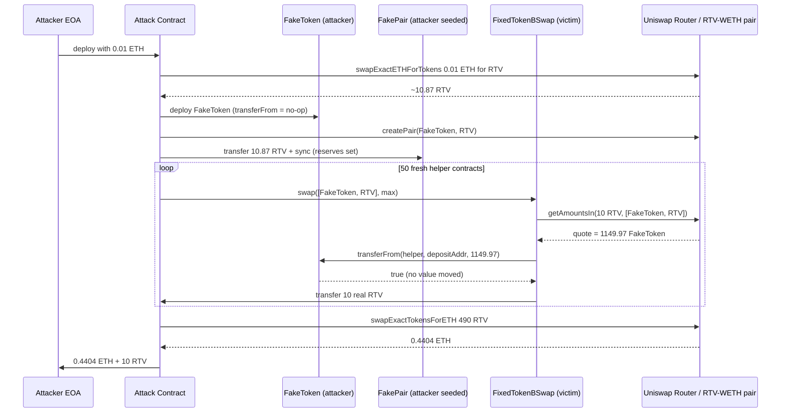
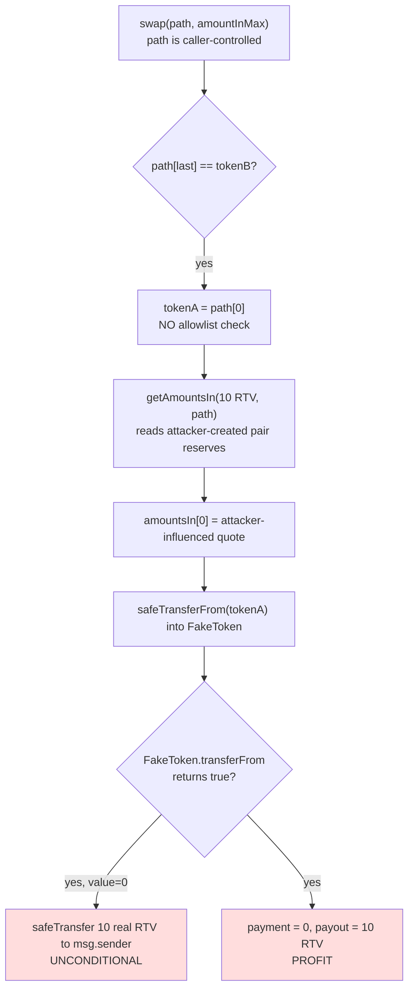

# FixedTokenBSwap RTV drain — attacker-supplied `path` + fake-token `transferFrom` bypass the on-chain price check, extracting a fixed 10 RTV per call

> **Vulnerability classes:** vuln/logic/price-calculation · vuln/oracle/price-manipulation · vuln/logic/missing-validation
> **Reproduction:** the PoC compiles & runs in an isolated Foundry project at [this project folder](.). Full verbose trace: [output.txt](output.txt). Vulnerable contract source is verified on Etherscan and was fetched into [sources/FixedTokenBSwap_746b3d/FixedTokenBSwap.sol](sources/FixedTokenBSwap_746b3d/FixedTokenBSwap.sol).

---

## Key info

| | |
|---|---|
| **Loss** | 500 RTV drained from the swap contract (~2,203.63 USD headline; ~1,617 USD in realized ETH after partial resale, plus 10 RTV kept). |
| **Vulnerable contract** | `FixedTokenBSwap` — [`0x746b3d7E9953cDaa8C4d4Fd3ee24fE133f459F32`](https://etherscan.io/address/0x746b3d7E9953cDaa8C4d4Fd3ee24fE133f459F32) |
| **Attacker EOA** | [`0x5FF8645BbC6c8B4390aA228A3e8bf08240F333b4`](https://etherscan.io/address/0x5FF8645BbC6c8B4390aA228A3e8bf08240F333b4) |
| **Attack contract** | [`0xDc1d6a8c90735eABa3d34395B9FFe160E1daAc02`](https://etherscan.io/address/0xDc1d6a8c90735eABa3d34395B9FFe160E1daAc02) |
| **Attack tx** | [`0x5db22f0edc1a9eda5343573da27dd2168c8a36a7f948401db76e22ba1fab71ea`](https://etherscan.io/tx/0x5db22f0edc1a9eda5343573da27dd2168c8a36a7f948401db76e22ba1fab71ea) |
| **Chain / block / date** | Ethereum mainnet / 22,710,987 / 2025-06 |
| **Compiler** | Solidity `v0.8.30+commit.73712a01` (verified on Etherscan; multi-file flat, optimizer disabled, 200 runs) |
| **Bug class** | `swap()` trusts a caller-supplied `path` against `UniswapV2Router.getAmountsIn` and then pulls `tokenA` via `transferFrom`, but never validates that `tokenA` is a real, valuable token — so an attacker-deployed fake token with a no-op `transferFrom` makes the "payment" free while the contract still sends a fixed 10 real RTV. |

## TL;DR

`FixedTokenBSwap` is a "swap X for a fixed 10 RTV" sale contract. The price of the input token is computed on-chain with `router.getAmountsIn(tokenBOut, path)`, where the entire `path` is caller-controlled and only constrained by `path[path.length-1] == tokenB` (RTV). The contract then performs `tokenA.transferFrom(msg.sender, depositAddress, amountsIn[0])` to collect payment, and unconditionally transfers 10 RTV to `msg.sender`.

The flaw is the combination of three independent mistakes: (1) `tokenA` is never whitelisted, so the attacker can pass a token they themselves deploy; (2) the price is read from an attacker-creatable Uniswap V2 pair, so the attacker controls the reserves the quote uses; (3) the "payment" is a plain `IERC20.transferFrom` that the attacker's fake token implements as a no-op returning `true`. The net effect is that the contract charges a fake token for real RTV, and the charge is free.

In the reproduced run, the attacker seeded a fake-token/RTV Uniswap pair with a small amount of RTV to make `getAmountsIn` return a plausible-looking number, then deployed 50 fresh helper contracts (each a new `msg.sender` to bypass the one-swap-per-address-per-day gate) that each called `swap([fakeToken, RTV], type(uint256).max)`. The contract drained 500 RTV (50 × 10) from its balance: 7,010 RTV → 6,510 RTV [output.txt:1613], [output.txt:3487]. The attacker resold 490 RTV to the legitimate RTV/WETH pool for 0.440427 ETH and kept 10 RTV [output.txt:1568]. The owner's `depositAddress` (`0x4f8EE3…C38C`) received zero real value because every `FakeToken.transferFrom` was a no-op [output.txt:1719].

## Background — what FixedTokenBSwap does

`FixedTokenBSwap` is an owner-operated token-sale contract. The intent: a user pays some amount of an arbitrary ERC-20 `tokenA` and, regardless of which token they pay in, receives a **fixed** output of 10 RTV (`tokenBOut = 10 * 1e18`). The "fair" input amount for any given `tokenA` is supposed to be discovered dynamically from Uniswap V2 via `getAmountsIn`.

Key state and parameters:

```solidity
IUniswapV2Router02 public router;          // Uniswap V2 router used ONLY for pricing
address public tokenB;                      // RTV — the token being sold
address public depositAddress;              // where input tokens are forwarded (owner)
uint256 public tokenBOut = 10 * 1e18;       // FIXED output per swap
uint256 public dailyCap = 1000 * 1e18;      // 100 swaps/day across all users
mapping(address => uint256) public lastSwappedAt; // one swap per address per day
```

Two anti-abuse mechanisms were intended:

1. **One swap per address per day** — `dailyLimitCheck(msg.sender)` reverts if the caller already swapped in the current timezone-adjusted day.
2. **Dynamic fair price** — instead of hardcoding an input amount, the contract calls `router.getAmountsIn(tokenBOut, path)` so that "you pay whatever the open market says 10 RTV is worth in your token."

The daily cap (1,000 RTV = 100 swaps/day) limits but does not prevent abuse — the attacker simply stopped at 50 swaps, well under the cap, because the legitimate RTV/WETH pool's depth capped how much RTV could be profitably resold.

## The vulnerable code

The entire vulnerability is the `swap` function. Source is verified; quoted from [sources/FixedTokenBSwap_746b3d/FixedTokenBSwap.sol:958-970](sources/FixedTokenBSwap_746b3d/FixedTokenBSwap.sol):

```solidity
function swap(address[] calldata path, uint256 amountInMax)
    external whenNotPaused nonReentrant dailyLimitCheck(msg.sender)
{
    require(path.length >= 2 && path[path.length - 1] == tokenB, "Invalid path");
    address tokenA = path[0];
    require(tokenA != tokenB, "TokenA cannot be TokenB");

    uint256[] memory amountsIn = router.getAmountsIn(tokenBOut, path);   // (1) attacker-controlled reserves
    require(amountInMax >= amountsIn[0], "amountInMax too low");

    IERC20(tokenA).safeTransferFrom(msg.sender, depositAddress, amountsIn[0]); // (2) attacker-controlled token
    IERC20(tokenB).safeTransfer(msg.sender, tokenBOut);                       // (3) fixed real payout

    emit Swapped(msg.sender, tokenA, tokenB, amountsIn[0], tokenBOut, block.timestamp);
}
```

### Why each line is fatal

- **`path` is fully caller-controlled.** The only check is `path[last] == tokenB`. `path[0]` (the "input token") can be anything except RTV itself. There is no allowlist.
- **`router.getAmountsIn(tokenBOut, path)` reads live Uniswap reserves for the `path[0]/path[1]` pair.** Anyone can `createPair` on the Uniswap V2 factory and `sync` arbitrary reserves — Uniswap V2 pairs are permissionless to create and seed. So the attacker both picks the token *and* sets the price the contract will trust.
- **`IERC20(tokenA).safeTransferFrom(...)` is a dynamic call into the attacker's fake token.** `safeTransferFrom` (OpenZeppelin) only requires the call to succeed and return `true` (or return nothing). A malicious token whose `transferFrom` returns `true` and moves nothing satisfies `safeTransferFrom` completely — the contract believes it was paid.
- **The payout `tokenB.safeTransfer(msg.sender, tokenBOut)` is unconditional** once the (fake) payment "succeeds." 10 real RTV leave the contract for every call.

The daily-limit and cap defenses are intact but irrelevant: the cap is 100 swaps/day and the attacker used only 50, and the per-address gate is defeated trivially because the attacker deploys a fresh contract for each call (each is a distinct `msg.sender` with `lastSwappedAt == 0`).

### The fake token (reconstructed from the PoC)

The historical on-chain fake token (`0x76C611e3…`) behaves identically to this PoC `FakeToken`:

```solidity
contract FakeToken {
    function balanceOf(address) external pure returns (uint256) { return 100 ether; }
    function transfer(address, uint256) external pure returns (bool) { return true; }
    function transferFrom(address, address, uint256) external pure returns (bool) { return true; } // no-op
    function approve(address, uint256) external pure returns (bool) { return true; }
}
```

`balanceOf` reports a non-zero balance so Uniswap's `getAmountsIn` math produces a finite quote; `transferFrom` returns `true` without moving anything, so `safeTransferFrom` is satisfied for free.

## Root cause — why it was possible

1. **Unrestricted `tokenA`.** `swap` accepts any address as `path[0]`. There is no allowlist of acceptable input tokens, so an attacker-supplied ERC-20 is honored as payment.
2. **Price source is attacker-manipulable.** `getAmountsIn` reads whatever Uniswap pair exists for `path[0]/path[1]`. Because Uniswap V2 pair creation is permissionless, the attacker creates and seeds the exact pair whose reserves produce the quote the contract will trust. The contract treats the attacker's pool as a trustworthy oracle.
3. **Payment is an unvalidated external call.** `safeTransferFrom` into a malicious `tokenA` does not move value but is treated as a successful payment. The contract never cross-checks that real value arrived (e.g., by checking `tokenA` balance before/after, or by requiring `tokenA` to be a known token).
4. **No separation between "price discovery" and "settlement."** The contract uses the same `path`/`tokenA` for both quoting *and* pulling funds, so compromising one compromises the other. A safe design either whitelists input tokens and routes the actual swap through the router, or settles in a single trusted token.
5. **Per-address gate is bypassable by redeployment.** `dailyLimitCheck(msg.sender)` keys on the caller's address; deploying a throwaway contract per swap resets the limit for free, so the only real ceiling is the global `dailyCap` (100 swaps ≈ 1,000 RTV).

## Preconditions

- **Permissionless** — no privileged role, no flash loan strictly required (the attacker used only 0.01 ETH seed to buy RTV for seeding the fake pair; this is ordinary working capital, not a loan dependency).
- The victim contract must hold RTV (`tokenB`): it held 7,010 RTV at the fork block [output.txt:1613].
- The contract must be unpaused (`whenNotPaused`) — it was.
- `dailyCap` (1,000 RTV) bounds a single attack to ≤100 swaps/day; the attacker used 50 because resale depth in the RTV/WETH pool was the binding constraint.

## Attack walkthrough (with on-chain numbers from the trace)

Seed capital: **0.01 ETH** [PoC `seed = 0.01 ether`; output.txt:1636 `wad: 10000000000000000`].

| Step | Action | On-chain result |
|---|---|---|
| 1 | Attacker swaps 0.01 ETH → RTV via the legitimate RTV/WETH pair to obtain seed RTV. | Receives **10.872 RTV** (`10872203881867151855`) [output.txt:1649], [output.txt:1662]. |
| 2 | Deploy `FakeToken`; `createPair(FakeToken, RTV)` on the Uniswap V2 factory. | Pair created [output.txt:1683]. |
| 3 | Transfer the 10.872 RTV into the fake pair and `sync()`. | Fake pair reserves: **10.872 RTV / 100 FakeToken** (`reserve0: 10872203881867151855`, `reserve1: 100000000000000000000`) [output.txt:1709]. This pair is now the "oracle" for the fake-token price. |
| 4 | Loop 50×: deploy a fresh `FixedTokenBSwapSingleSwap` contract, which calls `FixedTokenBSwap.swap([FakeToken, RTV], type(uint256).max)`. | Each call: `getAmountsIn(10 RTV, [FakeToken, RTV])` returns **1,149.97 FakeToken** (`1149970835871623904953`) [output.txt:1719]; `FakeToken.transferFrom` is a **no-op** returning `true` [output.txt:1719]; the contract sends **10 real RTV** to the helper [output.txt:1723], which forwards it to the attacker contract [output.txt:1741]. |
| 5 | After 50 swaps: attacker contract holds **490 RTV** (sold below) + **10 RTV** leftover = **500 RTV** total drained. | Victim balance: **7,010 RTV → 6,510 RTV** (−500 RTV) [output.txt:1613] → [output.txt:3487]. Owner `depositAddress` `0x4f8EE3…C38C` received **0** real value from all 50 fake `transferFrom`s. |
| 6 | Approve router and `swapExactTokensForETH(490 RTV …)` through the legitimate RTV/WETH pair. | Receives **0.440427002994961479 ETH** [output.txt:1568], [tail: `Withdrawal … wad: 440427002994961479`]. |
| 7 | Transfer remaining **10 RTV** + all ETH to the attacker EOA. | Attacker ends with **0.4404 ETH** + **10 RTV** [output.txt:1567-1568]. |

**Profit/loss accounting:**

- Cost: 0.01 ETH (seed, consumed in step 1 to buy RTV that seeded the fake pair — this RTV is then recovered into the 500 drained, so it is not an additional loss).
- Gross extracted from victim: 500 RTV.
- Realized: 490 RTV → 0.4404 ETH; 10 RTV retained.
- Net ETH profit to attacker: **0.440427 ETH** (~US$1,500 at the time), plus 10 RTV. The headline "2,203.63 USD" is the protocol's valuation of the 500 RTV drained.

The attack is deterministic and self-funding: the 0.01 ETH seed is converted into the fake-pair seed RTV, which is *also* part of what gets recycled, and the only on-chain cost is gas.

## Diagrams

Attack sequence:



Why the price check is hollow (control-flow of the flaw):



## Remediation

1. **Whelist input tokens.** Maintain an `allowedInputTokens` mapping (or a fixed set) and `require(allowedInputTokens[tokenA], "token not allowed")`. This alone stops the fake-token attack.
2. **Don't trust an attacker-supplied pair for pricing.** Either (a) hardcode the canonical RTV pair and only accept `tokenA = WETH` (use the dedicated `swapWithETH` path), or (b) price RTV via a manipulation-resistant oracle (TWAP / Chainlink) rather than a spot `getAmountsIn` on a permissionless pair.
3. **Verify value actually arrived.** If arbitrary tokens must be accepted, check the contract's own balance delta: measure `tokenA.balanceOf(address(this))` (or `depositAddress`'s balance) before and after `transferFrom` and require a real increase of `amountsIn[0]`. This defeats fee-on-transfer / no-op tokens.
4. **Restrict the path to a single hop and a known pair.** Require `path.length == 2` and that the `tokenA/tokenB` pair is the protocol's own, non-manipulable pair — do not let the caller invent the route.
5. **Decouple the per-user gate from address identity.** The "one swap per address per day" is meaningless when addresses are free. Either remove it in favor of the global cap, or bind it to a real identity (e.g., a signed coupon from the backend). At minimum, accept that `msg.sender`-based gates are bypassable by redeployment and do not rely on them for security.
6. **Cap risk with a per-transaction value check** (e.g., `require(amountsIn[0] * priceOf(tokenA) >= tokenBOutValueUsd)`) so that even a mispriced token cannot yield RTV below cost.

The deepest fix is #1 + #2: never let the caller choose both the payment token and the price source. Once `tokenA` is whitelisted and priced off a trusted source, the no-op-`transferFrom` trick and the fake-pair trick both become irrelevant.

## How to reproduce

The PoC runs fully **offline** via the shared anvil harness from the committed `anvil_state.json` — no RPC needed:

```bash
_shared/run_poc.sh 2025-06-FixedTokenBSwap_exp -vvvvv
```

- **Chain / fork block:** Ethereum mainnet, block **22,710,987** (state baked into `anvil_state.json`).
- **Expected result:** `[PASS] testExploit()` [output.txt:1562].
- **Attacker balance, before → after** [output.txt:1564-1568]:
  - ETH: `0.000000000000000000` → `0.440427002994961479`
  - RTV: `0.000000000000000000` → `10.000000000000000000`
- **Victim `FixedTokenBSwap` RTV balance, before → after:** `7,010.000000000000000000` → `6,510.000000000000000000` (−500 RTV) [output.txt:1613], [output.txt:3487].

The PoC is a source-level reconstruction of the historical initcode attack (the original `0xDc1d…Ac02` contract was deployed via `CREATE` from a crafted initcode in tx `0x5db2…71ea`); the reconstruction uses ordinary Solidity contracts (`FixedTokenBSwapAttack`, `FixedTokenBSwapSingleSwap`, `FakeToken`) that reproduce the exact same call sequence and economic outcome.

*Reference: [https://t.me/defimon_alerts/1280](https://t.me/defimon_alerts/1280).*
